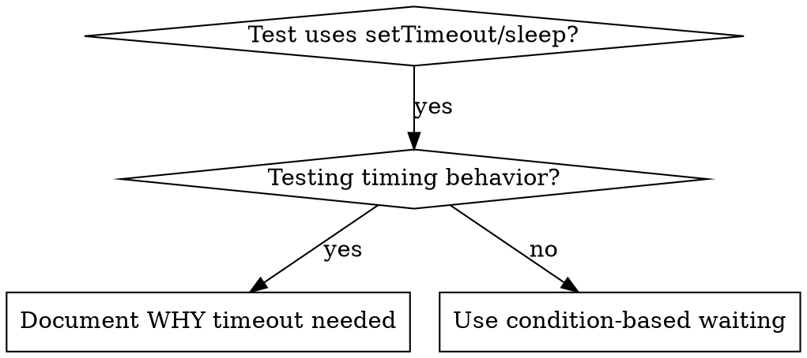

# Condition-Based Waiting

## Overview

Flaky tests often guess at timing with arbitrary delays. This creates race conditions where tests pass on fast machines but fail under load or in CI.

**Core principle:** Wait for the actual condition you care about, not a guess about how long it takes.

## When to Use



**Use when:**

- Tests have arbitrary delays (`setTimeout`, `sleep`, `time.sleep()`)
- Tests are flaky (pass sometimes, fail under load)
- Tests timeout when run in parallel
- Waiting for async operations to complete

**Don't use when:**

- Testing actual timing behavior (debounce, throttle intervals)
- Always document WHY if using arbitrary timeout

## Core Pattern

```typescript
// ❌ BEFORE: Guessing at timing
await new Promise((r) => setTimeout(r, 50));
const result = getResult();
expect(result).toBeDefined();

// ✅ AFTER: Waiting for condition
await waitFor(() => getResult() !== undefined);
const result = getResult();
expect(result).toBeDefined();
```

## Quick Patterns

| Scenario          | Pattern                                              |
| ----------------- | ---------------------------------------------------- |
| Wait for event    | `waitFor(() => events.find(e => e.type === 'DONE'))` |
| Wait for state    | `waitFor(() => machine.state === 'ready')`           |
| Wait for count    | `waitFor(() => items.length >= 5)`                   |
| Wait for file     | `waitFor(() => fs.existsSync(path))`                 |
| Complex condition | `waitFor(() => obj.ready && obj.value > 10)`         |

## Implementation

Generic polling function:

```typescript
async function waitFor<T>(
  condition: () => T | undefined | null | false,
  description: string,
  timeoutMs = 5000,
): Promise<T> {
  const startTime = Date.now();

  while (true) {
    const result = condition();
    if (result) return result;

    if (Date.now() - startTime > timeoutMs) {
      throw new Error(`Timeout waiting for ${description} after ${timeoutMs}ms`);
    }

    await new Promise((r) => setTimeout(r, 10)); // Poll every 10ms
  }
}
```

See `condition-based-waiting-example.ts` in this directory for complete implementation with domain-specific helpers (`waitForEvent`, `waitForEventCount`, `waitForEventMatch`) from actual debugging session.

## Common Mistakes

**❌ Polling too fast:** `setTimeout(check, 1)` - wastes CPU
**✅ Fix:** Poll every 10ms

**❌ No timeout:** Loop forever if condition never met
**✅ Fix:** Always include timeout with clear error

**❌ Stale data:** Cache state before loop
**✅ Fix:** Call getter inside loop for fresh data

## When Arbitrary Timeout IS Correct

```typescript
// Tool ticks every 100ms - need 2 ticks to verify partial output
await waitForEvent(manager, 'TOOL_STARTED'); // First: wait for condition
await new Promise((r) => setTimeout(r, 200)); // Then: wait for timed behavior
// 200ms = 2 ticks at 100ms intervals - documented and justified
```

**Requirements:**

1. First wait for triggering condition
2. Based on known timing (not guessing)
3. Comment explaining WHY

## Real-World Impact

From debugging session (2025-10-03):

- Fixed 15 flaky tests across 3 files
- Pass rate: 60% → 100%
- Execution time: 40% faster
- No more race conditions
