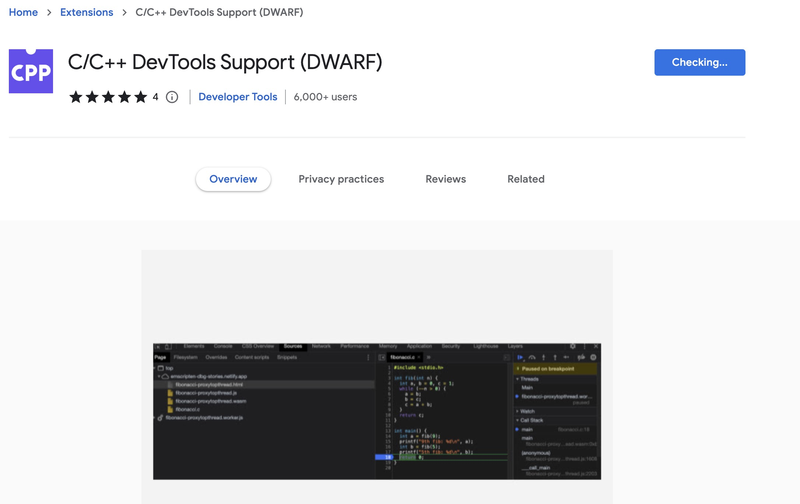
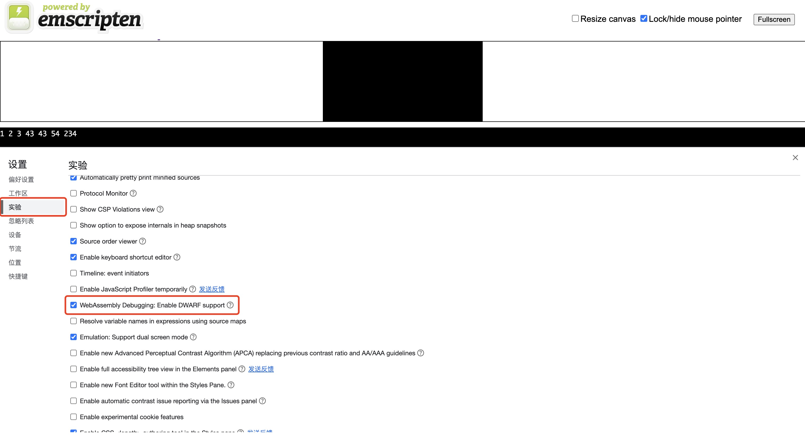
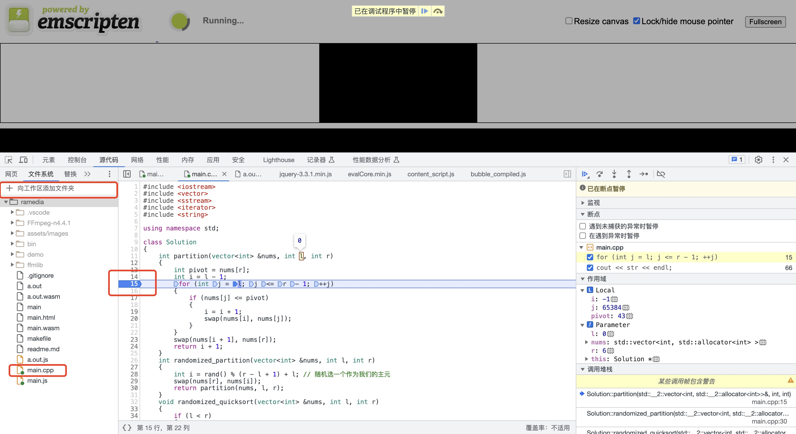

# C++

如果要为 macOS 进行 C++ 开发，建议安装 Clang 编译器。只需在“终端”窗口中运行以下命令即可安装命令行开发人员工具：

```sh
xcode-select --install
```

然后，要验证已安装 clang，请在“终端”窗口中运行以下命令。你应该会看到一条消息，其中包含有关所使用的 Clang 版本的信息。

```sh
clang --version
```

```c++

#include<iostream>

using namespace std;

int main(){
    cout << "Hello~" << endl;
    return 0;
}

```

命令行执行：

```sh
clang++ main.cpp
# if meet some error like this: error: non-aggregate type 'vector<int>' cannot be initialized with an initializer list
# g++ -std=c++11
./a.out
```

# WebAssembly

官网：<https://emscripten.org/>

Mac 安装 `Emscripten`

```sh
brew install emscripten
```

安装完成后测试是否存在

```sh
emcc -v
```

编译 `C++` 代码

```sh
emcc main.cpp
```

命令成功执行后，你会发现 `main.cpp` 同级目录下会生成两个文件：`a.out.wasm` 和 `a.out.js`。其中，`a.out.wasm` 就是我们想要的 `Wasm` 模块。

```sh
node a.out.js
```

`Node.js` 是支持 `Wasm` 模块的（自 `Node.js 8` 开始）。

如果你希望到浏览器环境下测试文件，那么你可以在命令行下使用如下指令编译我们的 `C++` 代码：

```sh
emcc main.cpp -o main.html
```

命令成功执行后，`main.cpp` 同级目录下会再多出三个文件：`main.wasm`、`main.js` 和 `main.html`。你可以用`Live Server`打开 `main.html` 文件，就能看到结果了：


## 调试 WebAssembly

我们可以在编译 `WebAssembly` 的时候加入 `-v` 参数来让 `Emscripten` 为我们输出更多编译信息，以辅助我们发现 `C++` 代码中的问题。

如果你想在运行期调试 `WebAssembly` 的代码，那么你需要使用如下指令重新编译 `WebAssembly` 模块以让你的 `.wasm` 文件包含调试信息：

```sh
emcc -g main.cpp -o main.html
```

参数解释：

- `-g`: 编译 + 链接，同时保留调试信息。当编译为目标文件时，这与 Clang 和 gcc 中的相同，它将 DWARF 调试信息添加到目标文件中。
- `-o`: 链接可执行文件时，目标文件扩展名定义要生成的输出类型，默认是 `JavaScript`。如果指定是`html`,会生成一个`html`加`JavaScript`的可运行文件。

接着你需要为你的谷歌浏览器安装一个插件 [`C/C++ DevTools Support (DWARF)`](https://chrome.google.com/webstore/detail/cc%20%20-devtools-support-dwa/pdcpmagijalfljmkmjngeonclgbbannb) ，这是 `Chrome DevTools` 开发团队为开发者提供的专门用于调试 `WebAssembly` 的浏览器插件，注意安装过程中要保持良好的网络环境。



安装完成后，打开 `Chrome` 浏览器的调试工具 `DevTools`，点击设置按钮（⚙），打开调试工具的设置面板，勾选实验选项卡下的 `WebAssembly Debugging: Enable DWARF support` 选项。



接着退回到 `DevTools` 主面板，把你的源码路径添加到 `DevTools` 的文件系统中，然后在 `main.cpp` 中下一个断点，刷新 `main.html` 页面，你会发现刚刚下的断点已经命中了，而且调用堆栈也会显示在 `DevTools` 右侧的面板中，如下图所示：



## C++ 与 JS 的交互

### ccall

如果需要调用一个在 C 语言自定义的函数，你可以使用 Emscripten 中的 ccall() 函数，以及 EMSCRIPTEN_KEEPALIVE 声明

> Emscripten 会消除未从编译代码中调用的函数的死代码。虽然这确实最大限度地减少了代码大小，但它可以删除您计划自己调用的函数（在已编译的代码之外）。比如通过 EMSCRIPTEN_KEEPALIVE 和 EXPORTED_FUNCTIONS 去指定需要导出的函数。EMSCRIPTEN_KEEPALIVE 的作用是告诉编译器和链接器保留符号并将其导出，就像将其添加到 EXPORTED_FUNCTIONS 中一样。

默认情况下，Emscripten 生成的代码只会调用 main() 函数，其他的函数将被视为无用代码。在一个函数名之前添加 EMSCRIPTEN_KEEPALIVE 能够防止这样的事情发生。你需要导入 emscripten.h 库来使用 EMSCRIPTEN_KEEPALIVE。

EMSCRIPTEN_KEEPALIVE:

```c++

// EMSCRIPTEN_KEEPALIVE

void EMSCRIPTEN_KEEPALIVE my_function() { printf("I am being kept alive\n"); }

```

EXPORTED_FUNCTIONS:

```sh
# EXPORTED_FUNCTIONS

emcc -sEXPORTED_FUNCTIONS=_main,_my_func  ...
```

> 如果您有 main() 函数，则\_main 应该位于导出列表中，如该示例所示。否则，它将作为死代码被删除；默认情况下没有特殊的逻辑来保持 main() 的活动。

```html
<button id="wasm">运行自定义函数</button>

<script type="text/javascript">
  document.getElementById('wasm').addEventListener('click', function () {
    alert('检查控制台');
    var result = Module.ccall(
      'main', // name of C function
      null, // return type
      null, // argument types
      null, // arguments
    );
  });
</script>
```

[](https://emscripten.org/docs/porting/connecting_cpp_and_javascript/Interacting-with-code.html)

```sh
emcc -v main.cpp -o main.html -sEXPORTED_FUNCTIONS=_quick_sort,_main -sEXPORTED_RUNTIME_METHODS=ccall,cwrap
```

EXPORTED_RUNTIME_METHODS 是 Emscripten 中一个用于指定哪些运行时方法可以在生成的 JavaScript 文件中被访问的选项。

通过设置 EXPORTED_RUNTIME_METHODS，你可以控制哪些 Emscripten 运行时的 API 函数被导出，使其可以从生成的 JavaScript 文件中访问和调用。这对于需要在 JavaScript 中调用特定 Emscripten 提供的功能非常有用。

假设你有一个简单的 C 文件 hello.c：

```c++
#include <stdio.h>

void say_hello() {
    printf("Hello, World!\n");
}
```

你可以使用以下命令编译这个文件，同时导出 cwrap 和 ccall 方法：

```c++
emcc hello.c -o hello.js -s EXPORTED_RUNTIME_METHODS=['cwrap','ccall']
```

在这个例子中，我们导出了 cwrap 和 ccall 方法，这两个方法在 Emscripten 中常用于从 JavaScript 调用 C 函数。生成的 hello.js 文件可以在浏览器中使用。

接下来，你可以在 JavaScript 中这样使用这些导出的方法：

```html
<!doctype html>
<html>
  <head>
    <title>Hello Emscripten</title>
  </head>
  <body>
    <script src="hello.js"></script>
    <script>
      // 在模块加载完成后调用
      Module.onRuntimeInitialized = () => {
        // 使用 cwrap 创建一个 JavaScript 包装函数
        const sayHello = Module.cwrap('say_hello', null, []);

        // 调用包装函数
        sayHello();
      };
    </script>
  </body>
</html>
```

在这个例子中，我们通过 Module.cwrap 方法创建了一个 JavaScript 包装函数 sayHello，并调用了它。由于 say_hello 是一个无返回值且无参数的 C 函数，因此我们在 cwrap 中传入了 null 和一个空数组 []。

使用 EXPORTED_RUNTIME_METHODS 可以确保 cwrap 和 ccall 方法在生成的 JavaScript 文件中被导出，并且可以在 JavaScript 中访问和使用这些方法。

### Emscripten 运行时的 API 函数

Emscripten 运行时的 API 函数是指在生成的 JavaScript 文件中提供的用于与编译后的 WebAssembly 或 asm.js 代码交互的函数。Emscripten 提供了多种运行时 API 函数，方便开发者在 JavaScript 中调用 C/C++ 代码，处理内存，进行文件系统操作等。

下面是一些常用的 Emscripten 运行时 API 函数及其用途：

#### 1. cwrap:

- 用于创建一个 JavaScript 函数，该函数可以调用编译后的 WebAssembly 函数。
- 语法：

```js
Module.cwrap('function_name', 'return_type', ['arg_type1', 'arg_type2', ...])
```

#### 2. ccall:

- 用于直接调用编译后的 WebAssembly 函数。
  语法：

```js
Module.ccall('function_name', 'return_type', ['arg_type1', 'arg_type2', ...], [arg1, arg2, ...])
```

#### 3. UTF8ToString:

- 将指向 UTF-8 编码字符串的指针转换为 JavaScript 字符串。
  语法：

```js
UTF8ToString(ptr);
```

#### 4. allocate:

- 在 Emscripten 堆中分配内存。
  语法：

```js
Module._malloc(size);
```

#### 5. HEAP8 / HEAP16 / HEAP32 / HEAPU8 / HEAPU16 / HEAPU32 / HEAPF32 / HEAPF64:

- 直接访问 Emscripten 堆内存的视图，允许读取和写入不同类型的数据。
  例如：Module.HEAP32[ptr >> 2] 读取 ptr 位置的 32 位整数。

Emscripten 提供了一系列 API 函数和视图，用于直接访问和操作 WebAssembly 内存。这些 API 和视图在处理复杂的数据结构、字符串、数组等方面非常有用。下面是 allocate 和各种 HEAP 视图的用法。

allocate 函数用于在 Emscripten 堆中分配内存。该函数在较新的 Emscripten 版本中已经不推荐使用，通常推荐使用 \_malloc 代替。

```js
// 分配 1024 字节的内存
var ptr = Module._malloc(1024);

// 使用完毕后释放内存
Module._free(ptr);
```

HEAP 视图
Emscripten 提供了多个 HEAP 视图，用于访问 WebAssembly 内存中的数据。这些视图本质上是 TypedArray，它们允许你读取和写入不同类型的数据。

- HEAP8: 8-bit signed integer (Int8Array)
- HEAPU8: 8-bit unsigned integer (Uint8Array)
- HEAP16: 16-bit signed integer (Int16Array)
- HEAPU16: 16-bit unsigned integer (Uint16Array)
- HEAP32: 32-bit signed integer (Int32Array)
- HEAPU32: 32-bit unsigned integer (Uint32Array)
- HEAPF32: 32-bit floating point (Float32Array)
- HEAPF64: 64-bit floating point (Float64Array)

以下是一个完整的示例，展示如何使用 \_malloc 分配内存，并使用 HEAPU8 视图操作数据：

```c++
#include <emscripten.h>
#include <string.h>

EMSCRIPTEN_KEEPALIVE
void set_memory(char* ptr, int size) {
    memset(ptr, 42, size); // 将内存区域设置为 42 (即 '*')
}
```

编译：

```sh
emcc memory.c -o memory.js -s EXPORTED_RUNTIME_METHODS=['_malloc', '_free', 'ccall']
```

JavaScript 代码

```html
<!doctype html>
<html>
  <head>
    <title>Emscripten Memory Example</title>
  </head>
  <body>
    <script src="memory.js"></script>
    <script>
      // 在模块加载完成后调用
      Module.onRuntimeInitialized = () => {
        // 分配 10 字节的内存
        var size = 10;
        var ptr = Module._malloc(size);

        // 调用 C 函数来设置内存
        Module.ccall('set_memory', null, ['number', 'number'], [ptr, size]);

        // 使用 HEAPU8 视图读取内存
        var view = new Uint8Array(Module.HEAPU8.buffer, ptr, size);
        for (var i = 0; i < size; i++) {
          console.log(view[i]); // 输出 42
        }

        // 释放内存
        Module._free(ptr);
      };
    </script>
  </body>
</html>
```

更复杂的示例
假设你需要传递一个数组到 C 函数，并且函数会修改这个数组。

C 代码 (假设文件名为 array.c)

```c++

#include <emscripten.h>

EMSCRIPTEN_KEEPALIVE
void double_values(int* array, int size) {
    for (int i = 0; i < size; i++) {
        array[i] *= 2;
    }
}

```

编译

```sh
emcc array.c -o array.js -s EXPORTED_RUNTIME_METHODS=['_malloc', '_free', 'ccall']
```

JavaScript 代码

```html
<!doctype html>
<html>
  <head>
    <title>Emscripten Array Example</title>
  </head>
  <body>
    <script src="array.js"></script>
    <script>
      // 在模块加载完成后调用
      Module.onRuntimeInitialized = () => {
        // 创建一个 JavaScript 数组
        var array = [1, 2, 3, 4, 5];
        var size = array.length;

        // 分配足够的内存来存储数组
        var ptr = Module._malloc(size * 4); // 每个整数占 4 字节

        // 使用 HEAP32 视图将数组复制到 Emscripten 堆
        Module.HEAP32.set(array, ptr / 4);

        // 调用 C 函数来修改数组
        Module.ccall('double_values', null, ['number', 'number'], [ptr, size]);

        // 使用 HEAP32 视图读取修改后的数组
        var doubledArray = new Int32Array(Module.HEAP32.buffer, ptr, size);
        console.log(doubledArray); // 输出：[2, 4, 6, 8, 10]

        // 释放内存
        Module._free(ptr);
      };
    </script>
  </body>
</html>
```

在这个示例中，我们分配了一块足够大的内存以存储一个整数数组，并使用 HEAP32 视图将 JavaScript 数组复制到 Emscripten 堆中。然后，我们调用 C 函数修改数组，并使用 HEAP32 视图读取修改后的数组。

#### 6. addFunction:

将 JavaScript 函数指针添加到 WebAssembly 表中，使其可以从 WebAssembly 代码中调用。

语法：

```js
Module.addFunction(func, 'sig');
```

#### 7. removeFunction:

- 从 WebAssembly 表中移除函数指针。
  语法：

```js
Module.removeFunction(func_ptr);
```

下面是一个完整的示例，演示如何使用 addFunction 和 removeFunction：

假设你有一个简单的 C 文件 call_js.c：

```c++
#include <emscripten.h>

// 声明一个外部函数指针
typedef int (*func_ptr)(int, int);

EM_JS(int, call_js_function, (func_ptr f, int a, int b), {
    return f(a, b);
});

int main() {
    return 0;
}

```

编译这个文件：

```sh
emcc call_js.c -o call_js.js -s EXPORTED_RUNTIME_METHODS=['addFunction','removeFunction']
```

在 JavaScript 中调用这个函数：

```html
<!doctype html>
<html>
  <head>
    <title>Emscripten addFunction Example</title>
  </head>
  <body>
    <script src="call_js.js"></script>
    <script>
      // 在模块加载完成后调用
      Module.onRuntimeInitialized = () => {
        // 定义一个 JavaScript 函数
        function add(a, b) {
          return a + b;
        }

        // 将 JavaScript 函数添加到 WebAssembly 表中
        var addPtr = Module.addFunction(add, 'iii');

        // 调用 WebAssembly 函数
        var result = Module._call_js_function(addPtr, 5, 7);
        console.log(result); // 输出：12

        // 从 WebAssembly 表中移除函数指针
        Module.removeFunction(addPtr);
      };
    </script>
  </body>
</html>
```

在这个示例中，我们首先定义了一个 JavaScript 函数 add，并使用 Module.addFunction 将其添加到 WebAssembly 表中。然后，我们调用 WebAssembly 函数 \_call_js_function，传入函数指针和参数。最后，我们使用 Module.removeFunction 从 WebAssembly 表中移除了函数指针。

#### 8. getValue 和 setValue:

- 用于读取和写入 Emscripten 堆内存中的值。
  语法：

```js
Module.getValue(ptr, type) 和 Module.setValue(ptr, value, type)
```

getValue 和 setValue 是 Emscripten 提供的两个 API，用于读取和写入 WebAssembly 内存中的值。这些函数可以处理不同类型的数据，如整数、浮点数和指针。

getValue 用于从指定内存地址读取值。其语法如下：

```js
var value = Module.getValue(ptr, type);
```

ptr 是内存地址（指针）。
type 是值的类型，可以是 'i8', 'i16', 'i32', 'i64', 'float', 'double', 'i8*', 'i16*', 'i32\*' 等。

setValue 用于向指定内存地址写入值。其语法如下：

Module.setValue(ptr, value, type);

ptr 是内存地址（指针）。
value 是要写入的值。
type 是值的类型，可以是 'i8', 'i16', 'i32', 'i64', 'float', 'double', 'i8*', 'i16*', 'i32\*' 等。

下面是一个示例，展示如何使用 getValue 和 setValue 读取和写入内存中的值。

```c++
#include <emscripten.h>

EMSCRIPTEN_KEEPALIVE
int get_value_from_memory(int* ptr) {
    return *ptr;
}

EMSCRIPTEN_KEEPALIVE
void set_value_in_memory(int* ptr, int value) {
    *ptr = value;
}
```

编译

```sh
emcc values.c -o values.js -s EXPORTED_RUNTIME_METHODS=['getValue', 'setValue', '_malloc', '_free']
```

JavaScript 代码

```js
<!DOCTYPE html>
<html>
<head>
    <title>Emscripten getValue and setValue Example</title>
</head>
<body>
    <script src="values.js"></script>
    <script>
        // 在模块加载完成后调用
        Module.onRuntimeInitialized = () => {
            // 分配 4 字节的内存
            var ptr = Module._malloc(4);

            // 使用 setValue 写入值
            Module.setValue(ptr, 42, 'i32');

            // 使用 getValue 读取值
            var value = Module.getValue(ptr, 'i32');
            console.log(value); // 输出：42

            // 调用 C 函数读取值
            var cValue = Module.ccall('get_value_from_memory', 'number', ['number'], [ptr]);
            console.log(cValue); // 输出：42

            // 调用 C 函数写入值
            Module.ccall('set_value_in_memory', null, ['number', 'number'], [ptr, 84]);

            // 使用 getValue 读取新的值
            var newValue = Module.getValue(ptr, 'i32');
            console.log(newValue); // 输出：84

            // 释放内存
            Module._free(ptr);
        };
    </script>
</body>
</html>
```

在这个示例中，我们分配了一块 4 字节的内存（用于存储一个 32 位整数），并使用 setValue 写入值 42，然后使用 getValue 读取这个值。接着，我们调用 C 函数 get_value_from_memory 来读取内存中的值，并调用 C 函数 set_value_in_memory 来修改内存中的值。最后，我们使用 getValue 再次读取修改后的值。

假设你需要在 WebAssembly 中处理更复杂的数据结构，如结构体。你可以使用 getValue 和 setValue 来操作结构体的成员。

```c++
#include <emscripten.h>

typedef struct {
    int x;
    float y;
} Point;

EMSCRIPTEN_KEEPALIVE
void set_point(Point* p, int x, float y) {
    p->x = x;
    p->y = y;
}

EMSCRIPTEN_KEEPALIVE
void get_point(Point* p, int* x, float* y) {
    *x = p->x;
    *y = p->y;
}
```

编译

```sh
emcc struct.c -o struct.js -s EXPORTED_RUNTIME_METHODS=['getValue', 'setValue', '_malloc', '_free', 'ccall']
```

JavaScript 代码

```html
<!doctype html>
<html>
  <head>
    <title>Emscripten Struct Example</title>
  </head>
  <body>
    <script src="struct.js"></script>
    <script>
      // 在模块加载完成后调用
      Module.onRuntimeInitialized = () => {
        // 分配 Point 结构体的内存
        var pointSize = 8; // 假设 int 和 float 各占 4 字节
        var ptr = Module._malloc(pointSize);

        // 调用 C 函数设置结构体
        Module.ccall('set_point', null, ['number', 'number', 'number'], [ptr, 3, 4.5]);

        // 使用 getValue 读取结构体成员
        var x = Module.getValue(ptr, 'i32');
        var y = Module.getValue(ptr + 4, 'float');
        console.log(x, y); // 输出：3 4.5

        // 调用 C 函数读取结构体
        var xPtr = Module._malloc(4);
        var yPtr = Module._malloc(4);
        Module.ccall('get_point', null, ['number', 'number', 'number'], [ptr, xPtr, yPtr]);
        var xValue = Module.getValue(xPtr, 'i32');
        var yValue = Module.getValue(yPtr, 'float');
        console.log(xValue, yValue); // 输出：3 4.5

        // 释放内存
        Module._free(ptr);
        Module._free(xPtr);
        Module._free(yPtr);
      };
    </script>
  </body>
</html>
```

在这个示例中，我们使用 set_point 函数设置结构体 Point 的值，并使用 get_point 函数读取结构体的值。我们还展示了如何使用 getValue 和 setValue 操作结构体的成员。

#### 9. FS (File System API):

- 用于在 Emscripten 虚拟文件系统中操作文件。
  常用方法包括：FS.createDataFile, FS.readFile, FS.writeFile, FS.unlink 等。

#### 10. stackSave, stackRestore, stackAlloc:

用于管理 Emscripten 堆栈指针，帮助分配和释放堆栈空间。
语法：stackSave(), stackRestore(ptr), stackAlloc(size)

以下是一个使用 ccall 和 UTF8ToString 的示例：

```c++
#include <emscripten.h>

EMSCRIPTEN_KEEPALIVE
const char* get_hello() {
    return "Hello from C!";
}
```

编译这个文件：

```sh
emcc hello.c -o hello.js -s EXPORTED_RUNTIME_METHODS=['ccall','UTF8ToString']
```

在 JavaScript 中调用这个函数：

```html
<!doctype html>
<html>
  <head>
    <title>Hello Emscripten</title>
  </head>
  <body>
    <script src="hello.js"></script>
    <script>
      Module.onRuntimeInitialized = () => {
        // 调用 C 函数 get_hello
        const helloPtr = Module.ccall('get_hello', 'number', [], []);
        const helloStr = UTF8ToString(helloPtr);
        console.log(helloStr); // 输出："Hello from C!"
      };
    </script>
  </body>
</html>
```

这个例子展示了如何使用 Emscripten 运行时 API 函数 ccall 调用 C 函数，并使用 UTF8ToString 将返回的指针转换为 JavaScript 字符串。

### cwrap

`cwrap`的方式会更加简单

```html
<button id="wasm">运行自定义函数</button>

<script type="text/javascript">
  document.getElementById('wasm').addEventListener('click', function () {
    var main = Module.cwrap('main', null, null); // function name, return type, argument type
    main();
  });
</script>
```

### Embind

https://emscripten.org/docs/porting/connecting_cpp_and_javascript/embind.html?highlight=emscripten_bindings

以下代码使用 EMSCRIPTEN_BINDINGS() 块将简单 C++ lerp() function() 公开给 JavaScript。

```cpp
// quick_example.cpp
#include <emscripten/bind.h>

using namespace emscripten;

float lerp(float a, float b, float t) {
    return (1 - t) * a + t * b;
}

EMSCRIPTEN_BINDINGS(my_module) {
    function("lerp", &lerp);
}
```

为了使用 `embin` 编译上面的示例，我们使用 `bind` 选项调用 `emcc：`

```sh
emcc -lembind -o main.js main.cpp
```

生成的`main.js`文件可以作为节点模块或通过 `<script>` 标记加载：

```html
<!doctype html>
<html>
  <script>
    var Module = {
      onRuntimeInitialized: function () {
        console.log('lerp result: ' + Module.lerp(1, 2, 0.5));
      },
    };
  </script>
  <script src="main.js"></script>
</html>
```

绑定代码作为静态构造函数运行，并且仅当链接中包含对象文件时，静态构造函数才会运行，因此在为库文件生成绑定时，必须显式指示编译器包含对象文件。

例如，要为一个假设的库生成绑定.a 编译 Emscripten 运行带有编译器标志的 --whole-archive emcc：

```sh
emcc -lembind -o library.js -Wl,--whole-archive library.a -Wl,--no-whole-archive
```

向 JavaScript 公开类需要更复杂的绑定语句。例如：

```cpp
class MyClass {

public:
  MyClass(int x, std::string y)
    : x(x)
    , y(y)
  {}

  void incrementX() {
    ++x;
  }

  int getX() const { return x; }
  void setX(int x_) { x = x_; }

  static std::string getStringFromInstance(const MyClass& instance) {
    return instance.y;
  }

private:
  int x;
  std::string y;
};

// Binding code
EMSCRIPTEN_BINDINGS(my_class_example) {
  class_<MyClass>("MyClass")
    .constructor<int, std::string>()
    .function("incrementX", &MyClass::incrementX)
    .property("x", &MyClass::getX, &MyClass::setX)
    .class_function("getStringFromInstance", &MyClass::getStringFromInstance)
    ;
}
```

绑定块定义了临时 class\_ 对象上的成员函数调用链（在 Boost.Python 中使用了相同的样式）。这些函数注册类、其 constructor() 、成员 function() 、class_function() （静态）和 property() .

然后可以在 JavaScript 中创建和使用 的 MyClass 实例，如下所示：

```js
var instance = new Module.MyClass(10, 'hello');
instance.incrementX();
instance.x; // 11
instance.x = 20; // 20
Module.MyClass.getStringFromInstance(instance); // "hello"
instance.delete();
```

为了防止闭包编译器重命名上述示例代码中的符号，需要按如下方式重写：

```js
var instance = new Module['MyClass'](10, 'hello');
instance['incrementX']();
instance['x']; // 11
instance['x'] = 20; // 20
Module['MyClass']['getStringFromInstance'](instance); // "hello"
instance.delete();
```

请注意，只有优化程序看到的代码才需要这样做，例如，如 in --pre-js 或 上所述，或在 EM_ASM 或 EM_JS --post-js .对于未通过闭包编译器优化的其他代码，您无需进行此类更改。如果您在构建时没有 --closure 1 启用闭包编译器，则也不需要它。

### clone

在某些情况下，JavaScript 代码库的多个长期部分需要将同一 C++ 对象保留不同的时间。

为了适应该用例，Emscripten 提供了一种引用计数机制，在该机制中，可以为同一底层 C++ 对象生成多个句柄。仅当删除所有句柄时，才会销毁对象。

clone() JavaScript 方法返回一个新的句柄。它最终还必须与 delete() ：

```js
async function myLongRunningProcess(x, milliseconds) {
  // sleep for the specified number of milliseconds
  await new Promise((resolve) => setTimeout(resolve, milliseconds));
  x.method();
  x.delete();
}

const y = new Module.MyClass(); // refCount = 1
myLongRunningProcess(y.clone(), 5000); // refCount = 2
myLongRunningProcess(y.clone(), 3000); // refCount = 3
y.delete(); // refCount = 2

// (after 3000ms) refCount = 1
// (after 5000ms) refCount = 0 -> object is deleted
```

基本类型的手动内存管理很繁重，因此 embind 提供了对值类型的支持。Value arrays 与 JavaScript 数组相互转换，并 value objects 相互转换和从 JavaScript 对象转换。

### 总结

```sh
emcc -lembind -o main.js main.cpp -sEXPORTED_FUNCTIONS=_quick_sort,_main -sEXPORTED_RUNTIME_METHODS=ccall,cwrap
```

### 基于内存的方式

1. 声明和分配内存
   在 WebAssembly 中，内存是通过 WebAssembly.Memory 对象管理的。Emscripten 通常会自动处理内存分配，但你也可以手动管理。

2. 在 C/C++ 中访问内存
   在 C/C++ 代码中，你可以通过指针直接访问和操作内存。

```c++
#include <emscripten.h>
#include <cstring>

// 简单的函数来设置内存中的数据
extern "C" {
    EMSCRIPTEN_KEEPALIVE
    void set_memory(int offset, int value) {
        int *ptr = reinterpret_cast<int*>(offset);
        *ptr = value;
    }

    EMSCRIPTEN_KEEPALIVE
    int get_memory(int offset) {
        int *ptr = reinterpret_cast<int*>(offset);
        return *ptr;
    }
}
```

3. 编译 C++ 代码

使用 Emscripten 将上述代码编译为 WebAssembly 模块。

```sh
emcc memory_example.cpp -o memory_example.js -s EXPORTED_FUNCTIONS='["_set_memory", "_get_memory"]' -s ALLOW_MEMORY_GROWTH=1
```

4. 在 JavaScript 中访问和操作内存

Emscripten 会为你提供一个 HEAP 对象，可以用来直接访问 WebAssembly 模块的内存。常用的内存视图包括：

- HEAP8: 8-bit signed integer array
- HEAPU8: 8-bit unsigned integer array
- HEAP16: 16-bit signed integer array
- HEAPU16: 16-bit unsigned integer array
- HEAP32: 32-bit signed integer array
- HEAPU32: 32-bit unsigned integer array
- HEAPF32: 32-bit floating-point array
- HEAPF64: 64-bit floating-point array

```html
<!doctype html>
<html>
  <head>
    <title>Memory Access Example</title>
    <script src="memory_example.js"></script>
  </head>
  <body>
    <script>
      // 等待 WebAssembly 模块加载
      Module.onRuntimeInitialized = function () {
        // 在内存中分配一个整数位置
        const offset = Module._malloc(4); // 分配 4 字节 (32-bit 整数)

        // 使用 C 函数设置内存中的值
        Module._set_memory(offset, 12345);
        console.log('Value set in memory:', Module._get_memory(offset)); // 输出：12345

        // 直接使用 HEAP 视图访问内存
        Module.HEAP32[offset / 4] = 67890; // 4 字节对齐
        console.log('Value directly in memory:', Module.HEAP32[offset / 4]); // 输出：67890

        // 释放内存
        Module._free(offset);
      };
    </script>
  </body>
</html>
```

5. 更复杂的数据类型

你可以使用 HEAP 对象来访问和操作更复杂的数据类型，例如结构体或数组。

```c++
#include <emscripten.h>
#include <cstring>

struct MyStruct {
    int a;
    float b;
};

extern "C" {
    EMSCRIPTEN_KEEPALIVE
    void set_struct(int offset, int a, float b) {
        MyStruct *ptr = reinterpret_cast<MyStruct*>(offset);
        ptr->a = a;
        ptr->b = b;
    }

    EMSCRIPTEN_KEEPALIVE
    void get_struct(int offset, int *a, float *b) {
        MyStruct *ptr = reinterpret_cast<MyStruct*>(offset);
        *a = ptr->a;
        *b = ptr->b;
    }
}
```

编译命令

```sh
emcc struct_example.cpp -o struct_example.js -s EXPORTED_FUNCTIONS='["_set_struct", "_get_struct"]' -s ALLOW_MEMORY_GROWTH=1
```

JS 代码：

```html
<!doctype html>
<html>
  <head>
    <title>Struct Memory Access Example</title>
    <script src="struct_example.js"></script>
  </head>
  <body>
    <script>
      // 等待 WebAssembly 模块加载
      Module.onRuntimeInitialized = function () {
        // 在内存中分配一个结构体位置
        const structSize = 8; // sizeof(MyStruct)
        const offset = Module._malloc(structSize);

        // 设置结构体的值
        Module._set_struct(offset, 42, 3.14);

        // 获取结构体的值
        const aPtr = Module._malloc(4); // int
        const bPtr = Module._malloc(4); // float
        Module._get_struct(offset, aPtr, bPtr);

        // 打印结果
        console.log('Struct values:', Module.HEAP32[aPtr >> 2], Module.HEAPF32[bPtr >> 2]);

        // 释放内存
        Module._free(offset);
        Module._free(aPtr);
        Module._free(bPtr);
      };
    </script>
  </body>
</html>
```

通过这些步骤，你可以在 JavaScript 和 C/C++ 之间通过共享内存进行高效的通信。这种方法特别适合需要频繁交互或传递大量数据的场景。

但也有一些限制和注意事项：

1. 内存安全

- 缓冲区溢出：在直接操作内存时，需要小心避免缓冲区溢出。错误的内存访问可能导致崩溃或不可预测的行为。
- 类型安全：JavaScript 和 C/C++ 之间的数据类型可能不匹配。确保正确地处理和转换数据类型以避免错误。

2. 内存对齐

- 对齐要求：在操作内存时，确保数据对齐。例如，32 位整数需要 4 字节对齐，64 位浮点数需要 8 字节对齐。未对齐的内存访问可能导致性能下降或错误。

3. 性能问题

- 频繁的内存访问：尽管共享内存访问比函数调用更快，但频繁的内存读写仍可能带来性能开销。应尽量减少不必要的内存操作。

- 内存分配和释放：频繁的内存分配和释放可能导致内存碎片，从而影响性能。

4. 内存管理

- 手动内存管理：需要手动管理内存的分配和释放。忘记释放分配的内存可能导致内存泄漏。
- 固定内存大小：默认情况下，WebAssembly 内存大小是固定的，尽管可以配置增长，但需要额外的设置。

5. 内存视图限制

- 视图限制：WebAssembly 内存视图 (HEAP8, HEAP16, HEAP32, 等) 是基于 ArrayBuffer 的，需要注意视图的边界和大小。

6. 数据转换

- 字符串处理：C/C++ 中的字符串和 JavaScript 中的字符串处理方式不同。需要进行适当的转换。
  从 C/C++ 到 JavaScript：使用 UTF8ToString。
  从 JavaScript 到 C/C++：使用 stringToUTF8。

7. 并发和线程

- 线程安全：WebAssembly 目前支持共享内存和线程（使用 WebAssembly Threads），但需要小心处理并发和同步问题，以避免竞争条件和死锁。

8. 调试和开发

- 调试困难：直接操作内存可能使调试变得更加困难。需要仔细检查内存地址和数据，以确保正确性。
- 可维护性：直接内存访问的代码可能比使用更高级别接口的代码更难维护和理解。

示例代码中的改进建议

- 内存对齐：确保在使用 malloc 分配内存时，对齐地址。例如，对于 32 位整数使用 HEAP32 视图时，确保地址是 4 的倍数。
- 字符串转换：如果需要传递字符串，请使用 Emscripten 提供的工具函数。

改进后的示例

以下是一些改进建议：

C++ 代码（改进内存对齐）

```c++
#include <emscripten.h>
#include <cstring>

// 简单的函数来设置内存中的数据
extern "C" {
    EMSCRIPTEN_KEEPALIVE
    void set_memory(int offset, int value) {
        if (offset % 4 != 0) return; // 检查对齐
        int *ptr = reinterpret_cast<int*>(offset);
        *ptr = value;
    }

    EMSCRIPTEN_KEEPALIVE
    int get_memory(int offset) {
        if (offset % 4 != 0) return 0; // 检查对齐
        int *ptr = reinterpret_cast<int*>(offset);
        return *ptr;
    }
}

```

JavaScript 代码（改进内存对齐和字符串处理）

```html
<!doctype html>
<html>
  <head>
    <title>Memory Access Example</title>
    <script src="memory_example.js"></script>
  </head>
  <body>
    <script>
      // 等待 WebAssembly 模块加载
      Module.onRuntimeInitialized = function () {
        // 在内存中分配一个整数位置
        const offset = Module._malloc(4); // 分配 4 字节 (32-bit 整数)

        // 确保内存对齐
        if (offset % 4 === 0) {
          // 使用 C 函数设置内存中的值
          Module._set_memory(offset, 12345);
          console.log('Value set in memory:', Module._get_memory(offset)); // 输出：12345

          // 直接使用 HEAP 视图访问内存
          Module.HEAP32[offset / 4] = 67890; // 4 字节对齐
          console.log('Value directly in memory:', Module.HEAP32[offset / 4]); // 输出: 67890
        } else {
          console.error('Memory not aligned correctly.');
        }

        // 释放内存
        Module._free(offset);
      };
    </script>
  </body>
</html>
```

通过注意上述限制和改进建议，你可以更高效和安全地在 JavaScript 和 WebAssembly（C/C++）之间通过共享内存进行通信。

## 多线程

WebAssembly 目前支持多线程，通过 SharedArrayBuffer 和 Web Workers 实现。Emscripten 提供了一些工具和支持来使多线程编程更加容易。以下是使用 Emscripten 和 WebAssembly 实现多线程的方法。

前提条件

确保在你的浏览器环境中启用了 SharedArrayBuffer，因为它是实现多线程的关键。

设置 Emscripten 项目以支持多线程：

- 编译时启用线程支持
- 使用 Web Workers
- 使用 pthread 库

示例项目

1. 创建一个 C++ 文件
   假设你的 C++ 文件名为 threads_example.cpp。

```c++
#include <iostream>
#include <pthread.h>
#include <emscripten.h>

void* thread_main(void* arg) {
    int* num = static_cast<int*>(arg);
    std::cout << "Hello from thread! Argument: " << *num << std::endl;
    return 0;
}

extern "C" {
    EMSCRIPTEN_KEEPALIVE
    void create_thread(int num) {
        pthread_t thread;
        int* arg = new int(num);
        pthread_create(&thread, nullptr, thread_main, arg);
        pthread_detach(thread);
    }
}

```

2. 编译 C++ 文件
   使用 Emscripten 编译文件，并启用线程支持。

```sh
emcc threads_example.cpp -o threads_example.js -s USE_PTHREADS=1 -s PTHREAD_POOL_SIZE=4 -s EXPORTED_FUNCTIONS='["_create_thread"]' -s ALLOW_MEMORY_GROWTH=1
```

3. 创建 HTML 文件
   创建一个 HTML 文件以加载和运行编译后的 WebAssembly 模块。

```html
<!doctype html>
<html>
  <head>
    <title>WebAssembly Multithreading Example</title>
    <script src="threads_example.js"></script>
  </head>
  <body>
    <script>
      Module.onRuntimeInitialized = function () {
        console.log('WebAssembly module initialized');
        Module._create_thread(42);
      };
    </script>
  </body>
</html>
```

说明：

C++ 代码

- pthread_create：用于创建新线程。
- pthread_detach：分离线程，使其在完成后自动释放资源。
- EMSCRIPTEN_KEEPALIVE：确保函数不会被编译器优化掉，使其在 JavaScript 中可用。

JavaScript 代码

- Module.onRuntimeInitialized：等待 WebAssembly 模块初始化完成。
- Module.\_create_thread：调用导出的 create_thread 函数创建新线程。

多线程注意事项

1. 线程安全：确保在多线程环境中正确处理数据竞争和同步问题。
2. 共享内存：使用 SharedArrayBuffer 在线程之间共享内存。
3. 性能开销：线程的创建和管理会带来一些性能开销，尽量避免频繁创建和销毁线程。
4. 浏览器兼容性：确保你的浏览器支持 SharedArrayBuffer 和多线程 WebAssembly。

示例代码扩展

你可以扩展上述示例，使多个线程协作完成更复杂的任务。例如，实现一个简单的并行计算。

扩展 C++ 代码

```c++
#include <iostream>
#include <pthread.h>
#include <emscripten.h>
#include <vector>

const int num_threads = 4;
int results[num_threads];

void* thread_compute(void* arg) {
    int index = *static_cast<int*>(arg);
    results[index] = index * index; // 简单的计算任务
    return 0;
}

extern "C" {
    EMSCRIPTEN_KEEPALIVE
    void parallel_compute() {
        pthread_t threads[num_threads];
        std::vector<int> args(num_threads);

        for (int i = 0; i < num_threads; ++i) {
            args[i] = i;
            pthread_create(&threads[i], nullptr, thread_compute, &args[i]);
        }

        for (int i = 0; i < num_threads; ++i) {
            pthread_join(threads[i], nullptr);
        }

        for (int i = 0; i < num_threads; ++i) {
            std::cout << "Result from thread " << i << ": " << results[i] << std::endl;
        }
    }
}

```

扩展 JavaScript 代码

```js
<!DOCTYPE html>
<html>
<head>
    <title>WebAssembly Multithreading Example</title>
    <script src="threads_example.js"></script>
</head>
<body>
    <script>
        Module.onRuntimeInitialized = function() {
            console.log('WebAssembly module initialized');
            Module._parallel_compute();
        };
    </script>
</body>
</html>

```

通过 Emscripten 和 WebAssembly，你可以利用多线程来提高性能和响应能力。确保处理好线程安全和同步问题，以避免数据竞争和其他多线程相关的问题。

以下是一些关键点：

1. 数据竞争和同步

- 数据竞争：当多个线程同时访问和修改共享数据时，可能会出现数据竞争问题。这会导致不可预测的行为和错误。
- 避免数据竞争：使用线程同步机制，例如互斥锁（mutex）、信号量（semaphore）和条件变量（condition variable）来保护共享数据。

示例：使用互斥锁

```c++
#include <iostream>
#include <pthread.h>
#include <emscripten.h>

pthread_mutex_t mutex;

void* thread_safe_increment(void* arg) {
    pthread_mutex_lock(&mutex);
    int* counter = static_cast<int*>(arg);
    (*counter)++;
    pthread_mutex_unlock(&mutex);
    return 0;
}

extern "C" {
    EMSCRIPTEN_KEEPALIVE
    void create_threads(int num_threads, int* counter) {
        pthread_t threads[num_threads];
        pthread_mutex_init(&mutex, nullptr);

        for (int i = 0; i < num_threads; ++i) {
            pthread_create(&threads[i], nullptr, thread_safe_increment, counter);
        }

        for (int i = 0; i < num_threads; ++i) {
            pthread_join(threads[i], nullptr);
        }

        pthread_mutex_destroy(&mutex);
    }
}

```

2. 死锁

- 死锁：当两个或多个线程相互等待对方释放资源时，会发生死锁，导致所有相关线程都被无限期阻塞。
- 避免死锁：小心设计锁的获取顺序，避免嵌套锁定。尽量使用尝试锁（try-lock）而不是阻塞锁。

3. 线程池

- 线程池：创建和销毁线程开销较大，使用线程池可以重复利用线程，减少开销。
- 实现线程池：通过预先创建一组线程，并将任务分配给这些线程执行。

示例：简单线程池

```c++
#include <iostream>
#include <queue>
#include <pthread.h>
#include <emscripten.h>

const int num_threads = 4;
pthread_t threads[num_threads];
std::queue<void (*)()> task_queue;
pthread_mutex_t queue_mutex;
pthread_cond_t queue_cond;

void* thread_main(void* arg) {
    while (true) {
        pthread_mutex_lock(&queue_mutex);
        while (task_queue.empty()) {
            pthread_cond_wait(&queue_cond, &queue_mutex);
        }
        auto task = task_queue.front();
        task_queue.pop();
        pthread_mutex_unlock(&queue_mutex);
        task();
    }
    return 0;
}

extern "C" {
    EMSCRIPTEN_KEEPALIVE
    void initialize_thread_pool() {
        pthread_mutex_init(&queue_mutex, nullptr);
        pthread_cond_init(&queue_cond, nullptr);

        for (int i = 0; i < num_threads; ++i) {
            pthread_create(&threads[i], nullptr, thread_main, nullptr);
        }
    }

    EMSCRIPTEN_KEEPALIVE
    void add_task(void (*task)()) {
        pthread_mutex_lock(&queue_mutex);
        task_queue.push(task);
        pthread_cond_signal(&queue_cond);
        pthread_mutex_unlock(&queue_mutex);
    }
}

```

4. 资源管理

- 资源泄漏：确保所有动态分配的资源在使用完毕后正确释放，包括内存、文件描述符和锁等。
- 自动管理资源：使用智能指针（如 C++ 的 std::unique_ptr 和 std::shared_ptr）或 RAII（资源获取即初始化）模式。

5. 性能开销

- 线程切换：频繁的线程切换会导致性能下降。尽量减少不必要的线程创建和销毁。
- 批量处理：将多个任务批量处理，以减少线程切换开销。

6. 浏览器兼容性

- 浏览器支持：确保目标浏览器支持 WebAssembly 多线程和 SharedArrayBuffer。一些旧版浏览器可能不支持这些特性。
- 特性检测：在代码中检测浏览器是否支持 SharedArrayBuffer，并在不支持的情况下提供替代方案。

7. 调试和测试

- 调试工具：使用调试工具和日志记录来跟踪线程行为和问题。
- 并发测试：进行并发测试以确保代码在多线程环境下的正确性和稳定性。

8. 内存对齐

- 内存对齐：确保内存对齐以提高性能和避免潜在的错误，特别是在访问共享内存时。

示例总结

通过以下 JavaScript 代码来初始化线程池并添加任务：

```html
<!doctype html>
<html>
  <head>
    <title>WebAssembly Multithreading Example</title>
    <script src="threads_example.js"></script>
  </head>
  <body>
    <script>
      Module.onRuntimeInitialized = function () {
        console.log('WebAssembly module initialized');
        Module._initialize_thread_pool();

        const task = Module.addFunction(() => {
          console.log('Task executed');
        }, 'v');

        Module._add_task(task);
      };
    </script>
  </body>
</html>
```

通过注意上述多线程编程中的注意事项，可以有效地利用 WebAssembly 和 Emscripten 提供的多线程功能，实现高性能和高效的并发处理。确保正确处理数据竞争、同步和资源管理，以避免常见的多线程问题。

[emcc 指令参考](https://emscripten.org/docs/tools_reference/settings_reference.html)
