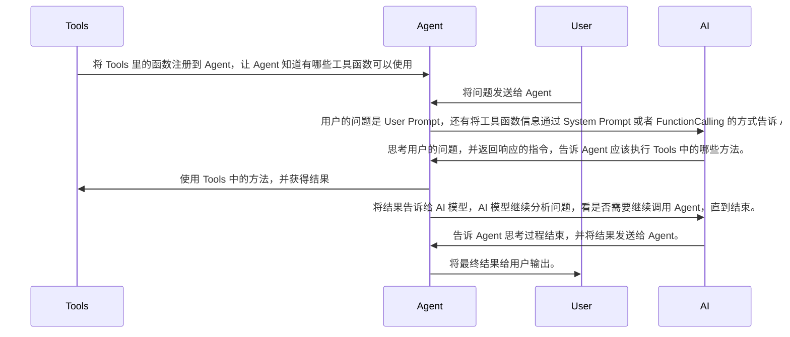
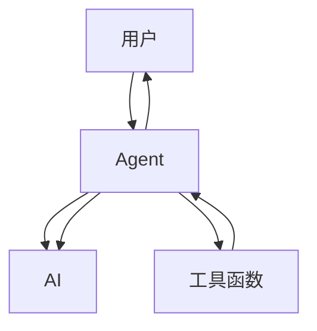

# Prompt

## System Prompt

用来描述 AI 的角色，性格，背景知识，语气等，总之只要不是用户直接说出来的内容，都可以放到 System Prompt 里面。

## User Prompt

用户直接发送给 AI 的内容。

每次用户发送 User Prompt 的时候，系统会自动把 System Prompt 也一起发起 AI 模型，这样就会显得非常自然。

但到了这个程度，AI 也只是一个聊天机器人，只能问问题，然后 AI 模型去回复问题。

那么如何让 AI 模型去自动的执行一些任务呢？这时候，Agent 就出现了。

# Agent

比如期望用 AI 来管理一些文件，那么得先写好一些文件管理函数：

- list_file 列出目录下的所有文件
- read_file 读取文件的内容

然后把这些函数及其他们的功能描述，使用方法，注册到 Agent 中。

Agent 会根据这些信息，生成一个 System Prompt，告诉 AI 模型，用户给了哪些工具，能够做什么。

以及 AI 使用他们应该返回什么样的格式。

当用户在发送 User Prompt 的时候，连同 System Prompt，一起发送给 AI 模型。

如果 AI 模型足够聪明，就会返回一个格式：需要调用某个函数，比如 list_file 给 Agent。

Agent 解析之后，就会调用对应的函数，然后把结果再给 AI，AI 再根据 Agent 返回的结果，再决定下一步去做什么操作。

这个过程就这样反复，直到任务完成为止。

最后，把这种在 AI 模型，提供的工具 (list_file,read_file)，和最终用户之间传话的工具，就叫 AI Agent。

这些提供给 AI Agent 调用的函数，或者服务，就叫 Agent Tool。

但这样可能存在一个问题，虽然我们在 System Prompt 里面描述和规定了 AI 应该用什么格式进行返回，但 AI 模型说到底是一个概率模型。还是有可能返回的格式不对。

一般的 AI Agent 会判断，如果 AI 模型返回的格式不对，会自动进行重试。面对这种场景，FunctionCalling 就出现了。

# FunctionCalling

核心作用就是统一格式，规范描述，比如上面的 System Prompt，使用自然语言描述的，AI 看的懂就行。

FunctionCalling 则对这些描述进行了标准化，每一个 Tool 都用一个 json 来定义，比如：

```json
{
  "name": "list_file",
  "desc": "列出目录下的所有文件",
  "params": {
    "path": "str"
  }
}
```

然后这些字段也从 System Prompt 中剥离了出来，这样，所有的工具定义，描述，和返回都放在了相同的地方。这样 AI 使用工具时，也会遵循相同 json 格式进行回复。于是人们就可以更加有针对性的训练 AI 模型。甚至在这种情况下，如果 AI 依然返回了错误的回复，因为这种返回的格式是固定的，AI 服务端自己就能检测到，然后进行重试。这样用户根本感觉不到，降低了用户端的开发难度，同时也节约了重试的 token 成本。

但 FunctionCalling 也有自己的问题，那就是没有统一的标准。目前每家大厂的 API 格式都不太一样。甚至还有一些模型，不支持 FunctionCalling，所以，要写一个通用的 AI Agent，还是挺麻烦的。

因此 FunctionCalling 和 System Prompt 这两种方式，在市面上都是并存的。

以上都是 AI Agent 如何和 AI 模型之间的通信，那么 Agent Tool 和 Agent 是怎么通信的呢。

# MCP

一般都是把 Agent 和 Agent Tool 写到一个程序里，这样就能直接调用，搞定。

但后来人们发现，有些 Agent Tool 还是挺通用的，比如浏览网页的功能，每个 Agent 都需要，那么总不能在每个 Agent 里面都拷贝一份吧。于是，就想到来一个办法：

把 Tool 做成一个服务，进行统一的托管。让所有的 Agent 都来调用，这个过程，就是 MCP。

MCP 是一个通信协议，专门用来规范 Agent 和 Tool 服务之间是怎么交互的。

运行 Tool 的服务叫 MCP Server，调用它的 Agent 叫 MCP Client。

MCP 规定了 MCP Server 如何和 MCP Client 进行通信，以及 MCP Server 要提供哪些接口，比如查询 MCP Server 有哪些接口，接口的功能，描述，如何使用。除了普通的 Tool 这种函数的调用形式。

MCP 也可以直接提供数据，提供文件读取的服务 Resources，或者为 Agent 提供提示词的模版叫 Prompt。

MCP Server 既可以和 Agent 跑在同一台机器上，通过标准输入输出进行通信，也可以部署在网络上，通过 http 进行通信。

虽然 MCP 是为了 AI 而定制出来的标准，但实际上，MCP 本身和 AI 模型没有关系，它并不关心 Agent 用的是哪个模型，MCP 只负责帮 Agent 管理工具，资源和提示词。

最后，总结一下全部的流程：

用户 --> 发送消息给 Agent，Agent（MCP Client）调用 MCP Server 的函数，并把结果一起给 AI 模型。

AI 模型通过 FunctionCalling 或者普通回复的方式，产生调用 Tool 的请求，Agent 收到这个请求后，通过 MCP 协议去调用 MCP Server 的工具。将结果返回给 Agent，Agent 再把结果给 AI 模型，AI 模型再把最终结果，返回个 Agent，Agent 再发送给用户。

# 写一个 Agent

Agent 是一个在用户，AI 模型，工具函数之间进行传话的程序。



简单来说，就是下面这种方式


