<h1> 最全的 docx,pptx,xlsx(excel),pdf 文件预览方案总结 </h1>

最近遇到了文件预览的需求，但一搜索发现，这还不是一个简单的功能。于是又去查询了很多资料，调研了一些方案，也踩了好多坑。最后总结方案如下

1. 花钱解决 (使用市面上现有的文件预览服务)
   1. 微软
   2. google
   3. 阿里云 IMM
   4. XDOC
   5. Office Web 365
   6. wps 开放平台
2. 前端方案
   1. pptx 的预览方案
   2. pdf 的预览方案
   3. docx 的预览方案
   4. xlsx(excel) 的预览方案
   5. 前端预览方案总结
3. 服务端方案
   1. openOffice
   2. kkFileView
   3. onlyOffice

如果有其他人也遇到了同样的问题，有了这篇文章，希望能更方便的解决。

基本涵盖了所有解决方案。因此，标题写上 **最全** 的文件预览方案调研总结，应该不为过吧。

# 一。市面上现有的文件预览服务

## 1.微软

`docx`,`pptx`,`xlsx`可以说是`office`三件套，那自然得看一下 **微软官方** 提供的文件预览服务。使用方法特别简单，只需要将文件链接，拼接到参数后面即可。

记得`encodeURL`

```js
https://view.officeapps.live.com/op/view.aspx?src=${encodeURIComponent(url)}
```

### (1).PPTX 预览效果：

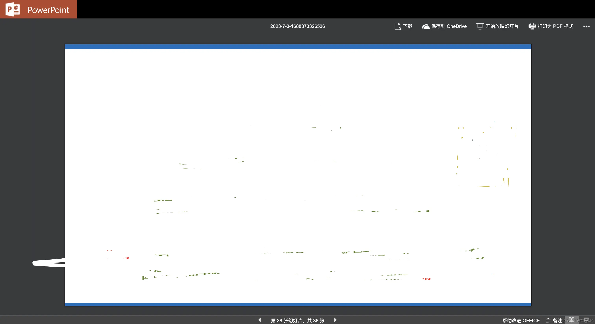

- 优点：还原度很高，功能很丰富，可以选择翻页，甚至支持点击播放动画。
- 缺点：不知道是不是墙的原因，加载稍慢。

### (2).Excel 预览效果：


### (3).Doxc 预览效果


### (4).PDF 预览效果

这个我测试没有成功，返回了一个错误，其他人可以试试。

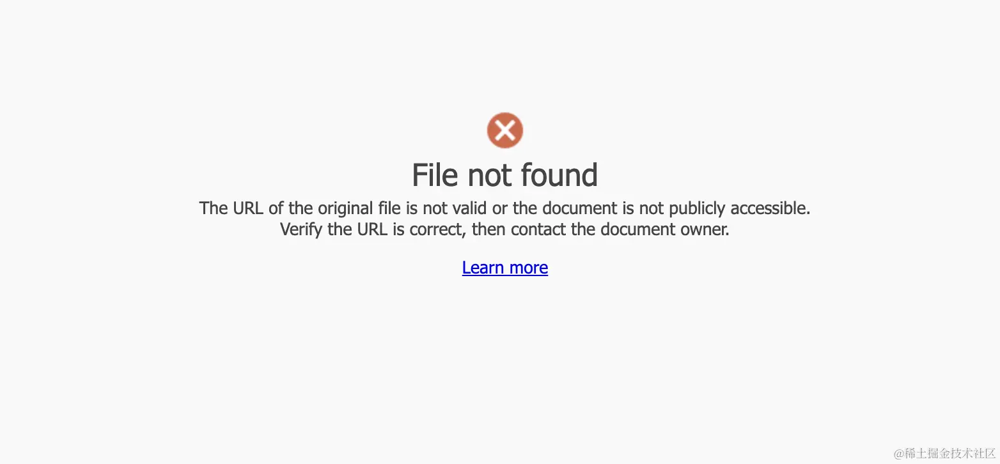

### (5).总的来说

对于`docx`,`pptx`,`xlsx`都有较好的支持，`pdf`不行。

还有一个坑点是：这个服务是否稳定，有什么限制，是否收费，都查不到一个定论。在`office`官方网站上甚至找不到介绍这个东西的地方。

目前只能找到一个`Q&A`:https://answers.microsoft.com/en-us/msoffice/forum/all/what-is-the-status-of-viewofficeappslivecom/830fd75c-9b47-43f9-89c9-4303703fd7f6

微软官方人员回答表示：


翻译翻译，就是：几乎永久使用，没有收费计划，不会存储预览的文件数据，限制文件`10MB`，建议用于 **查看互联网上公开的文件**。

但经过某些用户测试发现：

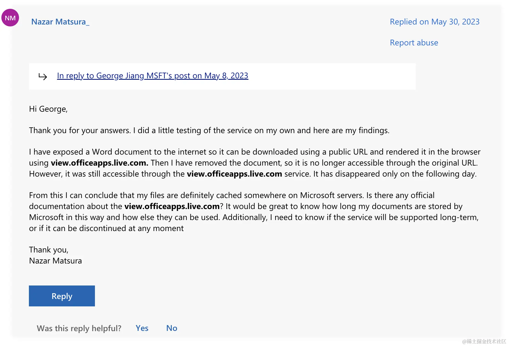

使用了微软的文件预览服务，然后删除了文件地址，仍然可访问，但过一段时间会失效。

## 2.Google Drive 查看器

接入简单，同 `Office Web Viewer`，只需要把 `src` 改为`https://drive.google.com/viewer?url=${encodeURIComponent(url)}`即可。

限制`25MB`,支持以下格式：

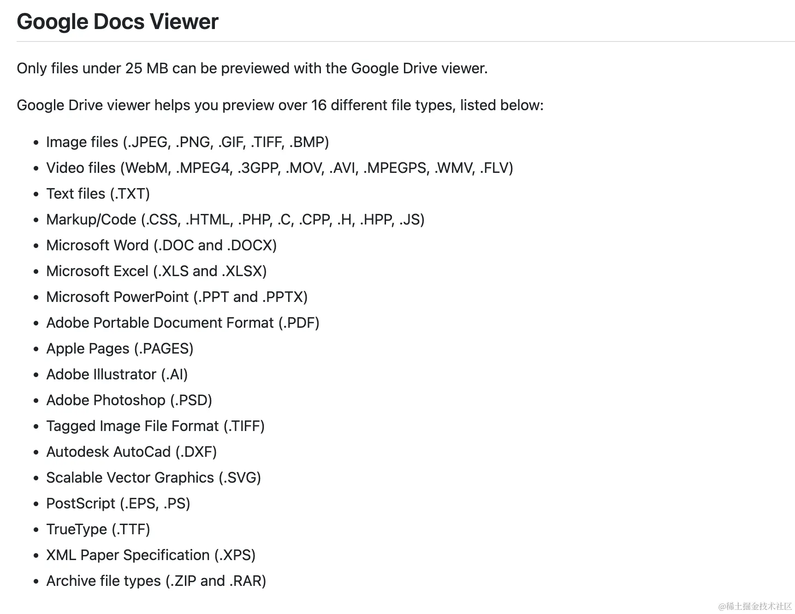

测试效果，支持`docx,pptx,xlsx,pdf`预览，但`pptx`预览的效果不如微软，没有动画效果，样式有小部分会错乱。

**由于某些众所周知的原因，不可用**

## 3.阿里云 IMM

官方文档如下：https://help.aliyun.com/document_detail/63273.html


付费使用

## 4.XDOC 文档预览

说了一些大厂的，在介绍一些其他的，**需要自行分辨**

官网地址：https://view.xdocin.com/view-xdocin-com_6x5f4x.htm


## 5.Office Web 365

需要注意的是，虽然名字很像`office`，但我们看网页的`Copyright`可以发现，其实是一个西安的公司，**不是微软**。

但毕竟也提供了文件预览的服务

官网地址：https://www.officeweb365.com/

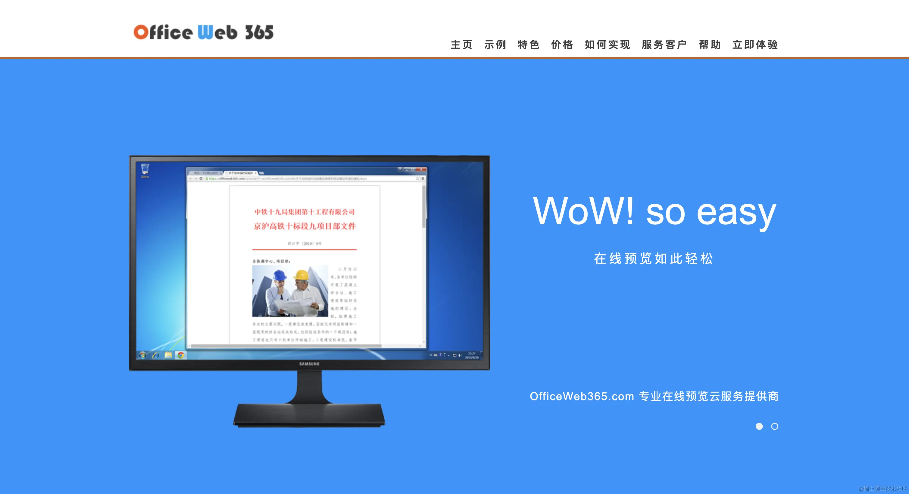

## 6.WPS 开放平台

官方地址：https://solution.wps.cn/


付费使用，价格如下：

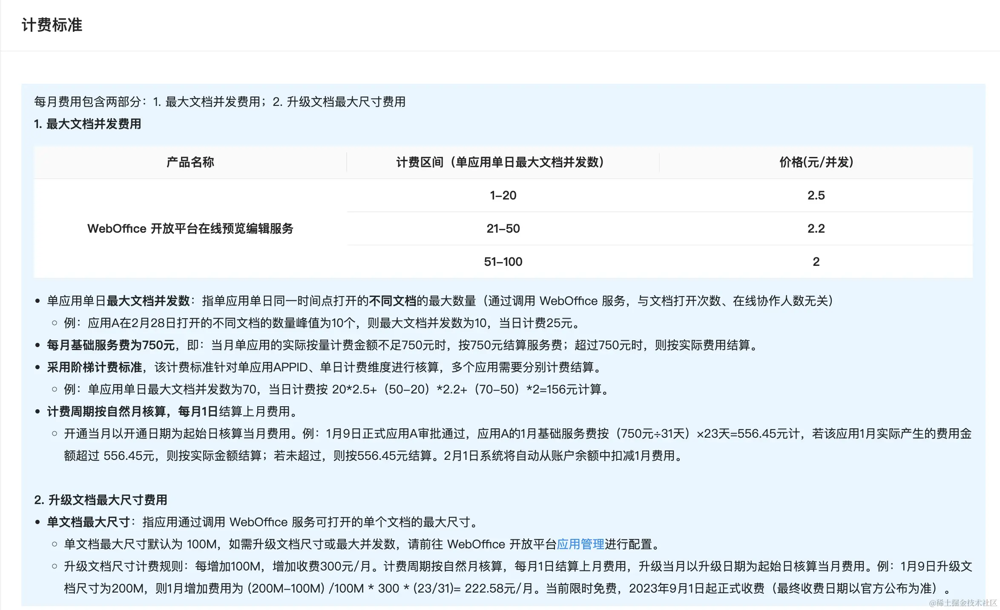

# 二。前端处理方案

## 1.pptx 的预览方案

先查一下有没有现成的轮子，目前`pptx`的开源预览方案能找到的只有这个：https://github.com/g21589/PPTX2HTML。但已经六七年没有更新，也没有维护，笔者使用的时候发现有很多兼容性问题。

简单来说就是，没有。对于这种情况，我们可以自行解析，主要步骤如下：

1. 查询`pptx`的国际标准
2. 解析`pptx`文件
3. 渲染成`html`或者`canvas`进行展示

我们先去找一下`pptx`的国际标准，官方地址：[officeopenxml](http://officeopenxml.com/)

先解释下什么是`officeopenxml`:

> Office OpenXML，也称为 OpenXML 或 OOXML，是一种基于 XML 的办公文档格式，包括文字处理文档、电子表格、演示文稿以及图表、图表、形状和其他图形材料。该规范由微软开发，并于 2006 年被 ECMA 国际采用为 ECMA-376。第二个版本于 2008 年 12 月发布，第三个版本于 2011 年 6 月发布。该规范已被 ISO 和 IEC 采用为 ISO/IEC 29500。

> 虽然 Microsoft 继续支持较旧的二进制格式 (.doc、.xls 和.ppt)，但 OOXML 现在是所有 Microsoft Office 文档 (.docx、.xlsx 和.pptx) 的默认格式。

由此可见，`Office OpenXML`由微软开发，目前已经是国际标准。接下来我们看一下`pptx`里面有哪些内容，具体可以看`pptx`的官方标准：[officeopenxml-pptx](http://officeopenxml.com/anatomyofOOXML-pptx.php)

> PresentationML 或.pptx 文件是一个**zip 文件**，其中包含许多“部分”（通常是 UTF-8 或 UTF-16 编码）或 XML 文件。该包还可能包含其他媒体文件，例如图像。该结构根据 OOXML 标准 ECMA-376 第 2 部分中概述的开放打包约定进行组织。

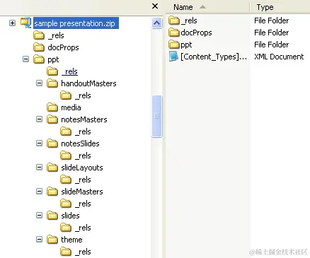

根据国际标准，我们知道，`pptx`文件本质就是一个`zip`文件，其中包含许多部分：

> 部件的数量和类型将根据演示文稿中的内容而有所不同，但始终会有一个 [Content_Types].xml、一个或多个关系（.rels）部件和一个演示文稿部件（演示文稿.xml），它位于 ppt 文件夹中，用于 Microsoft Powerpoint 文件。通常，还将至少有一个幻灯片部件，以及一张母版幻灯片和一张版式幻灯片，从中形成幻灯片。

那么`js`如何读取`zip`呢？

找到一个工具：https://www.npmjs.com/package/jszip

于是我们可以开始尝试解析`pptx`了。

```ts
import JSZip from 'jszip';
// 加载 pptx 数据
const zip = await JSZip.loadAsync(pptxData);
```

- 解析`[Content_Types].xml`

每个`pptx`必然会有一个 `[Content_Types].xml`。此文件包含包中部件的所有内容类型的列表。每个部件及其类型都必须列在 `[Content_Types].xml` 中。通过它里面的内容，可以解析其他的文件数据

```ts
const filesInfo = await getContentTypes(zip);

async function getContentTypes(zip: JSZip) {
  const ContentTypesJson = await readXmlFile(zip, '[Content_Types].xml');
  const subObj = ContentTypesJson['Types']['Override'];
  const slidesLocArray = [];
  const slideLayoutsLocArray = [];
  for (let i = 0; i < subObj.length; i++) {
    switch (subObj[i]['attrs']['ContentType']) {
      case 'application/vnd.openxmlformats-officedocument.presentationml.slide+xml':
        slidesLocArray.push(subObj[i]['attrs']['PartName'].substr(1));
        break;
      case 'application/vnd.openxmlformats-officedocument.presentationml.slideLayout+xml':
        slideLayoutsLocArray.push(subObj[i]['attrs']['PartName'].substr(1));
        break;
      default:
    }
  }
  return {
    slides: slidesLocArray,
    slideLayouts: slideLayoutsLocArray,
  };
}
```

- 解析演示文稿

先获取`ppt`目录下的`presentation.xml`演示文稿的大小

由于演示文稿是`xml`格式，要真正的读取内容需要执行 `readXmlFile`

```ts
const slideSize = await getSlideSize(zip);
async function getSlideSize(zip: JSZip) {
  const content = await readXmlFile(zip, 'ppt/presentation.xml');
  const sldSzAttrs = content['p:presentation']['p:sldSz']['attrs'];
  return {
    width: (parseInt(sldSzAttrs['cx']) * 96) / 914400,
    height: (parseInt(sldSzAttrs['cy']) * 96) / 914400,
  };
}
```

- 加载主题

根据 `officeopenxml`的标准解释

> 每个包都包含一个关系部件，用于定义其他部件之间的关系以及与包外部资源的关系。这样可以将关系与内容分开，并且可以轻松地更改关系，而无需更改引用目标的源。

> 除了包的关系部分之外，作为一个或多个关系源的每个部件都有自己的关系部分。每个这样的关系部件都可以在部件的\_rels 子文件夹中找到，并通过在部件名称后附加“.rels”来命名。

其中主题的相关信息就在`ppt/_rels/presentation.xml.rels`中

```ts
async function loadTheme(zip: JSZip) {
  const preResContent = await readXmlFile(zip, 'ppt/_rels/presentation.xml.rels');
  const relationshipArray = preResContent['Relationships']['Relationship'];
  let themeURI;
  if (relationshipArray.constructor === Array) {
    for (let i = 0; i < relationshipArray.length; i++) {
      if (
        relationshipArray[i]['attrs']['Type'] ===
        'http://schemas.openxmlformats.org/officeDocument/2006/relationships/theme'
      ) {
        themeURI = relationshipArray[i]['attrs']['Target'];
        break;
      }
    }
  } else if (
    relationshipArray['attrs']['Type'] === 'http://schemas.openxmlformats.org/officeDocument/2006/relationships/theme'
  ) {
    themeURI = relationshipArray['attrs']['Target'];
  }

  if (themeURI === undefined) {
    throw Error("Can't open theme file.");
  }

  return readXmlFile(zip, 'ppt/' + themeURI);
}
```

后续`ppt`里面的其他内容，都可以这么去解析。根据`officeopenxml`标准，可能包含：
Part | Description |
| -------------------------- | ------------------------------------------------------------------------------------------------------------------------------------------------------------------------------------------ |
| Comments Authors | Contains information about each author who has added a comment to the presentation. |
| Comments | Contains comments for a single slide. |
| Handout Master | Contains the look, position, and size of the slides, notes, header and footer text, date, or page number on the presentation's handout. There can be only one such part. |
| Notes Master | Contains information about the content and formatting of all notes pages. There can be only one such part. |
| Notes Slide | Contains the notes for a single slide. |
| Presentation | Contains the definition of a slide presentation. There must be one and only one such part. See [Presentation](http://officeopenxml.com/PrPresentation.php). |
| Presentation Properties | Contains all of the presentation's properties. There must be one and only one such part. |
| Slide | Contains the content of a single slide. |
| Slide Layout | Contains the definition for a slide template. It defines the default appearance and positioning of drawing objects on the slide. There must be one or more such parts. |
| Slide Master | Contains the master definition of formatting, text, and objects that appear on each slide in the presentation that is derived from the slide master. There must be one or more such parts. |
| Slide Synchronization Data | Contains properties specifying the current state of a slide that is being synchronized with a version of the slide stored on a central server. |
| User-Defined Tags | Contains a set of user-defined properties for an object in a presentation. There can be zero or more such parts. |
| View Properties | Contains display properties for the presentation.

等等内容，我们根据标准一点点解析并渲染就好了。

完整源码：[ranui](https://github.com/chaxus/ran/tree/main/packages/ranui)

使用文档：[preview 组件](https://chaxus.github.io/ran/src/ranui/preview/)

## 2.pdf 的预览方案

### (1).iframe 和 embed

`pdf`比较特别，一般的浏览器默认支持预览`pdf`。因此，我们可以使用浏览器的能力：

```html
<iframe src="viewFileUrl" />
```

但这样就完全依赖浏览器，对`PDF`的展示，交互，是否支持全看浏览器的能力，且不同的浏览器展示和交互往往不同，如果需要统一的话，最好还是尝试其他方案。

`embed`的解析方式也是一样，这里不举例子了

### (2)pdfjs

npm: <https://www.npmjs.com/package/pdfjs-dist>

github 地址：<https://github.com/mozilla/pdfjs-dist>

由`mozilla`出品，就是我们常见的`MDN`的老大。

而且目前 火狐浏览器 使用的 PDF 预览就是采用这个，我们可以用火狐浏览器打开`pdf`文件，查看浏览器使用的`js`就能发现

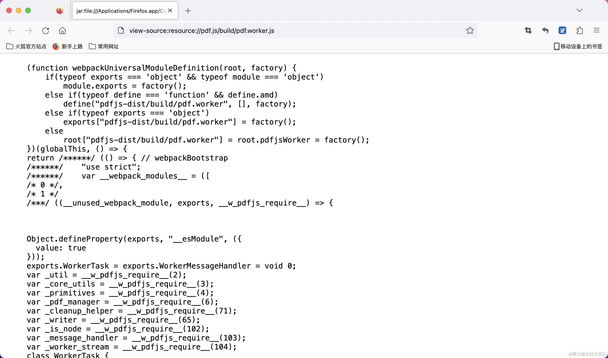

需要注意的是，最新版`pdf.js`限制了`node`版本，需要大于等于`18`

github 链接：https://github.com/mozilla/pdf.js/blob/master/package.json

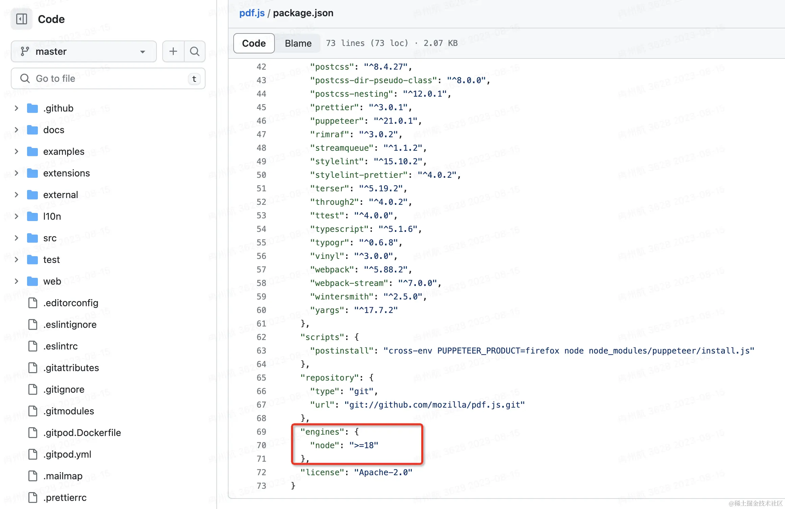

如果你项目`node`版本小于这个情况，可能会无法使用。

如果遇到这种情况，可以用以前版本，以前的版本没有限制。

具体使用情况如下：

- 完整源码：https://github.com/chaxus/ran/tree/main/packages/ranui
- 使用文档：https://chaxus.github.io/ran/src/ranui/preview/

```ts
import * as pdfjs from 'pdfjs-dist';
import * as pdfjsWorker from 'pdfjs-dist/build/pdf.work.entry';

interface Viewport {
  width: number;
  height: number;
  viewBox: Array<number>;
}

interface RenderContext {
  canvasContext: CanvasRenderingContext2D | null;
  transform: Array<number>;
  viewport: Viewport;
}

interface PDFPageProxy {
  pageNumber: number;
  getViewport: () => Viewport;
  render: (options: RenderContext) => void;
}

interface PDFDocumentProxy {
  numPages: number;
  getPage: (x: number) => Promise<PDFPageProxy>;
}

class PdfPreview {
  private pdfDoc: PDFDocumentProxy | undefined;
  pageNumber: number;
  total: number;
  dom: HTMLElement;
  pdf: string | ArrayBuffer;
  constructor(pdf: string | ArrayBuffer, dom: HTMLElement | undefined) {
    this.pageNumber = 1;
    this.total = 0;
    this.pdfDoc = undefined;
    this.pdf = pdf;
    this.dom = dom ? dom : document.body;
  }
  private getPdfPage = (number: number) => {
    return new Promise((resolve, reject) => {
      if (this.pdfDoc) {
        this.pdfDoc.getPage(number).then((page: PDFPageProxy) => {
          const viewport = page.getViewport();
          const canvas = document.createElement('canvas');
          this.dom.appendChild(canvas);
          const context = canvas.getContext('2d');
          const [_, __, width, height] = viewport.viewBox;
          canvas.width = width;
          canvas.height = height;
          viewport.width = width;
          viewport.height = height;
          canvas.style.width = Math.floor(viewport.width) + 'px';
          canvas.style.height = Math.floor(viewport.height) + 'px';
          const renderContext = {
            canvasContext: context,
            viewport: viewport,
            transform: [1, 0, 0, -1, 0, viewport.height],
          };
          page.render(renderContext);
          resolve({ success: true, data: page });
        });
      } else {
        reject({ success: false, data: null, message: 'pdfDoc is undefined' });
      }
    });
  };
  pdfPreview = () => {
    window.pdfjsLib.GlobalWorkerOptions.workerSrc = pdfjsWorker;
    window.pdfjsLib.getDocument(this.pdf).promise.then(async (doc: PDFDocumentProxy) => {
      this.pdfDoc = doc;
      this.total = doc.numPages;
      for (let i = 1; i <= this.total; i++) {
        await this.getPdfPage(i);
      }
    });
  };
  prevPage = () => {
    if (this.pageNumber > 1) {
      this.pageNumber -= 1;
    } else {
      this.pageNumber = 1;
    }
    this.getPdfPage(this.pageNumber);
  };
  nextPage = () => {
    if (this.pageNumber < this.total) {
      this.pageNumber += 1;
    } else {
      this.pageNumber = this.total;
    }
    this.getPdfPage(this.pageNumber);
  };
}

const createReader = (file: File): Promise<string | ArrayBuffer | null> => {
  return new Promise((resolve, reject) => {
    const reader = new FileReader();
    reader.readAsDataURL(file);
    reader.onload = () => {
      resolve(reader.result);
    };
    reader.onerror = (error) => {
      reject(error);
    };
    reader.onabort = (abort) => {
      reject(abort);
    };
  });
};

export const renderPdf = async (file: File, dom?: HTMLElement): Promise<void> => {
  try {
    if (typeof window !== 'undefined') {
      const pdf = await createReader(file);
      if (pdf) {
        const PDF = new PdfPreview(pdf, dom);
        PDF.pdfPreview();
      }
    }
  } catch (error) {
    console.log('renderPdf', error);
  }
};
```

## 3.docx 的预览方案

我们可以去查看`docx`的国际标准，去解析文件格式，渲染成`html`和`canvas`，不过比较好的是，已经有人这么做了，还开源了

`npm`地址：https://www.npmjs.com/package/docx-preview

使用方法如下：

```ts
import { renderAsync } from 'docx-preview';

interface DocxOptions {
  bodyContainer?: HTMLElement | null;
  styleContainer?: HTMLElement;
  buffer: Blob;
  docxOptions?: Partial<Record<string, string | boolean>>;
}

export const renderDocx = (options: DocxOptions): Promise<void> | undefined => {
  if (typeof window !== 'undefined') {
    const { bodyContainer, styleContainer, buffer, docxOptions = {} } = options;
    const defaultOptions = {
      className: 'docx',
      ignoreLastRenderedPageBreak: false,
    };
    const configuration = Object.assign({}, defaultOptions, docxOptions);
    if (bodyContainer) {
      return renderAsync(buffer, bodyContainer, styleContainer, configuration);
    } else {
      const contain = document.createElement('div');
      document.body.appendChild(contain);
      return renderAsync(buffer, contain, styleContainer, configuration);
    }
  }
};
```

## 4.xlsx 的预览方案

我们可以使用这个：

`npm`地址：https://www.npmjs.com/package/@vue-office/excel

支持`vue2`和`vue3`，也有`js`的版本

对于`xlsx`的预览方案，这个是找到最好用的了。

## 5.前端预览方案总结

我们对以上找到的优秀的解决方案，进行改进和总结，并封装成一个`web components`组件：[preview 组件](https://chaxus.github.io/ran/src/ranui/preview/)

为什么是`web components`组件？

因为它跟框架无关，可以在任何框架中使用，且使用起来跟原生的`div`标签一样方便。

并编写使用文档：[preview 组件文档](https://chaxus.github.io/ran/src/ranui/preview/)，
文档支持交互体验。

源码公开，`MIT`协议。

目前`docx`,`pdf`,`xlsx`预览基本可以了，都是最好的方案。`pptx`预览效果不太好，因为需要自行解析。不过**源码完全公开**，需要的可以提`issue`，`pr`或者干脆自取或修改，源码地址：https://github.com/chaxus/ran/tree/main/packages/ranui

# 三。服务端预览方案

## 1.openOffice

由于浏览器不能直接打开`docx`,`pptx`,`xlsx`等格式文件，但可以直接打开`pdf`和图片。因此，我们可以换一个思路，用服务端去转换下文件的格式，转换成浏览器能识别的格式，然后再让浏览器打开，这不就 OK 了吗，甚至不需要前端处理了。

我们可以借助`openOffice`的能力，先介绍一下`openOffice`:

> `Apache OpenOffice`是领先的开源办公软件套件，用于文字处理，电子表格，演示文稿，图形，数据库等。它有多种语言版本，适用于所有常用计算机。它以国际开放标准格式存储您的所有数据，还可以从其他常见的办公软件包中读取和写入文件。它可以出于任何目的完全免费下载和使用。

官网如下：https://www.openoffice.org/

需要先下载`opneOffice`，找到`bin`目录，进行设置

```java
configuration.setOfficeHome("这里的路径一般为 C:\\Program Files (x86)\\OpenOffice 4");
```

测试下转换的文件路径

```java
    public static void main(String[] args) {
        convertToPDF("/Users/Desktop/asdf.docx", "/Users/Desktop/adsf.pdf");
    }
```

完整如下：

```java

package org.example;

import org.artofsolving.jodconverter.OfficeDocumentConverter;
import org.artofsolving.jodconverter.office.DefaultOfficeManagerConfiguration;
import org.artofsolving.jodconverter.office.OfficeManager;

import java.io.File;

public class OfficeUtil {

    private static OfficeManager officeManager;
    private static int port[] = {8100};

    /**
     * start openOffice service.
     */
    public static void startService() {
        DefaultOfficeManagerConfiguration configuration = new DefaultOfficeManagerConfiguration();
        try {
            System.out.println("准备启动 office 转换服务....");
            configuration.setOfficeHome("这里的路径一般为 C:\\Program Files (x86)\\OpenOffice 4");
            configuration.setPortNumbers(port); // 设置转换端口，默认为 8100
            configuration.setTaskExecutionTimeout(1000 * 60 * 30L);// 设置任务执行超时为 30 分钟
            configuration.setTaskQueueTimeout(1000 * 60 * 60 * 24L);// 设置任务队列超时为 24 小时
            officeManager = configuration.buildOfficeManager();
            officeManager.start(); // 启动服务
            System.out.println("office 转换服务启动成功！");
        } catch (Exception e) {
            System.out.println("office 转换服务启动失败！详细信息：" + e);
        }
    }

    /**
     * stop openOffice service.
     */
    public static void stopService() {
        System.out.println("准备关闭 office 转换服务....");
        if (officeManager != null) {
            officeManager.stop();
        }
        System.out.println("office 转换服务关闭成功！");
    }

    public static void convertToPDF(String inputFile, String outputFile) {
        startService();
        System.out.println("进行文档转换转换：" + inputFile + " --> " + outputFile);
        OfficeDocumentConverter converter = new OfficeDocumentConverter(officeManager);
        converter.convert(new File(inputFile), new File(outputFile));
        stopService();
    }

    public static void main(String[] args) {
        convertToPDF("/Users/koolearn/Desktop/asdf.docx", "/Users/koolearn/Desktop/adsf.pdf");
    }
}

```

## 2.kkFileView

`github`地址：https://github.com/kekingcn/kkFileView

支持的文件预览格式非常丰富
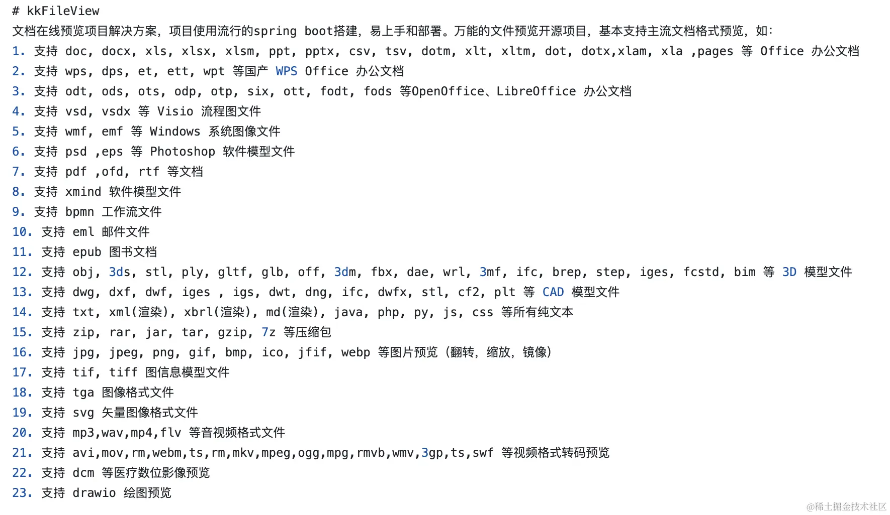

接下来是 `从零到一` 的启动步骤，按着步骤来，任何人都能搞定

1. 安装`java`:

```sh
brew install java
```

1. 安装`maven`,`java`的包管理工具：

```sh
brew install mvn
```

1. 检查是否安装成功

执行`java --version`和`mvn -v`。我这里遇到`mvn`找不到`java home`的报错。解决方式如下：

我用的是`zsh`，所以需要去`.zshrc`添加路径：

```
export JAVA_HOME=$(/usr/libexec/java_home)
```

添加完后，执行

```
source .zshrc
```

4. 安装下`libreoffice `:

`kkFileView`明确要求的额外依赖，否则无法启动

```
brew install libreoffice
```

5. `mvn`安装依赖

进入项目，在根目录执行依赖安装，同时清理缓存，跳过单测 (遇到了单测报错的问题)

```
mvn clean install -DskipTests
```

6. 启动项目

找到主文件，主函数`mian`，点击`vscode`上面的`Run`即可执行，路径如下图

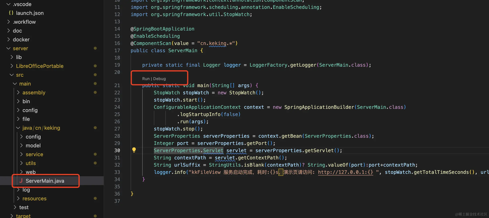

1. 访问页面

启动完成后，点击终端输出的地址

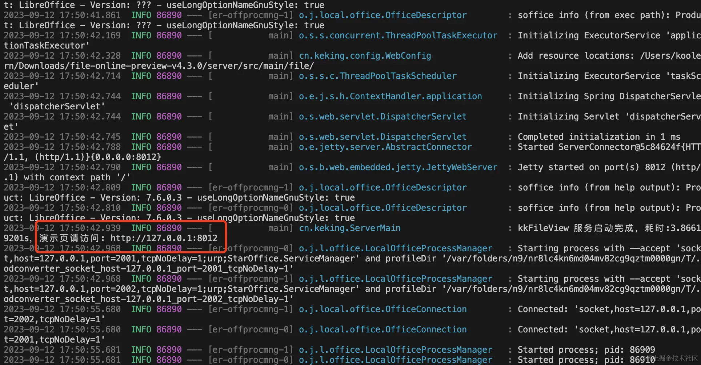

1. 最终结果

最终展示如下，可以添加链接进行预览，也可以选择本地文件进行预览

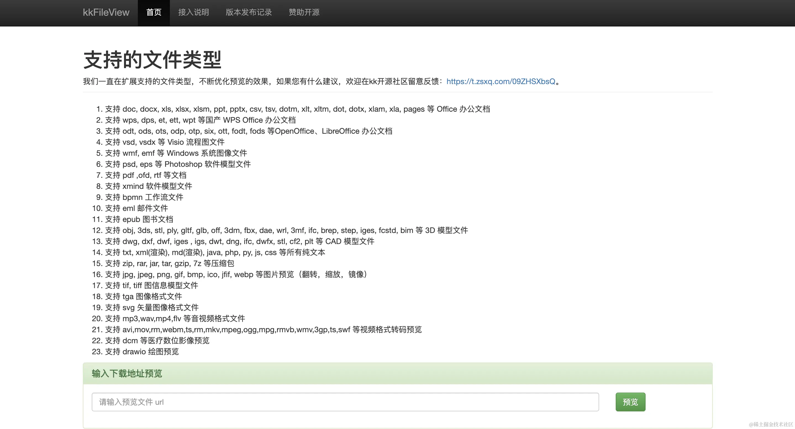

预览效果非常好

## 3.onlyOffice

官网地址：https://www.onlyoffice.com/zh

`github`地址：https://github.com/ONLYOFFICE

开发者版本和社区版免费，企业版付费：https://www.onlyoffice.com/zh/docs-enterprise-prices.aspx

预览的文件种类没有`kkFileView`多，但对`office`三件套有很好的支持，甚至支持多人编辑。

# 四。总结

1. 外部服务，推荐微软的`view.officeapps.live.com/op/view.aspx`，但只建议预览一些互联网公开的文件，不建议使用在要求保密性和稳定性的文件。
2. 对保密性和稳定性有要求，且不差钱的，可以试试大厂服务，阿里云解决方案。
3. 服务端技术比较给力的，使用服务端预览方案。目前最好最全的效果是服务端预览方案。
4. 不想花钱，没有服务器的，使用前端预览方案，客户端渲染零成本。

# 五。参考文档：

1. [在 java 中如何使用 openOffice 进行格式转换](https://blog.csdn.net/Li_Zhongxin/article/details/132105957)
2. [MAC 搭建 OpenOffice 完整教程 - 保姆级](https://blog.51cto.com/u_15899048/5902747)
3. [纯 js 实现 docx、xlsx、pdf 文件预览库，使用超简单](https://juejin.cn/post/7251199685130059833)
4. [前端实现 word、excel、pdf、ppt、mp4、图片、文本等文件的预览](https://juejin.cn/post/7071598747519549454)
