最近又遇到了`web`视频化的场景，之前也有过调研：[H5 视频化调研浅析](https://juejin.cn/post/7238739662822735933)

但这次稍微复杂一些，这次解决的是：

1. 视频播放的技术方案调研

服务端实现：

1. 视频转码
2. 生成不同码率的视频
3. 进行视频标准加密
4. 不同码率视频合并，用于动态码率播放

`web`端实现

1. `web`端播放器的设计
2. `web`端播放器的自定义扩展
3. 可拖拽进度条
4. 音量控制
5. 根据当前带宽自适应码率切换
6. 手动清晰度切换
7. 倍速播放
8. 样式自定义覆盖
9. 标准加密视频播放
10. 基于原生开发，可在所有框架运行，统一跨框架情况
11. 各浏览器控件统一

其中`web`端源码已添加`MIT`协议并完全开源，如果看完对大家有帮助的话，欢迎大家`star`,`issue`,`pr`，也希望能友好交流～

demo 地址：https://chaxus.github.io/ran/src/ranui/player/

源码地址：https://github.com/chaxus/ran/tree/main/packages/ranui

`demo`文档做了国际化，可切换到中文

任何一个项目，立项肯定先是技术调研，我们先看看一些大公司的视频播放方案

# 一。一些知名公司的 web 视频播放方案

## 1.B 站

我们先看看 B 站的，毕竟 B 站的主营业务就是视频弹幕网站，简直专业对口。

先找一个例子：https://www.bilibili.com/video/BV1FM411N7LJ 访问它。

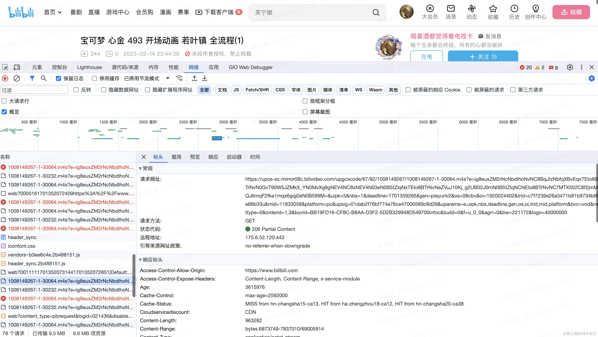

打开控制台，可以看到，视频在播放的时候，会不断的请求`m4s`的视频文件。

毕竟一整个视频文件往往比较大，不可能先请求完视频文件，再进行播放。因此将一个大的视频文件分割成很多小的片段，边加载边播放，是一种更好的方式。


每次请求的`m4s`文件大概在几十`kb`到几百`kb`不等。

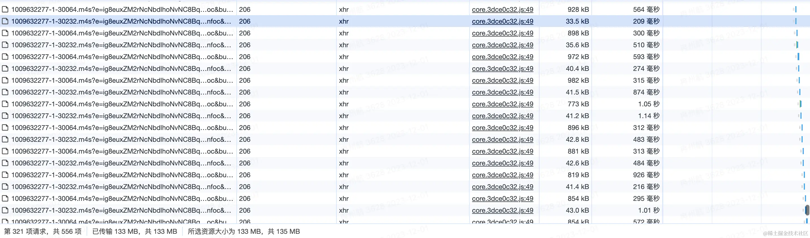

那为什么不采用`http`的`range`呢，可以请求一个文件的部分内容，而且粒度更细，可以设置字节范围。在`http`请求的`header`中，类似这样

```js
Range: bytes = 3171375 - 3203867;
```

我们可以检查这个链接请求`https://upos-sz-mirror08c.bilivideo.com/upgcxcode/67/92/1008149267/1008149267-1-30064.m4s`的请求头，就能发现，B 站采用的是，即分片加载，同时还用了`range`的方式。

## 2. 爱奇艺：（爱奇艺、土豆、优酷）

爱奇艺这里就不贴视频链接了，因为随便点一个视频，都要先看广告。

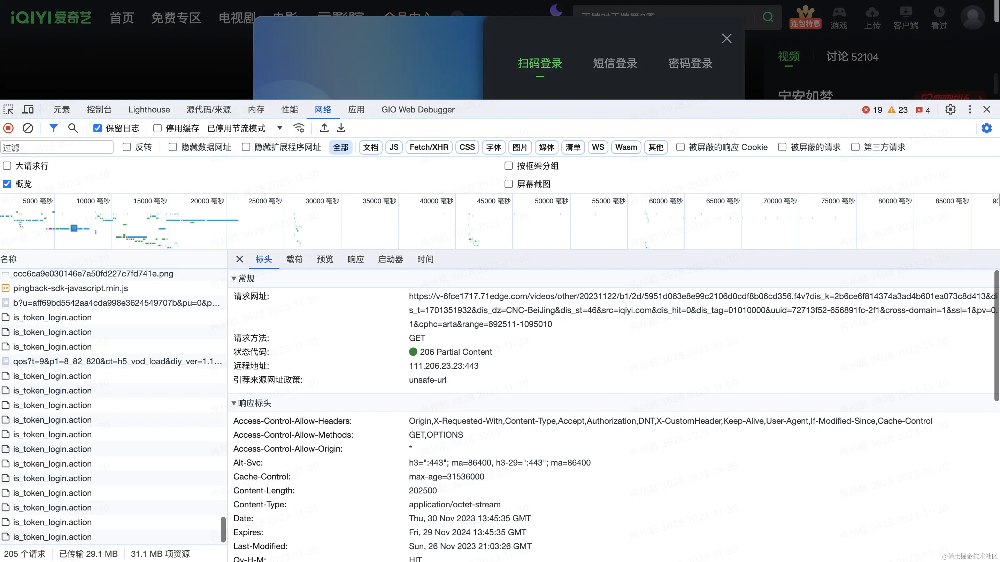

爱奇艺的视频主要请求的是`f4v`格式，也是分片加载。

播放一个视频时，请求多个`f4v`文件。

也采用`Range`。但和 B 站不一样的是，B 站的`Range`属性是在`m4s`请求的请求头里面，而爱奇艺的看起来是在`querystring`上，在请求`query`上带着`range`参数。

因为没发现这个请求的`header`里面有`range`参数。比如：

`https://v-6fce1712.71edge.com/videos/other/20231113/6b/bb/3f3fe83b89124248c3216156dfe2f4c3.f4v?dis_k=2ba39ee8c55c4d23781e3fb9f91fa7a46&dis_t=1701439831&dis_dz=CNC-BeiJing&dis_st=46&src=iqiyi.com&dis_hit=0&dis_tag=01010000&uuid=72713f52-6569e957-351&cross-domain=1&ssl=1&pv=0.1&cphc=arta&range=0-9000`

## 3.抖音：

抖音的方案简单粗暴，访问的链接是这个：
https://m.ixigua.com/douyin/share/video/7206914252840370721?aweme_type=107&schema_type=1&utm_source=copy&utm_campaign=client_share&utm_medium=android&app=aweme

通过查看控制台，我们可以发现，直接请求了一个视频的地址

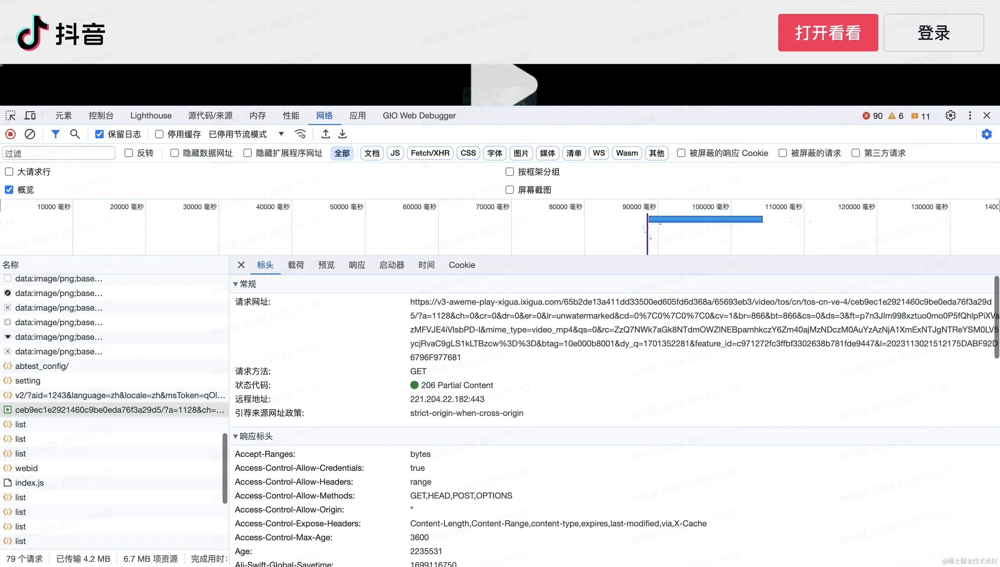

没有进行分片，但用到了请求`range`，所以可以看到视频，是边播放边缓冲一部分。

不过我在开发的时候发现，目前租用的服务云厂商，默认会帮我们实现这项技术。

因为我把`mp4`视频上传到云服务器，通过链接进行播放的时候，就是边缓冲边播放的。

我们可以直接把这个视频地址拿出来，放到浏览器里面能直接播放，这样观察更明显。


但 B 站和爱奇艺却不能这样，因为他们采用的`m4s`和`f4v`都不是一种通用的视频格式，需要使用专门的软件或工具才能打开和编辑。

## 4.小红书：

测试用的例子链接：https://www.xiaohongshu.com/discovery/item/63b286d1000000001f00b495

小红书的方案更加简单粗暴，打开控制台，直接告诉你就是请求一个`mp4`，然后直接播放就完事了。

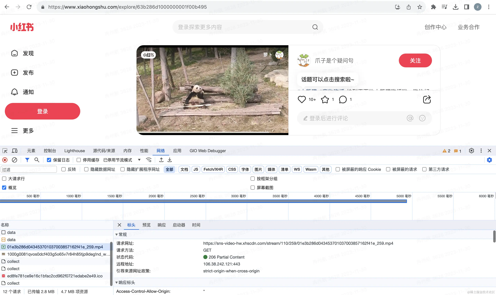

## 5.总结

看完了以上的各家大厂的方案，我们可以看到，基本原理都是边播放边加载，减少直接加载大视频文本的成本。并且通过分片传输，还能动态控制视频码率（清晰度）。做到根据网速，加载不同码率的分片文件，做到动态码率适应。

同时采用的视频格式，比如`f4v`，`m4s`，都不是能直接播放的媒体格式，需要一定的处理。增加盗取视频的成本，增加一定的安全性。

如果没有强要求，也可以直接采用`mp4`，或者直接用`video`播放一个视频文件地址。

# 二。常见的视频格式与协议

我们知道视频的常见格式有`mp4`，同时上面介绍了 B 站播放用的`m4s`格式，爱奇艺用的`f4v`格式

- 除了这些还有哪些视频格式？
- 为什么有这么多视频格式，有哪些不同点呢？
- 为什么这些公司会采用这种格式来播放视频呢？

## 1. B 站用的`m4s`

`M4S`格式不是一种通用的视频格式，需要使用专门的软件或工具才能打开和编辑。

`M4S` 通常会和 `MPEG-DASH` 流媒体技术一起，通过流式传输的视频的一小部分。播放器会按接收顺序播放这些片段。第一个 `M4S` 段会包含一些初始化的数据标识。

`MPEG-DASH` 是一种自适应比特率流媒体技术，通过将内容分解为一系列不同码率的`M4S`片段，然后根据当前网络带宽进行自动调整。如果想在在`web`音视频中采用`DASH`技术，可以看下
https://github.com/Dash-Industry-Forum/dash.js

## 2. 爱奇艺的`f4v`

`F4V`是一种流媒体格式，它是由`Adobe`公司推出的，继`FLV`格式之后支持`H.264`编码的流媒体格式。`F4V`格式的视频不是一种通用的视频格式，**但通常情况下**，都可以将文件后缀改为`FLV`，这样就可以使用支持`FLV`的播放器进行观看。

`FLV`格式跟常见的`MP4`格式比起来，结构更加简单，所以加载`metadata`(视频元数据，比如视频时长等信息) 会更快。具体结构我们可以在这里查到：https://en.wikipedia.org/wiki/Flash_Video#Flash_Video_Structure

比如，这是`FLV`文件的标准头，定义了从几个比特到几个比特之间，是什么含义。我们知道后，可以用`MediaSource`进行读取和转码。

| Field          | Data Type    | Default  | Details                                             |
| -------------- | ------------ | -------- | --------------------------------------------------- |
| Signature 签名 | byte[3]      | "FLV"    |  始终就是“FLV”                                      |
| Version 版本   | uint8        | 1        |  只有 0x01 才有效                                   |
| Flags 标志     | uint8 位掩码 | 0x05     | 0x04 是音频，0x01 是视频（所以 0x05 是音频 + 视频） |
| Header Size    | uint32_be    | 9        | 用于跳过较新的扩展标头                              |

而`MP4`格式会稍微复杂一些，具体标准在 [ISO/IEC 14496-12](https://www.iso.org/standard/83102.html) 大概有两百多页，这里放不下，对这方面有兴趣的可以自行查看。

然而这并不表示`MP4`更差，因为它是一种基础通用标准，所以定义上会留有很多空间，和各种情况，甚至允许在标准之内进行自行发挥和扩展。而`FLV`格式则更加固定，但优点也是更加简单。

对于`FLV`的视频播放，我们可以采用：https://github.com/bilibili/flv.js `flvjs`主要作用就是用`MediaSource`将`flv`转码成`mp4`从而喂给浏览器进行播放。

接下来是一些其他的视频格式，简单介绍一下：

## 3.`AVI`

文件名以`.avi`结尾，`AVI` 最初由 `Microsoft` 于 `1992` 年开发，是 `Windows` 的标准视频格式。`AVI` 文件使用较少的压缩来存储文件，并且比许多其他视频格式占用更多空间，这导致文件大小非常大，每分钟视频大约 `2-3 GB`。

无损文件不会随着时间的推移而降低质量，无论您打开或保存文件多少次。此外，这允许在不使用任何编解码器的情况下播放。参考资料：[Audio Video Interleave](https://en.wikipedia.org/wiki/Audio_Video_Interleave)

## 4.`MPEG`

文件名以“.mpg”或“.mpeg”结尾，MPEG 是由 ISO 和 IEC 联合成立的工作组联盟，旨在制定媒体编码标准，包括音频、视频、图形和基因组数据的压缩编码;以及各种应用程序的传输和文件格式。MPEG 格式用于各种多媒体系统。最广为人知的旧 MPEG 媒体格式通常使用 MPEG-1、MPEG-2 和 MPEG-4 AVC 媒体编码，MPEG-2 系统传输流和节目流。较新的系统通常使用 MPEG 基本媒体文件格式和动态流式处理（又名 .MPEG-DASH）。参考资料：[Moving Picture Experts Group](https://en.wikipedia.org/wiki/Moving_Picture_Experts_Group)

## 5.`MP4`

带有音频和视频的 MPEG-4 文件通常使用标准的 .mp4 扩展名。纯音频 MPEG-4 文件通常具有 .m4a 扩展名，原始 MPEG-4 可视比特流命名为 .m4v。Apple iPhone 使用 MPEG-4 音频作为其铃声，但使用.m4r 扩展名而不是.m4a 扩展名。参考资料：[MPEG-4 Part 14](https://en.wikipedia.org/wiki/MP4_file_format)

## 6.`QuickTime`

文件名以“.mov”结尾，QuickTime 能够包含媒体数据的抽象数据引用，并将媒体数据与媒体偏移和轨道编辑列表分离，这意味着 QuickTime 特别适合编辑，因为它能够就地导入和编辑（无需数据复制）。由于 QuickTime 和 MP4 容器格式都可以使用相同的 MPEG-4 格式，因此在仅限 QuickTime 的环境中，它们大多可以互换。MP4 作为国际标准，得到了更多的支持。参考资料：[QuickTime File Format](https://en.wikipedia.org/wiki/QuickTime_File_Format)

## 7.`TS`

TS 是 MPEG2-TS 的简称，是一种音视频封装格式。TS 流的后缀通常是.ts、.mpg 或者.mpeg，多数播放器直接支持这种格式的播放。TS 格式主要用于直播的码流结构，具有很好的容错能力。

# 三。浏览器对各种视频格式的兼容性

上面了解常用的视频格式，和适用范围之后，还需要看一下当前浏览器，对各种视频格式的支持程度，然后制定技术方案。

## 1. Chrome

支持的视频格式从官方文档可以查到，主要有以下这些

- MP4 (QuickTime/ MOV / ISO-BMFF / CMAF)
- Ogg
- WebM
- WAV
- HLS [Only on Android and only single-origin manifests]

官方文档如下：https://www.chromium.org/audio-video/

## 2. Safari

支持的视频格式有这些：

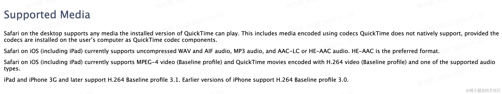

官方文档：https://developer.apple.com/library/archive/documentation/AudioVideo/Conceptual/Using_HTML5_Audio_Video/Device-SpecificConsiderations/Device-SpecificConsiderations.html

## 3.Firefox

支持的视频格式：

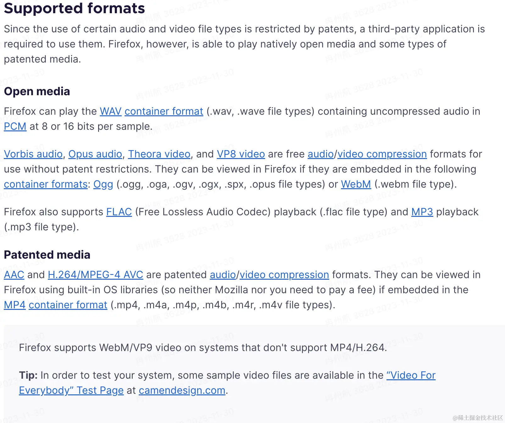

官方文档：https://support.mozilla.org/en-US/kb/html5-audio-and-video-firefox

# 四.MediaSource 和视频编码，解码，封装介绍

上面介绍了一些视频格式，和目前浏览器的一些兼容性问题。就能发现，在`web`上播放音视频其实限制还是很大的。如何解决这些限制，就会用到`MediaSource`。

视频其实是无数个图片的叠加，如果视频是一秒`60`帧，大约一秒中需要播放`60`张图片。这就导致一个几分钟的视频，就会非常大。比如上面介绍的无损格式，`avi`格式，每分钟视频大约 `2-3 GB`。这时候视频就需要进行`编码`。其实就是压缩。

编码分为视频编码和音频编码，常见的视频编码有：

- **MPEG 系列**：`MPEG-1`第二部分、`MPEG-2`第二部分（等同于`H.262`）、`MPEG-4`第二部分、`MPEG-4`第十部分（等同于`H.264`，有时候也被叫做“`MPEG-4` `AVC`”或“`H.264/AVC`”）。
- **H.26x 系列**：`H.261`、`H.262`、`H.263`、`H.264`（等同于`MPEG-4`第十部分）、`H.265/HEVC`（`ITU-T`和`ISO/IEC`联合推出）。
- **其它视频编码**：`WMV`系列、`RV`系列、`VC-1`、`DivX`、`XviD`、`X264`、`X265`、`VP8`、`VP9`、`Sorenson Video`、`AVS`。

常见的音频编码有：`AAC`，`MP3`，`AC-3`等

编码之后，还需要将音频和视频合并在一个文件里，这就是`封装`。

所以相对的，播放一个视频，就需要解封装，解码，音视频同步喂给声卡和显卡进行播放。

`MediaSource`做的就是这个工作，读取视频流，转换成浏览器能播放的格式。

以下是`flv.js`的`parseChunks`部分内容。读取`buffer`，一个字节一个字节的根据标准进行解析。然后转码。

```js
if (byteStart === 0) {
  // buffer with FLV header
  if (chunk.byteLength > 13) {
    let probeData = FLVDemuxer.probe(chunk);
    offset = probeData.dataOffset;
  } else {
    return 0;
  }
}

if (this._firstParse) {
  // handle PreviousTagSize0 before Tag1
  this._firstParse = false;
  if (byteStart + offset !== this._dataOffset) {
    Log.w(this.TAG, 'First time parsing but chunk byteStart invalid!');
  }

  let v = new DataView(chunk, offset);
  let prevTagSize0 = v.getUint32(0, !le);
  if (prevTagSize0 !== 0) {
    Log.w(this.TAG, 'PrevTagSize0 !== 0 !!!');
  }
  offset += 4;
}
```

## 1.MediaSource 兼容性

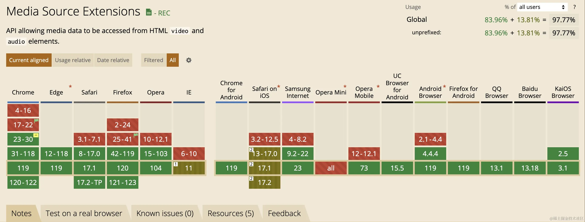

由此可见，基本都是绿色，但有一个特殊情况，就是`Safari on IOS`。这部分支持程度还是棕色。

# 五。HLS 播放方案

采用`HLS`技术方案，有以下几个原因：

1.兼容性

上面介绍了各种视频格式，还有浏览器的兼容性

其中 `HLS`协议是`Apple`公司实现的，在 `Apple` 的全系列产品包括 `iPhone`、`iPad`、`Safari` 等都可以原生支持播放 `HLS`。

对于其他浏览器，可以通过`MediaSource`解封装，解码，转码，进行播放。

这样也就解决了`MediaSource`的兼容性问题。

2. 业务场景需求

目前对于视频的加密有着强需求，比如需要用户付费才能观看一些视频。而`HLS`协议天然自带标准加密，同时也能基于`HLS`扩展私有加密。

3. `HLS`协议自带支持分片传输和动态码率自适应播放。
4. ~~有现成的技术方案，Hls.js~~

# 六。服务端开发

选择了采用`HLS`协议的播放方式，那么首先需要处理视频，这部分目前是在服务端进行处理。利用`ffmpeg`的能力。

~~如果以后能将`ffmpeg`搬上浏览器，且没有性能问题就好了。现在有类似的`webassembly`的`npm`包，但性能有点小问题~~

## 1.视频的转码

视频的转码的`ffmpeg`命令如下：

```sh
ffmpeg -i input.mp4 -hls_time 10 -hls_list_size 0 -c:v h264 -b:v 2M -hls_segment_filename output_%05d.ts output.m3u8 -y
```

每个参数的解释：

- `-i` 指定输入的视频
- `-hls_time` 指定分片的时间，单位是秒
- `-hls_list_size` 指定`hls`列表的数量，这里不限制
- `-c:v` 指定视频的编码格式
- `-b:v` 指定视频的码率，这里是`2M`比特率
- `-hls_segment_filename` 指定输出的`ts`文件名字，这里表示是`output_ + 五位数字`
- `output.m3u8`指定输出`m3u8`文件的名字
- `-y`有些场景，比如是否覆盖，直接选择是，避免程序卡住

为了自动化执行，这里会用到`node`的`spawn`模块，创建一个子进程，在子进程中执行`ffmpeg`的命令。

```ts
const exec = ({ params, data }: ExecOption): Promise<ExecResult> => {
  return new Promise((r, j) => {
    const cp = spawn('ffmpeg', params);
    cp.stderr.pipe(process.stdout);
    cp.on('error', (err) => {
      j(err);
    });
    cp.on('close', (code) => {
      r({ code, data });
    });
    cp.on('exit', (code) => {
      r({ code, data });
    });
  });
};
```

这时候，视频就会在指定的位置输出了，会生成一个`m3u8`和多个`ts`

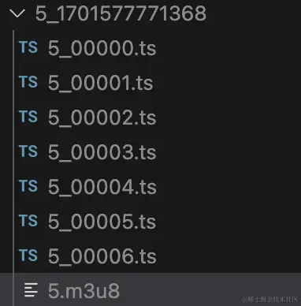

`ts`是视频文件，`m3u8`更像是索引文件，用来描述`ts`，比如在什么时间，播放什么`ts`。主要内容如下：

```
#EXTM3U
#EXT-X-VERSION:3
#EXT-X-TARGETDURATION:10
#EXT-X-MEDIA-SEQUENCE:0
#EXTINF:10.380622,
5_00000.ts
#EXTINF:10.380622,
5_00001.ts
#EXTINF:10.380622,
5_00002.ts
#EXTINF:10.380622,
5_00003.ts
#EXTINF:6.560556,
5_00004.ts
#EXTINF:1.619378,
5_00005.ts
#EXTINF:5.024189,
5_00006.ts
#EXT-X-ENDLIST

```

## 2.视频的标准加密

`HLS`协议标准加密采用的是`AES`对称加密方案。先来实现一个最标准的加密：

首先通过`node`原生模块`crypto`生成加密密钥：

```ts
import crypto from 'node:crypto';
// 生成加密密钥
const key = crypto.createHash('sha256').update(crypto.randomBytes(32)).digest('base64');
const filePathKey = path.join(__dirname, `../../public/uploads/hls/${dir}/${fileName}.key`);

const content = `${ctx.origin}/uploads/hls/${dir}/${fileName}.key\n${filePathKey}\n`;
// 密钥的文件
const fileKey = await writeFile(path.join(__dirname, `../../public/uploads/hls/${dir}/${fileName}.key`), key);
const keyInfoPath = path.join(__dirname, `../../public/uploads/hls/${dir}/${fileName}_key.bin`);
// ffmpeg 需要的 key.info
const keyInfo = await writeFile(keyInfoPath, content);
```

然后再执行`ffmpeg`命令，这里同样需要用`node`的`spawn`模块进行封装成接口：

```sh
ffmpeg -i input.mp4 -hls_time 10 -hls_list_size 0 -c:v h264 -b:v 2M -hls_key_info_file keyInfoPath -hls_segment_filename output_%05d.ts output.m3u8 -y
```

主要就增加了一个`hls_key_info_file`参数，表示加密密钥的地址。这时候，生成的`m3u8`文件就发生了变化，多了一行：

```
#EXTM3U
#EXT-X-VERSION:3
#EXT-X-TARGETDURATION:10
#EXT-X-MEDIA-SEQUENCE:0
#EXT-X-KEY:METHOD=AES-128,URI="http://localhost:30103/uploads/hls/5_1701577743851/5.key",IV=0x00000000000000000000000000000000
#EXTINF:10.380622,
5_00000.ts
#EXTINF:10.380622,
5_00001.ts
#EXTINF:10.380622,
5_00002.ts
#EXTINF:10.380622,
5_00003.ts
#EXTINF:6.560556,
5_00004.ts
#EXTINF:1.619378,
5_00005.ts
#EXTINF:5.024189,
5_00006.ts
#EXT-X-ENDLIST

```

多了

```
#EXT-X-KEY:METHOD=AES-128,URI="http://localhost:30103/uploads/hls/5_1701577743851/5.key",IV=0x00000000000000000000000000000000
```

- `METHOD`字段表示加密方式，这里是`AES`
- `URI`表示密钥地址，这里是`http://localhost:30103/uploads/hls/5_1701577743851/5.key`，
- `IV`是加密解密时的偏移量，现在是 0

上述加密方式，虽然视频确实加密了，但会把密钥地址写在`m3u8`里。等于把房间上锁，然后在锁上贴一个纸条，上面写了密码。

## 3.更好的安全方案

- 有加密，必然需要解密

首先我们知道，视频要在`web`端进行播放，那么无论如何，都肯定需要先解密，再播放。

- 肯定不能在`web`端放置密钥
- `web`端需要知道如何获取密钥
- 密钥用一次即失效，每次加密视频都生成新的密钥

目前更好的安全性方式主要有两种：

1. 在请求密钥的地址上进行加固：

- 校验`cookie`，既然是发起请求，那么同域名会自动携带`cookie`，只有购买过的用户才能获取密钥。（总不能让付费的用户也不能看吧）
- 生成密钥链接时，带上`ticket`，短时间失效，控制时效性
- 请求头携带`auth`，进行用户校验。比如`jwt`方案就是如此

1. 采用私有加密方式，比如`m3u8`里的`METHOD`，可能不再是`AES`这种对称加密。自定义一套加密规则，这种方式安全性会极大提高，但同时就不遵守`HLS`协议的标准了。但大多数浏览器支持`MediaSource`。可以读取文件内容，进行自定义加密和解密。根据上文的兼容性调研，`MediaSource`在`IOS`上将会有兼容性问题，所以这种方案在`IOS`上也会有兼容性问题。

## 4.自适应码率播放

这里先介绍一下码率和清晰度的关系：

码率是指：

> 码率（也称为比特率）是指视频文件在单位时间内使用的数据流量。它反映了视频文件的数据压缩程度，码率越高，压缩比就越小，画面质量就越高，但文件体积也越大。通俗来说，码率可以看作是取样率，是视频编码中画面质量控制中最重要的部分。计算公式是文件体积=时间 X 码率/8。

所以简单来说，码率越高，清晰度就越好。成正比关系。

需要根据视频的质量，和业务场景，去定义，这里给出阿里云对码率和清晰度的定义，可供参考：

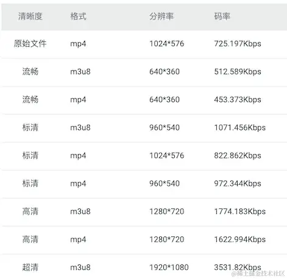

为了实现自适应码率播放，我们需要将不同码率的`m3u8`合并成一个多码率的`m3u8`。

这里我没找到合适的`ffmpeg`命令，但总有办法的，最万能的方法就是，查看`HLS`协议中多码率的`m3u8`格式标准，自己写一个。

目前用`node`去写一个这样的索引文件，具体内容如下：

```
#EXTM3U
#EXT-X-STREAM-INF:PROGRAM-ID=1,BANDWIDTH=1000000,CODECS="mp4a.40.2,avc1.64001f",RESOLUTION=1280x720,NAME="720"
hls/5_1701577771368/5.m3u8
#EXT-X-STREAM-INF:PROGRAM-ID=2,BANDWIDTH=50000,CODECS="mp4a.40.5,avc1.42000d",RESOLUTION=320x184,NAME="320"
hls/5_1701577744714/5.m3u8
```

- `#EXT-X-STREAM-INF`: 流媒体的描述
- `PROGRAM-ID`: 表示唯一的`ID`。
- `BANDWIDTH`: 流媒体的带宽，即每秒传输的数据量。这里带宽为`50000`，意味着每秒传输的数据量大约为`50kbps`。
- `CODECS`: 流媒体使用的编解码器。这里是使用了`mp4a.40.5`（`AAC`音频编码）和`avc1.42000d`（`AVC`视频编码）。
- `RESOLUTION`: 这个字段指示了视频的分辨率，即宽度和高度。在这个例子中，视频分辨率为`320x184`。
- `NAME`: 这个字段为流媒体提供了一个名称，本例中名称为"`320`"。我会习惯把清晰度放在`NAME`这个字段这里，方便`web`端获取

实现一个接口，传入以上的参数，动态拼接字符串，写入文件

```ts
async generateMasterPlayList(ctx: Context): Promise<void> {
    try {
      const { paths, filename = Date.now() } = ctx.request.body;
      let content = `#EXTM3U\n`;
      paths.forEach((item: MasterPlayListOption, index: number) => {
        const { id = index, bandWidth, codecs, resolution, name, url } = item;
        content += `#EXT-X-STREAM-INF:PROGRAM-ID=${id},BANDWIDTH=${bandWidth},CODECS="${codecs}",RESOLUTION=${resolution},NAME="${name}"\n${url}\n`;
      });
      const dir = path.join(__dirname, `../../public/uploads/hls/`);
      if (!existsSync(dir)) {
        await createDir(dir);
      }
      const filePath = dir + (filename.toString().endsWith('.m3u8') ? filename : `${filename}.m3u8`)
      const { success, error } = await writeFile(filePath, content);
      const basename = path.basename(filePath);
      return success
        ? ctx.successHandler({
            url: `${ctx.origin}/uploads/hls/${basename}`,
          })
        : ctx.failHandler(error);
    } catch (error) {
      ctx.errorHandler(error);
    }
  }
```

那么`HLS`是如何自适应码率的呢？

其实是根据`BANDWIDTH`这个字段，因为我们给不同的视频设置了不同的`BANDWIDTH`。那么就可以根据当前的网速，进行动态切换。

# 七.web 端的实现

上面做了大量的工作，主要是生成了`HLS`协议的视频播放的地址。接下来就是如何在`web`端进行播放。

## 1.技术选型

我首先是看了现有的播放器`npm`，比较知名的

- 有西瓜`playler`： https://github.com/bytedance/xgplayer
- 阿里云点播方案：https://help.aliyun.com/zh/vod/developer-reference/overview-14
- 知乎的`player`：https://github.com/zhihu/griffith

其中知乎和西瓜的播放器是开源的，阿里云点播方案没有开源代码，但是有开源`demo`。

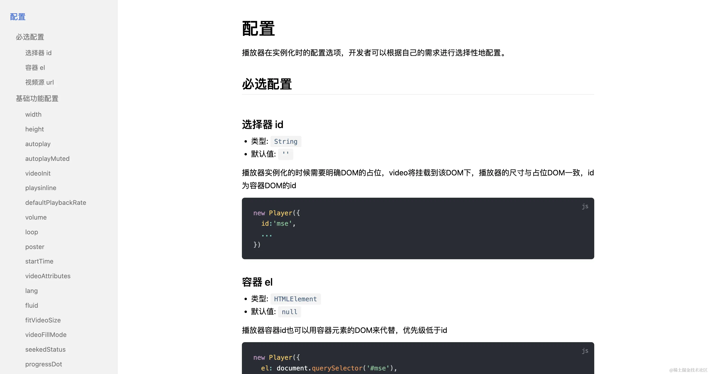

但基本上实现的功能都很丰富，同时配置项会不断的增加。

如果只是简单的初始化一个播放器，那还好。但一般这种场景，我们都会对播放器进行一定程度的定制化。比如 B 站。

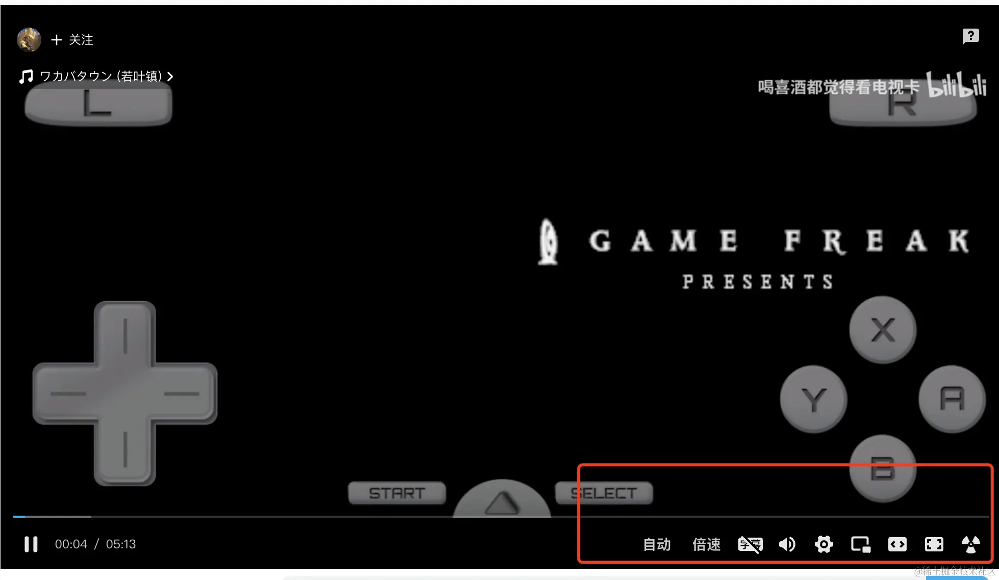

就多了很多自定义的控件。进度条也是小电视的形状。

我们这边也是如此，有自己的主题色，有自己的播放按钮等等，还有一些业务功能，也要放在控制条上。

上述的开源方案，都需要花时间去研究配置项，而且使用方法都是`new Player(options)`的形式。

但尽量视图的归视图，逻辑的归逻辑会更好些。

~~更何况实现一个播放器也不是很困难。~~

期望的`player`，能满足

1. 配置够简单，最好看到就知道是怎么用的
2. 方便扩展和样式覆盖
3. 支持`hls`播放
4. 尽量适配前端的各种框架
5. 方便接入，实现价值

## 2.播放器设计

由于现在既有`react`项目，也有`vue`项目，甚至还有一些老的`jquery`项目。为了做到一次开发，任何项目都可以使用和接入。采用了`web components`技术方案。

`web components`就不做介绍了，具体可以去看这篇文章：[手写 web components 组件](https://juejin.cn/post/7170219296226803725)简单来说就是可以自定义元素，让我们像使用`div`一样使用自定义元素。

播放器我们需要考虑的点有：

1. `video`生命周期：`loadedmeta`，`canplay`, `ended`, `error`等
2. `video`状态：播放，正在播放，暂停，静音等
3. `video`属性：总时长，当前时长，音量大小，倍速等
4. `video`交互：暂停，播放，知识点，清晰度，倍速，全屏，进度控制，音量控制等

### (1).video 的生命周期

对于 video 的生命周期，我们期望做到两件事情：

1. 我们能知道当前`video`处于什么生命周期
2. 在不同的生命周期，能挂载自定义事件。比如视频触发了`ended`。我们需要在`ended`时期跳转下一个视频

因此，我们需要监听`video`的生命周期：

```ts
listenEvent = () => {
  if (!this._video) return;
  this.clearListenerEvent();
  this._video.addEventListener('canplay', this.onCanplay);
  this._video.addEventListener('canplaythrough', this.onCanplaythrough);
  this._video.addEventListener('complete', this.onComplete);
  this._video.addEventListener('durationchange', this.onDurationchange);
  this._video.addEventListener('emptied', this.onEmptied);
  this._video.addEventListener('ended', this.onEnded);
  this._video.addEventListener('error', this.onError);
  this._video.addEventListener('loadeddata', this.onLoadeddata);
  this._video.addEventListener('loadedmetadata', this.onLoadedmetadata);
  this._video.addEventListener('loadstart', this.onLoadstart);
  this._video.addEventListener('pause', this.onPause);
  this._video.addEventListener('play', this.onPlay);
  this._video.addEventListener('playing', this.onPlaying);
  this._video.addEventListener('progress', this.onProgress);
  this._video.addEventListener('ratechange', this.onRatechange);
  this._video.addEventListener('seeked', this.onSeeked);
  this._video.addEventListener('seeking', this.onSeeking);
  this._video.addEventListener('stalled', this.onStalled);
  this._video.addEventListener('suspend', this.onSuspend);
  this._video.addEventListener('timeupdate', this.onTimeupdate);
  this._video.addEventListener('volumechange', this.onVolumechange);
  this._video.addEventListener('waiting', this.onWaiting);
};
```

在触发不同的时期时，让开发者知道。所以我们要先自定义事件，进行触发

```ts
const change = (name: string, value: unknown): void => {
  const currentTime = this.getCurrentTime();
  const duration = this.getTotalTime();
  this.dispatchEvent(
    new CustomEvent('change', {
      detail: {
        type: name,
        data: value,
        currentTime,
        duration,
        tag: this, // 整个 player 的实例
      },
    }),
  );
};
const onCanplaythrough = (e: Event) => {
  this.ctx.currentState = e.type;
  this.change('canplaythrough', e);
};
```

这样就可以，当生命周期事件触发后，就会触发`onchange`。
在使用上，我们可以：

```jsx
<r-player onChange={change} src="hls/example.m3u8" ></r-player>

const change = (e:CustomEvent) => {
    const { type, data, currentTime, duration, tag } = e.detail
    if(type === 'ended'){
        console.log('video ended')
    }
}
```

其中`type`的类型有：

| 名称           | 说明                                                                                                              |
| -------------- | ----------------------------------------------------------------------------------------------------------------- |
| canplay        | 浏览器可以播放媒体文件了，但估计没有足够的数据来支撑播放到结束，不必停下来进一步缓冲内容。                        |
| canplaythrough | 浏览器估计它可以在不停止内容缓冲的情况下播放媒体直到结束。                                                        |
| complete       | OfflineAudioContext 渲染完成。                                                                                    |
| durationchange | duration 属性的值改变时触发。                                                                                     |
| emptied        | 媒体内容变为空；例如，当这个 media 已经加载完成（或者部分加载完成），则发送此事件，并调用 load() 方法重新加载它。 |
| ended          | 视频停止播放，因为 media 已经到达结束点。                                                                         |
| loadedmetadata | 已加载元数据。                                                                                                    |
| progress       | 在浏览器加载资源时周期性触发。                                                                                    |
| ratechange     | 播放速率发生变化。                                                                                                |
| seeked         | 跳帧（seek）操作完成。                                                                                            |
| seeking        | 跳帧（seek）操作开始。                                                                                            |
| stalled        | 用户代理（user agent）正在尝试获取媒体数据，但数据意外未出现。                                                    |
| suspend        | 媒体数据加载已暂停。                                                                                              |
| loadeddata     | media 中的首帧已经完成加载。                                                                                      |
| timeupdate     | currentTime 属性指定的时间发生变化。                                                                              |
| volumechange   | 音量发生变化。                                                                                                    |
| waiting        | 由于暂时缺少数据，播放已停止。                                                                                    |
| play           | 播放已开始。                                                                                                      |
| playing        | 由于缺乏数据而暂停或延迟后，播放准备开始。                                                                        |
| pause          | 播放已暂停。                                                                                                      |
| volume         | 音量发生变化。                                                                                                    |
| fullscreen     | 触发全屏事件                                                                                                      |

在不同的生命周期，能挂载事情，因此我们需要一个发布订阅类。

```ts
type Callback = (...args: unknown[]) => unknown;

type EventName = string | symbol;

type EventItem = {
  name?: string | symbol;
  callback: Callback;
  initialCallback?: Callback;
};

const NEW_LISTENER = 'NEW_LISTENER';

export class SyncHook {
  private _events: Record<EventName, Array<EventItem>>;
  constructor() {
    this._events = {};
  }
  on = (eventName: EventName, eventItem: EventItem | Callback): void => {
    if (this._events[eventName] && eventName !== Symbol.for(NEW_LISTENER)) {
      this.emit(Symbol.for(NEW_LISTENER), eventName);
    }

    const callbacks = this._events[eventName] || [];
    if (typeof eventItem === 'function') {
      callbacks.push({
        name: eventName,
        callback: eventItem,
      });
    } else {
      callbacks.push(eventItem);
    }

    this._events[eventName] = callbacks;
  };

  emit = (eventName: EventName, ...args: Array<unknown>): void => {
    const callbacks = this._events[eventName] || [];
    callbacks.forEach((item) => {
      const { callback } = item;
      callback(...args);
    });
  };

  once = (eventName: EventName, eventItem: EventItem | Callback): void => {
    let one: EventItem;
    if (typeof eventItem === 'function') {
      one = {
        name: eventName,
        callback: (...args: Array<unknown>) => {
          eventItem(...args);
          this.off(eventName, one);
        },
        initialCallback: eventItem,
      };
    } else {
      const { callback } = eventItem;
      one = {
        name: eventName,
        callback: (...args: Array<unknown>) => {
          callback(...args);
          this.off(eventName, one);
        },
        initialCallback: callback,
      };
    }
    this.on(eventName, one);
  };

  off = (eventName: EventName, eventItem: EventItem | Callback): void => {
    const callbacks = this._events[eventName] || [];
    const newCallbacks = callbacks.filter((item) => {
      if (typeof eventItem === 'function') {
        return item.callback !== eventItem && item.initialCallback !== eventItem;
      } else {
        const { callback } = eventItem;
        return item.callback !== callback && item.initialCallback !== callback;
      }
    });
    this._events[eventName] = newCallbacks;
  };
}
```

因此会给`player`元素上增加一个`ctx`属性，作为全局的上下文。

```ts
this.ctx = {
  currentTime: 0, // 当前时间
  duration: 0, // 总时长
  currentState: '', // 当前视频状态
  action: new SyncHook(), // 不同时期触发的状态
};
```

我们想订阅视频的结束事件，我们可以

通过`Ref`的方式：

```
<r-player ref={PlayerRef} onChange={change} src="hls/example.m3u8" ></r-player>

const endedEvent = () => {
    console.log('video ended')
}

PlayerRef.current.ctx.action.off('ended',endedEvent)

PlayerRef.current.ctx.action.on('ended',endedEvent)
```

通过`change`方法获取的实例：

```jsx
<r-player onChange={change} src="hls/example.m3u8" ></r-player>

let player

const endedEvent = () => {
    console.log('video ended')
}

const change = (e:CustomEvent) => {
    const { type, data, currentTime, duration, tag } = e.detail
    player = tag
}

player.action.off('ended',endedEvent)
player.action.on('ended',endedEvent)
```

### (2).video 的状态和属性

需要在全局上下文中记录下播放器的状态和属性：

```ts
this.ctx = {
  currentTime: 0, // 当前时间
  duration: 0, // 总时长
  currentState: '', // 当前视频状态
  action: new SyncHook(), // 不同时期触发的状态
  volume: 0.5, // 当前音量
  playbackRate: 1, // 当前倍速
  clarity: '', // 当前清晰度
  fullScreen: false, // 是否全屏
  levels: [], // 清晰度列表
  url: '', // 当前播放的地址
  levelMap: new Map(), // 清晰度和名字的映射关系
};
```

### (3).自定义 video

默认长这个样子

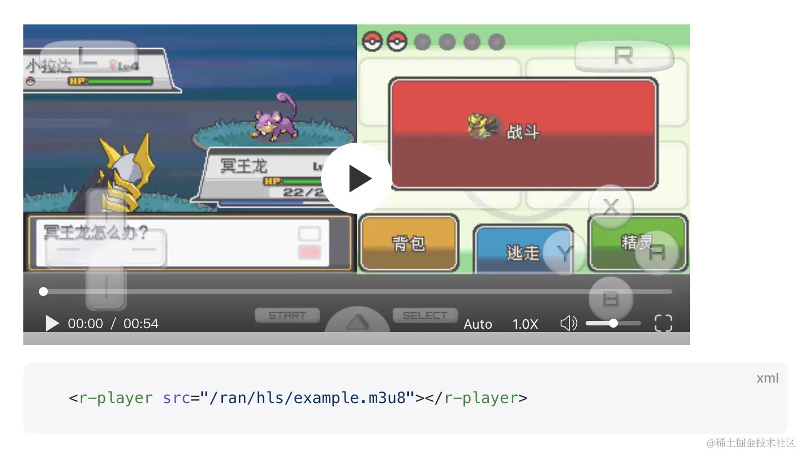

demo 地址：https://chaxus.github.io/ran/src/ranui/player/

源码地址：https://github.com/chaxus/ran/tree/main/packages/ranui

如果不喜欢控制器或者按钮，直接样式覆盖，更符合直觉，没有学习成本。

```css
.ran-player-controller {
  display: none;
}
```

由于播放器本身就是一个元素，那么可以任意的在里面添加元素，添加逻辑。

```jsx
<r-player onChange={change} src="hls/example.m3u8">
  <div>111111</div>
</r-player>
```

所以，这就解决配置项，长达好几页的问题，同时看到也就知道怎么配置，怎么开发了。

# 八。总结

目前已经从前后端的角度，实现了

1. 视频的标准加密
2. 视频的动态码率播放
3. 视频的分片加载
4. 可拖拽进度条
5. 音量控制
6. 手动清晰度切换
7. 倍速播放
8. 样式自定义覆盖
9. 基于原生开发，可在所有框架运行，统一跨框架情况，各浏览器控件统一

这是`demo`和源码地址：

`demo`和文档地址：https://chaxus.github.io/ran/src/ranui/player/

源码地址：https://github.com/chaxus/ran/tree/main/packages/ranui

`demo`文档做了国际化，可切换到中文
