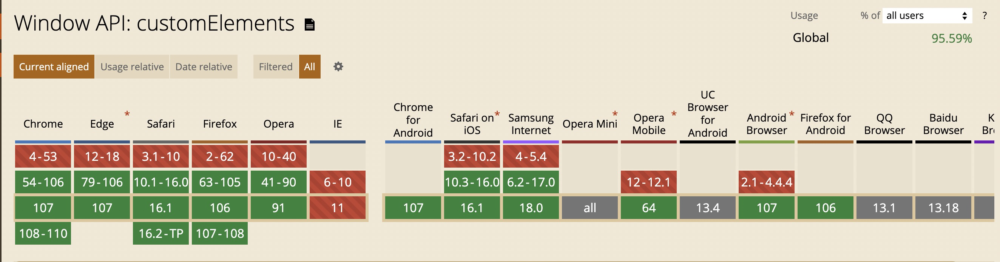

# ranui

基于 `Web Components`开发方案

## Feature 特点

1. **高度跨框架兼容**: 能够轻松适配多种主流前端框架，包括`React`、`Vue`、`Preact`、`SolidJS`、`Svelte`等，甚至任何基于`JavaScript`并遵循`W3C`标准的项目也能无缝集成。无论您的技术栈如何选择，我们都能提供稳定且一致的支持。
2. **原生纯粹的体验**: 无需依赖`npm`、`React/Vue`等前端框架，也无需`webpack/vite`等复杂的构建工具，真正回归`Web`技术的最本质。您可以像操作原生`div`标签一样轻松上手，即刻感受技术的纯粹与直观。这样的设计不仅简化了项目的结构，更降低了学习和使用的成本，让每一个开发者都能体验到`Web`技术的原生魅力。
3. **极致模块化设计**: 采用最小模块化原则，将庞大复杂的系统或应用程序精心拆解为尺寸极小、功能独立且易于复用的组件单元。有助于提高代码的可维护性、可扩展性和可重用性
4. **全面开源自由学习**: 项目完全遵循`MIT`开源协议，所有源代码毫无保留地对外开放。这意味着可以自由地访问、学习、参考甚至修改我们的代码，无论是为了个人提升还是商业应用，我们都为您提供了一个开放、透明的平台。坚信，**开源是促进技术进步和创新的重要途径**。
5. **交互式丰富文档**: 提供详尽且互动性强的文档，其中所有组件实例均可进行实时交互，让您在阅读的同时能够直接体验组件功能，加深理解并快速上手。这样的设计旨在为您提供最直观、最高效的学习体验。
6. **支持类型校验**: 开发环境完全基于`TypeScript`构建，配备了完整的声明文件和类型定义，确保无论是`JavaScript`还是`TypeScript`项目都能得到顺畅的集成。通过强大的类型检查功能，我们极大地提升了代码的可读性、可维护性，以及项目的稳健性，为开发工作带来前所未有的便捷与安心。
7. **更加持久和稳定**：具备出色的稳定性，无需担忧类似于`React`从`15`版升级到`16`版（`fiber`），或`Vue`从`2`版升级到`3`版时（`hooks`）可能遭遇的破坏性更新问题。我们确保您的组件不会因此被迫进行不必要的更新或重新开发，从而避免了潜在的项目中断和额外工作量。意味着选择了持续、无忧的项目运行。

## Situation 项目情况

<a style="display:inline-block;margin-left: 4px;" href="https://github.com/chaxus/ran"></a>
<a style="display:inline-block;margin-left: 4px;" href="https://github.com/chaxus/ran"></a>
<a style="display:inline-block;margin-left: 4px;" href="https://github.com/chaxus/ran"></a>
<a style="display:inline-block;margin-left: 4px;" href="https://github.com/chaxus/ran"></a>
<a style="display:inline-block;margin-left: 4px;" href="https://github.com/chaxus/ran"></a>

- `git`：<a href="https://github.com/chaxus/ran/tree/main/packages/ranui">`https://github.com/chaxus/ran/tree/main/packages/ranui`</a>
- `npm`：<a href="https://www.npmjs.com/package/ranui">`https://www.npmjs.com/package/ranui`</a>

## Usage 使用

大多数情况都可以像原生的 `div` 标签一样使用。

接下来是一些使用例子

1. `html`
2. `js`
3. `jsx`
4. `vue`
5. `tsx`

### 1.`html`

```html
<script src="./ranui/dist/umd/index.umd.cjs"></script>

<body>
  <r-button>Button</r-button>
</body>
```

### 2.`js`

```js
import 'ranui';

const Button = document.createElement('r-button');
Button.appendChild('this is button text');
document.body.appendChild(Button);
```

### 3.`jsx`

由于`react`有合成事件，为了更加方便的使用，通过`react`高阶组件进行封装[ranui](https://www.npmjs.com/package/ranui)，输出了[@ranui/react](https://www.npmjs.com/package/@ranui/react)

在`react`中，使用[@ranui/react](https://www.npmjs.com/package/@ranui/react)会更加丝滑，通过高阶函数包裹后，与`react`生态系统完全融合。

然而，[ranui](https://www.npmjs.com/package/ranui)仍然可以在任何`js`或者`ts`中使用。

```jsx
import 'ranui';
const App = () => {
  return (
    <>
      <r-button>Button</r-button>
    </>
  );
};
```

### 4.`vue`

```vue
<template>
  <r-button>Button</r-button>
</template>
<script>
import 'ranui';
</script>
```

### 5.`tsx`

由于`react`有合成事件，为了更加方便的使用，通过`react`高阶组件进行封装[ranui](https://www.npmjs.com/package/ranui)，于是有了[@ranui/react](https://www.npmjs.com/package/@ranui/react)

在`react`中，使用[@ranui/react](https://www.npmjs.com/package/@ranui/react)会更加丝滑，通过高阶函数包裹后，与`react`生态系统完全融合。

然而，[ranui](https://www.npmjs.com/package/ranui)仍然可以在任何`js`或者`ts`中使用。

```tsx
// react 18
import type { SyntheticEvent } from 'react';
import React, { useRef } from 'react';
import 'ranui';

const FilePreview = () => {
  const ref = useRef<HTMLDivElement | null>(null);
  const uploadFile = (e: SyntheticEvent<HTMLDivElement>) => {
    if (ref.current) {
      const uploadFile = document.createElement('input');
      uploadFile.setAttribute('type', 'file');
      uploadFile.click();
      uploadFile.onchange = (e) => {
        const { files = [] } = uploadFile;
        if (files && files?.length > 0 && ref.current) {
          ref.current.setAttribute('src', '');
          const file = files[0];
          const url = URL.createObjectURL(file);
          ref.current.setAttribute('src', url);
        }
      };
    }
  };
  return (
    <div>
      <r-preview ref={ref}></r-preview>
      <r-button type="primary" onClick={uploadFile}>
        choose file to preview
      </r-button>
    </div>
  );
};
```

`jsx`在`TypeScript`中定义了所有`html`原生组件的类型。`web component`类型不在`jsx`定义中。需要手动添加。否则会有类型问题，但它实际上是有效的。

```ts
// typings.d.ts
interface RButton {
  type?: string;
  onClick?: React.MouseEventHandler<HTMLDivElement> | undefined;
}

interface RPreview {
  src?: string | Blob | ArrayBuffer;
  onClick?: React.MouseEventHandler<HTMLDivElement> | undefined;
  ref?: React.MutableRefObject<HTMLDivElement | null>;
}

declare namespace JSX {
  interface IntrinsicElements {
    'r-preview': React.DetailedHTMLProps<React.HTMLAttributes<HTMLDivElement>, HTMLDivElement> & RPreview;
    'r-button': React.DetailedHTMLProps<React.HTMLAttributes<HTMLDivElement>, HTMLDivElement> & RButton;
  }
}
```

## Import 导入方式

支持按需引入

```js
import 'ranui/button';
```

对于一些全局展示的组件，比如 `preview` 和 `message`，需要加载一些额外的样式

```js
import 'ranui/preview';
import 'ranui/style';
```

也可以全局导入，更加方便，这样什么都不用考虑了，梭哈完事。

- `ES module`

```js
import 'ranui';
```

- `UMD`, `IIFE`, `CJS`

```html
<script src="./ranui/dist/umd/index.umd.cjs"></script>
```

## Overview 组件总览

- `Button`

<div style="display:inline-block;margin-right: 8px;margin-bottom: 12px;">
     <r-button type="primary">主要按钮</r-button>
</div>
<div style="display:inline-block;margin-right: 8px;margin-bottom: 12px;">
     <r-button type="warning">警告按钮</r-button>
</div>
<div style="display:inline-block;margin-right: 8px;margin-bottom: 12px;">
    <r-button type="text">文本按钮</r-button>
</div>
<div style="display:inline-block;margin-right: 8px;margin-bottom: 12px;">
    <r-button >默认按钮</r-button>
</div>

- `Icon`

<div style='display:flex'>
     <r-icon name="lock" size="50" ></r-icon>
     <r-icon name="user" size="50" ></r-icon>
     <r-icon name="loading" size="50" color="#1E90FF" spin></r-icon>
</div>

- `Skeleton`

<div style="width: 100px;margin-top:10px">
    <r-skeleton ></r-skeleton>
</div>
<div style="margin-top:10px">
    <r-skeleton ></r-skeleton>
</div>
<div style="margin-top:10px">
    <r-skeleton ></r-skeleton>
</div>
<div style="width: 200px;margin-top:10px;margin-bottom: 12px;">
    <r-skeleton ></r-skeleton>
</div>

- `Input`

<div style="display:block;margin-right: 8px;margin-bottom: 12px;">
     <r-input label="user"></r-input>
</div>

<div style="display:block;margin-right: 8px;margin-bottom: 12px;">
     <r-input icon="lock" type="password"></r-input>
</div>

- `message`

<r-button onclick="message.info('这是一条提示')">信息提示</r-button>
<r-button onclick="message.warning('这是一条提示')">警告提示</r-button>
<r-button onclick="message.error('这是一条提示')">错误提示</r-button>
<r-button onclick="message.success('这是一条提示')">成功提示</r-button>
<r-button onclick="message.toast('这是一条提示')">toast 提示</r-button>

- `Tab`

<div style="display:block;margin-right: 8px;margin-bottom: 12px;">
   <r-tabs>
      <r-tab label="home" icon="home">tab1</r-tab>
      <r-tab label="message" icon="message">tab2</r-tab>
      <r-tab label="user" icon="user">tab3</r-tab>
   </r-tabs>
</div>

- `Radar`

<r-radar style="width:300px;height:300px;display: block;" abilitys='[{"abilityName":"生命","scoreRate":"10"},{"abilityName":"攻击","scoreRate":"90"},{"abilityName":"防御","scoreRate":"20"},{"abilityName":"元素精通","scoreRate":"50"},{"abilityName":"暴击率","scoreRate":"80"},{"abilityName":"暴击伤害","scoreRate":"50"}]'></r-radar>

- `Progress`

<r-progress type="drag" ></r-progress>

- `Player`

<r-player style="display: block;width:100%;max-width:600px;height:300px;" src="/ran/hls/example.m3u8"></r-player>

- `Select`

<r-select style="width: 120px; height: 40px" action="click,hover">
<r-option value="185">Mike</r-option>
<r-option value="186">Tom</r-option>
<r-option value="187">Lucy</r-option>
</r-select>

## Event 事件

- `react`

[@ranui/react](https://www.npmjs.com/package/@ranui/react) 是由`react`高阶函数封装[ranui](https://www.npmjs.com/package/ranui)而成，`Event` 事件遵循`react`事件规范。跟`W3C`标准略有不同。

- 现代`web`标准

在`W3C`标准中，你可以使用`on`属性在`HTML`元素上定义事件处理程序。但这是旧的事件处理程序的方法。

现代的`web`开发推荐使用`addEventListener`方法。

```html
<r-button id="button">按钮</r-button>

<script>
  const button = document.getElementById('button');
  button.addEventListener('click', function (event) {
    alert('新的点击事件！');
  });
</script>
```

然而，如果你确实需要使用`on`属性，下面是一个示例：

```html
<r-input onchange="change(this.value)"></r-input>

<script>
  function change(e) {
    console.log('e--->', e);
  }
</script>
```

请注意，使用`on`属性来定义事件处理程序有一些限制和缺点。

例如，你不能使用事件捕获或事件委托，而且每个事件类型都需要一个单独的属性。

这也是为什么现代的`web`开发推荐使用`addEventListener`方法的原因。

还可以使用`property`的方式：

```html
<r-input id="input"></r-input>

<script>
  const input = document.getElementById("input")
  input.onchange = (e) {
    console.log('e--->', e)
  }
</script>
```

## style 自定义样式

### `::part`伪类

```html
<r-input id="input"></r-input>

<style>
  /* #input 指的是当前的自定义元素
  ::part(input) 中的input指的是，当前自定义元素内部的 Shadow DOM 元素的类 */
  #input::part(input) {
    width: 100px;
  }
</style>
```

具体的伪类名称可以查看具体的具体介绍

### 通过`sheet`属性传入

会在所有的组件上加一个`sheet`属性，传入`CSSStyleSheet`字符串。会直接插入到`Shadow DOM`中

### `css3`变量`var`

通过给组件设置`css3`变量，从而自定义组件内部的指定样式，比如：

<r-progress percent="70" total="100"></r-progress>
<r-progress percent="70" total="100" style="--ran-progress-wrap:linear-gradient(to right, #ff0000, #ffff00, #00ff00, #00ffff, #0000ff, #ff00ff, #ff0000);"></r-progress>

```html
<r-progress percent="70" total="100"></r-progress>
<r-progress
  percent="70"
  total="100"
  style="--ran-progress-wrap:linear-gradient(to right, #ff0000, #ffff00, #00ff00, #00ffff, #0000ff, #ff00ff, #ff0000);"
></r-progress>
```

具体`css3`变量名称可以参考每个组件的介绍和说明

## Compatibility 兼容性

- 不支持 `IE`，其他均有较好支持



## Contributors 贡献者

<a href="https://github.com/chaxus/ran/graphs/contributors">
  
</a>

## Other 相关资源

1. [优秀的组件设计](https://www.checklist.design/)
2. [在线生成 CSS 渐变色](https://webgradients.com/)
3. [优秀设计作品，有 psd 和 sketch](https://webgradients.com/)
4. [3D UI 设计，类似于 3D 版的 figma](https://spline.design/)
5. [设计规范](https://lawsofux.com/)
6. [优秀设计作品](https://dribbble.com/)
7. [element UI 中文网](https://element.eleme.cn/#/zh-CN)
8. [Ant design 中文网](https://ant.design/index-cn)
9. [在线绘制 CSS 动画](https://animista.net/)
10. [tailwindcss 组件库](https://www.tailwindcss.cn/resources)
11. [animate css 非常优秀的 css 动画](https://animate.style/)
12. [can i use 检测兼容性 API 网站](https://caniuse.com/)
13. [figma](https://www.figma.com/)

## 协议和标准

1. [RFCs](https://www.rfc-editor.org/)
2. [ECMA](https://www.ecma-international.org/)
3. [w3c](https://www.w3.org/)
