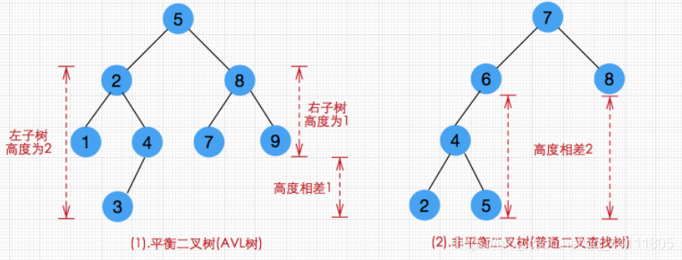

# 二叉树的定义

在计算机科学中，二叉树（Binary tree）是每个节点最多只有两个分支（即不存在分支度大于2的节点）的树结构。通常分支被称作“左子树”或“右子树”。二叉树的分支具有左右次序，不能随意颠倒[[1]](#参考文档)。。

# 二叉树的性质

- 在二叉树的第 i 层上最多有2^(i-1)个结点（i>=1）
- 深度为h的二叉树，最多有2^h-1个结点，最少有h个结点（h>=1）
- 包含n个结点的二叉树的高度至少为(log2n)+1
- 非空的二叉树，分支度为0的总数为 n0，分支度为2的总数为 n2，则n0=n2+1
- 二叉树的总结点数 n = n1 + n2 + n0
- 总连线数等于总节点数减一(B = n - 1)
- 总连线数等于分支度为2的节点的两倍加上分支度为1的节点(B = n2 * 2 + n1 * 1)

# 二叉树的类型

## 满二叉树

一棵深度为k且有 2k-1 个节点的二叉树称为满二叉树。
除最后一层无任何子节点外，每一层上的所有结点都有两个子结点的二叉树[[2]](#参考文档)。

## 完全二叉树

一棵深度为k的有n个结点的二叉树，对树中的结点按从上至下、从左到右的顺序进行编号，如果编号为i（1≤i≤n）的结点与满二叉树中编号为i的结点在二叉树中的位置相同，则这棵二叉树称为完全二叉树。

## 二叉搜索树

二叉搜索树（BST）又称二叉查找树或二叉排序树。它或者是一棵空树，或者是具有下列性质的二叉树： 若它的左子树不空，则左子树上所有结点的值均小于它的根结点的值； 若它的右子树不空，则右子树上所有结点的值均大于它的根结点的值； 它的左、右子树也分别为二叉排序树。

## 平衡二叉树

平衡二叉树(AVL)一定是二叉搜索树，且左子树和右子树的高度差的绝对值不超过1。

## B树

B树属于多叉树又名平衡多路查找树（查找路径不只两个）

## B+树

B+树是B树的变体，也是一种多路搜索树。
## B*树

B* 树是B+树的变体，在B+树的非根和非叶子结点再增加指向兄弟的指针；B* 树定义了非叶子结点关键字个数至少为(2/3)*M，即块的最低使用率为2/3（代替B+树的1/2）。B* 树分配新结点的概率比B+树要低，空间使用率更高；

## 红黑树

红黑树是一种平衡二叉查找树的变体，它的左右子树高差有可能大于 1，所以红黑树不是严格意义上的平衡二叉树（AVL），但对它进行平衡的代价较低， 其平均统计性能要强于 AVL 。

## 堆

# 遍历

## 前序遍历

## 后序遍历

## 中序遍历

## 层序遍历

# 常见算法题

## 镜像二叉树

## 重建二叉树

## 二叉树深度

## 二叉树节点总数

## 判断二叉树子结构

输入两棵二叉树A和B，判断B是不是A的子结构。（ps：约定空树不是任意一个树的子结构）

# 参考文档

1. [维基百科二叉树](https://zh.wikipedia.org/wiki/%E4%BA%8C%E5%8F%89%E6%A0%91)
2. [百度百科满二叉树](https://baike.baidu.com/item/满二叉树/7773283)