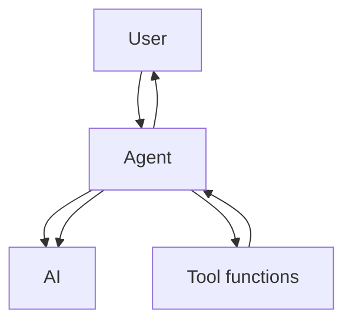

# Prompt

## System Prompt

Used to describe the AI's role, personality, background knowledge, tone, etc. In short, anything that isn't said directly by the user can go into the System Prompt.

## User Prompt

Content sent directly to the AI by the user.

Every time the user sends a User Prompt, the system automatically sends the System Prompt along with it to the AI model, which makes the interaction feel very natural.

But at this stage, the AI is still just a chatbot — you can only ask it questions, and the AI model replies to them.

So how do we get the AI model to automatically carry out tasks? This is where the Agent comes in.

# Agent

For example, suppose you want to use AI to manage some files. You'd first need to write some file management functions:

- list_file lists all files in a directory
- read_file reads the contents of a file

Then register these functions, along with their descriptions and usage instructions, with the Agent.

Based on this information, the Agent generates a System Prompt that tells the AI model what tools the user has provided and what they can do.

As well as what format the AI should return when using them.

When the user sends a User Prompt, it is sent to the AI model together with the System Prompt.

If the AI model is smart enough, it will return a response in a specific format: it needs to call a certain function, such as list_file, and hand that back to the Agent.

After parsing this, the Agent calls the corresponding function, then passes the result back to the AI. The AI then decides what to do next based on the result returned by the Agent.

This process repeats until the task is complete.

Ultimately, the tool that relays messages between the AI model, the tools it's given (list_file, read_file), and the end user is called an AI Agent.

The functions or services made available for the AI Agent to call are called Agent Tools.

But this approach has a potential problem: even though we describe and specify the format the AI should respond in inside the System Prompt, the AI model is, at the end of the day, a probabilistic model. It can still return the wrong format.

A typical AI Agent checks whether the format the AI model returns is correct, and automatically retries if it isn't. To address this scenario, FunctionCalling emerged.

# FunctionCalling

Its core purpose is to unify the format and standardize the description. In the System Prompt case above, the description is written in natural language — as long as the AI can understand it, that's enough.

FunctionCalling instead standardizes these descriptions: each Tool is defined using a JSON object, for example:

```json
{
  "name": "list_file",
  "desc": "List all files in a directory",
  "params": {
    "path": "str"
  }
}
```

These fields are then pulled out of the System Prompt, so all tool definitions, descriptions, and responses live in the same place. This means that when the AI uses a tool, it also follows the same JSON format to reply, which lets people train AI models in a more targeted way. Even so, if the AI still returns an incorrect response, because the response format is fixed, the AI service backend can detect this itself and retry automatically. The user never notices any of this, which lowers development difficulty on the client side while also saving on the token cost of retries.

But FunctionCalling has its own problem: there's no unified standard. Right now, every major vendor's API format is a bit different. Some models don't even support FunctionCalling at all, so writing a universal AI Agent is still quite a hassle.

As a result, both FunctionCalling and System Prompt approaches coexist in the wild today.

Everything above covers how the AI Agent communicates with the AI model. So how does the Agent communicate with the Agent Tool?

# MCP

Typically, the Agent and Agent Tool are written into the same program, so they can just call each other directly, and that's it.

But later, people realized that some Agent Tools are actually quite generic — for example, web browsing functionality is needed by every Agent. It wouldn't make sense to copy it into every single Agent. So they came up with a solution:

Turn the Tool into a service and host it centrally, letting every Agent call it. This process is what MCP is.

MCP is a communication protocol specifically designed to standardize how Agents and Tool services interact.

The service that runs the Tool is called an MCP Server, and the Agent that calls it is called an MCP Client.

MCP defines how the MCP Server communicates with the MCP Client, and which interfaces the MCP Server should provide — for example, letting you query what interfaces the MCP Server has, what each interface does, its description, and how to use it. Beyond the regular function-call form of Tools,

MCP can also provide data directly, offering a file-reading service called Resources, or provide prompt templates for the Agent called Prompt.

An MCP Server can either run on the same machine as the Agent and communicate over standard input/output, or be deployed on the network and communicate over HTTP.

Although MCP is a standard tailored for AI, in fact MCP itself has nothing to do with the AI model — it doesn't care which model the Agent uses. MCP is only responsible for helping the Agent manage tools, resources, and prompts.

Finally, let's summarize the whole flow:

User --> sends a message to the Agent. The Agent (MCP Client) calls functions on the MCP Server and passes the results, together with the message, to the AI model.

The AI model, via FunctionCalling or a plain reply, generates a request to call a Tool. Once the Agent receives this request, it calls the MCP Server's tool through the MCP protocol. The result is returned to the Agent, which passes it back to the AI model. The AI model then returns the final result to the Agent, and the Agent sends it on to the user.

# Writing an Agent

An Agent is a program that relays messages between the user, the AI model, and tool functions.

```mermaid
sequenceDiagram
  Tools->>Agent: Register the functions in Tools with the Agent, so the Agent knows which tool functions are available
  User->>Agent: Send the question to the Agent
  Agent->>AI: The user's question becomes the User Prompt; tool function information is also given to the AI model via System Prompt or FunctionCalling
  AI->>Agent: Think through the user's question and return a corresponding instruction, telling the Agent which methods in Tools to execute.
  Agent->>Tools: Use the methods in Tools and obtain the result
  Agent->>AI: Pass the result to the AI model; the AI model continues analyzing the problem to see whether it needs to keep calling the Agent, until it's done.
  AI->>Agent: Tell the Agent the thinking process is finished, and send the result to the Agent.
  Agent->>User: Output the final result to the user.

```

To put it simply, it works like this:


