# Abstract Syntax Tree

## 一.（`abstract syntax tree`）抽象语法树的作用

源码是一串按照语法格式来组织的字符串，人能够认识，但是计算机并不认识，想让计算机认识就要转成一种数据结构，通过不同的对象来保存不同的数据，并且按照依赖关系组织起来，这种数据结构就是抽象语法树（`abstract syntax tree`）。

之所以叫“抽象”语法树是因为数据结构中省略掉了一些无具体意义的分隔符比如 `; { }` 等。

有了 `AST`，计算机就能理解源码字符串的意思，而理解是能够转换的前提，所以编译的第一步需要把源码 `parse` 成 `AST`。

转成 `AST` 之后就可以通过修改 `AST` ，分析 `AST` 的方式来修改和分析代码，比如 `babel` 就通过这种方式进行代码的转换，比如 `rollup` 的 `Tree Shaking` ，就是通过分析 `AST`的 导入导出语法，从而分析出没有使用的代码，进行去除。

## 二.常见的 AST 节点

常见的 AST 节点
AST 是对源码的抽象，字面量、标识符、表达式、语句、模块语法、class 语法都有各自的 AST。

我们分别来了解一下：

### Literal

`Literal` 是字面量的意思，比如 `let name = 'value'`中，`'value'`就是一个字符串字面量 `StringLiteral`，相应的还有数字字面量 `NumericLiteral`，布尔字面量 `BooleanLiteral`，字符串字面量 `StringLiteral`，正则表达式字面量 `RegExpLiteral` 等。

下面这些字面量都有对应的 `Literal` 节点：

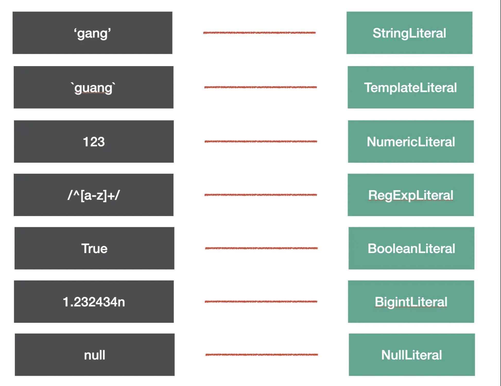

代码中的字面量很多，`babel` 就是通过 `xxLiteral` 来抽象这部分内容的。

### Identifier

`Identifer` 是标识符的意思，变量名、属性名、参数名等各种声明和引用的名字，都是`Identifer`。

我们知道， `JS` 中的标识符只能包含字母或数字或下划线 `（“_”）` 或美元符号 `（“$”）` ，且不能以数字开头。这是 `Identifier` 的词法特点。

尝试分析一下，下面这一段代码里面有多少 `Identifier` 呢？

```js
const name = 'value'

function say(name) {
  console.log(name)
}

const obj = {
  name: 'guang',
}
```

答案是这些

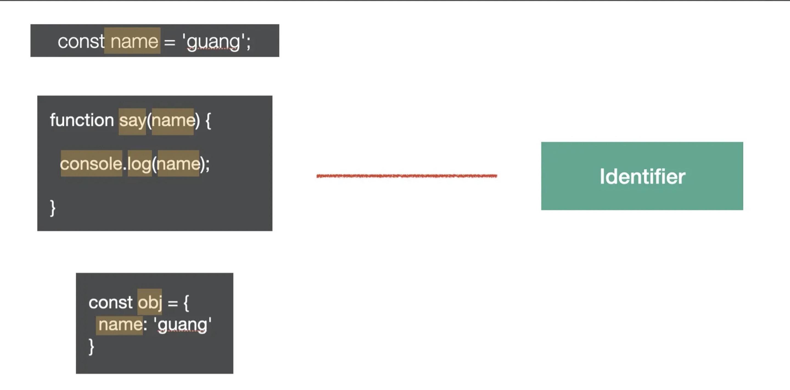

### Statement

`statement` 是语句，它是可以独立执行的单位，比如 `break、continue、debugger、return` 或者 `if` 语句、`while` 语句、`for` 语句，还有声明语句，表达式语句等。我们写的每一条可以独立执行的代码都是语句。

语句末尾一般会加一个分号分隔，或者用换行分隔。

下面这些我们经常写的代码，每一行都是一个 `Statement`：

```js
break;
continue;
return;
debugger;
throw Error();
{}
try {} catch(e) {} finally{}
for (let key in obj) {}
for (let i = 0;i < 10;i ++) {}
while (true) {}
do {} while (true)
switch (v){case 1: break;default:;}
label: console.log();
with (a){}
```

它们对应的 AST 节点如下图所示：

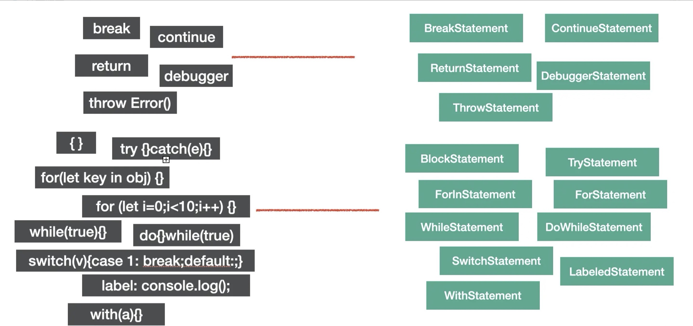

语句是代码执行的最小单位，可以说，代码是由语句 `（Statement）` 构成的。

### Declaration

声明语句是一种特殊的语句，它执行的逻辑是在作用域内声明一个变量、函数、 `class、import、export` 等。

比如下面这些语句都是声明语句：

```js
const a = 1
function b() {}
class C {}

import d from 'e'

export default e = 1
export { e }
export * from 'e'
```

它们对应的 AST 节点如下图：

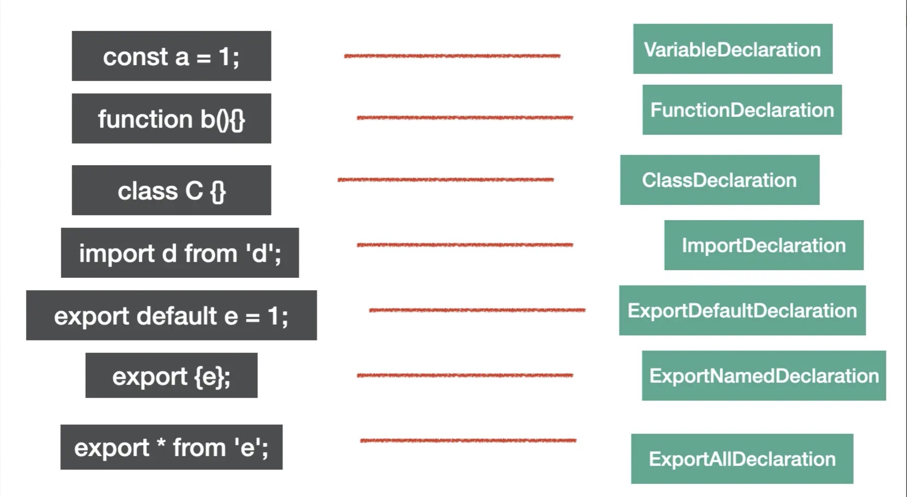

声明语句用于定义变量，这也是代码中一个基础组成部分。

### Expression

`expression` 是表达式，特点是执行完以后有返回值，这是和语句 (`statement`) 的区别。

下面是一些常见的表达式

```js
[1,2,3]
a = 1
1 + 2;
-1;
function(){};
() => {};
class{};
a;
this;
super;
a::b;
```

它们对应的 AST 如图：

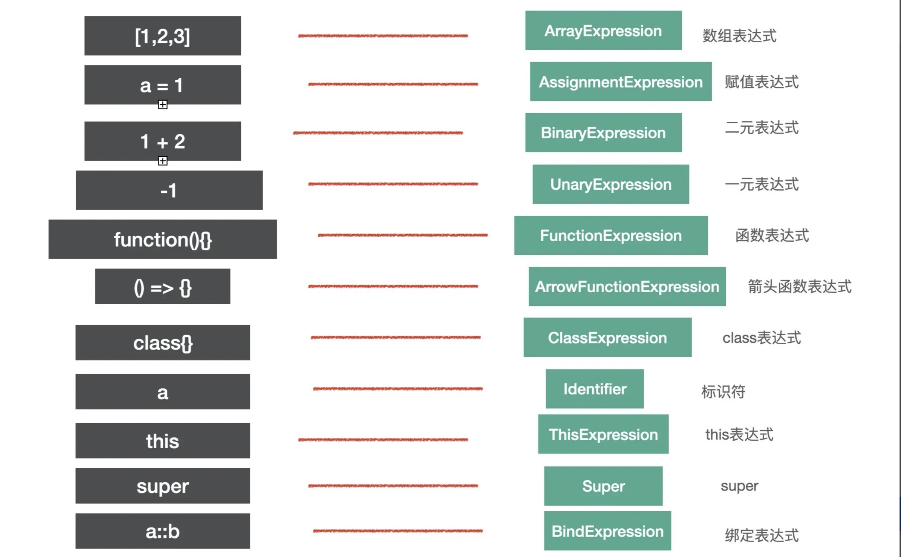

细心的同学可能会问 `identifier` 和 `super` 怎么也是表达式呢？

因为 `identifier、super` 有返回值，符合表达式的特点，所以也是 `expression` 。

我们判断 `AST` 节点是不是某种类型要看它是不是符合该种类型的特点，比如语句的特点是能够单独执行，表达式的特点是有返回值。

有的表达式可以单独执行，符合语句的特点，所以也是语句，比如赋值表达式、数组表达式等。

```js
a = 1
;[1, 2, 3]
```

但有的表达式不能单独执行，需要和其他类型的节点组合在一起构成语句。

比如匿名函数表达式和匿名 `class` 表达式单独执行会报错：

```js
function(){};
class{}
```

需要和其他部分一起构成一条语句，比如组成赋值语句：

```js
a = function () {}
b = class {}
```

这条赋值语句对应的 `AST` 是这样的：

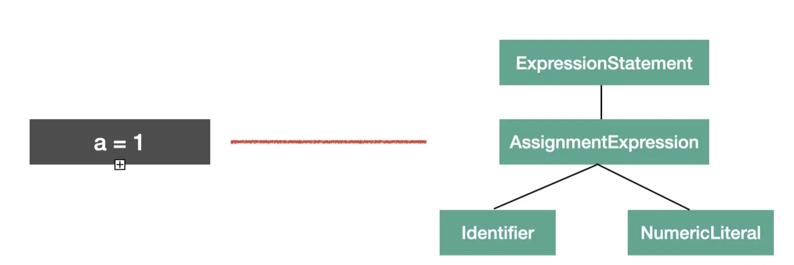

你会发现赋值语句的 AST 节点 `AssignmentExpression` 包裹了一层 `ExpressionStatement` 的节点，代表这个表达式是被当成语句执行的。

### Class

`class` 的语法也有专门的 AST 节点来表示。

整个 `class` 的内容是 `ClassBody` ，属性是 `ClassProperty` ，方法是 `ClassMethod` （通过 `kind` 属性来区分是 `constructor` 还是 `method` ）。

比如下面的代码

```js
class Guang extends Person {
  name = 'guang'
  constructor() {}
  eat() {}
}
```

对应的 AST 是这样的

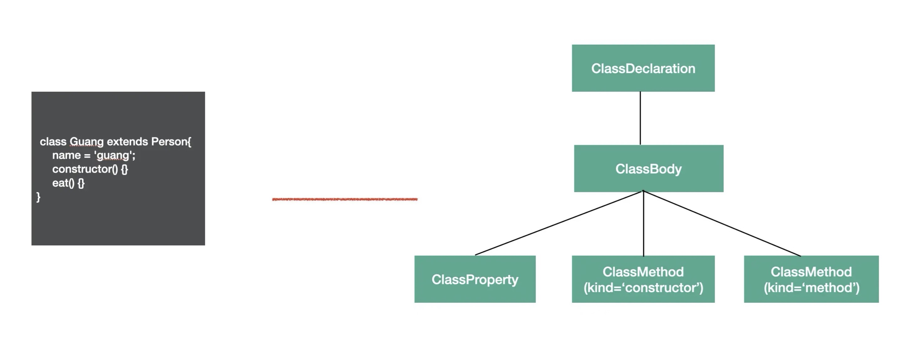

`class` 是 `es next` 的语法， `babel` 中有专门的 `AST` 来表示它的内容。

### Modules

`es module` 是语法级别的模块规范，所以也有专门的 `AST` 节点。

**import**
`import` 有 3 种语法：

`named import`：

```js
import { c, d } from 'c'
```

`default import`：

```js
import a from 'a'
```

`namespaced import`:

```js
import * as b from 'b'
```

这 3 种语法都对应 `ImportDeclaration` 节点，但是 `specifiers` 属性不同，分别对应 `ImportSpicifier` `、ImportDefaultSpecifier` `、ImportNamespaceSpcifier` 。

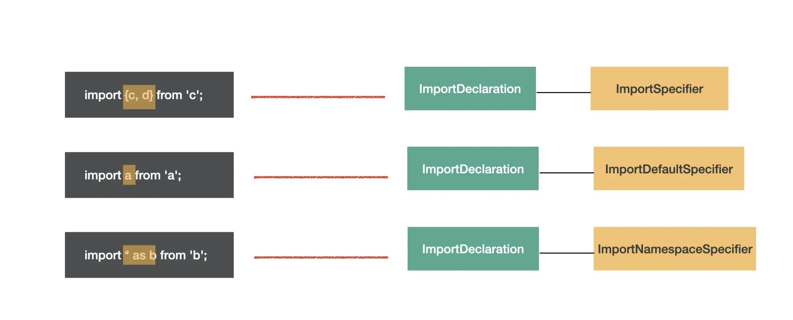

图中黄框标出的就是 `specifier` 部分。可以直观的看出整体结构相同，只是 `specifier` 部分不同，所以 `import` 语法的 `AST` 的结构是 `ImportDeclaration` 包含着各种 `import specifier` 。

**export**
`export` 也有 3 种语法：

`named export`：

```js
export { b, d }
```

`default export`：

```js
export default a
```

`all export`：

```js
export * from 'c'
```

分别对应 `ExportNamedDeclaration` `、ExportDefaultDeclaration` `、ExportAllDeclaration` 的 `AST` 。

比如这三种 `export`

```js
export { b, d }
export default a
export * from 'c'
```

对应的 AST 节点为

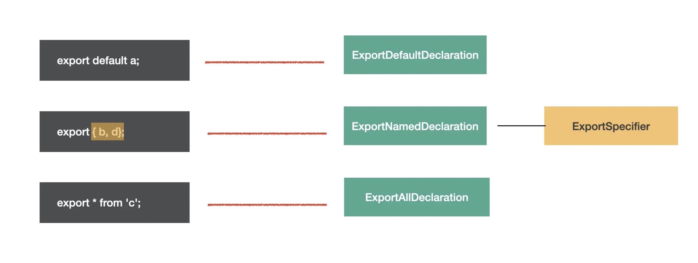

### Program & Directive

`program` 是代表整个程序的节点，它有 `body` 属性代表程序体，存放 `statement` 数组，就是具体执行的语句的集合。还有 `directives` 属性，存放 `Directive` 节点，比如 `"use strict"` 这种指令会使用 `Directive` 节点表示。

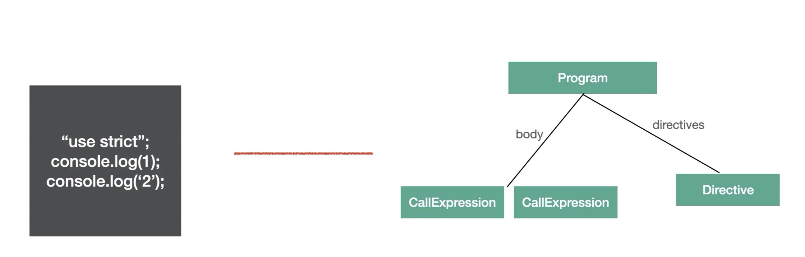

`Program` 是包裹具体执行语句的节点，而 `Directive` 则是代码中的指令部分。

### File & Comment

`babel` 的 `AST` 最外层节点是 `File` ，它有 `program` 、 `comments` 、 `tokens` 等属性，分别存放 `Program` 程序体、注释、 `token` 等，是最外层节点。

注释分为块注释和行内注释，对应 `CommentBlock` 和 `CommentLine` 节点。

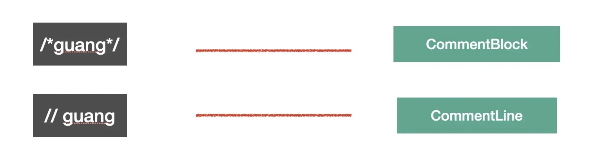

上面 6 种就是常见的一些 `AST` 节点类型， `babel` 就是通过这些节点来抽象源码中不同的部分。

### `AST` 可视化查看工具

这么多 `AST` 我们都要记住么？

不需要。可以通过 `axtexplorer.net` 这个网站来可视化的查看。

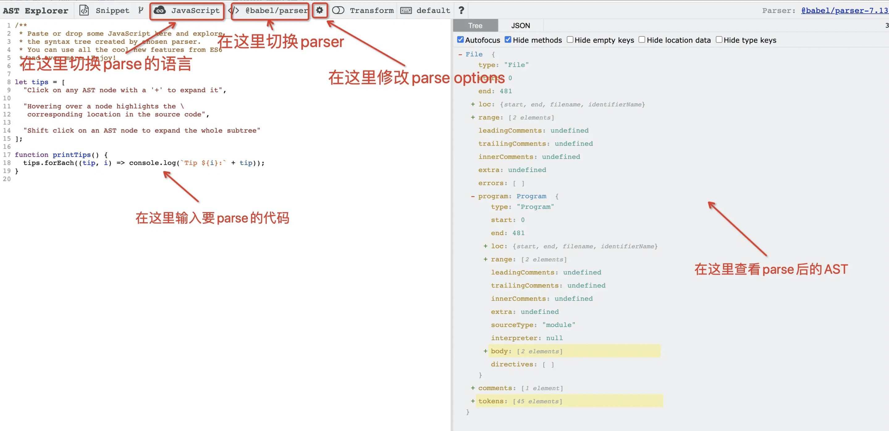

这个网站可以查看代码 `parse` 以后的 `AST` ，可以切换 `parse` 的语言和用的 `parser` ，也可以修改 `parse options` 。

点击这里的 `save` 就可以保存下来，然后把 `url` 分享出去：

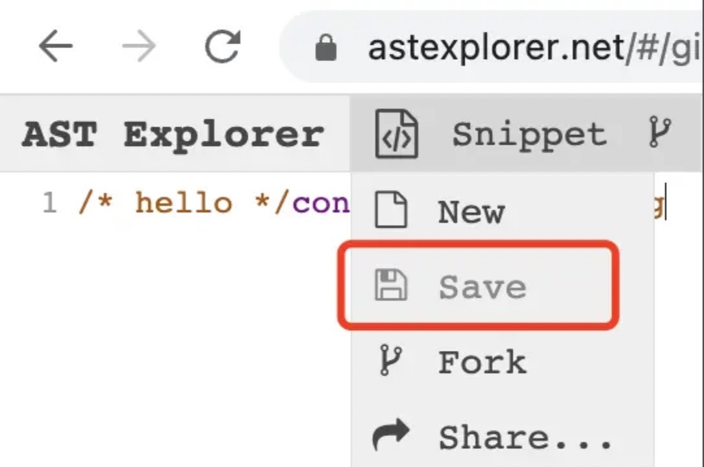

比如这个链接: `https://astexplorer.net/`

如果想查看全部的 `AST` 可以在 `babel parser` 仓库里的 `AST` 文档里查，或者直接去看 `@babel/types` 的 `typescript` 类型定义。

### AST 的公共属性

每种 `AST` 都有自己的属性，但是它们也有一些公共的属性：

`type`： `AST` 节点的类型

`start` 、 `end` 、`loc：start` 和 `end` 代表该节点在源码中的开始和结束下标。而 `loc` 属性是一个对象，有 `line` 和 `column` 属性分别记录开始和结束的行列号。

`leadingComments` 、 `innerComments` 、 `trailingComments` ： 表示开始的注释、中间的注释、结尾的注释，每个 `AST` 节点中都可能存在注释，而且可能在开始、中间、结束这三种位置，想拿到某个 AST 的注释就通过这三个属性。

比如这段有注释的代码的 `AST` ：

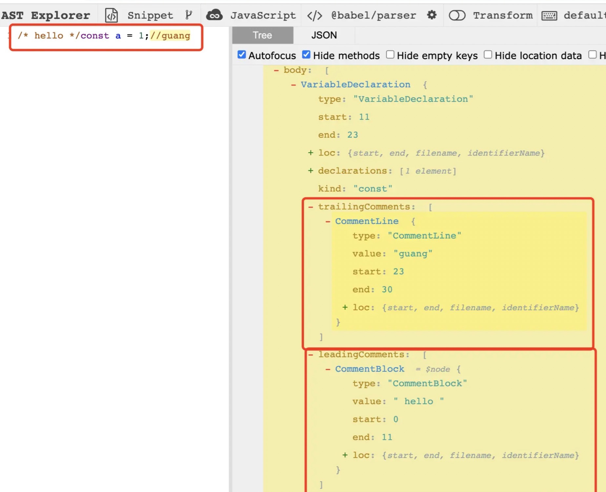

`extra：`记录一些额外的信息，用于处理一些特殊情况。比如 `StringLiteral` 的 `value` 只是值的修改，而修改 `extra.raw` 则可以连同单双引号一起修改。
比如这段代码的 `AST`：

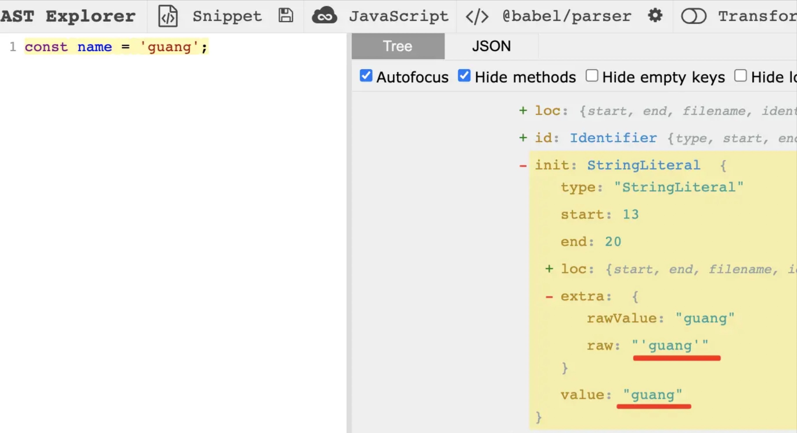

修改 `value` 只能修改值，修改 `extra.raw` 可以连引号一起修改。

### 总结

了解了这些节点，就能知道平时写的代码是怎么用 `AST` 表示的。

当然也不需要记，可以用 `(astexpoler.net)` 可视化的查看。

`AST` 节点可能同时有多种类型，确定一种 AST 节点是什么类型主要看它的特点，比如 `Statement` 的特点是可以单独执行， `Expression` 的特点是有返回值，所以一些可以单独执行的 `Expression` 会包一层 `ExpressionStatement`。

不同 `AST` 节点有不同的属性来存放对应的源码信息，但是都有一些公共属性如 `type` `、xxComments` 、 `loc` 等。

学会了 `AST` ，就可以把对代码的操作转为对 `AST` 的操作了，这是编译、静态分析的第一步。

## 三.编写词法分析器（Tokenizer）

词法分析器，也叫分词器(`Tokenizer`)，它的作用是将代码划分为一个个词法单元，便于进行后续的语法分析。比如下面的这段代码:

```js
let foo = function () {}
```

在经过分词之后，代码会被切分为如下的 `token` 数组:

```js
;['let', 'foo', '=', 'function', '(', ')', '{', '}']
```

从中你可以看到，原本一行普通的代码字符串被拆分成了拥有语法属性的 `token` 列表，不同的 `token` 之间也存在千丝万缕的联系，而后面所要介绍的语法分析器，就是来梳理各个 `token` 之间的联系，整理出 `AST` 数据结构。

当下我们所要实现的词法分析器，本质上是对代码字符串进行逐个字符的扫描，然后根据一定的语法规则进行分组。其中，涉及到几个关键的步骤:

1. 确定语法规则，包括语言内置的关键词、单字符、分隔符等
2. 逐个代码字符扫描，根据语法规则进行 `token` 分组

### 1. 确定 Token 的类型和规则

增加 `Token` 的类型

```ts
export enum TokenType {
  // let
  Let = 'Let',
  // =
  Assign = 'Assign',
  // function
  Function = 'Function',
  // 变量名
  Identifier = 'Identifier',
  // (
  LeftParen = 'LeftParen',
  // )
  RightParen = 'RightParen',
  // {
  LeftCurly = 'LeftCurly',
  // }
  RightCurly = 'RightCurly',
}

export type Token = {
  type: TokenType
  value?: string
  start: number
  end: number
  raw?: string
}
```

定义 Token 类型到规则的映射

```ts
const TOKENS_GENERATOR: Record<string, (...args: any[]) => Token> = {
  let(start: number) {
    return { type: TokenType.Let, value: 'let', start, end: start + 3 }
  },
  assign(start: number) {
    return { type: TokenType.Assign, value: '=', start, end: start + 1 }
  },
  function(start: number) {
    return {
      type: TokenType.Function,
      value: 'function',
      start,
      end: start + 8,
    }
  },
  leftParen(start: number) {
    return { type: TokenType.LeftParen, value: '(', start, end: start + 1 }
  },
  rightParen(start: number) {
    return { type: TokenType.RightParen, value: ')', start, end: start + 1 }
  },
  leftCurly(start: number) {
    return { type: TokenType.LeftCurly, value: '{', start, end: start + 1 }
  },
  rightCurly(start: number) {
    return { type: TokenType.RightCurly, value: '}', start, end: start + 1 }
  },
  identifier(start: number, value: string) {
    return {
      type: TokenType.Identifier,
      value,
      start,
      end: start + value.length,
    }
  },
}

type SingleCharTokens = '(' | ')' | '{' | '}' | '='

// 单字符到 Token 生成器的映射
const KNOWN_SINGLE_CHAR_TOKENS = new Map<
  SingleCharTokens,
  (typeof TOKENS_GENERATOR)[keyof typeof TOKENS_GENERATOR]
>([
  ['(', TOKENS_GENERATOR.leftParen],
  [')', TOKENS_GENERATOR.rightParen],
  ['{', TOKENS_GENERATOR.leftCurly],
  ['}', TOKENS_GENERATOR.rightCurly],
  ['=', TOKENS_GENERATOR.assign],
])
```

有了 Token 类型和对应生成的规则，我们便可以去遍历分析代码，输出分析后的结果。

### 2.代码字符扫描

在扫描字符的过程，我们需要对不同的字符各自进行不同的处理，具体的策略如下：

- 当前字符为分隔符，如空格，直接跳过，不处理；
- 当前字符为字母，需要继续扫描，获取完整的单词:
  - 如果单词为语法关键字，则新建相应关键字的 `Token`
  - 否则视为普通的变量名
- 当前字符为单字符，如`{、}、(、)`，则新建单字符对应的 `Token`

```ts
export class Tokenizer {
  private _tokens: Token[] = []
  private _currentIndex: number = 0
  private _source: string
  constructor(input: string) {
    this._source = input
  }
  tokenize(): Token[] {
    while (this._currentIndex < this._source.length) {
      let currentChar = this._source[this._currentIndex]
      const startIndex = this._currentIndex

      // 根据语法规则进行 token 分组
      // while 循环内部
      let currentChar = this._source[this._currentIndex]
      const startIndex = this._currentIndex

      const isAlpha = (char: string): boolean => {
        return (char >= 'a' && char <= 'z') || (char >= 'A' && char <= 'Z')
      }

      // 1. 处理空格
      if (currentChar === ' ') {
        this._currentIndex++
        continue
      }
      // 2. 处理字母
      else if (isAlpha(currentChar)) {
        let identifier = ''
        while (isAlpha(currentChar)) {
          identifier += currentChar
          this._currentIndex++
          currentChar = this._source[this._currentIndex]
        }
        let token: Token
        if (identifier in TOKENS_GENERATOR) {
          // 如果是关键字
          token =
            TOKENS_GENERATOR[identifier as keyof typeof TOKENS_GENERATOR](
              startIndex,
            )
        } else {
          // 如果是普通标识符
          token = TOKENS_GENERATOR['identifier'](startIndex, identifier)
        }
        this._tokens.push(token)
        continue
      }
      // 3. 处理单字符
      else if (KNOWN_SINGLE_CHAR_TOKENS.has(currentChar as SingleCharTokens)) {
        const token = KNOWN_SINGLE_CHAR_TOKENS.get(
          currentChar as SingleCharTokens,
        )!(startIndex)
        this._tokens.push(token)
        this._currentIndex++
        continue
      }
    }
    return this._tokens
  }
}
```

使用方式

```ts
const tokenizer = new Tokenizer('let a = function() {}')
```

结果

```ts
const tokenizer = [
  { type: 'Let', value: 'let', start: 0, end: 3 },
  { type: 'Identifier', value: 'a', start: 4, end: 5 },
  { type: 'Assign', value: '=', start: 6, end: 7 },
  { type: 'Function', value: 'function', start: 8, end: 16 },
  { type: 'LeftParen', value: '(', start: 16, end: 17 },
  { type: 'RightParen', value: ')', start: 17, end: 18 },
  { type: 'LeftCurly', value: '{', start: 19, end: 20 },
  { type: 'RightCurly', value: '}', start: 20, end: 21 },
]
```

一个简易版本的分词器已经被我们开发出来了，不过目前的分词器还比较简陋，仅仅支持有限的语法，不过在明确了核心的开发步骤之后，后面继续完善的过程就比较简单了。

## 四.编写语法分析器（Parser）

在解析出词法 `token` 之后，我们就可以进入语法分析阶段了。在这个阶段，我们会依次遍历 `token` ，对代码进行语法结构层面的分析，最后的目标是生成 `AST` 数据结构。至于代码的 `AST` 结构到底是什么样子，你可以去 `AST Explorer` 网站进行在线预览:


接下来，我们要做的就是将 `token` 数组转换为上图所示的 `AST` 数据。

开发步骤主要分为：

- 初始化类型声明
-
