# Abstract Syntax Tree

## 1. The role of the abstract syntax tree (`abstract syntax tree`)

Source code is a string organized according to a grammar. Humans can read it, but computers cannot. To make it understandable to a computer, it needs to be converted into a data structure that stores different pieces of data in different objects and organizes them according to their dependency relationships. This data structure is the abstract syntax tree (`abstract syntax tree`).

It's called "abstract" because the data structure omits some delimiters that have no concrete meaning, such as `; { }`.

With an `AST`, a computer can understand the meaning of the source code string, and understanding is the prerequisite for transformation. So the first step of compilation is to `parse` the source code into an `AST`.

Once converted into an `AST`, you can modify and analyze code by modifying and analyzing the `AST`. For example, `babel` performs code transformation this way, and `rollup`'s `Tree Shaking` works by analyzing the import/export syntax in the `AST` to find unused code and remove it.

## 2. Common AST nodes

Common AST nodes.
An AST is an abstraction of the source code — literals, identifiers, expressions, statements, module syntax, and class syntax all have their own AST representation.

Let's look at each of them:

### Literal

`Literal` means a literal value. For example, in `let name = 'value'`, `'value'` is a string literal, `StringLiteral`. Correspondingly there are numeric literals `NumericLiteral`, boolean literals `BooleanLiteral`, string literals `StringLiteral`, regular expression literals `RegExpLiteral`, and so on.

The following literals all have corresponding `Literal` nodes:

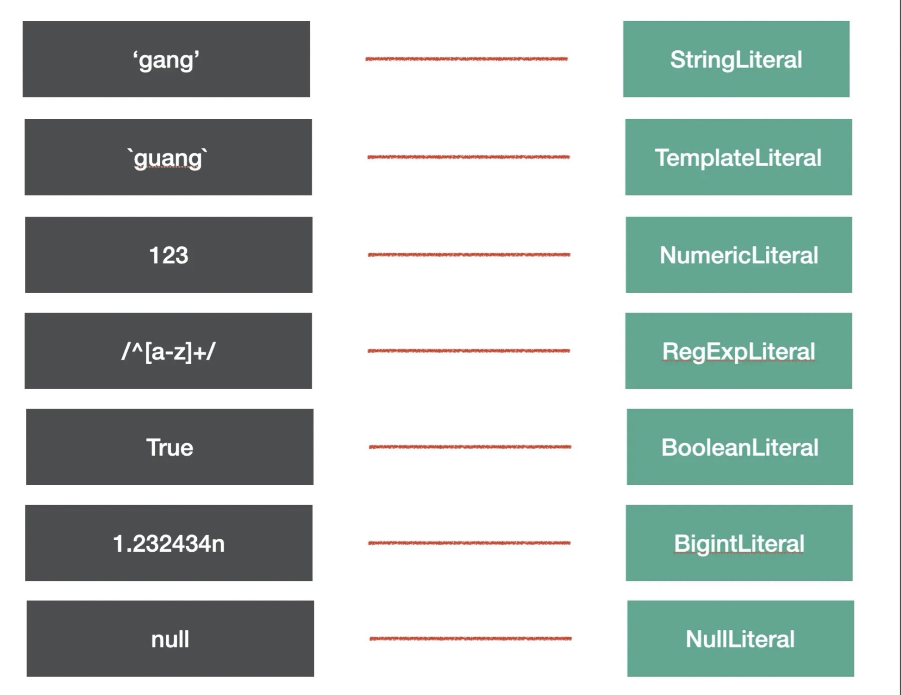

There are many kinds of literals in code, and `babel` abstracts this part with `xxLiteral` nodes.

### Identifier

`Identifier` means an identifier — the names used in various declarations and references, such as variable names, property names, and parameter names, are all `Identifier`.

We know that identifiers in `JS` can only contain letters, digits, underscores (`"_"`), or dollar signs (`"$"`), and cannot start with a digit. This is the lexical characteristic of an `Identifier`.

Try to figure out how many `Identifier`s are in the following code:

```js
const name = 'value';

function say(name) {
  console.log(name);
}

const obj = {
  name: 'guang',
};
```

The answer is these:

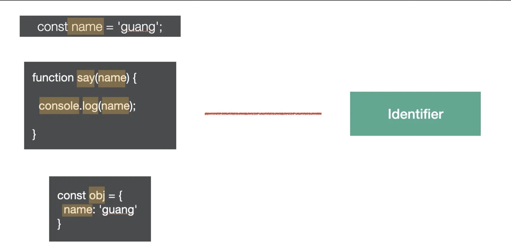

### Statement

A `statement` is a unit of code that can be executed independently — things like `break`, `continue`, `debugger`, `return`, or `if` statements, `while` statements, `for` statements, as well as declaration statements and expression statements. Every line of code we write that can run independently is a statement.

Statements are usually terminated with a semicolon, or separated by a line break.

Each of the following lines of code we commonly write is a `Statement`:

```js
break;
continue;
return;
debugger;
throw Error();
{}
try {} catch(e) {} finally{}
for (let key in obj) {}
for (let i = 0;i < 10;i ++) {}
while (true) {}
do {} while (true)
switch (v){case 1: break;default:;}
label: console.log();
with (a){}
```

Their corresponding AST nodes are shown below:

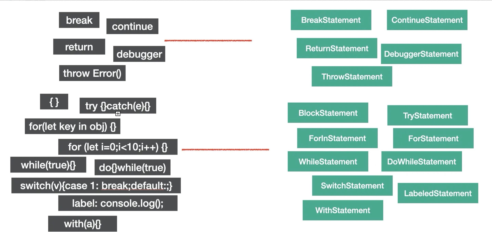

A statement is the smallest unit of code execution — you could say that code is made up of statements (`Statement`).

### Declaration

A declaration statement is a special kind of statement. Its logic is to declare a variable, function, `class`, `import`, `export`, etc. within a scope.

For example, the following statements are all declaration statements:

```js
const a = 1;
function b() {}
class C {}

import d from 'e';

export default (e = 1);
export { e };
export * from 'e';
```

Their corresponding AST nodes are shown below:

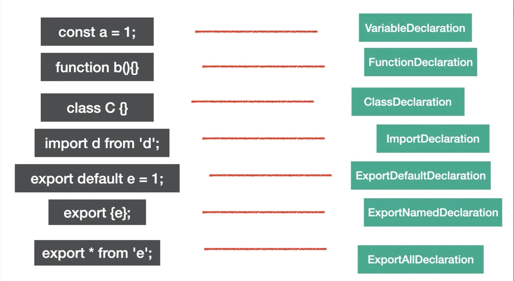

Declaration statements are used to define variables, which is also a fundamental building block of code.

### Expression

An `expression` produces a return value after it executes — this is what distinguishes it from a statement (`statement`).

Here are some common expressions:

```js
[1,2,3]
a = 1
1 + 2;
-1;
function(){};
() => {};
class{};
a;
this;
super;
a::b;
```

Their corresponding AST is shown below:

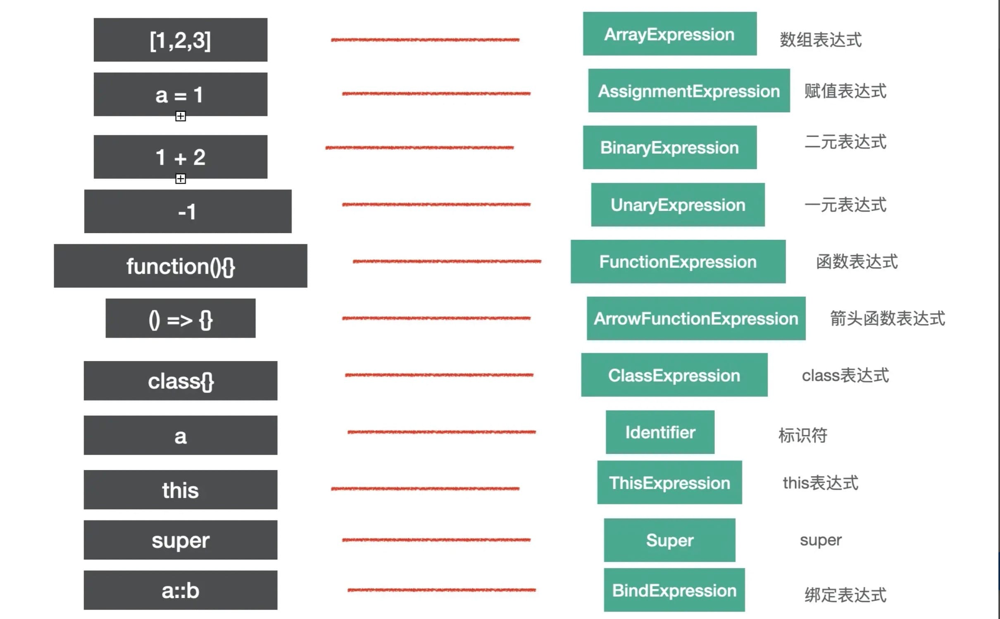

You might ask: how can `identifier` and `super` also be expressions?

Because `identifier` and `super` have return values, they fit the characteristics of an expression, so they're also `expression`s.

To determine whether an `AST` node belongs to a certain type, we check whether it matches the characteristics of that type — for example, the characteristic of a statement is that it can execute independently, and the characteristic of an expression is that it has a return value.

Some expressions can execute independently, matching the characteristics of a statement, so they're also statements — for example, assignment expressions and array expressions.

```js
a = 1;
[1, 2, 3];
```

But some expressions cannot execute independently and need to be combined with other kinds of nodes to form a statement.

For example, an anonymous function expression or an anonymous `class` expression will throw an error if executed on its own:

```js
function(){};
class{}
```

They need to be combined with other parts to form a statement, such as an assignment statement:

```js
a = function () {};
b = class {};
```

The `AST` for this assignment statement looks like this:

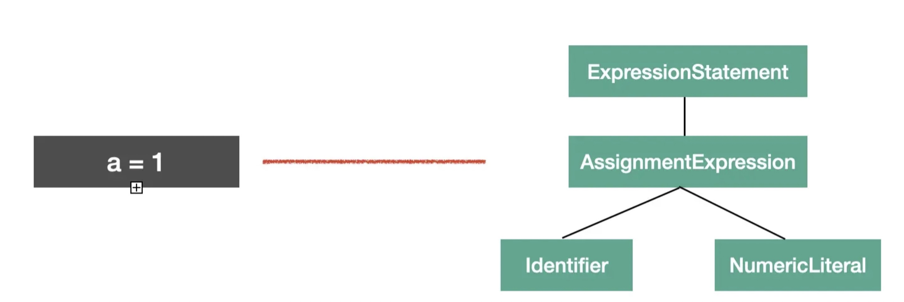

You'll notice that the `AssignmentExpression` AST node of the assignment statement is wrapped in an `ExpressionStatement` node, indicating that this expression is being executed as a statement.

### Class

`class` syntax also has dedicated AST nodes to represent it.

The entire body of a `class` is `ClassBody`, its properties are `ClassProperty`, and its methods are `ClassMethod` (distinguished as `constructor` or `method` via the `kind` property).

For example, the following code:

```js
class Guang extends Person {
  name = 'guang';
  constructor() {}
  eat() {}
}
```

Corresponds to this AST:

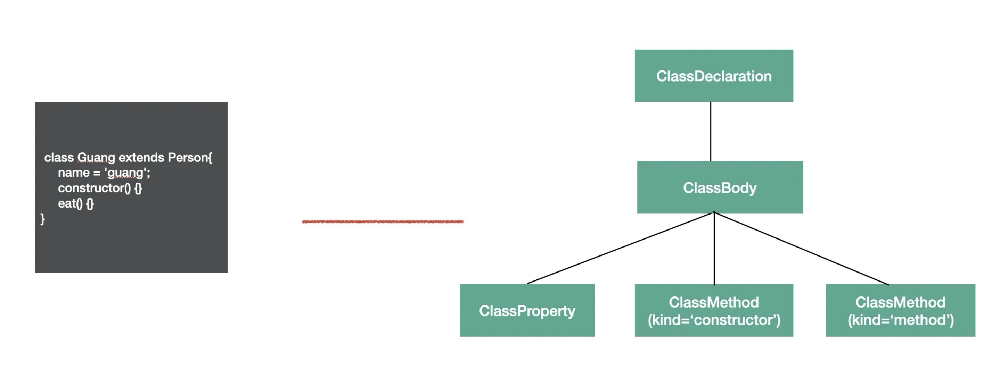

`class` is `es next` syntax, and `babel` has dedicated `AST` nodes to represent its content.

### Modules

`es module` is a module specification at the syntax level, so it also has dedicated `AST` nodes.

**import**
`import` has 3 syntax forms:

`named import`:

```js
import { c, d } from 'c';
```

`default import`:

```js
import a from 'a';
```

`namespaced import`:

```js
import * as b from 'b';
```

All 3 syntax forms correspond to an `ImportDeclaration` node, but the `specifiers` property differs, corresponding to `ImportSpicifier`, `ImportDefaultSpecifier`, and `ImportNamespaceSpcifier` respectively.

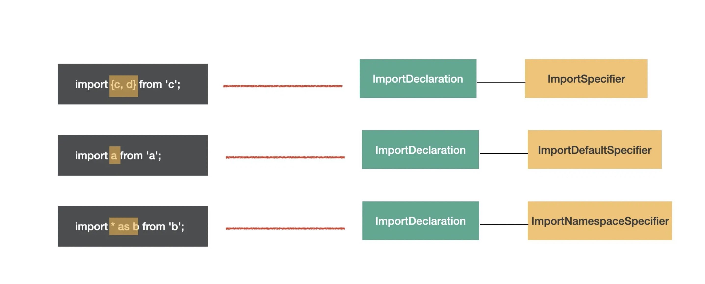

The yellow boxes in the diagram mark the `specifier` part. You can clearly see that the overall structure is the same, only the `specifier` part differs — so the `AST` structure for `import` syntax is an `ImportDeclaration` containing various `import specifier`s.

**export**
`export` also has 3 syntax forms:

`named export`:

```js
export { b, d };
```

`default export`:

```js
export default a;
```

`all export`:

```js
export * from 'c';
```

These correspond to the `AST` of `ExportNamedDeclaration`, `ExportDefaultDeclaration`, and `ExportAllDeclaration` respectively.

For example, these three kinds of `export`:

```js
export { b, d };
export default a;
export * from 'c';
```

Correspond to the following AST nodes:

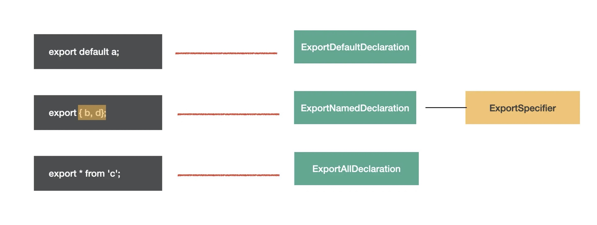

### Program & Directive

`Program` is the node representing the entire program. It has a `body` property representing the program body, holding an array of `statement`s — the collection of statements to be executed. It also has a `directives` property, holding `Directive` nodes — for example, a directive like `"use strict"` is represented with a `Directive` node.

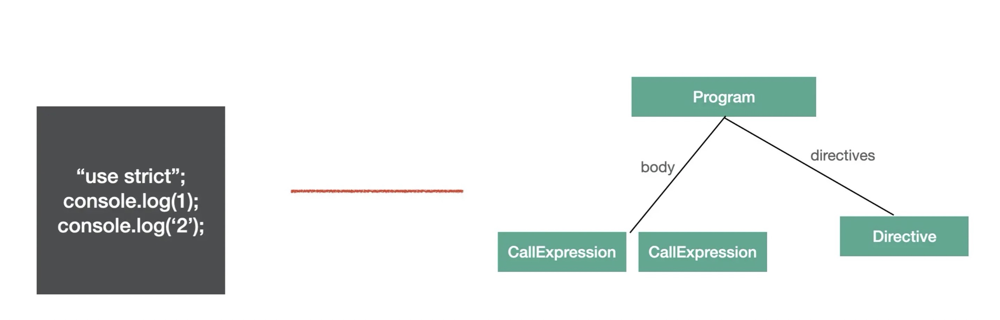

`Program` is the node that wraps the executable statements, while `Directive` represents the directive part of the code.

### File & Comment

The outermost node of `babel`'s `AST` is `File`. It has `program`, `comments`, `tokens`, and other properties, holding the `Program` body, comments, `token`s, etc. It is the outermost node.

Comments are divided into block comments and inline comments, corresponding to `CommentBlock` and `CommentLine` nodes.

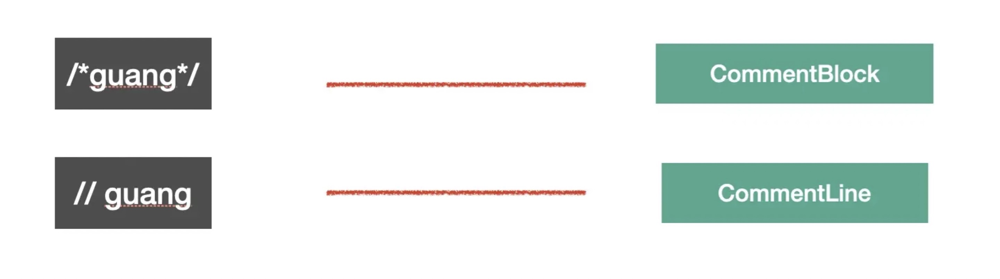

The 6 categories above are the common `AST` node types — `babel` uses these nodes to abstract different parts of the source code.

### `AST` visualization tools

Do we need to memorize all these `AST` node types?

No. You can view them visually via the website `astexplorer.net`.

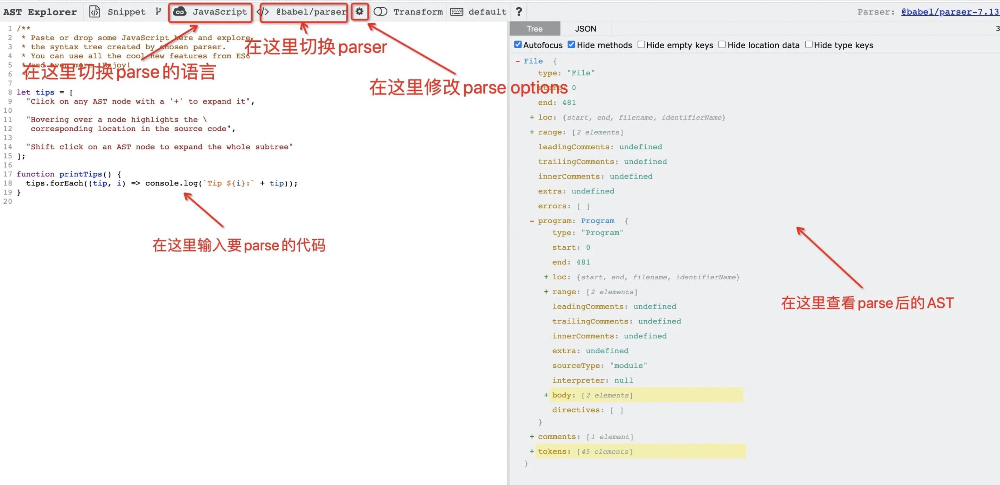

This website lets you view the `AST` after code is `parse`d, switch the language and `parser` being used, and modify `parse options`.

Click `save` here to save it, and then share the `url`:

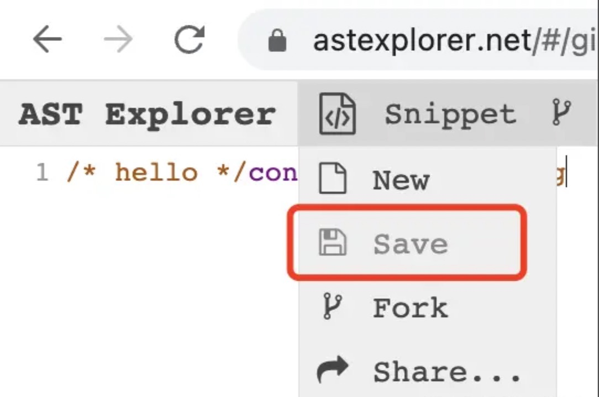

For example, this link: `https://astexplorer.net/`

If you want to see the full list of `AST` node types, you can check the `AST` documentation in the `babel parser` repository, or look directly at the `typescript` type definitions of `@babel/types`.

### Common properties of AST

Every kind of `AST` has its own properties, but they also share some common properties:

`type`: the type of the `AST` node.

`start`, `end`, `loc`: `start` and `end` represent the start and end index of the node in the source code. The `loc` property is an object with `line` and `column` properties recording the starting and ending line and column numbers.

`leadingComments`, `innerComments`, `trailingComments`: represent leading comments, comments in the middle, and trailing comments. Every `AST` node may have comments attached, and they may appear at the start, in the middle, or at the end — these three properties are how you access the comments for a given AST node.

For example, the `AST` of this commented code:

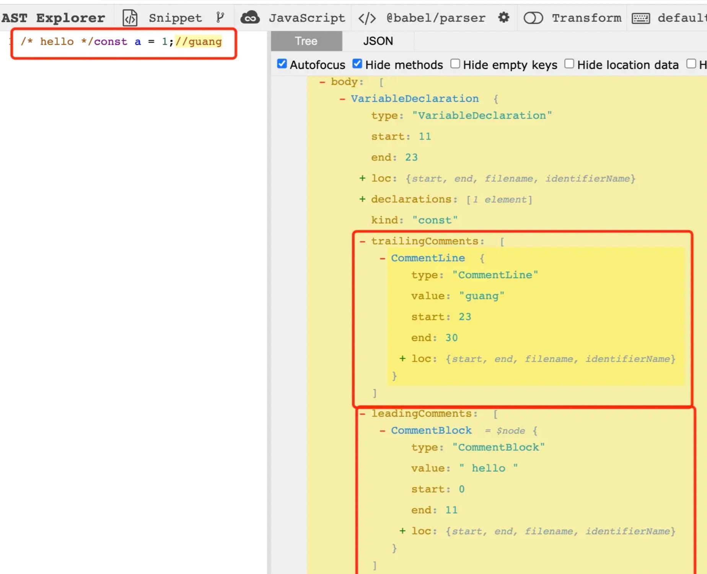

`extra`: records some extra information used to handle special cases. For example, modifying the `value` of a `StringLiteral` only changes the value itself, while modifying `extra.raw` lets you change the quotes (single or double) along with it.
For example, the `AST` of this code:

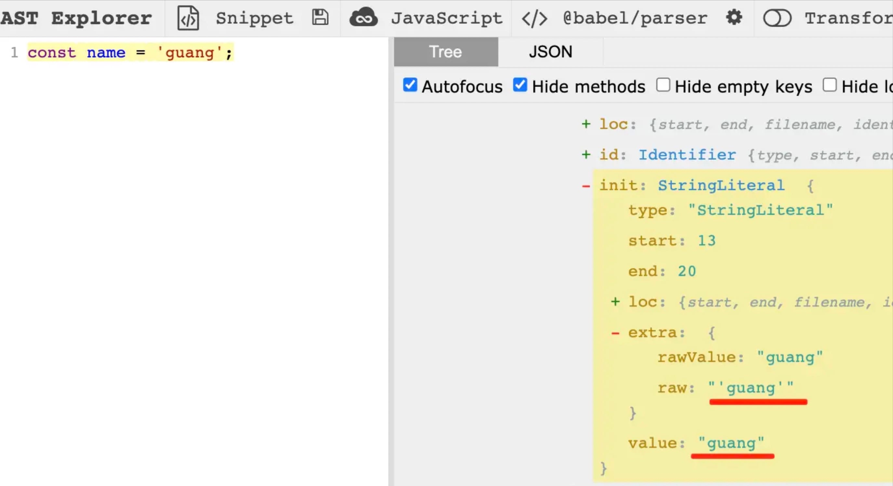

Modifying `value` only changes the value, while modifying `extra.raw` lets you change the quotes as well.

### Summary

Understanding these nodes lets you know how the code you normally write is represented as an `AST`.

Of course, you don't need to memorize them — you can view them visually using `(astexpoler.net)`.

An `AST` node may match more than one type at the same time. To determine what type an `AST` node is, look at its characteristics — for example, the characteristic of a `Statement` is that it can execute independently, and the characteristic of an `Expression` is that it has a return value. So some `Expression`s that can execute independently get wrapped in an `ExpressionStatement`.

Different `AST` nodes have different properties for storing the corresponding source code information, but they all share some common properties such as `type`, `xxComments`, and `loc`.

Once you understand `AST`, you can turn operations on code into operations on the `AST` — this is the first step of compilation and static analysis.

## 3. Writing a lexical analyzer (Tokenizer)

A lexical analyzer, also called a tokenizer (`Tokenizer`), is responsible for splitting code into individual lexical units to make subsequent syntax analysis easier. For example, given this code:

```js
let foo = function () {};
```

After tokenization, the code is split into the following `token` array:

```js
['let', 'foo', '=', 'function', '(', ')', '{', '}'];
```

As you can see, an ordinary line of code that was originally just a string is broken down into a list of `token`s carrying syntactic properties, and there are intricate relationships between the different `token`s. The syntax analyzer, which we'll introduce later, works by untangling the relationships between these `token`s to produce the `AST` data structure.

The tokenizer we're going to implement here essentially scans the code string character by character, then groups characters according to certain grammar rules. This involves a few key steps:

1. Define the grammar rules, including the language's built-in keywords, single characters, delimiters, etc.
2. Scan the code character by character, grouping into `token`s according to the grammar rules.

### 1. Defining the Token types and rules

Add the `Token` types:

```ts
export enum TokenType {
  // let
  Let = 'Let',
  // =
  Assign = 'Assign',
  // function
  Function = 'Function',
  // variable name
  Identifier = 'Identifier',
  // (
  LeftParen = 'LeftParen',
  // )
  RightParen = 'RightParen',
  // {
  LeftCurly = 'LeftCurly',
  // }
  RightCurly = 'RightCurly',
}

export type Token = {
  type: TokenType;
  value?: string;
  start: number;
  end: number;
  raw?: string;
};
```

Define the mapping from Token type to rule:

```ts
const TOKENS_GENERATOR: Record<string, (...args: any[]) => Token> = {
  let(start: number) {
    return { type: TokenType.Let, value: 'let', start, end: start + 3 };
  },
  assign(start: number) {
    return { type: TokenType.Assign, value: '=', start, end: start + 1 };
  },
  function(start: number) {
    return {
      type: TokenType.Function,
      value: 'function',
      start,
      end: start + 8,
    };
  },
  leftParen(start: number) {
    return { type: TokenType.LeftParen, value: '(', start, end: start + 1 };
  },
  rightParen(start: number) {
    return { type: TokenType.RightParen, value: ')', start, end: start + 1 };
  },
  leftCurly(start: number) {
    return { type: TokenType.LeftCurly, value: '{', start, end: start + 1 };
  },
  rightCurly(start: number) {
    return { type: TokenType.RightCurly, value: '}', start, end: start + 1 };
  },
  identifier(start: number, value: string) {
    return {
      type: TokenType.Identifier,
      value,
      start,
      end: start + value.length,
    };
  },
};

type SingleCharTokens = '(' | ')' | '{' | '}' | '=';

// mapping from single characters to Token generators
const KNOWN_SINGLE_CHAR_TOKENS = new Map<SingleCharTokens, (typeof TOKENS_GENERATOR)[keyof typeof TOKENS_GENERATOR]>([
  ['(', TOKENS_GENERATOR.leftParen],
  [')', TOKENS_GENERATOR.rightParen],
  ['{', TOKENS_GENERATOR.leftCurly],
  ['}', TOKENS_GENERATOR.rightCurly],
  ['=', TOKENS_GENERATOR.assign],
]);
```

With the Token types and their corresponding generation rules in place, we can now traverse and analyze the code, and output the analyzed result.

### 2. Scanning the code characters

While scanning characters, we need to handle different characters differently. The specific strategy is as follows:

- If the current character is a delimiter, such as a space, skip it directly without further processing;
- If the current character is a letter, keep scanning to get the complete word:
  - If the word is a syntax keyword, create the corresponding keyword `Token`
  - Otherwise, treat it as an ordinary variable name
- If the current character is a single character, such as `{`, `}`, `(`, `)`, create the corresponding single-character `Token`

```ts
export class Tokenizer {
  private _tokens: Token[] = [];
  private _currentIndex: number = 0;
  private _source: string;
  constructor(input: string) {
    this._source = input;
  }
  tokenize(): Token[] {
    while (this._currentIndex < this._source.length) {
      let currentChar = this._source[this._currentIndex];
      const startIndex = this._currentIndex;

      // group into tokens according to the grammar rules
      // inside the while loop
      let currentChar = this._source[this._currentIndex];
      const startIndex = this._currentIndex;

      const isAlpha = (char: string): boolean => {
        return (char >= 'a' && char <= 'z') || (char >= 'A' && char <= 'Z');
      };

      // 1. handle spaces
      if (currentChar === ' ') {
        this._currentIndex++;
        continue;
      }
      // 2. handle letters
      else if (isAlpha(currentChar)) {
        let identifier = '';
        while (isAlpha(currentChar)) {
          identifier += currentChar;
          this._currentIndex++;
          currentChar = this._source[this._currentIndex];
        }
        let token: Token;
        if (identifier in TOKENS_GENERATOR) {
          // if it's a keyword
          token = TOKENS_GENERATOR[identifier as keyof typeof TOKENS_GENERATOR](startIndex);
        } else {
          // if it's an ordinary identifier
          token = TOKENS_GENERATOR['identifier'](startIndex, identifier);
        }
        this._tokens.push(token);
        continue;
      }
      // 3. handle single characters
      else if (KNOWN_SINGLE_CHAR_TOKENS.has(currentChar as SingleCharTokens)) {
        const token = KNOWN_SINGLE_CHAR_TOKENS.get(currentChar as SingleCharTokens)!(startIndex);
        this._tokens.push(token);
        this._currentIndex++;
        continue;
      }
    }
    return this._tokens;
  }
}
```

Usage:

```ts
const tokenizer = new Tokenizer('let a = function() {}');
```

Result:

```ts
const tokenizer = [
  { type: 'Let', value: 'let', start: 0, end: 3 },
  { type: 'Identifier', value: 'a', start: 4, end: 5 },
  { type: 'Assign', value: '=', start: 6, end: 7 },
  { type: 'Function', value: 'function', start: 8, end: 16 },
  { type: 'LeftParen', value: '(', start: 16, end: 17 },
  { type: 'RightParen', value: ')', start: 17, end: 18 },
  { type: 'LeftCurly', value: '{', start: 19, end: 20 },
  { type: 'RightCurly', value: '}', start: 20, end: 21 },
];
```

We've now built a simple version of the tokenizer. It's still fairly basic and only supports a limited grammar, but now that we've established the core development steps, extending it further will be straightforward.

## 4. Writing a syntax analyzer (Parser)

Once we've parsed the lexical `token`s, we can move on to the syntax analysis stage. In this stage, we traverse the `token`s in order and analyze the code at the level of syntactic structure, with the ultimate goal of generating an `AST` data structure. As for what the `AST` structure of the code actually looks like, you can preview it live on the `AST Explorer` website:


Next, what we need to do is convert the `token` array into the `AST` data shown in the diagram above.

The development steps are mainly divided into:

- Initialize type declarations
-
