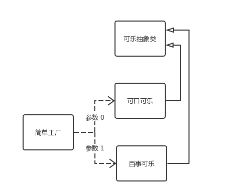
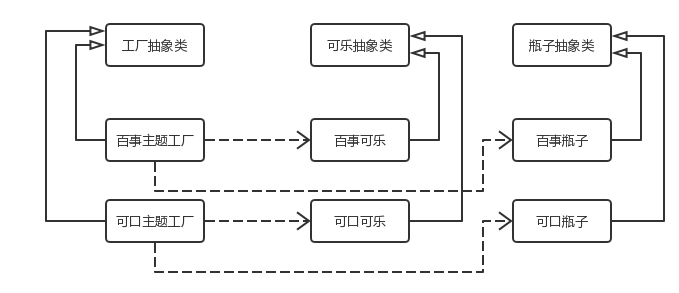
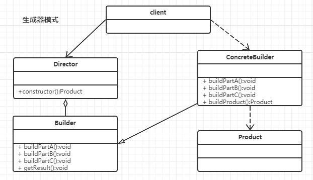
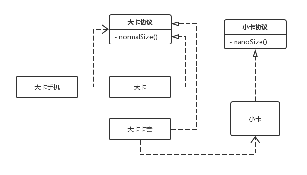
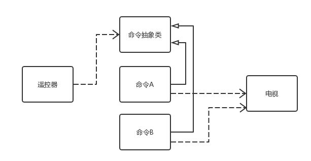
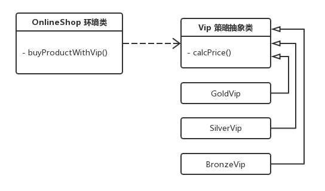

# 23 classic design patterns

> The Design Pattern is a set of frequently used, widely known, cataloged code design experiences that are used in order to reuse code, make it easier for others to understand, and ensure code reliability.

In the book "Design Patterns: The Foundation of Reusable Object-Oriented Software" introduced 23 classic design patterns, but the design pattern is not only these 23, with the development of software development industry, more and more new patterns continue to be born and applied. Experienced developers learn design patterns that can be corroborated with past experience, making it easier to understand them.

A design pattern generally contains elements such as the pattern name, problem, purpose, solution, and effect. The problem describes when patterns should be used, and it contains problems with the design and why they exist. A solution describes the components of a design pattern and how these components relate to each other, their respective responsibilities, and how they work together. Typically, the solution is described through UML class diagrams and core code. Effects describe the advantages and disadvantages of the pattern and the trade-offs that should be made when using the pattern.

**Why learn design patterns**:

- Design patterns are derived from the experience and wisdom of many experts. They are successful and reusable design solutions from many excellent software systems. Using these solutions will allow us to avoid doing some repetitive work

- Design patterns provide a common set of design vocabulary and a common form to facilitate communication and exchange between developers, making design solutions more understandable

- Most of the design patterns take into account the reusability and extensibility of the system, which enables us to better reuse some existing design schemes, functional modules and even a complete software system, so as to avoid us often doing some repetitive design and writing some repetitive code

- Proper use of design patterns and documentation of their use will help others understand the system more quickly

- Learning design patterns will help beginners understand object-oriented ideas more deeply

**Reserve knowledge**：

- Abstract class: The general abstract class is as a base class, for example, "computer" can be used as an abstract class, according to the abstract class derived "desktop computer" and "laptop computer" 2 concrete classes. Abstract classes are generally not instantiated.

- Combination is better than inheritance: inheritance cannot be abused to expand functionality, and combination is more flexible. Also take the "computer" abstract class for example, if we use inheritance to distinguish different types of "computer" we can derive "desktop computer" and "laptop computer", if we add another dimension, according to the brand can continue to subdivide "Lenovo desktop computer", "Lenovo laptop", "Apple desktop computer" and "Apple laptop" and so on. If you add another dimension and continue to subdivide, it is clear that inheritance is not adequate. At this time, you can use inheritance and composition, and the combined object can also be abstract design:

  ```ts
  interface Brand {
    // ...
  }
  interface Lenovo extends Brand {
    // ...
  }
  interface Apple extends Brand {
    // ...
  }
  interface CPU {
    // ...
  }
  interface Inter extends CPU {
    // ...
  }
  interface AMD extends CPU {
    // ...
  }
  interface Computer {
    // ...
  }

  interface DesktopComputer extends Computer {}
  interface NotebookComputer extends Computer {}
  ```

## I, UML class diagram

Each pattern has a corresponding object structure diagram, and in order to show the details of the interaction between objects, sometimes a 'UML' diagram is used to show how it works. Here will not be the various elements of 'UML' mentioned, just want to talk about the relationship between the classes in the class diagram, can understand the meaning of the lines and arrows between the classes in the class diagram, it is enough to deal with daily work and communication. At the same time, we should be able to match the meaning of the class diagram to the final code. With this knowledge, there is no problem looking at the design pattern structure diagram in the later sections.

<!-- 本文中大部分是 UML 类图，也有个别简易流程图。由于文中部分模式并未配图，你可以在 [这里](../../assets/article/designPattern/UML/创建型/单例.jpg) 查看我在网络上收集的完整 23 种设计模式 UML 类图。 -->

### 1.1 inherit

Inheritance is represented directly by a hollow arrow.


### 1.2 realize

The implementation relationship is represented by a dashed line with a hollow arrow.


### 1.3 assembly

Like aggregation relations, composition relations also represent the semantics of a whole made up of parts. For example, a company is composed of multiple departments, but the combinatorial relationship is a special aggregation relationship of strong dependence, if the whole does not exist, then the part does not exist. For example, the company no longer exists, and the department will no longer exist.


### 1.4 Polymerization

Aggregation relationships are used to represent relationships between entity objects, representing the semantics of a whole made up of parts, such as a department consisting of multiple employees. Unlike combinatorial relations, the whole and the part are not strongly dependent, and even if the whole does not exist, the part still exists. For example, if the department is abolished, the personnel will not disappear, they will still exist.


### 1.5 Association

The association relationship is expressed by a straight line, which describes the structural relationship between objects of different classes. It is a static relationship, usually unrelated to the running state, and generally determined by common sense and other factors. It is generally used to define the static, natural structure between objects, so the association relationship is a "strong association" relationship.

For example, the relationship between the passenger and the ticket is an association relationship, the student and the school is an association relationship, the association relationship does not emphasize the direction by default, indicating that the object knows each other. If particular emphasis is placed on direction, as shown in the figure below, it means that A knows B, but B does not know A.


### 1.6 dependence

Dependencies are represented by A set of dotted lines with arrows, such as A depends on B, which describes the relationship between one object and another object at runtime.

Unlike an association relationship, it is a temporary relationship that usually occurs during run time, and dependencies may change as the run time changes. Obviously, dependence also has a direction, two-way dependence is a very bad structure, we should always maintain one-way dependence, eliminate the generation of two-way dependence.


## II, six principles

### 2.1 Open and Close principle

&gt; A software entity should be open for extension and closed for modification. That is, software entities should extend as far as possible without modifying the original code.

An important issue for any software is that its requirements change over time. When the software system needs to face new requirements, we should try to ensure that the design framework of the system is stable. If a software design conforms to the open-close principle, it can be very convenient to extend the system, and there is no need to modify the existing code when expanding, so that the software system has good stability and continuity while having adaptability and flexibility. As the software scale becomes larger and larger, the software life becomes longer and longer, and the software maintenance cost becomes higher and higher, it becomes more and more important to design the software system that meets the principle of open and close.

In order to meet the open-close principle, the system needs to be abstract design, abstraction is the key to the open-close principle. In programming languages such as Java and C#, a relatively stable abstraction layer can be defined for the system, and different implementation behaviors can be moved to the concrete implementation layer. In many object-oriented programming languages, interfaces, abstract classes and other mechanisms can be used to define the abstract layer of the system, and then extend it through concrete classes. If it is necessary to modify the behavior of the system, there is no need to make any changes to the abstract layer, only need to add new concrete classes to achieve new business functions, to achieve the expansion of the system function on the basis of not modifying the existing code, to meet the requirements of the open-close principle.

Advantages: The advantage of practicing the open-close principle is that you can extend the function of the program without changing the original code. The expansibility of the program is increased, and the maintenance cost of the program is reduced. \*\*.

### 2.2 Richter Substitution Principle

&gt; Any reference to a base class object can transparently use the object of its subclass

The Richter substitution principle tells us that replacing a base class object with its subclass object in software will not cause any errors and exceptions, and the reverse is not true, if a software entity uses a subclass object, then it may not be able to use the base class object. For example, if I like animals, then I must like dogs, because dogs are a subclass of animals. But I like dogs, and it does not follow that I like animals, because I do not like mice, even though they are animals.

For example, if there are two classes, one is BaseClass, the other is SubClass, and the SubClass is a subclass of the BaseClass class, then a method can accept a base class object of type BaseClass, such as: method1(base), then it must accept a subclass object of type BaseClass sub, and method1(sub) will work. The reverse substitution is not true, if a method method2 accepts sub of type BaseClass as an argument: method2(sub), then in general you can't have method2(base) unless it's an overloaded method.

Richter substitution principle is one of the important ways to achieve the open and close principle, because the use of base class objects can use subclass objects, so in the program to try to use the base class type to define the object, and then determine its subclass type at run time, with subclass objects to replace the parent object.

**Advantages: You can test the correctness of the use of inheritance, and restrict the overflow of inheritance in use.**.

2.3 Reliance on the inversion principle

&gt; Abstractions should not depend on concrete classes, and concrete classes should depend on abstractions. In other words, program against the interface, not the implementation.

The principle of dependency inversion requires us to refer to high-level abstract layer classes as far as possible when passing parameters in program code or in association relations, that is, to use interfaces and abstract classes for variable type declaration, parameter type declaration, method return type declaration, and data type conversion, etc., rather than using concrete classes to do these things. In order to ensure the application of this principle, a concrete class should only implement methods declared in the interface or abstract class, and not give extra methods, otherwise it will not be able to call the new methods added in the subclass.

After the introduction of the abstraction layer, the system will have good flexibility, in the program as far as possible to use the abstraction layer for programming, and the specific class is written in the configuration file, so that if the system behavior changes, only need to extend the abstraction layer, and modify the configuration file, without modifying the original system source code, in the case of no modification to expand the function of the system. Meet the requirements of the open and close principle.

Advantages: Build a framework through abstraction and establish associations between classes to reduce coupling between classes. Moreover, the system built with abstraction is more stable, more scalable, and easier to maintain than the system built with concrete implementation. \*\*.

2.4 Principle of single responsibility

&gt; A class is only responsible for the corresponding responsibilities in one functional area, or it can be defined that there should be only one reason for a class to change.

The principle of single responsibility tells us that a class can't be too "tired"! In a software system, the more responsibilities a class (from large modules to small methods) takes on, the less likely it is to be reused, and too many responsibilities a class takes on, the equivalent of coupling these responsibilities together, when one of the responsibilities changes, it may affect the operation of the other responsibilities, so the separation of these responsibilities. Encapsulate different responsibilities in different classes, that is, encapsulate different reasons for change in different classes, and encapsulate multiple responsibilities in the same class if they always change at the same time.

The principle of single responsibility is a guideline to achieve high cohesion and low coupling. It is the simplest but most difficult principle to apply. It requires designers to discover different responsibilities of a class and separate them, while discovering multiple responsibilities of a class requires designers to have strong analysis and design ability and relevant practical experience.

Advantages: If the class and method responsibilities are clearly divided, not only can improve the readability of the code, but also effectively reduce the risk of program errors, because the clear code will make the bug nowhere to hide, but also conducive to bug tracking, that is, reduce the maintenance cost of the program. \*\*.

### 2.5 Demeter's Law (Least Know Principle)

&gt; A software entity should interact with other entities as little as possible

If a system conforms to Dimitar's law, then when one of the modules is modified, it will affect the other modules as little as possible, and it will be relatively easy to expand, which is a limit on the communication between software entities, Dimitar's law requires limiting the width and depth of communication between software entities. Demeter's rule can reduce the coupling degree of the system and keep the loose coupling relationship between classes.

Demeter's law requires that when designing a system, we should minimize the interaction between objects, if two objects do not need to communicate directly with each other, then the two objects should not have any direct interaction, if one of the objects needs to call a method of another object, you can forward the call through a third party. In short, it is to reduce the coupling degree between existing objects by introducing a reasonable third party.

When applying Dimitter's rule to system design, we should pay attention to the following points: in the division of classes, we should try to create loosely coupled classes, the lower the degree of coupling between classes, the more conducive to reuse, and once a class in loose coupling is modified, it will not cause too much impact on the associated classes. In the structural design of the class, every class should minimize the access permissions of its member variables and member functions. In class design, whenever possible, a type should be designed as an invariant class. References to other classes from one object should be kept to a minimum.

**Advantages: The practice of Demeter's rule can well reduce the coupling between classes, reduce the degree of correlation between classes, and make the collaboration between classes more direct.**.

2.6 Interface Separation Rule

&gt; The use of multiple specialized interfaces rather than a single general interface means that the client should not rely on interfaces that it does not need.

According to the principle of interface isolation, when an interface is too large, we need to split it into smaller interfaces, and the client using the interface only needs to know the methods associated with it. Each interface should assume a relatively independent role, do not do what should not be done, do what should be done.

When using the interface isolation principle, you need to pay attention to the granularity of the control interface. If the interface is too small, the system may overflow interfaces, which is not conducive to maintenance. The interface can not be too large, too large interface will violate the interface isolation principle, poor flexibility, very inconvenient to use.

**Advantages: Avoid the method of containing different responsibilities in the same interface, and the division of interface responsibilities is more clear, in line with the idea of high cohesion and low coupling.**.

### 2.7 Principle of Synthetic reuse (outside the six)

&gt; Try to use object composition rather than inheritance for reuse purposes

The principle of composite reuse is to use some existing objects in a new object through association relations (including composition relations and aggregation relations), so that it becomes part of the new object, and the new object achieves the purpose of reuse functions by delegating methods to the existing object. In short, when reuse, use composition/aggregation relationships (association relationships) as much as possible and use inheritance less.

In object-oriented design, there are two ways to reuse existing designs and implementations in different environments, namely through composition/aggregation relationships or through inheritance, but the use of composition/aggregation should be considered first. Composition/aggregation can make the system more flexible and reduce the coupling degree between classes. Changes in a class have relatively little impact on other classes, and then inheritance is considered. When using inheritance, it is necessary to strictly follow the Richlist substitution principle. Effective use of inheritance will help to understand the problem and reduce complexity, while abuse of inheritance will increase the difficulty of system construction and maintenance as well as the complexity of the system, so inheritance reuse should be carefully used.

**Advantages: Avoid abuse of inheritance when reuse, rational use of combination relations, increase flexibility.**.

2.8 Six principles - Learning experience

Among the six principles, the opening and closing principle, the Richter replacement principle, and the dependence and inversion principle are closely related, and the latter two are important prerequisites for realizing the opening and closing principle, and they have good scalability and maintainability through abstract design in use.

The principle of knowing the least can reduce coupling, reduce unnecessary interaction, advocate the design of interfaces and classes to be simple and easy to use, encapsulate complex logic and provide simple and easy-to-use interfaces.

**Single Responsibility principle** Divide the classes and methods in a project by responsibility to avoid overburdening a single class. The more responsibilities, the less likely they are to be reused or the more cumbersome they are to use.

**Interface separation principle** The function of the complex interface is subdivided into a number of specific functions of the interface, only do the thing to do, reduce the coupling, but the granularity can not be too fine, easy to lead to too many interfaces. The single responsibility principle emphasizes the design of a single class according to the subdivision of responsibilities, and the interface separation principle emphasizes the coupling between classes to establish the least possible dependency.

## III. Pattern classification

There are 23 distinct design patterns in Design Patterns: The Foundations of Reusable Object-Oriented Software, each of which provides a solution to a repeatable design problem. According to their purpose, design patterns can be divided into three types: 'Creational', 'Structural' and 'Behavioral', in which the creational pattern is mainly used to describe how to create objects, and the structural pattern is mainly used to describe how to achieve the combination of classes or objects. Behavioral patterns are primarily used to describe how classes or objects interact and how responsibilities are assigned.

In addition, design patterns can be divided into class patterns and object patterns, depending on whether a pattern primarily deals with relationships between classes or between objects. We often use a combination of the two categories, for example, the singleton pattern is the object creation pattern, and the template method pattern is the class behavior pattern.

3.1 Create type

The 'Creational Pattern' abstracts the class instantiation process, separating the creation and use of objects in a module. In order to make the structure more clear, the outside world only needs to know their common interface for these objects, but is not clear about its specific implementation details, so that the design of the whole system is more in line with the principle of single responsibility.

1. Simple Factory Pattern (' Simple Factory pattern ')
2. Factory Method Pattern (' Factory method pattern ')
3. Abstract Factory Pattern (' Abstract factory pattern ')
4. 'Singleton Pattern'
5. Builder Pattern (' Builder pattern ')
6. Prototype Pattern (' Prototype pattern ')

### 3.2 Structural type

Structural patterns describe how classes or pairs of objects can be combined to form larger structures, like building blocks that can be combined to form complex, more powerful structures. Structured patterns can be divided into class structured patterns and object structured patterns:

- The class structure pattern is concerned with the composition of classes. Multiple classes can be combined into a larger system. In the class structure pattern, there are generally only inheritance relations and implementation relations.

- The object structure pattern is concerned with the combination of classes and objects, allowing an instance object of one class to be defined in another class through association, and its methods to be invoked through that object. According to the principle of "synthetic reuse", the associative relation is used to replace the successor relation in the system as much as possible, so most of the structural patterns are object structural patterns.

1. Appearance mode
2. Adapter mode
3. Bridge mode
4. Proxy mode
5. Decorator mode
6. Enjoy meta mode

### 3.3 Behavioral patterns

Behavioral patterns are abstractions that divide responsibilities and algorithms between different objects. The behavioral pattern focuses not only on the structure of classes and objects, but also on the interactions between them. Behavioral patterns allow you to more clearly divide the responsibilities of classes and objects and study the interactions between instance objects at runtime.

1. Responsibility chain mode
2. Command mode
3. Interpreter mode
4. Iterator mode
5. Intermediary model
6. Memo mode
7. Observer mode
8. Status mode
9. Policy mode
10. Template Method mode
11. Visitor pattern

## IV, create type

### 4.1 Simple Factory mode

> Simple Factory Pattern: A single class (factory class) is defined to be responsible for creating instances of other classes. Instances of different classes can be returned based on the parameters of the creation method, and the created instances usually have a common parent class.



**Example:**

The simple factory model is like a foundry, a factory can produce a variety of products. For example, a beverage processing plant helps produce both Pepsi and Coca-Cola, and the processing plant produces different products according to the input parameter 'Type'.

```ts
interface Cola {}

interface CocaCola extends Cola {}

interface PepsiCola extends Cola {}
```

```ts
// SimpleFactory
const createColaWithType = (type: number) => {
  switch (type) {
    case 0:
      return new CocaCola();
    case 1:
      return new PepsiCola();
    default:
      return null;
      break;
  }
};
```

```ts
const cocaCola: CocaCola = createColaWithType(0);

const pepsiCola: PepsiCola = createColaWithType(1);
```

**Advantages:**

- The user only needs to pass a correct agreed parameter to the factory class, and you can get the object you need, without knowing its creation details, to reduce the coupling of the system to a certain extent.
- The client does not need to know the class name of the specific product class created, only needs to know the parameters corresponding to the specific product class, reducing the memory cost of the developer.

**Disadvantage:**

- If new products are added to the business, it is necessary to modify the original judgment logic of the factory class, which is actually contrary to the principle of opening and closing.
- When there are many product types, the factory logic may be too complicated. Therefore, the simple factory model is more suitable for the situation where the product variety is relatively small and the probability of increasing is very low.

### 4.2 Factory Method mode

> Factory Method Pattern (' factory method pattern ') is also known as the factory pattern, the factory parent class is responsible for defining the public interface for creating product objects, and the factory subclass is responsible for generating concrete product objects, that is, through different factory subclasses to create different product objects.


**Example:**

There are some differences between the factory method and the simple factory, the simple factory is the production of different products by a foundry, while the factory method is the abstraction of the factory, different products are produced by a specific factory. The Coca-Cola factory specializes in the production of Coca-Cola, and the Pepsi factory specializes in the production of Pepsi.

```ts
// Factory abstract class
class Cola {}

// The Coca-Cola Factory
class CocaCola extends Cola {}

// Pepsi Factory
class PepsiCola extends Cola {}
```

```ts
// Different products are produced according to different factory types
const cocaCola = new CocaCola();
const pepsiCola = new PepsiCola();
```

**Advantages:**

- Users only need to care about the specific factory corresponding to the product they need, do not need to care about the details of the creation of the product, do not need to know the class name of the specific product class.
- When a new product is added to the system, it is not necessary to modify the interface provided by the abstract factory and the abstract product, nor to modify the client and other specific factories and specific products, but only to add a specific factory and its corresponding specific products, in line with the open and close principle.

**Disadvantage:**

- When a new product is added to the system, in addition to the new product class, the corresponding specific factory class must be provided. Therefore, the number of classes in the system will be increased in pairs, increasing the complexity of the system.

### 4.3 Abstract factory pattern

The abstract factory pattern does not directly generate instances, but is used to create clusters of product classes.

> Abstract Factory Pattern: Provides an interface for creating a series of related or interdependent objects without specifying their concrete classes.



**Example:**

The difference between the abstract factory and the factory method is that the factory that produces the product is abstract. For example, when Coca-Cola produces Coke, it also needs to produce bottles and boxes for Coke. The bottles and boxes are also customized by Coca-Cola, and Pepsi will also have this demand. At this time, our factory is not only a factory that produces cola drinks, but also has to produce bottles and boxes with the same theme at the same time, so it is an abstract theme factory, specializing in the production of different goods with the same theme.

```ts
// Coke abstract classes and derived classes
class Cola {}

class CocaCola extends Cola {}

class PepsiCola extends Cola {}

// Bottle abstract and derived classes
class Bottle {}

class CocaColaBottle extends Bottle {}

class PepsiColaBottle extends Bottle {}

// Box abstract classes and derived classes
class Box {}

class CocaColaBox extends Box {}

class PepsiColaBox extends Box {}

// Factory abstract class
const Factory = {
  createCola: () => new Cola(),
  createBottle: () => new Bottle(),
  createBox: () => new Box(),
};

// Coca-Cola Theme Factory
const CocaColaFactory = {
  createCola: () => new CocaCola(),
  createBottle: () => new CocaColaBottle(),
  createBox: () => new CocaColaBox(),
};

// Pepsi Theme Factory
const PepsiColaFactory = {
  createCola: () => new PepsiCola(),
  createBottle: () => new PepsiColaBottle(),
  createBox: () => new PepsiColaBox(),
};
```

```ts
// Coca-Cola theme
const cocaCola = CocaColaFactory.createCola();
const cocaColaBottle = CocaColaFactory.createBottle();
const cocaColaBox = CocaColaFactory.createBox();

// Pepsi theme
const pepsiCola = PepsiColaFactory.createCola();
const pepsiColaBottle = PepsiColaFactory.createBottle();
const pepsiColaBox = PepsiColaFactory.createBox();
```

**Advantages:**

- Product specific code isolation at the application layer, do not need to care about product details. When multiple objects in a product family are designed to work together, it ensures that the client always uses only objects in the same product family. This is a very practical design pattern for software systems that need to determine their behavior based on the current environment.

**Disadvantage:**

- Specifies the set of all products that can be created, the difficulty of extending new products in the product family, and the need to modify the interface of the abstract factory.

### 4.4 Singleton pattern

> Singleton Pattern: The singleton pattern ensures that there is only one instance of a class and provides a full access point to it.


**Example:**

In singleton mode, the corresponding class can generate only one instance. Just as a kingdom can only have one king, once the affairs of the kingdom are too many, this only king is easy to take on too much responsibility.

```ts
class Singleton {}

function createSingleton() {
  let instance;
  return function () {
    if (!instance) return new Singleton();
    return instance;
  };
}
```

**Advantages:**

- Provides controlled access to unique instances. Because a singleton encapsulates its unique instance, it has tight control over how and when customers access it.
- This class saves system resources because it has only one object in system memory.

**Disadvantage:**

Since there is no abstraction layer in the singleton pattern, singleton classes are difficult to extend.

- For languages that have garbage collection systems, such as Java and C#, objects may be recycled if they are not utilized for a long time. If the singleton holds some data, it will no longer exist when it is reinstantiated after collection.

### 4.5 Builder Pattern

> Builder Pattern: Also known as the creator pattern, it separates the construction of a complex object from its representation, allowing the same construction process to create different representations.

The factory pattern is mainly for the creation of object instances or class clusters (abstract factories), concerned with the final output (creation) is what, not concerned with the creation process. The builder pattern is concerned with the entire process of creating the object, down to every detail of creating the object.



**Example:**

The main roles of the generator mode are as follows:

1. Generator: The product construction steps common to all types of generators in the interface life
2. Concrete generator: Provides different implementations of the construction process. Concrete generators can also construct products that do not follow a generic interface
3. Product: is the final generated object. Products constructed from different generators need not belong to the same class of hierarchical constructs or interfaces
4. Conductor: Define the order in which construction steps are called so that you can create and consume specific product configurations
5. Client side: You must associate a generator object with a supervisor class. In general, you only need to do a one-time association through the parameters of the supervisor class constructor

```ts
// Abstract Builder
abstract class Builder {
  public abstract buildPartA(): void;
  public abstract buildPartB(): void;
  public abstract buildPartC(): void;
  public abstract buildProduct(): Product;
}

// Concrete builder
class ConcreteBuilder extends Builder {
  private product: Product;
  constructor(product: Product) {
    super();
    this.product = product;
  }

  public buildPartA(): void {}
  public buildPartB(): void {}
  public buildPartC(): void {}

  // Finally build a product
  public buildProduct(): Product {
    return this.product;
  }
}

// Product role
class Product {
  public doSomething(): void {
    // Independent business
  }
}

// director
class Director {
  private _builder: Builder;
  constructor(builder: Builder) {
    this._builder = builder;
  }

  set builder(builder: Builder) {
    this._builder = builder;
  }

  // Leave the process of handling the construction to the commander
  public constructorProduct() {
    this._builder.buildPartA();
    this._builder.buildPartB();
    this._builder.buildPartC();
    return this._builder.buildProduct();
  }
}

// Use
const builder: Builder = new ConcreteBuilder(new Product());
const director: Director = new Director(builder);
const product: Product = director.constructorProduct();
```

**Advantages:**

- The client does not have to know the details of the internal composition of the product, decoupling the product itself from the product creation process, so that the same creation process can create different product objects.
- Each concrete builder is relatively independent, and has nothing to do with other concrete builders, so it is easy to replace concrete builders or add new concrete builders, and users can get different product objects using different concrete builders.
- Adding new concrete builders does not need to modify the code of the original class library, the command class is programmed for the abstract builder class, the system is easy to expand, and conforms to the "open and close principle".
- The product creation process can be more finely controlled. Breaking down the creation steps of complex products into different methods makes the creation process clearer and easier to use programs to control the creation process.

**Disadvantage:**

- The products created by the builder mode generally have more in common and their components are similar. If the differences between products are large, the builder mode is not suitable for use, so its scope of use is limited.
  If the internal changes of the product are complex, it may lead to the need to define many concrete constructor classes to achieve such changes, resulting in a large system, increasing the difficulty of understanding the system and the cost of operation.

### 4.6 Prototype Pattern

> Prototype Pattern: A prototype instance points to the class that created the object, and uses the properties and methods of the shared prototype used by the class that created the new object.


**Example:**

Prototype mode is like photocopying technology, copy a new object from the original object, and fine-tune the new object according to the needs.

```ts
// Because it's not a constructor, you don't use capitalization
const car = {
  drive: function () {},
  name: 'The Mazda 3',
};

// Create a new car x using Object.create
const anotherCar = Object.create(someCar);
anotherCar.name = 'Mike';
```

```ts
const vehiclePrototype = {
  init: function (carModel) {
    this.model = carModel;
  },
  getModel: function () {
    console.log('The vehicle mold is:' + this.model);
  },
};

function vehicle(model) {
  function F() {}
  F.prototype = vehiclePrototype;

  const f = new F();

  f.init(model);
  return f;
}

const car = vehicle('Ford Escort');
car.getModel();
```

**Advantages:**

- The prototype mode can be used to simplify the object creation process, especially for some objects with complicated creation process and many object levels, the prototype mode can save system resources and improve the efficiency of object generation.
- It is easy to generate new objects by changing the values: some objects may differ only from one another in certain values; Using prototype mode, you can quickly copy new objects and manually modify the values.

**Disadvantage:**

- All objects contained in an object need to be equipped with a clone method, which makes the amount of code in the case of more object levels will be large and more complex.

## V, structural type

### 5.1 Decorative pattern

> Decorator Pattern: The design pattern that adds new functionality to an existing object without changing its structure is called the decorator pattern, which acts as a wrapper around an existing class.

You can think of decorators as equipment purchased by game characters, such as heroes in LOL who start the game with only basic attack power and mana. However, after the purchase of equipment, you can enjoy the output bonus brought by the equipment when triggering attacks and skills. We can understand the purchase of equipment to give the hero's attack and skill related methods decorated.


**Example:**

The decorative mode conforms to the open-close principle and transforms or adds new functions to the parent class without changing the original class.

decoration

```ts
@annotation
class MyClass {}

function annotation(target) {
  target.annotated = true;
}
```

Decorative method or attribute

```js
class MyClass {
  @readonly
  method() {}
}

function readonly(target, name, descriptor) {
  descriptor.writable = false;
  return descriptor;
}
```

**Advantages:**

- More flexible than inheritance: unlike inheritance, which works at compile time; Decorator mode can extend the functionality of an object at run time. It is also possible to select different decorators at run time through configuration files to achieve different behavior. It can also achieve different effects through different combinations.
- Comply with the "open and close principle" : the decorator and the decorator can vary independently. Users can add new decorative classes as needed, and then combine them when they are used, without changing the original code.

**Disadvantage:**

- Decorator mode requires the creation of some concrete decorator classes, which increases the complexity of the system.

### 5.2 外观模式

> Facade Pattern: A facade pattern defines a high-level interface that provides a unified interface for a set of interfaces in a subsystem. It makes the subsystem easier to use, not only simplifying the interfaces in the class, but also decoupling the caller from the interface. Appearance mode, also known as facade mode, is a structural design mode.


**Example:**

Appearance patterns provide a simple and unambiguous interface, but integrate many subsystem functions internally. Just like the image cache, which contains processing involving other subsystems such as caching, downloading, etc., the appearance pattern hides the complex logic. In the compatible browser event binding, you only need to call an 'addMyEvent' interface can be, to achieve the purpose of decoupling.

```js
const addMyEvent = function (el, ev, fn) {
  if (el.addEventListener) {
    el.addEventListener(ev, fn, false);
  } else if (el.attachEvent) {
    el.attachEvent('on' + ev, fn);
  } else {
    el['on' + ev] = fn;
  }
};
```

**Advantages:**

- Decoupling between the client and the subsystem is realized: the client does not need to know the interface of the subsystem, simplifying the process of the client calling the subsystem, making the subsystem easier to use. At the same time, it is easy to expand and maintain the subsystem.
- Demeter's law (least know principle) : The subsystem only needs to expose the interface that needs external calls to the appearance class, and its interface can be hidden.

**Disadvantage:**

- Violates the open-close principle: Adding a new subsystem without introducing abstract facade classes may require changes to facade classes or client code.

### 5.3 代理模式

> Proxy Pattern: Provide a proxy for an object, and this proxy object controls access to the original object.


**Example:**

The agent model is like a housing agent, the buyer can only buy a house through the intermediary, the agent has all the functions of the agent, just as the landlord has the function of selling the house, the intermediary also has the function of selling the house. In addition, the agent instance can also help the agent to carry out some additional processing, such as the function of the intermediary to help the landlord screen quality buyers, and help the landlord pass some unqualified buyers. The same pattern applies to message queues.

Reference 'koa' in the proxy mode, the 'response' on some properties and methods proxy out, easy to use

```js
/**
 * Response delegation.
 */
const delegate = require('delegates');

const prototype = (module.exports = {});

delegate(prototype, 'response')
  .method('attachment')
  .method('redirect')
  .method('remove')
  .method('vary')
  .method('has')
  .method('set')
  .method('append')
  .method('flushHeaders')
  .access('status')
  .access('message')
  .access('body')
  .access('length')
  .access('type')
  .access('lastModified')
  .access('etag')
  .getter('headerSent')
  .getter('writable');
```

Make a proxy for 'context', 'request', 'response', protecting the real 'context', 'request', 'response'

```js
this.context = Object.create(context);
this.request = Object.create(request);
this.response = Object.create(response);
```

**Advantages:**

- Reduce the coupling degree of the system: The proxy mode can coordinate the caller and the called, which reduces the coupling degree of the system to a certain extent.
- Different types of proxies can have different controls on the client's access to the target object:
- A remote agent that allows the client to access objects on a remote machine that may have better computational performance and processing speed and can respond and process client requests quickly.
  By using a small object to represent a large object, virtual agents can reduce the consumption of system resources, optimize the system, and increase the speed of operation.
- The protection agent can control the client's permission to use real objects.

**Disadvantage:**

- Adding a proxy object between the client and the proxy object may slow down client requests.

### 5.4 Flyweight Pattern

> Flyweight Pattern: The meta mode is a mode that optimizes program performance, essentially reducing the number of objects created. Using sharing technology to reuse a large number of fine-grained objects, reduce the program memory occupation, improve the performance of the program. Share metamode can be used when there are a large number of similar objects that occupy a large amount of memory. Most of the state in an object can be extrapolated to external state.


**Example:**

For example, a music service can be divided into free users and member users based on fees. Free users can only listen to some free music, and member users can listen to all music and can download it. Although there are some differences in permissions between the two, the music they enjoy is from the same library, so all the music needs to be saved only one copy. In addition, if there is no music in the music library, you need to add the music, and then other services can also enjoy the new music, which is equivalent to the function of the share pool or cache pool.

The share mode area ensures that the internal state is shared, such as the music library, while the external state is customized according to different needs, such as various access rights, and the internal state cannot be changed during use to achieve the purpose of sharing.

```ts
// Music service
const MusicService = {}

// Shared music library
const musicLibrary = {};

// Listen to music
const listenToMusic = (music) => {
    ...
}
// Download music
const downloadMusic = (music) => {
    ...
}


// Free music service
const FreeMusicService = {
    listenFreeMusic: (music)=>{
        if(isMusicFree(music)){
            // If it is free, play it
            listenToMusic()
        }else{
         // If it is paid music, the user is prompted to upgrade the Vip Vip
            console.log("please upgrade to Vip")
        }
    }
}


// Vip Music Service
const VipMusicService = {
    // You can listen to all the music
    listenMusic
    // You can download music
    downloadMusic
}
```

**Advantages:**

- The use of the share module can reduce the number of objects in memory, so that the same object or similar objects in memory only one copy, reduce the system memory usage, can also improve performance.
- The external state of the share meta pattern is relatively independent and does not affect its internal state, so that share meta objects can be shared in different environments.

**Disadvantage:**

- Using the meta pattern requires the separation of internal and external states, which complicates the logic of the program.
- Object reuse in buffer pools requires consideration of threading issues.

### 5.5 Simple Factory Pattern

> Simple Factory Pattern: Separate the abstract part from its implementation part so that they can both vary independently.


**Example:**

Both balls and people can move, but balls have movement and colors, and people can move and talk. Abstract the common parts.

```js
class Speed {
  // Motion module
  constructor(x, y) {
    this.x = x;
    this.y = y;
  }
  run() {
    console.log(`Get into motion ${this.x} + ${this.y}`);
  }
}

class Color {
  // Coloring module
  constructor(cl) {
    this.color = cl;
  }
  draw() {
    console.log(`Draw color ${this.color}`);
  }
}

class Speak {
  constructor(wd) {
    this.word = wd;
  }
  say() {
    console.log(`talk ${this.word}`);
  }
}

class Ball {
  // Create balls that can be colored and moved
  constructor(x, y, cl) {
    this.speed = new Speed(x, y);
    this.color = new Color(cl);
  }
  init() {
    this.speed.run();
    this.color.draw();
  }
}

class Man {
  // Humans can move and talk
  constructor(x, y, wd) {
    this.speed = new Speed(x, y);
    this.speak = new Speak(wd);
  }
  init() {
    this.speed.run();
    this.speak.say();
  }
}

const man = new Man(1, 2, 'hello ?');
man.init();
```

**Advantages:**

- Good scalability, in line with the principle of open and close: separation of abstraction and implementation, so that the two can change independently

**Disadvantage:**

- Two independently varying dimensions need to be identified before design.

### 5.6 Adapter Pattern

> Adapter Pattern: Adapter mode is used to solve the incompatibility of two interfaces, do not need to change the existing interface, through the packaging of a layer, to achieve normal cooperation between the two interfaces. When we try to call an interface of a module or object, but find that the format of the interface does not meet the current requirements, we can use the adapter pattern.



**Example:**

Event binding is compatible with all browsers

```js
function addEvent(ele, event, callback) {
    if (ele.addEventListener) {
      ele.addEventListener(event, callback)
    } else if(ele.attachEvent) {
      ele.attachEvent('on' + event, callback)
    } else {
      ele['on' + event] = callback
    }
  }
​
```

**Advantages:**

- Comply with the principle of open and close: use adapters without changing existing classes, improving class reusability.
- Decouple the target class from the adapter class to improve program extensibility.

**Disadvantage:**

- Increased the complexity of the system

## VI. Behavior pattern

### 6.1 Chain of Responsibility Pattern

> Chain of Responsibility Pattern: Avoid coupling the request sender with the receiver, make it possible for multiple objects to receive the request, connect those objects into a chain, and pass the request along the chain until an object handles it. The responsibility chain pattern is an object behavior pattern. Similar to dominoes, by requesting the first condition, subsequent conditions continue to be executed until a result is returned.


**Example:**

Scenario: An e-commerce has a preferential policy for users who have paid a deposit, after the formal purchase, users who have paid a deposit of 500 yuan will receive a coupon of 100 yuan, users who have paid a deposit of 200 yuan can receive a coupon of 50 yuan, and users who have not paid a deposit can only buy normally.

```js
const order500 = function (orderType, pay, stock) {
  if (orderType === 1 && pay == true) {
    console.log('500 yuan deposit advance purchase, get 100 yuan coupon');
  } else {
    return 'nextSuccess';
  }
};
const order200 = function (orderType, pay, stock) {
  if (orderType === 2 && pay === true) {
    console.log('200 yuan deposit pre-order, get 50 yuan coupon');
  } else {
    return 'nextSuccess';
  }
};
const orderCommon = function (orderType, pay, stock) {
  if (orderType == 3 && stock > 0) {
    console.log('Regular purchase, no coupon');
  } else {
    console.log('Insufficient stock');
  }
};
// Link code
const chain = function (fn) {
  this.fn = fn;
  this.successor = null;
};
chain.prototype.setNext = function (successor) {
  this.successor = successor;
};
chain.prototype.init = function () {
  const result = this.fn.apply(this, arguments);
  if (result == 'nextSuccess') {
    this.successor.init.apply(this.successor, arguments);
  }
};
const order500New = new chain(order500);
const order200New = new chain(order200);
const orderCommonNew = new chain(orderCommon);
order500New.setNext(order200New);
order200New.setNext(orderCommonNew);
order500New.init(3, true, 500); // Regular purchase, no coupons
```

**Advantages:**

The responsibility chain mode makes an object not need to know which other object handles its request, the object only needs to know that the request will be processed, the receiver and the sender have no clear information about each other, and the object in the chain does not need to know the chain structure, the client is responsible for the creation of the chain, reducing the coupling degree of the system.

- The request processing object only needs to maintain a reference to its successor, rather than maintaining a reference to all of its candidate handlers, simplifying object interconnections.
  The responsibility chain gives us more flexibility when assigning responsibilities to objects. The responsibility for handling a request can be added or changed by dynamically adding or modifying the chain at runtime.
- Adding a new specific request handler to the system does not need to modify the code of the original system, only needs to rebuild the chain on the client side, from this point of view is in line with the "open and closed principle".

**Disadvantage:**

Since a request has no clear recipient, there is no guarantee that it will be processed, and the request may not be processed until the end of the chain; A request may also not be processed because the chain of responsibility is not configured correctly.

- For a long chain of responsibility, the processing of requests may involve multiple processing objects, which will affect system performance and make it inconvenient for code debugging.
- If the chain is not properly built, circular calls may be caused, resulting in a dead loop of the system.

### 6.2 Command Pattern

> Command Pattern: Encapsulating a request as an object allows us to parameterize customers with different requests; Command mode is an object behavior mode, which is alias' Action 'mode or' Transaction 'mode.

The command mode consists of three roles:

1. Publisher 'invoker' (issues command, calls command object, does not know how to execute and whom to execute);
2. receiver 'receiver' (provides the corresponding interface to process the request, and does not know who initiates the request);
3. The command object 'command' (receives the command and invokes the corresponding interface of the receiver to process the publisher's request).
   The publisher invoker and the receiver are independent and encapsulate the request into a command object command. The specific execution of the request is executed by the command object calling the corresponding interface of the receiver.



**Example:**

Similar to the previous example in proxy mode, but the essence of command mode is to encapsulate commands, separating the responsibility for issuing commands from the responsibility for executing them. For example, the remote control is a caller, different buttons represent different commands, and the TV is the receiver.

```js
class Receiver {
  // Receiver class
  execute() {
    console.log('Receiver execute request');
  }
}

class Command {
  // Command object class
  constructor(receiver) {
    this.receiver = receiver;
  }
  execute() {
    // The call receiver executes against the interface
    console.log('Command object -> Receiver -> Corresponding interface execution');
    this.receiver.execute();
  }
}

class Invoker {
  // Publisher class
  constructor(command) {
    this.command = command;
  }
  invoke() {
    // Issue a request, invoke a command object
    console.log('The publisher publishes the request');
    this.command.execute();
  }
}

const warehouse = new Receiver(); // Stash
const order = new Command(warehouse); // Order for goods
const client = new Invoker(order); // client
client.invoke();
```

**Advantages:**

- Reduce the coupling degree of the system. Since there is no direct reference between the requester and the receiver, the requester and the receiver realize complete decoupling, the same requester can correspond to different receivers, similarly, the same receiver can also be used by different requesters, and there is good independence between the two.
- New commands can be easily added to the system. Since the addition of new specific command classes does not affect other classes, it is easy to add new specific command classes without modifying the original system source code, or even the customer class code, to meet the requirements of the "open and close principle".
- It is relatively easy to design a command queue or macro command (composite command).
- Provides a design and implementation scheme for requested Undo and Redo operations.

**Disadvantage:**

- Using command mode may cause some systems to have too many specific command classes. Because a concrete command class needs to be designed for each call to the receiver of the request, a large number of concrete command classes may need to be provided in some systems, which will affect the use of command patterns.

### 6.3 Interpreter Pattern

> Interpreter Pattern: Define the grammar of a language and build an interpreter to interpret sentences in that language, where "language" means code that uses a specified format and syntax. The interpreter pattern is a kind of behavior pattern.


**Example:**

Given a language, define a representation of its grammar and an interpreter that uses that representation to interpret sentences in the language.

```js
class Context {
  constructor() {
    this._list = []; // Stores terminal expressions
    this._sum = 0; // Store nonterminal expressions
  }

  get sum() {
    return this._sum;
  }
  set sum(newValue) {
    this._sum = newValue;
  }
  add(expression) {
    this._list.push(expression);
  }
  get list() {
    return [...this._list];
  }
}

class PlusExpression {
  interpret(context) {
    if (!(context instanceof Context)) {
      throw new Error('TypeError');
    }
    context.sum = ++context.sum;
  }
}
class MinusExpression {
  interpret(context) {
    if (!(context instanceof Context)) {
      throw new Error('TypeError');
    }
    context.sum = --context.sum;
  }
}

/** Here is the test code **/
const context = new Context();

// Add in order: Add | add | subtract expression
context.add(new PlusExpression());
context.add(new PlusExpression());
context.add(new MinusExpression());

// Execute the following: add | add | subtract expression
context.list.forEach((expression) => expression.interpret(context));
console.log(context.sum);
```

**Advantages:**

- Easy to change and extend grammar. Because classes are used in the interpreter schema to represent the grammar rules of the language, the grammar can be changed or extended through mechanisms such as inheritance.
  Each rule can be represented as a class, so it is easy to implement a simple language.
- The grammar is easier to implement. Each expression node class in the abstract syntax tree is implemented in a similar way, the code for these classes is not particularly complicated, and some tools can automatically generate node class code.
- It is easier to add new interpretation expressions. If the user needs to add a new interpretation expression, it only needs to add a new terminal expression or non-terminal expression class, and the original expression class code does not need to be modified, which conforms to the "open and closed principle".

**Disadvantage:**

- Difficult to maintain for complex grammars. In the interpreter mode, each rule needs to define at least one class, so if a language contains too many grammar rules, the number of classes will increase dramatically, resulting in a system difficult to manage and maintain, at this time you can consider using a parser to replace the interpreter mode.
- Low execution efficiency. Because of the large number of loops and recursive calls used in the interpreter mode, it is slow to interpret more complex sentences, and the debugging process of the code is cumbersome.

### 6.4 Iterator Pattern

> Iterator Pattern: A relatively simple pattern, most languages now have iterators built in, so that people don't think of it as a design pattern. Iterators don't just iterate over arrays; iterators can be aborted. Provides a way to access aggregate objects without exposing the internal representation of the object, which is alias a Cursor. The iterator pattern is an object behavior pattern.


**Example:**

Iterators help requesters get the data, avoiding direct manipulation of the data aggregation class and allowing the data aggregation class to focus on storing the data. The specific application has pagination and other functions, and the iterator of the pagination function will be specially responsible for operating the pagination data, separating the operation logic from the data source.

```js
var each = function (arr, callback) {
  for (var i = 0, len = arr.length; i < len; i++) {
    callback.call(arr[i], i, arr[i]);
  }
};

each([1, 2, 3, 4, 5], function (i, el) {
  console.log('index: ', i);
  console.log('item: ', el);
});
```

**Advantages:**

- It supports traversing an aggregate object in different ways, and multiple traversing modes can be defined on the same aggregate object. Iterator mode can be changed by simply replacing the iterator with a different iterator, or we can define our own iterator subclasses to support the new iterator.
- Iterators simplify aggregate classes. Due to the introduction of iterators, it is no longer necessary to provide data traversal methods in the original aggregate object, which can simplify the design of the aggregate class.
- In the iterator mode, due to the introduction of the abstraction layer, it is convenient to add new aggregate classes and iterator classes without modifying the original code, which meets the requirements of the "open and closed principle".

**Disadvantage:**

Because the iterator pattern separates the responsibility of storing data and traversing data, adding new aggregate classes requires adding new iterator classes, and the number of classes increases in pairs, which increases the complexity of the system to some extent.

- The design of the abstract Iterator is more difficult and needs to fully consider the future extension of the system, for example, the JDK built-in iterator cannot achieve reverse traversal, if you need to achieve reverse traversal, it can only be achieved through its subclass ListIterator, etc. ListIterator iterators cannot be used to manipulate aggregate objects of type Set. When customizing iterators, it is not easy to create an abstract iterator that considers all aspects.

### 6.5 Mediator Pattern

> Mediator Pattern: Objects communicate with each other through third-party intermediaries. Encapsulate a set of object interactions with a mediator, which allows objects to be loosely coupled without explicitly referring to each other, and can change their interactions independently. The mediator model, also known as the mediator model, is an object behavior model.


**Example:**

The broker pattern turns a network system structure into a star structure centered on broker objects, where one-to-many relationships between broker objects and other objects replace many-to-many relationships between objects. All members interact through intermediaries to facilitate the expansion of new members, such as the following example, after the end of a test, the result is announced: tell the person who solved the challenge successfully, otherwise the challenge fails. In this code, there is no direct relationship between A, B, and C, but a link is established through another playerMiddle object, which is considered the mediator pattern.

```js
const player = function (name) {
  this.name = name;
  playerMiddle.add(name);
};
player.prototype.win = function () {
  playerMiddle.win(this.name);
};
player.prototype.lose = function () {
  playerMiddle.lose(this.name);
};
const playerMiddle = (function () {
  // We're going to use this demo, this function as a mediator
  const players = [];
  const winArr = [];
  const loseArr = [];
  return {
    add: function (name) {
      players.push(name);
    },
    win: function (name) {
      winArr.push(name);
      if (winArr.length + loseArr.length === players.length) {
        this.show();
      }
    },
    lose: function (name) {
      loseArr.push(name);
      if (winArr.length + loseArr.length === players.length) {
        this.show();
      }
    },
    show: function () {
      for (let winner of winArr) {
        console.log(winner + 'Challenge success;');
      }
      for (let loser of loseArr) {
        console.log(loser + 'Challenge failure;');
      }
    },
  };
})();
const a = new player('A-player');
const b = new player('B-player');
const c = new player('C-player');
a.win();
b.lose();
c.win();
// A Contestant successfully challenged;
// B Contestant successfully challenged;
// C Player fails to challenge;
```

**Advantages:**

The -mediator pattern simplifies interactions between objects. It replaces many-to-many interactions between colleagues with one-to-many interactions between intermediaries and colleagues. One-to-many relationships are easier to understand, maintain, and extend, transforming the previously difficult network structure into a relatively simple star structure.

- Mediator mode decouples colleague objects. Intermediaries are conducive to the loose coupling between colleagues, we can independently change and reuse each colleague and intermediary, adding new intermediaries and new colleague classes are more convenient, better in line with the "open and close principle".
- Can reduce subclass generation, intermediaries will be distributed across multiple objects in a group of behaviors, change these behaviors only need to generate new intermediary subclasses, this allows individual colleague classes can be reused without the need to extend the colleague classes.

**Disadvantage:**

The inclusion of a large number of details about interactions between colleagues in a specific broker class can make the specific broker class very complex and make the system difficult to maintain.

### 6.6 Memento Pattern

> Memento Pattern: Capture the internal state of an object, without breaking the encapsulation, and save that state outside the object for later use or for the object to revert to a previous state. It is an object behavior pattern that is alias Token.


**Example:**

Memo mode provides a state recovery implementation mechanism, so that users can easily return to a specific historical step, when the new state is invalid or there is a problem, you can use the temporary storage of the memo to restore the state, many software provides undo operations, which uses the memo mode.

When we develop a paging component, click on the next page to get new data, but when click on the previous page, and get data again, resulting in unnecessary traffic waste, then the data can be cached.

```js
// Memo mode pseudo-code
var Page = function () {
  // cache objects are used to cache data
  var cache = {};
  return function (page, fn) {
    if (cache[page]) {
      showPage(page, cache[page]);
    } else {
      $.post('/url', function (data) {
        showPage(page, data);
        cache[page] = data;
      });
    }
    fn && fn();
  };
};
```

**Advantages:**

- It provides a state recovery implementation mechanism, so that users can easily go back to a specific historical step, when the new state is invalid or there is a problem, you can use a temporary stored memo to restore the state.
- Memos encapsulate information. A memos object is a representation of the state of the originator object and cannot be changed by other code. Memos save the state of the originator, using lists, stacks and other collections to store memos can achieve multiple undo operations.

**Disadvantage:**

- Excessive resource consumption. If too many member variables of the originator class need to be saved, a large amount of storage space is inevitably required. Each time the state of an object is saved, certain system resources are consumed.

### 6.7 Observer Pattern

> Observer Pattern: Define a one-to-many dependency relationship between objects so that each time an object's state changes, its dependent objects are notified and automatically updated. Aliases for the observer pattern include the 'Publish/Subscribe' pattern, the model-view (' Model/View ') pattern, the Source/Listener (' source/listener ') pattern, or the 'Dependents' pattern. The observer pattern is an object behavior pattern.


**Example:**

The observer pattern is one of the most frequently used design patterns, and it is used to establish a dependency relationship between objects. When one object changes, the other objects are automatically notified, and the other objects react accordingly.

The implementation of the observer pattern in JavaScript uses the event model, the DOM event.

```js
// publisher
var pub = function () {
  console.log('Welcome to subscribe!');
};
// Subscribers
var sub = document.body;

// Subscribers implement subscriptions
sub.addEventListener('click', pub, false);
```

**Advantages:**

The observer pattern can realize the separation of the presentation layer and the data logic layer, define a stable message update delivery mechanism, and abstract the update interface, so that there can be a variety of different presentation layers to act as a concrete observer role.

- Observer mode establishes an abstract coupling between the object of observation and the observer. The object of observation needs only to maintain a set of abstract observers, without knowing its concrete observers. Because the object of observation and the observer are not tightly coupled, they can belong to different levels of abstraction.
  Observer mode supports broadcast communication, and the observer will send notifications to all registered observer objects, simplifying the difficulty of one-to-many system design.
- Observer mode meets the requirements of the "open and close principle", adding new specific observers does not require modifying the original system code, and it is also convenient to add new observation targets when there is no correlation between specific observers and observation targets.

**Disadvantage:**

If an observation target has many direct and indirect observers, it takes a lot of time to notify all of them.

- If there is a cyclic dependency between the observer and the observing target, the observing target will trigger a cyclic call between them, possibly causing the system to crash.
  The observer mode has no mechanism for the observer to know how the object being observed has changed, but only to know that the object being observed has changed.

### 6.8 State Pattern

> State Pattern: By allowing an object to change its behavior when its internal state changes, the object appears to modify its class. Its alias is the state object (' Objects for States'), in fact, is to use an object or array to record a set of states, each state corresponds to an implementation, the implementation according to the state to run the implementation. The state pattern is an object behavior pattern.


**Example:**

State mode is used to solve the problem of state transition of complex objects and encapsulation of behavior in different states. When an object in the system has multiple states, these states can be transformed between, so objects in different states have different behaviors can be used when the state mode. The state mode separates the state of an object from the object and encapsulates it into a special state class, making the state of the object flexible.

For example, Super Mary may have several states at the same time, such as jumping, moving, shooting, squatting, etc. if these actions are processed and judged one by one, multiple if-else or switch are required. Not only is it ugly, but when there are combined actions, the implementation will become more complicated. This can be done using the state mode.

The idea of state mode is: first create a state object or array, store state variables inside, and then internally encapsulate the corresponding state of each action, and then the state object returns an interface object, which can modify or call the internal state.

```js
class SuperMarry {
  constructor() {
    this._currentState = [];
    this.states = {
      jump() {
        console.log('Jumping!');
      },
      move() {
        console.log('Move!');
      },
      shoot() {
        console.log('Shoot!');
      },
      squat() {
        console.log('Keep down!');
      },
    };
  }

  change(arr) {
    // Change current action
    this._currentState = arr;
    return this;
  }

  go() {
    console.log('Trigger action');
    this._currentState.forEach((T) => this.states[T] && this.states[T]());
    return this;
  }
}

new SuperMarry()
  .change(['jump', 'shoot'])
  .go() // Trigger action jump! Shoot!
  .go() // Trigger action jump! Shoot!
  .change(['squat'])
  .go(); // Trigger action Crouch!
```

**Advantages:**

- Encapsulates the state transition rules. In the state mode, the state transition code can be encapsulated in the environment class or specific state class, and the state transition code can be centrally managed, rather than dispersed in one business method.
- Put all the behavior related to a state into a class, just inject a different state object to make the environment object have different behavior.
- Allowing state transition logic to be integrated with state objects, rather than providing a huge block of conditional statements, state patterns allow us to avoid using huge conditional statements to interweave business methods and state transition code.
- Multiple environment objects can share a state object, thereby reducing the number of objects in the system.

**Disadvantage:**

- The use of state mode will inevitably increase the number of classes and objects in the system, resulting in increased system operating overhead.
- The structure and implementation of the state mode are relatively complex, if used improperly will lead to the program structure and code confusion, increase the difficulty of system design.
- The state mode does not support the "open and closed principle" very well, adding a new state class needs to modify the source code responsible for the state transition, otherwise it cannot be converted to the new state; And modifying the behavior of a state class also requires modifying the source code of the corresponding class.

### 6.9 Strategy Pattern

> Strategy Pattern: Define a list of algorithms, wrap them up, and be interchangeable. It is to extract and encapsulate seemingly unrelated code and reuse it to make it easier to understand and expand. It is commonly used in process judgment statements such as if judgment, switch enumeration, and data dictionary. Also known as the Policy model (' policy '). Policy pattern is an object behavior pattern.



**Example:**

When using the policy pattern, we can define several policy classes, each of which encapsulates a specific algorithm. Here, each class that encapsulates an algorithm can be called a policy, and depending on which policy class is passed in, the environment class executes the algorithm in a different policy class.

In the game, we have A level evaluation of the user after each game, such as level S 4 times experience, level A 3 times experience, level B 2 times experience, and other 1 times experience, expressed by the function as follows:

```js
// Instead, the policy pattern is written as two functions
const strategy = {
  S: function (experience) {
    return 4 * experience;
  },
  A: function (experience) {
    return 3 * experience;
  },
  B: function (experience) {
    return 2 * experience;
  },
};
// getExperience can be reused
function getExperience(strategy, level, experience) {
  return level in strategy ? strategy[level](experience) : experience;
}
var s = getExperience(strategy, 'S', 100);
var a = getExperience(strategy, 'A', 100);
console.log(s, a); // 400 300
```

```js
// Instruction processing set
var compileUtil = {
    // v-text Works for updating views
    text: function(node, vm, exp) {
        this.bind(node, vm, exp, 'text');
    },
    // v-html update view principle
    html: function(node, vm, exp) {
        this.bind(node, vm, exp, 'html');
    },
    // v-class binding principle
    class: function(node, vm, exp) {
        this.bind(node, vm, exp, 'class');
    },
    bind: function(node, vm, exp, dir) {
        // The same instruction triggers the view update
        var updaterFn = updater[dir + 'Updater'];
        updaterFn && updaterFn(node, this._getVMVal(vm, exp));
        new Watcher(vm, exp, function(value, oldValue) {
            updaterFn && updaterFn(node, value, oldValue);
        });
    }
    ......
}
```

**Advantages:**

- Policy mode provides perfect support for the "open and close principle", users can choose algorithms or behaviors without modifying the original system, and can flexibly add new algorithms or behaviors.
- The policy pattern provides a way to manage related algorithm families. The hierarchy of a policy class defines an algorithm or family of behaviors, and proper use of inheritance can move common code into an abstract policy class, thereby avoiding duplicate code.
  The policy pattern provides a way to replace inheritance relationships. Without the policy pattern, an environment class that uses algorithms might have several subclasses, each of which provides a different algorithm. However, in this way, the use of the algorithm is mixed with the algorithm itself, which does not conform to the "single responsibility principle", and the logic of deciding which algorithm to use is mixed with the algorithm itself, so that it is impossible to evolve independently. And using inheritance can not realize the dynamic switching of algorithms or behaviors during program running.
- Use policy mode to avoid multiple conditional selection statements. Multiple conditional selection statement is not easy to maintain, it takes the logic of which algorithm or behavior to take and the implementation logic of the algorithm or behavior itself mixed together, Hard Coding them all in a huge multiple conditional selection statement, than the direct inheritance of the environment class method is more primitive and backward.
- The policy pattern provides an algorithm reuse mechanism. Since algorithms are extracted separately and encapsulated in policy classes, different environment classes can reuse these policy classes easily.

**Disadvantage:**

- The client must know all the policy classes and decide which one to use. This means that the client must understand the difference between these algorithms in order to choose the right one at the right time. In other words, the policy pattern only applies if the client knows all the algorithms or behaviors.
- The policy mode will cause the system to generate many specific policy classes, and any small change will cause the system to add a new specific policy class.
- Multiple policy classes cannot be used on the client at the same time. That is, when the policy mode is used, the client can use only one policy class at a time. One policy class cannot be used to complete some functions and then another policy class is used to complete the remaining functions.

### 6.10 Template method pattern

> Template method pattern : Define the framework of an algorithm in an operation, while deferring some steps to subclasses. The template method pattern allows subclasses to redefine certain steps of an algorithm without changing its structure.


**Example:**

Template method mode usage scenario

The template approach pattern is often used by the architect to build the framework of the project. The architect defines the skeleton of the framework and the programmer inherits the structure of the framework and is responsible for filling in the blanks
Hook method: Hook functions in various frameworks often specify the name of each hook function and the execution time at initialization, and users only need to inject custom logic code into the hook function

- Callback function: The callback function is executed at a specific time, but the specific operation is implemented by the specific function. Encapsulate the changes into a function and the rest becomes a template

The specific application of template method pattern is divided into three categories:

- Abstract method: An abstract method is declared by an abstract class and implemented by its concrete subclasses.

- Concrete method: A concrete method is declared and implemented by an abstract or concrete class, and its subclasses can be overridden or directly inherited.

- Hook method: A hook method is declared and implemented by an abstract or concrete class, and its subclasses may extend it. Usually the implementation given in the parent class is an empty implementation that is used as the default implementation for the method, although the hook method can also provide a non-empty default implementation. The hook method implemented in the subclass constrains the execution of the parent class method, and realizes the reverse control of the subclass to the parent class behavior.

Make a cup of coffee

First let's make a cup of coffee, generally speaking, the steps of making coffee are usually as follows:

1. Boil the water first.

2. Brew coffee with boiling water;

3. Pour the coffee into the cup;

4. Add sugar and milk.

Let's use es5 to get a cup of coffee:

```js
var Coffee = function () {};
Coffee.prototype.boilWater = function () {
  console.log('The water is boiling');
};
Coffee.prototype.brewCoffeeGriends = function () {
  console.log('Brew coffee with boiling water');
};
Coffee.prototype.pourInCup = function () {
  console.log('Pour the coffee into the cup');
};
Coffee.prototype.addSugarAndMilk = function () {
  console.log('Add sugar and milk');
};
// Encapsulation hands over the implementation details to the internals of the class
Coffee.prototype.init = function () {
  this.boilWater();
  this.brewCoffeeGriends();
  this.pourInCup();
  this.addSugarAndMilk();
};
var coffee = new Coffee();
coffee.init();
```

Make a pot of tea

In fact, the steps for making tea are not very different from those for making coffee, which is roughly like this:

1. Boil the water;

2. Soak tea leaves in boiling water;

3. Pour the tea into the cup;

4. Add lemon.

Here, let's make tea with es6:

```js
class Tea {
  constructor() {}
  boilWater() {
    console.log('Bring water to a boil');
  }
  steepTeaBag() {
    console.log('Soaked tea leaves');
  }
  pourInCup() {
    console.log('Pour into a cup');
  }
  addLemon() {
    console.log('Add lemon');
  }
  init() {
    this.boilWater();
    this.steepTeaBag();
    this.pourInCup();
    this.addLemon();
  }
}
var tea = new Tea();
tea.init();
```

Now it's time to think, we just made a cup of coffee and a pot of tea, do you think these two processes are much the same. We can easily find out what they have in common, the difference is the raw material, tea and coffee, we can abstract them as "drinks" wow; The way of soaking is different, one is brewing, the other is soaking, we can abstract this behavior as "soaking"; The spices added are also different, adding sugar and milk, adding lemon, they can also be abstracted as "seasoning".

Such an analysis, is not very clear acriz, we sort it out is:

1. Boil the water;

2. Brew drinks with boiling water;

3. Pour the drink into the glass;

Step 4 Add seasoning.

Attention, everyone! Attention, everyone! Here comes the hero! We've thrown out the concept before, so we can now create an abstract superclass to represent the process of making a drink. So, abstract superclasses?

An abstract class?

Abstract classes cannot be instantiated; they must be inherited. All subclasses that inherit an abstract class will have interface methods identical to those of the abstract class, and the main role of the abstract class is to define these public interfaces for its subclasses.

Through the above analysis, it is specifically to find out the common steps of making tea and making coffee, encapsulate them into the parent class, that is, the abstract class, and then write different steps in the subclass, that is, tea and coffee. Since an abstract class cannot be instantiated, no fear, a subclass is its instantiation.

Make a drink!

```js
var Beverage = function () {};
Beverage.prototype.boilWater = function () {
  console.log('Boil the water');
};
Beverage.prototype.brew = function () {};
Beverage.prototype.pourInCup = function () {};
Beverage.prototype.addCondiments = function () {};
// Abstract method
Beverage.prototype.init = function () {
  this.boilWater();
  this.brew();
  this.pourInCup();
  this.addCondiments();
};
var Coffee = function () {
  // Take the constructor of the parent class and execute it
  Beverage.apply(this, arguments);
  // Just like es6's super execution, this will only have the properties of the object after execution
};
Coffee.prototype = new Beverage();
var coffee = new Coffee();
coffee.init();
var Tea = function () {};
Tea.prototype = new Beverage();
Tea.prototype.brew = function () {
  console.log('Soak the tea leaves in boiling water');
};
Tea.prototype.pourInCup = function () {
  console.log('Pour the tea into the cup');
};
Tea.prototype.addCondiments = function () {
  console.log('Add lemon');
};
var tea = new Tea();
tea.init();
```

Both coffee and tea are made here, is it not as cumbersome as before, and the code here is very advanced.

Coffee and Tea are represented by the parent class Beverage, and then the subclass is Coffee and Tea, because Beverage is an abstract existence, and the subclass needs to inherit it. The process of brewing a drink can be understood as a template pattern, the abstract class Beverage, and the abstract method init() is implemented in the subclass. js inheritance is based on prototype chain inheritance, where prototype is the prototype chain of the class. Since there is no corresponding init() on the prototype of the coffee object and tea object, the request will follow the prototype chain to find the init() of the parent class Beverage. When subclasses look for corresponding properties and methods, they will follow the prototype chain to find them, first looking for themselves, and if they do not find them, they will follow the search inside the parent class.

The reason why Beverage.prototype.init is called a template method is that it encapsulates the algorithm framework of the subclass, which serves as a template for the algorithm and instructs the subclass to execute which methods in which order.

**Advantages:**

- Formally define an algorithm in the parent class, and let its subclasses implement the details of the processing, and the subclasses implement the detailed processing algorithm without changing the order of execution of the steps in the algorithm.
- Template method pattern is a code reuse technique, it is particularly important in class library design, it extracts the common behavior of the class library, puts the common behavior in the parent class, and through its subclasses to achieve different behavior, it encourages us to use inheritance properly to achieve code reuse.
  A reverse control structure can be implemented where subclasses override the hook methods of the parent class to decide whether a particular step needs to be performed.
- In the template method pattern, the basic method of the parent class can be overridden by subclasses, different subclasses can provide different implementations of the basic method, and it is easy to replace and add new subclasses, which conforms to the principle of single responsibility and the principle of open and close.

**Disadvantage:**

- It is necessary to provide a subclass for different implementations of each basic method. If there are too many variable basic methods in the parent class, the number of classes will increase, the system will become larger, and the design will become more abstract. In this case, the bridge pattern can be combined to design.
-

### 6.11 Visitor Pattern

> Visitor Pattern:Provides a representation of operations that act on elements of an object structure, which allows us to define new operations on those elements without changing their class. Visitor pattern is an object behavior pattern.


**Example:**

Visitor pattern is a more complex behavioral design pattern, which consists of two main components: visitor and visited elements. These visited elements usually have different types, and different visitors can access them differently. The visitor pattern allows users to extend the functionality of the system without modifying the existing system, adding new operations to these different types of elements.

When using the visitor pattern, the accessed elements usually do not exist separately, they are stored in a collection called an "object structure", and the visitor iterates through the object structure to achieve a one-by-one operation on the elements stored in it.

```js
// Visitor pattern: DOM event binding
var bindEvent = function(dom, type, fn, data) {
    if (dom.addEventListener) {
        dom.addEventListener(type, fn, false);
    } else if (dom.attachEvent) {
        // dom.attachEvent('on'+type, fn);
        var data = data || {};
        dom.attachEvent('on' + type, function(e) {
            // In IE this points to window, use call to change the point of this
            fn.call(dom, e, data);
        });
    } else {
        dom['on' + type] = fn;
    }
}
function $(id) {
    return document.getElementById(id);
}
​
bindEvent($(demo), 'click', function() {
    // this points to the dom object
    this.style.background = 'red';
});
​
bindEvent($('btn'), 'click', function(e, data) {
    $('text').innerHTML = e.type + data.text + this.tagName;
}, { text: 'demo' });
```

The idea of visitor pattern is to add new operation methods to the operand without changing it, so as to achieve access to the operand. We know that the purpose of call and apply is to change the scope of function execution, which is the essence of the visitor pattern. call and apply are two ways to make an object run in another scope.

```js
// Array method encapsulation
var Visitor = (function() {
    return {
        splice: function() {
            var args = Array.prototype.splice.call(arguments, 1);
            return Array.prototype.splice.apply(arguments[0], args);
        },
        push: function() {
            var len = arguments[0].length || 0;
            var args = this.splice(arguments, 1);
            arguments[0].length = len + arguments.length - 1;
            return Array.prototype.push.apply(arguments[0], args);
        },
        pop: function() {
            return Array.prototype.pop.apply(arguments[0]);
        }
    }
})();
​
var a = new Object();
Visitor.push(a,1,2,3,4);
Visitor.push(a,4,5,6);
Visitor.pop(a);
Visitor.splice(a,2);
```

The visitor pattern solves the coupling between the data and the manipulation of the data, making the manipulation of the data independent of the data, so that it can freely evolve. Therefore, the visitor pattern is more suitable for those environments where the data is stable but the data manipulation method is variable.

**Advantages:**

- Easy to add new access operations. Using the visitor pattern, adding a new access operation means adding a new concrete visitor class, which is simple to implement without modifying the source code and conforms to the "open and closed principle".
- Centralize access to element objects into a single visitor object, rather than spreading it across individual element classes. Class responsibilities are clearer, facilitating reuse of element objects in the object structure, and the same object structure can be accessed by multiple different visitors.
- Enables users to define operations that act on an existing element class hierarchy without modifying it.

**Disadvantage:**

- Adding new element classes is difficult. In the visitor pattern, adding a new element class means adding a new abstract operation to the abstract visitor role and a corresponding concrete operation to each concrete visitor class, which violates the "open closed principle".
- Break the package. The visitor pattern requires the visitor object to access and invoke the operations of each element object, which means that the element object must sometimes expose some of its own internal operations and internal state, otherwise it cannot be accessed by the visitor.

## VII.Sum up

After systematically studying design patterns, you can see in your past development experience that design patterns are everywhere. Before learning design patterns, we often rely on past experience and wisdom to improve the design of a system, and many of these experiences coincide with the idea of a certain design pattern.

There are still some places that are not fully understood, and I would like to point out the mistakes in the article.

## VIII.Reference material

- [Study-Plan](https://github.com/xietao3/Study-Plan)
- [javaScript Design pattern statistics](https://zhuanlan.zhihu.com/p/472719016)
- [ES6 series Let's talk about decorators](https://juejin.cn/post/6844903713866252296)
- [The generator pattern of design patterns](https://segmentfault.com/a/1190000038250020)
- [https://juejin.im/user/57f8ffda2e958a005581e3c0/posts](https://juejin.im/user/57f8ffda2e958a005581e3c0/posts)
- [https://design-patterns.readthedocs.io/zh_CN/latest/index.html](https://design-patterns.readthedocs.io/zh_CN/latest/index.html)
- [https://blog.csdn.net/lovelion/article/details/17517213](https://blog.csdn.net/lovelion/article/details/17517213)
- [https://github.com/skyming/Trip-to-iOS-Design-Patterns](https://github.com/skyming/Trip-to-iOS-Design-Patterns)
