<h1> The Most Comprehensive Summary of docx, pptx, xlsx (Excel), and pdf File Preview Solutions </h1>

Recently I needed to implement file preview, but after searching around I found this isn't as simple a feature as it seems. So I dug through a lot of resources, researched several approaches, and hit quite a few pitfalls along the way. Here's a summary of the solutions:

1. Pay for it (use existing file preview services on the market)
   1. Microsoft
   2. Google
   3. Alibaba Cloud IMM
   4. XDOC
   5. Office Web 365
   6. WPS Open Platform
2. Frontend solutions
   1. pptx preview solutions
   2. pdf preview solutions
   3. docx preview solutions
   4. xlsx (Excel) preview solutions
   5. Summary of frontend preview solutions
3. Server-side solutions
   1. openOffice
   2. kkFileView
   3. onlyOffice

If anyone else runs into the same problem, I hope this article makes it easier to solve.

It basically covers all the solutions. So calling the title the **most comprehensive** summary of file preview solutions shouldn't be an overstatement.

## Part 1: Existing File Preview Services on the Market

### 1. Microsoft

`docx`, `pptx`, and `xlsx` are essentially the `office` trio, so naturally we should look at the file preview service provided **officially by Microsoft**. It's extremely simple to use — just append the file URL as a parameter.

Remember to URL-encode it

```js
https://view.officeapps.live.com/op/view.aspx?src=${encodeURIComponent(url)}
```

#### (1). PPTX Preview Result:

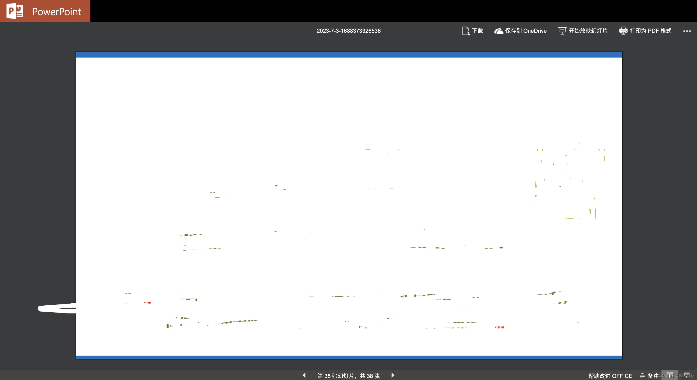

- Pros: Very high fidelity, rich features, page navigation, and even supports clicking to play animations.
- Cons: Loading is a bit slow, possibly due to the Great Firewall.

#### (2). Excel Preview Result:

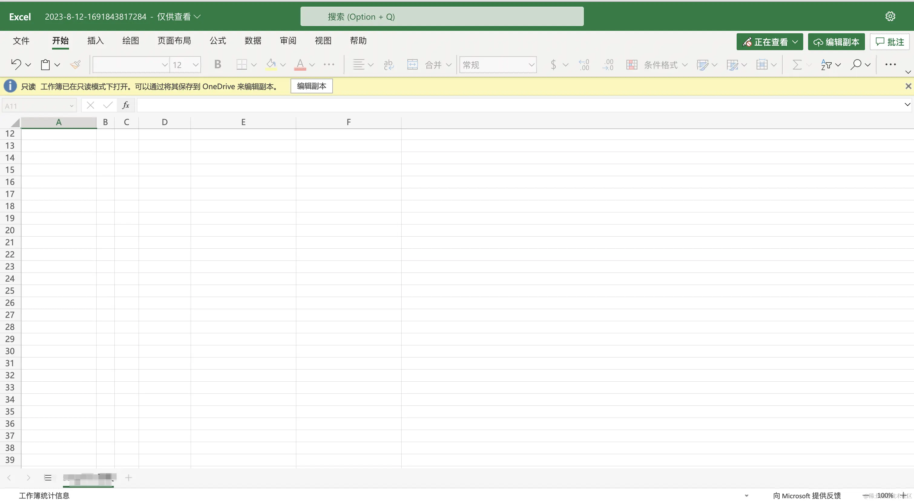

#### (3). Docx Preview Result

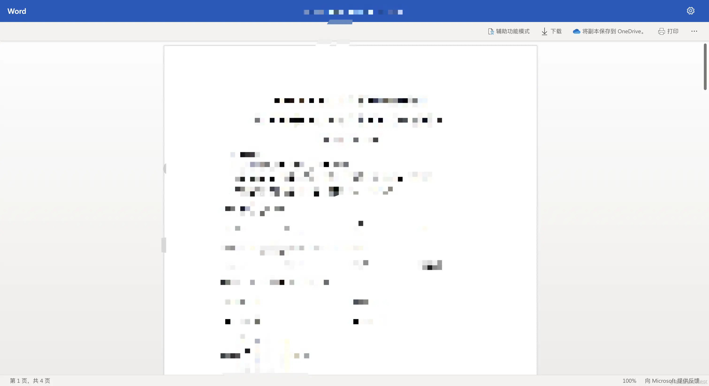

#### (4). PDF Preview Result

I wasn't able to get this working in my testing — it returned an error. Others are welcome to try.

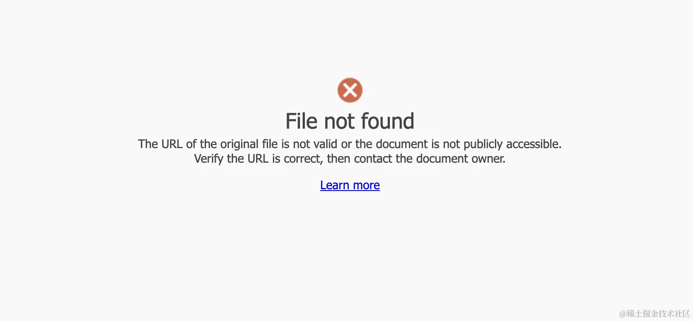

#### (5). Overall

It has decent support for `docx`, `pptx`, and `xlsx`, but not for `pdf`.

Another pitfall: there's no definitive answer about whether this service is stable, what its limits are, or whether it's paid. You can't even find documentation for it on the official `office` website.

The only thing I could find is a `Q&A`: https://answers.microsoft.com/en-us/msoffice/forum/all/what-is-the-status-of-viewofficeappslivecom/830fd75c-9b47-43f9-89c9-4303703fd7f6

A Microsoft staff member responded:


In short: it's essentially free to use indefinitely, there's no pricing plan, it doesn't store the previewed file data, files are limited to `10MB`, and it's recommended only for **viewing publicly accessible files on the internet**.

But according to some users' testing:

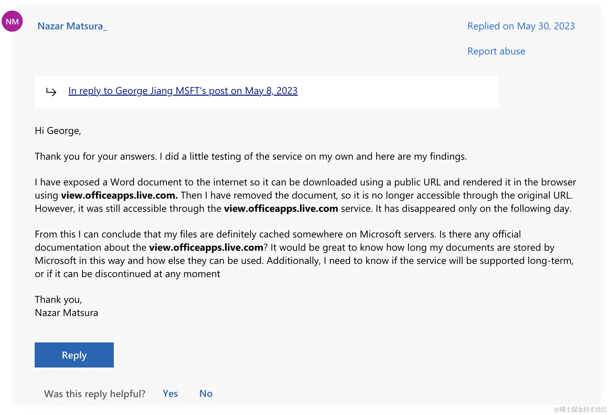

After using Microsoft's file preview service and then deleting the file at the source URL, the preview remained accessible for a while before eventually expiring.

### 2. Google Drive Viewer

Integration is simple, similar to `Office Web Viewer` — just change `src` to `https://drive.google.com/viewer?url=${encodeURIComponent(url)}`.

Limited to `25MB`, and supports the following formats:

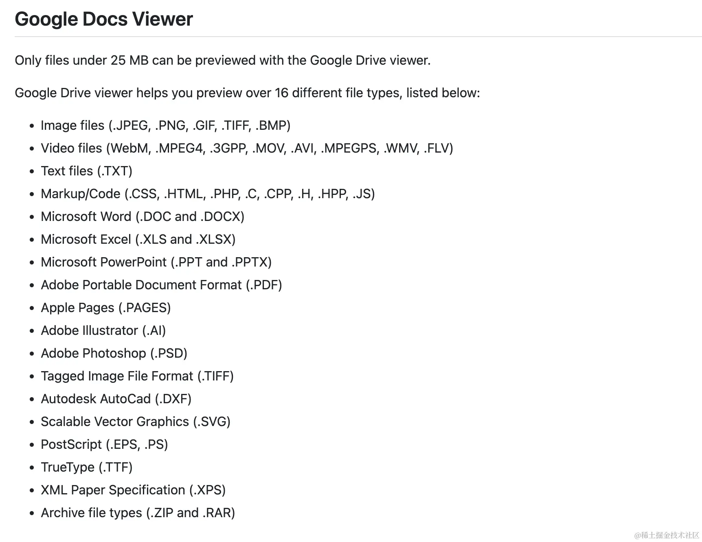

In testing, it supports previewing `docx,pptx,xlsx,pdf`, but the `pptx` preview isn't as good as Microsoft's — there are no animation effects, and some styling gets slightly garbled.

**Unusable for well-known reasons**

### 3. Alibaba Cloud IMM

Official documentation: https://help.aliyun.com/document_detail/63273.html


Paid service

### 4. XDOC Document Preview

Having covered some major providers, let's look at a few others — **use your own judgment**

Official site: https://view.xdocin.com/view-xdocin-com_6x5f4x.htm


### 5. Office Web 365

Note that although the name looks a lot like `office`, checking the page's `Copyright` reveals it's actually a company based in Xi'an — **not Microsoft**.

But it does provide a file preview service after all

Official site: https://www.officeweb365.com/


### 6. WPS Open Platform

Official site: https://solution.wps.cn/


Paid service, pricing as follows:


## Part 2: Frontend Solutions

### 1. pptx Preview Solutions

First, let's check whether an existing wheel is available. The only open-source `pptx` preview project I could find is https://github.com/g21589/PPTX2HTML. But it hasn't been updated or maintained in six or seven years, and I ran into a lot of compatibility issues when I tried using it.

In short: there isn't one. In that case, we can parse it ourselves. The main steps are:

1. Look up the international standard for `pptx`
2. Parse the `pptx` file
3. Render it as `html` or `canvas` for display

Let's first look up the international standard for `pptx`. Official site: [officeopenxml](http://officeopenxml.com/)

First, let's explain what `officeopenxml` is:

> Office OpenXML, also known as OpenXML or OOXML, is an XML-based office document format that includes word processing documents, spreadsheets, presentations, and charts, diagrams, shapes, and other graphical materials. The specification was developed by Microsoft and was adopted by ECMA International as ECMA-376 in 2006. A second edition was published in December 2008, and a third edition in June 2011. The specification has been adopted by ISO and IEC as ISO/IEC 29500.

> While Microsoft continues to support the older binary formats (.doc, .xls, and .ppt), OOXML is now the default format for all Microsoft Office documents (.docx, .xlsx, and .pptx).

As we can see, `Office OpenXML` was developed by Microsoft and is now an international standard. Next, let's look at what's inside a `pptx` file — for details, see the official `pptx` standard: [officeopenxml-pptx](http://officeopenxml.com/anatomyofOOXML-pptx.php)

> A PresentationML, or .pptx, file is a **zip file** that contains a number of "parts" (typically UTF-8 or UTF-16 encoded) or XML files. The package may also contain other media files, such as images. This structure is organized according to the Open Packaging Conventions outlined in Part 2 of the OOXML standard ECMA-376.

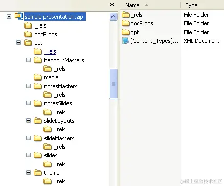

According to the international standard, we know that a `pptx` file is essentially a `zip` file that contains many parts:

> The number and types of parts will vary depending on the content of the presentation, but there will always be a [Content_Types].xml, one or more relationship (.rels) parts, and one presentation part (presentation.xml) located in the ppt folder for a Microsoft PowerPoint file. Typically, there will also be at least one slide part, along with one slide master and one slide layout from which the slides are derived.

So how does `js` read a `zip`?

Found a tool for it: https://www.npmjs.com/package/jszip

So we can start trying to parse `pptx`.

```ts
import JSZip from 'jszip';
// Load the pptx data
const zip = await JSZip.loadAsync(pptxData);
```

- Parse `[Content_Types].xml`

Every `pptx` file necessarily has a `[Content_Types].xml`. This file contains a list of all the content types for the parts in the package. Every part and its type must be listed in `[Content_Types].xml`. Its contents let us parse the rest of the file's data.

```ts
const filesInfo = await getContentTypes(zip);

async function getContentTypes(zip: JSZip) {
  const ContentTypesJson = await readXmlFile(zip, '[Content_Types].xml');
  const subObj = ContentTypesJson['Types']['Override'];
  const slidesLocArray = [];
  const slideLayoutsLocArray = [];
  for (let i = 0; i < subObj.length; i++) {
    switch (subObj[i]['attrs']['ContentType']) {
      case 'application/vnd.openxmlformats-officedocument.presentationml.slide+xml':
        slidesLocArray.push(subObj[i]['attrs']['PartName'].substr(1));
        break;
      case 'application/vnd.openxmlformats-officedocument.presentationml.slideLayout+xml':
        slideLayoutsLocArray.push(subObj[i]['attrs']['PartName'].substr(1));
        break;
      default:
    }
  }
  return {
    slides: slidesLocArray,
    slideLayouts: slideLayoutsLocArray,
  };
}
```

- Parse the presentation

First, get the size of the presentation from `presentation.xml` in the `ppt` directory

Since the presentation is in `xml` format, actually reading its content requires calling `readXmlFile`

```ts
const slideSize = await getSlideSize(zip);
async function getSlideSize(zip: JSZip) {
  const content = await readXmlFile(zip, 'ppt/presentation.xml');
  const sldSzAttrs = content['p:presentation']['p:sldSz']['attrs'];
  return {
    width: (parseInt(sldSzAttrs['cx']) * 96) / 914400,
    height: (parseInt(sldSzAttrs['cy']) * 96) / 914400,
  };
}
```

- Load the theme

According to the `officeopenxml` standard's explanation

> Every package contains a relationship part that defines the relationships between other parts as well as relationships with resources outside the package. This keeps relationships separate from content and makes it easy to change relationships without having to change the source that references the target.

> In addition to the package's relationship part, every part that serves as the source of one or more relationships has its own relationship part. Each such relationship part can be found in the part's \_rels subfolder and is named by appending ".rels" to the part's name.

The theme-related information is located in `ppt/_rels/presentation.xml.rels`

```ts
async function loadTheme(zip: JSZip) {
  const preResContent = await readXmlFile(zip, 'ppt/_rels/presentation.xml.rels');
  const relationshipArray = preResContent['Relationships']['Relationship'];
  let themeURI;
  if (relationshipArray.constructor === Array) {
    for (let i = 0; i < relationshipArray.length; i++) {
      if (
        relationshipArray[i]['attrs']['Type'] ===
        'http://schemas.openxmlformats.org/officeDocument/2006/relationships/theme'
      ) {
        themeURI = relationshipArray[i]['attrs']['Target'];
        break;
      }
    }
  } else if (
    relationshipArray['attrs']['Type'] === 'http://schemas.openxmlformats.org/officeDocument/2006/relationships/theme'
  ) {
    themeURI = relationshipArray['attrs']['Target'];
  }

  if (themeURI === undefined) {
    throw Error("Can't open theme file.");
  }

  return readXmlFile(zip, 'ppt/' + themeURI);
}
```

The rest of the content inside `ppt` can be parsed the same way. According to the `officeopenxml` standard, it may include:

| Part                       | Description                                                                                                                                                                                |
| -------------------------- | ------------------------------------------------------------------------------------------------------------------------------------------------------------------------------------------ |
| Comments Authors           | Contains information about each author who has added a comment to the presentation.                                                                                                        |
| Comments                   | Contains comments for a single slide.                                                                                                                                                      |
| Handout Master             | Contains the look, position, and size of the slides, notes, header and footer text, date, or page number on the presentation's handout. There can be only one such part.                   |
| Notes Master               | Contains information about the content and formatting of all notes pages. There can be only one such part.                                                                                 |
| Notes Slide                | Contains the notes for a single slide.                                                                                                                                                     |
| Presentation               | Contains the definition of a slide presentation. There must be one and only one such part. See [Presentation](http://officeopenxml.com/PrPresentation.php).                                |
| Presentation Properties    | Contains all of the presentation's properties. There must be one and only one such part.                                                                                                   |
| Slide                      | Contains the content of a single slide.                                                                                                                                                    |
| Slide Layout               | Contains the definition for a slide template. It defines the default appearance and positioning of drawing objects on the slide. There must be one or more such parts.                     |
| Slide Master               | Contains the master definition of formatting, text, and objects that appear on each slide in the presentation that is derived from the slide master. There must be one or more such parts. |
| Slide Synchronization Data | Contains properties specifying the current state of a slide that is being synchronized with a version of the slide stored on a central server.                                             |
| User-Defined Tags          | Contains a set of user-defined properties for an object in a presentation. There can be zero or more such parts.                                                                           |
| View Properties            | Contains display properties for the presentation.                                                                                                                                          |

And so on — we just need to parse and render each part according to the standard, one piece at a time.

Full source code: [ranui](https://github.com/chaxus/ran/tree/main/packages/ranui)

Usage docs: [preview component](https://ran.chaxus.com/src/ranui/preview/)

### 2. pdf Preview Solutions

#### (1). iframe and embed

`pdf` is a bit special — most browsers support previewing `pdf` by default. So we can rely on the browser's built-in capability:

```html
<iframe src="viewFileUrl" />
```

But this approach relies entirely on the browser — the display, interaction, and even whether `PDF` is supported at all depend entirely on the browser's capabilities. Different browsers often render and interact differently, so if you need consistency, it's better to try another approach.

`embed` works the same way, so I won't give an example here

#### (2). pdfjs

npm: <https://www.npmjs.com/package/pdfjs-dist>

github: <https://github.com/mozilla/pdfjs-dist>

Made by `Mozilla`, the organization behind the `MDN` we all know.

In fact, the PDF preview currently used by Firefox is built on this — you can open a `pdf` file in Firefox and inspect the `js` the browser uses to confirm it.

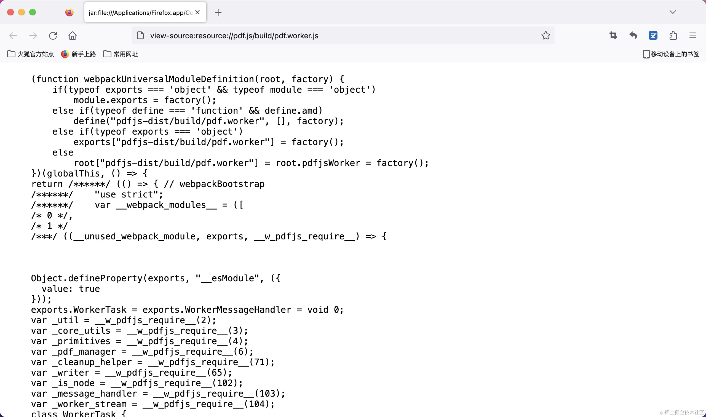

Note that the latest version of `pdf.js` requires `node` version `18` or higher

github link: https://github.com/mozilla/pdf.js/blob/master/package.json

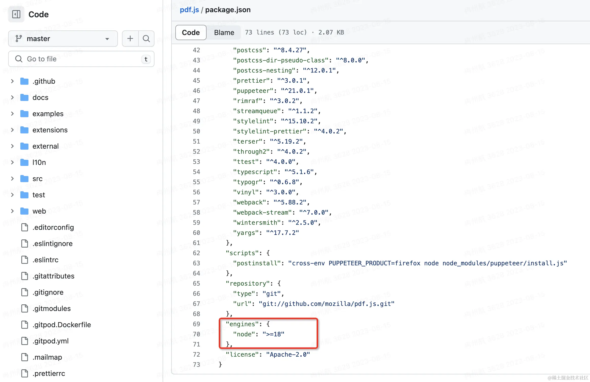

If your project's `node` version is lower than that, it may not work.

If you run into this, you can use an older version, which doesn't have this restriction.

Usage details are as follows:

- Full source code: https://github.com/chaxus/ran/tree/main/packages/ranui
- Usage docs: https://ran.chaxus.com/src/ranui/preview/

```ts
import * as pdfjs from 'pdfjs-dist';
import * as pdfjsWorker from 'pdfjs-dist/build/pdf.work.entry';

interface Viewport {
  width: number;
  height: number;
  viewBox: Array<number>;
}

interface RenderContext {
  canvasContext: CanvasRenderingContext2D | null;
  transform: Array<number>;
  viewport: Viewport;
}

interface PDFPageProxy {
  pageNumber: number;
  getViewport: () => Viewport;
  render: (options: RenderContext) => void;
}

interface PDFDocumentProxy {
  numPages: number;
  getPage: (x: number) => Promise<PDFPageProxy>;
}

class PdfPreview {
  private pdfDoc: PDFDocumentProxy | undefined;
  pageNumber: number;
  total: number;
  dom: HTMLElement;
  pdf: string | ArrayBuffer;
  constructor(pdf: string | ArrayBuffer, dom: HTMLElement | undefined) {
    this.pageNumber = 1;
    this.total = 0;
    this.pdfDoc = undefined;
    this.pdf = pdf;
    this.dom = dom ? dom : document.body;
  }
  private getPdfPage = (number: number) => {
    return new Promise((resolve, reject) => {
      if (this.pdfDoc) {
        this.pdfDoc.getPage(number).then((page: PDFPageProxy) => {
          const viewport = page.getViewport();
          const canvas = document.createElement('canvas');
          this.dom.appendChild(canvas);
          const context = canvas.getContext('2d');
          const [_, __, width, height] = viewport.viewBox;
          canvas.width = width;
          canvas.height = height;
          viewport.width = width;
          viewport.height = height;
          canvas.style.width = Math.floor(viewport.width) + 'px';
          canvas.style.height = Math.floor(viewport.height) + 'px';
          const renderContext = {
            canvasContext: context,
            viewport: viewport,
            transform: [1, 0, 0, -1, 0, viewport.height],
          };
          page.render(renderContext);
          resolve({ success: true, data: page });
        });
      } else {
        reject({ success: false, data: null, message: 'pdfDoc is undefined' });
      }
    });
  };
  pdfPreview = () => {
    window.pdfjsLib.GlobalWorkerOptions.workerSrc = pdfjsWorker;
    window.pdfjsLib.getDocument(this.pdf).promise.then(async (doc: PDFDocumentProxy) => {
      this.pdfDoc = doc;
      this.total = doc.numPages;
      for (let i = 1; i <= this.total; i++) {
        await this.getPdfPage(i);
      }
    });
  };
  prevPage = () => {
    if (this.pageNumber > 1) {
      this.pageNumber -= 1;
    } else {
      this.pageNumber = 1;
    }
    this.getPdfPage(this.pageNumber);
  };
  nextPage = () => {
    if (this.pageNumber < this.total) {
      this.pageNumber += 1;
    } else {
      this.pageNumber = this.total;
    }
    this.getPdfPage(this.pageNumber);
  };
}

const createReader = (file: File): Promise<string | ArrayBuffer | null> => {
  return new Promise((resolve, reject) => {
    const reader = new FileReader();
    reader.readAsDataURL(file);
    reader.onload = () => {
      resolve(reader.result);
    };
    reader.onerror = (error) => {
      reject(error);
    };
    reader.onabort = (abort) => {
      reject(abort);
    };
  });
};

export const renderPdf = async (file: File, dom?: HTMLElement): Promise<void> => {
  try {
    if (typeof window !== 'undefined') {
      const pdf = await createReader(file);
      if (pdf) {
        const PDF = new PdfPreview(pdf, dom);
        PDF.pdfPreview();
      }
    }
  } catch (error) {
    console.log('renderPdf', error);
  }
};
```

### 3. docx Preview Solutions

We could look at the international standard for `docx`, parse the file format ourselves, and render it as `html` and `canvas`. Fortunately, someone has already done this and open-sourced it.

`npm` link: https://www.npmjs.com/package/docx-preview

Usage is as follows:

```ts
import { renderAsync } from 'docx-preview';

interface DocxOptions {
  bodyContainer?: HTMLElement | null;
  styleContainer?: HTMLElement;
  buffer: Blob;
  docxOptions?: Partial<Record<string, string | boolean>>;
}

export const renderDocx = (options: DocxOptions): Promise<void> | undefined => {
  if (typeof window !== 'undefined') {
    const { bodyContainer, styleContainer, buffer, docxOptions = {} } = options;
    const defaultOptions = {
      className: 'docx',
      ignoreLastRenderedPageBreak: false,
    };
    const configuration = Object.assign({}, defaultOptions, docxOptions);
    if (bodyContainer) {
      return renderAsync(buffer, bodyContainer, styleContainer, configuration);
    } else {
      const contain = document.createElement('div');
      document.body.appendChild(contain);
      return renderAsync(buffer, contain, styleContainer, configuration);
    }
  }
};
```

### 4. xlsx Preview Solutions

We can use this:

`npm` link: https://www.npmjs.com/package/@vue-office/excel

Supports both `vue2` and `vue3`, and there's also a plain `js` version

For `xlsx` preview, this is the best one I've found.

### 5. Summary of Frontend Preview Solutions

We refined and consolidated the excellent solutions found above, and packaged them into a `web components` component: [preview component](https://ran.chaxus.com/src/ranui/preview/)

Why a `web components` component?

Because it's framework-agnostic — it can be used in any framework, and is as convenient to use as a native `div` tag.

We also wrote usage documentation: [preview component docs](https://ran.chaxus.com/src/ranui/preview/), which supports an interactive experience.

The source is public, under the `MIT` license.

Currently, `docx`, `pdf`, and `xlsx` preview all work well — these are the best available solutions. `pptx` preview isn't great since it requires custom parsing. That said, **the source code is fully public** — feel free to file an `issue`, submit a `pr`, or just grab and modify it yourself. Source: https://github.com/chaxus/ran/tree/main/packages/ranui

## Part 3: Server-Side Preview Solutions

### 1. openOffice

Since browsers can't directly open `docx`, `pptx`, `xlsx`, and similar formats, but can directly open `pdf` and images, we can take a different approach: use the server to convert the file format into something the browser recognizes, and then let the browser open it. Problem solved — and it doesn't even require any frontend handling.

We can leverage `openOffice`'s capabilities. Let's first introduce `openOffice`:

> `Apache OpenOffice` is a leading open-source office software suite for word processing, spreadsheets, presentations, graphics, databases, and more. It's available in multiple languages and runs on all common computers. It stores all your data in an international open standard format, and can also read and write files from other common office software packages. It can be downloaded and used completely free of charge for any purpose.

Official site: https://www.openoffice.org/

First, download `openOffice`, locate the `bin` directory, and configure it

```java
configuration.setOfficeHome("The path here is usually C:\\Program Files (x86)\\OpenOffice 4");
```

Test the file paths for conversion

```java
    public static void main(String[] args) {
        convertToPDF("/Users/Desktop/asdf.docx", "/Users/Desktop/adsf.pdf");
    }
```

Here's the full code:

```java

package org.example;

import org.artofsolving.jodconverter.OfficeDocumentConverter;
import org.artofsolving.jodconverter.office.DefaultOfficeManagerConfiguration;
import org.artofsolving.jodconverter.office.OfficeManager;

import java.io.File;

public class OfficeUtil {

    private static OfficeManager officeManager;
    private static int port[] = {8100};

    /**
     * start openOffice service.
     */
    public static void startService() {
        DefaultOfficeManagerConfiguration configuration = new DefaultOfficeManagerConfiguration();
        try {
            System.out.println("Preparing to start the office conversion service....");
            configuration.setOfficeHome("The path here is usually C:\\Program Files (x86)\\OpenOffice 4");
            configuration.setPortNumbers(port); // Set the conversion port, default is 8100
            configuration.setTaskExecutionTimeout(1000 * 60 * 30L);// Set task execution timeout to 30 minutes
            configuration.setTaskQueueTimeout(1000 * 60 * 60 * 24L);// Set task queue timeout to 24 hours
            officeManager = configuration.buildOfficeManager();
            officeManager.start(); // Start the service
            System.out.println("office conversion service started successfully!");
        } catch (Exception e) {
            System.out.println("office conversion service failed to start! Details: " + e);
        }
    }

    /**
     * stop openOffice service.
     */
    public static void stopService() {
        System.out.println("Preparing to stop the office conversion service....");
        if (officeManager != null) {
            officeManager.stop();
        }
        System.out.println("office conversion service stopped successfully!");
    }

    public static void convertToPDF(String inputFile, String outputFile) {
        startService();
        System.out.println("Converting document: " + inputFile + " --> " + outputFile);
        OfficeDocumentConverter converter = new OfficeDocumentConverter(officeManager);
        converter.convert(new File(inputFile), new File(outputFile));
        stopService();
    }

    public static void main(String[] args) {
        convertToPDF("/Users/koolearn/Desktop/asdf.docx", "/Users/koolearn/Desktop/adsf.pdf");
    }
}

```

### 2. kkFileView

`github`: https://github.com/kekingcn/kkFileView

Supports a very wide range of file preview formats
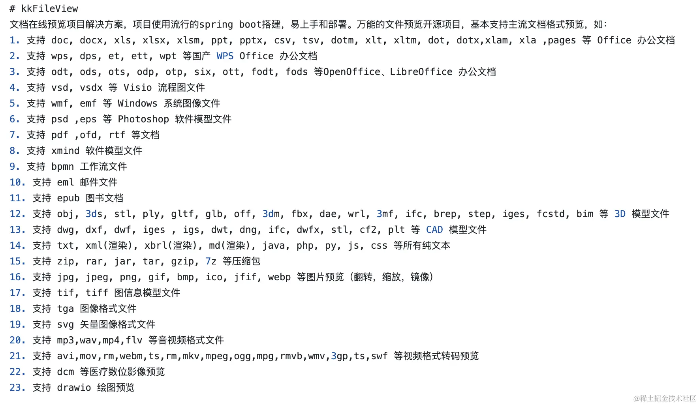

Next are the `zero-to-one` setup steps — follow along and anyone can get it running

1. Install `java`:

```sh
brew install java
```

1. Install `maven`, Java's package management tool:

```sh
brew install mvn
```

1. Check whether the installation succeeded

Run `java --version` and `mvn -v`. I ran into an error where `mvn` couldn't find `java home`. Here's how I fixed it:

I use `zsh`, so I needed to add the path to `.zshrc`:

```
export JAVA_HOME=$(/usr/libexec/java_home)
```

After adding it, run

```
source .zshrc
```

4. Install `libreoffice`:

This is an explicit extra dependency required by `kkFileView` — without it, the service won't start

```
brew install libreoffice
```

5. Install dependencies with `mvn`

Go into the project and run the dependency installation from the root directory, while also clearing the cache and skipping unit tests (I ran into unit test failures)

```
mvn clean install -DskipTests
```

6. Start the project

Find the main file with the `main` function, and click `Run` in `vscode` to execute it. The path is shown below

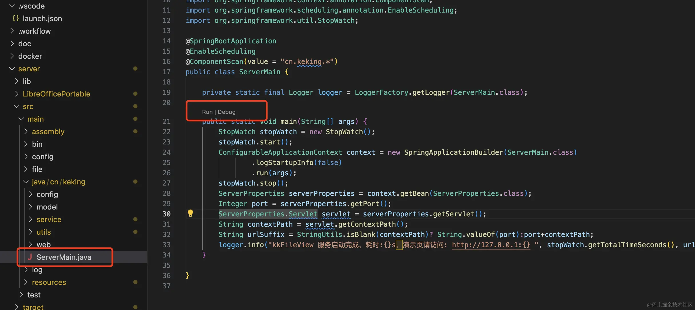

1. Visit the page

Once it's started, click the address printed in the terminal output

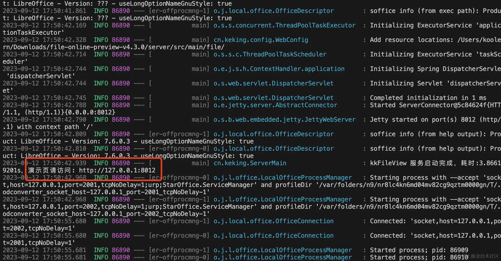

1. Final result

The final result looks like this — you can add a link to preview, or choose a local file to preview

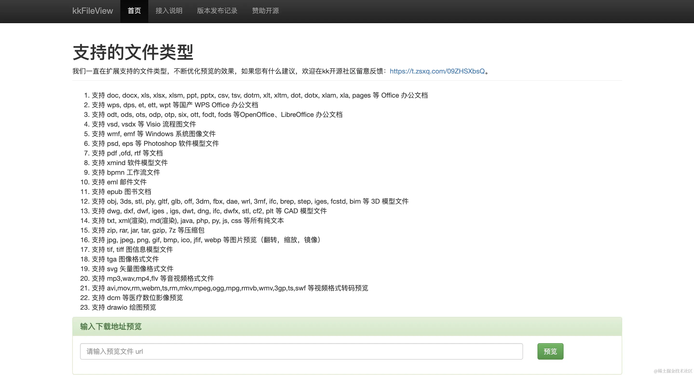

The preview quality is excellent

### 3. onlyOffice

Official site: https://www.onlyoffice.com/zh

`github`: https://github.com/ONLYOFFICE

The developer edition and community edition are free; the enterprise edition is paid: https://www.onlyoffice.com/zh/docs-enterprise-prices.aspx

It supports fewer file types for preview than `kkFileView`, but has great support for the `office` trio, and even supports multi-user collaborative editing.

## Part 4: Summary

1. For external services, Microsoft's `view.officeapps.live.com/op/view.aspx` is recommended, but only for previewing publicly accessible files on the internet — not recommended for files that require confidentiality or stability.
2. If you need confidentiality and stability and money isn't an issue, try services from major providers, such as Alibaba Cloud's solution.
3. If your server-side capabilities are strong, use a server-side preview solution. Currently, server-side preview solutions offer the best and most comprehensive results.
4. If you don't want to spend money and don't have a server, use a frontend preview solution — client-side rendering at zero cost.

## Part 5: References

1. [How to use openOffice for format conversion in Java](https://blog.csdn.net/Li_Zhongxin/article/details/132105957)
2. [Complete Beginner's Guide to Setting Up OpenOffice on Mac](https://blog.51cto.com/u_15899048/5902747)
3. [A Pure JS Library for docx, xlsx, and pdf File Preview — Super Easy to Use](https://juejin.cn/post/7251199685130059833)
4. [Frontend Implementation of Preview for Word, Excel, PDF, PPT, MP4, Images, Text, and Other Files](https://juejin.cn/post/7071598747519549454)
