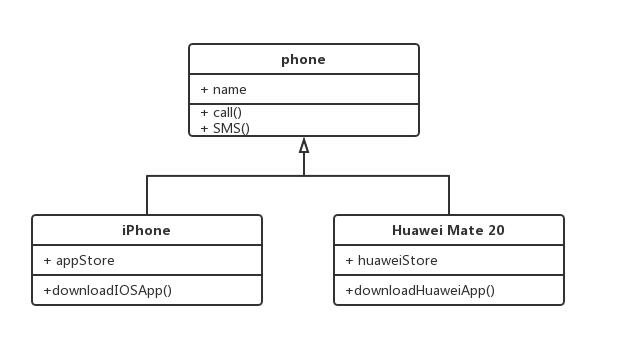
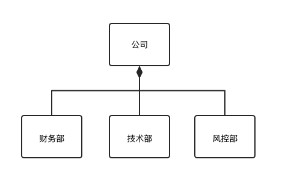
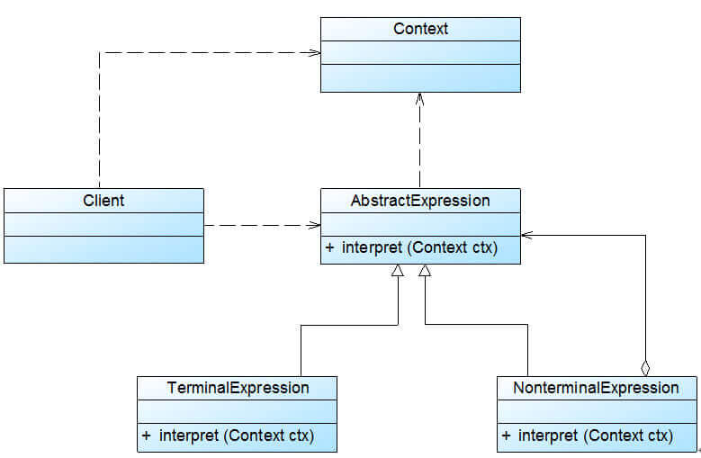
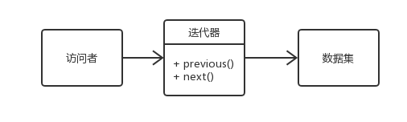
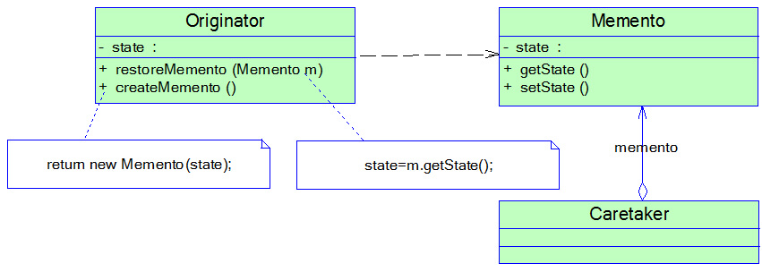
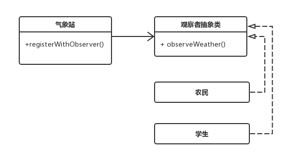
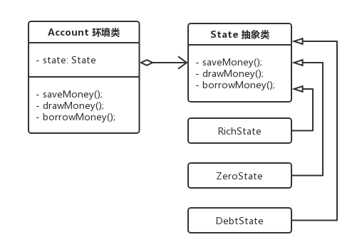

# 23 种经典设计模式

> 设计模式 `Design Pattern` 是一套被反复使用、多数人知晓的、经过分类编目的、代码设计经验的总结，使用设计模式是为了可重用代码、让代码更容易被他人理解并且保证代码可靠性。。

在《设计模式：可复用面向对象软件的基础》一书中所介绍的 23 种经典设计模式，不过设计模式并不仅仅只有这 23 种，随着软件开发行业的发展，越来越多的新模式不断诞生并得以应用。有经验的开发者在学习设计模式可以和过往的经验互相印证，更容易理解这些设计模式。

设计模式一般包含模式名称、问题、目的、解决方案、效果等组成要素。问题描述了应该在何时使用模式，它包含了设计中存在的问题以及问题存在的原因。解决方案描述了一个设计模式的组成成分，以及这些组成成分之间的相互关系，各自的职责和协作方式，通常解决方案通过 `UML` 类图和核心代码来进行描述。效果描述了模式的优缺点以及在使用模式时应权衡的问题。

**为什么要学习设计模式**:

- 设计模式来源众多专家的经验和智慧，它们是从许多优秀的软件系统中总结出的成功的、能够实现可维护性复用的设计方案，使用这些方案将可以让我们避免做一些重复性的工作

- 设计模式提供了一套通用的设计词汇和一种通用的形式来方便开发人员之间沟通和交流，使得设计方案更加通俗易懂

- 大部分设计模式都兼顾了系统的可重用性和可扩展性，这使得我们可以更好地重用一些已有的设计方案、功能模块甚至一个完整的软件系统，避免我们经常做一些重复的设计、编写一些重复的代码

- 合理使用设计模式并对设计模式的使用情况进行文档化，将有助于别人更快地理解系统

- 学习设计模式将有助于初学者更加深入地理解面向对象思想

**储备知识**：

- 抽象类：一般抽象类都是作为基类，比如说「电脑」就可以作为一个抽象类，根据抽象类派生出「台式电脑」和「笔记本电脑」2 种具体类。一般不对抽象类进行实例化。

- 组合优于继承：不能滥用继承来拓展功能，配合组合会更灵活。同样拿「电脑」抽象类来举例，如果使用继承，区分不同类型的「电脑」我们可以派生出「台式电脑」和「笔记本电脑」，如果再增加一个维度，根据品牌又能继续细分出「联想台式电脑」、「联想笔记本电脑」、「苹果台式电脑」和「苹果笔记本电脑」等等，如果再增加一个维度继续细分下去，显然继承是无法胜任的。这个时候可以使用继承加组合方式，组合的对象也可以进行抽象化设计：

  ```ts
  // 品牌
  interface Brand {
    // ...
  }
  interface Lenovo extends Brand {
    // ...
  }
  interface Apple extends Brand {
    // ...
  }
  // CPU
  interface CPU {
    // ...
  }
  interface Inter extends CPU {
    // ...
  }
  interface AMD extends CPU {
    // ...
  }
  // 电脑
  interface Computer {
    // ...
  }

  interface DesktopComputer extends Computer {}
  interface NotebookComputer extends Computer {}
  ```

## 一、UML 类图

每个模式都有相应的对象结构图，同时为了展示对象间的交互细节， 有些时候会用到 `UML` 图来介绍其如何运行。这里不会将 `UML` 的各种元素都提到，只想讲讲类图中各个类之间的关系， 能看懂类图中各个类之间的线条、箭头代表什么意思后，也就足够应对日常的工作和交流。同时，我们应该能将类图所表达的含义和最终的代码对应起来。有了这些知识，看后面章节的设计模式结构图就没有什么问题了。

<!-- 本文中大部分是 UML 类图，也有个别简易流程图。由于文中部分模式并未配图，你可以在[这里](../../assets/article/designPattern/UML/创建型/单例.jpg)查看我在网络上收集的完整 23 种设计模式 UML 类图。 -->

### 1.1 继承

继承用一条带空心箭头的直接表示。



### 1.2 实现

实现关系用一条带空心箭头的虚线表示。


### 1.3 组合

与聚合关系一样，组合关系同样表示整体由部分构成的语义。比如公司由多个部门组成，但组合关系是一种强依赖的特殊聚合关系，如果整体不存在了，则部分也不存在了。例如，公司不存在了，部门也将不存在了。



### 1.4 聚合

聚合关系用于表示实体对象之间的关系，表示整体由部分构成的语义，例如一个部门由多个员工组成。与组合关系不同的是，整体和部分不是强依赖的，即使整体不存在了，部分仍然存在。例如，部门撤销了，人员不会消失，他们依然存在。


### 1.5 关联

关联关系是用一条直线表示的，它描述不同类的对象之间的结构关系，它是一种静态关系， 通常与运行状态无关，一般由常识等因素决定的。它一般用来定义对象之间静态的、天然的结构， 所以，关联关系是一种“强关联”的关系。

比如，乘车人和车票之间就是一种关联关系，学生和学校就是一种关联关系，关联关系默认不强调方向，表示对象间相互知道。如果特别强调方向，如下图，表示 A 知道 B ，但 B 不知道 A 。


### 1.6 依赖

依赖关系是用一套带箭头的虚线表示的，如 A 依赖于 B，他描述一个对象在运行期间会用到另一个对象的关系。

与关联关系不同的是，它是一种临时性的关系，通常在运行期间产生，并且随着运行时的变化，依赖关系也可能发生变化。显然，依赖也有方向，双向依赖是一种非常糟糕的结构，我们总是应该保持单向依赖，杜绝双向依赖的产生。


## 二、六大原则

### 2.1 开闭原则

> 一个软件实体应当对扩展开放，对修改关闭。即软件实体应尽量在不修改原有代码的情况下进行扩展。

任何软件都需要面临一个很重要的问题，即它们的需求会随时间的推移而发生变化。当软件系统需要面对新的需求时，我们应该尽量保证系统的设计框架是稳定的。如果一个软件设计符合开闭原则，那么可以非常方便地对系统进行扩展，而且在扩展时无须修改现有代码，使得软件系统在拥有适应性和灵活性的同时具备较好的稳定性和延续性。随着软件规模越来越大，软件寿命越来越长，软件维护成本越来越高，设计满足开闭原则的软件系统也变得越来越重要。

为了满足开闭原则，需要对系统进行抽象化设计，抽象化是开闭原则的关键。在`Java`、`C#`等编程语言中，可以为系统定义一个相对稳定的抽象层，而将不同的实现行为移至具体的实现层中完成。在很多面向对象编程语言中都提供了接口、抽象类等机制，可以通过它们定义系统的抽象层，再通过具体类来进行扩展。如果需要修改系统的行为，无须对抽象层进行任何改动，只需要增加新的具体类来实现新的业务功能即可，实现在不修改已有代码的基础上扩展系统的功能，达到开闭原则的要求。

**优点：实践开闭原则的优点在于可以在不改动原有代码的前提下给程序扩展功能。增加了程序的可扩展性，同时也降低了程序的维护成本。**

### 2.2 里氏替换原则

> 所有引用基类对象的地方能够透明地使用其子类的对象

里氏代换原则告诉我们，在软件中将一个基类对象替换成它的子类对象，程序将不会产生任何错误和异常，反过来则不成立，如果一个软件实体使用的是一个子类对象的话，那么它不一定能够使用基类对象。例如：我喜欢动物，那我一定喜欢狗，因为狗是动物的子类。但是我喜欢狗，不能据此断定我喜欢动物，因为我并不喜欢老鼠，虽然它也是动物。

例如有两个类，一个类为`BaseClass`，另一个是`SubClass`类，并且`SubClass`类是`BaseClass`类的子类，那么一个方法如果可以接受一个`BaseClass`类型的基类对象`base`的话，如：`method1(base)`，那么它必然可以接受一个`BaseClass`类型的子类对象`sub`，`method1(sub)`能够正常运行。反过来的代换不成立，如一个方法`method2`接受`BaseClass`类型的子类对象`sub`为参数：`method2(sub)`，那么一般而言不可以有`method2(base)`，除非是重载方法。

里氏代换原则是实现开闭原则的重要方式之一，由于使用基类对象的地方都可以使用子类对象，因此在程序中尽量使用基类类型来对对象进行定义，而在运行时再确定其子类类型，用子类对象来替换父类对象。

**优点：可以检验继承使用的正确性，约束继承在使用上的泛滥。**

### 2.3 依赖倒置原则

> 抽象不应该依赖于具体类，具体类应当依赖于抽象。换言之，要针对接口编程，而不是针对实现编程。

依赖倒转原则要求我们在程序代码中传递参数时或在关联关系中，尽量引用层次高的抽象层类，即使用接口和抽象类进行变量类型声明、参数类型声明、方法返回类型声明，以及数据类型的转换等，而不要用具体类来做这些事情。为了确保该原则的应用，一个具体类应当只实现接口或抽象类中声明过的方法，而不要给出多余的方法，否则将无法调用到在子类中增加的新方法。

在引入抽象层后，系统将具有很好的灵活性，在程序中尽量使用抽象层进行编程，而将具体类写在配置文件中，这样一来，如果系统行为发生变化，只需要对抽象层进行扩展，并修改配置文件，而无须修改原有系统的源代码，在不修改的情况下来扩展系统的功能，满足开闭原则的要求。

**优点：通过抽象来搭建框架，建立类和类的关联，以减少类间的耦合性。而且以抽象搭建的系统要比以具体实现搭建的系统更加稳定，扩展性更高，同时也便于维护。**

### 2.4 单一职责原则

> 一个类只负责一个功能领域中的相应职责，或者可以定义为：就一个类而言，应该只有一个引起它变化的原因。

单一职责原则告诉我们：一个类不能太“累”！在软件系统中，一个类（大到模块，小到方法）承担的职责越多，它被复用的可能性就越小，而且一个类承担的职责过多，就相当于将这些职责耦合在一起，当其中一个职责变化时，可能会影响其他职责的运作，因此要将这些职责进行分离，将不同的职责封装在不同的类中，即将不同的变化原因封装在不同的类中，如果多个职责总是同时发生改变则可将它们封装在同一类中。

单一职责原则是实现高内聚、低耦合的指导方针，它是最简单但又最难运用的原则，需要设计人员发现类的不同职责并将其分离，而发现类的多重职责需要设计人员具有较强的分析设计能力和相关实践经验。

**优点：如果类与方法的职责划分得很清晰，不但可以提高代码的可读性，更实际性地更降低了程序出错的风险，因为清晰的代码会让 bug 无处藏身，也有利于 bug 的追踪，也就是降低了程序的维护成本。**

### 2.5 迪米特法则（最少知道原则）

> 一个软件实体应当尽可能少地与其他实体发生相互作用

如果一个系统符合迪米特法则，那么当其中某一个模块发生修改时，就会尽量少地影响其他模块，扩展会相对容易，这是对软件实体之间通信的限制，迪米特法则要求限制软件实体之间通信的宽度和深度。迪米特法则可降低系统的耦合度，使类与类之间保持松散的耦合关系。

迪米特法则要求我们在设计系统时，应该尽量减少对象之间的交互，如果两个对象之间不必彼此直接通信，那么这两个对象就不应当发生任何直接的相互作用，如果其中的一个对象需要调用另一个对象的某一个方法的话，可以通过第三者转发这个调用。简言之，就是通过引入一个合理的第三者来降低现有对象之间的耦合度。

在将迪米特法则运用到系统设计中时，要注意下面的几点：在类的划分上，应当尽量创建松耦合的类，类之间的耦合度越低，就越有利于复用，一个处在松耦合中的类一旦被修改，不会对关联的类造成太大波及。在类的结构设计上，每一个类都应当尽量降低其成员变量和成员函数的访问权限。在类的设计上，只要有可能，一个类型应当设计成不变类。在对其他类的引用上，一个对象对其他对象的引用应当降到最低。

**优点：实践迪米特法则可以良好地降低类与类之间的耦合，减少类与类之间的关联程度，让类与类之间的协作更加直接。**

### 2.6 接口分离原则

> 使用多个专门的接口，而不使用单一的总接口，即客户端不应该依赖那些它不需要的接口。

根据接口隔离原则，当一个接口太大时，我们需要将它分割成一些更细小的接口，使用该接口的客户端仅需知道与之相关的方法即可。每一个接口应该承担一种相对独立的角色，不干不该干的事，该干的事都要干。

在使用接口隔离原则时，我们需要注意控制接口的粒度，接口不能太小，如果太小会导致系统中接口泛滥，不利于维护。接口也不能太大，太大的接口将违背接口隔离原则，灵活性较差，使用起来很不方便。

**优点：避免同一个接口里面包含不同类职责的方法，接口责任划分更加明确，符合高内聚低耦合的思想。**

### 2.7 合成复用原则（六大之外的）

> 尽量使用对象组合，而不是继承来达到复用的目的

合成复用原则就是在一个新的对象里通过关联关系（包括组合关系和聚合关系）来使用一些已有的对象，使之成为新对象的一部分，新对象通过委派调用已有对象的方法达到复用功能的目的。简而言之，复用时要尽量使用组合/聚合关系（关联关系），少用继承。

在面向对象设计中，可以通过两种方法在不同的环境中复用已有的设计和实现，即通过组合/聚合关系或通过继承，但首先应该考虑使用组合/聚合，组合/聚合可以使系统更加灵活，降低类与类之间的耦合度。一个类的变化对其他类造成的影响相对较少，其次才考虑继承，在使用继承时，需要严格遵循里氏代换原则，有效使用继承会有助于对问题的理解，降低复杂度，而滥用继承反而会增加系统构建和维护的难度以及系统的复杂度，因此需要慎重使用继承复用。

**优点：避免复用时滥用继承，合理使用组合关系，增加灵活性。**

### 2.8 六大原则 - 学习心得

六大原则中，**开闭原则**、**里氏替换原则**、**依赖倒置原则** 联系比较紧密，后两者是实现开闭原则重要前提，使用中通过抽象化设计具有很好的可拓展性和可维护性。

**知道最少原则** 可以降低耦合，减少不必要的交互，主张设计接口和类要简单易使用，将复杂的逻辑封装并提供简单易用的接口。

**单一职责原则** 使项目中的类和方法根据职责细分，避免单个类负担过重。职责越多，被复用的可能性就越小或使用起来越麻烦。

**接口分离原则** 将功能复杂的接口细分成多个特定功能的接口，只做该做的事情，降低耦合，但是细化粒度不能太细，容易导致接口过多。单一职责原则强调单个类内部根据职责细分的设计，接口分离原则强调类之间的耦合，尽量建立最小的依赖关系。

## 三、模式分类

《设计模式：可复用面向对象软件的基础》一书中设计模式有 23 个，它们各具特色，每个模式都为某一个可重复的设计问题提供了一套解决方案。根据它们的用途，设计模式可分为创建型(`Creational`)，结构型(`Structural`)和行为型(`Behavioral`)三种，其中创建型模式主要用于描述如何创建对象，结构型模式主要用于描述如何实现类或对象的组合，行为型模式主要用于描述类或对象怎样交互以及怎样分配职责。

此外，根据某个模式主要是用于处理类之间的关系还是对象之间的关系，设计模式还可以分为类模式和对象模式。我们经常将两种分类方式结合使用，如单例模式是对象创建型模式，模板方法模式是类行为型模式。

### 3.1 创建型

创建型模式(`Creational Pattern`)对类的实例化过程进行了抽象，能够将模块中对象的创建和对象的使用分离。为了使结构更加清晰，外界对于这些对象只需要知道它们共同的接口，而不清楚其具体的实现细节，使整个系统的设计更加符合单一职责原则。

1. 简单工厂模式（`Simple Factory Pattern`）
2. 工厂方法模式（`Factory Method Pattern`）
3. 抽象工厂模式（`Abstract Factory Pattern`）
4. 单例模式（`Singleton Pattern`）
5. 生成器模式（`Builder Pattern`）
6. 原型模式（`Prototype Pattern`）

### 3.2 结构型

结构型模式(`Structural Pattern`)描述如何将类或者对 象结合在一起形成更大的结构，就像搭积木，可以通过 简单积木的组合形成复杂的、功能更为强大的结构。结构型模式可以分为类结构型模式和对象结构型模式：

- 类结构型模式关心类的组合，由多个类可以组合成一个更大的系统，在类结构型模式中一般只存在继承关系和实现关系。

- 对象结构型模式关心类与对象的组合，通过关联关系使得在一 个类中定义另一个类的实例对象，然后通过该对象调用其方法。 根据“合成复用原则”，在系统中尽量使用关联关系来替代继 承关系，因此大部分结构型模式都是对象结构型模式。

1. 外观模式
2. 适配器模式
3. 桥接模式
4. 代理模式
5. 装饰者模式
6. 享元模式

### 3.3 行为型

行为型模式(`Behavioral Pattern`)是对在不同的对象之间划分责任和算法的抽象化。行为型模式不仅仅关注类和对象的结构，而且重点关注它们之间的相互作用。通过行为型模式，可以更加清晰地划分类与对象的职责，并研究系统在运行时实例对象之间的交互。

1. 职责链模式
2. 命令模式
3. 解释器模式
4. 迭代器模式
5. 中介者模式
6. 备忘录模式
7. 观察者模式
8. 状态模式
9. 策略模式
10. 模板方法模式
11. 访问者模式

## 四、创建型

### 4.1 简单工厂模式

> 简单工厂模式(`Simple Factory Pattern`)：专门定义一个类（工厂类）来负责创建其他类的实例。可以根据创建方法的参数来返回不同类的实例，被创建的实例通常都具有共同的父类。


**举例：**

简单工厂模式像一个代工厂，一个工厂可以生产多种产品。举个例子，一个饮料加工厂同时帮百事可乐和可口可乐生产，加工厂根据输入参数`Type`来生产不同的产品。

```ts
// 可乐抽象类
interface Cola {}

// 可口可乐产品类
interface CocaCola extends Cola {}

// 百事可乐产品类
interface PepsiCola extends Cola {}
```

```ts
// 简单工厂实现
// SimpleFactory
const createColaWithType = (type: number) => {
  switch (type) {
    case 0:
      return new CocaCola()
    case 1:
      return new PepsiCola()
    default:
      return null
      break
  }
}
```

```ts
// 0 生产可口可乐
const cocaCola: CocaCola = createColaWithType(0)

// 1 生产百事可乐
const pepsiCola: PepsiCola = createColaWithType(1)
```

**优点：**

- 使用者只需要给工厂类传入一个正确的约定好的参数，就可以获取你所需要的对象，而不需要知道其创建细节，一定程度上减少系统的耦合。
- 客户端无须知道所创建的具体产品类的类名，只需要知道具体产品类所对应的参数即可，减少开发者的记忆成本。

**缺点：**

- 如果业务上添加新产品的话，就需要修改工厂类原有的判断逻辑，这其实是违背了开闭原则的。
- 在产品类型较多时，有可能造成工厂逻辑过于复杂。所以简单工厂模式比较适合产品种类比较少而且增多的概率很低的情况。

### 4.2 工厂方法模式

> 工厂方法模式(`Factory Method Pattern`)又称为工厂模式，工厂父类负责定义创建产品对象的公共接口，而工厂子类则负责生成具体的产品对象，即通过不同的工厂子类来创建不同的产品对象。


**举例：**

工厂方法和简单工厂有一些区别，简单工厂是由一个代工厂生产不同的产品，而工厂方法是对工厂进行抽象化，不同产品都由专门的具体工厂来生产。可口可乐工厂专门生产可口可乐，百事可乐工厂专门生产百事可乐。

```ts
// 工厂抽象类
class Cola {}

// 可口可乐工厂
class CocaCola extends Cola {}

// 百事可乐工厂
class PepsiCola extends Cola {}
```

```ts
// 根据不同的工厂类生产不同的产品
const cocaCola = new CocaCola()
const pepsiCola = new PepsiCola()
```

**优点：**

- 用户只需要关心其所需产品对应的具体工厂是哪一个即可，不需要关心产品的创建细节，也不需要知道具体产品类的类名。
- 当系统中加入新产品时，不需要修改抽象工厂和抽象产品提供的接口，也无须修改客户端和其他的具体工厂和具体产品，而只要添加一个具体工厂和与其对应的具体产品就可以了，符合了开闭原则。

**缺点：**

- 当系统中加入新产品时，除了需要提供新的产品类之外，还要提供与其对应的具体工厂类。因此系统中类的个数将成对增加，增加了系统的复杂度。

### 4.3 抽象工厂模式

抽象工厂模式并不直接生成实例， 而是用于对产品类簇的创建。

> 抽象工厂模式(Abstract Factory Pattern)：提供一个创建一系列相关或相互依赖对象的接口，而无须指定它们具体的类。


**举例：**

抽象工厂和工厂方法不同的地方在于，生产产品的工厂是抽象的。举例，可口可乐公司生产可乐的同时，也需要生产装可乐的瓶子和箱子，瓶子和箱子也是可口可乐专属定制的，同样百事可乐公司也会有这个需求。这个时候我们的工厂不仅仅是生产可乐饮料的工厂，还必须同时生产同一主题的瓶子和箱子，所以它是一个抽象的主题工厂，专门生产同一主题的不同商品。

```ts
// 可乐抽象类和派生类
class Cola {}

class CocaCola extends Cola {}

class PepsiCola extends Cola {}

// 瓶子抽象类和派生类
class Bottle {}

class CocaColaBottle extends Bottle {}

class PepsiColaBottle extends Bottle {}

// 箱子抽象类和派生类
class Box {}

class CocaColaBox extends Box {}

class PepsiColaBox extends Box {}

// 工厂抽象类
const Factory = {
  createCola: () => new Cola(),
  createBottle: () => new Bottle(),
  createBox: () => new Box(),
}

// 可口可乐主题工厂
const CocaColaFactory = {
  createCola: () => new CocaCola(),
  createBottle: () => new CocaColaBottle(),
  createBox: () => new CocaColaBox(),
}

// 百事可乐主题工厂
const PepsiColaFactory = {
  createCola: () => new PepsiCola(),
  createBottle: () => new PepsiColaBottle(),
  createBox: () => new PepsiColaBox(),
}
```

```ts
// 可口可乐主题
const cocaCola = CocaColaFactory.createCola()
const cocaColaBottle = CocaColaFactory.createBottle()
const cocaColaBox = CocaColaFactory.createBox()

// 百事可乐主题
const pepsiCola = PepsiColaFactory.createCola()
const pepsiColaBottle = PepsiColaFactory.createBottle()
const pepsiColaBox = PepsiColaFactory.createBox()
```

**优点：**

- 具体产品在应用层代码隔离，不需要关心产品细节。只需要知道自己需要的产品是属于哪个工厂的即可 当一个产品族中的多个对象被设计成一起工作时，它能够保证客户端始终只使用同一个产品族中的对象。这对一些需要根据当前环境来决定其行为的软件系统来说，是一种非常实用的设计模式。

**缺点：**

- 规定了所有可能被创建的产品集合，产品族中扩展新的产品困难，需要修改抽象工厂的接口。

### 4.4 单例模式

> 单例模式(`Singleton Pattern`)：单例模式确保某一个类只有一个实例，并提供一个访问它的全剧访问点。


**举例：**

单例模式下，对应类只能生成一个实例。就像一个王国只能有一个国王，一旦王国里的事务多起来，这唯一的国王也容易职责过重。

```ts
class Singleton {}

function createSingleton() {
  let instance
  return function () {
    if (!instance) return new Singleton()
    return instance
  }
}
```

**优点：**

- 提供了对唯一实例的受控访问。因为单例类封装了它的唯一实例，所以它可以严格控制客户怎样以及何时访问它。
- 因为该类在系统内存中只存在一个对象，所以可以节约系统资源。

**缺点：**

- 由于单例模式中没有抽象层，因此单例类很难进行扩展。
- 对于有垃圾回收系统的语言 Java，C# 来说，如果对象长时间不被利用，则可能会被回收。那么如果这个单例持有一些数据的话，在回收后重新实例化时就不复存在了。

### 4.5 生成器模式

> 生成器模式(Builder Pattern)：也叫创建者模式，它将一个复杂对象的构建与它的表示分离，使得同样的构建过程可以创建不同的表示。

工厂模式主要是为了创建对象实例或者类簇（抽象工厂），关心的是最终产出(创建)的是什么，而不关心创建的过程。而建造者模式关心的是创建这个对象的整个过程，甚至于创建对象的每一个细节。


**举例：**

生成器模式的主要角色如下：

1. 生成器：接口生命再所有类型生成器中通用的产品构造步骤
2. 具体生成器：提供构造过程的不同实现。具体生成器也可以构造不遵循通用接口的产品
3. 产品：是最终生成的对象。由不同生成器构造的产品无需属于同一类层次构造或接口
4. 指挥者：定义调用构造步骤的顺序，这样你就可以创建和服用特定的产品配置
5. 客户端：必须将某个生成器对象与主管类关联，一般情况下，你只需要通过指挥者类构造函数的参数进行一次性关联即可

```ts
// 抽象建造者
abstract class Builder {
  public abstract buildPartA(): void
  public abstract buildPartB(): void
  public abstract buildPartC(): void
  public abstract buildProduct(): Product
}

// 具体建造者
class ConcreteBuilder extends Builder {
  private product: Product
  constructor(product: Product) {
    super()
    this.product = product
  }

  public buildPartA(): void {}
  public buildPartB(): void {}
  public buildPartC(): void {}

  // 最终组建一个产品
  public buildProduct(): Product {
    return this.product
  }
}

// 产品角色
class Product {
  public doSomething(): void {
    // 独立业务
  }
}

// 指挥者
class Director {
  private _builder: Builder
  constructor(builder: Builder) {
    this._builder = builder
  }

  set builder(builder: Builder) {
    this._builder = builder
  }

  // 将处理建造的流程交给指挥者
  public constructorProduct() {
    this._builder.buildPartA()
    this._builder.buildPartB()
    this._builder.buildPartC()
    return this._builder.buildProduct()
  }
}

// 使用
const builder: Builder = new ConcreteBuilder(new Product())
const director: Director = new Director(builder)
const product: Product = director.constructorProduct()
```

**优点：**

- 客户端不必知道产品内部组成的细节，将产品本身与产品的创建过程解耦，使得相同的创建过程可以创建不同的产品对象。
- 每一个具体建造者都相对独立，而与其他的具体建造者无关，因此可以很方便地替换具体建造者或增加新的具体建造者， 用户使用不同的具体建造者即可得到不同的产品对象 。
- 增加新的具体建造者无须修改原有类库的代码，指挥者类针对抽象建造者类编程，系统扩展方便，符合“开闭原则”。
- 可以更加精细地控制产品的创建过程 。将复杂产品的创建步骤分解在不同的方法中，使得创建过程更加清晰，也更方便使用程序来控制创建过程。

**缺点：**

- 建造者模式所创建的产品一般具有较多的共同点，其组成部分相似，如果产品之间的差异性很大，则不适合使用建造者模式，因此其使用范围受到一定的限制。
- 如果产品的内部变化复杂，可能会导致需要定义很多具体建造者类来实现这种变化，导致系统变得很庞大，增加系统的理解难度和运行成本。

### 4.6 原型模式

> 原型模式（`Prototype Pattern`）: 用原型实例指向创建对象的类，使用于创建新的对象的类的共享原型的属性与方法。


**举例：**

原型模式就像复印技术，根据原对象复印出一个新对象，并根据需求对新对象进行微调。

```ts
// 因为不是构造函数，所以不用大写
const car = {
  drive: function () {},
  name: '马自达 3',
}

// 使用Object.create创建一个新车x
const anotherCar = Object.create(someCar)
anotherCar.name = '丰田佳美'
```

```ts
const vehiclePrototype = {
  init: function (carModel) {
    this.model = carModel
  },
  getModel: function () {
    console.log('车辆模具是：' + this.model)
  },
}

function vehicle(model) {
  function F() {}
  F.prototype = vehiclePrototype

  const f = new F()

  f.init(model)
  return f
}

const car = vehicle('福特Escort')
car.getModel()
```

**优点：**

- 可以利用原型模式简化对象的创建过程，尤其是对一些创建过程繁琐，包含对象层级比较多的对象来说，使用原型模式可以节约系统资源，提高对象生成的效率。
- 可以很方便得通过改变值来生成新的对象：有些对象之间的差别可能只在于某些值的不同；用原型模式可以快速复制出新的对象并手动修改值即可。

**缺点：**

- 对象包含的所有对象都需要配备一个克隆的方法，这就使得在对象层级比较多的情况下，代码量会很大，也更加复杂。

## 五、结构型

### 5.1 装饰模式

> 装饰模式(`Decorator Pattern`) ：向一个现有的对象添加新的功能，同时又不改变其结构的设计模式被称为装饰器模式，它是作为现有的类的一个包装。

可以将装饰器理解为游戏人物购买的装备，例如 LOL 中的英雄刚开始游戏时只有基础的攻击力和法强。但是在购买的装备后，在触发攻击和技能时，能够享受到装备带来的输出加成。我们可以理解为购买的装备给英雄的攻击和技能的相关方法进行了装饰。


**举例：**

装饰模式贴合开闭原则，在不改变原有类的情况下，对父类进行改造或新增功能。

装饰类

```ts
@annotation
class MyClass {}

function annotation(target) {
  target.annotated = true
}
```

装饰方法或属性

```js
class MyClass {
  @readonly
  method() {}
}

function readonly(target, name, descriptor) {
  descriptor.writable = false
  return descriptor
}
```

**优点：**

- 比继承更加灵活：不同于在编译期起作用的继承；装饰者模式可以在运行时扩展一个对象的功能。另外也可以通过配置文件在运行时选择不同的装饰器，从而实现不同的行为。也可以通过不同的组合，可以实现不同效果。
- 符合“开闭原则”：装饰者和被装饰者可以独立变化。用户可以根据需要增加新的装饰类，在使用时再对其进行组合，原有代码无须改变。

**缺点：**

- 装饰者模式需要创建一些具体装饰类，会增加系统的复杂度。

### 5.2 外观模式

> 外观模式(Facade Pattern)：外观模式定义了一个高层接口，为子系统中的一组接口提供一个统一的接口。使得子系统更容易使用，不仅简化类中的接口，而且实现调用者和接口的解耦。外观模式又称为门面模式，它是一种结构型设计模式模式。


**举例：**

外观模式提供了简单明确的接口，但是在内部众多子系统功能进行整合。就像图片缓存，内部包含了涉及到其他子系统的如缓存、下载等处理，外观模式将这些复杂的逻辑都隐藏了。在兼容浏览器事件绑定，你只需要调一个`addMyEvent`接口就可以了，达到解耦合的目的。

```js
const addMyEvent = function (el, ev, fn) {
  if (el.addEventListener) {
    el.addEventListener(ev, fn, false)
  } else if (el.attachEvent) {
    el.attachEvent('on' + ev, fn)
  } else {
    el['on' + ev] = fn
  }
}
```

**优点：**

- 实现了客户端与子系统间的解耦：客户端无需知道子系统的接口，简化了客户端调用子系统的调用过程，使得子系统使用起来更加容易。同时便于子系统的扩展和维护。
- 符合迪米特法则（最少知道原则）：子系统只需要将需要外部调用的接口暴露给外观类即可，而且他的接口则可以隐藏起来。

**缺点：**

- 违背了开闭原则：在不引入抽象外观类的情况下，增加新的子系统可能需要修改外观类或客户端的代码。

### 5.3 代理模式

> 代理模式(Proxy Pattern) ：为某个对象提供一个代理，并由这个代理对象控制对原对象的访问。


**举例：**

代理模式像一个房屋中介，买家只能通过中介来买房，代理具备被代理类的所有功能，就像房东有卖房功能，中介也具有卖房功能。此外代理实例还可以帮助被代理实例进行一些额外处理，比如中介可以帮助房东筛选优质买家的功能，帮助房东 pass 掉一些不符合条件的买家。还有消息队列也是该模式。

参考`koa`中的代理模式，把`response`上的一些属性和方法代理出来，方便使用

```js
/**
 * Response delegation.
 */
const delegate = require('delegates')

const prototype = (module.exports = {})

delegate(prototype, 'response')
  .method('attachment')
  .method('redirect')
  .method('remove')
  .method('vary')
  .method('has')
  .method('set')
  .method('append')
  .method('flushHeaders')
  .access('status')
  .access('message')
  .access('body')
  .access('length')
  .access('type')
  .access('lastModified')
  .access('etag')
  .getter('headerSent')
  .getter('writable')
```

对`context`,`request`,`response`做一个代理，保护真正的`context`,`request`,`response`

```js
this.context = Object.create(context)
this.request = Object.create(request)
this.response = Object.create(response)
```

**优点：**

- 降低系统的耦合度：代理模式能够协调调用者和被调用者，在一定程度上降低了系 统的耦合度。
- 不同类型的代理可以对客户端对目标对象的访问进行不同的控制：
  - 远程代理,使得客户端可以访问在远程机器上的对象，远程机器 可能具有更好的计算性能与处理速度，可以快速响应并处理客户端请求。
  - 虚拟代理通过使用一个小对象来代表一个大对象，可以减少系统资源的消耗，对系统进行优化并提高运行速度。
  - 保护代理可以控制客户端对真实对象的使用权限。

**缺点：**

- 由于在客户端和被代理对象之间增加了代理对象，因此可能会让客户端请求的速度变慢。

### 5.4 享元模式

> 享元模式(`Flyweight Pattern`)：享元模式是一种优化程序性能的模式, 本质为减少对象创建的个数。运用共享技术复用大量细粒度的对象,降低程序内存的占用,提高程序的性能。以下情况可以使用享元模式:有大量相似的对象, 占用了大量内存。对象中大部分状态可以抽离为外部状态。


**举例：**

举例，音乐服务根据收费划分出免费用户和会员用户，免费用户只能听部分免费音乐，会员用户可以听全部的音乐，并且可以下载。虽然权限上二者间有一些区别，但是他们所享受的音乐来是自于同一个音乐库，这样所有的音乐都只需要保存一份就可以了。另外如果出现音乐库里没有的音乐时，则需要新增该音乐，然后其他服务也可以享受新增的音乐，相当于享元池或缓存池的功能。

享元模式区保证共享内部状态如音乐库，而外部状态根据不同需求定制如各种访问权限，使用中不能去改变内部状态，以达到共享的目的。

```ts
// 音乐服务
const MusicService = {}

// 共享的音乐库
const musicLibrary = {};

// 听音乐
const listenToMusic = (music) => {
    ...
}
// 下载音乐
const downloadMusic = (music) => {
    ...
}


// 免费音乐服务
const FreeMusicService = {
    listenFreeMusic: (music)=>{
        if(isMusicFree(music)){
            // 如果是免费则播放
            listenToMusic()
        }else{
    	    // 如果是收费音乐，则提示用户升级 Vip
            console.log("please upgrade to Vip")
        }
    }
}


// Vip 音乐服务
const VipMusicService = {
    // 可以听全部的音乐
    listenMusic
    // 可以下载音乐
    downloadMusic
}
```

**优点：**

- 使用享元模可以减少内存中对象的数量，使得相同对象或相似对象在内存中只保存一份，降低系统的使用内存，也可以提性能。
- 享元模式的外部状态相对独立，而且不会影响其内部状态，从而使得享元对象可以在不同的环境中被共享。

**缺点：**

- 使用享元模式需要分离出内部状态和外部状态，这使得程序的逻辑复杂化。
- 对象在缓冲池中的复用需要考虑线程问题。

### 5.5 桥接模式

> 桥接模式(`Simple Factory Pattern`)：将抽象部分与它的实现部分分离,使它们都可以独立地变化。


**举例：**

球和人都可以进行运动，但球有运动和颜色，人可以运动和说话。对共同部分进行抽象。

```js
class Speed {
  // 运动模块
  constructor(x, y) {
    this.x = x
    this.y = y
  }
  run() {
    console.log(`运动起来 ${this.x} + ${this.y}`)
  }
}

class Color {
  // 着色模块
  constructor(cl) {
    this.color = cl
  }
  draw() {
    console.log(`绘制颜色 ${this.color}`)
  }
}

class Speak {
  constructor(wd) {
    this.word = wd
  }
  say() {
    console.log(`说话 ${this.word}`)
  }
}

class Ball {
  // 创建球类，可以着色和运动
  constructor(x, y, cl) {
    this.speed = new Speed(x, y)
    this.color = new Color(cl)
  }
  init() {
    this.speed.run()
    this.color.draw()
  }
}

class Man {
  // 人类，可以运动和说话
  constructor(x, y, wd) {
    this.speed = new Speed(x, y)
    this.speak = new Speak(wd)
  }
  init() {
    this.speed.run()
    this.speak.say()
  }
}

const man = new Man(1, 2, 'hello ?')
man.init() // 运动起来 1 + 2      说话 hello?
```

**优点：**

- 扩展性好，符合开闭原则：将抽象与实现分离，让二者可以独立变化

**缺点：**

- 在设计之前，需要识别出两个独立变化的维度。

### 5.6 适配器模式

> 适配器模式(`Adapter Pattern`) ：适配器模式是用来解决两个接口不兼容的情况，不需要改变已有的接口，通过包装一层的方式，实现两个接口正常协作。当我们试图调用模块或者对象的某个接口时，却发现这个接口的格式并不符合目前的需求, 则可以用适配器模式。


**举例：**

事件绑定兼容各浏览器

```js
function addEvent(ele, event, callback) {
    if (ele.addEventListener) {
      ele.addEventListener(event, callback)
    } else if(ele.attachEvent) {
      ele.attachEvent('on' + event, callback)
    } else {
      ele['on' + event] = callback
    }
  }
​
```

**优点：**

- 符合开闭原则：使用适配器而不需要改变现有类，提高类的复用性。
- 目标类和适配器类解耦，提高程序扩展性。

**缺点：**

- 增加了系统的复杂性

## 六、行为型

### 6.1 职责链模式

> 职责链模式(Chain of Responsibility Pattern)：避免请求发送者与接收者耦合在一起，让多个对象都有可能接收请求，将这些对象连接成一条链，并且沿着这条链传递请求，直到有对象处理它为止。职责链模式是一种对象行为型模式。 类似多米诺骨牌, 通过请求第一个条件, 会持续执行后续的条件, 直到返回结果为止。


**举例：**

场景: 某电商针对已付过定金的用户有优惠政策, 在正式购买后, 已经支付过 500 元定金的用户会收到 100 元的优惠券, 200 元定金的用户可以收到 50 元优惠券, 没有支付过定金的用户只能正常购买。

```js
const order500 = function (orderType, pay, stock) {
  if (orderType === 1 && pay == true) {
    console.log('500元定金预购，得到100元优惠劵')
  } else {
    return 'nextSuccess'
  }
}
const order200 = function (orderType, pay, stock) {
  if (orderType === 2 && pay === true) {
    console.log('200元定金预购，得到50元優惠卷')
  } else {
    return 'nextSuccess'
  }
}
const orderCommon = function (orderType, pay, stock) {
  if (orderType == 3 && stock > 0) {
    console.log('普通購買，无優惠卷')
  } else {
    console.log('库存不够')
  }
}
//链路代码
const chain = function (fn) {
  this.fn = fn
  this.successor = null
}
chain.prototype.setNext = function (successor) {
  this.successor = successor
}
chain.prototype.init = function () {
  const result = this.fn.apply(this, arguments)
  if (result == 'nextSuccess') {
    this.successor.init.apply(this.successor, arguments)
  }
}
const order500New = new chain(order500)
const order200New = new chain(order200)
const orderCommonNew = new chain(orderCommon)
order500New.setNext(order200New)
order200New.setNext(orderCommonNew)
order500New.init(3, true, 500) // 普通购买, 无优惠券
```

**优点：**

- 职责链模式使得一个对象无须知道是其他哪一个对象处理其请求，对象仅需知道该请求会被处理即可，接收者和发送者都没有对方的明确信息，且链中的对象不需要知道链的结构，由客户端负责链的创建，降低了系统的耦合度。
- 请求处理对象仅需维持一个指向其后继者的引用，而不需要维持它对所有的候选处理者的引用，可简化对象的相互连接。
- 在给对象分派职责时，职责链可以给我们更多的灵活性，可以通过在运行时对该链进行动态的增加或修改来增加或改变处理一个请求的职责。
- 在系统中增加一个新的具体请求处理者时无须修改原有系统的代码，只需要在客户端重新建链即可，从这一点来看是符合“开闭原则”的。

**缺点：**

- 由于一个请求没有明确的接收者，那么就不能保证它一定会被处理，该请求可能一直到链的末端都得不到处理；一个请求也可能因职责链没有被正确配置而得不到处理。
- 对于比较长的职责链，请求的处理可能涉及到多个处理对象，系统性能将受到一定影响，而且在进行代码调试时不太方便。
- 如果建链不当，可能会造成循环调用，将导致系统陷入死循环。

### 6.2 命令模式

> 命令模式(`Command Pattern`)：将一个请求封装为一个对象，从而让我们可用不同的请求对客户进行参数化；命令模式是一种对象行为型模式，其别名为动作(`Action`)模式或事务(`Transaction`)模式。

命令模式由三种角色构成：

1. 发布者 `invoker`（发出命令，调用命令对象，不知道如何执行与谁执行）；
2. 接收者 `receiver` (提供对应接口处理请求，不知道谁发起请求）；
3. 命令对象 `command`（接收命令，调用接收者对应接口处理发布者的请求）。
   发布者 invoker 和接收者 receiver 各自独立，将请求封装成命令对象 command ，请求的具体执行由命令对象 command 调用接收者 receiver 对应接口执行。


**举例：**

和之前代理模式中的举例有些相似，不过命令模式的本质是对命令进行封装，将发出命令的责任和执行命令的责任分割开。例如遥控器是一个调用者，不同按钮代表不同的命令，而电视是接收者。

```js
class Receiver {
  // 接收者类
  execute() {
    console.log('接收者执行请求')
  }
}

class Command {
  // 命令对象类
  constructor(receiver) {
    this.receiver = receiver
  }
  execute() {
    // 调用接收者对应接口执行
    console.log('命令对象->接收者->对应接口执行')
    this.receiver.execute()
  }
}

class Invoker {
  // 发布者类
  constructor(command) {
    this.command = command
  }
  invoke() {
    // 发布请求，调用命令对象
    console.log('发布者发布请求')
    this.command.execute()
  }
}

const warehouse = new Receiver() // 仓库
const order = new Command(warehouse) // 订单
const client = new Invoker(order) // 客户
client.invoke()
```

**优点：**

- 降低系统的耦合度。由于请求者与接收者之间不存在直接引用，因此请求者与接收者之间实现完全解耦，相同的请求者可以对应不同的接收者，同样，相同的接收者也可以供不同的请求者使用，两者之间具有良好的独立性。
- 新的命令可以很容易地加入到系统中。由于增加新的具体命令类不会影响到其他类，因此增加新的具体命令类很容易，无须修改原有系统源代码，甚至客户类代码，满足“开闭原则”的要求。
- 可以比较容易地设计一个命令队列或宏命令（组合命令）。
- 为请求的撤销(Undo)和恢复(Redo)操作提供了一种设计和实现方案。

**缺点：**

- 使用命令模式可能会导致某些系统有过多的具体命令类。因为针对每一个对请求接收者的调用操作都需要设计一个具体命令类，因此在某些系统中可能需要提供大量的具体命令类，这将影响命令模式的使用。

### 6.3 解释器模式

> 解释器模式(`Interpreter Pattern`)：定义一个语言的文法，并且建立一个解释器来解释该语言中的句子，这里的“语言”是指使用规定格式和语法的代码。解释器模式是一种类行为型模式。



**举例：**

给定一个语言, 定义它的文法的一种表示，并定义一个解释器, 该解释器使用该表示来解释语言中的句子。

```js
class Context {
  constructor() {
    this._list = [] // 存放 终结符表达式
    this._sum = 0 // 存放 非终结符表达式(运算结果)
  }

  get sum() {
    return this._sum
  }
  set sum(newValue) {
    this._sum = newValue
  }
  add(expression) {
    this._list.push(expression)
  }
  get list() {
    return [...this._list]
  }
}

class PlusExpression {
  interpret(context) {
    if (!(context instanceof Context)) {
      throw new Error('TypeError')
    }
    context.sum = ++context.sum
  }
}
class MinusExpression {
  interpret(context) {
    if (!(context instanceof Context)) {
      throw new Error('TypeError')
    }
    context.sum = --context.sum
  }
}

/** 以下是测试代码 **/
const context = new Context()

// 依次添加: 加法 | 加法 | 减法 表达式
context.add(new PlusExpression())
context.add(new PlusExpression())
context.add(new MinusExpression())

// 依次执行: 加法 | 加法 | 减法 表达式
context.list.forEach((expression) => expression.interpret(context))
console.log(context.sum)
```

**优点：**

- 易于改变和扩展文法。由于在解释器模式中使用类来表示语言的文法规则，因此可以通过继承等机制来改变或扩展文法。
- 每一条文法规则都可以表示为一个类，因此可以方便地实现一个简单的语言。
- 实现文法较为容易。在抽象语法树中每一个表达式节点类的实现方式都是相似的，这些类的代码编写都不会特别复杂，还可以通过一些工具自动生成节点类代码。
- 增加新的解释表达式较为方便。如果用户需要增加新的解释表达式只需要对应增加一个新的终结符表达式或非终结符表达式类，原有表达式类代码无须修改，符合“开闭原则”。

**缺点：**

- 对于复杂文法难以维护。在解释器模式中，每一条规则至少需要定义一个类，因此如果一个语言包含太多文法规则，类的个数将会急剧增加，导致系统难以管理和维护，此时可以考虑使用语法分析程序等方式来取代解释器模式。
- 执行效率较低。由于在解释器模式中使用了大量的循环和递归调用，因此在解释较为复杂的句子时其速度很慢，而且代码的调试过程也比较麻烦。

### 6.4 迭代器模式

> 迭代器模式(`Iterator Pattern`)：一个相对简单的模式，目前绝大多数语言都内置了迭代器，以至于大家都不觉得这是一种设计模式。迭代器并不只迭代数组，迭代器可以中止。提供一种方法来访问聚合对象，而不用暴露这个对象的内部表示，其别名为游标(`Cursor`)。迭代器模式是一种对象行为型模式。



**举例：**

迭代器帮助请求方获取数据，避免直接操作数据聚合类，使数据聚合类专注存储数据。具体应用有分页等功能，分页功能的迭代器将专门负责操作分页数据，将操作逻辑和数据源分离。

```js
var each = function (arr, callback) {
  for (var i = 0, len = arr.length; i < len; i++) {
    callback.call(arr[i], i, arr[i])
  }
}

each([1, 2, 3, 4, 5], function (i, el) {
  console.log('index: ', i)
  console.log('item: ', el)
})
```

**优点：**

- 它支持以不同的方式遍历一个聚合对象，在同一个聚合对象上可以定义多种遍历方式。在迭代器模式中只需要用一个不同的迭代器来替换原有迭代器即可改变遍历算法，我们也可以自己定义迭代器的子类以支持新的遍历方式。
- 迭代器简化了聚合类。由于引入了迭代器，在原有的聚合对象中不需要再自行提供数据遍历等方法，这样可以简化聚合类的设计。
- 在迭代器模式中，由于引入了抽象层，增加新的聚合类和迭代器类都很方便，无须修改原有代码，满足“开闭原则”的要求。

**缺点：**

- 由于迭代器模式将存储数据和遍历数据的职责分离，增加新的聚合类需要对应增加新的迭代器类，类的个数成对增加，这在一定程度上增加了系统的复杂性。
- 抽象迭代器的设计难度较大，需要充分考虑到系统将来的扩展，例如 JDK 内置迭代器 Iterator 就无法实现逆向遍历，如果需要实现逆向遍历，只能通过其子类 ListIterator 等来实现，而 ListIterator 迭代器无法用于操作 Set 类型的聚合对象。在自定义迭代器时，创建一个考虑全面的抽象迭代器并不是件很容易的事情。

### 6.5 中介者模式

> 中介者模式`(Mediator Pattern`)：对象和对象之间借助第三方中介者进行通信。用一个中介对象（中介者）来封装一系列的对象交互，中介者使各对象不需要显式地相互引用，从而使其耦合松散，而且可以独立地改变它们之间的交互。中介者模式又称为调停者模式，它是一种对象行为型模式。


**举例：**

中介者模式将一个网状的系统结构变成一个以中介者对象为中心的星形结构，在这个星型结构中，使用中介者对象与其他对象的一对多关系来取代原有对象之间的多对多关系。所有成员通过中介者交互，方便拓展新的成员，例如下面的例子，一场测试结束后, 公布结果: 告知解答出题目的人挑战成功, 否则挑战失败。在这段代码中 A、B、C 之间没有直接发生关系, 而是通过另外的 playerMiddle 对象建立链接, 姑且将之当成是中介者模式了。

```js
const player = function (name) {
  this.name = name
  playerMiddle.add(name)
}
player.prototype.win = function () {
  playerMiddle.win(this.name)
}
player.prototype.lose = function () {
  playerMiddle.lose(this.name)
}
const playerMiddle = (function () {
  //将就用下这个demo, 这个函数充当中介者
  const players = []
  const winArr = []
  const loseArr = []
  return {
    add: function (name) {
      players.push(name)
    },
    win: function (name) {
      winArr.push(name)
      if (winArr.length + loseArr.length === players.length) {
        this.show()
      }
    },
    lose: function (name) {
      loseArr.push(name)
      if (winArr.length + loseArr.length === players.length) {
        this.show()
      }
    },
    show: function () {
      for (let winner of winArr) {
        console.log(winner + '挑戰成功;')
      }
      for (let loser of loseArr) {
        console.log(loser + '挑战失败;')
      }
    },
  }
})()
const a = new player('A选手')
const b = new player('B选手')
const c = new player('C选手')
a.win()
b.lose()
c.win()
// A 选手挑战成功;
// B 选手挑战成功;
// C 选手挑战失败;
```

**优点：**

- 中介者模式简化了对象之间的交互，它用中介者和同事的一对多交互代替了原来同事之间的多对多交互，一对多关系更容易理解、维护和扩展，将原本难以理解的网状结构转换成相对简单的星型结构。
- 中介者模式可将各同事对象解耦。中介者有利于各同事之间的松耦合，我们可以独立的改变和复用每一个同事和中介者，增加新的中介者和新的同事类都比较方便，更好地符合“开闭原则”。
- 可以减少子类生成，中介者将原本分布于多个对象间的行为集中在一起，改变这些行为只需生成新的中介者子类即可，这使各个同事类可被重用，无须对同事类进行扩展。

**缺点：**

- 在具体中介者类中包含了大量同事之间的交互细节，可能会导致具体中介者类非常复杂，使得系统难以维护。

### 6.6 备忘录模式

> 备忘录模式(`Memento Pattern`)：在不破坏封装的前提下，捕获一个对象的内部状态，并在该对象之外保存这个状态，以便日后对象使用或者对象恢复到以前的某个状态。它是一种对象行为型模式，其别名为 Token。


**举例：**

备忘录模式提供了一种状态恢复的实现机制，使得用户可以方便地回到一个特定的历史步骤，当新的状态无效或者存在问题时，可以使用暂时存储起来的备忘录将状态复原，当前很多软件都提供了撤销操作，其中就使用了备忘录模式。

当我们开发一个分页组件的时候，点击下一页获取新的数据，但是当点击上一页时，又重新获取数据，造成无谓的流量浪费，这时可以对数据进行缓存。

```js
// 备忘录模式伪代码
var Page = function () {
  // 通过cache对象缓存数据
  var cache = {}
  return function (page, fn) {
    if (cache[page]) {
      showPage(page, cache[page])
    } else {
      $.post('/url', function (data) {
        showPage(page, data)
        cache[page] = data
      })
    }
    fn && fn()
  }
}
```

**优点：**

- 它提供了一种状态恢复的实现机制，使得用户可以方便地回到一个特定的历史步骤，当新的状态无效或者存在问题时，可以使用暂时存储起来的备忘录将状态复原。
- 备忘录实现了对信息的封装，一个备忘录对象是一种原发器对象状态的表示，不会被其他代码所改动。备忘录保存了原发器的状态，采用列表、堆栈等集合来存储备忘录对象可以实现多次撤销操作。

**缺点：**

- 资源消耗过大，如果需要保存的原发器类的成员变量太多，就不可避免需要占用大量的存储空间，每保存一次对象的状态都需要消耗一定的系统资源。

### 6.7 观察者模式

> 观察者模式(`Observer Pattern)`：定义对象之间的一种一对多依赖关系，使得每当一个对象状态发生改变时，其相关依赖对象皆得到通知并被自动更新。观察者模式的别名包括发布-订阅（`Publish/Subscribe`）模式、模型-视图（`Model/View`）模式、源-监听器（`Source/Listener`）模式或从属者（`Dependents`）模式。观察者模式是一种对象行为型模式。



**举例：**

观察者模式是使用频率最高的设计模式之一，它用于建立一种对象与对象之间的依赖关系，一个对象发生改变时将自动通知其他对象，其他对象将相应作出反应。

在`JavaScript`中观察者模式的实现主要用事件模型，`DOM`事件。

```js
// 发布者
var pub = function () {
  console.log('欢迎订阅!')
}
// 订阅者
var sub = document.body

// 订阅者实现订阅
sub.addEventListener('click', pub, false)
```

**优点：**

- 观察者模式可以实现表示层和数据逻辑层的分离，定义了稳定的消息更新传递机制，并抽象了更新接口，使得可以有各种各样不同的表示层充当具体观察者角色。
- 观察者模式在观察目标和观察者之间建立一个抽象的耦合。观察目标只需要维持一个抽象观察者的集合，无须了解其具体观察者。由于观察目标和观察者没有紧密地耦合在一起，因此它们可以属于不同的抽象化层次。
- 观察者模式支持广播通信，观察目标会向所有已注册的观察者对象发送通知，简化了一对多系统设计的难度。
- 观察者模式满足“开闭原则”的要求，增加新的具体观察者无须修改原有系统代码，在具体观察者与观察目标之间不存在关联关系的情况下，增加新的观察目标也很方便。

**缺点：**

- 如果一个观察目标对象有很多直接和间接观察者，将所有的观察者都通知到会花费很多时间。
- 如果在观察者和观察目标之间存在循环依赖，观察目标会触发它们之间进行循环调用，可能导致系统崩溃。
- 观察者模式没有相应的机制让观察者知道所观察的目标对象是怎么发生变化的，而仅仅只是知道观察目标发生了变化。

### 6.8 状态模式

> 状态模式(`State Pattern`)：允许一个对象在其内部状态改变时改变它的行为，对象看起来似乎修改了它的类。其别名为状态对象(`Objects for States`)，其实就是用一个对象或者数组记录一组状态，每个状态对应一个实现，实现的时候根据状态挨个去运行实现。状态模式是一种对象行为型模式。



**举例：**

状态模式用于解决复杂对象的状态转换以及不同状态下行为的封装问题。当系统中某个对象存在多个状态，这些状态之间可以进行转换，所以对象在不同状态下具有不同行为时可以使用状态模式。状态模式将一个对象的状态从该对象中分离出来，封装到专门的状态类中，使得对象状态可以灵活变化。

比如超级玛丽，就可能同时有好几个状态比如 跳跃，移动，射击，蹲下 等，如果对这些动作一个个进行处理判断，需要多个 if-else 或者 switch 不仅丑陋不说，而且在遇到有组合动作的时候，实现就会变的更为复杂，这里可以使用状态模式来实现。

状态模式的思路是：首先创建一个状态对象或者数组，内部保存状态变量，然后内部封装好每种动作对应的状态，然后状态对象返回一个接口对象，它可以对内部的状态修改或者调用。

```js
class SuperMarry {
  constructor() {
    this._currentState = []
    this.states = {
      jump() {
        console.log('跳跃!')
      },
      move() {
        console.log('移动!')
      },
      shoot() {
        console.log('射击!')
      },
      squat() {
        console.log('蹲下!')
      },
    }
  }

  change(arr) {
    // 更改当前动作
    this._currentState = arr
    return this
  }

  go() {
    console.log('触发动作')
    this._currentState.forEach((T) => this.states[T] && this.states[T]())
    return this
  }
}

new SuperMarry()
  .change(['jump', 'shoot'])
  .go() // 触发动作  跳跃!  射击!
  .go() // 触发动作  跳跃!  射击!
  .change(['squat'])
  .go() // 触发动作  蹲下!
```

**优点：**

- 封装了状态的转换规则，在状态模式中可以将状态的转换代码封装在环境类或者具体状态类中，可以对状态转换代码进行集中管理，而不是分散在一个个业务方法中。
- 将所有与某个状态有关的行为放到一个类中，只需要注入一个不同的状态对象即可使环境对象拥有不同的行为。
- 允许状态转换逻辑与状态对象合成一体，而不是提供一个巨大的条件语句块，状态模式可以让我们避免使用庞大的条件语句来将业务方法和状态转换代码交织在一起。
- 可以让多个环境对象共享一个状态对象，从而减少系统中对象的个数。

**缺点：**

- 状态模式的使用必然会增加系统中类和对象的个数，导致系统运行开销增大。
- 状态模式的结构与实现都较为复杂，如果使用不当将导致程序结构和代码的混乱，增加系统设计的难度。
- 状态模式对“开闭原则”的支持并不太好，增加新的状态类需要修改那些负责状态转换的源代码，否则无法转换到新增状态；而且修改某个状态类的行为也需修改对应类的源代码。

### 6.9 策略模式

> 策略模式(`Strategy Pattern`)：定义一些列算法，把他们封装起来，并且可以相互替换。就是把看似毫无联系的代码提取封装、复用，使之更容易被理解和拓展。常见的用于一次 if 判断、switch 枚举、数据字典等流程判断语句中。也称为政策模式(`Policy`)。策略模式是一种对象行为型模式。


**举例：**

使用策略模式时，我们可以定义一些策略类，每一个策略类中封装一种具体的算法。在这里，每一个封装算法的类我们都可以称之为一种策略，根据传入不同的策略类，使环境类执行不同策略类中的算法。

在游戏中，我们每玩完一局游戏都有对用户进行等级评价，比如 S 级 4 倍经验，A 级 3 倍经验，B 级 2 倍经验，其他 1 倍经验，用函数来表达如下：

```js
// 改为策略模式 分成两个函数来写
const strategy = {
  S: function (experience) {
    return 4 * experience
  },
  A: function (experience) {
    return 3 * experience
  },
  B: function (experience) {
    return 2 * experience
  },
}
// getExperience可以复用
function getExperience(strategy, level, experience) {
  return level in strategy ? strategy[level](experience) : experience
}
var s = getExperience(strategy, 'S', 100)
var a = getExperience(strategy, 'A', 100)
console.log(s, a) // 400 300
```

```js
// 指令处理集合
var compileUtil = {
    // v-text更新视图原理
    text: function(node, vm, exp) {
        this.bind(node, vm, exp, 'text');
    },
    // v-html更新视图原理
    html: function(node, vm, exp) {
        this.bind(node, vm, exp, 'html');
    },
    // v-class绑定原理
    class: function(node, vm, exp) {
        this.bind(node, vm, exp, 'class');
    },
    bind: function(node, vm, exp, dir) {
        // 不同指令触发视图更新
        var updaterFn = updater[dir + 'Updater'];
        updaterFn && updaterFn(node, this._getVMVal(vm, exp));
        new Watcher(vm, exp, function(value, oldValue) {
            updaterFn && updaterFn(node, value, oldValue);
        });
    }
    ......
}
```

**优点：**

- 策略模式提供了对“开闭原则”的完美支持，用户可以在不修改原有系统的基础上选择算法或行为，也可以灵活地增加新的算法或行为。
- 策略模式提供了管理相关的算法族的办法。策略类的等级结构定义了一个算法或行为族，恰当使用继承可以把公共的代码移到抽象策略类中，从而避免重复的代码。
- 策略模式提供了一种可以替换继承关系的办法。如果不使用策略模式，那么使用算法的环境类就可能会有一些子类，每一个子类提供一种不同的算法。但是，这样一来算法的使用就和算法本身混在一起，不符合“单一职责原则”，决定使用哪一种算法的逻辑和该算法本身混合在一起，从而不可能再独立演化；而且使用继承无法实现算法或行为在程序运行时的动态切换。
- 使用策略模式可以避免多重条件选择语句。多重条件选择语句不易维护，它把采取哪一种算法或行为的逻辑与算法或行为本身的实现逻辑混合在一起，将它们全部硬编码(Hard Coding)在一个庞大的多重条件选择语句中，比直接继承环境类的办法还要原始和落后。
- 策略模式提供了一种算法的复用机制，由于将算法单独提取出来封装在策略类中，因此不同的环境类可以方便地复用这些策略类。

**缺点：**

- 客户端必须知道所有的策略类，并自行决定使用哪一个策略类。这就意味着客户端必须理解这些算法的区别，以便适时选择恰当的算法。换言之，策略模式只适用于客户端知道所有的算法或行为的情况。
- 策略模式将造成系统产生很多具体策略类，任何细小的变化都将导致系统要增加一个新的具体策略类。
- 无法同时在客户端使用多个策略类，也就是说，在使用策略模式时，客户端每次只能使用一个策略类，不支持使用一个策略类完成部分功能后再使用另一个策略类来完成剩余功能的情况。

### 6.10 模板方法模式

> 模板方法模式：定义一个操作中算法的框架，而将一些步骤延迟到子类中。模板方法模式使得子类可以不改变一个算法的结构即可重定义该算法的某些特定步骤。


**举例：**

模板方法模式的使用场景

- 模板方法模式常被架构师用于搭建项目的框架，架构师定好了框架的骨架，程序员继承框架的结构之后，负责往里面填空
- 钩子方法：各种框架中的钩子函数往往在初始化时就规定各个钩子函数的名称以及执行时机，对于使用者只需要在钩子函数中注入自定义逻辑代码即可
- 回调函数：回调函数在特定的时机执行，但是具体的操作交给具体的函数实现。把变化的部分封装成一个函数剩下的就成了模板

模板方法模式具体应用又分为三类：

- 抽象方法：一个抽象方法由抽象类声明、由其具体子类实现。

- 具体方法：一个具体方法由一个抽象类或具体类声明并实现，其子类可以进行覆盖也可以直接继承。

- 钩子方法：一个钩子方法由一个抽象类或具体类声明并实现，而其子类可能会加以扩展。通常在父类中给出的实现是一个空实现，并以该空实现作为方法的默认实现，当然钩子方法也可以提供一个非空的默认实现。通过在子类中实现的钩子方法对父类方法的执行进行约束，实现子类对父类行为的反向控制。

泡一杯咖啡

先我们先来泡一杯咖啡，一般来说，泡咖啡的步骤通常如下：

1.先把水煮沸；

2.用沸水冲泡咖啡；

3.把咖啡倒进杯子；

4.加糖和牛奶。

我们用 es5 来得到一杯香浓的咖啡吧：

```js
var Coffee = function () {}
Coffee.prototype.boilWater = function () {
  console.log('水煮开了')
}
Coffee.prototype.brewCoffeeGriends = function () {
  console.log('用沸水冲泡咖啡')
}
Coffee.prototype.pourInCup = function () {
  console.log('把咖啡倒进杯子')
}
Coffee.prototype.addSugarAndMilk = function () {
  console.log('加糖和牛奶')
}
// 封装 将实现的细节交给类的内部
Coffee.prototype.init = function () {
  this.boilWater()
  this.brewCoffeeGriends()
  this.pourInCup()
  this.addSugarAndMilk()
}
var coffee = new Coffee()
coffee.init()
```

泡一壶茶

其实呢，泡茶的步骤跟泡咖啡的步骤相差不大，大致是这样的：

1.把水煮沸；

2.用沸水浸泡茶叶；

3.把茶水倒进杯子；

4.加柠檬。

来，咱用 es6 来泡茶：

```js
class Tea {
  constructor() {}
  boilWater() {
    console.log('把水烧开')
  }
  steepTeaBag() {
    console.log('浸泡茶叶')
  }
  pourInCup() {
    console.log('倒进杯子')
  }
  addLemon() {
    console.log('加柠檬')
  }
  init() {
    this.boilWater()
    this.steepTeaBag()
    this.pourInCup()
    this.addLemon()
  }
}
var tea = new Tea()
tea.init()
```

现在到了思考的时间，我们刚刚泡了一杯咖啡和一壶茶，有没有觉得这两个过程是大同小异的。我们能很容易的就找出他们的共同点，不同点就是原料不同嘛，茶和咖啡，我们可以把他们抽象为"饮料"哇；泡的方式不同嘛，一个是冲泡，一个是浸泡，我们可以把这个行为抽象为"泡"；加入的调料也不同咯，加糖和牛奶，加柠檬，它们也可以抽象为"调料"吖。

这么一分析，是不是很清楚了吖，我们整理一下就是：

1.把水煮沸；

2.用沸水冲泡饮料；

3.把饮料倒进杯子；

4.加调料。

大家请注意！大家请注意！主角来了！之前我们已经扔出了概念，所以我们现在可以创建一个抽象父类来表示泡一杯饮料的过程。那么，抽象父类？

抽象类？

抽象类是不能被实例化的，一定是用来继承的。继承了抽象类的所有子类都将拥有跟抽象类一致的接口方法，抽象类的主要作用就是为它的子类定义这些公共接口。

通过上面分析，这里具体来说就是要把泡茶和泡咖啡的共同步骤共同点找出来，封装到父类，也就是抽象类中，然后不同的步骤写在子类中，也就是茶和咖啡中。抽象类既然不能被实例化，不怕啊，子类就是他的实例化。

泡饮料啦！

```js
var Beverage = function () {}
Beverage.prototype.boilWater = function () {
  console.log('把水煮沸')
}
Beverage.prototype.brew = function () {}
Beverage.prototype.pourInCup = function () {}
Beverage.prototype.addCondiments = function () {}
// 抽象方法
Beverage.prototype.init = function () {
  this.boilWater()
  this.brew()
  this.pourInCup()
  this.addCondiments()
}
var Coffee = function () {
  // 将父类的构造方法拿来执行一下
  Beverage.apply(this, arguments)
  // 就像es6的super执行 执行后this才会有对象的属性
}
Coffee.prototype = new Beverage()
var coffee = new Coffee()
coffee.init()
var Tea = function () {}
Tea.prototype = new Beverage()
Tea.prototype.brew = function () {
  console.log('用沸水浸泡茶叶')
}
Tea.prototype.pourInCup = function () {
  console.log('把茶叶倒进杯子')
}
Tea.prototype.addCondiments = function () {
  console.log('加柠檬')
}
var tea = new Tea()
tea.init()
```

这里既泡了咖啡又泡了茶，是不是没有之前那么繁琐呢，这里的代码可是很高级的呢。

这里用一个父类 Beverage 来表示 Coffee 和 Tea，然后子类就是后面的 Coffee 和 Tea 啦，因为这里的 Beverage 是一个抽象的存在，需要子类来继承它。泡饮品的流程，可以理解为一个模板模式 ，抽象类 Beverage， 抽象方法 init()在子类中实现。js 的继承是基于原型链的继承，这里 prototype 就是类的原型链。这里由于 coffee 对象和 tea 对象的原型 prototype 上都没有对应的 init(),所以请求会顺着原型链，找到父类 Beverage 的 init()。子类寻找对应的属性和方法的时候会顺着原型链去查找，先找自己，没有找到会顺着去父类里面查找。

Beverage.prototype.init 被称为模板方法的原因是，该方法中封装了子类的算法框架，它作为一个算法的模板，指导子类以何种顺序去执行哪些方法。

**优点：**

- 在父类中形式化地定义一个算法，而由它的子类来实现细节的处理，在子类实现详细的处理算法时并不会改变算法中步骤的执行次序。
- 模板方法模式是一种代码复用技术，它在类库设计中尤为重要，它提取了类库中的公共行为，将公共行为放在父类中，而通过其子类来实现不同的行为，它鼓励我们恰当使用继承来实现代码复用。
- 可实现一种反向控制结构，通过子类覆盖父类的钩子方法来决定某一特定步骤是否需要执行。
- 在模板方法模式中可以通过子类来覆盖父类的基本方法，不同的子类可以提供基本方法的不同实现，更换和增加新的子类很方便，符合单一职责原则和开闭原则。

**缺点：**

- 需要为每一个基本方法的不同实现提供一个子类，如果父类中可变的基本方法太多，将会导致类的个数增加，系统更加庞大，设计也更加抽象，此时，可结合桥接模式来进行设计。

### 6.11 访问者模式

> 访问者模式(`Visitor Pattern`):提供一个作用于某对象结构中的各元素的操作表示，它使我们可以在不改变各元素的类的前提下定义作用于这些元素的新操作。访问者模式是一种对象行为型模式。


**举例：**

访问者模式是一种较为复杂的行为型设计模式，它包含访问者和被访问元素两个主要组成部分，这些被访问的元素通常具有不同的类型，且不同的访问者可以对它们进行不同的访问操作。访问者模式使得用户可以在不修改现有系统的情况下扩展系统的功能，为这些不同类型的元素增加新的操作。

在使用访问者模式时，被访问元素通常不是单独存在的，它们存储在一个集合中，这个集合被称为「对象结构」，访问者通过遍历对象结构实现对其中存储的元素的逐个操作。

```js
// 访问者模式：DOM事件绑定
var bindEvent = function(dom, type, fn, data) {
    if (dom.addEventListener) {
        dom.addEventListener(type, fn, false);
    } else if (dom.attachEvent) {
        // dom.attachEvent('on'+type, fn);
        var data = data || {};
        dom.attachEvent('on' + type, function(e) {
            // 在IE中this指向 window，使用call改变this的指向
            fn.call(dom, e, data);
        });
    } else {
        dom['on' + type] = fn;
    }
}
function $(id) {
    return document.getElementById(id);
}
​
bindEvent($(demo), 'click', function() {
    // this 指向dom对象
    this.style.background = 'red';
});
​
bindEvent($('btn'), 'click', function(e, data) {
    $('text').innerHTML = e.type + data.text + this.tagName;
}, { text: 'demo' });
```

访问者模式的思想就是在不改变操作对象的同时，为它添加新的操作方法，以实现对操作对象的访问。我们知道，call 和 apply 的作用就是更改函数执行时的作用域，这正是访问者模式的精髓。通过 call、apply 这两种方式我们就可以让某个对象在其它作用域中运行。

```js
// 数组方法封装
var Visitor = (function() {
    return {
        splice: function() {
            var args = Array.prototype.splice.call(arguments, 1);
            return Array.prototype.splice.apply(arguments[0], args);
        },
        push: function() {
            var len = arguments[0].length || 0;
            var args = this.splice(arguments, 1);
            arguments[0].length = len + arguments.length - 1;
            return Array.prototype.push.apply(arguments[0], args);
        },
        pop: function() {
            return Array.prototype.pop.apply(arguments[0]);
        }
    }
})();
​
var a = new Object();
Visitor.push(a,1,2,3,4);
Visitor.push(a,4,5,6);
Visitor.pop(a);
Visitor.splice(a,2);
```

访问者模式解决了数据与数据的操作方法之间的耦合，让数据的操作方法独立于数据，使其可以自由演变。因此，访问者模式更适合于那些数据稳定、但数据的操作方法易变的环境下。

**优点：**

- 增加新的访问操作很方便。使用访问者模式，增加新的访问操作就意味着增加一个新的具体访问者类，实现简单，无须修改源代码，符合“开闭原则”。
- 将有关元素对象的访问行为集中到一个访问者对象中，而不是分散在一个个的元素类中。类的职责更加清晰，有利于对象结构中元素对象的复用，相同的对象结构可以供多个不同的访问者访问。
- 让用户能够在不修改现有元素类层次结构的情况下，定义作用于该层次结构的操作。

**缺点：**

- 增加新的元素类很困难。在访问者模式中，每增加一个新的元素类都意味着要在抽象访问者角色中增加一个新的抽象操作，并在每一个具体访问者类中增加相应的具体操作，这违背了“开闭原则”的要求。
- 破坏封装。访问者模式要求访问者对象访问并调用每一个元素对象的操作，这意味着元素对象有时候必须暴露一些自己的内部操作和内部状态，否则无法供访问者访问。

## 总结

系统地学习设计模式后，你可以在过往的开发经历中发现，设计模式是无处不在的。在学习设计模式之前的很多时候我们是凭借过往经验和智慧来完善系统的设计，而这些经验很多和某个设计模式的思想不谋而合。

还有一些地方没有完全理解，文中有误之处还望不吝指出。

## 参考资料

- [Study-Plan](https://github.com/xietao3/Study-Plan)
- [javaScript 设计模式统计](https://zhuanlan.zhihu.com/p/472719016)
- [ES6 系列之我们来聊聊装饰器](https://juejin.cn/post/6844903713866252296)
- [设计模式之生成器模式](https://segmentfault.com/a/1190000038250020)
- [https://juejin.im/user/57f8ffda2e958a005581e3c0/posts](https://juejin.im/user/57f8ffda2e958a005581e3c0/posts)
- [https://design-patterns.readthedocs.io/zh_CN/latest/index.html](https://design-patterns.readthedocs.io/zh_CN/latest/index.html)
- [https://blog.csdn.net/lovelion/article/details/17517213](https://blog.csdn.net/lovelion/article/details/17517213)
- [https://github.com/skyming/Trip-to-iOS-Design-Patterns](https://github.com/skyming/Trip-to-iOS-Design-Patterns)
