<h1>Implementing Adaptive Bitrate Web Video Encrypted Playback: Front-End and Back-End Challenges and Solutions</h1>

Recently I ran into a `web` video scenario again. I had done some research on this before: [A Brief Survey of H5 Video Playback](https://juejin.cn/post/7238739662822735933)

But this time it's a bit more complex. This time I'm solving:

1. Technical solution research for video playback

Server-side implementation:

1. Video transcoding
2. Generating videos at different bitrates
3. Applying standard video encryption
4. Merging videos of different bitrates for dynamic bitrate playback

`web` side implementation

1. Design of the `web` player
2. Custom extensions for the `web` player
3. Draggable progress bar
4. Volume control
5. Adaptive bitrate switching based on current bandwidth
6. Manual resolution switching
7. Variable playback speed
8. Custom style overrides
9. Standard encrypted video playback
10. Built with native technology, runs in any framework, unifying cross-framework scenarios
11. Consistent controls across browsers

The `web`-side source code has been open-sourced under the `MIT` license. If this helps after you finish reading, feel free to `star`, file `issue`s, or send `pr`s — I'd also love to have a friendly discussion~

Demo: https://ran.chaxus.com/src/ranui/player/

Source code: https://github.com/chaxus/ran

The `demo` documentation has been internationalized and can be switched to Chinese

For any project, the first step is always technical research, so let's start by looking at some well-known companies' web video playback solutions

## I: Web Video Playback Solutions of Some Well-Known Companies

### 1. Bilibili

Let's start with Bilibili, since its core business is a video and danmaku (bullet-comment) site — a perfectly professional fit.

Let's pick an example: https://www.bilibili.com/video/BV1FM411N7LJ and visit it.

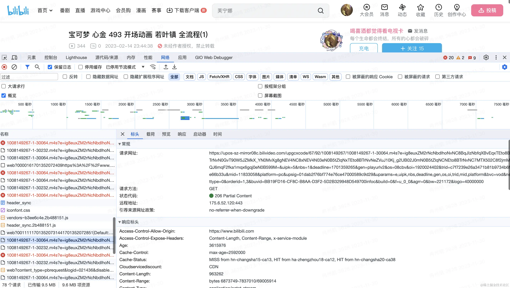

Opening the console, you can see that while the video is playing, it keeps requesting `m4s` video files.

After all, a whole video file tends to be quite large, so it's not feasible to wait for the entire file to be requested before starting playback. Splitting a large video file into many small segments and loading them while playing is a much better approach.


Each `m4s` file request is roughly a few dozen `kb` to a few hundred `kb`.


So why not just use `http`'s `range`, which lets you request part of a file's content with finer granularity by specifying a byte range? In the `header` of an `http` request, it looks something like this

```js
Range: bytes = 3171375 - 3203867;
```

We can inspect the request headers for this link `https://upos-sz-mirror08c.bilivideo.com/upgcxcode/67/92/1008149267/1008149267-1-30064.m4s` and find that Bilibili uses segmented loading combined with the `range` approach.

### 2. iQiyi (iQiyi, Tudou, Youku)

I won't post a video link for iQiyi here, because clicking on any video forces you to watch an ad first.

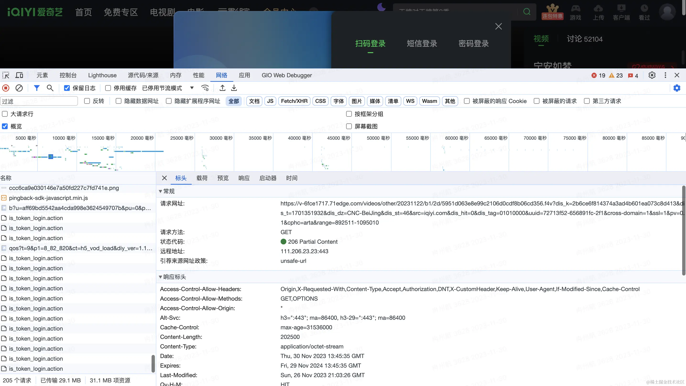

iQiyi's videos are primarily requested in the `f4v` format, also loaded in segments.

When playing a single video, multiple `f4v` files are requested.

`Range` is also used. But unlike Bilibili, where the `Range` attribute is in the request header of the `m4s` request, iQiyi's appears to be in the `querystring`, with the `range` parameter carried in the request `query`.

That's because no `range` parameter was found in this request's `header`. For example:

`https://v-6fce1712.71edge.com/videos/other/20231113/6b/bb/3f3fe83b89124248c3216156dfe2f4c3.f4v?dis_k=2ba39ee8c55c4d23781e3fb9f91fa7a46&dis_t=1701439831&dis_dz=CNC-BeiJing&dis_st=46&src=iqiyi.com&dis_hit=0&dis_tag=01010000&uuid=72713f52-6569e957-351&cross-domain=1&ssl=1&pv=0.1&cphc=arta&range=0-9000`

### 3. Douyin (TikTok China)

Douyin's approach is simple and blunt. The link visited is this:
https://m.ixigua.com/douyin/share/video/7206914252840370721?aweme_type=107&schema_type=1&utm_source=copy&utm_campaign=client_share&utm_medium=android&app=aweme

By looking at the console, we can see it directly requests a single video address

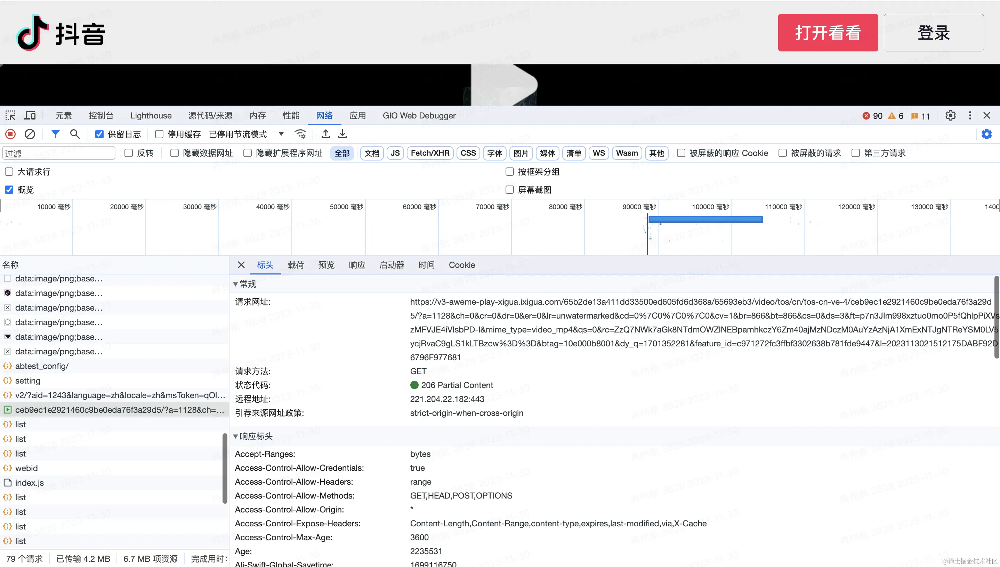

There's no segmentation, but the `range` request is used, so you can see the video buffering and playing at the same time.

However, I discovered during development that the cloud vendor I'm currently renting servers from implements this technology for us by default.

Because when I upload an `mp4` video to the cloud server and play it via a link, it buffers and plays at the same time.

We can take this video address and paste it directly into the browser, where it plays right away — making the behavior easier to observe.


But Bilibili and iQiyi can't do this, because the `m4s` and `f4v` formats they use aren't generic video formats — they need specialized software or tools to open and edit.

### 4. Xiaohongshu (RED)

Test example link: https://www.xiaohongshu.com/discovery/item/63b286d1000000001f00b495

Xiaohongshu's approach is even more straightforward. Open the console, and it plainly requests an `mp4` and just plays it — done.

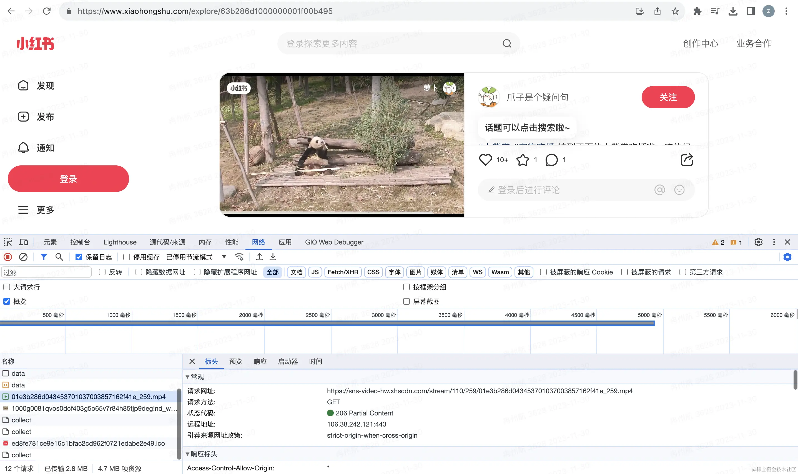

### 5. Summary

After reviewing the above solutions from major companies, we can see the basic principle is the same: load while playing, to reduce the cost of loading a large video file all at once. Also, through segmented transmission, they can dynamically control video bitrate (resolution) — loading segment files at different bitrates depending on network speed to achieve dynamic bitrate adaptation.

At the same time, the video formats used, such as `f4v` and `m4s`, are not directly playable media formats and require some processing. This raises the cost of pirating videos and adds a degree of security.

If there's no strict requirement, you can also just use `mp4` directly, or simply play a video file address with `video`.

## II: Common Video Formats and Protocols

We know `mp4` is a common video format. Above we also covered the `m4s` format used by Bilibili's player and the `f4v` format used by iQiyi.

- What other video formats are there besides these?
- Why are there so many video formats, and what are the differences between them?
- Why do these companies choose these particular formats for video playback?

### 1. `m4s` Used by Bilibili

The `M4S` format is not a generic video format — it requires specialized software or tools to open and edit.

`M4S` is typically used together with `MPEG-DASH` streaming technology, streaming a small portion of the video at a time. The player plays these segments in the order they're received. The first `M4S` segment contains some initialization data markers.

`MPEG-DASH` is an adaptive bitrate streaming technology that breaks content into a series of `M4S` segments at different bitrates, then automatically adjusts based on current network bandwidth. If you want to adopt `DASH` technology in `web` audio/video, check out
https://github.com/Dash-Industry-Forum/dash.js

### 2. `f4v` Used by iQiyi

`F4V` is a streaming format introduced by `Adobe`, a successor to the `FLV` format that supports `H.264` encoding. `F4V`-format video is not a generic video format, **but generally**, you can rename the file extension to `FLV`, allowing it to be viewed with any player that supports `FLV`.

Compared to the common `MP4` format, the `FLV` format has a simpler structure, so loading `metadata` (video metadata, such as duration, etc.) is faster. You can find the detailed structure here: https://en.wikipedia.org/wiki/Flash_Video#Flash_Video_Structure

For example, here's the standard header of an `FLV` file, defining what each range of bits means. Once we understand this, we can use `MediaSource` to read and transcode it.

| Field       | Data Type     | Default | Details                                                 |
| ----------- | ------------- | ------- | ------------------------------------------------------- |
| Signature   | byte[3]       | "FLV"   | Always "FLV"                                            |
| Version     | uint8         | 1       | Only 0x01 is valid                                      |
| Flags       | uint8 bitmask | 0x05    | 0x04 is audio, 0x01 is video (so 0x05 is audio + video) |
| Header Size | uint32_be     | 9       | Used to skip newer extension headers                    |

The `MP4` format is a bit more complex; the specific standard is defined in [ISO/IEC 14496-12](https://www.iso.org/standard/83102.html), which runs to over two hundred pages, so it won't fit here — if you're interested, feel free to look it up yourself.

That said, this doesn't mean `MP4` is inferior — it's a general-purpose foundational standard, so its definitions leave a lot of room for various cases, and even allow for custom extensions within the standard. `FLV`, on the other hand, is more fixed, but its advantage is also its simplicity.

For `FLV` video playback, we can use: https://github.com/bilibili/flv.js `flvjs`'s main job is to use `MediaSource` to transcode `flv` into `mp4` for the browser to play.

Below are a few other video formats, briefly introduced:

### 3. `AVI`

Filenames end in `.avi`. `AVI` was originally developed by `Microsoft` in `1992` and was the standard video format for `Windows`. `AVI` files use less compression to store data, and they take up more space than many other video formats, leading to very large file sizes — roughly `2-3 GB` per minute of video.

Lossless files don't degrade in quality over time, no matter how many times you open or save them. This also allows playback without any codec. Reference: [Audio Video Interleave](https://en.wikipedia.org/wiki/Audio_Video_Interleave)

### 4. `MPEG`

Filenames end in ".mpg" or ".mpeg". MPEG is a working group alliance jointly established by ISO and IEC, aimed at developing media encoding standards, including compression encoding for audio, video, graphics, and genomic data, as well as transport and file formats for various applications. The MPEG format is used across a wide range of multimedia systems. The most widely known legacy MPEG media formats typically use MPEG-1, MPEG-2, and MPEG-4 AVC media encoding, along with MPEG-2 systems transport streams and program streams. Newer systems generally use the MPEG base media file format and dynamic streaming (aka .MPEG-DASH). Reference: [Moving Picture Experts Group](https://en.wikipedia.org/wiki/Moving_Picture_Experts_Group)

### 5. `MP4`

MPEG-4 files with audio and video typically use the standard .mp4 extension. Audio-only MPEG-4 files typically have a .m4a extension, and raw MPEG-4 visual bitstreams are named .m4v. Apple's iPhone uses MPEG-4 audio for its ringtones, but with a .m4r extension instead of .m4a. Reference: [MPEG-4 Part 14](https://en.wikipedia.org/wiki/MP4_file_format)

### 6. `QuickTime`

Filenames end in ".mov". QuickTime is able to contain abstract data references to media data and separates media data from media offsets and track edit lists, which means QuickTime is particularly well-suited for editing, since it can import and edit in place (without copying data). Because both QuickTime and MP4 container formats can use the same MPEG-4 format, in a QuickTime-only environment they are largely interchangeable. As an international standard, MP4 enjoys broader support. Reference: [QuickTime File Format](https://en.wikipedia.org/wiki/QuickTime_File_Format)

### 7. `TS`

TS is short for MPEG2-TS, an audio/video container format. TS stream file extensions are typically .ts, .mpg, or .mpeg, and most players support this format for playback directly. The TS format is mainly used for live-streaming bitstream structures and has good fault tolerance.

## III: Browser Compatibility with Various Video Formats

Now that we've covered common video formats and their use cases, we also need to look at current browser support for each video format before deciding on a technical approach.

### 1. Chrome

The supported video formats, per the official documentation, are mainly the following

- MP4 (QuickTime/ MOV / ISO-BMFF / CMAF)
- Ogg
- WebM
- WAV
- HLS [Only on Android and only single-origin manifests]

Official documentation: https://www.chromium.org/audio-video/

### 2. Safari

Supported video formats include:

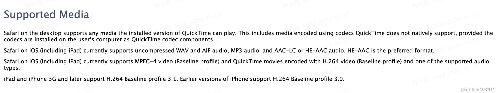

Official documentation: https://developer.apple.com/library/archive/documentation/AudioVideo/Conceptual/Using_HTML5_Audio_Video/Device-SpecificConsiderations/Device-SpecificConsiderations.html

### 3. Firefox

Supported video formats:

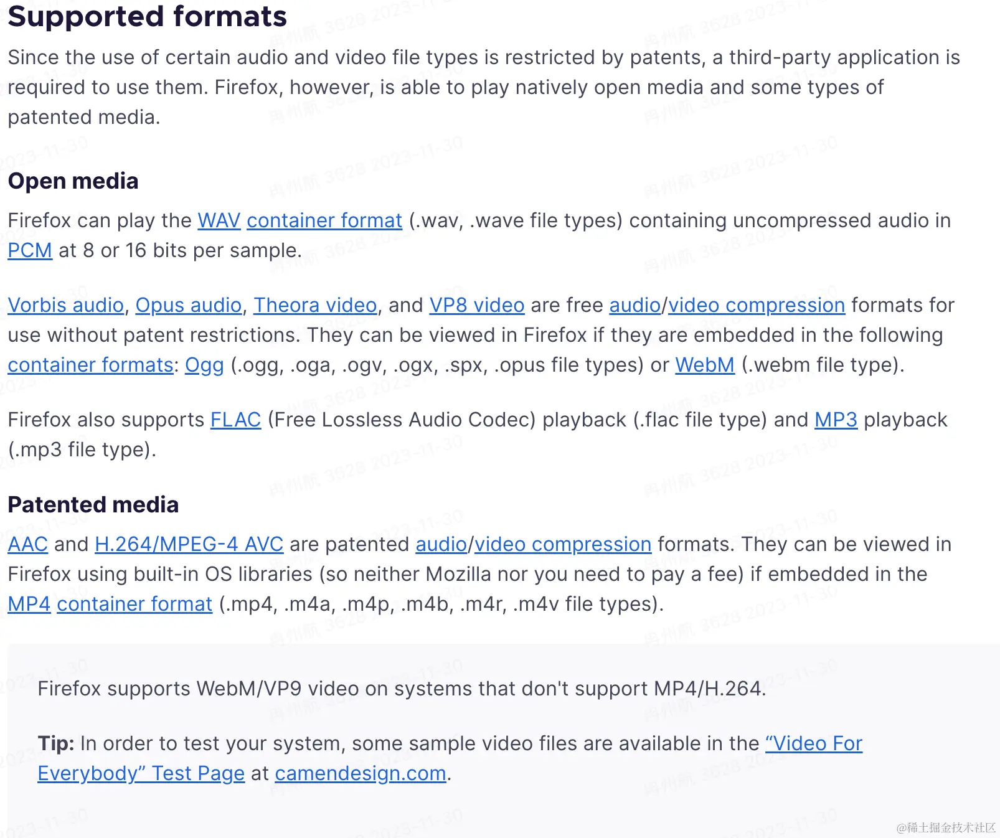

Official documentation: https://support.mozilla.org/en-US/kb/html5-audio-and-video-firefox

## IV: An Introduction to MediaSource, Video Encoding, Decoding, and Muxing

Above we introduced some video formats and current browser compatibility issues. From this we can see that playing audio/video on the `web` still has significant limitations. To work around these limitations, we use `MediaSource`.

A video is essentially countless overlaid images. If a video runs at `60` frames per second, roughly `60` images need to be played every second. This means a video that's just a few minutes long ends up being very large. Take the lossless `avi` format mentioned above, for instance — roughly `2-3 GB` per minute of video. This is where video needs to be `encoded`, which is really just compression.

Encoding is split into video encoding and audio encoding. Common video codecs include:

- **MPEG family**: `MPEG-1` Part 2, `MPEG-2` Part 2 (equivalent to `H.262`), `MPEG-4` Part 2, `MPEG-4` Part 10 (equivalent to `H.264`, sometimes also called "`MPEG-4` `AVC`" or "`H.264/AVC`").
- **H.26x family**: `H.261`, `H.262`, `H.263`, `H.264` (equivalent to `MPEG-4` Part 10), `H.265/HEVC` (jointly developed by `ITU-T` and `ISO/IEC`).
- **Other video codecs**: the `WMV` family, the `RV` family, `VC-1`, `DivX`, `XviD`, `X264`, `X265`, `VP8`, `VP9`, `Sorenson Video`, `AVS`.

Common audio codecs include: `AAC`, `MP3`, `AC-3`, etc.

After encoding, the audio and video streams still need to be combined into a single file — this is `muxing` (container packaging).

Correspondingly, playing a video requires demuxing, decoding, and feeding audio and video in sync to the sound card and graphics card for playback.

`MediaSource` is what handles this work: it reads the video stream and converts it into a format the browser can play.

Below is a snippet from `flv.js`'s `parseChunks` function. It reads the `buffer` byte by byte, parses it according to the spec, then transcodes it.

```js
if (byteStart === 0) {
  // buffer with FLV header
  if (chunk.byteLength > 13) {
    let probeData = FLVDemuxer.probe(chunk);
    offset = probeData.dataOffset;
  } else {
    return 0;
  }
}

if (this._firstParse) {
  // handle PreviousTagSize0 before Tag1
  this._firstParse = false;
  if (byteStart + offset !== this._dataOffset) {
    Log.w(this.TAG, 'First time parsing but chunk byteStart invalid!');
  }

  let v = new DataView(chunk, offset);
  let prevTagSize0 = v.getUint32(0, !le);
  if (prevTagSize0 !== 0) {
    Log.w(this.TAG, 'PrevTagSize0 !== 0 !!!');
  }
  offset += 4;
}
```

### 1. MediaSource Compatibility

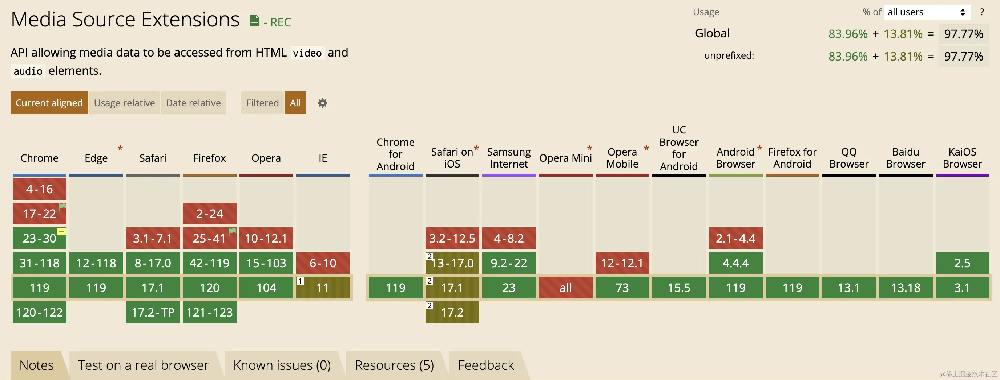

As you can see, it's mostly green, but there's one special case: `Safari on iOS`, which is still in the brownish/partial-support zone.

## V: HLS Playback Solution

There are several reasons for adopting the `HLS` technical approach:

1. Compatibility

Above we covered various video formats as well as browser compatibility.

The `HLS` protocol is implemented by `Apple`, and across `Apple`'s full product line — including `iPhone`, `iPad`, `Safari`, and more — `HLS` playback is natively supported.

For other browsers, `MediaSource` can be used to demux, decode, and transcode for playback.

This also resolves `MediaSource`'s compatibility issues.

2. Business requirements

There's currently a strong need for video encryption — for example, requiring users to pay before watching certain videos. The `HLS` protocol comes with standard encryption built in, and it also supports extending it with private encryption schemes.

3. The `HLS` protocol natively supports segmented transmission and dynamic bitrate-adaptive playback.
4. ~~There's an existing technical solution: Hls.js~~

## VI: Back-End Development

Having chosen the `HLS` protocol for playback, the first step is video processing, which is currently handled on the server side, leveraging `ffmpeg`'s capabilities.

~~It would be great if `ffmpeg` could someday run in the browser without performance issues. There are `webassembly`-based `npm` packages for this now, but they have some performance problems~~

### 1. Video Transcoding

The `ffmpeg` command for video transcoding is as follows:

```sh
ffmpeg -i input.mp4 -hls_time 10 -hls_list_size 0 -c:v h264 -b:v 2M -hls_segment_filename output_%05d.ts output.m3u8 -y
```

Explanation of each parameter:

- `-i` specifies the input video
- `-hls_time` specifies the segment duration, in seconds
- `-hls_list_size` specifies the number of entries in the `hls` list; here it's unlimited
- `-c:v` specifies the video codec
- `-b:v` specifies the video bitrate; here it's `2M` bits per second
- `-hls_segment_filename` specifies the output `ts` filename pattern; here it means `output_` plus a five-digit number
- `output.m3u8` specifies the output `m3u8` filename
- `-y` in some scenarios (e.g. whether to overwrite), just answer yes directly to avoid the program hanging

To automate this, we use Node's `spawn` module to create a child process and run the `ffmpeg` command inside it.

```ts
const exec = ({ params, data }: ExecOption): Promise<ExecResult> => {
  return new Promise((r, j) => {
    const cp = spawn('ffmpeg', params);
    cp.stderr.pipe(process.stdout);
    cp.on('error', (err) => {
      j(err);
    });
    cp.on('close', (code) => {
      r({ code, data });
    });
    cp.on('exit', (code) => {
      r({ code, data });
    });
  });
};
```

At this point, the video gets output at the specified location, generating one `m3u8` and multiple `ts` files

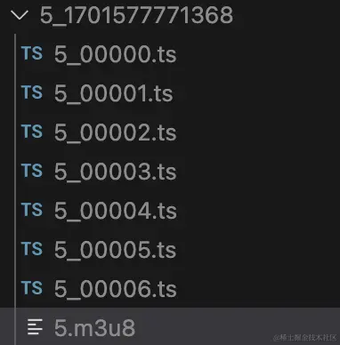

`ts` files are the video content, while `m3u8` acts more like an index file describing the `ts` files — for example, at what time to play which `ts` file. The main content looks like this:

```
#EXTM3U
#EXT-X-VERSION:3
#EXT-X-TARGETDURATION:10
#EXT-X-MEDIA-SEQUENCE:0
#EXTINF:10.380622,
5_00000.ts
#EXTINF:10.380622,
5_00001.ts
#EXTINF:10.380622,
5_00002.ts
#EXTINF:10.380622,
5_00003.ts
#EXTINF:6.560556,
5_00004.ts
#EXTINF:1.619378,
5_00005.ts
#EXTINF:5.024189,
5_00006.ts
#EXT-X-ENDLIST

```

### 2. Standard Video Encryption

`HLS`'s standard encryption uses the `AES` symmetric encryption scheme. Let's start by implementing the most standard version of encryption:

First, generate an encryption key using Node's native `crypto` module:

```ts
import crypto from 'node:crypto';
// Generate the encryption key
const key = crypto.createHash('sha256').update(crypto.randomBytes(32)).digest('base64');
const filePathKey = path.join(__dirname, `../../public/uploads/hls/${dir}/${fileName}.key`);

const content = `${ctx.origin}/uploads/hls/${dir}/${fileName}.key\n${filePathKey}\n`;
// The key file
const fileKey = await writeFile(path.join(__dirname, `../../public/uploads/hls/${dir}/${fileName}.key`), key);
const keyInfoPath = path.join(__dirname, `../../public/uploads/hls/${dir}/${fileName}_key.bin`);
// The key.info that ffmpeg needs
const keyInfo = await writeFile(keyInfoPath, content);
```

Then run the `ffmpeg` command, again wrapped as an interface using Node's `spawn` module:

```sh
ffmpeg -i input.mp4 -hls_time 10 -hls_list_size 0 -c:v h264 -b:v 2M -hls_key_info_file keyInfoPath -hls_segment_filename output_%05d.ts output.m3u8 -y
```

This simply adds a `hls_key_info_file` parameter, pointing to the encryption key's location. At this point, the generated `m3u8` file changes, gaining an extra line:

```
#EXTM3U
#EXT-X-VERSION:3
#EXT-X-TARGETDURATION:10
#EXT-X-MEDIA-SEQUENCE:0
#EXT-X-KEY:METHOD=AES-128,URI="http://localhost:30103/uploads/hls/5_1701577743851/5.key",IV=0x00000000000000000000000000000000
#EXTINF:10.380622,
5_00000.ts
#EXTINF:10.380622,
5_00001.ts
#EXTINF:10.380622,
5_00002.ts
#EXTINF:10.380622,
5_00003.ts
#EXTINF:6.560556,
5_00004.ts
#EXTINF:1.619378,
5_00005.ts
#EXTINF:5.024189,
5_00006.ts
#EXT-X-ENDLIST

```

Namely this extra line:

```
#EXT-X-KEY:METHOD=AES-128,URI="http://localhost:30103/uploads/hls/5_1701577743851/5.key",IV=0x00000000000000000000000000000000
```

- The `METHOD` field indicates the encryption method — here it's `AES`
- `URI` indicates the key's location — here it's `http://localhost:30103/uploads/hls/5_1701577743851/5.key`
- `IV` is the offset used for encryption/decryption — currently 0

With this encryption approach, the video is indeed encrypted, but the key's address is written right into the `m3u8` file. It's the equivalent of locking a room, then taping a note with the password right on the lock.

### 3. A Better Security Approach

- Wherever there's encryption, there must be decryption

First, we know that for a video to be played on the `web`, it must inevitably be decrypted before playback, no matter what.

- The key definitely cannot be placed on the `web` side
- The `web` side needs to know how to obtain the key
- The key should be single-use and expire after use, with a new key generated every time a video is encrypted

Currently there are two main approaches for better security:

1. Harden the endpoint that requests the key:

- Validate `cookie`s — since it's a request, the same domain automatically carries `cookie`s, so only users who have already purchased access can obtain the key. (We certainly can't let paying users be unable to watch either)
- When generating the key link, attach a `ticket` that expires quickly, to control its time window
- Carry `auth` in the request header for user verification — this is how, for example, a `jwt` scheme works

1. Use a private encryption scheme — for instance, the `METHOD` field in the `m3u8` might no longer be `AES` symmetric encryption. Define your own custom encryption rules, which greatly improves security, but at the cost of no longer conforming to the `HLS` protocol standard. However, most browsers support `MediaSource`, which can read file contents and perform custom encryption/decryption. Based on the compatibility research above, `MediaSource` has compatibility issues on `iOS`, so this approach will also run into compatibility issues on `iOS`.

### 4. Adaptive Bitrate Playback

Let's first cover the relationship between bitrate and resolution:

Bitrate refers to:

> Bitrate (also called bit rate) refers to the data throughput a video file uses per unit of time. It reflects the degree of data compression in the video file — the higher the bitrate, the smaller the compression ratio, and the higher the picture quality, but also the larger the file size. In simple terms, bitrate can be thought of as a sampling rate, and it's the single most important factor in picture-quality control during video encoding. The formula is: file size = time × bitrate / 8.

So simply put, the higher the bitrate, the better the resolution/clarity — they're directly proportional.

You need to define this based on video quality and the business scenario. Here's Alibaba Cloud's definition of bitrate versus resolution, for reference:

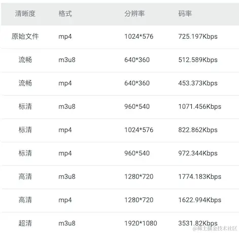

To implement adaptive bitrate playback, we need to merge `m3u8` files at different bitrates into a single multi-bitrate `m3u8`.

I couldn't find a suitable `ffmpeg` command for this, but there's always a way — the most universal method is to look at the multi-bitrate `m3u8` format standard within the `HLS` protocol and write one ourselves.

Here we use `node` to write such an index file, with content like this:

```
#EXTM3U
#EXT-X-STREAM-INF:PROGRAM-ID=1,BANDWIDTH=1000000,CODECS="mp4a.40.2,avc1.64001f",RESOLUTION=1280x720,NAME="720"
hls/5_1701577771368/5.m3u8
#EXT-X-STREAM-INF:PROGRAM-ID=2,BANDWIDTH=50000,CODECS="mp4a.40.5,avc1.42000d",RESOLUTION=320x184,NAME="320"
hls/5_1701577744714/5.m3u8
```

- `#EXT-X-STREAM-INF`: description of the streaming media
- `PROGRAM-ID`: represents a unique `ID`
- `BANDWIDTH`: the streaming media's bandwidth, i.e. the amount of data transferred per second. Here bandwidth is `50000`, meaning roughly `50kbps` transferred per second
- `CODECS`: the codecs used by the streaming media. Here it uses `mp4a.40.5` (`AAC` audio codec) and `avc1.42000d` (`AVC` video codec)
- `RESOLUTION`: this field indicates the video's resolution, i.e. width and height. In this example, the video resolution is `320x184`
- `NAME`: this field gives the stream a name — in this example the name is "`320`". I tend to put the resolution label in the `NAME` field for convenient access by the `web` side

Implement an interface that takes the above parameters, dynamically concatenates the string, and writes it to a file

```ts
async generateMasterPlayList(ctx: Context): Promise<void> {
    try {
      const { paths, filename = Date.now() } = ctx.request.body;
      let content = `#EXTM3U\n`;
      paths.forEach((item: MasterPlayListOption, index: number) => {
        const { id = index, bandWidth, codecs, resolution, name, url } = item;
        content += `#EXT-X-STREAM-INF:PROGRAM-ID=${id},BANDWIDTH=${bandWidth},CODECS="${codecs}",RESOLUTION=${resolution},NAME="${name}"\n${url}\n`;
      });
      const dir = path.join(__dirname, `../../public/uploads/hls/`);
      if (!existsSync(dir)) {
        await createDir(dir);
      }
      const filePath = dir + (filename.toString().endsWith('.m3u8') ? filename : `${filename}.m3u8`)
      const { success, error } = await writeFile(filePath, content);
      const basename = path.basename(filePath);
      return success
        ? ctx.successHandler({
            url: `${ctx.origin}/uploads/hls/${basename}`,
          })
        : ctx.failHandler(error);
    } catch (error) {
      ctx.errorHandler(error);
    }
  }
```

So how does `HLS` achieve adaptive bitrate?

It's actually based on the `BANDWIDTH` field, since we've set different `BANDWIDTH` values for different video variants. That means the player can dynamically switch between them based on the current network speed.

## VII: Web-Side Implementation

The work above was mainly about generating `HLS`-protocol video playback addresses. Next comes actually playing them on the `web` side.

### 1. Technology Selection

I started by looking at existing `npm` player packages, the more well-known ones being

- Douyin's `xigua player`: https://github.com/bytedance/xgplayer
- Alibaba Cloud's VOD solution: https://help.aliyun.com/zh/vod/developer-reference/overview-14
- Zhihu's `player`: https://github.com/zhihu/griffith

Zhihu's and Xigua's players are open source; Alibaba Cloud's VOD solution isn't open source, but does have an open-source `demo`.

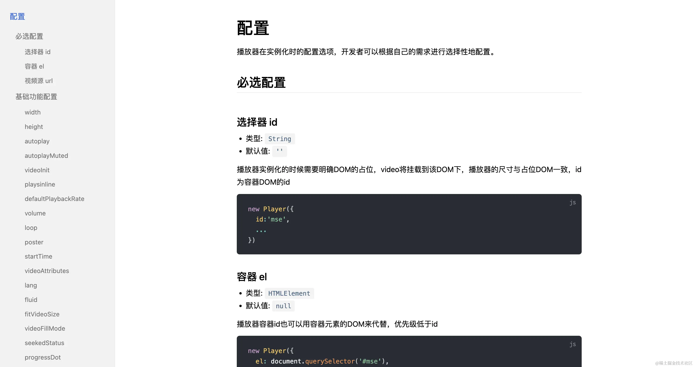

But they generally implement a rich feature set, and their configuration options keep growing.

If you're just doing a simple player initialization, that's fine. But typically in this kind of scenario, you'll want to customize the player to some degree — take Bilibili, for example.

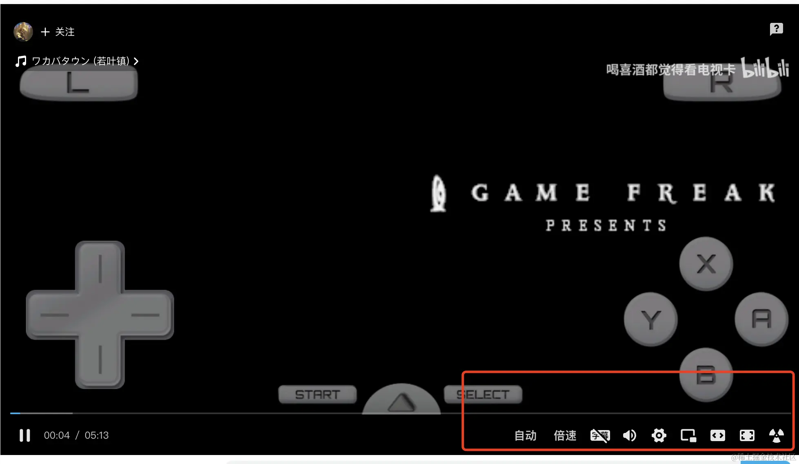

It has quite a few custom controls added. Even the progress bar is shaped like a little TV.

The same is true for us — we have our own theme colors, our own play button, and so on, plus some business-specific features that also need to go on the control bar.

The open-source solutions above all require time spent studying their configuration options, and they're all used in the `new Player(options)` style.

But it's generally better to keep the view as the view, and the logic as the logic.

~~Besides, implementing a player isn't actually that hard.~~

The ideal `player` should satisfy:

1. Configuration simple enough that you can tell how to use it just by looking at it
2. Easy to extend and override styles
3. Support for `hls` playback
4. Compatible with as many front-end frameworks as possible
5. Easy to integrate, delivering value quickly

### 2. Player Design

Since we have `react` projects, `vue` projects, and even some legacy `jquery` projects, to achieve "develop once, use anywhere," we adopted the `web components` approach.

I won't go into `web components` in detail here — you can read this article for more: [Hand-writing web components](https://juejin.cn/post/7170219296226803725) In short, it lets you define custom elements and use them just like a regular `div`.

For the player, the things we need to consider are:

1. `video` lifecycle: `loadedmeta`, `canplay`, `ended`, `error`, etc.
2. `video` state: playing, currently playing, paused, muted, etc.
3. `video` properties: total duration, current time, volume level, playback rate, etc.
4. `video` interactions: pause, play, chapter markers, resolution, playback rate, fullscreen, progress control, volume control, etc.

#### (1). The Video Lifecycle

For the video's lifecycle, we want to accomplish two things:

1. Know what lifecycle stage the current `video` is in
2. Be able to hook custom events at different lifecycle stages. For example, when the video fires `ended`, we need to jump to the next video during the `ended` phase

So, we need to listen to the `video`'s lifecycle:

```ts
listenEvent = () => {
  if (!this._video) return;
  this.clearListenerEvent();
  this._video.addEventListener('canplay', this.onCanplay);
  this._video.addEventListener('canplaythrough', this.onCanplaythrough);
  this._video.addEventListener('complete', this.onComplete);
  this._video.addEventListener('durationchange', this.onDurationchange);
  this._video.addEventListener('emptied', this.onEmptied);
  this._video.addEventListener('ended', this.onEnded);
  this._video.addEventListener('error', this.onError);
  this._video.addEventListener('loadeddata', this.onLoadeddata);
  this._video.addEventListener('loadedmetadata', this.onLoadedmetadata);
  this._video.addEventListener('loadstart', this.onLoadstart);
  this._video.addEventListener('pause', this.onPause);
  this._video.addEventListener('play', this.onPlay);
  this._video.addEventListener('playing', this.onPlaying);
  this._video.addEventListener('progress', this.onProgress);
  this._video.addEventListener('ratechange', this.onRatechange);
  this._video.addEventListener('seeked', this.onSeeked);
  this._video.addEventListener('seeking', this.onSeeking);
  this._video.addEventListener('stalled', this.onStalled);
  this._video.addEventListener('suspend', this.onSuspend);
  this._video.addEventListener('timeupdate', this.onTimeupdate);
  this._video.addEventListener('volumechange', this.onVolumechange);
  this._video.addEventListener('waiting', this.onWaiting);
};
```

To let developers know when each stage fires, we first define a custom event and dispatch it

```ts
const change = (name: string, value: unknown): void => {
  const currentTime = this.getCurrentTime();
  const duration = this.getTotalTime();
  this.dispatchEvent(
    new CustomEvent('change', {
      detail: {
        type: name,
        data: value,
        currentTime,
        duration,
        tag: this, // The whole player instance
      },
    }),
  );
};
const onCanplaythrough = (e: Event) => {
  this.ctx.currentState = e.type;
  this.change('canplaythrough', e);
};
```

This way, whenever a lifecycle event fires, `onchange` is triggered.
In usage, we can do:

```jsx
<r-player onChange={change} src="hls/example.m3u8" ></r-player>

const change = (e:CustomEvent) => {
    const { type, data, currentTime, duration, tag } = e.detail
    if(type === 'ended'){
        console.log('video ended')
    }
}
```

The possible values of `type` are:

| Name           | Description                                                                                                                                   |
| -------------- | --------------------------------------------------------------------------------------------------------------------------------------------- |
| canplay        | The browser can play the media file, but likely doesn't have enough data buffered to play through to the end without further buffering.       |
| canplaythrough | The browser estimates it can play the media through to the end without needing to stop for further buffering.                                 |
| complete       | OfflineAudioContext rendering has completed.                                                                                                  |
| durationchange | Fires when the value of the duration property changes.                                                                                        |
| emptied        | The media content becomes empty — for example, when the media has finished (or partially finished) loading and load() is called to reload it. |
| ended          | Playback has stopped because the end of the media has been reached.                                                                           |
| loadedmetadata | Metadata has finished loading.                                                                                                                |
| progress       | Fires periodically as the browser loads a resource.                                                                                           |
| ratechange     | The playback rate has changed.                                                                                                                |
| seeked         | A seek operation has completed.                                                                                                               |
| seeking        | A seek operation has begun.                                                                                                                   |
| stalled        | The user agent is trying to fetch media data, but the data unexpectedly hasn't arrived.                                                       |
| suspend        | Media data loading has been suspended.                                                                                                        |
| loadeddata     | The first frame of the media has finished loading.                                                                                            |
| timeupdate     | The time indicated by the currentTime property has changed.                                                                                   |
| volumechange   | The volume has changed.                                                                                                                       |
| waiting        | Playback has stopped due to a temporary lack of data.                                                                                         |
| play           | Playback has started.                                                                                                                         |
| playing        | Playback is ready to begin after having been paused or delayed due to a lack of data.                                                         |
| pause          | Playback has been paused.                                                                                                                     |
| volume         | The volume has changed.                                                                                                                       |
| fullscreen     | A fullscreen event has fired                                                                                                                  |

We need a way to hook into different lifecycle stages, so we need a publish/subscribe class.

```ts
type Callback = (...args: unknown[]) => unknown;

type EventName = string | symbol;

type EventItem = {
  name?: string | symbol;
  callback: Callback;
  initialCallback?: Callback;
};

const NEW_LISTENER = 'NEW_LISTENER';

export class SyncHook {
  private _events: Record<EventName, Array<EventItem>>;
  constructor() {
    this._events = {};
  }
  on = (eventName: EventName, eventItem: EventItem | Callback): void => {
    if (this._events[eventName] && eventName !== Symbol.for(NEW_LISTENER)) {
      this.emit(Symbol.for(NEW_LISTENER), eventName);
    }

    const callbacks = this._events[eventName] || [];
    if (typeof eventItem === 'function') {
      callbacks.push({
        name: eventName,
        callback: eventItem,
      });
    } else {
      callbacks.push(eventItem);
    }

    this._events[eventName] = callbacks;
  };

  emit = (eventName: EventName, ...args: Array<unknown>): void => {
    const callbacks = this._events[eventName] || [];
    callbacks.forEach((item) => {
      const { callback } = item;
      callback(...args);
    });
  };

  once = (eventName: EventName, eventItem: EventItem | Callback): void => {
    let one: EventItem;
    if (typeof eventItem === 'function') {
      one = {
        name: eventName,
        callback: (...args: Array<unknown>) => {
          eventItem(...args);
          this.off(eventName, one);
        },
        initialCallback: eventItem,
      };
    } else {
      const { callback } = eventItem;
      one = {
        name: eventName,
        callback: (...args: Array<unknown>) => {
          callback(...args);
          this.off(eventName, one);
        },
        initialCallback: callback,
      };
    }
    this.on(eventName, one);
  };

  off = (eventName: EventName, eventItem: EventItem | Callback): void => {
    const callbacks = this._events[eventName] || [];
    const newCallbacks = callbacks.filter((item) => {
      if (typeof eventItem === 'function') {
        return item.callback !== eventItem && item.initialCallback !== eventItem;
      } else {
        const { callback } = eventItem;
        return item.callback !== callback && item.initialCallback !== callback;
      }
    });
    this._events[eventName] = newCallbacks;
  };
}
```

So we add a `ctx` property to the `player` element, serving as a global context.

```ts
this.ctx = {
  currentTime: 0, // Current time
  duration: 0, // Total duration
  currentState: '', // Current video state
  action: new SyncHook(), // States fired at different stages
};
```

If we want to subscribe to the video's ended event, we can do so

Via a `Ref`:

```
<r-player ref={PlayerRef} onChange={change} src="hls/example.m3u8" ></r-player>

const endedEvent = () => {
    console.log('video ended')
}

PlayerRef.current.ctx.action.off('ended',endedEvent)

PlayerRef.current.ctx.action.on('ended',endedEvent)
```

Or via the instance obtained through the `change` method:

```jsx
<r-player onChange={change} src="hls/example.m3u8" ></r-player>

let player

const endedEvent = () => {
    console.log('video ended')
}

const change = (e:CustomEvent) => {
    const { type, data, currentTime, duration, tag } = e.detail
    player = tag
}

player.action.off('ended',endedEvent)
player.action.on('ended',endedEvent)
```

#### (2). Video State and Properties

We need to record the player's state and properties in the global context:

```ts
this.ctx = {
  currentTime: 0, // Current time
  duration: 0, // Total duration
  currentState: '', // Current video state
  action: new SyncHook(), // States fired at different stages
  volume: 0.5, // Current volume
  playbackRate: 1, // Current playback rate
  clarity: '', // Current resolution
  fullScreen: false, // Whether fullscreen
  levels: [], // List of available resolutions
  url: '', // Currently playing URL
  levelMap: new Map(), // Mapping between resolution and display name
};
```

#### (3). Customizing the Video

By default, it looks like this

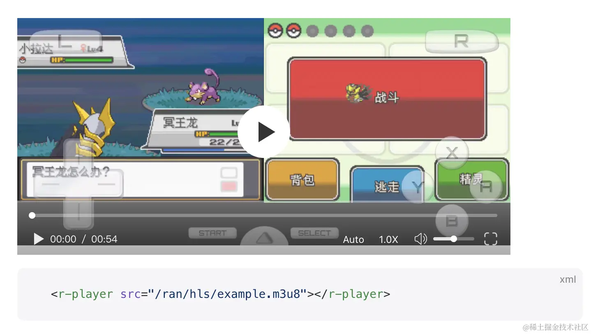

Demo: https://ran.chaxus.com/src/ranui/player/

Source code: https://github.com/chaxus/ran

If you don't like the controller or buttons, overriding the styles directly is more intuitive and requires no learning curve.

```css
.ran-player-controller {
  display: none;
}
```

Since the player itself is just an element, you can add arbitrary elements and logic inside it.

```jsx
<r-player onChange={change} src="hls/example.m3u8">
  <div>111111</div>
</r-player>
```

So this solves the problem of configuration options spanning several pages — you can tell how to configure and develop it just by looking at it.

## VIII: Summary

At this point, from both the front-end and back-end sides, we've implemented

1. Standard video encryption
2. Dynamic bitrate video playback
3. Segmented video loading
4. Draggable progress bar
5. Volume control
6. Manual resolution switching
7. Variable playback speed
8. Custom style overrides
9. Built with native technology, runs in any framework, unifying cross-framework scenarios, with consistent controls across browsers

Here are the `demo` and source code links:

`demo` and documentation: https://ran.chaxus.com/src/ranui/player/

Source code: https://github.com/chaxus/ran

The `demo` documentation has been internationalized and can be switched to Chinese
