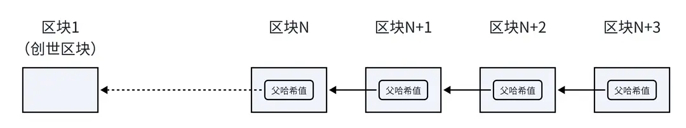
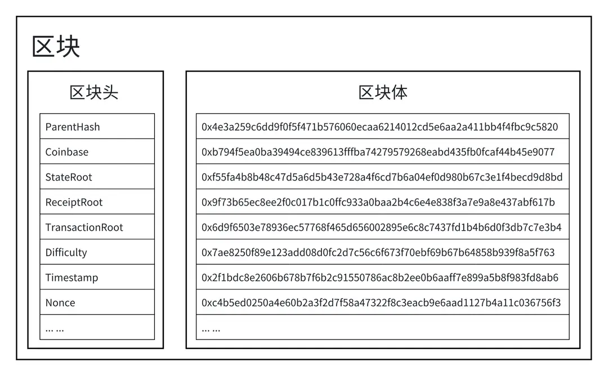
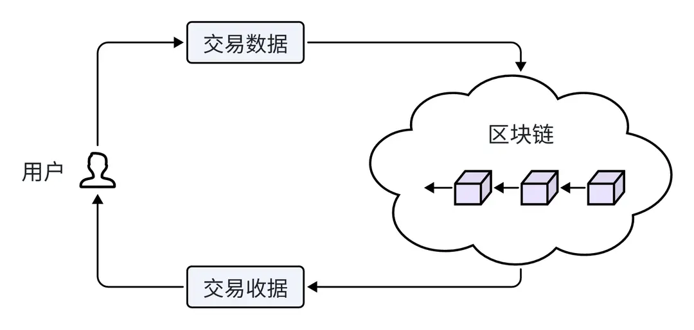
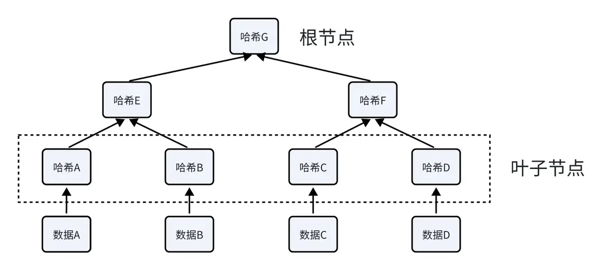
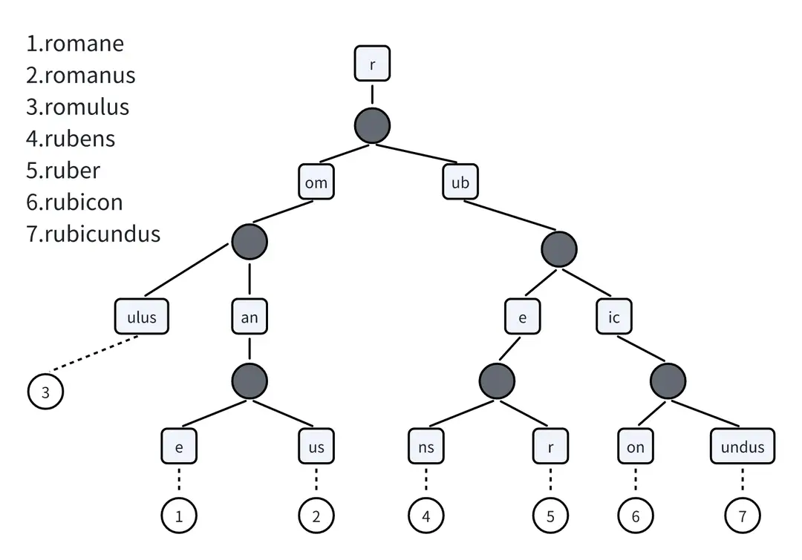
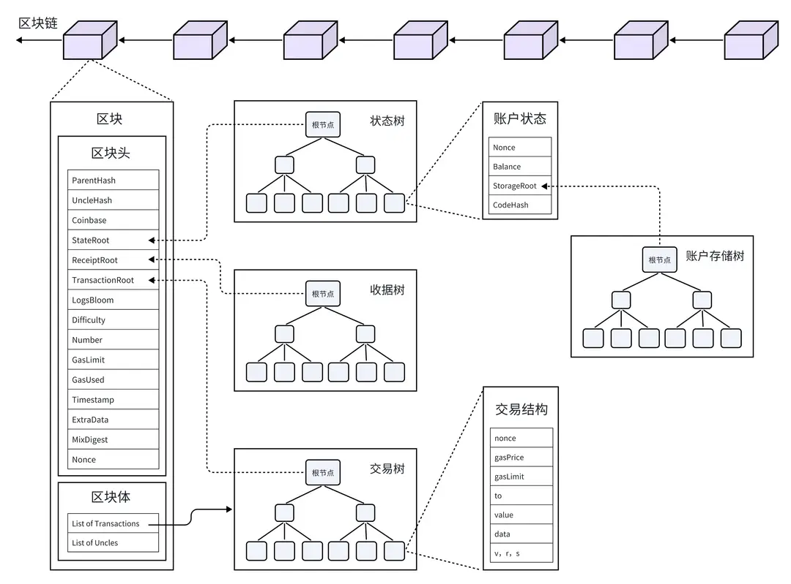

# Blockchain Data Structures

As the core infrastructure of the Web3 ecosystem, the blockchain functions as a distributed database that stores transaction data, smart contracts, user identity information, and various types of decentralized application (dApp) data on a global scale. The Ethereum blockchain can be broken down, from top to bottom, into three layers: blockchain, block, and transaction. The transaction data, receipt data, state data, and account data are each stored in one of four Merkle trees. If this is your first time encountering these concepts, don't worry — in this chapter we'll use Ethereum as an example and walk you through the blockchain's data structure layer by layer.

## Blockchain

A blockchain is a series of data blocks (i.e., "blocks") linked together in a specific way, forming a chain. Each block contains the hash value of the previous block, called the "parent hash" — a unique identifier for the content of the previous block. In this way, each block is connected to the one before it, forming a continuous chain from the first block (the genesis block) to the latest block — this is the "blockchain." Note: the first block has no parent hash.

## Block

Every block in the blockchain is made up of two parts: the block header and the block body.

① Block Header

The block header contains the basic information for a block, including:

● parentHash: records the hash value of the previous block.

● timestamp: records the exact time the block was created.

● nonce: used in the mining process for the Proof of Work (PoW) mechanism.

● difficulty: represents the mining difficulty.

● coinBase: identifies the miner's account address.

The block header also records three very important root hash values:

● stateRoot: the root hash of the blockchain's state tree, which records the state information of all accounts, such as balances and contract code.

● receiptRoot: the root hash of the receipt tree, which records the results of transaction execution, such as whether a transaction succeeded and the transaction fee.

● transactionRoot: the root hash of the transaction tree, which contains the information for all transactions in the block.

② Block Body

The block body stores all the transaction data for that block, i.e., a list of all transaction hashes.

## Transaction

In Ethereum, a transaction represents the act of sending assets or a message from one account to another. When a user initiates a transaction, the Ethereum client or wallet software constructs the transaction data. Transaction data mainly contains the following fields:

● nonce: the sender account's transaction counter, tracking the total number of transactions the account has made on this blockchain.

● gasPrice: the price the sender is willing to pay per unit of gas.

● gasLimit: the maximum amount of gas the sender allows for this transaction.

● to: the recipient's account address.

● value: the amount of ether to transfer.

● data: bytecode related to a smart contract.

● v, r, s: the transaction signature, generated from the sender's private key.

Once the transaction data has been constructed, the wallet signs the entire transaction using the user's private key and adds the signature result (v, r, s) to the transaction data. It then computes the hash of the entire transaction data (excluding the signature). The transaction hash is the unique identifier of the transaction data, ensuring the transaction's uniqueness and immutability.

For example, suppose Alice wants to send 1 ETH to Bob. Alice's account address is 0x123…ABC, and Bob's account address is 0x456…DEF. Alice's account has already made 5 transactions, so the nonce for her next transaction is 6. The current gas price is 20 Gwei, and she sets a gas limit of 21000 (the gas required for a standard Ethereum transfer). Alice isn't calling any contract, so the data field is empty.

● nonce: 6

● gasPrice: 20000000000 (20 Gwei)

● gasLimit: 21000

● to: 0x456…DEF

● value: 1000000000000000000 (1 ETH)

● data: 0x

● v, r, s: [signature data]

Alice's wallet packages and signs this transaction data, generates the transaction hash, and broadcasts the transaction to the Ethereum network. Miners will confirm the transaction and include it in a new block; once successful, 1 ETH is transferred from Alice's account to Bob's account.

## Transaction Receipt

In Ethereum, once a transaction is completed, a "transaction receipt" is generated. The transaction receipt records the basic information about the transaction's execution and serves as important proof that the transaction was included in the blockchain.

Each transaction receipt contains the following information:

● transactionHash: the transaction hash, used to uniquely identify a transaction.

● transactionIndex: the index position of the transaction within the block it belongs to.

● blockHash: the hash of the block containing this transaction.

● blockNumber: the number of the block containing this transaction.

● from: the address that initiated the transaction.

● to: the target address of the transaction.

● cumulativeGasUsed: the total gas used cumulatively in the current block up to this transaction.

● gasUsed: the amount of gas consumed by this transaction.

● contractAddress: the contract address if the transaction created a contract; otherwise null.

● logs: the event logs produced during the transaction.

● logsBloom: a bloom filter used for quickly searching transaction logs.

● status: the status code of the transaction's execution, indicating success or failure.

## Merkle Patricia Tree

Ethereum processes millions of transactions every day — so how is all this transaction data stored? It uses a data structure called a Merkle Patricia Tree (MPT), a special type of Merkle tree. Let's first look at the basic Merkle tree.

① A Merkle tree, also called a hash tree, is a tree whose leaf nodes are the hashes of data blocks, and whose non-leaf nodes are the hash of their child nodes' hashes concatenated together. This ensures data integrity. As shown in the figure, node values are computed as follows:

Hash A = Hash(Data A);

Hash B = Hash(Data B);

Hash E = Hash(Hash A + Hash B);

② A Patricia Trie, also known as a compressed prefix tree, is a tree that reduces lookup time by exploiting common string prefixes, while also saving space by compressing nodes without branches.

③ A Merkle Patricia Tree combines the advantages of a Merkle Tree and a Patricia Trie — it can verify data integrity while also enabling fast retrieval of state information, making it well suited for data storage in Ethereum. Each block has a separate Merkle Patricia Tree for storing transaction data, receipt data, state data, and account data.

## Summary

In this section, we've gained a basic understanding of the Ethereum blockchain's data structure, which can be summarized in the diagram below. It's a highly complex and elegant design — one that allows the entire system to securely record and verify transactions while preserving the network's decentralized nature.

> The Ethereum platform is evolving and being upgraded rapidly, so the data structure information in this article may no longer reflect the latest version. In addition, data structures differ across blockchains. We strongly recommend following the latest blockchain technology updates and treating the official documentation as the authoritative source.
