# How to Participate in Web3

As the next generation of the internet, Web3 offers people a decentralized network environment controlled by users themselves. Ordinary people can participate in Web3 by creating a digital wallet, buying and trading cryptocurrency, and taking part in the NFT market, among other ways. Below, we'll walk you step by step from scratch into the world of Web3.

> Note: Because the Web3 ecosystem is evolving rapidly, the corresponding platform interfaces may be updated and change frequently. If the screenshots in this article differ from the actual interface when you read it, please defer to the actual interface. Thank you for your understanding — we recommend following the platform's latest updates for the most accurate information and guidance.

## Create a Digital Wallet (Using MetaMask as an Example)

Step 1: Visit the official MetaMask website (metamask.io) and install the appropriate browser extension. This demo uses the Chrome browser.

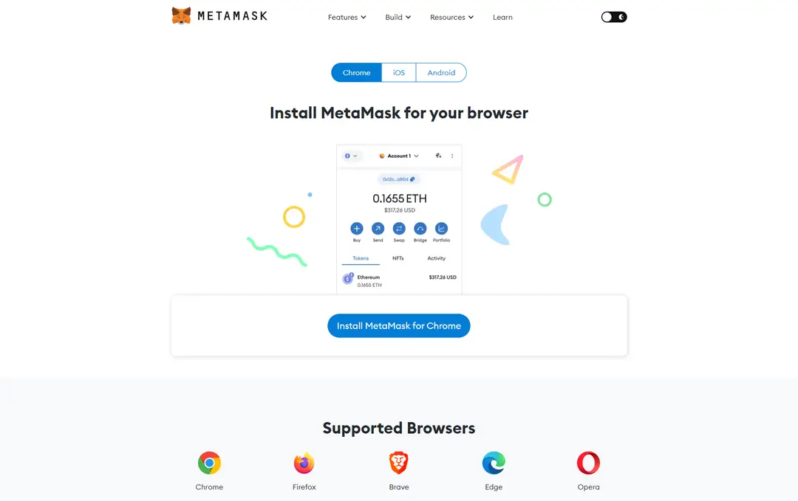

Step 2: After installing the MetaMask extension, click the browser extension icon to open MetaMask and select "Create a new wallet."

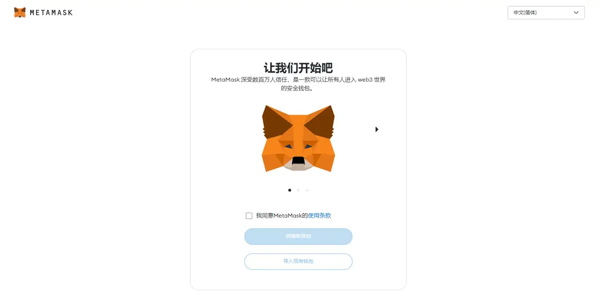

Step 3: Set a strong password. This acts as your MetaMask wallet login password, used to unlock the wallet on this device and protect your information.

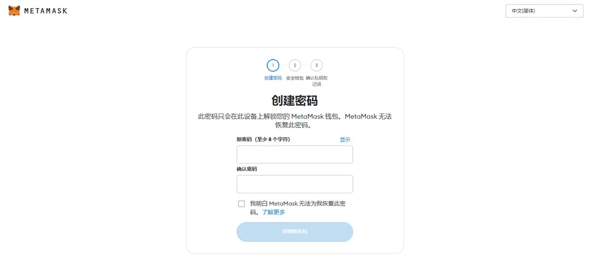

Step 4: Next, you'll see a short video introducing the account's private key / seed phrase. If you're new to Web3, it's a good idea to watch it. Then click "Secure my wallet."

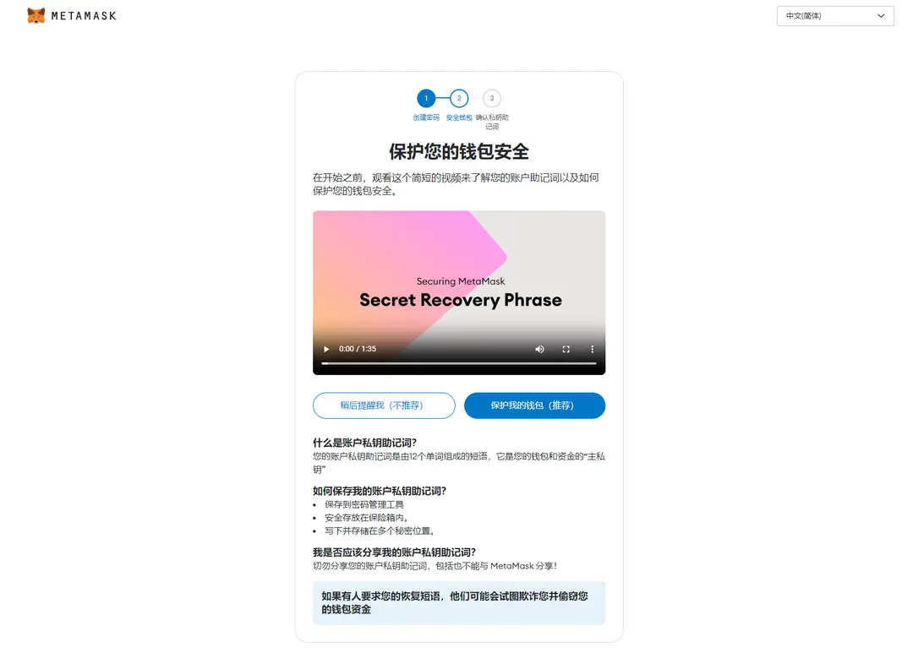

Step 5: At this point, make sure no one is looking at your screen and that no screen recording or screen-sharing software is running, so that only you will see the private key seed phrase about to be shown. Then click "Reveal Secret Recovery Phrase."

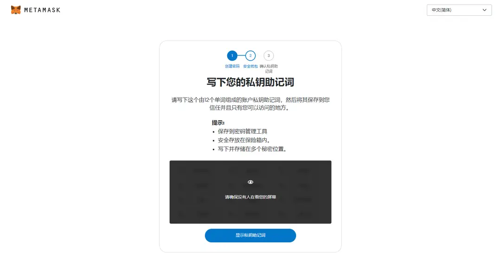

Step 6: You'll see a 12-word secret recovery phrase displayed on screen. We strongly recommend writing these 12 words down on paper and storing them somewhere only you know about. Do not photograph, copy, print, or save them in any electronic document, as doing so risks exposure. Make sure you've recorded the phrase before clicking "Next" — you won't be able to view it again afterward.

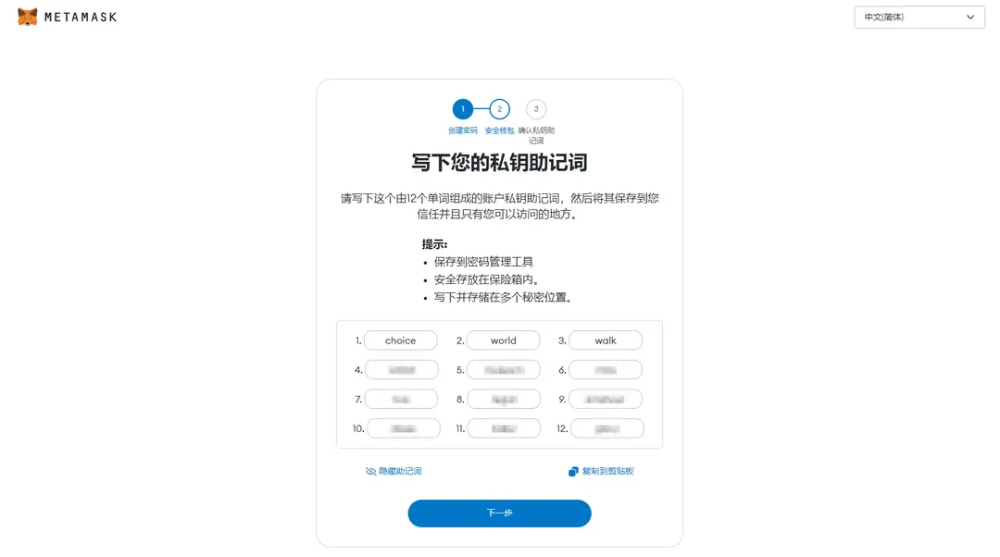

Step 7: Next, you'll be asked to confirm the secret recovery phrase you just recorded. Fill in the words in the prompt boxes, then click confirm.

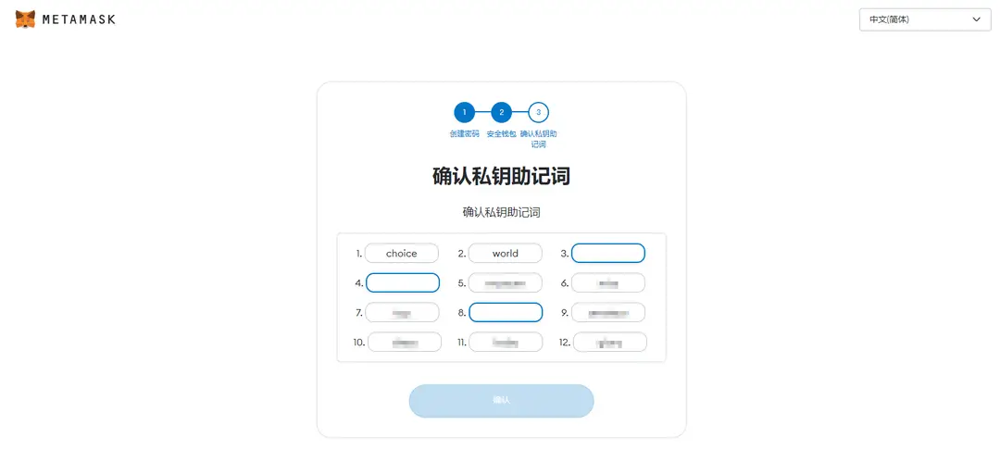

Step 8: Once you see the wallet creation success message, your digital wallet has been created.

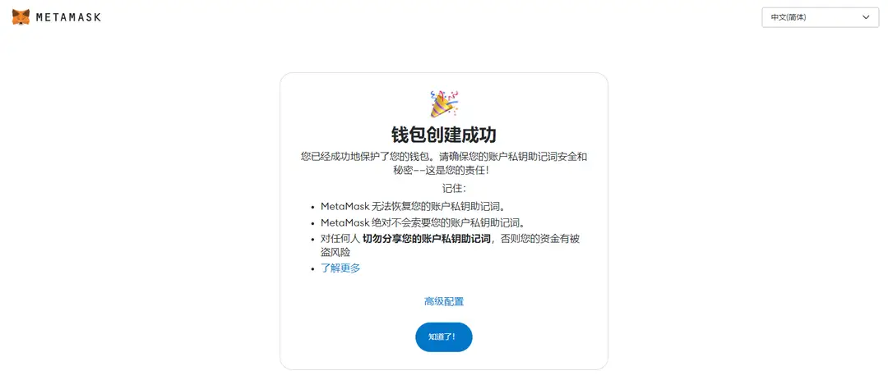

> Keep your secret recovery phrase safe and never share it with anyone. Anyone who obtains the phrase can gain full control over all assets in that wallet. Also, if your device is lost or damaged, don't worry — you can use the recovery phrase to restore the wallet on another device, and your assets will remain safe.

## How to Obtain Cryptocurrency

In the previous step, we created a digital wallet. A new wallet has no cryptocurrency in it, so it can't yet participate in Web3 ecosystem activities. Here are a few common ways to obtain cryptocurrency:

● Buy on a centralized exchange: On exchanges such as Binance and OKX, you can purchase cryptocurrency directly with fiat currency.

● Transfer from another wallet: You can transfer funds from one of your own other wallets into this new wallet, or have someone else send you a transfer.

● Participate in project airdrops: Some new projects distribute free tokens to users who participate in promotional activities.

● Obtain through mining: If you have the capability and resources, you can earn cryptocurrency as a reward through mining.

Once you've obtained cryptocurrency, you can view the currency name and balance on the specified network in your wallet. For example, the figure below shows a wallet on Binance Smart Chain (BSC) holding 0.0266 BNB and 1.59741 CAKE.

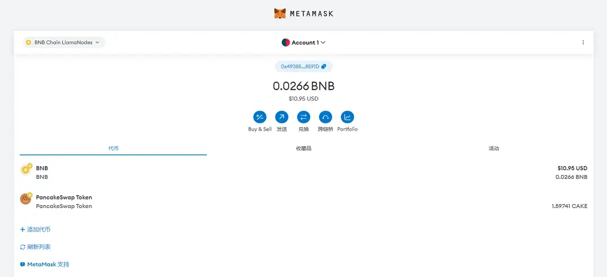

## How to Trade Cryptocurrency

The wallet above only holds BNB and CAKE. If you need USDT, you can trade on an exchange to convert BNB into USDT. Below, we'll use the decentralized exchange PancakeSwap as an example.

● Step 1: Visit the official PancakeSwap website and click the "Connect Wallet" button in the top-right corner. Select your wallet type and account address, then authorize the connection to PancakeSwap.

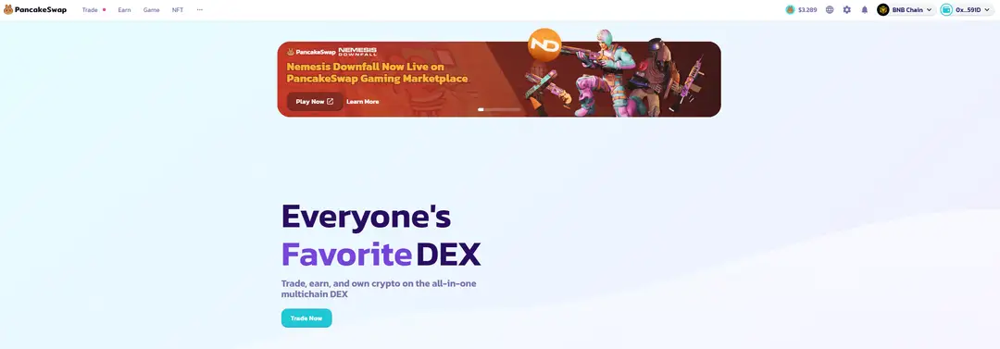

● Step 2: Under the "Trade" menu in the top-left corner of PancakeSwap, select the "Swap" option to open the swap interface. Here you need to select the currencies and amount for the trade — for example, to convert 0.001 BNB into USDT:

● Select the input currency as BNB (usually the default);

● Select the output currency as USDT;

● Enter the amount of BNB to swap as 0.001. The system will automatically display the amount of USDT you'll receive, the exchange rate, slippage, and fees, updating in real time.

If you're satisfied with the exchange rate, click the "Swap" button to initiate the transaction.

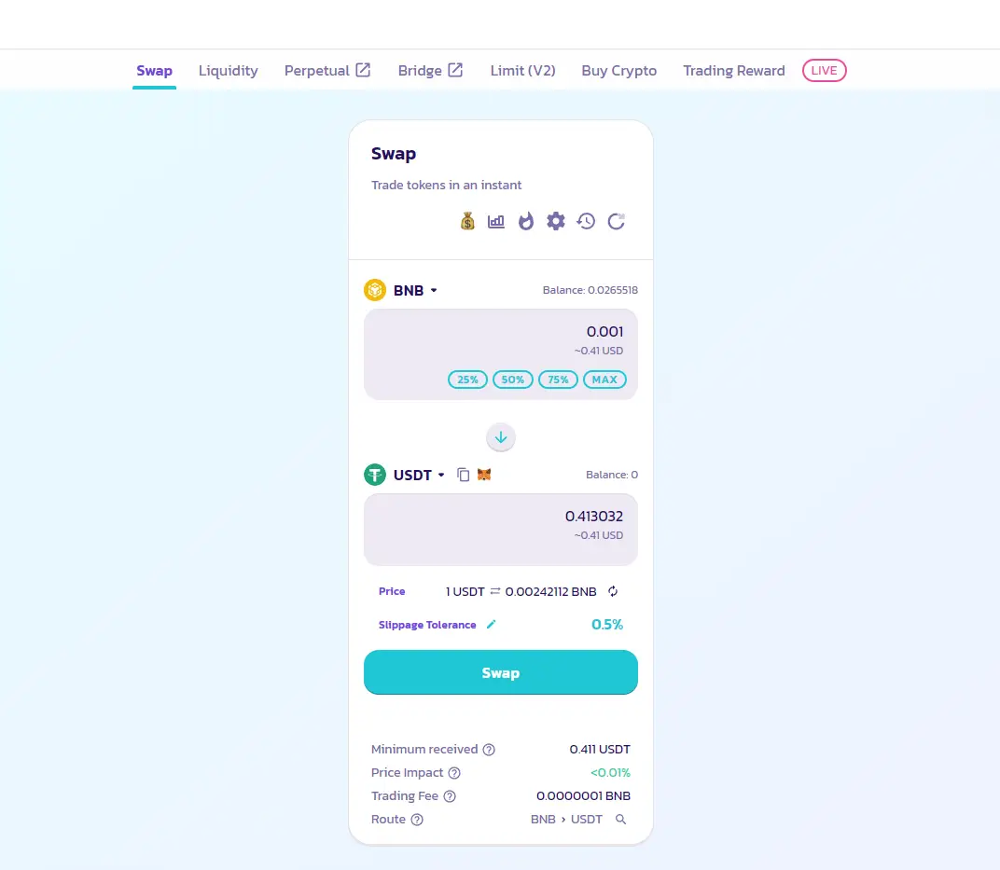

● Step 3: Because the exchange rate changes in real time, the platform will ask you to confirm the exchange rate once more. If everything looks good, click "Confirm Swap" to confirm the transaction.

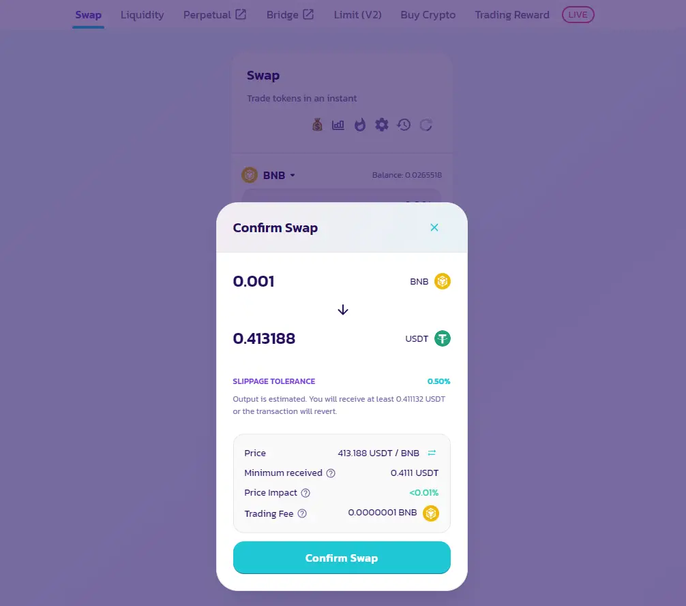

● Step 4: The MetaMask interface will pop up, showing the transaction account, amount, and gas fee. Once you've confirmed everything is correct, click "Confirm." Essentially, this step is you using the private key in your MetaMask wallet to sign and authorize the transaction. If you're not yet familiar with how signing works, don't worry — we'll cover it in detail in a later chapter.

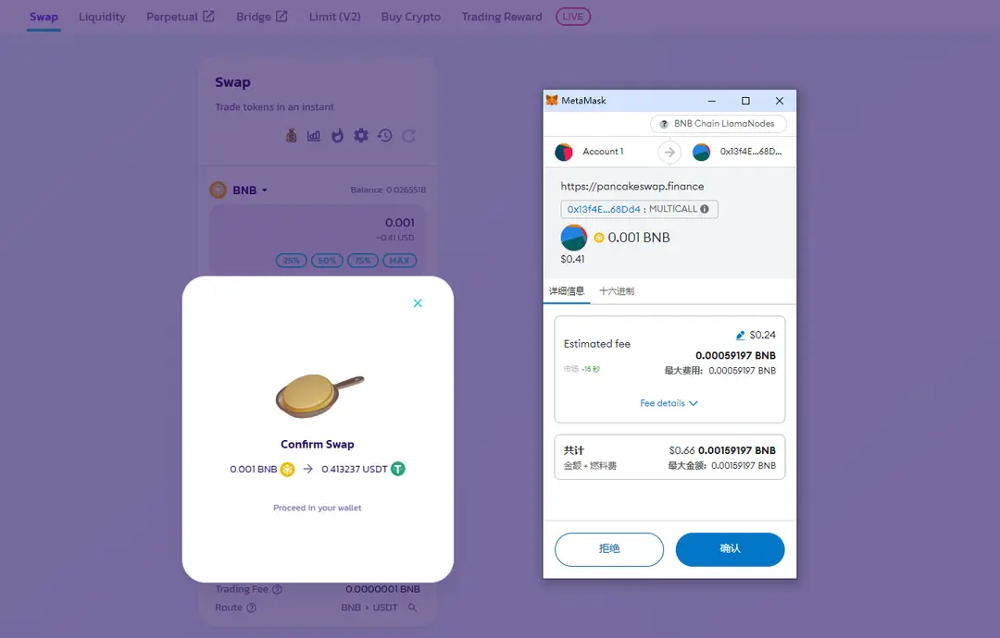

● Step 5: After the transaction is submitted, you'll need to wait for miners on the blockchain network to confirm it, which can take anywhere from a few seconds to a few minutes. Once miners have confirmed the transaction, you'll see a transaction receipt prompt like the one below.

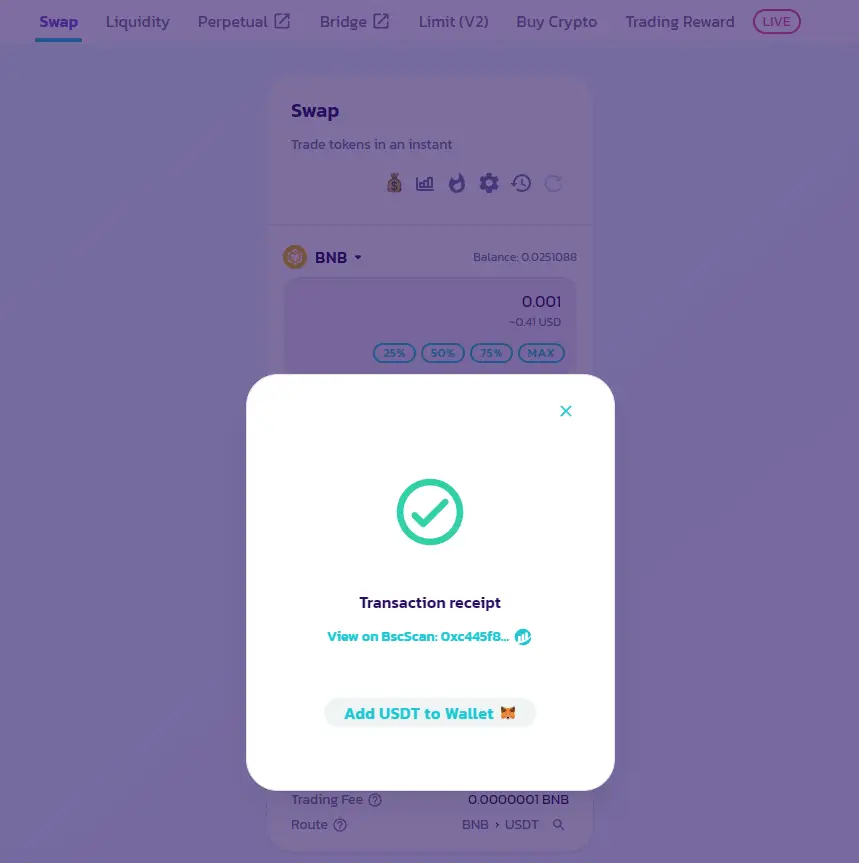

● Step 6: Click the link above to open the block explorer, where you can view the details of this transaction.

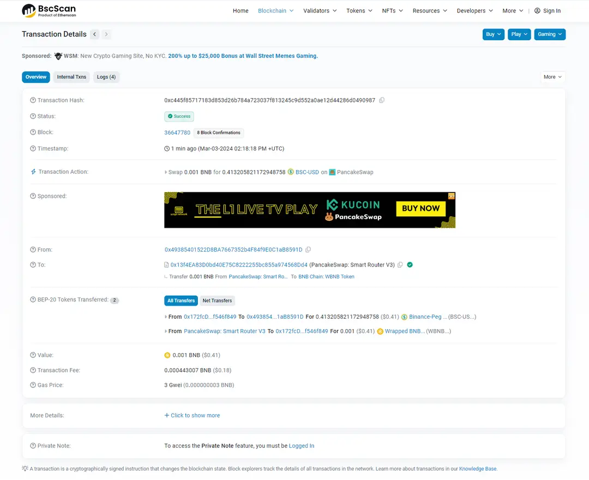

● Step 7: Open your MetaMask wallet again, and you'll find the newly swapped USDT now in your wallet.

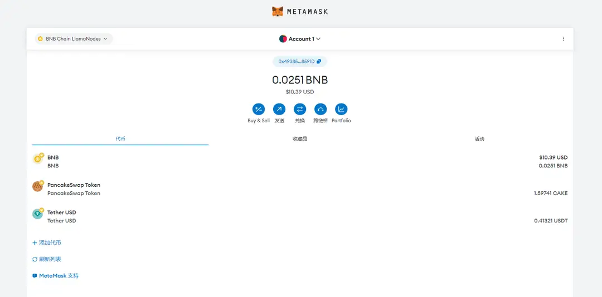

## How to Buy an NFT

Element Market is a decentralized NFT trading platform that lets users browse and trade a wide variety of digital artwork. Here's how to buy an NFT on Element Market:

● Step 1: Open your browser and visit Element Market's official website (https://element.market/). Select the network type in the top-right corner of the site, click the connect wallet button, then follow the prompts to connect your wallet.

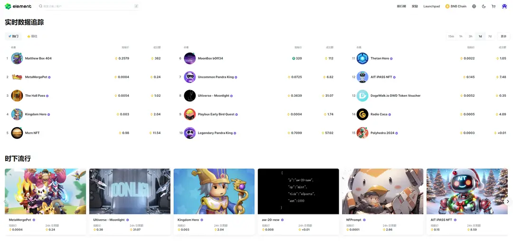

● Step 2: Find the NFT you want to buy and click it to open its detail page. For example, the NFT below, named "Polyhedra 2024," lets you view detailed information such as the current price, transaction history, and owner. Click the "Buy Now" button to start the transaction.

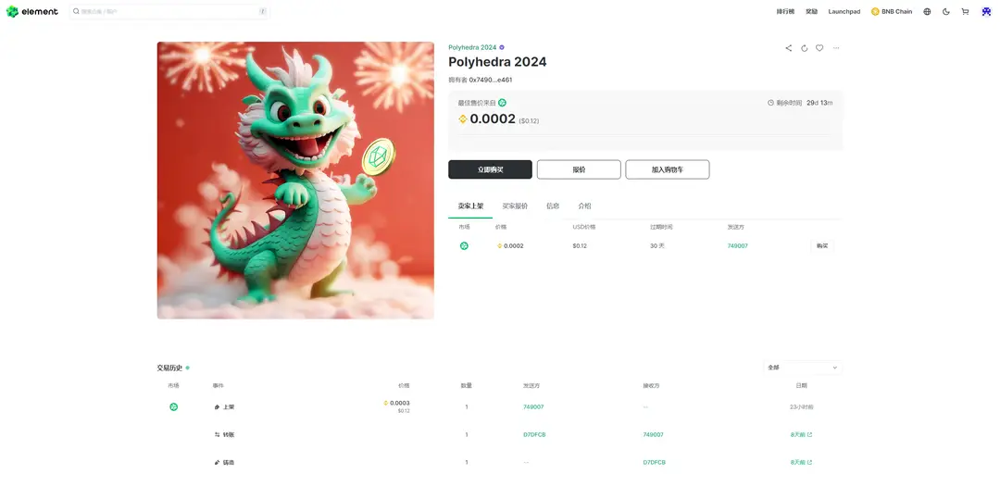

● Step 3: As with the cryptocurrency trade described earlier, the MetaMask interface will pop up, showing the transaction account, amount, and gas fee. Once you've confirmed everything is correct, click "Confirm."

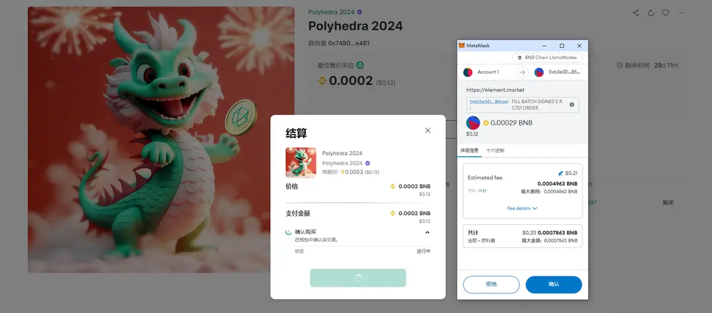

● Step 4: After the transaction is submitted, you'll need to wait for miners on the blockchain network to confirm it, which can take anywhere from a few seconds to a few minutes. Once miners have confirmed the transaction, you'll see a purchase success message like the one below.

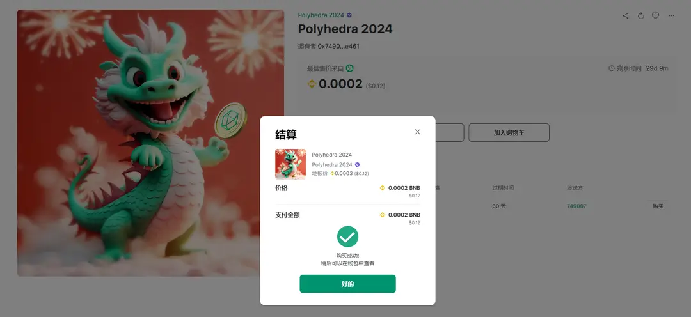

● Step 5: Open the "My NFTs" page to view the NFT you just purchased.

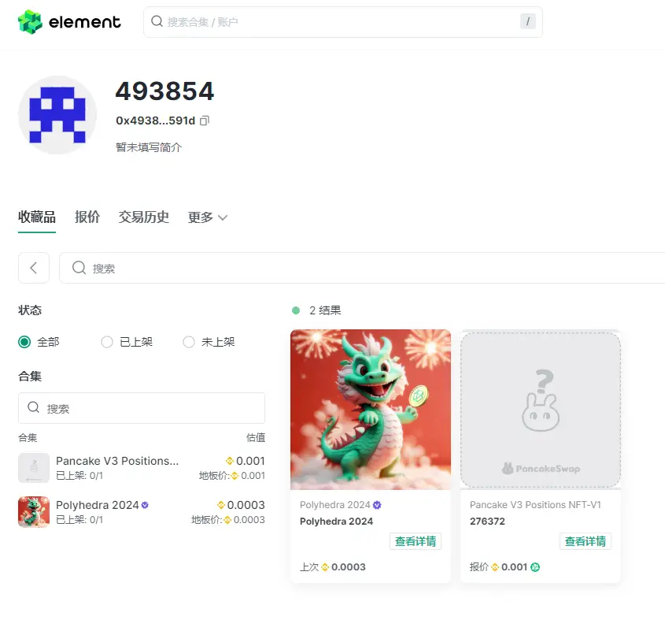

## Viewing All Your Digital Assets

If you want to see all the digital assets in your MetaMask wallet, you can visit https://portfolio.metamask.io/. As shown below, here you can view all your Tokens and NFTs.

Tokens view:

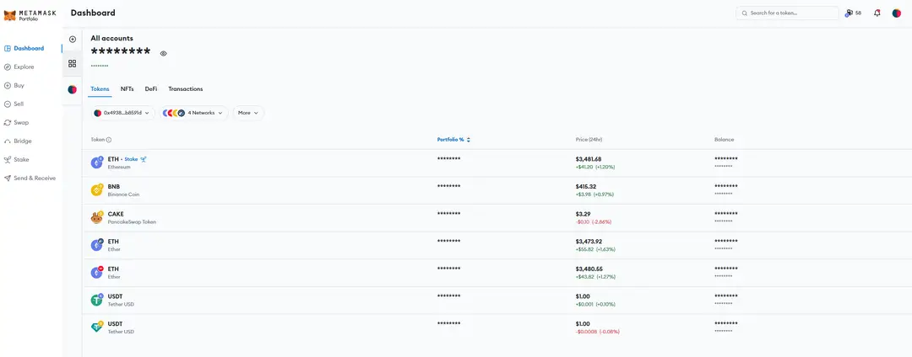

NFTs view:

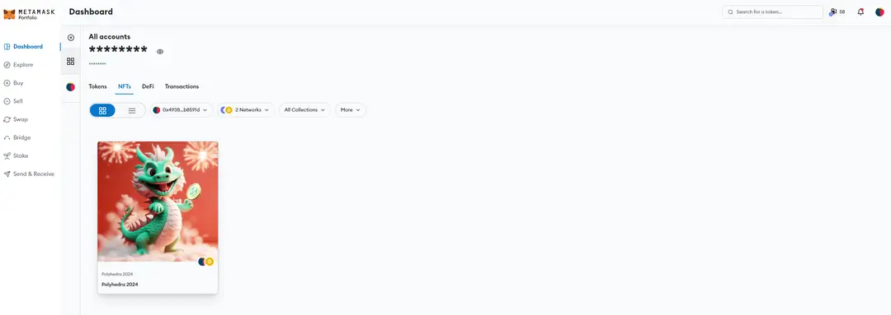

## Summary

In this section, we learned the basics of participating in Web3 — how to create a digital wallet, how to trade cryptocurrency, and how to buy an NFT digital artwork. Web3 activities go far beyond these examples — you can also take part in more DeFi activities such as lending and staking, or join a DAO and participate in community governance through voting. That said, keep in mind that the Web3 ecosystem is still evolving, and its security mechanisms and regulatory framework are not yet fully mature. Stay vigilant, follow the latest platform updates, and treat every transaction with caution to guard against phishing and fraud and keep your assets safe.
