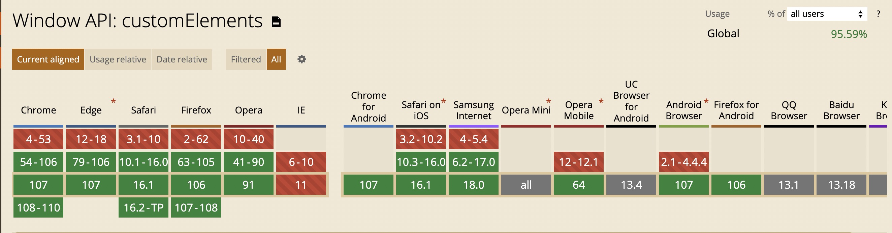

# ranui

基于 `Web Components UI`组件库

## Feature 特点

1. 基于`Web Components`开发，能做到跨框架复用，统一所有情况。
2. 采用`Typescript`开发，有声明和类型文件。
3. 纯原生手写，基础组件无依赖。
4. `MIT`协议
5. 文档基于`vitepress`搭建，所有组件实例均可交互。

## Situation 项目情况

<a style="display:inline-block;margin-left: 4px;" href="https://github.com/chaxus/ran"></a>
<a style="display:inline-block;margin-left: 4px;" href="https://github.com/chaxus/ran"></a>
<a style="display:inline-block;margin-left: 4px;" href="https://github.com/chaxus/ran"></a>
<a style="display:inline-block;margin-left: 4px;" href="https://github.com/chaxus/ran"></a>
<a style="display:inline-block;margin-left: 4px;" href="https://github.com/chaxus/ran"></a>

- `git`：`https://github.com/chaxus/ran/tree/main/packages/ranui`
- `npm`：`https://www.npmjs.com/package/ranui`


## Import 导入方式

支持按需引入

```js
import 'ranui/button'
```

对于一些全局展示的组件，比如 `preview` 和 `message`，需要加载一些额外的样式

```js
import 'ranui/preview'
import 'ranui/style'
```

也可以全局导入，更加方便，这样什么都不用考虑了，梭哈完事。

- `ES module`

```js
import 'ranui'
```

- `UMD`, `IIFE`, `CJS`

```html
<script src="./ranui/dist/umd/index.umd.cjs"></script>
```


## Usage 使用

大多数情况都可以像原生的 `div` 标签一样使用。

接下来是一些使用例子

- `html`
- `js`
- `jsx`
- `vue`
- `tsx`

### `html`

```html
<script src="./ranui/dist/umd/index.umd.cjs"></script>

<body>
  <r-button>Button</r-button>
</body>
```

### `js`

```js
import 'ranui'

const Button = document.createElement('r-button')
Button.appendChild('this is button text')
document.body.appendChild(Button)
```

### `jsx`

```jsx
import 'ranui'
const App = () => {
  return (
    <>
      <r-button>Button</r-button>
    </>
  )
}
```

### `vue`

```vue
<template>
  <r-button>Button</r-button>
</template>
<script>
import 'ranui'
</script>
```

## `tsx`

```tsx
// react 18 
import type { SyntheticEvent } from 'react';
import React, { useRef } from 'react'
import 'ranui'

const FilePreview = () => {
    const ref = useRef<HTMLDivElement | null>(null)
    const uploadFile = (e: SyntheticEvent<HTMLDivElement>) => {
        if (ref.current) {
            const uploadFile = document.createElement('input')
            uploadFile.setAttribute('type', 'file')
            uploadFile.click()
            uploadFile.onchange = (e) => {
                const { files = [] } = uploadFile
                if (files && files?.length > 0 && ref.current) {
                    ref.current.setAttribute('src', '')
                    const file = files[0]
                    const url = URL.createObjectURL(file)
                    ref.current.setAttribute('src', url)
                }
            }
        }
    }
    return (
        <div >
            <r-preview ref={ref}></r-preview>
            <r-button type="primary" onClick={uploadFile}>choose file to preview</r-button>
        </div>
    )
}
```

`jsx`在`TypeScript`中定义了所有`html`原生组件的类型。`web component`类型不在`jsx`定义中。需要手动添加。否则会有类型问题，但它实际上是有效的。

```ts
// typings.d.ts
interface RButton {
  type?: string,
  onClick?: React.MouseEventHandler<HTMLDivElement> | undefined
}

interface RPreview {
  src?: string | Blob | ArrayBuffer,
  onClick?: React.MouseEventHandler<HTMLDivElement> | undefined
  ref?: React.MutableRefObject<HTMLDivElement | null>
}

declare namespace JSX {
  interface IntrinsicElements {
    'r-preview': React.DetailedHTMLProps<React.HTMLAttributes<HTMLDivElement>, HTMLDivElement> & RPreview
    'r-button': React.DetailedHTMLProps<React.HTMLAttributes<HTMLDivElement>, HTMLDivElement> & RButton
  }
}
```

## Component overview

- `Button`

<div style="display:inline-block;margin-right: 8px;margin-bottom: 12px;">
     <r-button type="primary">主要按钮</r-button>
</div>
<div style="display:inline-block;margin-right: 8px;margin-bottom: 12px;">
     <r-button type="warning">警告按钮</r-button>
</div>
<div style="display:inline-block;margin-right: 8px;margin-bottom: 12px;">
    <r-button type="text">文本按钮</r-button>
</div>
<div style="display:inline-block;margin-right: 8px;margin-bottom: 12px;">
    <r-button >默认按钮</r-button>
</div>

- `Icon`

<div style='display:flex'>
     <r-icon name="lock" size="50" ></r-icon>
     <r-icon name="user" size="50" ></r-icon>
     <r-icon name="loading" size="50" color="#1E90FF" spin></r-icon>
</div>

- `Skeleton`

<div style="width: 100px;margin-top:10px">
    <r-skeleton ></r-skeleton>
</div>
<div style="margin-top:10px">
    <r-skeleton ></r-skeleton>
</div>
<div style="margin-top:10px">
    <r-skeleton ></r-skeleton>
</div>
<div style="width: 200px;margin-top:10px;margin-bottom: 12px;">
    <r-skeleton ></r-skeleton>
</div>

- `Input`

<div style="display:block;margin-right: 8px;margin-bottom: 12px;">
     <r-input label="user"></r-input>
</div>

<div style="display:block;margin-right: 8px;margin-bottom: 12px;">
     <r-input icon="lock" type="password"></r-input>
</div>

- `message`

<r-button onclick="message.info('这是一条提示')">信息提示</r-button>
<r-button onclick="message.warning('这是一条提示')">警告提示</r-button>
<r-button onclick="message.error('这是一条提示')">错误提示</r-button>
<r-button onclick="message.success('这是一条提示')">成功提示</r-button>
<r-button onclick="message.toast('这是一条提示')">toast 提示</r-button>

- `Tab`

<div style="display:block;margin-right: 8px;margin-bottom: 12px;">
   <r-tabs>
      <r-tab label="home" icon="home">tab1</r-tab>
      <r-tab label="message" icon="message">tab2</r-tab>
      <r-tab label="user" icon="user">tab3</r-tab>
   </r-tabs>
</div>


## Compatibility 兼容性

- 不支持 `IE`，其他均有较好支持
  

## 相关资源

1. [优秀的组件设计](https://www.checklist.design/)
2. [在线生成 CSS 渐变色](https://webgradients.com/)
3. [优秀设计作品，有 psd 和 sketch](https://webgradients.com/)
4. [3D UI 设计，类似于 3D 版的 figma](https://spline.design/)
5. [设计规范](https://lawsofux.com/)
6. [优秀设计作品](https://dribbble.com/)
7. [element UI 中文网](https://element.eleme.cn/#/zh-CN)
8. [Ant design 中文网](https://ant.design/index-cn)
9. [在线绘制 CSS 动画](https://animista.net/)
10. [tailwindcss 组件库](https://www.tailwindcss.cn/resources)
11. [animate css 非常优秀的 css 动画](https://animate.style/)
12. [can i use 检测兼容性 API 网站](https://caniuse.com/)
13. [figma](https://www.figma.com/)

## 协议和标准

1.  [RFCs](https://www.rfc-editor.org/)
2.  [ECMA](https://www.ecma-international.org/)
3.  [w3c](https://www.w3.org/)
