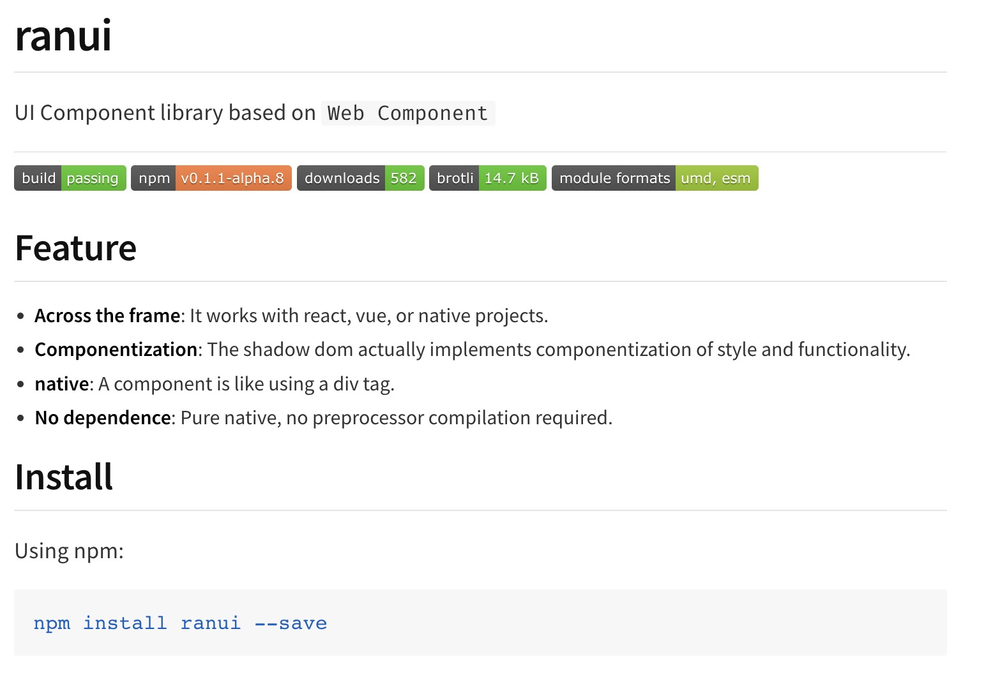

# ranui

基于 `Web Components UI`组件库

## 特点

1. 基于`Web Components`开发，能做到跨框架复用，统一所有情况。
2. 采用`Typescript`开发，有声明和类型文件。
3. 纯原生手写，无依赖。
4. 整体项目全量导入不到`100k`，`brotli`压缩后整体只有`14.70 KiB`，
5. `MIT`协议
6. 文档基于`vitepress`搭建，所有组件实例均可交互


## 项目地址

- `git`地址：`https://github.com/chaxus/ran/tree/main/packages/ranui`，欢迎大家提出各种改进建议，`issue`和`pr`。
- `npm`地址：`https://www.npmjs.com/package/ranui`



## 使用

- html

```html
<script src="./ranui/dist/index.umd.cjs"></script>

<body>
    <r-button>Button</r-button>
</body>
```

- vue

```vue
<template>
    <r-button>Button</r-button>
</template>
```

- react

```jsx
import Button from 'ranui'
const App = () => {
    return (
        <>
            <r-button>Button</r-button>
        </>
    )
}

```

```js
import 'ranui'

const Button  = document.createElement('r-button')
Button.appendChild('this is button text')
document.body.appendChild(Button)

```
大多数情况都可以像原生的`div`标签一样使用

## 全量引入

```ts
import 'ranui'
```


## 按需引入

```ts
import Button from 'ranui'
```

## 组件总览

- Button

<div style="display:inline-block;margin-right: 8px;margin-bottom: 12px;">
     <r-button type="primary">主要按钮</r-button>
</div>
<div style="display:inline-block;margin-right: 8px;margin-bottom: 12px;">
     <r-button type="warning">警告按钮</r-button>
</div>
<div style="display:inline-block;margin-right: 8px;margin-bottom: 12px;">
    <r-button type="text">文本按钮</r-button>
</div>
<div style="display:inline-block;margin-right: 8px;margin-bottom: 12px;">
    <r-button >默认按钮</r-button>
</div>

- Icon

<div style='display:flex'>
     <r-icon name="lock" size="50" ></r-icon>
     <r-icon name="user" size="50" ></r-icon>
     <r-icon name="loading" size="50" color="#1E90FF" spin></r-icon>
</div>

- Skeleton

<div style="width: 100px;margin-top:10px">
    <r-skeleton ></r-skeleton>
</div>
<div style="margin-top:10px">
    <r-skeleton ></r-skeleton>
</div>
<div style="margin-top:10px">
    <r-skeleton ></r-skeleton>
</div>
<div style="width: 200px;margin-top:10px;margin-bottom: 12px;">
    <r-skeleton ></r-skeleton>
</div>

- Input

<div style="display:block;margin-right: 8px;margin-bottom: 12px;">
     <r-input label="user"></r-input>
</div>

<div style="display:block;margin-right: 8px;margin-bottom: 12px;">
     <r-input icon="lock" type="password"></r-input>
</div>

- message

<r-button onclick="message.info('这是一条提示')">信息提示</r-button>
<r-button onclick="message.warning('这是一条提示')">警告提示</r-button>
<r-button onclick="message.error('这是一条提示')">错误提示</r-button>
<r-button onclick="message.success('这是一条提示')">成功提示</r-button>
<r-button onclick="message.toast('这是一条提示')">toast提示</r-button>

- Tab

<div style="display:block;margin-right: 8px;margin-bottom: 12px;">
   <r-tabs>
      <r-tab label="home" icon="home">tab1</r-tab>
      <r-tab label="message" icon="message">tab2</r-tab>
      <r-tab label="user" icon="user">tab3</r-tab>
   </r-tabs>
</div>


## 兼容性

- 不支持 IE，其他均有较好支持
   


## 相关资源

1. [优秀的组件设计](https://www.checklist.design/)
2. [在线生成 CSS 渐变色](https://webgradients.com/)
3. [优秀设计作品，有 psd 和 sketch](https://webgradients.com/)
4. [3D UI 设计，类似于 3D 版的 figma](https://spline.design/)
5. [设计规范](https://lawsofux.com/)
6. [优秀设计作品](https://dribbble.com/)
7. [element UI 中文网](https://element.eleme.cn/#/zh-CN)
8. [Ant design 中文网](https://ant.design/index-cn)
9. [在线绘制 CSS 动画](https://animista.net/)
10. [tailwindcss 组件库](https://www.tailwindcss.cn/resources)
11. [animate css 非常优秀的 css 动画](https://animate.style/)
12. [can i use 检测兼容性 API 网站](https://caniuse.com/)
13. [figma](https://www.figma.com/)

## 协议和标准

1.  [RFCs](https://www.rfc-editor.org/)
2.  [ECMA](https://www.ecma-international.org/)
3.  [w3c](https://www.w3.org/)
