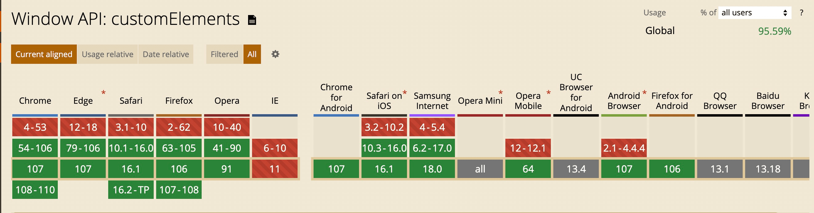

# ranui

A UI library built on **native custom elements**. Every component is an `<r-*>` tag, so it works
in React, Vue, Svelte, Solid, Astro or a plain HTML file the same way. There is no adapter and
no framework version to match. TypeScript types, light/dark theming through design tokens,
Shadow DOM encapsulation and server rendering are included.

<a style="display:inline-block;margin-left: 4px;" href="https://github.com/chaxus/ran"></a>
<a style="display:inline-block;margin-left: 4px;" href="https://www.npmjs.com/package/ranui"></a>
<a style="display:inline-block;margin-left: 4px;" href="https://www.npmjs.com/package/ranui"></a>
<a style="display:inline-block;margin-left: 4px;" href="https://unpkg.com/ranui/dist/index.js"></a>
<a style="display:inline-block;margin-left: 4px;" href="https://github.com/chaxus/ran"></a>

- **npm**: <a href="https://www.npmjs.com/package/ranui">`ranui`</a> ·
  **source**: <a href="https://github.com/chaxus/ran/tree/main/packages/ranui">`packages/ranui`</a>
- ranui is **alpha**: versions ship breaking changes. Pin an exact version and read the
  [changelog](/src/ranui/changelog) before upgrading.

## Install

```bash
npm install ranui
```

```html
<!-- or from a CDN, no build step -->
<script src="https://unpkg.com/ranui/dist/umd/index.umd.cjs"></script>
```

## Use it

Importing registers the elements; after that you write tags.

```js
import 'ranui'; // every component
import 'ranui/button'; // or just one
```

```html
<r-button type="primary">Deploy project</r-button>
```

It is the same tag in every framework: the differences are in how each one passes values and
binds events, which the [coding guidelines](/src/ranui/coding-guides/#framework-integration)
cover in full:

::: code-group

```html [HTML]
<script src="https://unpkg.com/ranui/dist/umd/index.umd.cjs"></script>

<body>
  <r-button>Button</r-button>
</body>
```

```jsx [React]
import 'ranui';

export const App = () => <r-button type="primary">Deploy</r-button>;
// Rich values and event listeners go through a ref — see the coding guidelines.
```

```vue [Vue]
<template>
  <r-button type="primary" @click="deploy">Deploy</r-button>
</template>

<script setup>
import 'ranui';
</script>
<!-- Add `r-` to compilerOptions.isCustomElement in your build config. -->
```

```js [Plain JS]
import 'ranui';

const button = document.createElement('r-button');
button.textContent = 'Deploy';
document.body.appendChild(button);
```

:::

## Entry points

Each entry registers exactly what its name says, so a page that only wants theming never pays
for the component library.

| Import                                             | Contains                                                   |
| -------------------------------------------------- | ---------------------------------------------------------- |
| `ranui`                                            | Every component                                            |
| `ranui/<component>`                                | One component: `ranui/button`, `ranui/select`, …           |
| [`ranui/theme`](/src/ranui/theme/)                 | Light/dark theming and token overrides; no elements        |
| [`ranui/i18n`](/src/ranui/i18n/)                   | The translation engine; no elements                        |
| `ranui/fonts`                                      | Self-hosted Geist Sans + Geist Mono                        |
| `ranui/style`                                      | The stylesheet, if your setup does not pick it up          |
| [`ranui/builder`](/src/ranui/builder/)             | The fluent DOM builder with fine-grained reactivity        |
| [`ranui/ssr`](/src/ranui/ssr/), `ranui/ssr-stream` | Server rendering                                           |
| `ranui/testing`                                    | Helpers for reaching into a closed shadow root from a test |
| `ranui/typings`                                    | Ambient JSX / TS element types                             |

## Components

40 elements. Every one of them, with its attributes, properties, events, slots and `::part()`
names, is in the [element API reference](/src/ranui/api).

**Common**: [Button](/src/ranui/button/) · [Icon](/src/ranui/icon/) ·
[Loading](/src/ranui/loading/)

**Data entry**: [Input](/src/ranui/input/) · [CheckBox](/src/ranui/checkbox/) ·
[Select](/src/ranui/select/) · [ColorPicker](/src/ranui/colorpicker/) ·
[Attachments](/src/ranui/attachments/) · [VoiceButton](/src/ranui/voice-button/) ·
[Forms](/src/ranui/form/)

**Data display**: [Card](/src/ranui/card/) · [Section](/src/ranui/section/) ·
[Tabs](/src/ranui/tab/) · [Image](/src/ranui/image/) · [Progress](/src/ranui/progress/) ·
[Radar](/src/ranui/radar/) · [Player](/src/ranui/player/) · [Preview](/src/ranui/preview/) ·
[Glass](/src/ranui/glass/) · [Scratch](/src/ranui/scratch/) ·
[StateDot](/src/ranui/state-dot/) · [DisclosureRow](/src/ranui/disclosure-row/)

**Content rendering**: [Markdown](/src/ranui/markdown/) · [Math](/src/ranui/math/) ·
[Mermaid](/src/ranui/mermaid/)

**AI & chat**: [Conversation](/src/ranui/conversation/) ·
[Reasoning](/src/ranui/reasoning/) · [ToolCard](/src/ranui/tool-card/) ·
[TokenMeter](/src/ranui/token-meter/)

**Overlays & feedback**: [Modal](/src/ranui/modal/) · [Popover](/src/ranui/popover/) ·
[Dropdown](/src/ranui/dropdown/) · [Message](/src/ranui/message/) ·
[Skeleton](/src/ranui/skeleton/)

**Navigation**: [Router](/src/ranui/router/) · [Route](/src/ranui/route/) ·
[Link](/src/ranui/link/)

**Foundations**: [Theming](/src/ranui/theme/) · [ThemeSwitch](/src/ranui/theme-switch/) ·
[i18n](/src/ranui/i18n/)

Five elements have no page of their own because they only exist inside another: `<r-option>`
(Select), `<r-tabs>` (Tabs), `<r-img>` (Image), `<r-dropdown-item>` (Dropdown) and
`<r-content>` (Popover). They are in the API reference like everything else.

### Live

<div style="display:flex;flex-wrap:wrap;align-items:center;gap:12px;margin-bottom:12px">
  <r-button type="primary">Primary</r-button>
  <r-button type="warning">Warning</r-button>
  <r-button type="text">Text</r-button>
  <r-button>Default</r-button>
  <r-icon name="lock" size="28"></r-icon>
  <r-icon name="user" size="28"></r-icon>
  <r-icon name="loading" size="28" color="#1E90FF" spin></r-icon>
</div>

<div style="width:100%;margin-bottom:12px">
  <r-progress percent="0.7" type="drag"></r-progress>
</div>

<r-markdown copy content="**Streaming** Markdown with `code`, tables, mermaid and math."></r-markdown>

## Styling

Components render into a **closed** shadow root: page CSS cannot leak in, and selectors cannot
reach through. There are four ways in, in order of preference.

**1. Design tokens (CSS custom properties)**: they inherit across the boundary, so setting one
on `:root`, on a wrapper or on the element all work:

```html
<r-progress
  percent="0.7"
  type="drag"
  style="--ran-progress-track-background: linear-gradient(to right, #f00, #ff0, #0f0, #0ff, #00f)"
></r-progress>
```

<div style="width:100%;margin:12px 0">
  <r-progress percent="0.7" type="drag" style="--ran-progress-track-background:linear-gradient(to right, #ff0000, #ffff00, #00ff00, #00ffff, #0000ff, #ff00ff, #ff0000);"></r-progress>
</div>

**2. `::part()`** for structural tweaks the tokens do not cover ·
**3. the `sheet` attribute** to inject CSS into the shadow root ·
**4. slotted content**, which stays in your document and takes your page CSS.

The token names are the [design system](/src/ranui/design-system/); the rules for choosing
between them are the [design guidelines](/src/ranui/design-guides/); the mechanics are in the
[coding guidelines](/src/ranui/coding-guides/#styling-across-the-shadow-boundary).

## Events

Components dispatch `CustomEvent`s with the payload in `detail`. Bind on the element: whether
an event bubbles is a per-component decision, and the API reference states it for every one:

```html
<r-select id="env"></r-select>

<script>
  document.getElementById('env').addEventListener('change', (event) => {
    console.log(event.detail.value);
  });
</script>
```

The `onchange="…"` attribute form and the `el.onchange = …` property form both work, since
these are ordinary DOM elements, but they allow only one handler and no capture phase, so
`addEventListener` is the one to reach for.

## Where to go next

| If you want to…                           | Read                                           |
| ----------------------------------------- | ---------------------------------------------- |
| Look up an element's exact API            | [Element API](/src/ranui/api)                  |
| Know which token to use, and why          | [Design system](/src/ranui/design-system/)     |
| Build a screen that looks like one system | [Design guidelines](/src/ranui/design-guides/) |
| Wire ranui into an app correctly          | [Coding guidelines](/src/ranui/coding-guides/) |
| Add light/dark, or restyle everything     | [Theming](/src/ranui/theme/)                   |
| Translate the interface                   | [i18n](/src/ranui/i18n/)                       |
| Render on a server                        | [Server rendering](/src/ranui/ssr/)            |
| Build reactive views without a framework  | [Builder](/src/ranui/builder/)                 |
| See what changed before upgrading         | [Changelog](/src/ranui/changelog)              |

## Browser support

The library works in every modern browser: it is built on Custom Elements v1, Shadow DOM v1 and
CSS custom properties. **Internet Explorer is not supported.**



## Contributors

<a href="https://github.com/chaxus/ran/graphs/contributors">
  
</a>

## Further reading

Standards this library is built on: [W3C](https://www.w3.org/) ·
[ECMA](https://www.ecma-international.org/) · [RFCs](https://www.rfc-editor.org/) ·
[Can I use](https://caniuse.com/)

Design references worth keeping open: [Checklist Design](https://www.checklist.design/) ·
[Laws of UX](https://lawsofux.com/) · [Geist](https://vercel.com/geist) ·
[Ant Design](https://ant.design/index-cn) · [Element UI](https://element.eleme.cn/#/zh-CN) ·
[Animista](https://animista.net/) · [WebGradients](https://webgradients.com/)
