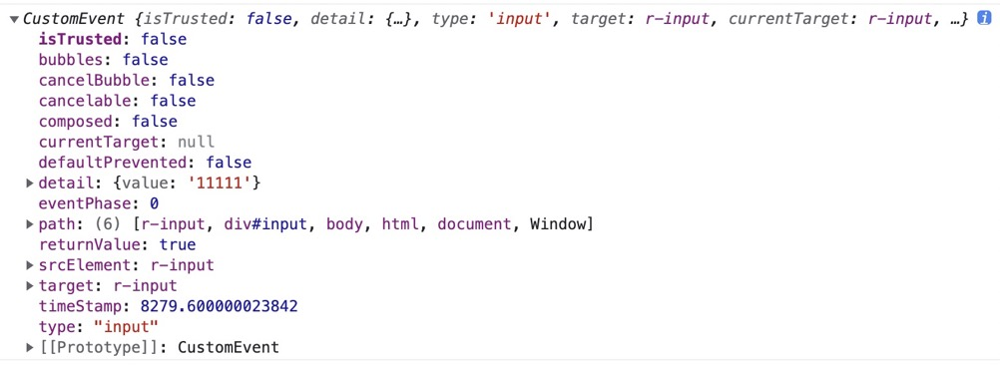

# Input 输入框

通过鼠标或键盘输入内容，是最基础的表单域的包装。

## 代码演示

<div style="width:300px;">
    输入框：<r-input></r-input>
</div>

```xml
<r-input></r-input>
```

## 属性

### 标签`label`

提供类似于 `Metiral Design` 的输入体验。

<r-input label="user"></r-input>

```html
<r-input label="user"></r-input>
```

### 占位`placeholder`

与原生`placeholder`一致。

<r-input placeholder="user"></r-input>

```html
<r-input placeholder="user"></r-input>
```

### 禁用`disabled`

通过`disabled`可以禁用输入框，禁用后该按钮上的事件失效。

<r-input label="user" disabled></r-input>

```html
<r-input label="user" disabled></r-input>
```

### 值`value`

设置或返回输入框的`value`属性值。

<r-input value="1234"></r-input>

### 类型`type`

目前支持`password`、`number`这几种类型，设置后会出现额外的`ui`控件。

#### 密码输入框

支持密码明文和密文切换。

<r-input icon="lock" type="password"></r-input>

```html
<r-input icon="lock" type="password"></r-input>
```

### 图标`icon`

可以设置一个`icon`来表示标签标识。

<r-input icon="user"></r-input>

```html
<r-input icon="user"></r-input>
```

#### 数字输入框

数字输入框，类似于原生`input[type=number]`，支持`min`、`max`、`step`属性，支持键盘上下键切换数字。

<r-input type="number" min="-10" max="10" step="0.5" ></r-input>

```html
<r-input type="number" min="-10" max="10" step="0.5"></r-input>
```

### name 属性名

跟 form 组件联动的时候有效，form 提交时收集的字段名字

### status 状态

- error

默认色值: `#ff4d4f`

<div>
 <r-input status="error"></r-input>
</div>

```xml
<r-input status="error"></r-input>
```

- warning

默认色值: `#ff7875`

<div>
  <r-input status="warning"></r-input>
</div>

```xml
<r-input  status="warning"></r-input>
```

## 事件`event`

常见的回调事件。

### onchange

文本改变的时候触发。

<r-input onchange="console.log(this.value)"></r-input>

```html
<r-input onchange="func(this.value)"></r-input>
```

```js
const input = document.createElement('r-input')
input.setAttribute('label', 'home')
const func = (e) => {
  console.log(e)
}
input.addEventListener('change', func)
```

### oninput

输入时触发。
<r-input oninput="console.log(this.value)"></r-input>

```js
const input = document.createElement('r-input')
input.setAttribute('label', 'home')
const func = (e) => {
  console.log(e)
}
input.addEventListener('input', func)
```

事件的`e`参数结构

