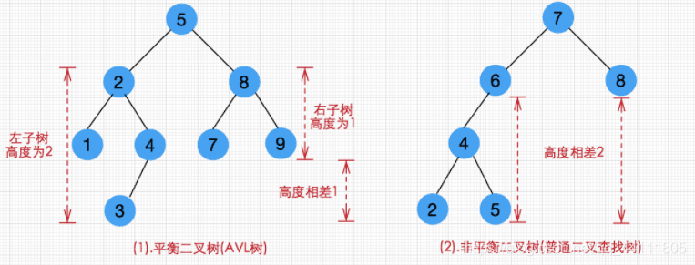

# Binary Tree Definition

In computer science, a binary tree is a tree data structure in which each node has at most two branches (i.e., no node has a branching degree greater than 2). These branches are commonly called the "left subtree" and "right subtree". The branches of a binary tree have a left-right order and cannot be arbitrarily swapped[[1]](#references).

# Properties of Binary Trees

- At level i of a binary tree, there are at most 2^(i-1) nodes (i >= 1)
- A binary tree of depth h has at most 2^h-1 nodes and at least h nodes (h >= 1)
- A binary tree containing n nodes has a height of at least (log2n)+1
- For a non-empty binary tree, if n0 is the total number of nodes with degree 0 and n2 is the total number of nodes with degree 2, then n0 = n2 + 1
- The total number of nodes in a binary tree: n = n1 + n2 + n0
- The total number of edges equals the total number of nodes minus one (B = n - 1)
- The total number of edges equals twice the number of nodes with degree 2 plus the number of nodes with degree 1 (B = n2 _ 2 + n1 _ 1)

# Types of Binary Trees

## Full Binary Tree

A binary tree of depth k with 2k-1 nodes is called a full binary tree.
It is a binary tree in which every level except the last is completely filled, with every node having two child nodes[[2]](#references).

## Complete Binary Tree

Consider a binary tree of depth k with n nodes, where the nodes are numbered from top to bottom and left to right. If, for every node numbered i (1≤i≤n), that node occupies the same position as the node numbered i in a full binary tree, then this binary tree is called a complete binary tree.

## Binary Search Tree

A binary search tree (BST), also known as a binary sort tree, is either an empty tree or a binary tree with the following properties: if its left subtree is not empty, the values of all nodes in the left subtree are less than the value of its root node; if its right subtree is not empty, the values of all nodes in the right subtree are greater than the value of its root node; and its left and right subtrees are also binary search trees.

## Balanced Binary Tree

A balanced binary tree (AVL tree) is always a binary search tree in which the absolute difference between the heights of the left and right subtrees does not exceed 1.

## B-Tree

A B-tree is a type of multi-way tree, also known as a balanced multi-way search tree (it has more than two search paths).

## B+ Tree

A B+ tree is a variant of the B-tree and is also a multi-way search tree.

## B\* Tree

A B* tree is a variant of the B+ tree, in which non-root and non-leaf nodes have additional pointers to their siblings. A B* tree defines the minimum number of keys in a non-leaf node as at least (2/3) _ M, meaning the minimum block utilization is 2/3 (compared to 1/2 for the B+ tree). B* trees have a lower probability of allocating new nodes than B+ trees, resulting in higher space utilization.

## Red-Black Tree

A red-black tree is a variant of the balanced binary search tree. The height difference between its left and right subtrees may exceed 1, so a red-black tree is not a strictly balanced binary tree (AVL tree). However, the cost of rebalancing it is lower, and its average statistical performance is better than that of an AVL tree.

## Heap

# Traversal

## Preorder Traversal

## Postorder Traversal

## Inorder Traversal

## Level-order Traversal

# Common Algorithm Problems

## Mirror Binary Tree

## Reconstruct Binary Tree

## Binary Tree Depth

## Total Number of Binary Tree Nodes

## Determine Binary Tree Substructure

Given two binary trees A and B, determine whether B is a substructure of A. (Note: by convention, an empty tree is not considered a substructure of any tree.)

# References

1. [Wikipedia: Binary Tree](https://zh.wikipedia.org/wiki/%E4%BA%8C%E5%8F%89%E6%A0%91)
2. [Baidu Baike: Full Binary Tree](https://baike.baidu.com/item/%E6%BB%A1%E4%BA%8C%E5%8F%89%E6%A0%91/7773283)
