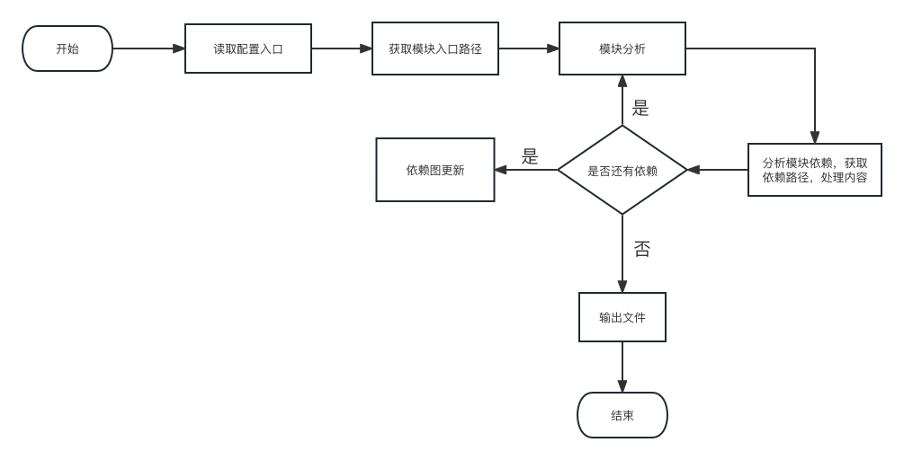

# Bundler

`Bundler`的使用：
传入 options 参数

```
function build(options: Options):Promise<Build> {
  const bundle = new Bundle({
    entry: options.input
  });
  return bundle.build().then(() => {
    return {
      generate: () => bundle.render()
    };
  });
}
```

架构图


