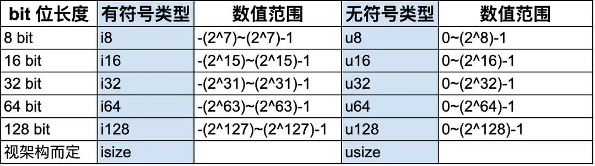
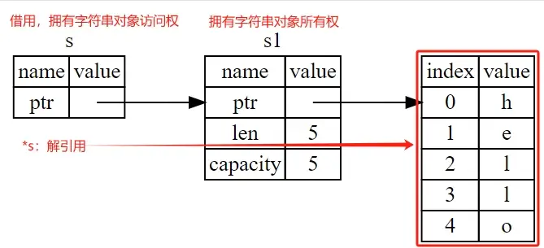
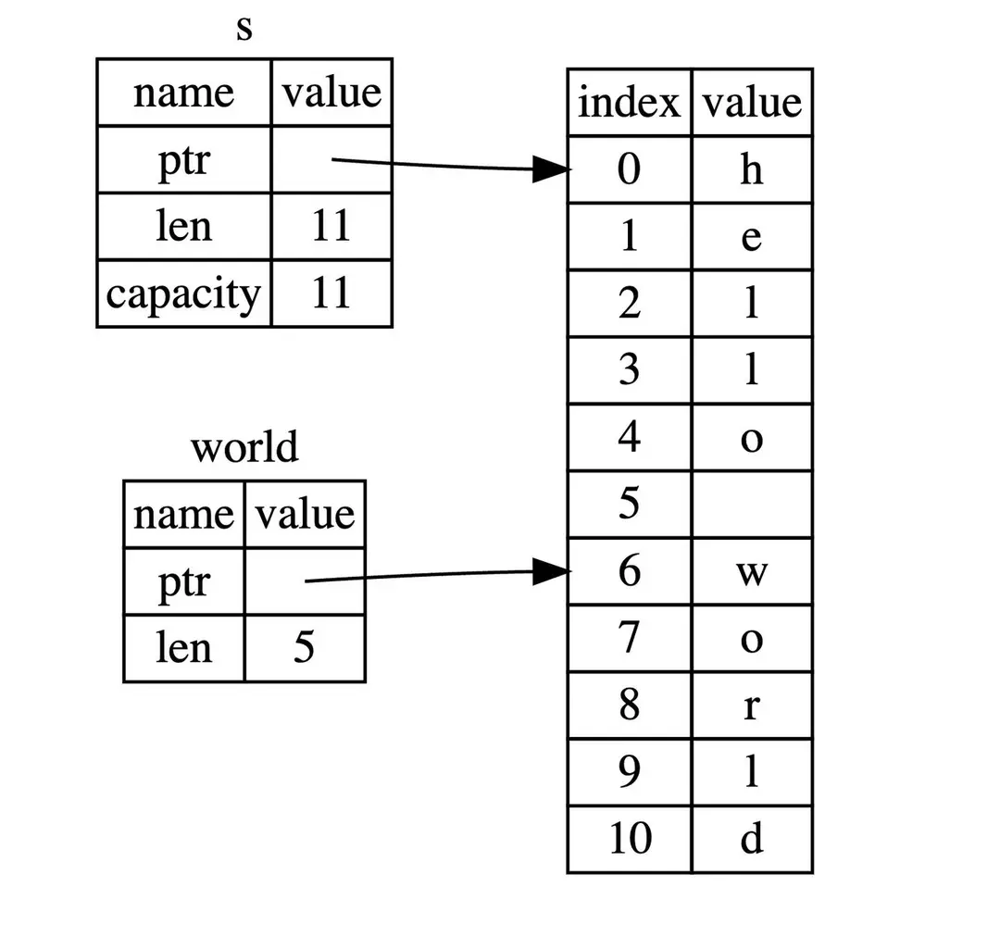

# 背景与起源

Rust 语言的诞生可谓是计算机领域的一场伟大冒险。由 Graydon Hoare 于 2010 年创建，它的设计初衷是为了满足系统级编程的需求，并弥补 C++ 等语言的不足。在 Rust 的成长过程中，吸收了众多前辈语言的优点，同时摒弃了它们的一些痛点，使得 Rust 在系统编程领域脱颖而出。

# 优点与适用场景

Rust 语言以其强大的内存安全性、零成本抽象、并发性和不可变性而闻名。其独特的所有权系统使得程序员能够在不牺牲性能的前提下编写安全、并发的代码。这使得 Rust 在编写操作系统、嵌入式系统、网络服务以及特别是区块链领域表现出色。

# Rust 与区块链

在区块链应用中，Rust 的性能和安全性变得尤为突出，为区块链开发者提供了一个理想的编程语言选择，支持构建高效且安全的去中心化应用。项目如 StarkNet 和 Solana 等选择 Rust 作为智能合约的编程语言；用于以太坊应用程序开发的工具包 Foundry，也是由 Rust 语言编写的，可以快速、方便的完成依赖项管理、编译、运行测试、部署。这些都主要得益于 Rust 强大的性能和内存安全性……这些项目的选择证明了 Rust 在区块链生态中的卓越表现，为开发者提供了强大而安全的编程语言，促进了区块链技术的发展。通过利用 Rust 的特性，区块链应用得以更好地平衡性能和安全性的需求，为未来的去中心化世界奠定了坚实的基础。接下来，让我们投入这场关于 Rust 的奇妙之旅吧~

# 变量

Rust 中的变量可以分为可变变量和不可变变量，通俗来说，就是变量的值是否允许修改，如果在内存中给变量分配完值之后，可以根据需要来修改这个值，那它就是可变变量，反之，不允许这个值再发生变更，那就是不可变变量。前者很容易理解，变量的值在不同场景下会发生变化，它为编程提供了灵活性；后者，也有存在的道理，通过不可变的限制，提供了编程的安全性，特别是在多线程环境下，也减少了一些运行时检查，在一定程度上提升运行性能。

注意：这里提到的是否可变指的是变量的值，而非变量的数据类型。另外，不可变变量这个特性并不是 Rust 特有的，在 Java 中也有类似的概念，比如 String 类型就是不可变变量，当对不可变对象的值进行了类似的修改操作时，本质上是创建了新的对象，而不是修改了这个不可变变量的值。

比喻

举个简单的例子，假如有个叫 Ferris 的同学，从它出生起，身份证号就是不可变的，伴随 Ferris 的一生（不可变变量在其整个生命周期中都是不可变的），因为不可变，所以在有些场景下非常有用，比如可以在全国公安系统中准确的定位到一个人；但是，像家庭住址、性别（Nothing is impossible）、联系方式等这些，却有可能发生变化，这些变化对 Ferris 来说也许是非常有必要的。注：Ferris 是 Rust 社区的吉祥物，就是那个被煮熟的螃蟹🦀🙈

我们分别定义 2 个不同类型的变量，并尝试修改对应的值。

```rs
fn main() {
    // x 为可变变量，mut 即 mutable 的意思，该修饰符修饰的变量允许改变
    let mut x = 1;
    println!("x = {}", x);
    x = 2;
    println!("x = {}", x);

    // y 为不可变变量，如果没有指定 mut，则 Rust 默认为不可变
    let y = 3;
    println!("y = {}", y);
    // 对不可变变量 y 重新赋值，Rust 编译器会给出 cannot assign twice to immutable variable y 的错误提示
    y = 4;
    println!("y = {}", y);
}
```

变量解构是一种将复合数据类型（如元组、结构体、枚举等）中的值分解为单独变量的过程。它可以方便地从复杂的数据结构中提取出需要的值，并以更简洁的方式进行操作。通过这种方式，可以更好的控制数据的可见性，也使得代码更加优雅。变量解构通俗来讲就是已知原有的结构，解开该结构。它并不是 Rust 独有的特性，Python、JavaScript、Solidity 等许多编程语言也都有。

我们可以通过如下的方式，把水果篮里的香蕉、菠萝、榴莲放在 a、b、c 三个不同的盘子里，或者换一种方式，只拿香蕉和菠萝。

```rs
// 第一种放法
let (a, b, c) = ("Banana", "pineapple", "durian");

// 第二种放法
let (e, d, _) = ("Banana", "pineapple", "durian");
```

Rust 基本数据类型中最常用的数值类型：有符号整数 (i8, i16, i32, i64, isize)、无符号整数 (u8, u16, u32, u64, usize) 、浮点数 (f32, f64)。整数是 没有小数部分的数字，具体有如下几种类型：



表示方式为 有无符号 + 类型大小（位数），i 是英文单词 integer 的首字母，代表有符号类型，包含负整数、0 和正整数，与之相反的是 u，代表无符号 unsigned 类型，包含 0 和正整数。Rust 默认的整数类型是 i32，即用 32 个 bit 位表示有符号的整数。浮点类型数字 是带有小数点的数字，在 Rust 中浮点类型数字也有两种基本类型：f32 和 f64，分别为 32 位和 64 位大小。默认浮点类型是 f64。

我们在接下来看下数值的定义及表示方式。

```rs
// 这里 a 为默认的 i32 类型
let a = 1;
// 可以指定也可以指定为具体的整数类型
let b: u32 = 1;

// 这里 c 为默认的 f64 类型
let c = 1.0;
// 也可以指定为具体的浮点数类型
let d: f32 = 1.0;

// Rust 中可以方便的使用不同进制来表示数值，总有一款适合你
let x: i32 = 100_000_000;
let y: i32 = 0xffab;
let z: i32 = 0o77;
let m: i32 = 0b1111_0000;
let n: u8 = b'A';
println!("x = {}, y = {}, z = {}, m = {}, n = {}", x, y, z, m, n);
```

字符类型是用 char 类型表示的，占用 4 个字节的空间，可以表示 Unicode 字符集中的任何字符，包括 ASCII 字符、各种符号、各种语言的文字，甚至是表情符号。通过单引号'可以创建一个 char 类型的值。例如 let a:char = '🦀';布尔类型有两种值：true 和 false，占用内存的大小为 1 个字节。注意：这里是介绍的是字符（用单引号''表示)，不是字符串 (用双引号""表示)，在 Rust 中，字符串类型的长度取决于使用的编码集，默认情况下，Rust 使用 UTF-8 编码，一个字符占用 1～4 个字节，而 char 类型占用 4 个字节的存储空间，即使有些字符在特定编码集下只需要 1～3 个字节表示，Rust 也会将其扩展为 4 个字节。这样做的好处是：

● 保证所有 char 值在内存中占用固定大小，有利于内存对齐和访问效率。

● 避免编码转换开销，直接使用 4 字节值可以高效处理字符。

● 足够表示 Unicode 标量值所需的全部码位，确保未来的兼容性。

```rs
// 英文字符
let c = 'z';
// 数学符号
let z = 'ℤ';
// 中文字符
let g = '国';
// emoji 表情
let ferris = '🦀';

// 布尔类型
let m = true;
```

语句（Statements）是 Rust 中的执行单位，它们执行一些操作但不返回值，以分号;结尾。表达式（Expressions）是 Rust 中的计算单位，它们计算并返回一个值，所以表达式可以用作赋值。常见的表达式有函数调用、宏调用、用大括号创建的代码块等。单元类型：是 Rust 中一个特殊的返回值类型，意味着函数或表达式没有返回值，类似于其他语言中的 void 的返回类型。用符号 () 来表示。
小技巧：区分语句和表达式的一个简单方法就是有无分号;，有的话就是语句，执行操作但不返回结果；没有的话就是表达式，执行计算并返回结果。虽然这种方式在有些情况下不成立，但现阶段足以让我们应对绝大数场景。

```rs
fn main() {
    // 语句，使用 let 关键字创建变量并绑定一个值
    let a = 1;

    // 语句不返回值，所以不能把语句 (let a = 1) 绑定给变量 b，下面代码会编译失败
    let b = (let a = 1);
    
    // 表达式，返回值是 x + 1
    let y = {
        let x = 3;
        x + 1
    };
    
    println!("The value of y is: {}", y); // y = 4
}
```

函数是个很常见的概念，它是一段可重复使用的代码块，用于执行特定的任务或完成特定的操作。函数接受输入参数（可选），执行一系列操作，并返回一个值（可选）。
注意：Rust 代码中的函数和变量名使用 snake_case 规范风格。

现在我们来看下函数的各个组成部分。需要注意的是，函数的参数需要显式的标注类型，不仅有助于提高代码的可读性，也有助于 Rust 提供更强的类型安全性，帮助编译器在类型不匹配时发现错误，提供有用的错误信息。

```rs
// fn 为声明函数的关键字
// unsafe_add() 是函数名，函数的命名要遵循 snake_case 的规范，同时要见名知意，提高代码的可读性
// i 和 j 是入参，并且需要显式指定参数类型
// --> i32 表明出参也是 i32 类型
fn unsafe_add(i: i32, j: i32) -> i32 {
   // 表达式形式，所以函数会在计算求和后返回该值
   i + j
}
```

我们在前面章节了解到整数相加可能会溢出，但这里并没有特殊处理，所以 unsafe_add 更容易提醒开发者，这个相加是不安全的，要注意啦~

Rust 为什么要设计没有任何返回值的单元类型 () ?
Rust 是一门静态类型语言，它在编译时需要确定每个函数的返回类型。
当函数体中没有返回语句或表达式时，编译器无法确定函数的返回类型应该是什么。为了解决这个问题，Rust 引入了单元类型 () 作为一种特殊的类型，表示没有返回值的函数。类似于其他语言中的 void 类型，通常用于打印消息、写入文件等一些不需要返回值的操作。

什么是发散函数（Diverging Functions）?

指的是永远不会返回的函数，甚至连默认的单元类型 () 返回值都没有，这些函数通常用！类型来标注。通常用于处理错误或不可恢复的情况，并通过终止程序的执行来表达这种状态。

前言：我们在前几节介绍过 Rust 的基础类型：i32、char、f64、bool 等，它们都是已知大小的，存储在栈内存中。在接下来的 Rust 所有权特性中会涉及到堆内存相关的知识，所以我们在这里使用 String 作为例子，并专注于 String 与所有权相关的部分，看下 Rust 如何在栈、堆内存中管理数据的。关于 String 类型更加深入的讲解会在第三章。

这里我们先介绍下关于内存的 2 个基础知识：栈内存和堆内存，注意，这并不是 Rust 独有的。

栈内存存储的数据主要为大小固定的基础数据类型，分配和释放速度很快；它以放入值的顺序存储值并以相反顺序取出值。这也被称作 后进先出（last in, first out）。

堆内存存储那些大小在运行时动态变化的数据结构，允许更灵活的数据共享和动态分配；当向堆放入数据时，内存分配器（memory allocator）在堆的某处找到一块足够大的空位，把它标记为已使用，并返回一个表示该位置地址的指针（pointer）。总的来说，堆、栈内存并无优劣之分，只是面向的场景不同而已。

动态字符串（String 类型）：大小可变的字符集合，这个类型允许程序在运行时动态的管理堆内存上的字符串数据，比如分配、增长和修改字符串内容，所以能够存储在编译时未知大小的内容。

通过下面的代码，我们看下动态字符串的创建。

```rs
use std::io;
fn main() {
     // 创建一个可变的字符串变量来存储用户输入
    let mut input: String = String::new();
    println!("请输入您的名字：");
    // 读取用户输入并将其存储在 input 变量中
    io::stdin()
        .read_line(&mut input)
        .expect("无法读取输入");
    // 打印用户输入的字符串
    println!("您的名字是：{}", input);
}
```

这一节我们将学习 Rust 的一个重要特性：所有权，它让 Rust 无需垃圾回收器（garbage collector）即可保证内存安全。因此，理解 Rust 中所有权的运作方式非常重要。所有权：Rust 中每个值都有一个唯一的所有者 owner（如上节代码 let s1 = String::from("hello");中，变量 s1 是 hello 这个值的所有者），所有者拥有这个值的所有权，负责管理内存资源的分配和释放。Rust 通过所有权机制规定内存管理的方式，确保程序在运行时不发生数据竞争、悬垂指针等内存安全问题。所有权三原则：

1. Rust 中每一个值都被一个变量所拥有，该变量被称为值的所有者；

2.一个值同时只能被一个变量所拥有，或者说一个值只能拥有一个所有者；

3.当所有者 (变量) 离开作用域范围时，这个值将被 drop (丢弃)。

我们在下面的代码中展示所有权的分配、修改。

```rs
// 变量 s1 拥有字符串 hello 的所有权
let mut s1:String = String::from("hello");

// 变量 s1 可以修改该字符串
s1.push_str(", hackquest."); // push_str() 在字符串后追加字面值
```

前言：在上节我们介绍了 Rust 的所有权以及所有权的转移，但是仅仅支持通过转移所有权的方式获取一个值，会让程序变得复杂。那么，接下来我们学习下 Rust 中的另一特性：借用

借用 (Borrowing) ：是指通过引用来获得数据的访问权，而不是所有权，用符号&表示。借用使得可以在不转移所有权的情况下，让多个部分同时访问相同的数据。Rust 的借用分为可变借用（mutable borrowing）和不可变借用（immutable borrowing）两种形式。

解引用：是借用的一个重要操作，允许通过引用获取到被引用值的实际内容，简单来说，就是获取到借用的对象的值。用符号*表示。

我们还是从代码和内存两个角度展示下借用、解引用的相关概念。

```rs
// 变量 s1 拥有字符串的所有权，类似于你拥有一辆特别酷炫的车
let s1 = String::from("hello");

// 借用，通过 &s1 获得字符串的访问权，类似于朋友从你那里把这辆车借走了
// 但是车还是你的
let s: &String = &s1;

// 解引用，通过 *s 获的借用的对象的值
// 类似于你朋友把车开到大街上向别人展示：看，我借到了一辆特别酷炫的车！
println!("s1 = {}, s = {}", s1, *s);
```

通过一下的图示，我们会发现借用其实就是存储了字符串对象的内存地址指针，所以用更宽泛的概念来说，借用也是一种引用。



通过前几节的学习，我们已经初步掌握了所有权、转移、借用的概念，本节我们再深入学习以下内容：所有权与函数、drop（释放）细节、可变借用的限制。

所有权可以转移给函数，在移动期间，所有者的堆栈值将会被复制到函数调用的参数堆栈中。

```rs
struct Foo {
    x: i32,
}

fn do_something(f: Foo) {
    println!("{}", f.x);
    // f 在这里被 dropped 释放
}

fn main() {
    let foo = Foo { x: 42 };
    // foo 被移交至 do_something
    do_something(foo);
    // 此后 foo 便无法再被使用
}
```

当然，也可以从函数中获取所有权：

在发生了可变借用后，一个资源的所有者便不可以再次被借用或者修改。此举是为了避免潜在的数据争用（data race）。

```rs
struct Foo {
    x: i32,
}

fn do_something(f: Foo) {
    println!("{}", f.x);
    // f 在这里被 dropped 释放
}

fn main() {
    let mut foo = Foo { x: 42 };
    let f = &mut foo;

    // 会报错：do_something(foo);
    // 因为 foo 已经被可变借用而无法取得其所有权

    // 会报错：foo.x = 13;
    // 因为 foo 已经被可变借用而无法被修改

    f.x = 13;
    // f 会因为此后不再被使用而被 dropped 释放
    
    println!("{}", foo.x);
    
    // 现在修改可以正常进行因为其所有可变引用已经被 dropped 释放
    foo.x = 7;
    
    // 移动 foo 的所有权到一个函数中
    do_something(foo);
}
```

前言：在前几节我们介绍过 String 类型的内存结构，有了这个基础，我们就更容易理解本节的切片概念。

切片（slice）：是一种引用数据结构，它允许你引用数据的一部分而不需要拷贝整个数据。切片通常用于数组、字符串等集合类型。

字符串切片（String slice）：是一种特殊的切片，专门用于处理字符串。字符串切片的类型是 &str。它可以通过索引或范围来指定字符串的一部分。字符串切片提供了对字符串的引用，而不引入额外的内存开销。本节我们讨论的是分配在内存中的可动态调节大小的字符串的切片。

我们接下来学习下切片的基本语法，以及对应的内存模型。

```rs
// 该字符串分配在内存中
let s = String::from("hello world");

// hello 没有引用整个 String 字符串 s，而是引用了 s 的一部分内容，通过 [0..5] 的方式来指定。
let hello: &str = &s[0..5];
let world: &str = &s[6..11];
```

创建切片需要通过 [开始索引..终止索引]来指定范围，代表的数据范围包含开始位置，但不包含结束位置，即前闭后开；同时索引位置从 0 开始。



如果字符串包含汉字，在获取字符串切片时有什么要注意的？

A：字符串切片的索引位置是按照字节而不是字符。由于汉字使用 UTF-8 编码，一个汉字（字符）可能由一个或多个字节组成。因此索引必须对应一个完整的汉字的边界，否则获取该汉字会失败。

```rs
let chinese_string = "中国人";

// 获取切片 zhong 会失败，因为一个汉字可能由“一个或多个字节”组成。
// 这里“中”占用 3 个字节，因此 [0..2] 并不对应一个完整的汉字的边界
let zhong = &chinese_string [0..2];

// 正确的写法，1 个汉字占 3 个字节，即汉字“中”的字节范围是 0、1、2
let zhong = &chinese_string[0..3];
println!("{}", zhong);
```


