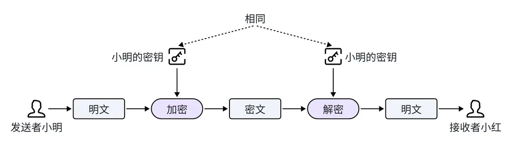

# 非对称加密和公私钥体系

● 什么是对称加密和非对称加密
● 什么是公私钥体系

## 对称加密

介绍非对称加密之前，我们先来了解一下对称加密。在对称加密中，加密和解密使用相同的密钥。意味着发送方和接收方必须事先共享这个密钥，并且都必须保守这个密钥的秘密。

我们可以举一个形象的例子：假如小明想把一封保密的信件寄给朋友小红，但是不想让别人看到信件的内容（消息），小明决定把信件放到一个小盒子里，并给盒子上一把锁，这把锁需要一个配对的钥匙（密钥）才能打开。

● 第一步：小明把装有信件的盒子寄给小红，为了让小红能打开盒子阅读信件，小明还需要把钥匙给小红。

● 第二步：小明又找到了一个可靠的信使，让信使把钥匙带给小红。

● 第三步：小红收到盒子和钥匙后，使用钥匙打开了盒子，阅读了里面的信件。

由于小明和小红使用的是同一把钥匙（对称密钥），所以这个过程被称为对称加密。对称加密存在一个问题，如果钥匙在传递过程丢失（密钥泄露），可能导致保密信件中的内容被别人看到。为了解决这个问题，非对称加密应运而生。

## 非对称加密

非对称加密解决了密钥分发问题，使用一对不同的密钥：公钥和私钥，来进行数据的加密和解密。公钥和私钥需要配对使用，公钥可以公开发放，任何人都可以用它来加密信息，但只有持有私钥的人才能解密这些信息。因此，即使公钥是公开的，没有私钥的人也无法读取加密信息的内容。

我们还是以小明给小红发送保密信件来举例，此时他们使用非对称加密技术来传递信件。

● 第一步：小红生成了一对密钥：一个公钥和一个私钥。小红将她的公钥发送给小明，而私钥由自己来保管，不会发给任何人。

● 第二步：小明得到小红的公钥后，使用公钥对信件内容进行加密，然后将这封加密的信件发送给小红。由于信件是用小红的公钥加密的，即便有人在途中截获了信件，没有小红的私钥，他们也无法解开信件内容。

● 第三步：当小红收到加密的信件时，她用自己的私钥对信件进行解密，阅读信件内容。

私钥是唯一能够解开加密信息的钥匙，其他任何人即便拥有公钥也无法解密。通过这种方式，小明和小红确保了保密信件内容的安全性。

## 公私钥体系

公私钥体系是非对称加密的基础。在这个体系中，每个用户都有一对密钥：公钥和私钥，公钥是公开的，而私钥只能由用户自己保管。公私钥体系基于密码学原理，任何人都无法从公钥推导出对应的私钥。除了非对称加密之外，公私钥体系还有一个核心功能：数字签名。在后面的章节中，我们将会对数字签名技术做详细介绍。
