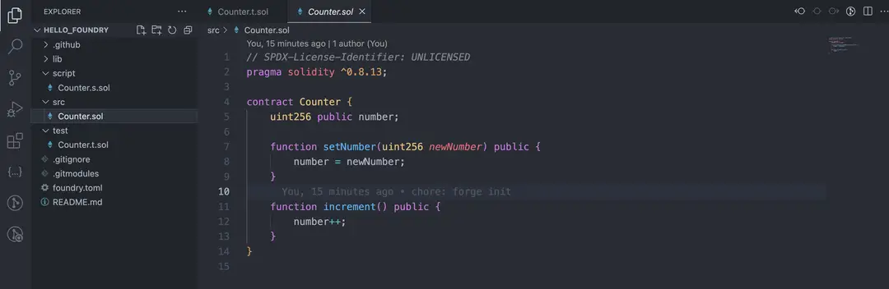
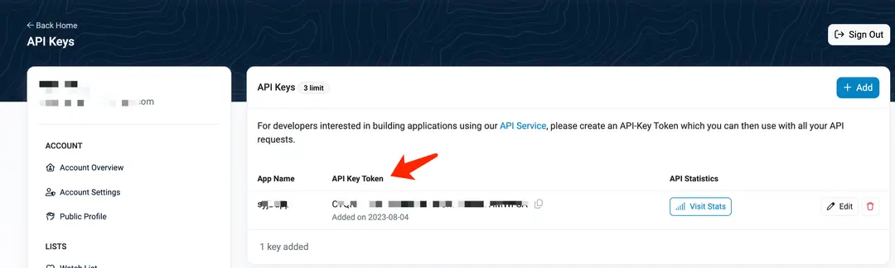
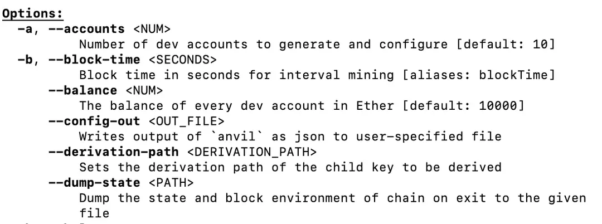

## 什么是 Foundry

Foundry 是一个 Solidity 框架，用于构建、测试、模糊、调试和部署 Solidity 智能合约，Foundry 的优势是以 Solidity 作为第一公民，完全使用 Solidity 进行开发与测试，如果你不太熟悉 JavaScript，使用 Foundry 是一个非常好的选择，而且 Foundry 构建、测试的执行速度非常快。Foundry 的测试功能非常强大，通过 cheatcodes 来操纵区块链的状态，可以方便我们模拟各种情况，还支持基于属性的模糊测试。Foundry 用 Rust 语言编写，包含了一系列的可以与 Ethereum 网络交互的工具。主要有：

● Forge 用来进行合约的测试。

● Cast 很方便的与合约进行交互，发交易，查询链上数据。

● Anvil 可以模拟一个私有节点。

● Chisel 可以在命令行快速的有效的实时的写合约，测试合约。

## 安装 Foundry

使用 Foundryup 安装

官网：https://getfoundry.sh

Foundryup 是 foundry 工具包的安装器，通过它我们来完成 foundry 的安装，首先，在终端执行如下命令：

```sh
curl -L https://foundry.paradigm.xyz | bash
```

这会下载 foundryup，按照提示设置环境变量或新开窗口，并通过运行它安装 foundry：

```sh
foundryup
```

安装完成后，会自动安装 forge, cast, anvil, Chisel 工具。可以通过如下命令验证是否安装成功：

```sh
forge --version
```

这会显示 Forge 的版本号，确认 Forge 是否已成功安装在您的系统上。

ℹ️ 如果是 Windows 操作系统，需要安装使用 Git BASH 或者 WSL 作为命令终端，因为 Foundryup 当前并不支持 Powershell 或 Cmd.

如果安装的时候遇到：

```sh
curl: (7) Failed to connect to raw.githubusercontent.com port 443: Connection refused
```

可以把系统的 DNS 设置成：114.114.114.114 或者 8.8.8.8，再尝试下载

## Forge init：初始化项目

创建新项目

首先，使用如下命令创建名为 hello_foundry 的 demo 项目：

```sh
> forge init hello_foundry
Installing forge-std in /Users/user/vsc_workspace/hello_foundry/lib/forge-std (url: Some("https://github.com/foundry-rs/forge-std"), tag: None)
    Installed forge-std v1.8.1
    Initialized forge project
```

init 命令会创建一个项目目录，并安装好 forge-std 库。创建好的 Foundry 工程结构为：

```sh
> tree -L 2
.
├── README.md
├── foundry.toml
├── lib
│   └── forge-std
├── script
│   └── Counter.s.sol
├── src
│   └── Counter.sol
└── test
    └── Counter.t.sol

6 directories, 5 files
```

● src：智能合约目录

● script：部署脚本文件

● lib: 依赖库目录

● test：智能合约测试用例文件夹

● foundry.toml：配置文件，配置连接的网络 URL 及编译选项。

我们用 VSCode 打开该项目，如下：



Counter.sol 是一个简单的计数器，具有 uint256 类型的状态变量 number，并通过函数 setNumber 和 increment 进行状态变量的赋值和累加。

### 合约编译及测试

可以通过 forge build 命令对合约进行编译，如果 foundry.toml 文件未指定 Solc 编译器版本，则默认使用最新的版本。编译好的文件 (合约 ABI，bytecode )，会放在 out 的文件夹中。

```sh
> forge build
[⠢] Compiling...
[⠒] Installing Solc version 0.8.25
[⠒] Successfully installed Solc 0.8.25
[⠑] Compiling 27 files with 0.8.25
[⠘] Solc 0.8.25 finished in 1.02s
Compiler run successful!
```

可以通过 forge test 命令执行合约的测试用例

```sh
> forge test
[⠒] Compiling...
[⠃] Installing Solc version 0.8.25
[⠰] Successfully installed Solc 0.8.25
No files changed, compilation skipped

Ran 2 tests for test/Counter.t.sol:CounterTest
[PASS] testFuzz_SetNumber(uint256) (runs: 256, μ: 30688, ~: 31310)
[PASS] test_Increment() (gas: 31325)
Suite result: ok. 2 passed; 0 failed; 0 skipped; finished in 20.09ms (15.70ms CPU time)

Ran 1 test suite in 115.23ms (20.09ms CPU time): 2 tests passed, 0 failed, 0 skipped (2 total tests)
```

## Forge test

### 执行测试 (1)

#### 概述

使用 Foundry 写测试是非常方便的，直接使用 forge test 命令，可以一键把所有的 test 包下的测试用例都执行一遍，并打印出 forge 测试的结果 (通过与否)，错误的原因，以及执行的耗时。这里有关于测试的一些约定：

● 测试用例位于 test 包下，通常使用\*\*\*.t.sol 为结尾来命名测试文件。

● 测试方法的命名，是由 test\_ 为前缀，后面遵循驼峰命名法。

● 继承 forge-std 标准库下的 Test.sol 合约来编写测试用例。

#### 测试合约

如下是 test/Counter.t.sol 测试文件，它使用了标准库里的 Test.sol 合约。其中的 setUp 函数用于测试前的初始化：创建新合约并为状态变量赋初始值；test_xxx 为被 forge 自动调用的测试函数，assertEq 用来断言修改后的状态变量跟预期值相等，当然还有 assertNotEq 函数用来断言两个数不相等。

```solidity
// SPDX-License-Identifier: UNLICENSED
pragma solidity ^0.8.13;

import {Test, console} from "forge-std/Test.sol";
import {Counter} from "../src/Counter.sol";

contract CounterTest is Test {
    Counter public counter;

    function setUp() public {
        counter = new Counter();
        counter.setNumber(0);
    }

    function test_Increment() public {
        counter.increment();
        assertEq(counter.number(), 1);
    }

    function testFuzz_SetNumber(uint256 x) public {
        counter.setNumber(x);
        assertEq(counter.number(), x);
    }
}
```

#### 执行测试

我们可以通过如下三种方式执行测试用例：

● forge test 命令，可以一键把所有的 test 包下的测试用例都测试一遍。执行后，在命令行中会打印出 forge 测试的结果 (通过与否)，错误的原因，以及执行的耗时。

● forge test --match-path test/Counter.t.sol 命令，使用 --match-path 来指定某一路径下的文件来进行测试。

● forge test --match-contract CounterTest --match-test test_Increment 命令，用 --match-contract 来指定测试合约的名称，其中 --match-test 用来指定调用的测试方法。

> 注意：--match-path 后跟的是文件名，而 --match-contract 后面跟的是合约名，填写参数时要注意匹配条件是否正确。

#### Forge test：执行测试 (2)

上节我们通过 test_Increment 函数和 assertEq 断言验证测试是否执行成功。同样的，我们还可以验证测试是否执行失败，即是否触发了 Revert 操作。如果触发了 Revert，则符合预期，测试通过。否则测试不通过。

#### 验证 Revert：testFail_xxx

可以使用 testFail_xxx 来验证是否触发了 Revert 操作。

```solidity
pragma solidity 0.8.10;

import "forge-std/Test.sol";

contract ContractBTest is Test {
    uint256 testNumber;

    function setUp() public {
        testNumber = 42;
    }

    function testFail_Subtract43() public {
        testNumber -= 43;
    }
}
```

函数 testFail_Subtract43 执行后 testNumber 会变成负值，但 uint256 是无符号类型，即不存在负值，因此该函数会执行失败，因此通过 testFail_xxx 的语法我们可以得到预期的失败结果，如下：

```sh
> forge test --match-path test/CounterB.t.sol

Compiler run successful!

Ran 1 test for test/CounterB.t.sol:ContractBTest
[PASS] testFail_Subtract43() (gas: 2396)
Suite result: ok. 1 passed; 0 failed; 0 skipped; finished in 5.28ms (424.88µs CPU time)

Ran 1 test suite in 173.19ms (5.28ms CPU time): 1 tests passed, 0 failed, 0 skipped (1 total tests)
```

结果中的 PASS 表示测试通过，并且列出了测试所消耗的 gas，即函数如我们所愿的失败了。除了使用 testFail_xxx 的方式，我们还可以结合 cheatcode 来实现同样的功能，如下：

#### 验证 Revert：Cheatcodes

Cheatcodes 允许我们模拟各种情况和行为，包括改变合约的状态、模拟不同的交易、调整时间和块号等。这里我们使用它来模拟 Revert 情况，以测试合约的异常处理逻辑。

```solidity
function test_CannotSubtract43() public {
    vm.expectRevert(stdError.arithmeticError);
    testNumber -= 43;
}
```

它使用了 vm.expectRevert(stdError.arithmeticError); 来期望一个 Revert。这意味着我们期待这次减法操作会因为算术错误而触发 Revert。如果测试执行了减法操作但没有触发 Revert，测试将会失败，否则测试通过。它的执行结果如下：

```solidity
> forge test --match-path test/CounterB.t.sol
Compiler run successful!

Ran 2 tests for test/CounterB.t.sol:ContractBTest
[PASS] testFail_Subtract43() (gas: 2396)
[PASS] test_CannotSubtract43() (gas: 5754)
Suite result: ok. 2 passed; 0 failed; 0 skipped; finished in 5.01ms (831.63µs CPU time)

Ran 1 test suite in 165.94ms (5.01ms CPU time): 2 tests passed, 0 failed, 0 skipped (2 total tests)
```

> ⚠️注意：测试函数必须具有 external 或 public 可见性。声明为 internal 或 private 的函数不会被 Forge 处理，即使它们的前缀是 test。

#### 日志信息

我们还可以在测试用例用 console2.sol 打印值的结果（console2.sol 包含 console.sol 的补丁，允许 Forge 解码对控制台的调用追踪），修改函数 test_CannotSubtract43 加入 console2.log，修改后的代码为：

```solidity
function test_CannotSubtract43() public {
    vm.expectRevert(stdError.arithmeticError);
    console2.log("currentNumber= %d", testNumber);
    testNumber -= 43;
}
```

forge test 的默认行为是只显示通过和失败测试的摘要。可以使用-vv 标志通过增加日志详细程度。可以看到 Logs 下显示了测试用例中的打印的日志。

```sh
> forge test --match-path test/CounterB.t.sol -vv
Compiler run successful!

Ran 2 tests for test/CounterB.t.sol:ContractBTest
[PASS] testFail_Subtract43() (gas: 2402)
[PASS] test_CannotSubtract43() (gas: 9053)
Logs:
  currentNumber= 42

Suite result: ok. 2 passed; 0 failed; 0 skipped; finished in 5.70ms (1.30ms CPU time)

Ran 1 test suite in 170.65ms (5.70ms CPU time): 2 tests passed, 0 failed, 0 skipped (2 total tests)
```

Forge 中有 5 个测试等级，可以通过 -v 来设置不同的等级。其中 forge test 等同于 forge test -v，会打印测试方法中的 gas 消耗，测试结果汇总情况。

● Level2(-vv) 会打印出测试中的日志，断言，预期结果，错误原因，这些更详尽的信息。

● Level3(-vvv) 会打印出测试失败中的失败堆栈调用。

● Level4(-vvvv) 不仅会打印失败结果的堆栈调用，会把所有的测试中的堆栈调用，全部打印出来。

● Level5(-vvvvv) 始终显示堆栈跟踪和设置跟踪。还显示了对象的创建，每一步的具体分析。

### Forge create：合约部署与验证

#### 概述

Forge 使用 forge create 命令可以部署&验证合约到指定网络，部署时可以完全使用命令行来实现，也可以使用 solidity-scripting 的方式实现，本节我们先介绍前者。

#### 前置准备

合约到区块链，需要先准备有测试币的账号及区块链节点的 RPC URL，后续验证合约时，需要用到区块链浏览器的 ETHERSCAN_API_KEY。我们以 Sepolia 测试网为例：

测试币领取水龙头：https://www.alchemy.com/faucets/ethereum-sepolia，可以通过地址领取，0.5 Sepolia ETH/天。

RPC URL：可以使用 [Alchemy](https://dashboard.alchemy.com/apps) 的节点 RPC，注册后创建指定网络的 app 会自动分配 RPC。

ETHERSCAN_API_KEY：在[以太坊区块链浏览器](https://etherscan.io/)中创建 app，会分配对应的 API KEY TOKEN。



#### 合约代码

我们以部署 ERC20 合约为例，这个合约只有一个构造函数，用来指定 Token 的名称、标识符、精度及初始发行量信息。

```solidity
// SPDX-License-Identifier: UNLICENSED
pragma solidity ^0.8.0;

import {ERC20} from "solmate/tokens/ERC20.sol";

contract MyToken is ERC20 {
    constructor(
        string memory name,
        string memory symbol,
        uint8 decimals,
        uint256 initialSupply
    ) ERC20(name, symbol, decimals) {
        _mint(msg.sender, initialSupply);
    }
}
```

MyToken 合约继承了 solmate 包中的 ERC20 合约，因此需要通过如下命令安装 solmate 依赖：

```sh
forge install transmissions11/solmate
```

#### 部署 Deploying & Verifying

```sh
forge create --rpc-url <your_rpc_url> --private-key <your_private_key> --verify src/MyContract.sol:MyContract --constructor-args <constructor_args>
```

● rpc-url: 即区块链节点 RPC，例如：https://eth-sepolia.g.alchemy.com/v2/xxxxxxxxx

● private-key: 即钱包私钥，建议创建专门用来开发测试的新钱包。

● etherscan-api-key: 即区块链浏览器的 API KEY TOKEN，用于验证合约。

● verify: 验证合约，即在浏览器中开源合约的代码

● :MyContract: 实际部署的合约，由于一个 solidity 中允许存在多个合约，因此这里指定需要部署的合约名称。

● constructor-args: 合约的构造参数，如果没有，可以不设置该属性

执行结果中会打印出部署的交易 hash、部署的合约地址以及验证状态：

```sh
> forge create --rpc-url https://eth-sepolia.g.alchemy.com/v2/xxxxxx \
   --constructor-args "MyToken" "MT" 18 1000000000000000000000  \
   --private-key 0xxxxxxx  \
   --etherscan-api-key xxxx  \
   --verify
   src/MyToken.sol:MyToken

[⠊] Compiling...
No files changed, compilation skipped
Deployer: 0x5CB8896Db7Bf13DE6A6EA362866288e577e4F6C5
Deployed to: 0x9C7DcF024b94d14FFaA04262139f92F3AA837919
Transaction hash: 0x18ac7e8824b1fe19ab79977ec7672f8e8324f621fef01a7c8d971fca152748b8
Starting contract verification...
Waiting for etherscan to detect contract deployment...
Start verifying contract `0x9C7DcF024b94d14FFaA04262139f92F3AA837919` deployed on sepolia

Contract [src/MyToken.sol:MyToken] "0x9C7DcF024b94d14FFaA04262139f92F3AA837919" is already verified. Skipping verification.
```

### Forge verify-contract：验证已存在合约

#### 概述

在本节我们来学习下如何验证已经部署过的合约。

#### 如何验证

对于已经部署过的合约的验证，有点繁琐，它需要提供合约部署时的一系列信息，如下：

```sh
forge verify-contract \
    --chain-id 11155111 \
    --num-of-optimizations 1000000 \
    --watch \
    --constructor-args $(cast abi-encode "constructor(string,string,uint256,uint256)" "ForgeUSD" "FUSD" 18 1000000000000000000000) \
    --etherscan-api-key <your_etherscan_api_key> \
    --compiler-version v0.8.10+commit.fc410830 \
    <the_contract_address> \
	    src/MyToken.sol:MyToken
```

首先我们需要合约的基本信息：

● the_contract_address：已部署合约的地址。

● <path>:<contractname>：合约源码的路径及合约名称，如果合约文件中包含多个合约，需要使用 :MyContract 这种方式指定具体的合约。

● etherscan-api-key：区块链浏览器的 API KEY TOKEN，用于验证合约。

以及部署合约时的环境信息：

● constructor-args：合约构造器的参数，以 ABI-encoded 形式提供，如果没有构造器参数，该属性可忽略。

● compiler-version：合约编译器版本。如果没有指定则会自动检测。

● num-of-optimizations：Solidity 编译器在进行优化时迭代运行的次数。请注意，如果在验证时未设置优化次数，则默认为 0，而如果在部署时未设置，则默认为 200，因此，如果保留默认编译设置，需要使用--num-of-optimizations 200 来确保验证通过。

● chain-id：测试网的 ID，sepolia 测试网为 11155111。

● watch：用于查询验证结果。

#### 执行验证

我们在项目的目录下执行该命令，合约的部署地址为 0x18A5A03d871BFb182e29b5951cf708397E48dB1C，需要注意的是，合约的代码需要跟部署时完全一致，否则编译后的 bytecode 不匹配会导致验证失败，另外构造函数的参数也要保持一致。

```sh
forge verify-contract \
    --chain-id 11155111 \
    --num-of-optimizations 200 \
    --watch \
    --constructor-args $(cast abi-encode "constructor(string,string,uint256,uint256)" "MyToken" "MT" 18 1000000000000000000000) \
    --etherscan-api-key xxxxxx \
   0x18A5A03d871BFb182e29b5951cf708397E48dB1C \
    src/MyToken.sol:MyToken
Start verifying contract `0x18A5A03d871BFb182e29b5951cf708397E48dB1C` deployed on sepolia

Submitting verification for [src/MyToken.sol:MyToken] 0x18A5A03d871BFb182e29b5951cf708397E48dB1C.
Submitted contract for verification:
        Response: `OK`
        GUID: `a5gxzjgmwt7cdqwjgr5fzwvq6rvqn7mkxlkbywk9rahyd7gvxe`
        URL: https://sepolia.etherscan.io/address/0x18a5a03d871bfb182e29b5951cf708397e48db1c
Contract verification status:
Response: `OK`
Details: `Pass - Verified`
Contract successfully verified
```

注意⚠️：验证时可能会提示跟 etherscan 链接失败：error trying to connect: Connection reset by peer (os error 54)，这种通常是网络原因造成的，并不是命令错误导致的。

### ForgeScript：使用脚本部署与验证

#### 概述

通过 forge create 命令进行合约的部署&验证需要输入的参数较多，更推荐的做法是使用 solidity-scripting，它是一种使用 Solidity 以声明方式部署合约的方法，而不是 Javascript。

#### 项目配置

我们准备把上节的 MyToken 合约部署到 Sepolia 测试网，需要稍微配置 Foundry 项目。

1. 创建 .env 文件保存隐私信息（如：节点 RPC、私钥等），.env 文件应遵循以下格式：

```sh
// 区块链 RPC 节点地址
SEPOLIA_RPC_URL=xxxx
// 钱包私钥
PRIVATE_KEY=xxxx
// 区块链浏览器的 API KEY TOKEN
ETHERSCAN_API_KEY=xxxx
```

2. 编辑 foundry.toml 文件，将以下行添加到文件末尾，这里指定了 .env 中配置的变量。

```sh
[rpc_endpoints]
sepolia = "${SEPOLIA_RPC_URL}"

[etherscan]
sepolia = { key = "${ETHERSCAN_API_KEY}" }
```

3.创建测试脚本。项目根目录中创建一个文件夹并将其命名为 script，并在其中创建一个名为 MyToken.s.sol 的文件，这是我们将创建部署脚本的地方。如下：

```sh
// SPDX-License-Identifier: UNLICENSED
pragma solidity ^0.8.25;

import {Script} from "forge-std/Script.sol";
import "../src/MyToken.sol";

contract MyTokenScript is Script {

    function run() external {
        uint256 deployer = vm.envUint("PRIVATE_KEY");

        vm.startBroadcast(deployer);

        MyToken myToken = new MyToken("MyToken", "MT", 18, 1000000000000000000);
        vm.stopBroadcast();
    }
}
```

这个部署脚本本身就是一个智能合约，因此它就像任何其他用 Solidity 编写的智能合约一样，必须指定 pragma version。同时，继承 Forge 标准库中的 Script 合约 contract MyTokenScript is Script，默认情况下，脚本是通过调用名为 run 的函数（我们的入口点）来执行的。

```sh
uint256 deployer = vm.envUint("PRIVATE_KEY");
```

这里从我们的 .env 文件中加载私钥。

```sh
vm.startBroadcast(deployer);
```

这是一个特殊的作弊码，使用指定的账户签署交易并在链上广播交易，这会触发链上的智能合约部署或调用，从而在区块链上产生真实的交易和区块记录。我们传递 deployer 以指示它使用该密钥来签署交易。稍后，我们将广播这些交易以部署我们的 MyToken 合约。

```sh
MyToken myToken = new MyToken("MyToken", "MT", 18, 1000000000000000000);
```

在这里我们创建了 MyToken 合约，因为我们在这行之前调用了 vm.startBroadcast()，创建合约的交易将被 Forge 在链上广播并完成合约的部署。

#### 执行部署及验证

将我们之前提到的变量添加到 .env 中，并在项目的根目录执行以下命令：

```sh
# 加载 .env 文件中的变量
source .env

# 部署并验证合约
forge script script/MyToken.s.sol:MyTokenScript --rpc-url $SEPOLIA_RPC_URL --broadcast --verify -vvvv
```

Forge 将运行我们的脚本并为我们广播交易——这可能需要一些时间，因为 Forge 还将等待交易收据。大约一分钟后，您应该会看到类似这样的内容，包含了合约的部署地址、gas 消耗、交易 hash 以及验证结果等：

```sh
> forge script script/MyToken.s.sol:MyTokenScript --rpc-url $SEPOLIA_RPC_URL --broadcast --verify -vvvv

// ...

== Logs ==
  MyToken deployed on 0xA4d3C606ad7731e5Aa0CE6D79060E7A74D7DAba0


==========================

Chain 11155111

Estimated gas price: 3.000231466 gwei

Estimated total gas used for script: 968059

Estimated amount required: 0.002904401072744494 ETH

==========================
##
Sending transactions [0 - 0].
⠁ [00:00:00] [########################################################################################################################] 1/1 txes (0.0s)##
Waiting for receipts.
⠉ [00:00:13] [####################################################################################################################] 1/1 receipts (0.0s)
##### sepolia
✅  [Success]Hash: 0x3d6150e746d44665ceb845a530222c215c6cdab5ff728c352bd9d3845d73feb0
Contract Address: 0xA4d3C606ad7731e5Aa0CE6D79060E7A74D7DAba0
Block: 5525173
Paid: 0.00223486014132905 ETH (744923 gas * 3.00012235 gwei)


==========================

ONCHAIN EXECUTION COMPLETE & SUCCESSFUL.
Total Paid: 0.00223486014132905 ETH (744923 gas * avg 3.00012235 gwei)
##
Start verification for (1) contracts
Start verifying contract `0xA4d3C606ad7731e5Aa0CE6D79060E7A74D7DAba0` deployed on sepolia

Submitting verification for [src/MyToken.sol:MyToken] 0xA4d3C606ad7731e5Aa0CE6D79060E7A74D7DAba0.
Submitted contract for verification:
        Response: `OK`
        GUID: `br211fmqfsf5fn7u5c1qj3pbjvsvh6i84zkhr7nru8s39kyuif`
        URL: https://sepolia.etherscan.io/address/0xa4d3c606ad7731e5aa0ce6d79060e7a74d7daba0
Contract verification status:
Response: `NOTOK`
Details: `Pending in queue`
Contract verification status:
Response: `OK`
Details: `Pass - Verified`
Contract successfully verified
All (1) contracts were verified!
```

这确认您已成功将 MyToken 合约部署到 Sepolia 测试网，并已在 Etherscan 上对其进行了验证，所有这些都通过一个命令完成！

## 什么是 Cast

Cast 是 Foundry 用于执行以太坊 RPC 调用的命令行工具。您可以使用 Cast 进行智能合约调用、发送交易或检索任何类型的链数据。

### 如何使用 Cast

要使用 Cast，请在命令行工具运行 cast 命令，然后运行子命令：

```sh
$ cast <subcommand>
```

### 例子

比如我们可以使用 cast 来获取 DAI 代币的总供应量：

```sh

cast call 0x6b175474e89094c44da98b954eedeac495271d0f "totalSupply()(uint256)" --rpc-url <your rpc url> 8603853182003814300330472690
```

结果会输出：

```sh
3214023094757495931935215279 [3.214e27]
```

我们可以使用 cast 发送任意消息。下面是在两个帐户之间发送消息的示例。

```sh
cast send --private-key <Your Private Key> 0x3c44cdddb6a900fa2b585dd299e03d12fa4293bc $(cast from-utf8 "hello world") --rpc-url http://127.0.0.1:8545/
```

### Cast 获取链上基础信息

#### 介绍

本节我们来学习利用 Cast 获取链上基础信息的命令。Cast 是一个强大的命令行工具，使开发者能够与以太坊链进行交互，执行各种查询和交易任务。掌握 Cast 的使用将极大地提升你开发智能合约的效率。还记得我们上节课使用 cast 来获取 DAI 代币的总供应量的例子吗

```sh
cast call 0x6b175474e89094c44da98b954eedeac495271d0f "totalSupply()(uint256)"
--rpc-url <your rpc url>
8603853182003814300330472690
```

我们通过 --rpc-url 属性定义了以太坊 RPC URL，其实我们可以通过设置以太坊 RPC URL 的环境变量来与以太坊区块链进行交互，这样我们就不需要在每次运行命令时单独设置。

```sh
export ETH_RPC_URL="https://eth-mainnet.alchemyapi.io/v2/Lc7oIGYeL_......"
```

#### cast chain-id

使用 cast chain-id 命令可以快速获取当前链的 ID，这是识别和确认你正在正确的区块链上操作的一个关键步骤。例如，在部署合约或验证交易时，确保链 ID 的准确性至关重要。

```sh
cast chain-id
1(0x1)
```

#### `cast chain` `cast client`

我们还可以使用 cast chain 获取当前链的名称，使用 cast client 获取当前客户端的版本：

```sh
cast chain
ethlive

cast client
Geth/v1.13.13-stable-7f131dcb/linux-amd64/go1.21.7
```

#### cast gas-price

cast gas-price 命令为开发者提供了一个快速获取当前 gas 价格的途径，这对于估算交易成本非常有用。了解当前的 gas 价格可以帮助开发者更精确地设定交易的 gas limit，避免过高的交易费用或因 gas 不足导致的交易失败。

```sh
cast gas-price
10325245432
```

### Cast 获取区块信息

#### 介绍

在这一节课中，我们将学习如何使用 Cast 来获取以太坊区块链上的区块信息。这些命令是理解以太坊区块链上区块动态信息的关键工具，并且对于区块链开发者来说，掌握这些命令能够帮助进行有效的区块分析和监控。

#### cast block-number

使用 cast block-number 命令可以查询最新的区块号。这是追踪区块链当前状态的基本操作，非常有用于确定网络的最新交易和智能合约的活动状态。

结果输出示例：

```sh
cast block-number
19732815
```

#### cast basefee

cast basefee 命令允许你获取指定区块的基础费用。London 升级后，基础费用成为交易费用的一个组成部分，理解这一点对于估算交易成本非常重要。
使用方法示例：

```sh
cast basefee
11721855264
```

#### cast block

通过 cast block 命令，我们可以获取到指定区块的详细信息，如区块高度、时间戳、交易数等。这个命令是深入理解区块链状态变化的强大工具。

使用方法示例：

```sh
cast block 12345678
{
  "number": "12345678",
  "timestamp": "1618304000",
  "transactions": "210",
  "miner": "0x..."
  ......
}
```

#### cast age

cast age 命令用于获取指定区块的时间戳，即区块生成的具体时间。这可以帮助开发者跟踪事件的具体发生时间，并分析区块链数据的时间序列。

使用方法示例：

```sh
cast age
Thu Apr 25 13:59:47 2024
```

### Cast 获取账户信息

了解如何检查账户信息是进行智能合约开发和交易分析的基础，对于监控资金流动、验证交易和理解账户状态非常重要。

#### cast balance

cast balance 命令用于获取特定以太坊账户地址或 ENS 名称的当前余额，单位是 wei。这个命令是日常区块链操作中经常使用的，无论是在开发智能合约、执行交易前的检查，还是简单地监控账户状态。

#### 获取账户余额

要查询一个账户的余额，你只需要提供账户的地址或者 ENS 名称。这个功能非常有用，尤其是在处理多个账户或需要快速检查资金状态时。

使用方法示例：

```sh
cast balance 0x123...
```

输出结果将显示账户在以太坊上的当前余额，单位是 wei。

#### 使用 ENS 名称查询余额

如果你有一个 ENS 名称，你也可以直接使用它来查询余额，而不需要知道背后的具体地址。这简化了操作，特别是当记住或处理复杂的以太坊地址不便时。

使用方法示例：

```sh
cast balance vitalik.eth
```

输出结果同样显示该 ENS 名称对应的账户余额。

### Cast 发送交易

本节课我们将学习如何使用 Cast 工具发送交易，并与已部署在以太坊链上的智能合约进行交互。掌握这些技能对于智能合约开发者来说至关重要，它允许你执行合约函数、触发合约的 fallback 和 receive 函数。

#### 调用合约函数

如果你拥有账户的私钥和合约地址，你可以通过 cast send 命令调用合约上的任何函数。这为开发者提供了一种直接与智能合约互动的方式，无论是存款、提款还是修改合约状态。

使用方法示例：

```sh
cast send --private-key <private_key_addr> <contract_addr> "exampleFunc(uint256)" <argument_value_of_the_function>
```

#### 示例：存款函数

例如，要向合约发送一个存款请求，你可以使用以下命令：

```sh
cast send --private-key 0x123... 0xabc... "deposit(uint256)" 10
```

这条命令会向地址为 0xabc... 的合约发送一个调用 deposit 函数的请求，存款金额为 10 wei。

#### 触发 Fallback 函数

如果调用合约中不存在的函数，将自动触发 Fallback 函数。这可以用于测试合约的异常处理或特定的功能。使用方法示例：

```sh
cast send --private-key <private_key_addr> <contract_addr> "dummy()"
```

#### 示例：调用不存在的函数

你可以通过以下命令测试合约的 Fallback 函数响应：

```sh
cast send --private-key 0x123... 0xabc... "dummy()"
```

#### 触发 Receive 函数

通过向合约发送以太币（Ether），可以触发合约的 Receive 函数。这对于接受捐款或处理支付非常有用。使用方法示例：

```sh
cast send --private-key <private_key_addr> <contract_addr> --value 10gwei
```

#### 示例：发送以太币

以下命令展示了如何发送 10 gwei 的以太币到合约，触发接收函数：

```sh
cast send --private-key 0x123... 0xabc... --value 10gwei
```

### Cast 获取合约代码

在本节课中，我们将学习如何使用 Cast 工具从 Etherscan 获取智能合约的源代码。对于区块链开发者来说，能够审查和理解链上合约的源代码是非常重要的，这有助于分析合约功能和验证其安全性。

#### 获取合约源代码

cast etherscan-source 命令允许你快速从 Etherscan 网站获取指定合约的源代码。这是一个强大的功能，因为它让开发者能够审查在以太坊上公开部署的任何合约的具体实现。

使用方法示例：

```sh
cast etherscan-source <contract_address>
```

#### 示例：获取源代码

如果你想查看特定合约的源代码，可以通过以下命令实现：

```sh
cast etherscan-source 0x123...
```

这条命令将查询 Etherscan 以获取地址为 0x123... 的智能合约的源代码，并将其显示出来。

## Anvil

Anvil 是 Foundry 套件的一部分，专为提供一个便于本地测试和开发的以太坊节点而设计。作为 Foundry 的一部分，Anvil 与 Forge、Cast 和 Chisel 一起，为智能合约开发者提供了一个完整的工具集，以支持从开发到测试的整个生命周期。

### Anvil 的功能和重要性

Anvil 允许开发者在本地环境中运行一个轻量级的以太坊节点，这使得从前端测试智能合约或通过 RPC 接口与合约进行交互变得简单快捷。它是一个理想的工具，特别适合需要频繁迭代和即时反馈的开发过程。

### 安装 Foundry 和 Anvil

如果你还没有安装 Foundry，你需要先进行安装，因为 Anvil 是作为 Foundry 套件的一部分提供的。安装过程简单，通常只需要几个步骤即可完成。如果你已经安装了 Foundry 的旧版本，可能需要通过运行 foundryup 来更新到最新版本，以确保包括 Anvil 在内的所有工具都是最新的。

### 如何使用 Anvil

要启动 Anvil，只需在命令行中输入 anvil，它将自动启动一个本地节点。启动后，你将看到一系列已生成的开发账户和私钥，以及节点侦听的地址和端口信息。

### 命令示例

```sh
anvil
```

输出将包括多个开发账户、私钥以及监听的端口。

```sh
Available Accounts
==================

(0) 0xf39Fd6e51aad88F6F4ce6aB8827279cffFb92266 (10000.000000000000000000 ETH)
.....

Private Keys
==================

(0) 0xac0974bec39a17e36ba4a6b4d238ff944bacb478cbed5efcae........
.....


Chain ID
==================

31337

Base Fee
==================

1000000000

Gas Limit
==================

30000000

Genesis Timestamp
==================

1714205976

Listening on 127.0.0.1:8545
```

### Anvil 基本配置选项

#### 访问 Anvil 的配置选项

通过在命令行中执行 `anvil -h`，你可以查看所有 Anvil 提供的配置选项。这些选项涵盖了从账户管理到节点性能等多个方面，使得 Anvil 成为一个高度灵活和可配置的开发工具。

```sh
anvil -h
```

执行此命令后，你将看到一个详细的帮助菜单，列出了所有可用的命令和参数，以及它们的用途和默认值。



#### 基本配置选项

Anvil 的配置选项允许开发者定制本地测试环境，以下是一些基本的配置参数：

#### 生成和配置开发账户数量

默认情况下，Anvil 生成 10 个开发账户，但你可以通过以下命令指定生成更多或更少的账户：

```sh
anvil -a  <NUM>
          Number of dev accounts to generate and configure
          [default: 10]
```

例如，如果你需要 20 个开发账户，可以使用：

```sh
anvil -a 20
```

#### 设置使用的 EVM 硬分叉版本

虽然默认情况下 Anvil 使用最新的 EVM 硬分叉版本，但开发者可能需要针对特定的硬分叉版本进行测试，这可以通过以下命令完成：

```sh
anvil --hardfork <HARDFORK>
```

例如，如果你需要设置为“istanbul”硬分叉，可以使用：

```sh
anvil --hardfork istanbul
```

设置节点监听的端口号
默认端口为 8545，但如果该端口已被占用或你需要运行多个节点实例，可以通过以下命令更改端口号：

```sh
anvil -p, --port <PORT>
```

例如，设置为端口 8546：

```sh
anvil -p 8546
```

## Chisel

Chisel 是一个 Solidity REPL（"读取 - 评估 - 打印 循环 "的缩写），它允许开发人员编写和测试 Solidity 代码片段。它提供了一个交互式环境，用于编写和执行 Solidity 代码，同时还提供了一组内置命令，用于处理和调试您的代码。这种工具特别适合进行快速的代码实验和问题调试。

### Chisel 的功能和重要性

作为 Foundry 套件的一部分，Chisel 与 Forge、Cast 和 Anvil 一同安装，形成了一套完整的智能合约开发和测试工具。Chisel 的交互式环境允许开发者即时运行 Solidity 代码并获取反馈，这大大加速了开发和测试流程。

### 安装 Foundry 和 Chisel

如果你还未安装 Foundry，需要首先进行安装，以便可以使用 Chisel 及其它工具。如果你已经安装了 Foundry 的旧版本，可能需要运行 foundryup 命令来更新至最新版本，以确保包括 Chisel 在内的所有组件都是最新的。

### Chisel 的使用方法

#### 启动 Chisel

启动 Chisel 非常简单，只需在命令行中输入 chisel 即可。启动后，你可以直接在命令行中编写和测试 Solidity 代码。

```sh
chisel
```

在 Chisel 环境中，每次输入代码后，Chisel 都会提供详细的执行反馈，帮助你理解代码的行为和潜在问题。

#### Chisel 中的输入方式

在 Chisel 中，你可以通过两种主要方式输入代码：表达式和语句。

#### 表达式

表达式是可以求值的代码片段，它们返回一个值但不改变会话状态。表达式在计算后不会留在会话中。

#### 示例

● 获取地址余额：

```solidity
address(0).balance
```

● 编码多个参数：

```solidity
abi.encode(256, bytes32(0), "Chisel!")
```

● 调用视图函数：

```solidity
myViewFunc(128)
```

● 位运算示例：

```solidity
1 << 8  // 输出结果为 256 的 uint256
```

#### 语句

语句是指那些旨在保持或修改会话状态的代码片段。这包括变量定义、不改变状态的函数调用以及合约、函数、事件、错误、映射或结构体的定义。要将表达式作为语句执行，可以在其末尾添加分号（;）。

#### 示例

● 定义变量：

```solidity
uint256 a = 0xa57b;
```

● 调用状态修改函数或多个函数：

```solidity
myStateMutatingFunc(128) || myViewFunc(128);
```

● 定义内部函数：

```solidity
function hash64(bytes32 _a, bytes32 _b) internal pure returns (bytes32 _hash) {
  assembly {
    // Store the 64 bytes we want to hash in scratch space
    mstore(0x00, _a)
    mstore(0x20, _b)

    // Hash the memory in scratch space
    // and assign the result to `_hash`
    _hash := keccak256(0x00, 0x40)
  }
}
```

● 定义事件和结构体：

```solidity
event ItHappened(bytes32 indexed hash);
struct Complex256 { uint256 re; uint256 im; }
```
