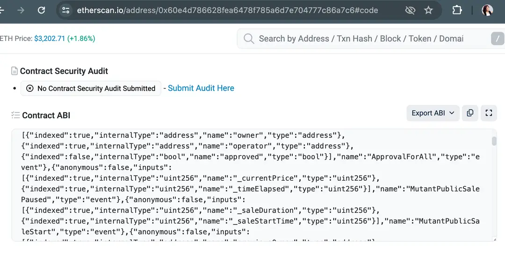

# 概述

Ethers.js 是一个使用 Typescript 编写的库，用于构建去中心化应用程序（DApps）的前端，或者与以太坊网络进行交互。它抽象了许多复杂性，使开发人员能够简单直观地构建 DApp。这课程内容将基于以太坊 js v6 进行。

使用 ethers.js 的好处

1. 轻量。v6.12.0 缩小后仅为 394.8 KB。
2. 使用 Typescript 编写，确保类型的安全，并在编译时识别问题，而非等到运行时。
3. 网络连接和私钥由 Provider 和 Wallet 类分别管理，使其更加安全。
4. 它与 Node.js 和现代 Web 浏览器兼容，允许开发人员在各种环境中使用它。
5. 其 API 使用简单易懂。
6. 对以太坊名称服务（ENS）的本地支持。
7. 它不断积极维护和更新。

主要的类

1. 合约 (Contracts)

它提供了与智能合约交互的实用程序，包括用于部署合约、实例化合约、调用合约方法和监听合约事件的类。

2. 签名者（Signer)

它处理私钥，对消息和交易进行签名，发送已签名交易，并在此过程中修改区块状态。

3. 钱包 (Wallets)

它提供了安全管理帐户和私钥的功能。它包括从助记词短语生成钱包、从私钥导入钱包、与硬件钱包交互以及签名交易的类。它是 Signer 的子类。

4. 提供者（Providers)

它提供了连接到以太坊网络并从区块链中检索数据的功能，包括用于 HTTP、WebSockets 等的提供者。

5. 实用程序 (Utilities)

它提供了将令牌单位从人类友好的格式转换为区块链兼容格式的功能，例如从 ETH 到 Wei，反之亦然。它还处理各种数据种类的编码和解码，以及一些加密操作。
Ethers.js 是一个帮助开发人员构建 DApp 的工具。它仍在更新和构建以提供易于使用的 SDK。您可以在这里加入其构建者社区。

提供者类（Provider Class)

ethers.js 的 Providers 类提供了连接到以太坊网络的抽象。它只能从区块链中读取信息，不处理用户的私钥，因此使用起来更安全。ethers.js 有几种提供者，以下是其中两种常见的：

```ts
ethers.getDefaultProvider()
It retrieves a default provider instance without explicitly specifying a node’s URL.
const provider = ethers.getDefaultProvider("network");
```

💡 支持的网络：goerli kovan sepolia classicKotti optimism-goerli arbitrum-goerli matic-mumbai bnbt

💡 支持的服务：alchemy ankr cloudflare chainstack etherscan infura publicPolygon quicknode
ethers.JsonRpcProvider

它允许我们使用 JSON-RPC（远程过程调用）协议连接到以太坊节点。它主要设计用于通过 HTTP 使用。
const provider = new ethers.JsonRpcProvider('YOUR PROVIDER ADDRESS');

### 获取 URL

以下是几种获取节点 URL 的方法：

1. Infura: Infura 是一个流行的以太坊节点提供者，提供免费和付费计划。您可以在 Infura 上注册账户并获取要连接到的以太坊网络的 URL。URL 通常如下所示：https://mainnet.infura.io/v3/YOUR_PROJECT_ID

2. Alchemy: 您也可以获取要连接到的节点的 URL，URL 通常如下所示：https://eth-mainnet.alchemyapi.io/v2/YOUR_API_KEY

3. 本地节点 (Ganache, Geth, etc.): 您还可以使用 Ganache 或 Geth 等工具运行本地节点。默认的 URL 如下所示：http://localhost:8545

4. 公共以太坊网络：对于像主网、Ropsten、Rinkeby 等公共以太坊网络，您可以找到提供免费访问或注册付费服务的公共节点提供者。

```ts
import { ethers } from 'ethers';

const { getDefaultProvider, JsonRpcProvider } = ethers;

async function main() {
  try {
    // DefaultProvider
    const providerMainnet = ethers.getDefaultProvider('mainnet');
    const providerSepolia = ethers.getDefaultProvider('sepolia');
    const providerMatic = ethers.getDefaultProvider('matic', {
      exclusive: ['etherscan', 'infura'],
    });

    const blockNumberMainnet = await providerMainnet.getBlockNumber();
    const blockNumberSepolia = await providerSepolia.getBlockNumber();
    const blockNumberMatic = await providerMatic.getBlockNumber();

    console.log('provider Mainet:', blockNumberMainnet);
    console.log('provider Sepolia:', blockNumberSepolia);
    console.log('provider matic:', blockNumberMatic);

    // Local network - if have
    const providerLocal = new JsonRpcProvider('http://localhost:8545');

    // Remote URL - Infura
    const providerInfura = new JsonRpcProvider('https://mainnet.infura.io/v3/your-infura-project-id');
    const blockNumberMainnetInfura = await providerInfura.getBlockNumber();
    console.log('Provider Mainnet (Infura):', blockNumberMainnetInfura);

    // Remote URL - Alchemy
    const providerAlchemy = new JsonRpcProvider('https://eth-mainnet.alchemyapi.io/v2/your-alchemy-API-Key');
    const blockNumberMainnetAlchemy = await providerAlchemy.getBlockNumber();
    console.log('Provider Mainnet (Alchemy):', blockNumberMainnetAlchemy);
  } catch (error) {
    console.error('Error:', error);
  }
}

main();
```

## 从区块链获取信息

以下 Provider 类中一些常用的方法。

getBalance()

获取账户的余额，单位为 wei。

getNetwork()

获取有关网络的信息，例如网络名称、链 ID 等。

getBlockNumber()

获取当前区块号。

getTransactionCount()

返回特定地址的交易数量，包括收入和支出的交易。

getFeeData()

获取与费用相关的数据，如当前的 gas 价格和估计的 gas 限制。

getBlock()

检索有关特定区块的详细信息，包括哈希、时间戳、交易等。

getCode()

获取部署智能合约的字节码。

```ts
import { ethers } from 'ethers';

const { getDefaultProvider } = ethers;

async function main() {
  try {
    const provider = getDefaultProvider('sepolia');

    const balance = await provider.getBalance('0xBf49Bd2B2c2f69c53A40306917112945e27577A4');
    console.log('Balance:', balance.toString());

    const network = await provider.getNetwork();
    console.log('Network fetched:', JSON.stringify(network, null, 2));

    const blockNumber = await provider.getBlockNumber();
    console.log('Block Number:', blockNumber);

    // example address you can replace
    const transactionCount = await provider.getTransactionCount('0xBf49Bd2B2c2f69c53A40306917112945e27577A4');
    console.log('Transaction Count:', transactionCount);

    const feeData = await provider.getFeeData();
    console.log('FeeData:', feeData);

    const block = await provider.getBlock(blockNumber);
    console.log('Block:', block);

    // SimpleCryptoKitties contract deployed on sepolia and we will interact with
    const code = await provider.getCode('0xdaCc865922356723C01305F819E65ffB1b14520D');
    console.log('Code:', code);
  } catch (error) {
    console.error('Error:', error);
  }
}

main();
```

## 合约类（Contract Class）

以太坊区块链的强大之处在于其智能合约。在 ethers.js 中，Contracts 类是部署在以太坊网络上的合约的抽象。它可以获取交易结果和事件，并与智能合约进行交互。Contracts 对象可以是只读的或状态更改的。

只读合约

它接受合约地址、合约 ABI 和提供者作为参数。

```ts
const contract = new ethers.Contract(`address`, `abi`, `provider`);
```

状态更改的合约

它接受合约地址、合约 ABI 和签名者作为参数。

```ts
const contract = new ethers.Contract(`address`, `abi`, `signer`);
```

在下一个章，我们将深入探讨如何从 SimpleCryptoKitties 智能合约中调用信息。

## 获取 ABI

在我们编写合约调用之前，让我们先看一下应用二进制接口（ABI）。ABI 定义了软件组件在二进制级别上如何通信和交互。它指定了数据结构、函数签名以及编码和解码信息的约定。由于区块链上的所有操作都必须编码为二进制数据，我们需要一种简洁的方式来定义常见对象（如字符串和数字）与它们的二进制表示之间的转换。获取智能合约的 ABI 有几种方法，我们将在这里

讨论 3 种方法：

1. 区块链浏览器：例如，可以在 Etherscan 中找到合约 ABI，通过合约地址搜索，然后转到“合约”选项卡，并搜索“合约 ABI”。



2. 标准库：许多智能合约使用标准的第三方库或框架，如 OpenZeppelin，它们提供了预先构建的合约及其相应的 ABI。您可以在它们的文档中找到。

3. 开发工具：像 Truffle、Hardhat 或 Remix 这样的工具通常提供了从部署的合约中提取 ABI 的实用工具。

ABI 是与智能合约进行交互的关键组件。将 ABI 包含在您的应用代码中不仅是一种最佳实践，还确保了您应用的可靠性。

### ABI 对象

现在，让我们开始编写代码。之前，我们简要提到了代码，其中包括合约的 ABI。

有多种方式可以包含 ABI。由于我们将与 SimpleCryptoKitties 合约进行交互，以下示例将基于该合约。

我们将查询已铸造的 CryptoKitties NFT 的数量。注意：并非所有来自智能合约的函数或事件都会被应用程序调用。因此，那些没有涉及的部分可以被排除。

#### 直接输入智能合约的 ABI

基于之前在 Sepolia Testnet 上部署的合约，我们创建以下实例：

```ts
const contractAddress = '0xdaCc865922356723C01305F819E65ffB1b14520D';
const contractABI = [
    {
  {
    "inputs": [],
    "name": "ownerOf",
    "outputs": [
      {
        "internalType": "address",
        "name": "",
        "type": "address"
      }
    ],
    "stateMutability": "view",
    "type": "function"
    }];
```

#### 输入函数签名

更简单、更易读的方法是插入函数签名。

```ts
const contractAddress = '0xdaCc865922356723C01305F819E65ffB1b14520D';
const contractABI = 'function ownerOf(unit256 tokenId) returns (address)';
```

随着我们继续进行这门课程，我们将学习 ABI 的作用。

### 签名者 (Signers) 和钱包 (Wallets) 类

在 ethers.js 中另一个重要的类是 Signer 及其派生类 Wallets。它们的功能是签署消息和交易，并将已签署的交易发送到网络。当交易成功包含在区块链中时，它会改变区块链的状态。

#### 签名着 (Signers)

要发送交易，必须拥有一个外部拥有的账户。一个账户通常将其私钥加密并安全地存储在某个地方。

Signers 封装了所有与账户交互的操作。它获取私钥并对交易进行签名。Signers 类不仅可以代表 EOA，还可以代表其他类型的签名者，如合约钱包或外部钱包提供者，例如 MetaMask。由于它是一个抽象类，因此不能直接实例化。必须通过 Wallets 来完成的。

#### 钱包 (Wallets)

Wallets 是 Signers 类的具体实现。它简化了与以太坊区块链的交互。它直接访问私钥管理，并适用于应用程序内部使用。

### 连接钱包

让我们连接到 Wallets。有几种常见的方法可以做到这一点。我们将逐一介绍它们。

#### 使用随机私钥创建新钱包

如果用户没有账户或选择创建新账户，ethers.js 将使用以下代码行从加密的安全熵源创建一个新账户。

```ts
const wallet = ethers.Wallet.createRandom()；
```

#### 使用私钥导入现有账户

如果用户有现有的账户并希望使用它，可以使用以下代码行导入：

```ts
const privateKey = process.env.PRIVATE_KEY;
const wallet = new ethers.Wallet(privateKey, provider)；
```

#### 使用助记词导入现有账户

或者如果用户知道助记词，可以按如下方式导入账户：

```ts
const wallet = ethers.Wallet.fromPhrase(mnemonic.phrase)；
```

#### 从 JSON 文件导入现有账户

I 如果用户有来自钱包应用的加密钱包 JSON 文件，则可以使用以下方法解密账户信息。（这里我们提供了一个简要概述，没有提供代码示例。）

```ts
const wallet = await ethers.Wallet.fromEncryptedJson(json, password);
```

```ts
import { ethers } from 'ethers';

// Note: Keep the private key secure. This is for demonstration purposes only.
// Create a new wallet with a random private key
function createRandomWallet() {
  const wallet = ethers.Wallet.createRandom();
  console.log('New Wallet Address:', wallet.address);
  console.log('New Wallet Private Key:', wallet.privateKey);
  return wallet;
}

// Import an existing account with a private key
async function importWalletWithPrivateKey(privateKey, provider) {
  const wallet = new ethers.Wallet(privateKey, provider);
  console.log('Imported Wallet Address:', wallet.address);
  return wallet;
}

// Import an existing account with a mnemonic
function importWalletWithMnemonic(mnemonic) {
  const wallet = ethers.Wallet.fromPhrase(mnemonic);
  console.log('Imported Wallet Address:', wallet.address);
  return wallet;
}

// Replace with yours own
const privateKey = '';
const mnemonic = '';
const url = '';
async function main() {
  try {
    const provider = new ethers.JsonRpcProvider(url);

    // Create a random wallet
    const randomWallet = createRandomWallet();

    // Import an existing account (using a private key)
    const importedWalletWithPrivateKey = await importWalletWithPrivateKey(privateKey, provider);

    // Import an existing account (using a mnemonic)
    const importedWalletWithMnemonic = importWalletWithMnemonic(mnemonic);

    //Example: Sign a message using the random wallet
    const message = 'Hello, Ethereum!';
    const signedMessage = await randomWallet.signMessage(message);
    console.log('Signed Message:', signedMessage);

    // Example: Send a transaction using the imported wallet with a private key
    const recipient = randomWallet.address; // Use the random wallet address as the recipient
    const feeData = await provider.getFeeData();
    console.log(`Current gas price: ${ethers.formatUnits(feeData.gasPrice, 'gwei')} gwei`);
    const gasLimit = 21000; // Set gas limit

    const tx = await importedWalletWithPrivateKey.sendTransaction({
      to: recipient,
      value: ethers.parseEther('0.001'), // Send 0.01 ETH
      gasLimit: gasLimit, // Set gas limit
      gasPrice: feeData.gasPrice, // Get the current gas price
    });
    console.log('Transaction hash:', tx.hash);

    // Wait for the transaction to be confirmed
    const receipt = await tx.wait();
    console.log('Transaction confirmed:', receipt);

    // Get the new balance
    const newBalance = await provider.getBalance(randomWallet.address);
    console.log(`New Balance: ${ethers.formatEther(newBalance)} ETH`);
  } catch (error) {
    console.error('Error:', error);
  }
}

main();
```

### 与现有合约交互

在之前的章节中，我们已经学习了如何连接网络和钱包。现在，我们将开始逐步构建代码，与合约进行交互。根据情景，我们将构建代码来检索已铸造的 CryptoKitties 和它们的所有者。

#### 加载现有合约

首先，我们需要知道我们要与哪个合约进行交互。在这里，我们将与在 Sepolia Testnet 上部署的 SimpleCryptoKitties 合约进行交互。可以通过实例化一个 Contract 对象来实现。 （我们在之前的会话中已经简要提到过这一点。）

```ts
const contract = new ethers.Contract(contractAddress, contractABI, wallet);
```

#### 调用合约函数

接下来，我们调用合约中的函数，以便为我们提供所需的数据。这是一个常见的 ERC721 合约，它继承了 ERC721 的函数。我们需要调用两个函数，totalSupply() 和 ownerOf()。

```ts
const totalSupply = await contract.totalSupply();
const owner = await contract.ownerOf('Token ID');
```

由于我们想列出已铸造的所有 CryptoKitties 的所有者，这涉及到迭代。在这里，我们通过声明一个名为 getAllKitties() 的函数来实现。

```ts
//Iterate to get all Kitties minted and their owners
async function getAllKitties() {
  const totalSupply = await contract.totalSupply();
  const nfts = [];

  for (let i = 1; i <= totalSupply; i++) {
    const owner = await contract.ownerOf(i);
    nfts.push({ tokenId: i, owner: owner });
  }
  return nfts;
}

//List all Kitties and their owners
getAllKitties().then((nfts) => {
  console.log('List of all Kitties minted and their owners: ');
  nfts.forEach((nft) => {
    console.log('Token ID: ${nft.tokenId}, Owner: ${nft.owner}');
  });
});
```

结合之前会话中我们已经实例化的提供者和 ABI 的代码行，完整的代码集可以参考右侧，用于检索已铸造的 CryptoKitties 和它们的所有者。

```ts
import { ethers } from 'ethers';

// Only part of the ABI needed for this example
const abi = [
  {
    inputs: [],
    name: 'createKittyGen0',
    outputs: [
      {
        internalType: 'uint256',
        name: '',
        type: 'uint256',
      },
    ],
    stateMutability: 'nonpayable',
    type: 'function',
  },
  {
    inputs: [
      {
        internalType: 'uint256',
        name: '',
        type: 'uint256',
      },
    ],
    name: 'kitties',
    outputs: [
      {
        internalType: 'uint256',
        name: 'genes',
        type: 'uint256',
      },
      {
        internalType: 'uint256',
        name: 'birthTime',
        type: 'uint256',
      },
      {
        internalType: 'uint256',
        name: 'momId',
        type: 'uint256',
      },
      {
        internalType: 'uint256',
        name: 'dadId',
        type: 'uint256',
      },
      {
        internalType: 'uint256',
        name: 'generation',
        type: 'uint256',
      },
    ],
    stateMutability: 'view',
    type: 'function',
  },
];

// SimpleCryptoKitties deployed on sepolia
const address = '0x983236bE64Ef0f4F6440Fa6146c715CC721045fA';
// Ensure this account has enough balance to initiate transactions
const privateKey = 'your private key';

const { JsonRpcProvider, formatUnits } = ethers;
async function main() {
  try {
    const provider = new JsonRpcProvider('https://eth-sepolia.g.alchemy.com/v2/your_alchemy_api_key');
    const signer = new ethers.Wallet(privateKey, provider);
    const contract = new ethers.Contract(address, abi, signer);

    // Retrieve information of the kitty with ID 1
    const Kitty = await contract.kitties(1);
    // Genes: 8939624848462445358854850372772757587656232460263979629700006907634671281697
    console.log('Kitty 1 Genes:', Kitty.genes.toString());
    // BirthTime: 1715619696
    console.log('Kitty 1 BirthTime:', Kitty.birthTime.toString());
    console.log('Kitty 1 MomId:', Kitty.momId.toString());
    console.log('Kitty 1 DadId:', Kitty.dadId.toString());
    console.log('Kitty 1 Generation:', Kitty.generation.toString());

    // Get current gas price and set gas limit
    const feeData = await provider.getFeeData();
    console.log(`Current gas price: ${formatUnits(feeData.gasPrice, 'gwei')} gwei`);
    const gasLimit = 300000;

    // Create a new Generation 0 kitty
    console.log('Attempting to create a new Generation 0 kitty...');
    const createTxResponse = await contract.createKittyGen0({ gasLimit, gasPrice: feeData.gasPrice });
    console.log('Transaction sent, waiting for receipt...');
    const receipt = await createTxResponse.wait();
    // console.log("Transaction receipt:", receipt);

    // Get newKitty's tokenId
    const newKittyId = ethers.toBigInt(receipt.logs[0].topics[3]);

    // Fetch the new kitty's details
    const newKitty = await contract.kitties(newKittyId.toString());
    console.log('New Kitty TokenId:', newKittyId.toString());
    console.log('New Kitty Genes:', newKitty.genes.toString());
    console.log('New Kitty BirthTime:', newKitty.birthTime.toString());
    console.log('New Kitty MomId:', newKitty.momId.toString());
    console.log('New Kitty DadId:', newKitty.dadId.toString());
    console.log('New Kitty Generation:', newKitty.generation.toString());
  } catch (error) {
    console.error('Error:', error);
  }
}

main();
```

### 格式化

在第 4 章中，我们了解到有只读合约和状态更改合约（这里的“合约”指的是 Contracts 类，不要与智能合约混淆）。

在上一章中，我们刚刚进行了一个只读合约调用。在我们继续进行状态更改合约调用之前，让我们先了解一些常用的准备交易的方法。

在准备交易组件时，我们通常以人类友好的格式提供它们。一些组件在签名之前需要格式化为与以太坊区块链兼容，例如将 ETH 转换为 Wei。

#### ethers.parseEther

将 ETH 转换为 Wei，即 ETH 的最小单位，也是以太坊区块链中使用的最小单位。`parseEther('1')`converts 1 ETH to 1,000,000,000,000,000,000 Wei.

#### ethers.formatEther

将 Wei 转换为 ETH，以便更容易阅读的格式。`formatEther('1000000000000000000')`converts 1,000,000,000,000,000,000 Wei to 1 Ether.

#### ethers.parseUnits

将较大的单位转换为较小的单位。例如，从 1 ETH 转换为 1,000,000,000 Gwei。`parseUnits('1', 9)` 将 1 ETH 转换为具有 9 位小数的 Gwei。它将任何令牌单位转换为具有指定小数精度的最小单位，该小数精度在第二个参数中声明。

#### ethers.formatUnits

Converts smaller units to larger units. E.g. from Gwei to ETH.

单位从具有指定小数精度的最小单位转换为较大单位，该小数精度在第二个参数中声明。

```ts
import { ethers } from 'ethers';

const { formatUnits, parseUnits } = ethers;

const provider = ethers.getDefaultProvider('sepolia');

const accountAddress = '0xBf49Bd2B2c2f69c53A40306917112945e27577A4';

async function main() {
  try {
    // Convert small units to large units
    // For example, the balance returned is in wei, which is not easy to read, so it should be converted to ether units
    const balance = await provider.getBalance(accountAddress);
    console.log(`Balance in Ether: ${formatUnits(balance, 'ether')}`);

    // Convert large units to small units
    // For example, if a user inputs 0.05 ether, it should be converted to the machine-readable Wei units for processing
    const transactionAmount = parseUnits('0.05', 'ether');
    console.log(`0.05 Ether in Wei: ${transactionAmount.toString()}`);
  } catch (error) {
    console.error('Error fetching:', error);
  }
}

main();
```

### 编码和解码

所有发送到以太坊区块链的数据都需要进行相应的编码。

1. 数据压缩和效率：区块链网络越大，安全性越高。因此，将任何数据轻量化以有效地在大型网络中传输数据非常重要。这也有助于减少存储空间。
2. 数据完整性和安全性：将数据编码为特定标准可确保数据正确格式化和清晰解释，从而减少错误、漏洞和不一致性

以下是一些常用的方法。您可以在文档中找到它们。

#### hexlify()

将值转换为其十六进制表示形式。

```ts
const hexValue = ethers.hexlify(42);
console.log(hexValue); // Output: '0x2a'
```

#### encodeRlp()

使用递归长度前缀（RLP）编码对数据进行编码，常用于编码交易数据和参数。

```ts
const encodedData = ethers.encodeRlp(['Hello', 'world']);
console.log(encodedData); // Output: '0xc88348656c6c6f87776f726c64'
```

#### toUtf8Bytes()

将 UTF-8 编码的字符串转换为其对应的字节。由于以太坊智能合约以字节形式存储和操作数据，因此需要将字符串转换为字节。

```ts
const uft8Bytes = ethers.toUtf8Bytes('STRING');
```

```ts
import { ethers } from 'ethers';

const { toUtf8Bytes, encodeRlp, toBeHex } = ethers;
// transactionData
const transactionData = {
  assetId: 1,
  owner: '0xBf49Bd2B2c2f69c53A40306917112945e27577A4',
  description: 'fantastic token',
};

// Encode as a hexadecimal string
const assetIdHex = toBeHex(BigInt(transactionData.assetId));
const owner = toBeHex(BigInt(transactionData.owner));
// Convert to UTF-8 bytes
const descriptionBytes = toUtf8Bytes(transactionData.description);

// RLP encode the complete transaction data
const rlpEncodedTransaction = encodeRlp([assetIdHex, owner, descriptionBytes]);

console.log(`RLP encoded transaction data: ${rlpEncodedTransaction}`);
```

### 加密操作

密码学是区块链的重要组成部分，原因如下：

1. 安全性：密码学确保了区块链上的交易和数据的完整性和真实性。它防止了未经授权的访问，并保护了敏感信息。
2. 身份验证：密码操作使用户能够安全地验证其身份并授权交易，而无需中央机构或中介。
3. 数据隐私：加密是一种保护在区块链上传输和存储的敏感数据隐私的密码方法。
4. 不可变的记录：哈希是一种保证在区块链上传输的数据保持不可篡改的密码方法。

#### keccak256()

基于 Keccak-256 算法，从输入数据生成一个 256 位的哈希值。

```ts
const hash = ethers.keccak256('Hello, world!');
```

#### sha256()

类似于 keccak256()，它基于 SHA-256 算法从输入数据生成一个 256 位的哈希值。

```ts
const hash = ethers.sha256('Hello, world!');
```

虽然我们可以选择上述任一密码算法，但以下考虑因素将有助于我们做出决定：

1. 安全性：两种算法都经过了长时间的广泛研究和审查。Keccak256 是以太坊中选择的哈希函数，因此，如果您在以太坊生态系统中工作，它可能是首选。
2. 互操作性：如果开发涉及使用 SHA-256 的其他生态系统或协议，则 sha256() 可能是更好的选择。

```ts
import { ethers } from 'ethers';

const documentData = 'secret document';

// SHA-256
const sha256Hash = ethers.utils.sha256(ethers.utils.toUtf8Bytes(documentData));

// Keccak-256
const keccak256Hash = ethers.utils.keccak256(sha256Hash);

// it should be 0xd73931a00e470929e3db691d445afd39a55581037792ac1a10cdb6cc5cdef649
console.log(`final hash: ${keccak256Hash}`);
```

### 发送交易

只有签名的交易才能被广播到内存池，并且每个被接受到区块链上的交易都将改变区块链的状态。

在发送交易之前，让我们构建交易并对其进行签名。

**情景：** 在之前的章节中，我们已经查询了已铸造的 CryptoKittie 及其所有者，现在我们将向所有者的账户发送一些 ETH，以表示我们愿意购买我们喜欢的 CryptoKittie 我们之前已经查询了 CryptoKittie 和它们的所有者的信息。以下交易不涉及与 SimpleCryptoKittie 合约的交互，而是纯粹将 ETH 从一个 EOA 转移到另一个 EOA。我们只引用了从查询返回的数据。

#### 构建交易

构建交易需要一些参数：接收者的地址、要转移的值/物品、gas limit 和 gas price。

```ts
const amountToTransfer = ethers.parseEther('0.1'); //这会把 ETH 转换为 Wei.
const tx = {
  to: 'RECIPIENT ADDRESS',
  value: amountToTransfer,
  gasLimit: 21000,
  gasPrice: ethers.parseUnits('10', 'gwei'), //这表明燃气价格以 Gwei 衡量。
};
```

#### 签署交易

当所有信息就绪时，我们可以对交易进行签名。回顾一下：Wallet 管理私钥，因此参与签署交易。这个过程生成一个数字签名，证明了交易的真实性和授权性。

```ts
const signedTx = await wallet.signTransaction(tx);
```

#### 广播交易

回顾一下：Provider 连接到网络中的一个节点。我们还可以获取广播的交易哈希以供参考，特别是用于检查交易是否已被挖掘，并一旦被挖掘，从区块链中检索其详细信息。

```ts
const sentTx = await provider.sendTransaction(signedTx);
console.log('Transaction Hash: ', sentTx.hash); //Display the hash.
```

#### 等待确认

以太坊平均每 12 秒形成一个新的区块，但不是立即。因此，我们需要等待交易被挖掘。

```ts
await sentTx.wait();

console.log('Congratulation! Transaction confirmed.');
```

广播的交易可能由于各种原因而未被包含在区块中。常见原因包括：

1. 内存池中的交易太多，而较低 gas fee 的交易将被那些具有较高费用的交易挤出。它们可能稍后被包含在区块中。
2. gasLimit 设定过低。
3. 如果发送方试图花费发送方没有的代币，或数字签名不正确，导致交易被拒绝。
4. 某些矿工或节点可能会审查某些交易。

因此，我们需要等待交易确认的返回消息。本课程到此结束。恭喜你完成了！你可能会想知道，如果 CryptoKittie 的所有者没有发送 NFT 怎么办。你的担忧是合理的。有一些高阶方法可以处理这个问题，这将是另一个课程。敬请关注。

```ts
import { ethers } from "ethers";

const { JsonRpcProvider, parseEther, parseUnits } = ethers;

const provider = new JsonRpcProvider('https://eth-sepolia.g.alchemy.com/v2/YOUR_ALCHEMY_API_KEY');

// Your wallet's private key (replace with your actual private key)
const privateKey = 'your private key';
const wallet = new ethers.Wallet(privateKey, provider);

const recipientAddress = 'the address you want to send';
const amountToSend = '0.001'; // In ETH

async function main() {
    const tx = {
        to: recipientAddress,
        // Convert ETH to Wei
        value: parseEther(amountToSend),
        gasLimit: 21000,
        gasPrice: parseUnits('10', 'gwei'),
    };

    try {
        console.log('Sending transaction...');
        const txResponse = await wallet.sendTransaction(tx);
        console.log(`Transaction hash: ${txResponse.hash}`);

        // Wait for the transaction to be mined
        const receipt = await txResponse.wait();
        console.log('Transaction confirmed in block:', receipt.blockNumber);
    } catch (error) {
        console.error('Transaction failed:', error);
    }
}

main();
```
