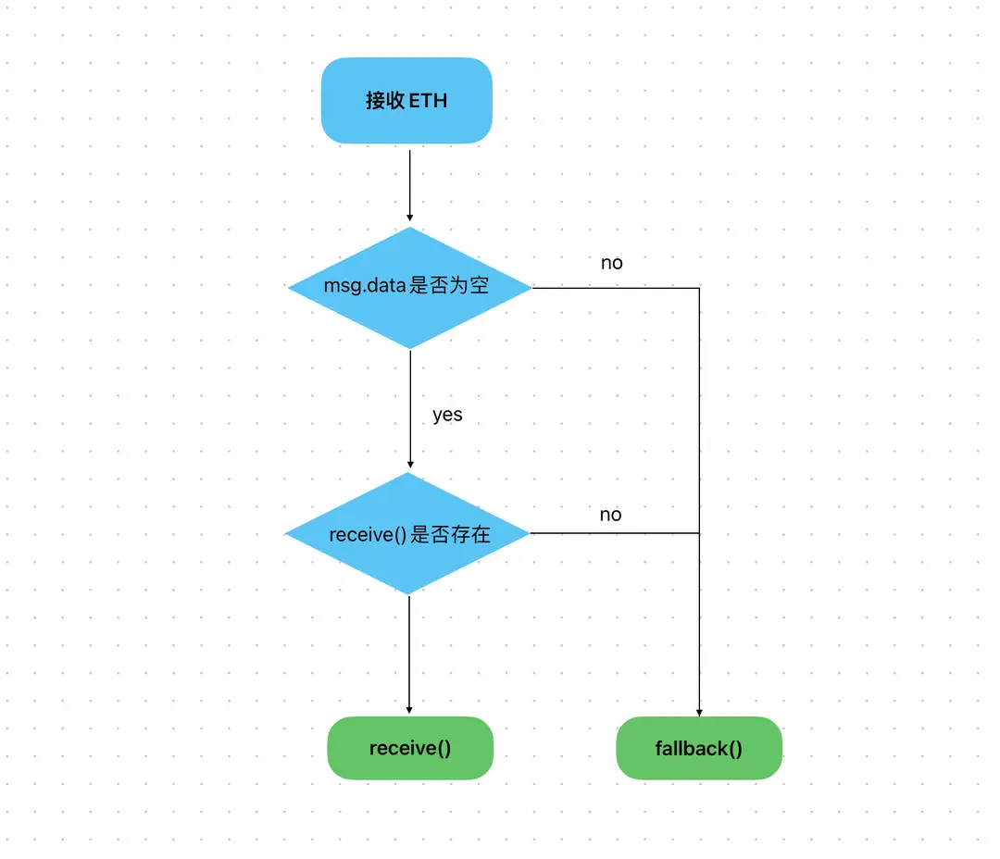
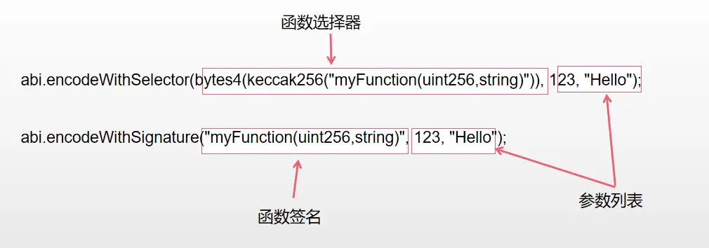

# solidity 语法

## 关键字

### pragma

我们可以指定一个精准的编译器版本或指定一个范围内的编译器版本

```solidity
//指定合约的编译器版本仅可为0.8.4
pragma solidity 0.8.4;
//指定合约的编译器版本仅可为≥0.8.4 且 <0.9.0（）
//限制条件“<0.9.0”通过^ 提供，^0.a.b 表示它需要编译器版本 ≥0.a.b 且 <0.(a+1).0。
pragma solidity ^0.8.4;
```

> 使用关键字 pragma 并不会直接更改编译器的版本。它也不会启用或禁用编译器的功能。它只是指示编译器检查它的版本是否与 pragma 要求的版本匹配。如果不匹配，则编译器会报错。

### contract

使用关键字 contract 定义合约，一个 Solidity 的 .sol 文件可以包含一个或多个 contract。

合约可以完全透明的存储数据和执行逻辑。

要定义一个 合约，我们使用关键字 contract，后面跟上合约的名称。

```solidity
pragma solidity 0.8.17;

//定义了一个名为"Book"的合约
contract Book { }

//在同一个.sol文件下可以定义多个合约，且他们都使用同一个编译器版本
contract Student { }
```

> 对于合约的命名，我们建议遵循“大驼峰”的命名规范，“大驼峰”是指每个单词的首字母都大写，例如：MyContract

合约类型是 Solidity 中的一种变量类型，用于存储对其他合约的引用。合约类型的变量就是一个合约的实例。这个实例可以访问合约的所有公共函数和变量。

要定义一个合约类型的变量，需要按照合约类型 + 合约名称的格式进行声明。

```solidity
MyContract mycontract;

//合约实例需要通过new的方式实例化
mycontract = new MyContract();

//同样也可以通过指定地址的方式实例化
MyContract mycontract = MyContract(contractAddress);
```

该变量可以调用其对应的合约，并且可以与地址类型 address 相互转换。从类型来讲，他是一个引用类型的变量。

```solidity
// SPDX-License-Identifier: MIT
pragma solidity ^0.8.0;

// 合约A
contract ContractA {
    uint256 public data;
}

// 合约B
contract ContractB {
    //定义了一个ContractA的合约类型变量
    ContractA public contractA;
    ContractA public contractAA;

    constructor(address _contractA) {
        //将传入的合约地址实例化为ContractA合约，并将其赋值给contractA变量
        contractA = ContractA(_contractA);
        contractAA = new ContractA();
    }
}
```

在这一节中我们将更进一步，学习如何调用其他合约的函数，以获取返回值或者修改其他合约的变量。

我们使用 ContractName.functionName(parameters) 的形式来调用外部合约的函数。

```solidity
//在这里我们调用了HQToken这个合约中的transfer函数，并将msg.sender和amount作为参数传入。
HQToken.transfer(msg.sender, amount);
```

调用函数本身的限制条件在于函数可见性。如果是用户和合约之间，只能调用 public 或 external 的函数。如果是合约内部的函数之间相互调用，则没有限制条件。被 external 修饰的函数可以直接用调用。

```solidity
// SPDX-License-Identifier: MIT
pragma solidity ^0.8.0;

// 合约B
contract B {
  uint public result;

  function foo(uint _input) public {
    result = _input * 2;
  }
}

// 合约A
contract A {
  B public b;

  constructor(address _bAddress) {
    b = B(_bAddress);
  }
  //调用B合约的foo函数
  function callBFunction(uint _input) public {
    b.foo(_input);
  }
}
```

在这一节中我们将更进一步，学习如何获取其他合约的状态变量。在有合约类型的变量后，即可通过该变量与相应的合约交互。而在 solidity 当中，会自动为每个公共变量生成一个查询函数，命名为变量名本身。


在获取基础类型时使用 ContractName.stateVariableName() 的形式来获取外部合约的状态变量值。

```solidity
contract NFTContract {
  uint public totalSupply;
}

contract MarketplaceContract {
  NFTContract public nft;

  function getTotalSupply() public view returns (uint) {
    return nft.totalSupply();
  }
}
```

值得一提的是，只有 public 的变量是可以通过合约名。参数名 () 的方式获取。private 修饰的变量是不可以的，这是因为 private 修饰的变量对外部是不可见的。

```solidity
// SPDX-License-Identifier: MIT
pragma solidity ^0.8.0;

// 合约B
contract B {
  uint public result;

  function foo(uint _input) public {
    result = _input * 2;
  }
}

// 合约A
contract A {
  B public b;

  constructor(address _bAddress) {
    b = B(_bAddress);
  }

  function callBFunction(uint _input) public {
    b.foo(_input);
  }
  //接着上一节中的例子，我们来获取B合约的result变量的值
  function getBResult() public view returns (uint) {
    return b.result();
  }
}
```

### int

我们可以通过以下的方式为变量赋值

```solidity
//定义一个整形变量a
int a;

a = 10;//a为10
a = a + 10; // a现在为20
```

或者

```solidity
pragma solidity ^0.8.7;
contract Book {

  //这是一个类型为int的变量，并将其初始化为10
  int basic_price = 10;

}
```

### uint

在前面的内容中，我们已经学过一种整数类型 int，他是一种有符号的整型表示方式，可以表示负数以及正数，而现在我们要学习无符号整型变量 uint，无符号整形只能是正整数。

我们使用关键字 uint 来定义无符号整型，int 定义有符号整型

```solidity
//使用关键字uint来定义无符号整型，int定义有符号整型
int ourInteger = -10;
uint outUInt = 1;

//更新整数的常用操作是 += 和 -=
int a = 3;
//这与 a = a + 3 相同，首先检索 a 的值，将其加上 3，然后将其分配回 a
a += 3; //a 现在是 6
a -= 4; //同理，这与 a = a - 4 相同，a 现在是 2

//我们还可以比较两个数字并返回一个 bool值。
//比较运算符有： <=， <， ==， !=， >=， > 。
bool d = 10 > 3; // 因为 10>3，所以 d 将为 true
bool e = 3 <= 3; // e 也将为 true，<= 表示小于等于
```

或者

```solidity
pragma solidity ^0.8.4;

contract Book {
    uint bookID; // 无符号整数
    int price; // 有符号整数
}
```

### bit

一个 bit 是二进制数字的一个数字（1 或 0）。2 个 bit 意味着有两个数字：00、01、10、11，可以表示 4 个不同的数字。而 uint 类型可以指定其存储多少比特位，像这样：uint128

我们可以指定 uint 和 int 类型所存储的 bit 位大小，要指定位数，我们在 uint 或 int 后面添加位数。

```solidity
uint8 a;
int256 b;
int128 c;
uint127 d; //这不是有效的，因为127不是8的倍数。
```

值得注意的是，位数必须是 8 的倍数。

```solidity
pragma solidity ^0.8.4;

contract Book {
    uint8 bookID; // 无符号整数
		int16 price; // 有符号整数
}
```

### bool

布尔变量（也称为 bool）只有两个值：true 或 false，通常用于判断。

使用 bool 关键字定义布尔变量

```solidity
bool a = true;
bool b = false;
```

或者

```solidity
pragma solidity ^0.8.7;

contract Book {
    bool a = true;
    bool b = false;
    //逻辑非
    bool c = !a; // 此处c为false，我们对a的值进行了逻辑非操作，并将其赋值给 c
    bool d = !c; // 同理，d此处为true

    //与运算
    bool e = d && a; // e 为 true，因为 d 和 a 都是 true
    bool f = e && b; // f 不会是 true，因为 b 不是 true
    bool g = e && true; // g 为 true

    //或运算
    bool h = true || false; // h 为 true
    bool i = false || true; // i 为 true
    bool j = false || false; // j 为 false

    //另一个常见的操作是 ==，它将在两个值相等时返回 true ，否则返回 false 。
    bool k = a == true; // k = true，其实就相当于：bool k = (a == true)

    //最后，我们还需要不等操作 !=，它将在两个值不同时返回 true ，否则返回 false 。
    bool l = a != true; // l为false，因为 a 是 true
}
```

### function

要定义一个函数，我们使用关键字 function，后跟其名称。

```solidity
//一个名为sum的函数
function sum() {
	//函数体
}
```

有一些关键字不能用来命名函数，例如，你不能将你的函数命名为“function”。

```solidity
pragma solidity 0.4.24;

contract Function {
	//在这里我们定义了一个名为add的函数
	function add() { }
}
```

### 输入参数

要定义一个函数的输入参数，我们在函数名后的括号中放置它们。

如果我们想要多个参数，则使用，进行分隔。

```solidity
//这里有两个输入参数，a 和 b，都是有符号整数 int。
function sum(int a, int b) public {
	//function body
}
```

或者

```solidity
pragma solidity 0.8.4;

contract Function {
	//定义一个名为 add 的公共函数
  //它接受两个int类型的参数a和b，一个bool类型c，一个address类型d
  //并且不返回任何值。
	function add(int a, int b, bool c, address d) public { }
}
```

#### 输出信息

而在函数处理完后，可能还需要输出一个信息，这就是函数的输出 output。

要定义函数的输出，我们在函数花括号前加上 returns 关键字定义返回类型，并且在函数体中使用 return 关键词返回函数输出。

```solidity
//此函数返回一个int型变量。
function sum(int a, int b) public returns(int) {
  return 1;
}
```

或者

```solidity
pragma solidity 0.8.4;

contract Function {
	//在这里定义名为add的公共函数，它接受两个int类型的参数a和b，并返回一个int类型的结果。
	function add(int a, int b) public returns(int) {
		return a + b;
	}
}
```

#### 已命名的变量返回

在这种模式下，我们无需使用 return 语句，只需直接为预先命名的返回值变量赋值即可。

要在函数体中返回一个值，我们可以使用关键字 return。

```solidity
function sum() public returns(int) {
	//这里我们使用关键字 return 返回整数5作为公共函数的输出
	return 5;
}

function name() returns(int res) {
		//如果没有对res赋值，则会返回res的默认值0
    //赋值后返回响应数据
    res= 5;
}
```

或者

```solidity
pragma solidity ^0.8.7;

contract Math {
    //我们定义了两个要返回的int值，k返回5，j将以默认值0返回,因为我们没有给它赋值
		function sum() public returns(int k, int j) {
        k = 5;
    }
}
```

递归使用函数：

```solidity
pragma solidity 0.8.4;

contract A {
		// 定义一个名为 add 的公共函数，接收两个整型参数 a 和 b，并返回它们的和
    function add(int a, int b) public returns(int) {
				return a + b;
    }
		// 定义一个名为 addUp 的公共函数，接收三个整型参数 a、b 和 c，并返回它们的和
    function addUp(int a, int b, int c) public returns(int) {
        // 调用 add 函数将 a 和 b 相加，将结果保存在变量 d 中
        int d = add(a, b);
				// 调用 add 函数将 d 和 c 相加，将结果作为 addUp 函数的返回值返回
        return add(d, c);
    }


    // 定义一个名为 addMul 的公共函数，接收两个整型参数 a 和 b，并返回它们的和与积
    function addMul(int a, int b) public returns(int, int) {
				return (a + b, a * b);
    }
		// 定义一个名为 addMulUp 的公共函数，接收三个整型参数 a、b 和 c，返回两个整数类型的值，分别为a+b+c, (a+b)*c
    function addMulUp(int a, int b, int c) public returns(int, int) {
        (int d,int e) = addMul(a, b);
        return addMul(d, c);
    }
}
```

### public

在知道如何定义函数后，我们还需要定义一个可见性，也称为作用域。它指定了我们何时可以访问此 变量 或 函数。

要定义一个 公共变量 或 公共函数，我们使用关键字 public，并将其放在 变量 名称之前或 函数 参数之后。

```solidity
uint public a;
function aa() public {
	//funciton body
}
```

或者

```solidity
contract A {
  //aa 和 bb 函数，以及 a 变量可以从任何地方访问，因为它们是 public 。
	//b 和 bbb只能从合约内部访问，因为它们是 private 。
	uint public a;
	uint private b;
	function aa() public {
		//这与a = a + 1 等同;
		a++;
	}
	function bb() public {
		b++;
	}
  function bbb() private {
    b++;
  }
}
```

### internal

在 Solidity 中，指定函数或变量的可见性或作用域 关键字还有 internal，有时我们将限定某些变量或函数仅在内部合约使用。

要定义一个仅在合约内部，以及继承它的合约中才能使用的函数，我们使用关键字 internal，并将其放在函数 参数之后。使用时可以直接使用函数名 funcName() 调用函数。

```solidity

   function aa() internal{}

   aa();
```

或者

```solidity
contract A {

    uint public result;

    function aa(uint a) internal {
        result = a + 1;
    }

    function b(uint b) public {
         aa(b);
    }
}
```

### external

在编写合约时，某些情况下合约中的特定功能需要与其他合约共享，此时我们可以使用 external 关键词。

要定义一个外部用户或其他合约能使用的函数，我们使用关键字 external，并将其放在函数 参数之后。

在本合约中使用时必须加上 this 关键词。

```solidity

   function aa() external{}

   this.aa();
```

或者

```solidity
contract A {

    uint public result;

    function aa(uint a) external {
        result = a + 1;
    }

    function b(uint b) public {
         this.aa(b);
    }
}
```

## 变量的作用域

状态变量和局部变量。

要定义一个 状态变量，我们需要将其放在函数之外。

```solidity
contract ContractName {
		//这是一个状态变量
    int a;

		function add(int b) returns(int) {
			//b被定义为函数的输入参数，所以它不是状态变量
			//c是在函数中定义的，所以它也不是状态变量
			int c = a + b;
			return c;
		}
}
```

或者

```solidity
pragma solidity >=0.4.0 <0.9.0;

contract Book {
    int bookID;  //状态变量
    bool read;  //状态变量

    function a() public {
        bookID = 3;  //给状态变量赋值
        int bookId = bookID;  //bookId是在函数中定义的，不是状态变量
    }
}
```

要定义一个局部变量，需要将其定义在函数内部。

```solidity
contract ContractName {
	function example() public {
	    int a;//局部变量
			a = 3;
	}
}
```

或者

```solidity
pragma solidity ^0.8.0;

contract Example {
	uint c;  // 状态变量
	function getResult() public returns(uint){
	  uint a = 1; // 局部变量
	  uint b = 2; // 局部变量
	  uint result = a + b;
		c = result;
	  return result; //返回局部变量
	}
}
```

## 纯函数

变量可以分为 状态变量 和 局部变量，函数也可以分为 3 种 —— pure 函数、view 函数和其他函数。

所谓纯函数就是该函数不会访问以及修改任何状态变量。

一般来讲 pure 函数用于返回一个固定的值或完成计算。

要将一个函数定义为 pure 函数，我们需要在函数头中使用关键字 pure。

```solidity
function add() public pure {
	//function body
}
```

为了保持一致性，我们建议遵循此顺序：函数名称、参数、作用域、状态可变性、返回值。

```solidity
pragma solidity ^0.8.0;

contract Example {
    mapping(int => int) aa;
		//这是一个pure函数
    function add(int a, int b) public pure returns(int) {
        return a + b;
   }
		//这不是一个pure函数
   function addNotPure(int a, int b) public returns(int) {
       aa[0] = a + b;
       return aa[0];
   }
}
```

现在我们将介绍另一种函数：view（视图）函数。

```solidity
function add() public view {
	//function body
}
```

一个 view 函数可以读取状态变量，但不能修改它。

例如，假设你想知道你银行账户的余额，你会向银行发送一个查询请求，并等待收到响应。

在这个过程中，你只是读取了你的账户余额信息，但没有修改它。如果某个函数告诉你某些信息，但不对区块链进行任何更改，那么它就是一个 view 函数。

```solidity
pragma solidity ^0.8.0;

contract Example {
    int c = 10;
    //这是一个pure 函数
    function add(int a, int b) public pure returns(int) {
        return a + b;
		}
		//这是一个view函数，但不是pure函数
		function addView(int a) public view returns(int) {
		    //这里使用了状态变量c;
		    //所以不是pure函数，但我们没有修改信息，所以它是view函数
		    return a + c;
		}
		//这既不是pure函数也不是view函数
		function addNotPure(int a, int b) public returns(int) {
		    //这里修改了状态变量c;
		    c = a + b;
		    return c;
		}
}
```

## address

这节我们学习的变量类型是地址（address）类型。地址是以太坊区块链上账户或智能合约的唯一标识符。

要定义一个地址，我们只需要使用 address 关键字。

```solidity
//定义
address address1 = 0x35701d003AF0e05D539c6c71bF9421728426b8A0;

//在以太坊中，每个地址都有一个成员变量，即地址的余额balance
//余额以 uint 形式存在，因为它永远不可能为负值
uint balance = address1.balance;
```

地址占 20 个字节，一个字节有 8 个 bit ,所以地址共有 160 个 bit，一个字节需要两个十六进制数表示，所以需要 40 个十六进制数表示一个地址。

```solidity
pragma solidity ^0.8.0;

contract AddressArray {
	address b = 0x5B38Da6a701c568545dCfcB03FcB875f56beddC4;
	uint balance = b.balance;
}
```

## payable

在上一课中，我们学习了 address 类型。但是该类型缺少一个重要的功能，即：转移资金（ETH）。
在 solidity 中，只能对申明为 payable 的地址进行转账。


要定义一个 address payable 类型的变量，我们使用关键字 payable。

```solidity
address payable add;

//类型转换
address add1 = 0x5B38Da6a701c568545dCfcB03FcB875f56beddC4;
address payable add2 = payable(add1); //使用 payable() 显式转换
address add3 = add2; //隐式转换

//转账
//从当前合约向address1转移5 Wei
address1.transfer(5);
```

或者

```solidity
pragma solidity ^0.8.0;

contract AddressArray {
  address payable add = payable(0x5B38Da6a701c568545dCfcB03FcB875f56beddC4); //显示转换
	address b = add; //隐式转换
	uint balance = b.balance; //获取b的余额
	function trans() public payable{
		//这将从当前合约向地址b转移10 Wei
		add.transfer(10);
	}
}
```

通常情况下，智能合约是不会接收任何以太币。如果你希望某个函数能够接收以太币，可以使用 payable 修饰符将其标记为可支付的。这样，其他人就可以向该函数发送以太币作为交易。

在函数名和函数参数后，使用 payable 关键字可以使该函数成为一个可支付函数。

```solidity
//定义了一个可支付函数receivePayment()。
function receivePayment() payable public { }
```

只有 public 和 external 的函数支持 payable 修饰。因为如果函数在合约外部不可见的话，用户就无法调用函数，也就自然无法给支付以太给函数。

```solidity
pragma solidity ^0.8.0;

contract PaymentContract {
  // 定义一个接收ETH的支付函数
  function receivePayment() payable public returns (uint256) {
    // 在这里编写逻辑来处理接收到的以太币
    // ...
    return msg.value; //返回值为调用者附加的ETH大小
  }
}
```

## mapping

它提供了一种以结构化方式存储和管理信息的方法。

要定义一个 mapping，我们使用关键字 mapping，后跟我们希望建立单向关联的两种类型。最后是名称。

```solidity
mapping(uint => uint) IDToID;
```

或者

```solidity
pragma solidity ^0.8.4;

contract book {
	//声明一个mapping，名称为owned_book，将地址映射到 uint 类型的值;
	mapping(address => uint) public owned_book;
}
```

对于 mapping，我们可以添加、更新、删除和查询。

和其他编程语言的映射一样，我们将键放置在 mapping 名称之后的[]内。我们使用与分配变量值相同的语法，使用=向 mapping 中添加一个键值对。对于 mapping 键值的更新，我们也使用相同的语法。

```solidity
balance[address(0x123)] = 10;///这将为地址 0x123 分配一个新值
balance[address(0x123)] = 20;//这将把值从 10 更新为 20
```

在这里，我们将值分配给由[]指定的键。

其实，mapping 的添加也相当于更新，只不过是将 mapping 的默认值更新为要添加的值。

```solidity
pragma solidity ^0.8.4;

contract book {
	//声明一个私有映射，将地址映射到一个 uint 值，表示该地址拥有的书籍ID
	mapping(address => uint) private owned_book;
	//声明一个名为 "add_book" 的函数，它接受一个 uint 类型的 bookID 作为输入，并且是公开可访问的
	function add_book(uint bookID) public {
		//将书籍ID添加到映射中，使用硬编码的地址 0x123 作为键
		owned_book[address(0x123)] = bookID;
	}
}
```

上一节我们学习了 mapping 的添加和更新操作，本节我们将学习 mapping 的另一个操作：查找。

要查询映射中某个键对应的值，只需在 mapping 名称后面加上[]，[]里面放入要查询的键即可。

```solidity
uint b = balance[address(0x123)];
```

如果要查询的键不存在，则会返回这个值类型的默认值。

例如 uint 的默认值是 0，bool 的默认值是 false。

```solidity
pragma solidity ^0.8.4;

contract book {
	mapping(address => uint) private owned_book;

	function add_book(address owner, uint bookID) public {
		owned_book[owner] = bookID;
	}
	//获取书籍函数，根据地址获取对应的书籍 ID
	function get_book(address owner) public view returns(uint){
		return owned_book[owner];
	}
}
```

删除其实只是把 key 对应的 value 重新置为默认值

要删除键值对，我们使用关键字 delete。

```solidity
delete balance[address(0x123)];
```

或者

```solidity
contract A {
    // 定义映射，将地址映射到 uint 类型的余额
    mapping(address => uint) public balance;
    // 添加函数，将指定地址的余额设置为 10
    function add() public {
        balance[address(0x0000000000000000000000000000000000000123)] = 10;
    }
    // 删除函数，删除指定地址的余额记录
    function deleteF() public {
        delete balance[address(0x0000000000000000000000000000000000000123)];
    }
    // 更新函数，将指定地址的余额增加10
    function update() public {
        balance[address(0x123)] += 10;
    }
}
```

## 构造函数

构造函数是在合约部署时自动调用且只被调用一次的函数。

构造函数 没有名称和返回值：

1. 名称，不需要显式命名。由于每个类中只能有一个构造函数，它将在对象创建时被自动调用。

2. 返回值，没有返回值，因为构造函数是用于初始设置的。

因此，要定义构造函数，我们只需要使用关键字 constructor，后跟参数。

```solidity
constructor(int a, bool b) {
	//函数体
}
```

或者

```solidity
// SPDX-License-Identifier: GPL-3.0
pragma solidity >=0.7.0 <0.9.0;

contract A {
    uint public a;
		//构造函数，初始化变量a
    constructor(uint a_) {
        a = a_;
    }
}

contract B {
		//一个空的构造函数
    constructor() {}
}
```

## require

require 顾名思义，是一种类似于断言的语法，如果 require 当中的条件没有满足，此次调用将会失败。

为了检查条件是否成立，我们使用关键字 require，然后跟上条件，如果不满足条件，则报告错误消息。

```solidity
require(recipient != address(0), "Recipient address cannot be zero");
```

require 语句的第一个参数是一个布尔表达式，如果为 true，则继续执行程序。如果为 false，则会中止执行，并将第二个参数作为错误消息发送到调用者。第二个参数 是可选的。

> solidity 暂不支持中文编码，错误信息请用英文编写。

```solidity
pragma solidity ^0.8.4;

contract VendingMachine {
    address public owner = address(0x123);

    function buy(uint amount) public {
				//我们将在下一课中解释msg.sender
        require(msg.sender == owner, "Not authorized.");
        // 执行购买操作。
    }
}
```

## msg.sender

msg.sender 可以获取本次调用的调用者地址。

要使用 msg.sender，我们不需要定义它。它在函数中处处可用，代表函数的调用者。

```solidity
function a() {
		//这里 msg.sender 没有定义为状态变量
		//也不作为参数传入，我们可以直接使用它
		address a = msg.sender;
}
```

我们前面说过每个函数都需要被调用才能执行，那么我们怎么知道谁是调用者呢？

msg.sender 指的是函数的直接调用者。

假如有个函数如下：

```solidity
function myFunction() public {
		address caller = msg.sender;
}
```

这里的 msg.sender 即为调用 myFunction 函数的地址。

关于特殊变量的完整列表，请查看 https://docs.soliditylang.org/en/v0.8.19/units-and-global-variables.html#block-and-transaction-properties

## 值类型和引用类型

到目前为止，我们学了四种值类型变量：int、uint、bool、address。

和唯一引用类型变量：mapping

```solidity
uint a = 10;
int aa = -3;
bool b = true;
address c = address(0x234);

mapping(int => mapping(int => address)) map;
```

或者

```solidity
// SPDX-License-Identifier: MIT
pragma solidity ^0.8.0;

contract Example {
    mapping(int256 => address) map;

    function types() public {
        uint256 a = 1;
        uint256 b = a;
        a = 2; //a 已更新，但 b 保持不变
				b = 4; ///b 已更新，但 a 保持不变

				map[1] = address(0x123);
    }
}
```

在上一课中，我们提到引用类型是指变量存储的是数据的地址。这个地址在哪里呢？

每种引用类型都有一个数据位置，指明变量值应该存储在哪里。Solidity 提供 3 种类型的数据位置：storage、memory 和 calldata。

而 storage 则是作用于合约的存储结构。


所有的状态变量都在 storage 中

```solidity
//这个字符串状态变量存储在 storage 中
string str;

function a() {
	//函数体
}
```

状态变量默认存储在 storage，我们不需要显示指定。

```solidity
pragma solidity ^0.8.4;

contract StorageExample {
	//这个字符串状态变量存储在 storage 中
	string name = "hello";
	function update() public {
		name = "hello~";
	}
}
```

这个位置用于存储合约的状态变量。存储在此位置的数据被持久化存储在以太坊区块链上，因此消耗的 gas 更大。


任何想要永久存储在以太坊区块链上的内容都应该存储在 storage 中。

```solidity
contract MyContract {
    //在函数外定义的状态变量默认存储在 storage 中
	  mapping (int => bool) b;
}
```

声明一个状态变量，名为 userAddress，类型为 address，存储在 storage 中。

```solidity
address storage userAddress;
```

在之前的课程中，我们介绍了 Solidity 中的一种数据存储位置：storage。除了 storage，还有另一个重要的数据存储位置 - memory。

memory 在 Solidity 中表示一个临时数据存储区域。

与 storage 不同，存储在 memory 中的数据在函数调用结束时会被清空，不具有持久性。

要在 memory 中声明变量，您需要在函数内部定义它，然后加上关键字 memory。

```solidity
pragma solidity ^0.8.4;

contract MemoryExample {
    function example() public pure {
				// tempStr 是存储在memory中的局部变量
        string memory tempStr = "Hello, World!";

    }
}
```

与 storage 相比，memory 在 gas 成本方面更小，在 memory 中读写数据会划算很多。

```solidity
pragma solidity ^0.8.4;

contract MemoryExample {
    string public name;
    uint public score;

    function operate() public {
				score = 10;
				name = "Jane";

				// tempName是存储在memory中的临时变量
        string memory tempName = "Joe";
				tempName = name;
    }
}
```

## string

字符串是一种表示文本数据的数据类型。字符串是由一系列字符组成，例如数字、字母、标点符号等。

在 Solidity 中声明字符串非常简单。要声明一个字符串，我们使用关键字 string：

```solidity
string myString = "I will be back!";

//String 作为参数时必须指定其存储的位置，在大多数场景中都使用memory
constructor(string memory name_, string memory symbol_) {
    _name = name_;
    _symbol = symbol_;
}
```

可以使用字符串来存储需要表示为文本数据，例如名称和地址。

字符串还用于创建消息和错误消息。

例如，我们之前学习的 require 语句，我们将字符串作为第二个参数传递给 require 函数，以便在发生异常时向用户显示错误消息。

```solidity
// SPDX-License-Identifier: MIT
pragma solidity ^0.8.4;

contract LearningStrings {
    string car = "BMW";
    string text;
    //使用函数将值赋给字符串变量
    function setText () public returns (string memory) {
        text = "Hello World";
        return text;
    }
}
```

要连接字符串，我们可以使用 string.concat 函数。

```solidity
//定义两个字符串变量（str_1 和 str_2）
string memory str_1 = "hello ";
string memory str_2 = "world";

//将上面的两个字符串变量传递给 concat 函数，
//该函数将返回这两个字符串的拼接结果"helloworld"
string memory result = string.concat(str_1, str_2);
```

一些常用到字符串连接的场景包括：

● 构建消息：我们可以使用字符串连接将多个消息片段组合成一条消息。

● 格式化输出：可以使用字符串连接以可读的方式格式化输出。例如，我们可能会将字符串和数字连接起来以显示余额为“Your balance is 10 ETH”。

```solidity
pragma solidity ^0.8.0;

contract StringExample {
	string public greeting = "Hello, ";
  string public name = "Alice";
  //result的值为"Hello, Alice"
	string result = string.concat(greeting, name);

  string public message;
  function setMessage(string memory _newMessage) public {
			//将字符串 "Hello, " 与_newMessage进行拼接，然后存储在 message 变量中
      message = string.concat("Hello, ", _newMessage);
  }
}
```

在前几节中，我们学习了字符串的定义与拼接。那么在本节中，我们将学习什么是字符串的长度并获取这个值。一个 字符串 是由字符集合组成的，而 字符串长度 指的是它所包含的字符数。

要确定 Solidity 中字符串的长度，可以使用内置的 bytes 类型，该类型表示动态的 bytes 数组。bytes 类型有一个 length 属性，用来返回数组中的 bytes 数量。通过它我们可以得到字符串的长度。

```solidity
//值为 hello 的字符串变量
string hi = "hello";
//我们将字符串转换为 bytes，然后调用 length 函数获取长度
uint256 len = bytes(hi).length;
```

在 Solidity 中，字符串的长度通常使用 uint256 类型来表示。

```solidity
pragma solidity ^0.8.0;

contract StringLength {
    string name = "the daughter";
    string testS;
    bytes testB;

	function test() public {
		testS = string.concat(name, "hello");
		uint l = bytes(testS).length;   //计算testS字符串长度，将其赋值给uint变量 l
		testB = bytes(testS);   //将字符串转化为byte数组
	}

  function getLength(string memory str) public pure returns(uint) {
      bytes memory bytesStr = bytes(str); //将字符串转化为byte数组
      return bytesStr.length; //返回字符串长度
  }
}
```

## struct

在本节中，我们将学习另一种类型，称为结构体。

在 Solidity 中，结构体是一种用户自定义的数据类型，其中可以包含多个不同类型的属性。

例如一个学生可以有很多属性，比如姓名、学号、年级等。我们可以将这些属性封装到一个结构体中。

要定义一个结构体，首先你需要使用 struct 关键字，其后是结构体的名字。

然后需要用{}将其属性括起来，{}里面每个属性用“；”隔开，结构体属性的定义与状态变量的定义相同，只是没有作用域这个概念。

```solidity
struct Cat {
  string name;
  address owner;
  uint256 age;
}
```

结构体能更加方便的组织和管理相关的数据，使代码更加清晰和易于理解。

例如我们可以创建多个" Student "结构体，每个结构体对应着一个特定的学生，并包含其所有属性，这能更好的组织和管理学生数据。

```solidity
pragma solidity ^0.8.0;

contract Example {
  //这里我们定义了一个名为Student结构体，其有name，studentId，grade三个属性
  struct Student {
    string name;
    uint256 studentId;
    uint256 grade;
  }
}
```

在我们讨论了如何定义结构体之后，我们需要知道该怎么初始化一个结构体。

初始化结构体意味着创建一个新的结构体实例，我们可以通过指定数据来创建一个独特的结构体。

要想初始化一个结构体，需要使用结构体的名字后跟括号的方式，括号里面是结构体的属性值，这需要和结构体定义时的属性一一对应。

```solidity
Student("zhangsan", 18);
```

结构体只能够存储在像 mapping，array 这样的引用类型当中，因此我们还可以通过在这样的引用类型中检索到空结构体后再对其进行赋值。

这也是一种初始化的方式。

```solidity
pragma solidity ^0.8.0;

contract Example {
  struct Student {
    string name;
    uint256 studentId;
    uint256 grade;
  }
  //我们在这个函数中初始化了一个Alice学生示例，并将其作为函数的返回值返回
  function testDefinition() public pure returns(Student memory) {
    Student memory student = Student("Alice", 1, 3);
    return student;
  }
}
```

在我们讨论了如何初始化结构体之后，我们需要知道该怎么访问一个结构体变量。

一个结构体通常存储了很多信息，我们想要从中精准的找到我们想要的信息，那么如何查找呢？

要想访问一个结构体，你需要使用 StructName.PropertyName 的形式访问，这个和 Java 中类的访问方式是一样的。

```solidity
//这里我们访问了student结构体中的name属性，并将其赋值给name变量。
string name = student.name;
```

一般情况下，结构体都存储在一个数组或映射当中，当你想要获取某个实例的属性时，你就需要访问这个结构体的这个属性。

例如你想知道学号为 01 的学生的姓名，你就可以去访问该学生的结构体实例对应的姓名属性。

```solidity
// SPDX-License-Identifier: MIT
pragma solidity ^0.8.0;

contract Example {
  struct Student {
    string name;
    uint256 studentId;
    uint256 grade;
  }
  //我们在这个函数中先初始化了一个名为student的实例
  //随后使用实例名+"."+属性名的形式访问了name属性
  function testUpdate() public pure returns(string memory name) {
    Student memory student = Student("Alice", 1, 3);
    name = student.name;
  }
}
```

到目前为止，我们已经讨论了结构体的定义，初始化和访问。

结构体通常在创建后需要修改其属性的值。

这可能是因为需要更新数据、记录新的状态或者进行其他与结构体相关的操作。因此，我们还需要知道如何修改结构体中的属性。

想要修改结构体的属性，我们可以使用如下语法：

```solidity
student.name = "Thomas";
```

这里我们将 student 实例的 name 属性修改为了“Thomas”。

在结构体的属性修改时，要修改的值和属性的类型必须相同。

```solidity
// SPDX-License-Identifier: MIT
pragma solidity ^0.8.0;

contract Example {
  struct Student {
    string name;
    uint256 studentId;
    uint256 grade;
  }
  //我们在这个函数中先初始化了一个名为student的实例，其原名为Alice，然后我们将其name改为了Bob
  //并将旧名字和新名字作为返回值分别返回
  function testUpdate() public pure returns(string memory oldName, string memory newName) {
    Student memory student = Student("Alice", 1, 3);
    oldName = student.name;
    student.name = "Bob";
    newName = student.name;
  }
}
```

## Array

在本节中，我们将学习另一种类型，称为动态数组。数组是一种用来存储相同类型数据的集合。

为了定义动态数组，你需要使用类型+[]的方式定义。

```solidity
uint256[] arr;
```

在这里我们定义了一个名为 arr 的 uint256 类型的动态数组。

```solidity
pragma solidity ^0.8.0;

contract Example {
  //这里我们定义了一个名为nums的uint256类型的动态数组
  uint256[] nums;
}
```

在上一节中，我们学到了如何定义一个动态数组。而在这章中，你将会学习一个向数组里添加元素的方式 - push。

当处理动态数组时，使用 push 是一种常见的方式。它允许我们在数组的末尾添加新的元素，而无需事先知道数组的大小或指定索引。

为了向动态数组的末尾添加新的元素，我们需要使用 ArrayName.push() ，括号中为要添加的元素。

```solidity
//在这里我们向名为 arr 的数组的末尾添加了一个值“1”。
arr.push(1);
```

push 只允许我们在数组的末尾添加新的元素，而且注意一次只能 push 一个元素

```solidity
pragma solidity ^0.8.0;

contract Example {
  uint256[] public nums;
  //这里我们像nums数组的末尾依次push了元素1，2，3
  //执行完后该数组的结构应该为[1,2,3]
  function testPush() public {
    nums.push(1);
    nums.push(2);
    nums.push(3);
  }
}
```

在上一节中，我们学到了如何在动态数组的末尾添加一个元素。

而在这章中，你将会学习一个将动态数组最后一个元素删除的方法 - pop。

使用 pop 是在处理动态数组时常见的一种操作，它允许我们从数组的末尾删除最后一个元素。并且在 pop 之后，数组的长度会减小。

为了将动态数组的末尾元素删除，我们需要使用 ArrayName.pop()。

```solidity
//在这里我们将 arr 数组的最后一个元素删除。
arr.pop();
```

如果你尝试弹出一个空数组的元素，Solidity 将无法找到任何元素来弹出，并且会引发错误。

```solidity
pragma solidity ^0.8.0;

contract Example {

  uint256[] public nums;

  function testPush() public {
    nums.push(1);
    nums.push(2);
    nums.push(3);
    //执行到这里该数组的结构应该为[1,2,3]
    //将数组最后一个元素删除
    nums.pop();
    //此时数组的结构应该为[1,2]
  }
}
```

在前面的章节中，我们学习了动态数组的定义以及增添删除的方式。

在这章中，你将会学习如何查看动态数组的长度，在 Solidity 中，数组的长度是指数组中元素的数量。

为了获取动态数组的长度，我们使用 length 关键字。只需要在数组名字后加上 .length 即可。

```solidity
uint256 len = arr.length;
```

在这里我们获取了一个名为 arr 的数组的数组长度，并将其赋值给 len 变量。

```solidity
pragma solidity ^0.8.0;

contract Example {

  uint256[] public nums;

  function testPush() public {
    nums.push(1);
    nums.push(2);
    nums.push(3);
    nums.pop();
  }
  //这里定义了一个getLen函数，该函数会返回nums数的数组长度。
  function getLen() public view returns(uint256) {
    return nums.length;
  }
}
```

在了解完动态数组的基本操作和属性后，让我们来学习如何访问数组的元素。在此之前我们有必要了解数组下标这个信息。数组下标从 0 开始，到数组长度减 1 结束。下标为 0 的元素是数组中的第一个元素，下标为 1 的元素是数组中的第二个元素，以此类推。

为了获取动态数组元素，我们需要访问数组，使用数组名+[index]的方式。

```solidity
uint256 num = arr[10];
```

在这里我们获取了一个名为 arr 的数组的 10 号索引，也就是第十一个元素，并将其赋值给 num 变量。

```solidity
pragma solidity ^0.8.0;

contract Example {
  uint256[] public nums;

  function testPush() public {
    nums.push(1);
    nums.push(2);
    nums.push(3);
  }
  //这里定义了一个 getNum 函数，该函数会返回 nums 数组第 index 个索引的元素。
  function getNum(uint256 index) public view returns(uint256) {
    return nums[index];
  }
}
```

在前几节的内容中，我们学习了如何定义一个动态数组以及动态数组的赋值。

在本节当中，我们将介绍一个新的数组定义形式——定长数组。

在定义定长数组时，需要在[]中指定数组的长度：

```solidity
uint256[3] public numbers; // 定义一个长度为3的定长数组

//我们需要使用[元素，元素，元素]的形式为定长数组赋值。
//需要特别注意的是，所有元素的类型必须一致。
//因此在定长数组的定义中，只需要在方括号中指定第一个元素的类型即可（对应下方的[uint256(10), 20, 30]）。
function setNumbers() public {
  uint256[3] memory tempArray = [uint256(10), 20, 30]; // 定义一个临时的长度为3的定长数组
  numbers = tempArray; // 将临时数组赋值给定长数组
}
```

1. 确定长度：定长数组的固定长度使得编译器能够在编译时进行更多的优化。
2. 更高的效率：定长数组的存储方式是在插槽中连续存储，这使得对数组的访问速度更快，因为可以通过偏移量直接访问元素，而无需进行额外的计算（例如动态数组中的哈希）。
3. 节省存储空间：由于定长数组的长度是确定的，存储每个元素所需的空间也是已知的。这使得在存储定长数组时更加高效，因为不需要为存储数组长度而额外分配空间。
4. 避免越界错误：定长数组在编译时会检查数组的访问是否越界，并在必要时引发错误。这可以提供更好的安全性，避免在运行时出现数组越界的问题。

定长数组没有 pop()，push() 等语法，只能一次性赋值（见 documentation）

```solidity
contract GradeBook {
  uint256[5] public grades; // 存储学生成绩的定长数组，长度为5

  function setGrade(uint256 index, uint256 grade) public {
    require(index < grades.length, "Invalid index"); // 确保索引不超过数组长度
    grades[index] = grade;
  }

  function getGrade(uint256 index) public view returns (uint256) {
    require(index < grades.length, "Invalid index"); // 确保索引不超过数组长度
    return grades[index];
  }
}
```

## if

Solidity 包含了一些常见的流程控制结构，这些结构用于在程序执行期间对代码的执行进行控制。

在这一节中，我们将介绍流程控制中的 if-else 语句。

if-else 语句允许对代码片段进行有条件的执行，它允许根据某个条件的真假来执行不同的代码块。

```solidity
if (condition) {
  // 在条件为真时要执行的代码
} else {
  // 在条件为假时要执行的代码
}
```

使用 if 关键字定义 if 语句，后面跟着用括号 () 括起来的条件，然后是用{}括起来的代码块。如果条件为假，将跳过该代码块。

```solidity
if (value == 10) {
  // 当 value 为 10 时执行的代码
} else if (value == 20) {
  //else if用于在if条件不被满足时添加多个条件进行检查。
  //如果之前的if条件未被满足，则将检查下一个else if条件，并在其中找到第一个满足条件的代码块进行执行。

  // 当 value 为 20 时执行的代码
} else if (value == 30) {
  // 当 value 为 30 时执行的代码
} else {
  //else是if语句的可选部分，用于指定当if条件为false时要执行的代码块。
  //如果if条件不被满足，则else语句中的代码块将被执行。

  // 当 value 都不满足时执行的代码
}
```

```solidity
// SPDX-License-Identifier: MIT
pragma solidity ^0.8.0;

contract IfElseExample {
  uint value = 10;
  //检查变量value是否等于10。
  //如果是，它返回字符串"Value is equal to 10"
  //否则它返回字符串"Value is not equal to 10"。
  function checkValue() public view returns (string memory) {
    if (value == 10) {
      return "Value is equal to 10";
    } else {
      return "Value is not equal to 10";
    }
  }
}
```

## while

刚刚我们学习了 if - else 条件语句，现在，我们将介绍另一种控制程序流程的结构：while 循环。

while 循环语句是一种常见的流程控制语句，用于反复执行一段代码块，直到指定的条件表达式不再为真为止。

使用关键字 while 定义 while 循环，后跟用括号 () 括起来的条件。

要执行的代码块用{}括起来。只要条件仍然为真，代码块就会不断被执行。

```solidity
uint i = 0;
while (i < 10) {
  i++;
  // 每次迭代执行的代码
}
```

在写 while 的时候需要谨慎，避免出现死循环（永远无法达成跳出 while 的条件，导致一致循环）的情况发生。

```solidity
// SPDX-License-Identifier: MIT
pragma solidity ^0.8.0;

contract WhileLoopExample {
  uint[] public numbers;

  function fillNumbers(uint n) public {
    uint i = 0;
    while (i < n) {  // 当 i 小于传入的参数 n 时执行循环
      numbers.push(i);  // 向动态数组中添加 i
      i++;
    }
  }

  function getNumbers() public view returns(uint[] memory) {
    return numbers;
  }
}
```

学习了 if 和 while 两种流程控制语句后，我们现在探讨另一个流程控制结构：do-while 循环。

do-while 循环语句使得一段代码块可以重复执行，只要某个特定条件保持为真。

while 循环和 do-while 循环的关键区别在于后者在执行代码块后再判断条件，因此它保证至少执行一次代码块。

使用关键字 do 定义 do-while 循环，后跟要执行的代码块并用 {} 括起来，最后是关键字 while 和括在括号 () 中的条件。

代码块将至少执行一次，并在条件为真的情况下继续执行。

```solidity
uint i = 0;
do {
  i++;
  // 每次迭代要执行的代码
} while (i < 10);
```

while 循环先检查条件再执行循环体，而 do-while 循环先执行循环体再检查条件。

```solidity
// SPDX-License-Identifier: MIT
pragma solidity ^0.8.0;

contract DoWhileLoopExample {
  uint[] public numbers;

  function fillNumbers(uint n) public {
    uint i = 0;
    do {  // 执行至少一次的循环，直到 i 大于等于 n
      numbers.push(i);
      i++;
    } while (i < n);  // 当 i 小于 n 时继续循环
  }

  function getNumbers() public view returns(uint[] memory) {
    return numbers;
  }
}
```

## for

在学了这么多控制流语句后，最后我们学习一个非常常见的流程控制结构：for 循环。

for 循环语句和 while 和 do-while 一样。

它根据特定条件反复执行一个代码块，直到满足某个条件为止。

我们使用 for 关键字来定义 for 循环，后面跟着一个初始化语句、一个条件和一个增量语句。所有这些都被括在圆括号 () 中。要执行的代码块被括在{}中。

只要条件保持为真，代码块就会不断执行。

```solidity
for (uint i = 0; i < 10; i++) {
  // 每次迭代执行的代码
}
```

在这个例子中，初始化部分将变量 i 设置为 0，条件部分检查 i 是否小于 10，迭代部分使 i 递增。重复执行循环体代码直到 i 不再满足条件为止，即 i 大于 等于 10。

```solidity
// SPDX-License-Identifier: MIT
pragma solidity ^0.8.0;

contract ForLoopExample {
  uint[] public numbers;

  function fillNumbers(uint n) public {
    // 将数字0-n-1添加到数组中
    for (uint i = 0; i < n; i++) {
      numbers.push(i);
    }
  }

  function getNumbers() public view returns(uint[] memory){
    return numbers;
  }
}
```

## constant

在前面我们已经学了很多变量的定义方式，例如 storage 和 memory 可以定义变量的存储位置，public 和 private 可以定义变量的可见性。

在这一节中，我们将学习一种特殊的变量定义方式：constant。

constant 是一种用于定义常量的关键字。常量是在程序执行期间不会发生变化的值。它们在声明后被固定，并且无法在运行时被修改。

要定义 constant 变量，我们需要在变量类型和变量名中间使用关键字 constant。constant 变量通常使用大写字母表示

```solidity
//将1赋值给了常量NUM。
uint256 constant NUM = 1;
```

constant 只能用于状态变量的定义。因为 constant 修饰的变量将会硬编码到字节码中，而字节码是在合约部署时就生成的值，所以不可能在函数运行时再改变字节码。

```solidity
pragma solidity ^0.8.0;

contract Example {
  //在这里定义了一个常量MAXINPUT，其值不可以在合约中更改。
  uint256 constant public MAXINPUT = 1;

  function input(uint256 num) public {
    require(num < MAXINPUT);
  }
}
```

## immutable

在这一节中，我们将学习另一种不可变的变量的定义方式 immutable：immutable 与常量（constant）不同，immutable 变量的值可以在部署合约时确定，但在部署后无法更改。

换句话说 immutable 修饰的变量可以在构造函数中对其赋值，且赋值后不可更改。而 constant 在声明时就必须被赋值。

在定义 immutable 变量时，我们需要在变量类型和变量名中间使用关键字 immutable。

```solidity
//在这里定义了一个 immutable 的变量 num
uint256 immutable num;

//为了给 immutable 变量赋值，你需要在声明时或者在构造函数中进行初始化。\
//一旦赋值后，它的值就无法更改。
constructor(uint256 _num) {
  num = _num;
}
```

和 constant 一样，immutable 只能用于状态变量的定义。这是因为 immutable 修饰的变量也会硬编码到合约的字节码中。

你只可以在构造函数中对 immutable 的变量赋值

```solidity
pragma solidity ^0.8.0;

contract Example {
  //在这里定义了一个immutable变量，其值需要在构造函数中定义。
  address immutable public token;

  constructor(address _tokenAddress) {
    token = _tokenAddress;
  }
}
```

## continue

在之前的课程中，我们学习了 if、for、while 和 do while。在本节中，我们将学习 continue 语句。

continue 语句是一种用于控制循环行为的语句。当程序执行到 continue 语句时，会跳过当前循环中剩余的代码，并进入下一次循环的迭代。

使用 continue 可以跳过当前迭代的剩余代码，并立即开始下一次迭代的条件检查。

```solidity
for (int a = 0; a < 10; a++) {
  if (a == 5) {
    continue;
  }
  //如果 a 不等于 5，执行其他操作
}
```

continue 普遍用于循环语句中，用于跳过该次执行，从而继续执行循环的下一步。

```solidity
// SPDX-License-Identifier: GPL-3.0
pragma solidity ^0.8.4;
contract Example {
  uint[] prices = [1,2,13,4];

  function countPrice() public view returns(uint) {
    uint totalPrice = 0;

    for (uint i = 0; i < prices.length; i++) {
      if (prices[i] == 13) {
        continue;
      }
      totalPrice += prices[i];
    }

    return totalPrice;
  }
}
```

## break

在讨论了 continue 之后，本节我们将讨论 break。break 允许我们在满足特定条件时完全终止循环，然后继续执行循环后面的代码。

如果要跳出该循环的执行体，继续执行循环后面的代码。我们只需使用 break 关键字。

```solidity
for (int a = 0; a < 10; a++) {
  //如果a等于5，跳出循环
  if (a == 5) { break; }
  //如果a不等于5，执行其他操作
}
```

如果大括号{}内只有 break 语句，那么我们可以将{}省略。例如，上段代码中的 if (a == 5) {break;} 我们可以替换成 if (a == 5) break;

```solitity
// SPDX-License-Identifier: GPL-3.0
pragma solidity ^0.8.4;
contract Example {
  uint[] prices = [1,2,13,4,200];

  function countPrice() public view returns(uint) {
    uint totalPrice = 0;

    for (uint i = 0; i < prices.length; i++) {
      if (prices[i] == 13) {
        continue;
      }
      if(totalPrice > 200) {
        break;
      }

      totalPrice += prices[i];
    }

    return totalPrice;
  }
}
```

## msg.value

我们之前在 Solidity 101 已经学习了 msg.sender，它们用于获取与当前函数交互的地址信息。现在让我们继续学习 msg 的另一个全局变量：msg.value。

msg.value 用于获取当前函数调用时传递给合约的以太币（Ether）数量。它表示当前函数调用中附带的以太币金额，通过读取 msg.value 的值，合约可以确定用户向其发送的以太币数量，进而执行相应的逻辑。

msg.value 作为全局变量，直接使用。

```solidity
//在这里我们使用msg.value获取到了调用者附加的以太币价值，并将值赋值给了value变量。
uint256 value = msg.value;
```

msg.value 的单位是 Wei，是以太坊最小的货币单位。1 Eth = 10^18 Wei。

```solidity
pragma solidity ^0.8.0;

contract Example {
  uint256 public totalAmount;

  function pay() public payable {
    // 增加传递的以太币到总金额
    totalAmount += msg.value;
  }
}
```

## payable ETH

在前面几节中，我们学习了 payable 修饰的函数以及使用 msg.value 来获取用户调用函数时所附加的 ETH。那么接下来，我们学习如何在调用函数时，附加 ETH。

在调用函数时，只需要在函数名和 () 之间插入一个{value : xx}语法即可，其中 xx 代表你需要附加的 ETH 数量。

调用一个函数并附加 ETH，在调用函数时使用{value: 发送的以太币数量}的语法，并确保函数具有 payable 修饰符。例如，在一个智能合约中有一个接收以太币的存款函数 deposit，若要调用这个合约的 deposit 函数，并向其发送 5 个单位的以太币，可以通过以下语法实现：

```solidity
//这里在调用deposit的时候附加了5wei的ETH。
deposit{value: 5}();
```

要允许用户在调用某个函数时发送以太币。则该函数应为 payable 函数。

用成功的前提是：在调用该函数时，合约 B 中有大于 5 wei 的余额。

```solidity
pragma solidity ^0.8.0;

// 定义 Bank 合约
contract Bank {
  mapping(address => uint256) public balances;

  // 定义带有 payable 修饰符的 deposit 函数，以便接收以太币
  function deposit() public payable {
    balances[msg.sender] += msg.value;
  }
}

// 定义用于与 Bank 合约进行交互的 User 合约
contract User {
  Bank public bank;

  // 构造函数，用于设置 Bank 合约地址
  constructor(address _bankAddress) {
    bank = Bank(_bankAddress);
  }

  // 调用 Bank 合约的 deposit 函数并发送以太币
  function depositToBank() public payable {
    // 调用deposit函数并传入ETH
    // 调用成功的前提是:在调用该函数时，该合约里有大于5wei的余额。
    bank.deposit{value: 5}();
  }
}
```

## block

现在让我们来学习另一个全局属性 block，block 属性下的全局变量都和区块信息有关。

在这一节中，我们首先学习 block.number 这个全局变量。block.number 是指当前的区块高度，也就是当前区块在整个区块链中的位置

每个新的区块都会递增这个值，所以它可以用来确定某个区块在区块链中的相对位置。

使用 block.number 来获取当前区块的高度。

```solidity
//通过block.number返回当前区块的高度，并赋值给了变量blockNumber。
uint256 blockNumber = block.number;
```

在 Truffle 或者 Hardhat 这种框架中，都有专门的修改方式，而在 Remix 里面，你可以通过修改合约状态变量来增加 block.number。

```solidity
pragma solidity ^0.8.0;

contract BlockNumberExample {
    uint256 a = 0;

    //getCurrentBlockNumber的功能是返回当前区块的编号
    function getCurrentBlockNumber() public returns (uint256) {
        a = a + 1;
        return block.number;
    }
}
```

## timestamp

在这一节中，我们将学习另一个 block 的全局变量 timestamp ,它是指当前区块的时间戳，即当前区块生成时距离 1970 年 1 月 1 日的秒数。它反映了从 1970 年 1 月 1 日 00:00:00 UTC 到当前区块生成时经过的时间。

使用 block.timestamp 来获取当前区块的时间戳。

```solidity
//通过 block.timestamp 返回当前区块的时间戳，并赋值给了变量 blockTimestamp。
uint256 blockTimestamp = block.timestamp;
```

timestamp 和 block.number 有什么区别？

一个是以秒为单位，一个以区块号为单位，他们度量的单位不一致。需要注意的是在不同的链上，block.number 不同。

而 timestamp 和现实世界挂钩，所以不管在哪条链上都是统一的。

```solidity
pragma solidity ^0.8.0;

contract TimestampExample {
  function getCurrentTimestamp() public view returns (uint) {
    return block.timestamp;
  }
}
```

## Event

在 Solidity 中，事件（Event）是一种用于在智能合约中发布通知和记录信息的机制。它可以在合约执行期间发出消息，允许外部应用程序监听并对这些消息做出响应。

在 solidity 中我们使用 event 关键字来声明一个事件，其后是事件名，随后用括号把参数括起来。

```solidity
//在这里我们定义了一个名为EventName的事件，其有parameter1和parameter2两个参数。
event EventName(
  uint256 parameter1,
  uint256 parameter2
);
```

假设你是一个电商平台的管理员，你有一个智能合约来处理用户下单的过程。当有人下单时，你需要通知所有相关方，例如买家、卖家和物流公司。

1. 定义一个名为 Order 的事件，里面包括下单者的地址，下单的物品，下单的数量。event Order(address sender, string goods, uint count);
2. 在有人下单的时候广播 Order 事件，这样所有人都可以收到下单者的地址，下单的物品，下单的数量这三个信息。

```solidity
pragma solidity ^0.8.0;

contract EventContract {
  // 定义事件，记录发送者地址和新的值
  event ValueUpdated(address sender, uint newValue);

  uint public value;
  // 更新值并触发事件
  function updateValue(uint _newValue) public {
    value = _newValue;
    //发出事件，我们将在下一章的内容中讲到
    emit ValueUpdated(msg.sender, _newValue);
  }
}
```

## emit

事件本身只是一个定义或声明，它规定了哪些信息可以被记录或广播。但仅仅定义事件并不足以让其他人或系统知道某件事已经发生了。

在 Solidity 中，要广播一个事件，你需要使用 emit 关键字。emit 用于初始化事件，并根据事件的定义设置所有需要的信息，然后广播这个事件。这样，所有订阅了该事件的人或系统就会收到通知。

提交事件使用 emit 关键字，其后跟事件名和参数即可。

```solidity
//在这里我们提交了一个名为MessageSent的事件，参数分别为msg.sender和message。
emit MessageSent(msg.sender, message);
```

当提交事件时，会触发参数存储到交易的日志中，事件的参数存放在交易日志里。这些日志与合约的地址关联，并记录到区块链中。你可以通过一些工具辅助查询，例如 etherscan 等等。

需要注意的是，智能合约是无法监听广播的信息的，只能使用 etherscan 或者别的方式监听，虽然这个事件是广播到区块链网络中的。

```solidity
pragma solidity ^0.8.0;

contract EmitExample {
  // 定义事件
  event MessageSent(address sender, string message);

  // 发送消息函数
  function sendMessage(string memory message) public {
    // 触发事件
    emit MessageSent(msg.sender, message);
  }
}
```

## indexed

上一节中，我们学习了事件的广播。在这一节中，我们会接着学习事件专属的一个关键字 indexed。

在 Solidity 中，事件的参数默认是不可搜索的，也就是说，你不能直接根据事件参数的值来过滤和搜索事件。

然而，当你将某个参数标记为 indexed 时，Solidity 会为该参数创建一个额外的索引，使得你可以根据该参数的值进行过滤和搜索。

在 Solidity 中，可以在事件声明中的参数类型后面添加 indexed 关键字，使参数可搜索。

```solidity
event LogChange(uint indexed id);
```

索引可以被看作是一个目录，其中包含了数据中某个特定列（或多个列）的值与其在数据中位置的映射关系。就好像我们可以根据图书目录中的页码快速找到所需的内容。在 Solidity 和智能合约中，"索引"一词通常用在事件（Events）的上下文中。在 Solidity 中，你可以在事件的参数上添加 indexed 关键字，这样这些参数就会成为“索引参数”。这样做有助于外部应用更快、更有效地搜索这些特定的事件。

```solidity
pragma solidity ^0.8.0;

contract EventExample {
  // 定义事件，其中sender可被搜索
  event MessageSent(address indexed sender, string message);

  // 发送消息函数
  function sendMessage(string memory message) public {
    // 触发事件
    emit MessageSent(msg.sender, message);
  }
}
```

indexed 关键字是为了在事件中能根据该参数高效的搜索某个事件。

## Enum

在 Solidity 中，"enum"（枚举）是一种用户定义的数据类型，用于创建一组命名的常量。枚举通常用于为合约状态或其他固定值集合定义清晰和易读的名称。

在定义枚举类型时，需要使用 enum 关键字，其后是枚举的名字，随后用{}将枚举变量括起来，每个枚举值之间用，分隔。例如在这里我们定义了一个名为 City 的枚举类型，其中有 Beijing，HangZhou，ChengDu 三个枚举值。

```solidity
pragma solidity ^0.8.0;

contract Example {
  //定义了一个枚举类型City
  enum City {
    BeiJing,
    HangZhou,
    ChengDu
  }
}
```

枚举类型的使用可以带来以下好处：

1. 可读性：枚举为取值提供了有意义的名称，使得代码更易读、理解。
2. 可维护性：枚举定义了取值的固定范围，使得代码更易于维护和修改。
3. 类型安全：枚举类型限制了变量的取值范围，避免了无效或不一致的取值，提高了代码的安全性和可靠性。

在上一节中，我们学习了如何定义一个枚举类型。现在我们来学习 solidity 中的枚举类型是如何赋值的。和之前讲过的变量赋值一样，枚举变量赋值意味着将枚举集合中的某个值放到你的变量容器里。这种机制提供了一种结构化和易读的方式来管理和表达合约内部的状态或其他固定值集合。它确保只能从已经定义的集合中赋予有效值，为代码增加了额外的安全性和可读性。

要将值分配给枚举，请引用枚举名称，后跟点。运算符，然后是所需的值。

```solidity
enum State { Waiting, Ready, Active }
State s = State.Active;
```

枚举类型可以与整数进行显式转换，但不能进行隐式转换。

```solidity
Season public season = 1;  // 隐式转换，报错
Season public season = Season(1);  // 显式转换
```

显式转换在运行时会检查数值范围（0-255），如果不匹配，将引发异常。

一个枚举类型最多有多少个值？

256 个。因为枚举类型是以 uint8 存储的，而 uint8 的最大值为 2 的 8 次方就是 0-255。所以一个枚举类型最多可以定义 256 个值，分别对应到 uint8 的 0 到 255。

```solidity
pragma solidity ^0.8.0;

contract Example {
  enum City {
    BeiJing,
    HangZhou,
    ChengDu
  }

  City public selectedCity;

  constructor() {
    selectedCity = City.BeiJing;
  }

  //赋值，其实是通过数字传递的
  function changeCity1(City _newCity) public {
    selectedCity = _newCity;
  }

  //显式类型转换
  function changeCity2(uint8 _newCity) public {
    selectedCity = City(_newCity);
  }
}
```

在上一节中，我们学习了枚举类型是如何赋值的。在这一节中，我们接着学习枚举类型的两个自带值——min/max。使用 type(NameOfEnum).minandtype(NameOfEnum).max 可以获得给定枚举的第一个值和最后一个值。

使用 type(枚举名).min/max 的语法来获取一个枚举的最小值和最大值。

```solidity
//我们使用type(枚举名).max的语法获取到了Color这个枚举的最大值。
Color a = type(Color).max;
Color b = type(Color).min;
```

这是因为在 Solidity 底层是使用 unit8 来存储信息的，而 min 是 0，max 则是这个枚举变量里最大的合法值。由于枚举类型的整数值是从左到右依次递增的，0 是第一个，最大的合法值就是最后一个。

```solidity
pragma solidity ^0.8.0;

contract EnumExample {
  enum ExampleEnum {
    Value1,
    Value2,
    Value3
  }

  function getMinMax() public pure returns (uint, uint) {
    uint minValue = uint(type(ExampleEnum).min);
    uint maxValue = uint(type(ExampleEnum).max);

    return (minValue, maxValue);
  }
}
```

## modifier

在这一节中，我们将开始学习 solidity 特有的语法——函数修饰符（modifier）。函数修饰符允许开发人员在函数执行前后或期间插入代码，以便修改函数的行为或确保特定的条件得到满足，函数修饰符内的代码的不能被独立执行。


函数修饰符在修饰的函数执行之前被调用，允许在函数执行之前进行额外的检查或操作。

在定义函数修饰符时，我们可以通过 modifier 关键字来定义，其定义方式和函数一样，唯一的区别在于 modifier 关键字取代了 function 关键字。modifier 相较于 function 而言，没有关键字，返回值，可见性的概念。

```solidity
//例如在这里我们定义了一个名为onlyOwner的函数修饰符。
modifier onlyOwner(uint a, bool b) {

}
```

函数修饰符在 Solidity 中主要用于封装重复的逻辑和进行权限控制，以简化代码并提高可维护性。常用于多个函数需要执行相同的前置检查或条件验证时。

```solidity
pragma solidity ^0.8.0;

contract Example {
  address public owner;
  uint public value;

  // 定义了一个名为onlyOwner的函数修饰符（如果没有参数，可以省略()
  modifier onlyOwner {
    require(msg.sender == owner, "Only the contract owner can call this function.");
    _; // 继续执行被修饰的函数（在下一节中会讲）
  }

  constructor() {
    owner = msg.sender;
  }
  // 被onlyOwner修饰的函数（后面会讲）
  function setValue(uint _newValue) public onlyOwner {
    value = _newValue;
  }
}
```

在上一节中，我们学习了函数修饰符 modifier 的定义，并且在 Example 中提到了一个语法*;在这一节中，我们将深入探讨该语法的作用。modifier 的执行是在函数执行之前的。*; 表示继续执行被修饰的函数。

\_;被用来在 modifier 中指定一个地方执行被修饰的函数的代码。

```solidity
modifier lock() {
	require(locked == 0);
	locked = 1;
	_;
	locked = 0;
}
```

这样的设计也让 modifier 能够在函数执行结束后执行一段代码，只需要将需要执行的代码放在\_;之后即可。如下代码：

```solidity
modifier demo() {
  ...  // 函数执行前执行的代码
  _;   // 执行被修饰的函数
  ...  // 函数执行结束后执行的代码
}
```

```solidity
pragma solidity ^0.8.0;

contract Example {
  uint256 public locked;

  modifier lock() {
    require(locked == 0);
    locked = 1;
    _;
    locked = 0;
  }
  //该函数使用了lock修饰符
  function dosome1() public lock {
    //该调用会失败
    dosome2();
  }
  //该函数也使用了lock修饰符，且这两个函数之间不能相互调用。
  //因为在一个函数执行时，locked 变量会置为1，导致lock中的require过不了。
  function dosome2() public lock {

  }
}
```

在前面两节的学习中，我们了解了函数修饰符（modifier）的基础语法，了解了它是如何定义的以及它的一些基础特性。那么接下来，我们将会学习 modifier 的使用方法和应用场景。

修饰符在智能合约中经常被用于实现一些安全和访问控制的功能。通过添加修饰符，你可以在执行函数之前添加一些预设条件，从而使得函数的使用更加安全和可控。

作为关键字出现在函数参数和{}之间，无参数型不需要括号。

```solidity
//在这里我们使用 lock 这个  modifier修饰了 transfer 这个函数。
function transfer(address to, uint256 amount) public lock {

}

//作为关键字出现在函数参数和{}之间，有参数型把参数放在括号里即可。
function transfer2(address to, uint256 tokenId) public lock(tokenId) {

}
```

是的，一旦函数被 modifier 修饰，在调用该函数之前，都会进入此 modifier 中执行代码。

```solidity
// SPDX-License-Identifier: MIT
pragma solidity ^0.8.0;

contract Example {
  uint256 public number;

  modifier add() {
    number++;
    _;
    number++;
  }
  //调用一次该函数 number 的值会增加2，且该函数的返回值总是比number的值小1
  //这是因为 number++ 在函数执行前后都执行了一次
  function doSomething() public add returns (uint256) {
    return number;
  }
}
```

单个“函数”可以有多个“修饰符”。修饰符按照它们出现的顺序执行。

当一个“函数”有多个“修饰符”时，它们以空格分隔，并按它们出现的顺序应用。

```solidity
function bid() public payable aboveMinimumBid beforeAuctionEnd {
    // Place the bid
}
```

当函数有多个修饰符时，它们按照它们在函数声明中出现的顺序应用。每个修饰符必须在函数执行之前成功验证，从而创建一系列条件来共同确定函数是否可以继续。

```solidity
pragma solidity ^0.8.0;

contract MyContract {
  address public owner;

  constructor() {
    owner = msg.sender;
  }

  modifier onlyOwner() {
    require(msg.sender == owner, "Only owner can call this function.");
    _;
  }

  modifier notNull(address newOwner) {
    require(newOwner != address(0), "New owner's address must not be zero.");
    _;
  }

  function changeOwner(address newOwner) public onlyOwner notNull(newOwner) {
    owner = newOwner;
  }
}
```

## revert

当在 Solidity 合约中发生异常情况时，revert 语句的作用是立即停止当前函数的执行，并撤销所有对状态的更改。

在 solidity 中，require 通常用来对函数的参数进行条件判断，确保函数调用的参数符合预期。而当我们需要处理像 if-else 这样复杂的判断异常情况时，就需要使用到 revert 来更灵活的处理异常了。

在 gas 消耗方面，两者一样都会将剩余的 gas 费返还给调用者。

```solidity
if (num == 1) {
		revert(‘Something bad happened’);
}

require(num == 1, ‘Something bad happened’);
```

## error

用于表示合约执行过程中的异常情况。它可以让开发者定义特定的错误状态，以便在合约的执行过程中进行特定的异常处理。

在 Solidity 中，定义错误类型使用关键字 error，随后是参数。

```solidity
//使用error关键字定义了一个名为MyCustomError的自定义错误类型
//并指定错误消息类型为string 和 uint。
error MyCustomError(string message, uint number);

function process(uint256 value) public pure {

		//检查value是否超过了100。如果超过了限制，我们使用revert语句抛出自定义错误
		//并传递错误消息"Value exceeds limit" 和value。
		if (value >100) revert MyCustomError("Value exceeds limit",value);

}
```

## assert

assert 语句应用于检查一些被认为永远不应该发生的情况（例如除数为 0），如果发生这种情况，则说明你的合约中存在错误，你应该修复。

在 Solidity 中，使用 assert 关键字来检查内部错误和不变式（invariant），以确保代码的正确性。

```solidity
//确认a 和 b在任何情况下都相等
assert(a == b);
```

require，revert，和 assert 的使用场景分别是什么样的？

● require() 用法：

1. 验证用户输入，例如：require(input < 20);
2. 验证外部合约的调用，例如：require(external.send(amount));
3. 在执行之前验证状态条件，例如：require(balance[msg.sender] >= amount)

● revert() 用法：

1. 处理与 require() 类似但逻辑更复杂的情况
2. 当存在复杂的嵌套 if/else 逻辑流时，可以使用 revert() 代替 require()
3. 请注意，复杂的逻辑可能是代码质量不佳的一个迹象，所以在开发中请尽量避免使用 revert。

● assert() 用法：

1. 检查溢出/下溢，例如：c = a + b; assert(c > b);
2. 检查不变量，例如：assert(this.balance >= totalSupply);
3. 在更改后验证状态
4. 防止永远不可能发生的情况

## try catch

前面我们学习了 require，revert 和 assert。这些都是终止函数执行的错误处理机制。

然而，有时我们希望能够在处理错误时执行其他逻辑，而不仅仅是终止函数执行。这就需要使用 try-catch 语句了。

在 Solidity 中，使用 try-catch 语句来处理可能存在的错误。并且可以使用 catch (error err) 语句来捕获特定的错误类型：

```solidity
try recipient.send(amount) {
    // 正常执行的处理逻辑
} catch Error(string memory err) {
    // 捕获特定错误类型为Error的处理逻辑
    // 可以根据错误信息err进行相应的处理
} catch (bytes memory) {
    // 捕获其他错误类型的处理逻辑
    // 处理除了已声明的特定类型之外的所有错误
}
```

## library-define

这是一种特殊的合约。

库与合约类似，但主要用于重用代码。

库包含其他合约可以调用的函数。我们把可以反复利用的代码独立出来，成为一个库。

我们可以使用 library 关键字来定义库。库的定义类似于合约的定义，但没有状态变量。

```solidity
//定义MathLibrary 库
library MathLibrary {
		//库中可以定义函数
    function square(uint256 x) external pure returns (uint256) {
        return x * x;
    }
}
```

Solidity 对库的使用有一定的限制。以下是 Solidity 库的主要特征。

1. 库不能定义状态变量；
2. 库不能发送接收以太币；
3. 库不可以被销毁，因为它是无状态的。
4. 库不能继承和被继承；

使用 LibraryName.functionName() 的方式调用库合约的函数。

```solidity
library MathLibrary {
    function square(uint256 x) external pure returns (uint256) {
        return x * x;
    }
}

contract ExampleContract {
    function calculateSquare(uint256 y) external pure returns (uint256) {
        // 调用库合约的函数
        uint256 result = MathLibrary.square(y);
        return result;
    }
}
```

将库合约中的函数附加到任何类型中。

实际上就是给一个普通的类型增加了一些库合约中的函数的功能，让它变得更加强大和有趣。

指令 using A for B;可用于将库 A 的所有函数附加到到任何类型 B。添加完指令后，库 A 中的函数会自动添加为 B 类型变量的成员，可以直接使用 B.functionName() 调用。

```solidity
pragma solidity ^0.8.0;

library MathLibrary {
    function square(uint256 x) external pure returns (uint256) {
        return x * x;
    }
}

contract ExampleContract {
    using MathLibrary for uint256;

    function calculateSquare(uint256 y) external pure returns (uint256) {
        // 调用库合约的函数，y 变量将默认作为第一个参数传入square函数。
        return y.square();
    }
}
```

## import

它用于在一个 Solidity 合约中导入其他合约或库。

举个例子，假如你想使用名为 MathLibrary 的库中的函数，但它在另一个.sol 文件中。编译器无法知道你要调用的函数是什么。

这时，你可以使用 import 将库合约导入合约。使编译器知道你要调用的库合约长什么样。

```solidity
import "./MathLibrary.sol"
```

## is

继承可以理解为一种家族关系，就像父母将自己的特征传给孩子一样，一个合约（父合约）可以将自己的属性和函数传递给另一个合约（子合约）。

继承的合约可以访问所有非 private 的成员。

使用 is 关键字可以继承任意一个合约或接口。

```solidity
contract ChildContract is ParentContract { }
```

正确初始化被继承合约的构造函数。

设想一个情景，合约 A 继承了合约 B，这意味着合约 B 的代码被复制到了合约 A 中。这样一来，合约 A 中可能会存在两个构造函数的情况。

为了解决这个问题，Solidity 引入了一个机制——在继承时，继承合约需要在自己的构造函数中初始化被继承合约的构造函数。

我们只需要在构造函数参数字段结束后使用被继承合约的 ContractName(ParameterList) 就可以正确初始化被继承合约的构造函数。

```solidity
pragma solidity ^0.8.0;

// 合约B
contract B {
    uint public bValue;

    constructor(uint _value) {
        bValue = _value;
    }
}

// 合约A 继承合约B
contract A is B {
    uint public aValue;
		// _valueA用于初始化aValue，
		// _valueB用于调用合约B的构造函数初始化bValue
    constructor(uint _valueA, uint _valueB) B(_valueB) {
        aValue = _valueA;
    }
}
```

## override

函数覆盖是指在子合约中重新实现从父合约继承的函数。

这意味着子合约可以在自己的代码中提供新的函数实现，以替换父合约中原有的函数实现。

```solidity
pragma solidity ^0.8.0;

contract Animal {
    function makeSound() public virtual returns (string memory) {
        return "Animal sound";
    }
}

contract Cat is Animal {
		//覆盖父函数的makeSound函数
    function makeSound() public override returns (string memory) {
        return "Meow";
    }
}

contract Dog is Animal {
		//覆盖父函数的makeSound函数
    function makeSound() public override returns (string memory) {
        return "Woof";
    }
}

contract AnimalSounds {
    Animal public animal;

    constructor(Animal _animal) {
        animal = _animal;
    }

    function makeAnimalSound() public returns (string memory) {
        return animal.makeSound();
    }
}
```

## virtual

在父合约中，我们可以使用 virtual 关键字来标记函数为可重写的，然后在子合约中使用 override 关键字对其进行覆盖。

如果一个函数没有被 virtual 标记，则不能被重写。

```solidity
pragma solidity ^0.8.0;


//定义了一个基础的Shape合约
contract Shape {
    uint public sides;

    constructor() {
        sides = 0;
    }
		//定义为virtual，可以被继承的计算面积的函数
		//子合约可以根据需要
    function getArea() public virtual returns (uint) {
        return 0;
    }
}
//正方形
contract Square is Shape {
    uint private sideLength;

    constructor(uint _sideLength) {
        sideLength = _sideLength;
        sides = 4;
    }
		//正方形的面积计算公式是边*边
    function getArea() public virtual override returns (uint) {
        return sideLength * sideLength;
    }
}
//三角形
contract Triangle is Shape {
    uint private base;
    uint private height;

    constructor(uint _base, uint _height) {
        base = _base;
        height = _height;
        sides = 3;
    }
		//三角形的计算公式是底*高/2
    function getArea() public virtual override returns (uint) {
        return (base * height) / 2;
    }
}
```

## super

这是用于在子合约中用于调用父合约的函数和变量。

在函数内使用 super.functionName 即可调用父合约中的函数。

```solidity
pragma solidity ^0.8.0;

contract Parent {
    uint public value_Parent;

    function setValue(uint _newValue) public virtual {
        value_Parent = _newValue;
    }
}

contract Child is Parent {
    uint public value_Child;
		//调用完该函数后，value_Child应该被赋值为1，而value_Parent应该被赋值为2。
    function setValue(uint _newValue) public override {
				value_Child = _newValue;
        // 调用父合约的函数
        super.setValue(_newValue * 2);
    }
}
```

多重继承是指一个合约可以从多个父合约继承功能和属性。当一个合约通过多重继承从多个父合约继承功能和属性时，它可以像拼图一样将这些不同的功能和属性组合在一起，形成一个更为复杂和功能丰富的合约。

在多重继承中使用 is 关键字，将要继承的合约写在后面，用，分隔即可。

```solidity
pragma solidity ^0.8.0;

contract Parent1 {
    function foo() public virtual returns (string memory) {
        return "Parent1";
    }
}

contract Parent2 {
    function foo() public virtual returns (string memory) {
        return "Parent2";
    }
}

contract Child is Parent1, Parent2 {
		//在这里会返回Parent2。
    function foo() public override(Parent1, Parent2) returns (string memory) {
        return super.foo();
    }
}
```

## interface

可以将接口比喻为一个合约的一种规范，它指定了合约应该提供哪些功能和行为，但并不涉及具体实现的细节。接口定义了一组函数头，包括函数的名称、参数类型和返回类型，但没有函数体。

```solidity
pragma solidity ^0.8.0;

// 定义接口
interface MyInterface {
		//接口中的函数必须定义为external，因为设计接口的目的是提供给外部调用。
		//函数接口中，参数名可以省略，myFunction(uint256)的写法也是可以的。
    function myFunction(uint256 x) external returns (uint256);
}

// 实现接口的合约
contract MyContract {
    function myFunction(uint256 x) external returns (uint256) {
        // 实现函数的具体逻辑
        return x * 2;
    }
}

// 使用接口调用函数的合约
contract CallerContract {
    MyInterface public myContract;

		//传入MyContract的地址
    constructor(address contractAddress) {
        myContract = MyInterface(contractAddress);
    }
		//通过接口调用MyContract中的myFunction函数（接口调用我们会在下一节中详细讲解）
    function callInterface(uint256 value) public returns (uint256) {
        uint256 result = myContract.myFunction(value);
        return result;
    }
}
```

一旦我们定义好了接口，就可以使用 interfaceName(address).functionName() 的方式与其他合约进行交互。

```solidity
pragma solidity ^0.8.0;

// 定义接口
interface OtherContractInterface {
    function getValue() external view returns (uint256);
    function setValue(uint256 newValue) external;
}

// 合约A
contract ContractA {
    uint256 public value;

    function setValue(uint256 newValue) public {
        value = newValue;
    }
		//参数为B合约地址,随后使用接口调用B合约
    function callGetValue(address contractAAddress) public view returns (uint256) {
        ContractB contractB = ContractB(contractAAddress);
        return contractB.getOtherContractValue();
    }
}

// 合约B
contract ContractB {
		//接口类型的变量，类似与合约变量
    OtherContractInterface public otherContract;

		//在构造函数中为其赋值
    constructor(address otherContractAddress) {
        otherContract = OtherContractInterface(otherContractAddress);
    }
		//使用接口调用setValue函数
    function callSetValue(uint256 newValue) public {
        otherContract.setValue(newValue);
    }

    function getOtherContractValue() public view returns (uint256) {
        return 5;
    }
}
```

合约的继承是指子合约继承了父合约的状态变量和函数，子合约可以直接使用父合约的资源和功能。而接口的继承完全不同——它不提供任何功能和变量，而是定义了一组等待在子合约中实现的函数。

我们可以使用 is 关键字继承一个接口。

```solidity
pragma solidity ^0.8.0;

// 定义接口：可转账接口
interface Transferable {
    function transfer(address recipient, uint256 amount) external returns (bool);
    function getBalance() external view returns (uint256);
}

// 合约：银行账户
//继承了Transferable接口，这意味着我们合约中必须包含transfer和getBalance函数。
contract BankAccount is Transferable {
    mapping(address => uint256) private balances;

    constructor(uint256 amount){
        balances[msg.sender] = amount;
    }

		//实现transfer函数
    function transfer(address recipient, uint256 amount) external override returns (bool) {
        require(balances[msg.sender] >= amount, "Insufficient balance");
        balances[msg.sender] -= amount;
        balances[recipient] += amount;
        return true;
    }
		//实现getBalance函数
    function getBalance() external view override returns (uint256) {
        return balances[msg.sender];
    }
}
```

## abstract

抽象合约是一种不能被实例化的合约，只能被继承并作为其他合约的基类。它定义了一些函数和状态变量，并且实现了一些通用的功能。

可以使用 abstract 关键字定义一个抽象合约。

```solidity
pragma solidity ^0.8.0;

// 抽象合约
abstract contract Animal {
    //抽象合约可以有变量的定义
    string public name;
    bool public hasEaten;

    event EatEvent(string name);
    //也可以有构造函数
    constructor(string memory _name) {
        name = _name;
    }

    function speak() public virtual returns (string memory);

    function eat() public virtual {
        // 抽象合约可以包含实现
        // 具体的逻辑可以在子合约中重写
        hasEaten = true;
    }

}

// 实现抽象合约的合约
contract Cat is Animal {
    constructor(string memory _name) Animal(_name) {}

    function speak() public override returns (string memory) {
        return "Meow";
    }

    function eat() public override {
        // 重写抽象合约中的 eat 函数
        // 提供猫的具体进食逻辑
        super.eat();
        emit EatEvent(name);
        // 进行其他猫的进食操作
    }
}
```

## 哈希计算

哈希计算是一种将任意长度的数据转换为固定长度哈希值的过程。而哈希的特点是——不同的字符串哈希出来的结果几乎不可能相同。

keccak256 是一个全局函数，可以在函数中直接使用该函数进行哈希计算。

● 输入：只接受 bytes 类型的输入。
● 输出：bytes32 长度的字节。

```solidity
pragma solidity ^0.8.0;

contract KeccakExample {
		//接收一个字符串参数 _message，并返回一个32字节的哈希值（bytes32类型）。
		//在函数内部，我们使用keccak256函数来对输入字符串进行哈希运算，并将结果返回。
    function hash(string memory _message) public pure returns (bytes32) {
        return keccak256(bytes(_message));
    }
}
```

## Receive

receive 函数只用于处理接收 ETH，一个合约最多只有一个，而且不能有任何的参数，不能返回任何值，必须包含 external 和 payable。

```solidity
pragma solidity ^0.8.0;

contract ContractA {
  bool public flag;
  //receive 函数
  receive() external payable {
    flag = true;
  }
}

contract ContractB {
  function callReceive(address _contract) external payable {
    //receive会被执行，是因为我们发送了Eth，并且没有带任何数据（“”为空）
		(bool suc,) = _contract.call{value: 1}("");
    require(suc, "call fail");
  }
}
```

receive 函数不是必须的，可以选择定义 receive 也可以不定义，但是如果不定义，在合约收到转账时可能会报错。

receive 限制只能消耗 2300 gas，这个数量的 gas 基本就只能收个 Ether

## fallback

fallback 函数充当了合约的默认处理函数，用于处理没有明确定义处理方式的消息。fallback 函数会在三种情况下被调用

1. 调用者尝试调用一个合约中不存在的函数时
2. 用户给合约发 Ether 但是 receive 函数不存在
3. 用户发 Ether，receive 存在，但是同时用户还发了别的数据（msg.data 不为空）

fallback 是 solidity 中的特殊函数，定义方式为 fallback() 关键字。需要注意的是 fallback 需要被定义为 external。

```solidity
pragma solidity ^0.8.0;

contract ContractA {
    bool public flag;

    fallback() external {
        flag = true;
    }
}

contract ContractB {
    function callFallback(address _contract) external payable {
        // 调用ContractA中不存在的函数
        bytes memory encodedData = abi.encodeWithSignature("nonExistentFunction()");
        (bool suc,) = _contract.call(encodedData);
        require(suc, "call fail");
    }
}
```

并不是每个合约都必须编写 fallback 函数。fallback 和 receive 一样都不是必须的。

fallback 和 receive 都是处理 solidity 中默认逻辑的函数。fallback 可以不用被 payable 修饰，而 receive 必须被 payable 修饰。当 fallback 被定义为 payable 时，也可以充当 receive 的作用来接收 ETH。receive 像一个专门接收现金的收银员。当客户只是想付现金，而不需要任何其他服务时，他们就会去找这个收银员。

receive 不会默认存在在合约中。



简单来说，合约接收 ETH 时，msg.data 为空且存在 receive() 时，会触发 receive()；msg.data 不为空或不存在 receive() 时，会触发 fallback() ，此时 fallback() 必须为 payable。需要注意的是，如果合约中既没有 receive 函数，也没有 payable 修饰的 fallback 函数，那么直接向合约发送以太币的操作将会失败，合约会拒绝接收以太币。但是，你仍然可以通过调用带有 payable 修饰的其他函数来向合约发送以太币。

## selfdestruct

顾名思义，selfdestruct 函数即自毁。这是 solidity 当中一个内置的特殊函数，调用该函数后，将触发合约的自毁，自毁将该合约从区块链中删除，在删除前，他还会将合约中存储的剩余 ETH 转移给指定的账户。

```solidity
contract DigitalWallet {
    address payable public targetAddress;

		//可以在部署时指定一个自毁时转移资产的地址
    constructor(address payable _targetAddress) payable {
        targetAddress = _targetAddress;
    }

		//自毁，会将合约剩余的所有ETH转给targetAddress地址。
    function destroy() external {
        selfdestruct(targetAddress);
    }
}
```

这就相当于你有一个数字钱包，里面存有一定数量的加密货币（比如以太币）。你决定销毁这个数字钱包，并且将其中的余额转移到你的另一个钱包地址上。你可以使用类似于 selfdestruct 函数的操作来实现这个过程。

## Time

在 Solidity 中，时间戳是以秒为单位表示时间的，当我们想要表示一分钟时，可能还可以很快地意识到它是 60 秒，但是如果是一周、一个月或一年呢？

在编写代码时花费时间计算这些时间是不划算的。此外，直接使用秒数表示长时间间隔会降低代码的可读性。因此，Solidity 提供了一些全局变量，如 days，weeks，供开发者使用，以便更方便地表示一段时间。

使用 minutes，hours，days，weeks 这样的时间单位时，需要在前面指定单位的数量。

```solidity
uint256 minute = 1 minutes;
uint256 minute = minutes; // 错误用法
uint256 hour= 1 hours;
uint256 day= 1 days;
uint256 week= 1 weeks;
```

由于月份存在 30 或者 31 天，年也存在闰年，所以这两种时间表示方式在 solidity 当中被禁用了。要表示 year，一般用 365*day 来表示。

```solidity
pragma solidity ^0.8.0;

contract TokenLock {
    uint256 public releaseTime;
    uint256 public lockDuration;

    constructor() {
        lockDuration = 30 days; // 锁定期为30天
        releaseTime = block.timestamp + lockDuration; // 根据当前时间计算释放时间
    }

    function isLocked() public view returns (bool) {
        return block.timestamp < releaseTime; // 检查当前时间是否在锁定期内
    }
}
```

## abi

Solidity 当中特殊的全局变量 abi。

首先，我们将学习全局函数 abi.encode，它用于对给定的参数进行 ABI 编码，返回一个字节数组。

ABI (Application Binary Interface，应用二进制接口) 是与以太坊智能合约交互的标准。在 EVM 处理数据时，所有的数据根据 ABI 标准进行编码。

可以直接在函数中调用 abi.encode() 函数对数据进行编码。

```solidity
bytes memory encodedData = abi.encode(param1, param2);
```
● param1 和 param2：这是要编码的参数。根据参数的类型，它们将被编码为字节数组。

● encodedData：这是一个 bytes 类型的变量，用于存储通过 abi.encode(param1, param2) 对参数进行编码后的数据。编码后的数据将按照参数的类型和顺序进行紧凑的编码，形成一个动态字节数组。

```solidity
pragma solidity ^0.8.0;

contract AbiEncodeExample {

    function encodeParameters(uint256 param1, string memory param2) public pure returns (bytes memory) {
        //对函数的两个参数进行编码。
				bytes memory encodedData = abi.encode(param1, param2);
				//将编码的结果作为函数返回值返回。
        return encodedData;
    }
}
```

abi.encode 是 Solidity 提供的一个非常有用的工具，用于将多个参数或变量编码为一个连续的字节数组，这在与智能合约交互时尤为重要。以下是使用 abi.encode 的几个主要原因：

1. 标准化编码：当与智能合约交互时，需要确保数据以特定的格式进行编码和解码。abi.encode 确保了数据按照 Ethereum 的 ABI 规范进行编码，从而确保数据的正确性和一致性。
2. 提高代码可读性：直接使用 abi.encode 可以使代码更加简洁和可读，因为开发者不需要手动进行复杂的编码操作。
3. 安全性：手动编码数据可能会导致错误，而 abi.encode 提供了一种安全、一致的方法来编码数据，从而减少了出错的可能性。
4. 灵活性：abi.encode 可以用于编码各种不同的数据类型，包括结构体、数组和基本数据类型，这为开发者提供了很大的灵活性。
5. 与其他函数和库的兼容性：许多 Ethereum 的函数和库都期望数据以特定的 ABI 格式进行编码。使用 abi.encode 可以确保与这些函数和库的兼容性。
abi.encode 是一个强大的工具，它简化了与智能合约交互的过程，确保了数据的正确性和一致性。

对于所有使用 abi.encode 编码的内容，我们都可以使用 abi.decode 解码。

使用 abi.decode() 函数可以对编码后的数据进行解码。第一个参数是编码数据的字节数组，第二个参数是解码后的数据类型。

```solidity
address decodedAddress = abi.decode(encodedData, (address));

//多个参数
(uint256 decodedUint, address decodedAddress, string memory decodedString) = abi.decode(encodedData, (uint256, address, string));
```

在上述代码中，我们使用了 abi.decode 函数对编码后的数据 encodedData 进行了解码，将其解码为一个 address 类型。

```solidity
pragma solidity ^0.8.0;

contract DecodeExample {
    function decodeAddress(bytes memory encodedData) public pure returns (address) {
        // 解码编码数据为 address 类型
        address decodedAddress = abi.decode(encodedData, (address));

        // 返回解码结果
        return decodedAddress;
    }
}
```

当我们与智能合约交互或在合约之间传递数据时，为了确保数据的完整性和一致性，我们经常使用 abi.encode 对数据进行编码。编码后的数据是一个字节数组，它代表了原始数据的 ABI 编码形式。abi.decode 的使用场景主要包括：

1. 数据验证：当我们从外部源（如其他合约或外部调用）接收到编码的数据并需要验证其内容时，我们会使用 abi.decode。
2. 事件日志解析：当我们从智能合约的事件日志中获取编码的数据并希望解析它以获取具体的参数值时。
3. 跨合约调用：当一个合约向另一个合约发送编码的数据，并且接收方合约需要解码这些数据以进行进一步的处理。
4. 存储和恢复：当我们在合约的存储中保存编码的数据并在以后需要恢复原始数据时。

当我们面对已经被 abi.encode 编码的数据并需要访问其原始形式时，我们就会使用 abi.decode。

### abi.encodePacked

这是一个与 abi.encode 类似但有所不同的全局函数。它也用于将参数编码为符合 ABI 标准的字节数组，但不会为每个参数添加其类型的长度信息，也不会在参数之间添加分隔符，结果是一个紧密打包的字节数组。

可以直接在函数中调用 abi.encodePacked() 函数对数据进行编码。

```solidity
bytes memory encodedData = abi.encodePacked(param1, param2);
```

和 abi.encode 有什么区别？

主要区别在于数据的压缩。


● abi.encodePacked 将参数紧密打包，就像将物品紧密地放在一起，没有任何额外的填充物或间隔。这种打包方式可以节省空间，但在解包时需要小心处理，因为物品之间没有明确的分隔符。

● 相比之下，abi.encode 使用标准的分隔符和填充物进行组织。就像将物品放入不同的袋子，并每个袋子都有标签和规范，以确保物品的结构和类型完整性。尽管可能需要更多的空间，但在解包时更容易处理和识别每个物品。

由于紧密打包的特点，abi.encodePacked 不能编码结构体和嵌套数组。

abi.encodePacked 一般用在 hash 上。因为 abi.encodePacked 会比 abi.encode 编码出来的数据更短，所消耗的 gas 成本更低。

如果需要编码的数据中有两个动态数组，abi.encodePacked 可能会将两组数据编码成同一个字符串，这种时候应该使用 abi.encode 而不是 abi.encodePacked。

```solidity
pragma solidity ^0.8.0;

contract AbiEncodeExample {

    function encodeParameters(uint256 param1, string memory param2) public pure returns (bytes memory) {
        //对函数的两个参数进行编码。
				bytes memory encodedData = abi.encodePacked(param1, param2);
				//将编码的结果作为函数返回值返回。
        return encodedData;
    }
}
```

## 函数签名

函数签名是一个函数的唯一标识符，它由函数名和参数类型组成。在 Solidity 中，所有函数调用都通过函数签名作为唯一标识。

函数签名是函数名 + 参数字段类型的字符串。没有空格，不用缩写。

```solidity
function hello(uint256 a, address b, bool c) {...}
signature = "hello(uint256,address,bool)"；
```

在同一个合约里不可能两个不同的函数的函数签名相同，Solidity 不允许同一个合约里面有两个函数有相同的函数签名因为 Solidity 通过函数签名的哈希值前四位定位需要调用的函数，如果函数签名一样，那哈希值前四位也会一样，这样的话没有办法确定到底调用哪个。

在不同的合约里则可能。只要函数名，参数类型和顺序一致就 OK。

```solidity
pragma solidity ^0.8.0;

contract FunctionSignature {
  function dosome(uint256 num, string memory text) public pure returns (string memory signature) {
    // 计算函数签名
    signature = "dosome(uint256,string)";
  }
}
```

## 函数选择器

函数选择器是函数签名的哈希前四个字节，用于在编码后的数据中唯一标识函数。

在 Solidity 中，所有函数调用其实是通过函数选择器作为唯一标识。

函数选择器是函数签名的哈希前 4 个字节。在这里我们直接取函数签名的前 4 个字节即可，或者也可以直接使用 functionName.selector

```solidity
bytes4 selector = bytes4(keccak256(signature));
bytes4 selector = myFunction.selector;
```

函数选择器只需要四个字节，大大节省了存储空间，这样会使链上的部署和调用都更加省 gas。

选择器碰撞是指两个不同的函数他们的函数选择器是一样的。例如 transferFrom(address,address,uint256) 的函数签名哈希为：

0x23b872dd7302113369cda2901243429419bec145408fa8b352b3dd92b66c680b

而 gasprice_bit_ether(int128) 的函数签名哈希为：

0x23b872ddd9b96c46b307d87a34b44cc03080be64e7bd1bf7c26e93b854ffbc75

他们的函数签名哈希其实是不同的，但是却有着相同的选择器：0x23b872dd

```solidity
pragma solidity ^0.8.0;

contract FunctionSignature {
  function dosome(uint256 num, string memory text) public pure returns (bytes4 selector1, bytes4 selector) {
    selector = bytes4(keccak256("dosome(uint256,string)"));
    selector1 = this.dosome.selector;
  }
}
```

## abi.encodeWithSignature 和 abi.encodeWithSelector

有的时候，我们知道函数调用可能会失败，但是我们不希望调用失败后交易直接回滚。这时候，我们就需要 abi.encodeWithSignature 去和底层 EVM 交互。具体交互方式，会在后续的 low level call 中讲解。但是 encodeWithSignature 提供了一种编码方式可以快捷的将调用函数需要的信息打包。

假设我们有一个合约，该合约允许用户存储他们的消息。但是，我们不希望任何人都可以更改这些消息，所以我们要求用户签署他们的消息。为了验证这个签名，我们需要知道是哪个函数被调用以及传递了哪些参数。这就是 abi.encodeWithSignature 派上用场的地方。考虑以下合约：

```solidity

pragma solidity ^0.8.0;

contract MessageStore {
    mapping(address => string) public messages;

    function storeMessage(string memory message) public {
        // 生成函数签名和参数的编码
        bytes memory encodedData = abi.encodeWithSignature("storeMessage(string)", message);

        // 在这里，我们可以使用encodedData来验证用户的签名（这部分代码被省略）
        // 如果签名验证成功，我们存储消息
        messages[msg.sender] = message;
    }
}
```

在这个真实用例中，我们使用 abi.encodeWithSignature 函数来编码 storeMessage 函数和用户提供的消息。然后，我们可以使用这个编码数据来验证用户的签名，确保只有签名正确的用户才能存储他们的消息。

可以直接在函数中调用 abi.encodeWithSignature 函数对数据进行编码。需要两种参数

1. 函数签名
2. 函数具体参数

```solidity
abi.encodeWithSignature("myFunction(uint256,string)", 123, "Hello");
```

abi.encodeWithSignature 函数和 abi.encode 函数以及 abi.encodePacked 函数有什么区别？

● abi.encodeWithSignature 编码函数的签名和参数。类似于在菜谱上写下菜名（函数签名）和制作材料（参数），这样厨师就知道该做哪道菜以及需要哪些材料。
● abi.encode 和 abi.encodePacked 编码函数的参数，但不包括函数的签名。类似于菜谱上写下了制作材料（参数），没有写菜名（函数签名）。这种情况下，厨师知道需要使用哪些材料，但不知道应该制作哪道菜。


abi.encode 和 abi.encodePacked 更多的用途是在数据的存储和哈希上，而 abi.encodeWithSignature 则是用于低级调用。

```solidity
pragma solidity ^0.8.0;

contract SignatureExample {
    function dosome(uint256 number, string memory message) public pure {
        // 在这里执行一些操作
    }

    function getEncodedSignature() public pure returns (bytes memory) {
        // 使用 abi.encodeWithSignature() 编码dosome函数签名和参数
        bytes memory encodedData = abi.encodeWithSignature("dosome(uint256,string)", 123, "Hello");

        // 返回编码结果作为函数的返回值
        return encodedData;
    }
}
```

### abi.encodeWithSelector

可以直接在函数中调用 abi.encodeWithSelector 函数对数据进行编码。并通过 bytes4(keccak256("函数名 (参数列表)")) 的方式获取函数的选择器。

```solidity
abi.encodeWithSelector(bytes4(keccak256("myFunction(uint256,string)")),123, "Hello");

//可以通过函数名.selector()的方式获取函数的选择器。
bytes4 selector = this.myFunction.selector;
abi.encodeWithSelector(selector, 123, "Hello");
```

● abi.encodeWithSelector 函数需要手动提供函数的选择器作为第一个参数。选择器是为函数签名哈希后的前 4 个字节，由函数名称和参数类型进行计算得到的。

● abi.encodeWithSignature 函数只需要提供函数签名的字符串形式作为第一个参数，不需要手动提供选择器。

使用 abi.encodeWithSelector 就像是你已经知道了菜名的简写（函数选择器），并把制作材料（参数）写在菜谱上。



```solidity
pragma solidity ^0.8.0;

contract EncodeWithSelectorExample {
    function getEncodedData() public pure returns (bytes memory) {
        // 使用 functionName.selector 获取函数选择器
        bytes4 selector = this.myFunction.selector;

        // 使用 abi.encodeWithSelector() 编码函数调用数据
        bytes memory encodedData = abi.encodeWithSelector(selector, 123, "Hello");

        // 返回编码结果作为函数的返回值
        return encodedData;
    }

    function myFunction(uint256 amount, string memory message) public pure {
        // 函数逻辑
    }
}
```

## 低级调用

低级调用其实是直接和 EVM（以太坊虚拟机）交互的一种调用方式，因此它具有更高的灵活性。

最基础的低级调用通常使用 address.call 函数来实现。

```solidity
//abiEncodedData为我们上一章中提到的abi.encodeWithSignature
//和abi.encodeWithSelector的结果
(bool success, bytes memory data) = address(targetAddress).call{value: amount}(abiEncodedData);
```

在上述语法中：

● targetAddress：是目标合约的地址。
● value：是可选参数，用于向目标合约发送以太币。
● abiEncodedData：是目标合约函数的 ABI 编码数据（通过 abi.encodeWithSignature 或者 abi.encodeWithSelector 编码）。

低级调用更加灵活，它的优势主要体现在：

1. 灵活的交互：低级调用允许你仅通过合约的链上地址与其进行交互，而无需提供接口或合约变量等详细信息。这使得与其他合约的交互更加简便，你只需关注目标合约的地址即可。

```solidity
contract ContractA {
	function aa() public {
		//function body
	}
}
contract B {
	function bb(address contractAddress) public {
		//正常调用
		ContractA(contractAddress).aa();
		//低级调用不需要知道合约
		contractAddress.call(data);
	}
}
```

2. 非回滚性调用：使用低级调用进行函数调用时，如果调用失败并出现异常，不会导致整个交易的回滚。相反，它会返回一个布尔值来指示调用是否成功。这种设计使得开发者可以更加灵活地处理调用的结果，根据需要采取适当的措施。

回滚性调用如下图：


```solidity
pragma solidity ^0.8.0;
//目标合约
contract TargetContract {
    uint256 public value;

    function setValue(uint256 newValue) external {
        value = newValue;
    }
}

contract CallerContract {

    function callTargetContract(address targetAddress, uint256 newValue) external {
				//构造函数调用的ABI编码数据字段，
        bytes memory payload = abi.encodeWithSignature("setValue(uint256)", newValue);
        //如果不使用bytes data返回值，可以不接收该返回值。
        (bool success, ) = targetAddress.call(payload);
				//判断调用是否成功。
        require(success, "Call to target contract failed");
    }
}
```

参考 OpenZeppelin 的 ReentrancyMock 合约。这个合约是为了测试和演示重入攻击的防护机制而设计的。在这个合约中，有一个名为 countThisRecursive 的函数，它使用了低级的 address.call 函数来递归地调用自己：

```solidity
function countThisRecursive(uint256 n) public nonReentrant {
    if (n > 0) {
        _count();
        (bool success, ) = address(this).call(abi.encodeCall(this.countThisRecursive, (n - 1)));
        require(success, "ReentrancyMock: failed call");
    }
}
```

在这个函数中，我们首先检查 n 是否大于 0。如果是，我们增加计数器的值，并使用 address.call 方法调用 countThisRecursive 函数，其中 n 的值减少了 1。这样，我们可以递归地调用这个函数，直到 n 变为 0。

这个例子展示了如何在合约内部进行低级函数调用。这种方法提供了更多的灵活性，允许我们在运行时决定调用哪个函数，而不是在编写代码时硬编码函数名。

## delegatecall

delegatecall 的语法与 call 语法一致，使用 address.delegatecall() 来实现。

```solidity
(bool success, bytes memory data) = address(targetAddress).delegatecall(abiEncodedData);
```

在上述语法中：

● targetAddress：是目标合约的地址。
● abiEncodedData：是目标合约函数的 ABI 编码数据。

当使用 delegatecall 时，它实际上是将要调用的函数的代码复制到当前合约中进行执行。这意味着被调用的函数将在当前合约的上下文环境下执行，允许外部合约来改变当前合约的存储布局。

> 这种调用模式非常危险！在以太坊的历史上，由于对 delegatecall 的错误使用而引发了许多安全漏洞和黑客攻击。

由于部署的 Solidity 合约不可更改，那我们希望更新函数功能的话怎么办呢？我们先部署一个代理合约 A，在里面 delegatecall 合约 B 的功能。

更新时，只需要更改合约 B 的地址变成合约 C，这样合约 A 就可以使用新版合约 C 的功能。

```solidity
pragma solidity ^0.8.0;

contract StorageContract {
    uint public data;

    function setData(uint _data) external {
        data = _data;
    }
}

contract DelegateCallContract {
    uint public storedData;
    address public storageContract;

		//StorageContract的地址
    constructor(address _storageContract) {
        storageContract = _storageContract;
    }

    function dosome(uint _data) external {
        // 使用delegatecall在本合约的上下文中中执行setData函数逻辑
        (bool success, ) = storageContract.delegatecall(abi.encodeWithSignature("setData(uint256)", _data));
        require(success, "DelegateCall failed");

        //执行结束后可以发现StorageContract中的data字段并没有被赋值，而本合约的storedData字段被赋值了。
        //这就是因为delegatecall执行代码的上下文在本合约中，访问的是本合约的存储空间，而data对应着第一个参数(slot0)
        //刚好对应本合约的storedData变量。
    }
}
```

## msg.data

msg.data 是一个 bytes 类型，它包含了函数调用的原始数据。通过使用 msg.data，您可以访问传递给函数的原始字节数据，进而进行解析和处理。


在 Solidity 中，我们可以通过 msg.data 全局变量获取函数调用的原始数据。

```solidity
bytes memory data = msg.data;
```

当你调用合约的函数时，除了传递以太币外，还可以在函数调用中传递其他数据。这些数据可以是任何类型，包括字符串、字节数组等。通过使用 msg.data，您可以访问这些传递的数据，并在合约中执行相应的逻辑。

```solidity
pragma solidity ^0.8.0;

contract DataContract {
		bytes data;
    function process() public returns (bytes memory) {
				// 获取函数调用的原始数据
		    data = msg.data;

		    // 执行对data的处理逻辑
		    // ...

		    // 如果需要，可以将data解析为函数签名和参数
		    // ...

		    return data;
		}
}
```

参考 [OpenZeppelin](https://github.com/OpenZeppelin/openzeppelin-contracts/blob/9ef69c03d13230aeff24d91cb54c9d24c4de7c8b/contracts/utils/Address.sol#L105) 的 Context 合约。

```solidity
abstract contract Context {
    function _msgSender() internal view virtual returns (address) {
        return msg.sender;
    }

    function _msgData() internal view virtual returns (bytes calldata) {
        return msg.data;
    }
}
```

在 Context 合约中，通过_msgData 函数提供了一个间接的方式来获取这些数据，这样可以为将来的扩展或修改提供更大的灵活性，例如处理元交易。

