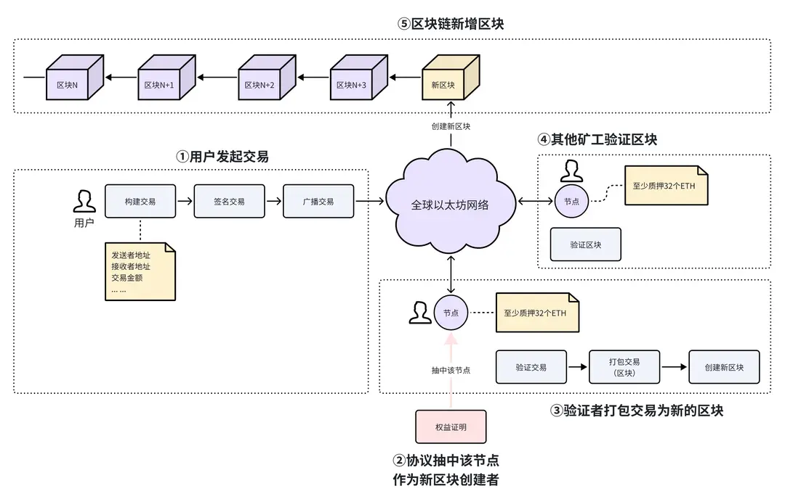

# 权益证明（PoS）

在区块链技术发展初期，最广为人知的共识机制是 PoW 工作量证明（详见上一章节）。然而，随着时间的推移，人们逐渐意识到 PoW 机制存在一些问题，例如电力能耗巨大和算力集中化，网络去中心化的特性受到威胁。为了解决这些问题，权益证明机制（Proof of Stake, 以下简称 PoS）应运而生。

## 工作原理

与 PoW 机制不同，PoS 机制不依赖于算力竞争。参与者通过质押一定数量的加密货币，来获得成为区块创建者（也称为验证者）的资格。

每次创建新区块时，区块链协议会从所有质押的验证者中随机抽选一名，当被抽中的验证者创建一个区块后，其他节点将会对该区块进行验证。如果验证通过，该区块就会被添加到区块链上，并且创建者将获得一定的加密货币作为奖励。每个验证者被抽中的概率与质押的金额大小有关，通常质押越多的验证者被抽中的机会越大。例如，在以太坊 2.0 版本中，验证者至少需要质押 32 个以太币（ETH）才有资格创建区块。通过这种方式，PoS 机制实现一个更高效、更节能的区块链网络。

我们来举一个例子，介绍权益证明机制的工作过程：假如小明有一定数量的以太币（ETH），他希望成为以太坊网络的验证者。

● 第一步：质押 ETH。小明将 32 个甚至更多的 ETH 转入以太坊的存款合约中，这些 ETH 将作为质押锁定在合约中，质押后小明就拥有了被提议的资格。

● 第二步：抽取验证者。假如小明比较幸运，质押后不久就被区块链协议选中为验证者，来创建下一个区块。

● 第三步：创建区块。当小明被选中后，他将负责在指定的时间内创建一个新区块。于是小明开始收集网络上未确认的交易，并验证这些交易的有效性，将它们打包成一个新的区块，广播到网络中。

● 第四步：验证区块。其他节点接收到这个新区块后，就会对区块进行验证。一旦验证正确，新区块就会加入区块链中，小明也将获得一定的区块奖励和交易费用作为回报。

## 小结

这一小节，我们学习了 PoS 机制的工作原理和价值。

简单来说，PoS 机制大幅降低了网络运行所需的能源消耗，并通过经济激励（如交易费用和区块奖励）鼓励持币者参与到网络中。此外，PoS 机制还设有惩罚措施，如“质押削减”，如果验证者行为不当或试图攻击网络，他们将失去一部分或全部质押的代币。总的来说，PoS 机制通过奖励和惩罚的手段鼓励验证者诚实地行事，共同维护以太坊网络的安全和稳定。
