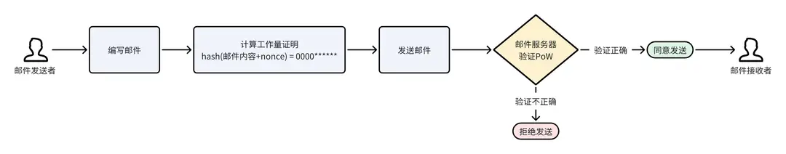
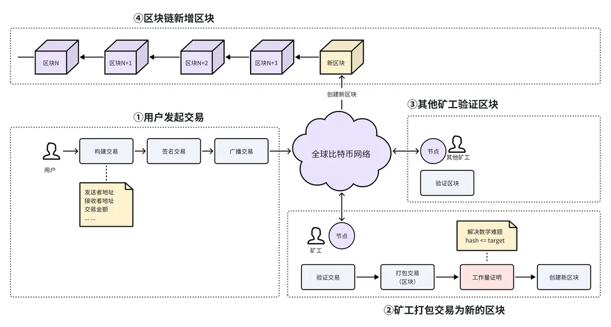
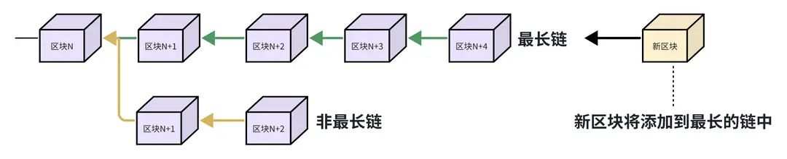

# 工作量证明（PoW）

## Pow 机制历史介绍

介绍区块链的工作量证明机制（Proof of Work，以下简称 PoW）之前，我们先了解一下 POW 机制的历史，便于更好的理解它的原理。POW 的概念最初并非为加密货币而生，它在 1993 年由 Cynthia Dwork 和 Moni Naor 提出，用于抵御电子邮件服务中的垃圾邮件攻击。其基本思想是：要求用户在发送电子邮件之前，先计算一个和邮件内容相关的数学难题，并将计算结果附加在邮件上才能被邮件服务器接收。



具体流程如下：1.用户编写一封邮件。

2.用户发送邮件前必须先解决一个工作量证明问题，通常是找到一个符合特定条件的数字（nonce），比如将邮件内容和这个数字的组合后，使用哈希函数计算出的哈希值前面有 4 个零。用户在电脑上进行计算，找到这个数字之后，将其附加到邮件上，然后发送。

3.邮件服务器接收到邮件和附加的数字，快速验证工作量证明是否正确（即检查哈希值是否符合要求）。

4.如果工作量证明是正确的，邮件就会被发送至目标邮箱；如果不正确，则拒绝发送。

工作量证明的计算过程需要消耗一定的计算时间和资源，对于正常用户来说，这个额外的工作量是可接受的，因为它不会影响正常的邮件发送。然而，对于垃圾邮件发送者来说，他们通常要发送成千上万封的垃圾邮件，这个计算过程要消耗大量的时间和资源。通过这样的机制，使得垃圾邮件的发送成本大幅增加，从而有效地减少垃圾邮件的数量。

## 为什么要使用 PoW 机制

2008 年，一个化名为中本聪（Satoshi Nakamoto）的人将 PoW 机制应用于比特币的创建过程中。

比特币是一个去中心化的分布式网络，当用户发起一笔新的交易后，网络中不存在一个中央权威来验证和确认交易。为了抵御恶意攻击，需要一种机制来确保所有网络参与者（节点）对交易记录的有效性和区块链的状态达成一致。POW 机制解决了这个共识问题，可以为比特币网络提供去中心化的安全保障，使得网络的运行不依赖于任何单一实体，以确保网络的安全性。

交易验证方式：中心化网络 VS 去中心化网络

在传统的中心化金融网络中，每一笔交易都需要通过一个或多个中央权威的审核和确认，如银行、清算所、监管机构等，这些中央权威拥有对交易数据的访问权，并负责保证交易的安全和合规性。

相比之下，比特币等去中心化的区块链网络则通过分布式账本和共识机制来实现交易的验证和确认，无需中心化的权威机构。

## PoW 机制工作原理

那在区块链中，PoW 机制是如何工作的呢？

如下图，在比特币网络中，PoW 要求矿工通过解决一个数学难题来创建新的区块。这个数学难题实际上是在 1~2^256 之间找到一个数值（nonce），使得区块头信息的哈希值小于或等于网络当前的难度目标（target）。这个过程被称为“挖矿”。随着网络中的算力不断变化，为了确保创建区块创建的间隔时间相当，挖矿的难度目标（target）也会不断调整。



## PoW 机制案例讲解

举一个简单的例子来解释 PoW 机制的工作过程，我们的目标是找到一个 nonce 值，使得区块头信息的哈希值小于或等于难度目标（target），即哈希值以三个零开头。

难度目标：000fffffffffffffffffffffffffffffffffffffffffffffffffffffffffffff

矿工在打包交易后，产生的新区块头信息如下：

```
版本：1
上一个区块的哈希值：00065981574f0735bd36230451d837d12ad19f671a6d76ab0eefc6d55a7e8bec
Merkle 根：b3a24bbaff8d6de77c2a021e0f3f4a9e8a2f0dbd0ea1eea9ece5f2f424a2bd5b
时间戳：1582215247
难度指数：1d00ffff
Nonce：0（开始尝试的 nonce 值）
```

矿工的任务是不断改变 Nonce 值（从 0 开始累加），重新计算区块头的哈希值，直到找到一个小于或等于难度目标的哈希值。矿工开始尝试不同的 Nonce 值：

● 第 1 次尝试 (不满足条件)

Nonce：1 哈希值：fae998a99254508c137f0c535f8f25fbb69e7cc6af78a7f365546a87314dab77

● 第 2 次尝试 (不满足条件)

Nonce：2 哈希值：001a744a87365442d2593d896bda9942a128fa4c7acb3a47b0dd98c77fb67216

● 第 3 次尝试 (不满足条件)

Nonce：3 哈希值：0b3468b4bbc3f1614d592daeff613564ab1678694562a5e0033afa7e71bfffcc

… …

● 第 23568 次尝试 (满足条件，哈希值以三个零开头)

Nonce：23568 哈希值：00019c284da6661956525526eba9e09d474257b33a221130de29db6b926caca6

当尝试了 23568 次之后，即 Nonce 值为 23568 时，矿工找到了一个满足条件的哈希值（以三个零开头），这就意味着挖矿成功，新的区块可以被添加到区块链上。此时其他节点的矿工将验证这个区块是否符合难度要求，一旦验证正确，矿工将停止本次挖矿，立即开始下一个区块的挖矿。这是一个简化版的挖矿。在现实中，比特币网络的难度目标更加复杂，矿工通常需要尝试数十亿次 Nonce 值，才能找到符合条件的哈希值。新区块被添加到区块链上之后，创建区块的矿工将获得一定的代币奖励，比如 2024 年比特币减半后，挖矿奖励是 3.125 个比特币。

## 最长链原则

在比特币网络中，有大量的矿工在同时挖矿，很容易同时出现多个合法区块，导致区块链分叉。分叉后新创建的区块将添加到哪条链中呢？

此时矿工遵循最长链原则，默认选择最长的一条链，即总算力最大的链，作为有效链继续挖矿，因为最长链代表了网络中最大的工作量。



## 小结

这一小节，我们学习了 PoW 机制的原理和在比特币中的应用。

总结来说，PoW 机制有效的解决了去中心化分布式网络中的共识问题，允许系统中的各个节点在没有中央权威或相互信任的情况下达成一致，至今已成为许多加密货币广泛使用的共识算法。PoW 机制也使得对系统的攻击变得非常困难，因为攻击者需要控制超过 50% 的网络算力才能影响区块链的状态（51% 攻击）。

然而，PoW 机制也有劣势，例如高能耗和潜在的中心化风险。2014 年 GHash.IO 矿池的算力一度占到了全球比特币网络算力的一半以上，它理论上有能力进行“51% 攻击”，引起社区的广泛关注，后来 GHash.IO 自愿降低了自己的算力份额，承诺不会超过全网的 39.99%。
