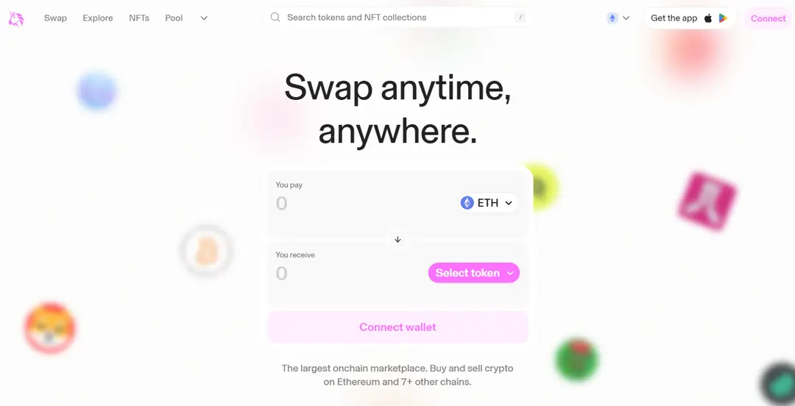

# 区块链及其应用场景

## 比特币简介

比特币是一种去中心化加密货币，由一个化名为中本聪（Satoshi Nakamoto）的人或组织在 2009 年创建，但中本聪的真实身份至今未知。与传统的法定货币（如美元、欧元、人民币等）不同，比特币没有中央银行来控制或发行。它只有电子形式，没有物理实体，只允许用户通过互联网来进行交易，且每一笔交易都是公开透明的，所有交易信息都记录在区块链这个分布式账本上。

## 区块链技术在比特币中的应用

比特币是第一个应用区块链技术的加密货币，主要体现在如下几个方面：

● 分布式账本：在比特币中，区块链记录了自比特币网络创建以来发生的所有交易，每一笔交易都会被打包进一个“区块”中，这些区块通过复杂的加密技术链接起来，形成一个连续不断的链条。

● 去中心化：由于区块链是去中心化的，所有的比特币交易信息并不是存储在一个单一的中心服务器上，而是分布在整个网络的所有节点上，每一个节点都有一份完整的账本拷贝。这种设计使得比特币网络很难以被攻击或篡改，因为要改变区块链上的交易信息，黑客需要同时控制网络上大于 50% 的节点。

● 安全性：在比特币区块链的每个区块中，不仅包含了交易数据，还包含了该区块的哈希值和前一个区块的哈希值。哈希值相当于区块的数字指纹，一旦区块中的交易数据被篡改，那么哈希值也会随之改变，使得篡改行为被立即发现。这一设计保证了比特币网络的安全性和不可篡改性。

● 挖矿与共识机制：在比特币中，矿工基于工作量证明机制（PoW）来维护区块链。矿工使用强大的计算机来解决复杂的数学难题（寻找满足难度目标的 nonce 值），这个过程称为“挖矿”。当矿工成功解决一个难题后，他们就可以将交易打包成一个新的区块，并广播到网络中由其他矿工来验证，一旦验证正确，该新区块将会被添加到区块链中。作为回报，创建新区块的矿工会获得一定数量的比特币，这是比特币发行的唯一方式。

## 以太坊简介

2013 年，一个年轻的程序员、同时也是比特币的狂热爱好者 Vitalik Buterin 注意到，比特币的区块链技术具有极大的潜力，但是其功能只用于处理货币交易。他想要创建一个更加灵活的平台，除了货币交易，开发者还能够构建各种应用。于是，以太坊于 2015 年应运而生。以太坊同样是一个开源的、去中心化的区块链平台，它不仅支持原生的加密货币：以太币（ETH），还提供了一个运行去中心化应用程序（DApps）的生态系统。这些应用程序通过智能合约来实现，运行在以太坊虚拟机（EVM）上。如果说比特币是一个全球分布式账本，那么以太坊就是一个全球分布式计算机。

## 智能合约

智能合约是以太坊平台的灵魂所在，它们是存储在区块链上的、可以自动执行的代码，代码中包含了所有的运行规则。当预设的条件被满足时，合约便会自动执行相关的功能。你可以把以太坊想象成一台自动售货机，你走到这台售货机前，选择了一瓶可乐，然后将需要的以太币（ETH）投入到售货机中。售货机内部运行的程序（智能合约）会自动验证你的支付，然后立即向你投递一瓶可乐。购买可乐的整个过程由智能合约来控制，无需第三方中介，降低了交易成本。智能合约代码是完全开源的，这样确保了交易的透明性。

## 以太坊和比特币的区别

在区块链世界中，比特币和以太坊是最著名的两个平台，尽管都使用了区块链技术，但它们在设计、目标和应用上有着本质的区别。两者的主要区别如下：

## 去中心化金融（DeFi）

去中心化金融（Decentralized Finance，简称 DeFi），是一种运行在区块链技术之上的金融生态系统。它通过智能合约（自执行的程序代码），实现了金融服务的自动化，同时也消除了传统金融体系中存在的中介机构如银行、经纪人等。在 DeFi 的世界里，所有的交易和服务都是透明的、无需许可的，并且对所有连接到互联网中的人都开放。

### DeFi 的价值

与传统的中心化金融（Cefi）相比，去中心化金融在可访问性、透明度、安全性、效率、创新性和去中心化等方面具有显著价值。

● 首先，DeFi 通过提供无国界的金融服务，确保全球的用户只需要连接互联网，就能够不受地理限制地进行交易。这对于那些传统银行服务不足或不可获得的地区尤其重要。

● 其次，DeFi 利用区块链技术公开记录所有交易，使得任何人都可以验证和审计这些记录。这种开放性极大地增加了系统的透明度和可信度，用户可以直观地看到资金流动，减少了隐藏费用和潜在的不正当行为。

● 在安全性上，DeFi 通过先进的加密技术来保护用户的资金和交易，大幅降低了欺诈行为和黑客攻击的风险。自动化的智能合约还确保了交易的无缝执行，无需传统金融机构复杂的手续和人工审核，从而提高了操作的效率。

● 在创新方面，DeFi 所提供的开放式开发平台吸引了全球的开发者参与，促使新的金融产品和服务不断涌现。这种基于社区的发展模式促进了创意的交流和快速迭代，加速了金融领域的技术进步。

● 最后，与传统金融机构可能存在宕机的风险不同，DeFi 的分布式结构从本质上消除了单一控制点，增强了整个系统对于故障和攻击的抵抗力。即便部分节点受损，整个网络仍可持续运行，保障了金融服务的连续性和稳定性。

### DeFi 典型项目

Defi 的典型项目有 Uniswap，它是一个建立在以太坊区块链上的去中心化交易所（DEX）。Uniswap 基于一套全新的自动做市商 ( AMM ) 模型，而不是传统的订单簿系统，允许用户无需中介即可交易不同的加密货币。

交易流程如下：

● 第一步：用户（流动性提供者）将他们的代币对存入资金池，比如往交易池存入一定数量的 ETH-USDT 代币对，为交易提供所需的流动性。

● 第二步：其他用户需要兑换代币时，比如用 ETH 兑换 USDT，他们只需要将 ETH 转入交易所，智能合约会自动按照当前的汇率进行交易，再转出指定数量的 USDT。
在 Uniswap 中进行交易，用户不需要信任任何第三方，因为所有交易都是通过代码自动完成的，这降低了欺诈和中介风险。

## 非同质化代币（NFT）

在介绍非同质化代币（NFT）之前，我们需要先了解“同质化”和“非同质化”的概念。在加密货币的世界里，同质化代表着可互换性。比如你拥有 1 个 BTC，而我也拥有 1 个 BTC，尽管这两个 BTC 可能在不同的钱包地址中，但它们具有相同的价值，可以直接交换，这就像你用一张 100 元的钞票换另一张同样面额的 100 元钞票一样。而非同质化代表着独一无二，不可替代。非同质化代币（NFT），正是这样一种唯一且不可互换的数字资产。NFT 通常用于证明资产的所有权，比如数字艺术品、收藏品等。

### NFT 的价值

与同质化代币相比，非同质化代币（NFT）在所有权验证、独特性、收藏价值、市场流通性以及参与性等方面具有独特的价值。具体如下：

● 首先，NFT 作为一种区块链技术的产物，能够为数字资产提供不可篡改的所有权证明。这意味着艺术家和内容创造者可以确保他们的原创作品被合法地认证和追踪，从而保护了他们的知识产权。

● 其次，由于每个 NFT 都是不可替代的，它们固有的稀缺性成为了价值的重要来源。尤其是对于那些独特的艺术品来说，这种稀缺性赋予了 NFT 较高的收藏价值。

● 再者，尽管 NFT 是非同质化的，但它们在全球范围内的多个平台上仍然可以被买卖和交换，这为 NFT 提供了流通性。随着市场的不断发展，这种流通性正在不断增强。

● 最后，部分 NFT 项目允许持有者对项目的发展进行投票，或者提供社区特定的福利。这增强了用户体验，使得 NFT 变得不仅仅是一个收藏品，而是一个拥有社群和生态的活跃项目。

### NFT 典型项目

以 CryptoPunks 为例，这是一个在以太坊上非常著名的 NFT 项目。CryptoPunks 是由 Larva Labs studio 创造的一系列 10,000 个像素艺术角色，每个角色都是独一无二的，且已经成为了加密艺术和文化的象征。它们不仅仅是图片，更是身份和地位的象征。CryptoPunks 项目的成功在于它结合了艺术、稀缺性和社区的力量，创造了巨大的经济价值和文化影响力。

## 去中心化自治组织（DAO）

去中心化自治组织（Decentralized Autonomous Organization，简称 DAO）是一种基于区块链技术的组织形式，它通过智能合约来自动执行组织的规则和决策。与传统的公司不同，DAO 没有管理层和中心权威，所有的决策都通过成员投票或预设算法来实现。组织成员通常持有代币，这些代币赋予了他们投票权，这样成员就可以直接参与到组织的治理中，比如提出提案、投票决定项目方向、资金分配等。

### DAO 的价值

与传统的公司相比，DAO 在透明度、信任要求、运营效率、参与民主性以及安全性等方面具有显著的优势。

● 首先，DAO 的所有决策过程和财务交易都是公开记录在区块链上的，任何外部审计者都可以轻松进行验证，从而提高了组织的透明度。

● 其次，在 DAO 中，成员之间的互动是通过代码执行的，成员只需信任这些智能合约的代码本身，不需要像在传统公司那样信任个别领导或者某个中心化的团队。

● 再者，由于智能合约可以自动执行任务，这降低了手工处理的需求，消除了许多不必要的中介环节，提升了组织运作的效率。

● 此外，DAO 允许每一个持有代币的成员参与到组织的决策中去，这种机制推动了更加民主化的决策过程，使得组织真正地由社区成员驱动。

● 最后，区块链技术的使用加强了 DAO 的安全性，因为它依赖于加密技术和共识算法来保护数据和资产，从而在很大程度上避免了外部攻击和内部滥用的风险。

### DAO 典型项目

以 MakerDAO 为例，它是一个运行在以太坊上的去中心化借贷平台。用户可以抵押加密资产（如 ETH），来生成一个稳定币 DAI。DAI 的价值锚定美元，旨在减少加密货币的价格波动风险。MakerDAO 的治理结构是典型的 DAO 模式。持有 MKR 代币的用户有权参与到 Maker 系统的治理中，包括调整稳定币 DAI 的发行政策、抵押物种类、风险参数等。这些决策都是通过公开、透明的投票过程完成的。

