# 开始

在当前 `solidity` 项目下：

```sh
npm install -g @remix-project/remixd
```

执行

```sh
remixd -s ./eth/project/fungibleToken -u https://remix.ethereum.org
```

可以看到控制台输出：

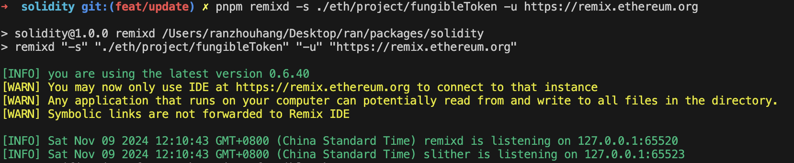

访问`https://remix.ethereum.org/`

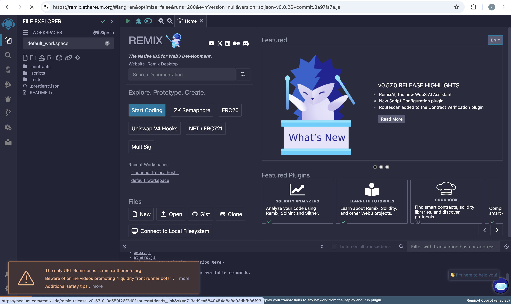

找到网站上的按钮，进行本地连接：

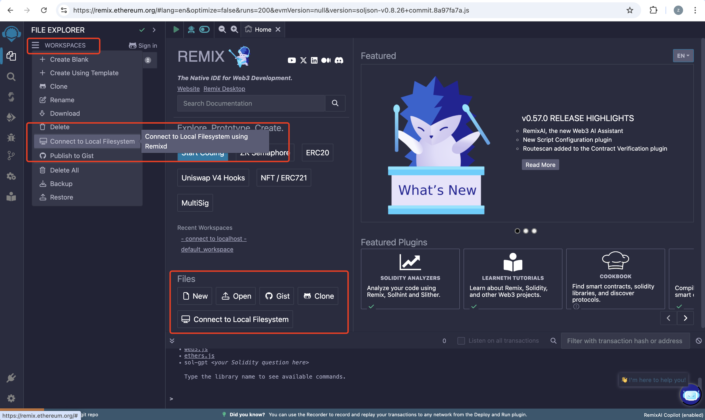

这样就能看到本地的文件了：

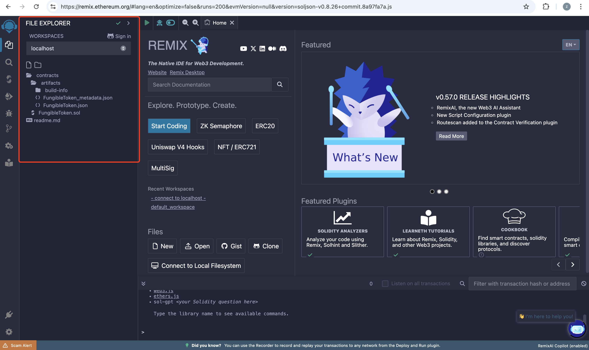

### 编译合约

然后去编译，这会检查我们合约中有没有语法错误

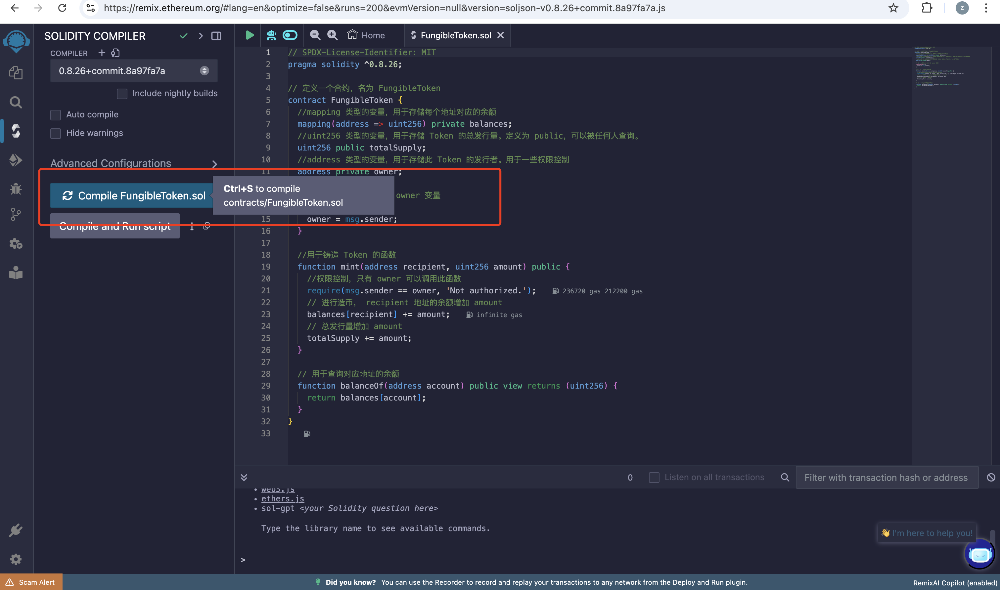

### 本地部署合约

我们首先对我们所写的合约进行功能测试，因此在这一步中，我们不需要将合约直接部署上链，那样每一步操作都会消耗 gas，所以我们先在本地使用 Remix VM 部署合约测试，确认无误后再进行将合约真正部署到区块链上。（合约一旦部署上链后就不可修改，所以一定要谨慎部署。）

1. 部署环境选择 Remix VM. (这里我们选择的是 Remix VM（Shanghai）)。
2. 点击“Deploy”部署合约。

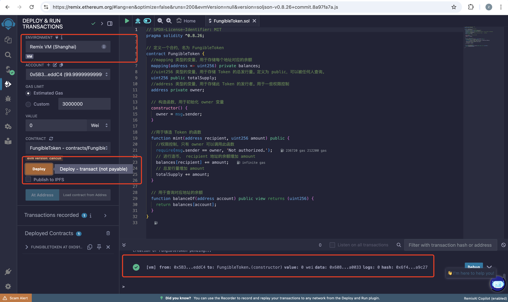

### 打开 mint 函数

还记得之前完成的“铸造”函数吗？现在我们可以通过 mint 函数来铸造代币。而在铸造之后，我们通常会通过查询函数去查询我们的余额，以确定铸币真的成功了，所以让我们来试试吧~

1. 将 mint 函数的下拉框打开

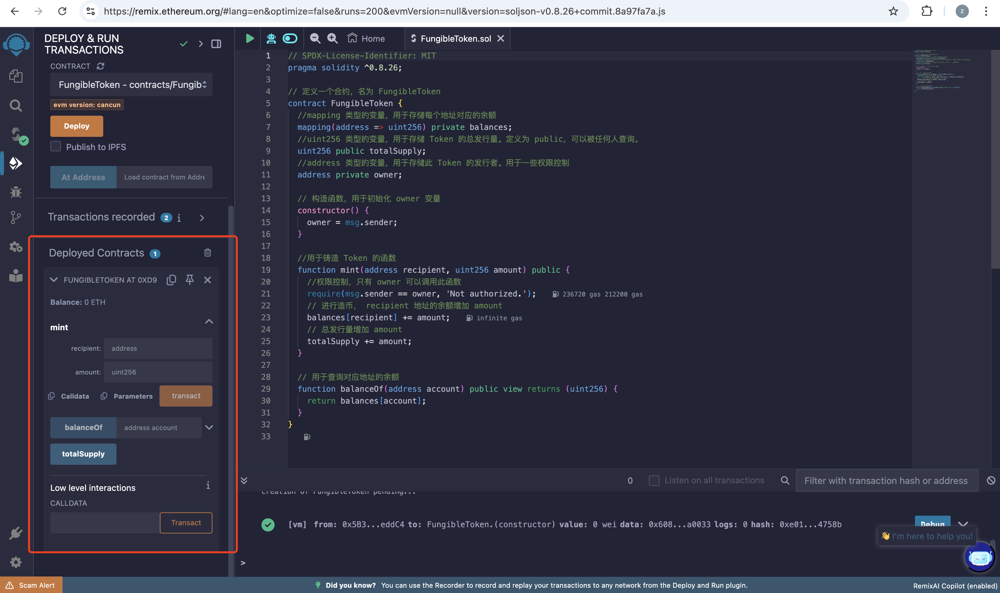

### 复制地址并交易

现在我们将调用 mint 函数，通过交易来铸造代币。

1. 复制我们的当前的账户地址
2. 将地址填写到 mint 的第一个参数字段
3. 在 mint 的第二个参数字段填写“100”
4. 点击 transact

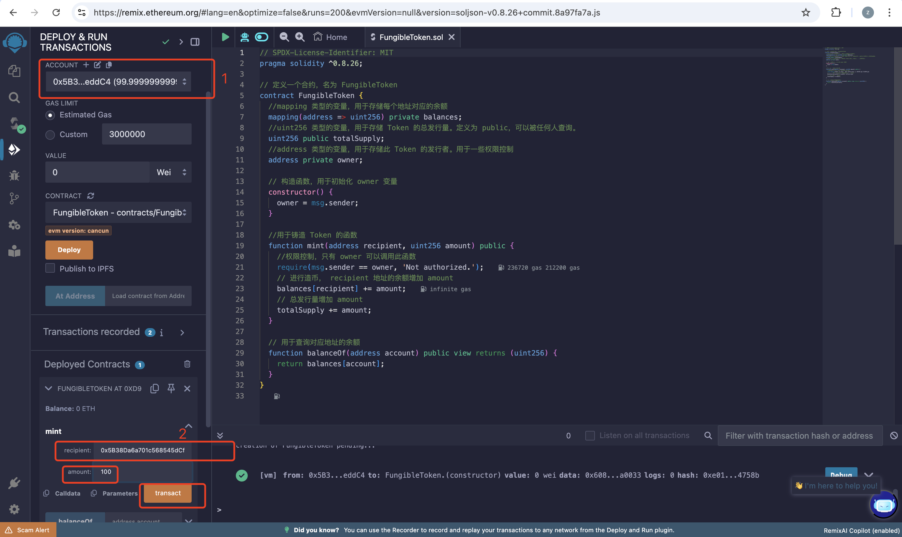

### 查询余额

由于我们刚刚给自己铸造了 100 个代币，所以我们现在的余额应该是 100。让我们来检查一下。TODO

1. 将刚刚 mint 处填写的 recipent 参数复制
2. 填写到 balanceOf 的参数框中
3. 点击 balanceOf 按钮

查看返回值应该为 100

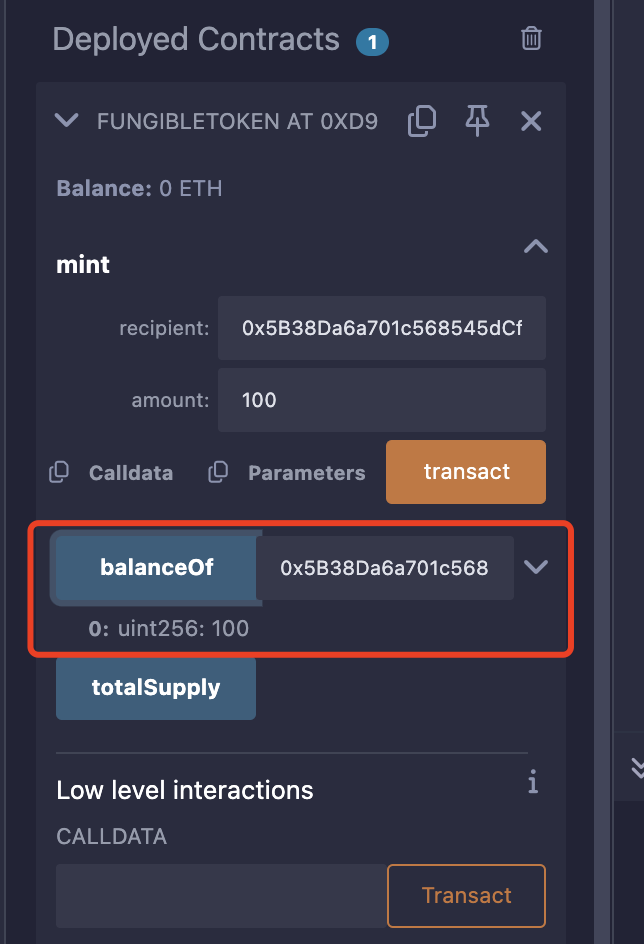

### 转账

到此为止，你应该确认的是“0x5B38……”这个地址拥有 100 枚你的自定义代币。接下来我们要将 40 枚代币转出，首先我们在 Account 中找到第二个默认地址“0xAb8…”。
目的是为了复制这个账户的地址

1. 点击 ACCOUNT 的展开框
2. 切换到第二个默认账号
3. 复制第二个账号的地址

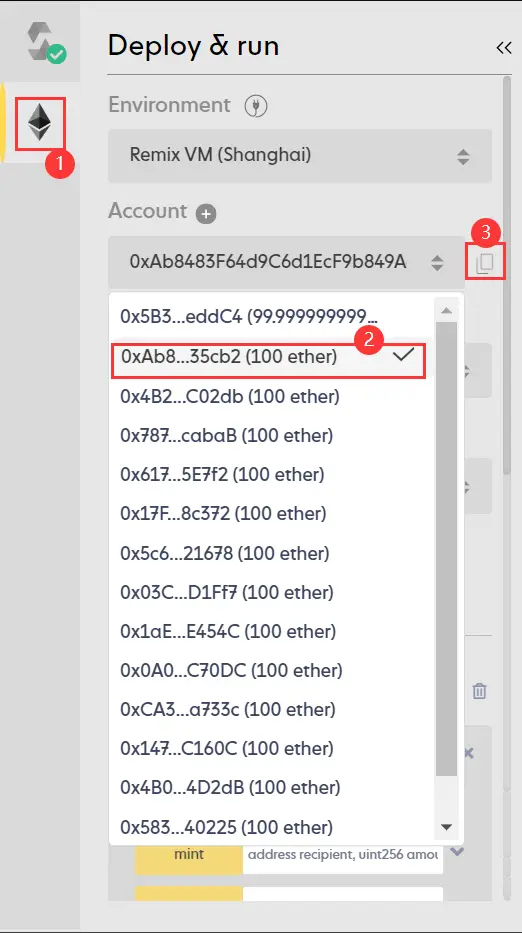

切换到原账号

接下来，我们需要切换回第一个账号。

1. 切换回原账号

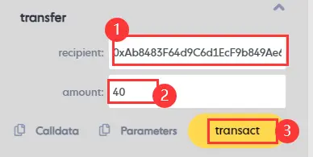

### 连接账户

很好！到这一步我们已经成功完成了合约的功能测试，确定我们的合约编写无误。我们可以将合约真正部署到链上了！（如果暂时没有部署需求可以跳过接下来的步骤。）在部署之前，我们需要先连接钱包。本教程中使用 MetaMask 做演示，要完成接下来的步骤，请确保您的浏览器已安装 MetaMask 钱包插件。

1. 点击左侧第二个图标
2. 选择 Injected Provider - MetaMask

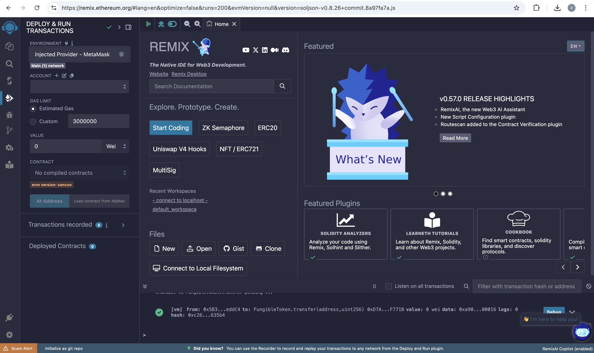

3. 在 Metamask 弹出框内点击 Connect 确认将钱包与 IDE 连接

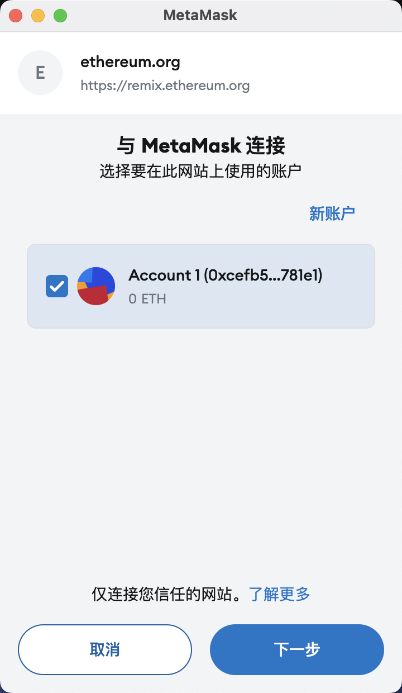

看地址一致就说明链接上了：

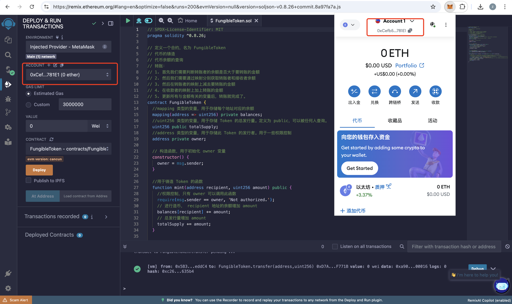

### 链上部署合约

在连接钱包后，我们准备开始将合约部署上链。本教程使用 Sepolia 测试链做演示，要完成接下来的步骤，请确保您的钱包配置并切换到了 Sepolia，且与 IDE 连接的钱包账户中拥有一定的测试币。（例如，我们可以在 [chainlink 的水龙头](https://faucets.chain.link/)领取）

选择测试网络进行部署，部署到主链上需要花费`GAS`,成本非常高

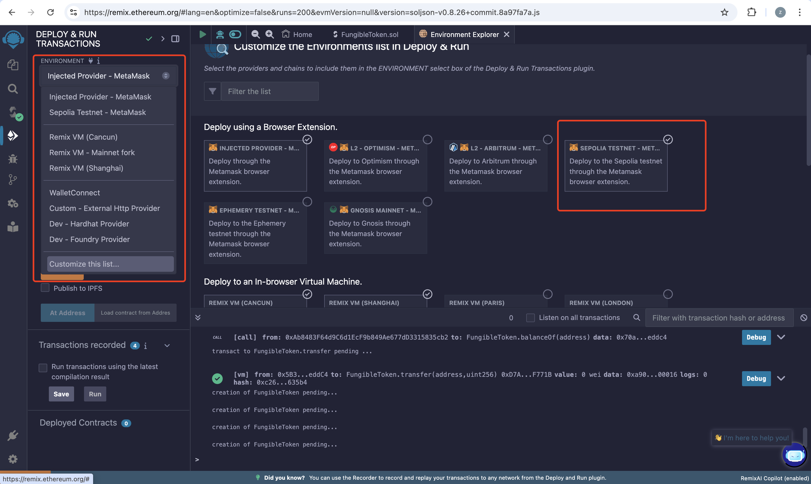

1. 点击 Deploy
2. 在 MetaMask 弹出框内点击 confirm 确认交易

需要注意，如果想要部署在`ETH`链上，需要注意提供一定的 GAS，否则会一致处于`pengding`状态

```sh
creation of FungibleToken pending...
```

### 查询合约信息

这是一个真正部署上链的合约！你可以去 Sepolia 提供的区块链浏览器中查询相关合约信息。TODO

1. 在 Deployed Contracts 中复制部署的合约地址。
2. 打开 [Sepolia 区块链浏览器](https://sepolia.etherscan.io/)，查询合约信息

# 参考文档

https://zhuanlan.zhihu.com/p/399445100

https://remix.ethereum.org/

https://www.jianshu.com/p/94422481d981

https://www.npmjs.com/package/@remix-project/remixd
