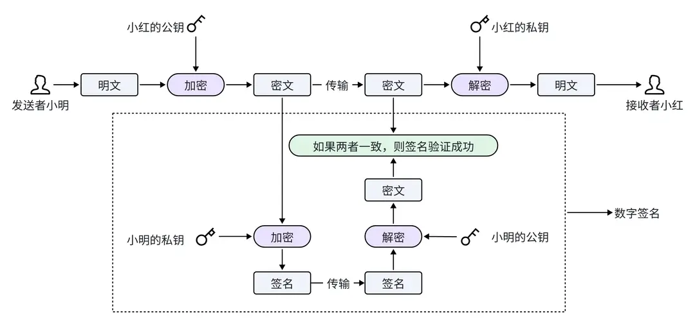
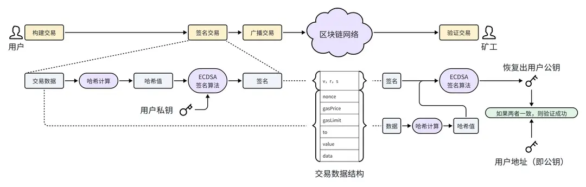

# 数字签名和交易验证

上一章节，我们介绍了非对称加密：使用公钥进行加密，使用私钥进行解密，这样可以确保信息传输的安全性。小明和小红正是使用了非对称加密技术，才使得保密信件的内容在传递过程中不被泄露。但是仅仅使用非对称加密来保护信件内容是不够的，因为小红的公钥是公开的，任何人都可以使用它来加密信息，假冒小明发送给小红。为了确保小红收到的信件确实来自小明，这里还需要另一种机制来验证消息的真实来源，这就是数字签名技术。

## 数字签名

数字签名技术使用私钥进行加密，使用公钥进行解密和验证，它能够验证消息是否由指定的发送者发出，并且在传输过程中没有被篡改，以确认信息的完整性和认证发送者的身份。

我们还是以小明给小红发送保密信件来举例，他们不仅使用了非对称加密技术，还使用了数字签名技术。

● 第一步：计算签名。小明先使用自己的私钥对消息密文进行加密，得到消息密文的签名，再将签名附加到消息密文中一起传输，发送给小红。

● 第二步：恢复签名。小红收到消息密文和签名之后，使用公开获得的小明的公钥对签名进行解密，得到消息密文。

● 第三步：验证签名。小红将收到的密文和解密签名恢复出来的密文进行对比，如果两者一致，则签名验证成功，说明收到的信件确实是小明发出的，同时还能证明信件在传输过程中没有被修改。

> 因为公私钥加密算法执行比较慢，如果消息比较大，签名过程会消耗很长时间。所以在实际应用中，一般先计算消息的哈希值，再计算哈希值的签名，这样可以减少签名耗时。还记得前面章节学习的哈希函数吗？无论消息内容有多少，计算的哈希值都是固定长度的。

## 交易验证

在以太坊中，数字签名技术用于交易验证，确保交易的真实性、完整性。交易验证主要有如下几步：

● 用户签名交易。用户将交易数据准备好后，先计算出交易数据的哈希值，再使用椭圆曲线签名算法（ECDSA）对哈希值进行签名，将签名值（v,r,s）附加到交易数据中进行广播。

● 矿工验证交易。矿工接收到一笔交易之后，同样，先计算出交易数据（不含签名）的哈希值，再使用椭圆曲线签名算法（ECDSA），从签名和哈希值中恢复出用户公钥。最后将恢复出的公钥与用户钱包地址做对比，如果两者一致，则交易验证成功。

对于初学者来说，为了方便理解，可以简单的认为用户钱包地址就是公钥。但是请注意，实际上两者并不相等，用户钱包地址是由公钥先经过哈希计算，再取末尾 20 个字节而来的。在后面的章节，我们会做详细介绍。

## 小结

这一小节，我们学习了数字签名的概念及其在交易验证中的重要作用。简单来说，数字签名是一种使用私钥加密、公钥解密的技术，它保证了消息的真实性和完整性。通过这种方式，可以验证信息确实由发送者发出，并且在传递过程中未被篡改。这在加密货币交易中非常重要，可以用来确保交易的安全性。
