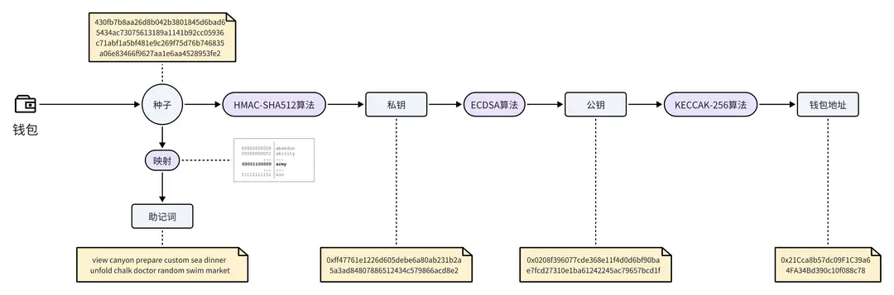

# 钱包地址生成和作用

## 钱包和钱包地址

在 Web3 生态中，钱包扮演着一个至关重要的角色，因为钱包中保存着可以让你控制资产的关键信息：私钥。与真实世界的钱包不同，Web3 钱包并不直接存储加密货币（加密货币都存储在区块链中），只用来管理和交易加密货币。钱包地址可以当做你在区块链上的账号，它是一个公开的字符串，主要用于接收和发送加密货币。就像你的银行卡账号一样，人们需要知道你的钱包地址才能向你转账。同样，当你想要给别人转账时，你也需要知道对方的钱包地址。比如，这是一个标准的以太坊钱包地址：0x21Cca8b57dc09F1C39a64FA34Bd390c10f088c78

## 钱包地址的生成过程

在前面的章节中，我们介绍了如何在 MetaMask 上创建一个数字钱包。虽然只需要在浏览器界面上简单操作，即可拥有一个钱包地址，但是这背后是一个复杂的生成过程。

下面介绍一下钱包地址生成过程中，涉及的几个关键步骤：

● 第一步：生成种子。种子是一个随机生成的数字序列，是后续的起点。种子可以由系统生成的随机数或用户提供的熵（比如随机移动鼠标产生的数据）来产生。

● 第二步：生成助记词。助记词是将种子转换成的一系列方便记忆的单词。在以太坊中，有一个固定的 2048 个单词的单词库，首先将种子分割成多个二进制数据片段，每一个片段对应单词库中的一个单词，最终形成一串单词序列，即助记词。

● 第三步：生成私钥。私钥是控制钱包地址的密钥。使用上一步的种子，通过 HMAC-SHA512 算法进行计算，可以得到私钥。

● 第四步：生成公钥。有了私钥之后，通过椭圆曲线加密算法（ECDSA），我们可以计算出对应的公钥。

● 第五步：生成地址。最后一步是生成钱包地址。首先使用 Keccak-256 哈希函数计算公钥的哈希值，然后取哈希值的最后 20 个字节，就是一个以太坊钱包地址。

## 常见的钱包类型

在 Web3 生态中，随着区块链技术的普及和应用的增多，出现了各种类型的钱包，以适应不同用户的需求和提高交易的便捷性。这些钱包类型大致可以分为以下几类：

● 软件钱包：软件钱包是一种在电脑或移动设备上安装的应用程序，它们可以是桌面钱包、移动钱包或网页钱包。

● 桌面钱包：桌面钱包安装在个人电脑上，提供安全性较高的存储选项，但对设备有一定依赖性。如 Electrum、Exodus。

● 移动钱包：移动钱包安装在智能手机上，方便用户随时随地进行交易。如 Trust Wallet、MetaMask 移动版。

● 网页钱包：网页钱包通过浏览器访问，方便快捷，但安全性较低，更适合小额交易。如 MyEtherWallet、MetaMask 网页版。

● 硬件钱包：硬件钱包是一种物理设备，外形类似 U 盘，可以离线存储私钥，具有非常高的安全性。它们不容易受到网络攻击，但价格相对较高，适合长期存储大量资产。如 Ledger Nano S、Trezor。

● 纸钱包：简单来说，纸钱包就是将公钥和私钥打印在纸上，完全离线，避免了在线攻击的可能，但纸质材料容易损坏，且不便于频繁交易。

● 托管钱包：托管钱包由第三方服务商管理，用户只需注册账户即可使用，它们操作简便，对初学者友好，用户不必担心私钥的安全和管理问题，但需要信任并依赖服务商的安全性和稳定性。如 Binance 交易所提供的钱包。

● 多签钱包：多签钱包顾名思义，需要多个签名才能执行交易，提供了额外的安全性。这种钱包适合团队和合作伙伴之间的资产管理，如 Gnosis Safe。

## 如何选择钱包

每种钱包都有其独特的使用场景和优势。用户在选择钱包时，需要根据自己的需求和对安全性、便捷性的偏好来决定。例如：

● 对于重视安全的用户，硬件钱包或纸质钱包可能是最佳选择；

● 对于经常交易的用户，移动钱包或网页钱包可能更合适，因为它们提供更快的访问和操作；

● 对初学者来说，如果不想管理私钥又担心私钥泄露，托管钱包可能是一个比较好的选择。

## 钱包安全最佳实践

在 Web3 的世界里，钱包不仅仅是管理加密资产的工具，还是你在去中心化网络上的身份凭证。钱包的安全直接关系到你的资产安全，如果别人得到了你的私钥，就像是别人拿到了你的银行卡密码，他们就可以完全控制你的钱包和里面的资产。因此，钱包的安全非常重要。下面介绍一些保护钱包和管理私钥的最佳实践：

● 保密你的私钥和助记词：私钥和助记词必须保密，永远不要分享给任何人。如果需要备份，请使用纸和笔记下来，并进行多份备份，妥善保管在安全的地方。

● 使用硬件钱包：硬件钱包相比软件钱包来说，提供了更高级别的安全性。它可以离线存储你的私钥，减少私钥泄露或被黑客攻击的风险。

● 启用多重认证：启用多重认证（如两步验证）可以增加一层安全保障，比如托管钱包的邮箱认证和身份验证器认证。即使黑客知道了你的密码，没有第二层认证，他们也无法转走你钱包里的资产。

● 定期更新软件：确保你的钱包软件和相关应用都是最新版本，这样能够及时修复已知的安全漏洞。

● 防范钓鱼攻击：时刻警惕钓鱼攻击，请在使用钱包签名前确认消息是否正确，并且不要点击来历不明的邮件或链接，不要在不安全的网站上输入私钥信息。

● 分散风险：请不要将所有资产存放在一个钱包中，可以考虑分散存放到不同的钱包，以降低被盗风险。

● 保持警惕：随时关注 Web3 相关的安全新闻和更新，了解新的安全威胁和防护措施。
