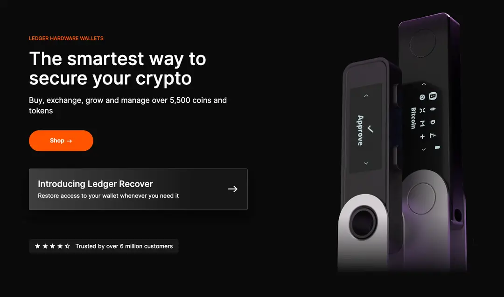
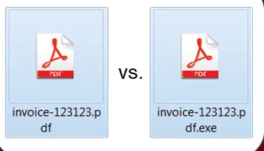

# web3 钱包

Web3 钱包是一种数字货币钱包，专为与 Web3 技术（去中心化网络）集成而设计。与传统的数字货币钱包不同，Web3 钱包允许用户与去中心化应用程序（DApps）进行交互，签署交易并管理其加密资产，而无需信任中心化的第三方。这种钱包通常支持多种加密货币，并提供安全的私钥管理功能，以确保用户的资金安全。

> Web3 钱包就像我们的现实生活中的钱包跟保险柜，现实钱包跟保险柜存放着你现实的重要资产，Web3 钱包存放着你的加密货币和数字资产，并且它存放在一个相对安全的空间，不像现实当中存放在某个银行某个地方，它不属于任何第三方机构或组织，让你能够更安全地访问和管理它们。
> web3 钱包也不像传统数字钱包如支付宝钱包，微信钱包，apple 钱包等，你可以使用它们来进行线上支付、转账和消费，但它们仍然依赖于中心化的金融机构和支付平台。你需要信任这些平台来保护你的资金安全，并且它们对你的资金有一定的控制权。Web3 钱包更加去中心化，用户拥有更大的控制权和隐私保护。

## 实际应用

在 Web3 世界里，有几款备受欢迎的钱包应用，它们在安全性、易用性和功能性上都有着不同的特点，成为用户的首选。以下是一些热门的 Web3 钱包：

1. MetaMask：MetaMask 是最知名的以太坊钱包之一，它是一个浏览器插件和移动应用程序，允许用户在网页浏览器中轻松访问以太坊 DApps，并管理其加密资产。

2. Trust Wallet：Trust Wallet 是一款安全的移动钱包应用，支持多种加密货币，包括以太坊和比特币。它提供了简单易用的界面，支持与 DeFi 应用程序的集成。

3. Coinbase Wallet：Coinbase Wallet 是由加密货币交易平台 Coinbase 推出的钱包应用，支持以太坊和 ERC-20 代币，同时还提供了内置的 DApp 浏览器。

4. Binance Chain Wallet：Binance Chain Wallet 是由加密货币交易平台 Binance 推出的一款钱包应用，旨在与 Binance 智能链（BSC）兼容，支持多种加密货币和 DApp。

5. Trezor：Trezor 是一款硬件钱包，以其高安全性和便携性而闻名。它支持多种加密货币，包括比特币、以太坊等，是安全存储加密资产的理想选择之一。
   这些钱包应用在 Web3 生态系统中扮演着重要角色，为用户提供了安全、便捷的加密资产管理解决方案。

## web3 钱包形式（类别）

钱包从应用形式（分类）来说主要分两大类：

### 冷钱包（Cold Wallet）：

冷钱包是指不连接到互联网的加密货币钱包，主要用于离线存储加密资产。

● 硬件钱包

● 纸钱包

### 热钱包（Hot Wallet）：

热钱包是指连接到互联网的加密货币钱包，方便用户进行快速交易和日常使用。

● 浏览器钱包

● 移动端钱包

● 桌面钱包

● 网页钱包

注：热钱包不能变成冷钱包，但冷钱包一旦其私钥存储在线就可以变成热钱包。当我们进入 web3 世界，随着时间的推移，我们的钱包数量也会不断增加，因为不同的用途决定着你使用哪个钱包，同时用途也决定着你会如何对待这个钱包。

## 浏览器钱包

浏览器钱包是一种在网页浏览器中运行的加密货币钱包。它们通常作为浏览器插件或扩展程序提供，允许用户在浏览网页的同时管理其加密资产。这种钱包使用户能够直接在网页上执行加密货币交易，与去中心化应用程序（DApps）进行交互，并访问区块链网络。

> 如 MetaMask、Rabby 等，是作为浏览器的插件安装在用户的浏览器（如 Google Chrome、Firefox 等）

特点

1. 易于使用：用户可以直接通过浏览器访问和操作钱包，无需下载额外的软件，操作简便快捷。
2. 即时接入：浏览器钱包使得用户能够快速接入加密货币网络，进行交易或参与去中心化应用（DApps）。
3. 集成性：浏览器钱包通常可以轻松地与多个网站和服务集成，如加密货币交易所、NFT 市场以及各种基于区块链的应用。
4. 低门槛：对新用户而言，浏览器钱包的接口通常更友好，上手更快，降低了进入加密货币世界的门槛。
5. 多币种支持：许多浏览器钱包支持多种加密货币，方便用户管理和交易多种资产。
6. 安全风险：与硬件钱包相比，浏览器钱包的安全性较低，因为它们更容易受到网络攻击，如钓鱼攻击、恶意软件入侵等。
7. 备份与恢复：和硬件钱包类似，浏览器钱包也使用助记词进行备份和恢复，但用户需要对助记词的安全存储负责。

总的来说，浏览器钱包是一种方便、安全的加密货币管理工具，适合那些经常使用网页浏览器进行加密货币交易和互动的用户。

## 移动端钱包

移动端钱包是一种安装在移动设备（如智能手机或平板电脑）上的加密货币钱包应用程序。这种钱包应用允许用户在他们的移动设备上安全地存储、接收和发送加密货币，以及与去中心化应用程序（DApps）进行交互。

> 如 Trust Wallet、MetaMask Mobile 等，作为应用程序提供，用户可以在移动设备上下载和安装

特点

1. 便携性：移动端钱包可以随时随地携带，用户无需依赖于桌面电脑或笔记本电脑即可访问其加密资产。
2. 易用性：大多数移动端钱包应用都具有简洁直观的用户界面，使用户能够轻松地管理其加密货币资产。它们通常提供简单的功能，如收款、转账和查看交易历史记录。
3. 安全性：移动端钱包通常采用高级加密技术来保护用户的私钥和敏感信息。此外，许多钱包应用还提供额外的安全功能，如指纹识别、密码保护和双重验证，以增强用户的资产安全。
4. DApp 集成：一些移动端钱包应用提供内置的 DApp 浏览器，使用户能够直接在钱包应用内与去中心化应用程序进行交互，无需额外的操作。
5. 支持多种加密货币：大多数移动端钱包支持多种加密货币，用户可以在同一应用程序中管理多种不同类型的加密资产，提高了便利性和灵活性。
   总的来说，移动端钱包是一种方便、安全的加密货币管理工具，适合那些经常使用移动设备进行加密货币交易和互动的用户。

## 桌面钱包

桌面钱包在加密货币问世的早期较为常见，是一种安装在个人电脑（如台式机或笔记本电脑）上的加密货币钱包应用程序。与移动端钱包相比，桌面钱包通常具有更多的功能和更高的安全性，适合那些更喜欢在桌面环境下管理加密资产的用户。

> 如 Electrum、Sparrow 等，作为应用程序提供，用户可以在计算机设备安装下载

特点

1. 高安全性：桌面钱包通常在用户的个人电脑上运行，私钥和加密资产数据存储在本地，因此具有较高的安全性。用户可以自行负责保护钱包应用程序和设备的安全，从而降低了第三方入侵的风险。
2. 丰富的功能：桌面钱包通常提供丰富的功能，包括收款、转账、交易历史记录查看、地址簿管理、多账户管理等。一些桌面钱包还支持与硬件钱包的集成，提供更高级的安全性和功能。
3. 备份和恢复功能：桌面钱包通常提供备份和恢复功能，用户可以轻松地备份和恢复他们的钱包数据，以防止意外丢失或损坏设备时丢失资产。
4. 支持多种加密货币：大多数桌面钱包支持多种加密货币，用户可以在同一应用程序中管理多种不同类型的加密资产，提高了便利性和灵活性。
5. 定制化选项：一些桌面钱包提供了丰富的定制化选项，用户可以根据自己的偏好调整钱包的外观和功能，以及安全设置和隐私选项。

总的来说，桌面钱包是一种功能强大、安全可靠的加密货币管理工具，适合那些更喜欢在桌面环境下管理加密资产的用户。

特点

1. 高安全性：桌面钱包通常在用户的个人电脑上运行，私钥和加密资产数据存储在本地，因此具有较高的安全性。用户可以自行负责保护钱包应用程序和设备的安全，从而降低了第三方入侵的风险。
2. 丰富的功能：桌面钱包通常提供丰富的功能，包括收款、转账、交易历史记录查看、地址簿管理、多账户管理等。一些桌面钱包还支持与硬件钱包的集成，提供更高级的安全性和功能。
3. 备份和恢复功能：桌面钱包通常提供备份和恢复功能，用户可以轻松地备份和恢复他们的钱包数据，以防止意外丢失或损坏设备时丢失资产。
4. 支持多种加密货币：大多数桌面钱包支持多种加密货币，用户可以在同一应用程序中管理多种不同类型的加密资产，提高了便利性和灵活性。
5. 定制化选项：一些桌面钱包提供了丰富的定制化选项，用户可以根据自己的偏好调整钱包的外观和功能，以及安全设置和隐私选项。

总的来说，桌面钱包是一种功能强大、安全可靠的加密货币管理工具，适合那些更喜欢在桌面环境下管理加密资产的用户。

## 硬件钱包

硬件钱包是一种专门用来存储加密货币的物理设备，如比特币、以太坊等。它与软件钱包（即在电脑或手机上运行的钱包软件）相比，提供了更高的安全性。硬件钱包通常的形式是小型的 USB 设备，它能够将用户的私钥完全隔离于互联网，有效防止了黑客攻击和恶意软件的威胁。

> 如 Ledger、Trezo

特点

1. 高安全性：硬件钱包存储私钥的方式使其不与互联网直接连接，大大减少了被黑客攻击的风险。私钥在物理设备内生成和存储，不会暴露给外部系统。
2. 隔离性：进行交易时，私钥不离开硬件设备，仅在设备内部使用，从而保证了交易安全。
3. 便携性：硬件钱包通常体积小巧，如 USB 设备大小，便于携带。
4. 多币种支持：大多数硬件钱包都能支持多种加密货币，方便用户管理不同的资产。
5. 备份与恢复：通过助记词（一组可以恢复钱包的词汇）的方式，即使硬件钱包丢失或损坏，用户仍可以恢复其资产。
6. 用户友好性：尽管提供了强大的安全性，但现代硬件钱包的界面设计趋向于简单易用，适合各类用户。
7. 物理安全特征：一些高级模型还提供如 PIN 码保护、生物识别等物理安全措施，进一步提升安全性。

这些特点使得硬件钱包成为存储和管理重要加密资产的理想选择，尤其是对于那些希望远离网络威胁、注重资产安全的用户。

## 网页钱包（不建议使用）

网页钱包，是一种基于网页的加密货币钱包，用户可以通过网页浏览器访问和管理。但因为其背后的巨大安全风险用户需要谨慎选择使用

> myetherwallet

潜在风险

1. 网络攻击风险：网页钱包的安全性取决于钱包提供者的服务器和网站的安全性。如果这些服务器受到黑客攻击，用户的私钥和个人信息可能会受到威胁，导致资产损失。
2. 钓鱼网站风险：恶意者可能会创建钓鱼网站，冒充正规的网页钱包服务提供者，诱使用户输入私钥或其他敏感信息。如果用户被诱骗并输入了私钥，他们的资产可能会被盗取。
3. 密码管理风险：网页钱包通常要求用户设置密码或输入私钥来访问。如果用户选择了弱密码或者在不安全的环境下输入了私钥，那么他们的账户可能会受到攻击。
4. 中心化风险：许多网页钱包是由中心化的服务提供者管理和运营的，这意味着用户需要信任这些服务提供者来保护他们的资产和个人信息。如果这些服务提供者出现问题，用户的资产可能会受到影响。

## 纸钱包（不建议使用）

纸钱包是一种用纸质或者其他不可复制的材料制成的加密货币钱包，用于存储加密货币的私钥和公钥

潜在风险：

1. 易于丢失：由于是物理形式存在，纸钱包容易丢失，一旦遗失，资金将无法找回。
2. 容易损坏：纸钱包易受潮、火灾或其他破坏性因素影响，可能导致私钥损坏而无法访问资金。
3. 安全性依赖于保管：纸钱包的安全性取决于用户如何妥善保管，如果被盗窃或不慎泄露，资金可能遭受损失。

## 下载安全

当我们兴致勃勃的进入 Web3 世界，准备下载我们第一个钱包的时候，往往骗局就潜伏在身边。下载，看似简单的一个操作，其实一点不简单，原因：1.假冒钱包应用下载：很多人，真的很多人找不到正确的下载途径：如正确的官网，正确的应用市场，正确的应用，于是安装了假的钱包（对于硬件钱包，供应链攻击是硬件钱包安全性的主要威胁之一，用户要尽量选择在官网商店或授权经销商处选择购买）2.恶意篡改：很多很多人对下载了的钱包、应用无法确认是否被篡改过于是很可能上演一出天堂地狱的戏码，开心地想进入这个世界，但还没回过神来钱包就已经空空的了

## 安全下载

针对上面的第 1 点，我们可以使用以下的一些技巧：

● Google（注意搜索结果里的广告条目，非常不靠谱，注意搜索结果的内容，有可能你点击进去是一个类似官网的钓鱼网站，也有可能进去是一篇介绍相关内容的文章，里面提到的超链接不一定安全）

● 行业知名的收录，具备权威、认证的收录，如 CoinGecko、CoinMarketCap

● 多问一下你身边拥有 Web3 世界经验且值得你信赖的人
结合上面的技巧，互相佐证，就可以获取到正确的下载途径。针对第 2 点，当我们从正确途径下载了应用还需要我们去安装，在安装之前建议做一下是否被篡改的校验工作，这个工作无法从源头防止被篡改（如官网自己内部被黑，官网被入侵等），但可以防止源头被部分篡改，被中间人劫持篡改等情况如何防止被篡改而我们不知道的情况，我们可以做以下措施：

● 哈希校验：开发者会为钱包应用程序发布正式的哈希值（通常是 SHA-256）。用户在下载钱包后，可以使用工具计算下载文件的哈希值，并与开发者公布的哈希值进行比较。如果两者匹配，则文件未被篡改。

● GPG 签名：对于一些开源的 Web3 钱包，开发者可能使用 GPG 签名来保证文件的完整性。用户可以下载公钥，然后使用 GPG 工具来验证下载文件的签名是否有效。

● 利用社区力量：加入相关的社区论坛或 Telegram、Reddit 等社交媒体群组，获取其他用户的反馈和经验。社区成员经常会对可疑的文件版本发出警告。

## 实际案例

上面提供的两种校验文件一致性的方法我们都可以从 Sparrow Wallet 的下载页面“Verifying the Release”中参考学习，指南清晰，非常良心，诸君且用且珍惜

## 钱包备份

钱包备份是指将加密货币钱包的私钥或助记词保存在安全的地方，以防止丢失或损坏。私钥是访问加密货币的关键，而助记词是生成私钥的种子。(助记词非常重要，后续我们会在后面的文章中单独开一篇再详细介绍) 即使因为某一天出现天灾人祸，你把你的钱包丢失了（忘记密码，设备损坏无法登录等），那你也可以通过助记词把你的钱包恢复，被你所掌控说白了助记词就是保护你资产的最后一道防线，一定一定要保护好，务必确保它的安全，在创建跟恢复的场景尤其要小心，防止被偷窥发生的情况

备份方法：

我们所说的备份钱包，其实归根结底是备份助记词以下是一些知名的加密货币钱包提供商和相关项目的官方网站链接，它们提供了关于如何保护助记词的具体指南和建议：

1. 比特币安全项目（Bitcoin Security Project）：提供了关于比特币和加密货币安全的详细指南和建议。
2. Trezor：提供硬件加密货币钱包，并提供了有关安全存储助记词的建议和指南。

我做了一些归纳，主要是下面几点：

1. 离线存储：

● 手写备份：可以将助记词写在纸上，并将其存放在安全的地方，如保险箱、防火箱或其他防盗设备中。

● 使用硬件钱包：硬件钱包提供了安全的离线存储助记词的方法。

2. 分散存储：

● 将助记词分成多份，并分别存放在不同的地方，确保即使一份备份丢失也能够恢复资产。

3. 加密存储：

● 如果选择将助记词存储在电子设备上，务必使用强密码对其进行加密，确保安全性。

● 不要将加密密码存储在与助记词相同的地方，以防止一旦泄露导致资产被盗。

4. 定期检查和更新：

● 定期检查助记词的存储，确保它们没有受到损坏或腐败，需要时及时更新备份。5. 物理保护：

●使用防水、防火、防撕裂的纸张，以及耐用的存储介质，确保助记词备份的持久性和可靠性。

6.分享风险管理：

● 考虑将助记词的备份告知信任的家人或律师，以防万一自己无法访问。

## 备份误区

不要让你的备份策略太复杂！

往往我们为了能够更安全的保护好我们的数字资产会让我们的备份策略变得复杂，最终却导致了我们找不到它了，上面就是一个例子，主人公把助记词通过硬件保存起来并且埋藏到院子来的地下，但后面需要搬家了却找不到了。

## 连接和断开钱包

1. 连接钱包：

● 选择钱包和 DApp：用户首先选择一个钱包（如 MetaMask、Trust Wallet 等）和一个希望连接的 DApp。

● 授权请求：DApp 向用户的钱包发起连接请求。这个请求通常会弹出一个窗口，提示用户授权 DApp 访问其钱包地址和基本信息。

● 用户确认：用户在钱包界面中查看请求的详细信息，并选择批准或拒绝。如果批准，DApp 将获得对用户钱包的访问权限。

● 建立会话：一旦授权成功，钱包和 DApp 之间建立会话，DApp 可以与钱包进行交互，例如读取钱包地址、发送交易请求等。

2. 断开钱包：

● 用户操作断开：用户可以在 DApp 或钱包界面中选择断开连接。这个操作通常有一个显著的断开按钮。

● 自动断开机制：如果用户长时间不进行钱包和 DApp 的交互，钱包会自动断开连接。这个自动断开机制可以由 DApp 或钱包设置，通常为了增加安全性，避免未经授权的访问。

● 撤销权限：断开连接后，钱包会撤销 DApp 的访问权限，确保 DApp 无法再与钱包交互。

● 结束会话：钱包与 DApp 之间的会话结束，DApp 不再能访问用户的钱包信息。用户可以选择清理浏览器缓存和数据，进一步提高安全性。

3. 原理：

● 修改内容：用户在热钱包应用中创建交易或操作请求

● 签名：热钱包使用存储在设备中的私钥直接在在线环境中对交易进行数字签名。

● 广播上链：签名后的交易直接通过热钱包应用广播到区块链网络上。

## 连接操作

建立钱包连接之后我们会有两种操作

### 交易

你在区块链上进行需要消耗 Gas 的操作

● 发送 ETH

● 交换代币

● 购买 NFT

● 设置授权

### 消息

仅使用私钥签署消息，不需要消耗 Gas

● 向智能合约发送指令

● 操作已授权的资产

● 仅用于证明身份

Gas 是用于在以太坊区块链上执行交易和智能合约的费用。它的主要目的是限制并补偿以太坊网络中的计算工作量

### 安全问题

MetaMask 在其安全提示中提到：“不要在不安全的网络环境中连接钱包，例如公共 Wi-Fi。始终保持浏览器和钱包应用的更新，以防止安全漏洞被利用。使用硬件钱包是增加安全性的有效方法。”（来源：MetaMask Support）

Ledger 的官方文档强调：“连接钱包时，始终使用官方渠道下载和更新钱包软件。对于硬件钱包用户，确保每次交易都在硬件设备上进行物理确认，防止私钥泄露。”（来源：Ledger Security）

以下是我们需要注意的地方：

● 权限滥用：连接钱包时，如果不仔细检查 DApp 请求的权限，可能会授予 DApp 过多的权限，导致资产风险。

● 钓鱼攻击：假冒的 DApp 或网站可能会请求连接用户的钱包，从而窃取钱包中的资产。

● 恶意软件：连接过程中，如果设备感染恶意软件，可能会记录用户的操作和私钥信息，导致资产被盗。

同时，还有一些可能发生的场景譬如：钱包的更新迭代是如何不被植入恶意代码或后门？就像我们现实当中的更新某个软件版本之后产生了不良效果：发现了根本跟我现在的硬件不兼容，或者不理想甚至运行不了，安全这东西，无知者无畏、知者敬畏，许多点是细思极恐的。因此我建议：不要轻易更新，够用就好，当有必要更新的时候需要多方佐证，如利用社区力量、校验工具

## 私钥

它们就像一对孪生兄弟，它们是共存的，配对使用的，有私钥就会有公钥，所以这里简单说一下两者：

### 私钥（Private Key）

● 定义：私钥是一串随机生成的字符串，通常由一系列字母和数字组成。它是用户身份和资产管理的核心，必须严格保密。

● 用途：

● 签名：私钥用于对交易或信息进行数字签名，以证明该交易或信息确实由私钥的持有者发出。

● 解密：在非对称加密系统中，私钥用于解密由公钥加密的信息。

● 安全性：私钥一旦泄露，任何人都可以访问和控制与其相关的加密资产，因此需要高度保密。

### 公钥（Public Key）

● 定义：公钥由私钥生成，是私钥的配对密钥，可以公开分享。公钥用于验证由私钥签名的信息和加密数据。

● 用途：

● 验证签名：公钥用于验证交易或信息的数字签名，以确认该签名确实是由对应私钥生成的。

● 加密：在非对称加密系统中，公钥用于加密信息，使得只有拥有对应私钥的人才能解密。

● 安全性：公钥可以公开分享，不会影响安全性。

### 私钥与公钥的关系

● 公钥通过复杂的数学算法从私钥生成，但无法通过公钥反推私钥，这保证了非对称加密的安全性。

● 私钥和公钥配对使用，共同确保信息和交易的安全性和完整性。

## web3 钱包中的私钥

在 web3 世界中，钱包、私钥和助记词是核心概念，它们相互关联，共同构成用户管理和保护加密资产的基础。私钥是用户拥有和管理加密资产的核心是用户身份的唯一凭证，必须妥善保管，切勿透露给别人。

> 钱包就像我们的房子，里面涵盖我们的重要资产，而私钥就是唯一可以打开这个房子的钥匙，而助记词就是我们制作这把钥匙的秘方（制作方法），即使我们丢失了钥匙（私钥），我们仍然可以用助记词这个秘方去重新打造一把新钥匙，进而重新进入和管理我们的房子。

> 但是但是但是，钥匙我们也是一定要保管好的，即使我们拥有丢失钥匙可以重新造钥匙的秘方，你也很难保证丢失了的钥匙是否已经被别人利用打开了你的房子，夺取了你的资产，所以
> 我们一定一定一定要保管好我们的钥匙以及秘方

### 私钥的作用

● 资产控制：私钥赋予用户对其加密资产的完全控制权，只有拥有私钥的人才能发起交易或操作资产。

● 交易签名：私钥用于对区块链上的交易进行数字签名，确保交易的真实性和不可抵赖性。

● 身份验证：私钥作为用户身份的唯一标识，确保用户在去中心化应用（DApps）中的身份验证和授权。

### 私钥的常见的形式

原始私钥：通常是 256 位的二进制数。为了便于使用，常常以十六进制（hex）或其他格式表示，例如：0x4c0883a69102937d6231471b5dbb6204fe512961708279d87e7db96f4720c17a

## 助记词

上文我们就提到过助记词就是制作钥匙（私钥）的”秘方“，有了它我们就可以打造钥匙获得房子（钱包）的控制权，它的重要性是毋庸置疑的，因此在整个系列课程当中也不厌其烦的多次提到了它，下面就让我们来更多的认识它

### 它是

● 一组提供你访问钱包的单词

● 需要离线备份的东西

● 需要在多个不同的地方多重备份的东西

● 只应失去控制钱包权限输入的东西

### 它不是

● 像电话号码一样可以共享的

● 应该放在云端的东西

● 任何人、任何设备商需要的东西

## 助记词的特点

### 安全性

● 随机性和熵：助记词的生成依赖于随机性和熵。BIP-39 标准规定了生成助记词的流程，确保生成的助记词具备足够的随机性，从而提供足够的安全性。随机性越高，暴力破解助记词的难度也越大。

> 以 metaMask 钱包为例，当用户创建一个新钱包时，钱包应用会生成一个 128 位到 256 位的随机数，通过哈希算法生成一个校验位，然后按照词汇表将随机数映射为 12 到 24 个助记词。这些词语的组合方式几乎是无限的，确保了安全性。

> 注：上文提到的熵是用来衡量助记词中信息量和随机性的标准，代表了系统的不可预测性。熵越高，系统越安全。对于助记词来说，熵直接影响其安全性。因此，助记词本身是很安全的，你很难寻找到它的规律从而实现破解，基本上钱包被盗都是因为我们的私钥或者助记词被窃取了。

### 易用性

● 较好记：助记词的设计初衷之一就是为了提高加密资产管理的易用性，避免用户直接处理复杂的私钥。

● 跨平台恢复：助记词是通用的，可以在不同的钱包和平台之间进行恢复，这提高了用户更换设备和钱包的灵活性。

> 用户可以在 MetaMask 生成助记词，并在支持 BIP-39 标准的 Exodus 钱包中使用同一组助记词恢复他们的资产。

### 助记词的种类

助记词有多种类型，根据其安全性和应用场景的不同，主要包括以下几种：

● 明文

● 加密助记词

● 多重签名助记词

● Shamir's Secret Sharing，简称 SSS

#### 普通助记词

普通助记词是最常见的类型，通常由 12 到 24 个随机单词组成，用于生成单一的私钥。

用户在创建 metaMask 钱包时会生成一组普通助记词，用于备份和恢复钱包。

#### 加密助记词

在普通助记词的基础上，用户可以设置一个额外的密码来增加安全性。只有同时拥有助记词和密码的人才能恢复钱包

Ledger 硬件钱包支持用户在助记词基础上设置一个密码，以增加安全性。用户在创建钱包时，可以选择启用这项功能，确保只有知道密码的人才能访问钱包。

#### 多重签名助记词

多重签名助记词涉及多个助记词，每个助记词代表一个私钥，只有达到一定数量的签名（如 2/3 或 3/5）才能进行交易。

BitGo 是一家知名的多重签名钱包服务提供商，企业和大型投资者使用 BitGo 的多重签名钱包来确保资产安全。需要多个签名才能批准交易，从而降低单点故障和内部欺诈的风险。

### Shamir’s Secret Sharing (SSS)

Shamir’s Secret Sharing 是一种分割私钥的方法，将助记词分成多个部分，只有收集到足够多的部分才能恢复私钥。

Trezor 硬件钱包提供 Shamir’s Secret Sharing 功能，用户可以将助记词分割成多个部分，并分别保存在不同的安全地点或交给信任的人。这样即使部分助记词丢失或被盗，只有收集到足够多的部分才能恢复钱包。

业务参考实践：

https://guide.keyst.one/zh/docs/shamir-backup

https://wiki.trezor.io/Shamir_backup

## 数字签名

数字签名的基本概念

● 公钥和私钥：每个用户在 Web3 环境中都有一对密钥：公钥和私钥。公钥是公开的，可以与他人分享，而私钥必须保密，只有自己知道。

● 私钥签名：用户使用私钥对消息或交易进行签名。签名过程会生成一个独特的签名，只有对应的私钥可以生成。

● 公钥验证：任何人都可以使用签名者的公钥来验证签名的真实性。验证过程确保消息或交易未被篡改，并确认签名者的身份。

私钥签名：上面提到的私钥签名其实就是数字签名的一种具体实现。

### 数字签名的工作原理

1. 生成密钥对：用户生成一个公钥和私钥对。私钥必须保密，公钥可以公开。
2. 签名消息：用户使用私钥对消息进行签名。签名算法会结合消息内容和私钥生成一个唯一的签名。
3. 传输签名和消息：签名和消息一起发送给接收者或在网络上发布。
4. 验证签名：接收者使用签名者的公钥验证签名。验证过程确保签名确实由私钥生成，并且消息在传输过程中未被篡改。

### 数字签名的用途

● 交易验证：在区块链上，每笔交易都需要签名，以确保交易是由账户所有者发起的。

● 消息验证：数字签名用于验证发送给智能合约或其他用户的消息，确保消息的真实性和完整性。

● 授权和认证：在去中心化应用（dApps）中，用户可以使用数字签名授权特定操作或访问权限。

### 数字签名的安全性

● 不可篡改性：签名是基于消息内容和私钥生成的，任何对消息的修改都会使签名无效。

● 身份验证：只有拥有私钥的人才能生成有效的签名，因此签名可以验证签名者的身份。

● 防止抵赖：一旦用户对消息进行签名，无法否认自己签名的行为。

### 数字签名请求

很多时候我们会遇到以下三种签名请求：安全的，有时候安全，以及危险的

这个时候我们就需要去判断其风险然后根据风险类型作出相应的操作，那么如何判断呢，我们可以从以下几个方面入手：

● 来源：明确可信的网站提供的请求通常更加安全

● 消息内容：简单明了、不涉及资产转移的消息内容较为安全；复杂的交易或合约信息需要仔细验证；授权范围广的请求极其危险

● 签名请求的目的：明确声明不会产生交易的这类请求会更安全

根据上述方面我们再来对上述的三种请求作出分析：

#### 左边（总是安全）：

● 来源：https://opensea.io

● 消息内容：

- 欢迎信息
- 说明此请求不会触发区块链交易或产生任何手续费

● 签名请求的目的：仅用于身份验证

● 风险判断依据：

- 来源明确且可信
- 没有涉及交易或资产转移
- 请求内容简单，明确

#### 中间（有时安全）

● 来源：https://opensea.io

● 消息内容：

- 包含复杂的合约数据和条款

- 涉及具体的交易信息，如 offer 和 consideration

● 签名请求的目的：可能涉及特定交易或合约的签署

● 风险判断依据：

- 来源可信，但内容复杂

- 包含可能影响账户资产的交易信息

- 需要用户仔细检查交易条款以避免潜在风险

### 右边（危险）

● 消息内容：

- 说明签署此消息可能很危险
- 此签名可以执行任何账户操作，包括完全控制账户及其资产

● 签名请求的目的：完全控制账户

● 风险判断依据：

- 没有明确的来源信息
- 消息内容暗示高风险操作
- 请求权限广泛，可能导致账户被完全控制

## 常见授权形式

主要分为以下三种：

1. IncreaseAllowance

● 用途：增加特定代币的授权额度。

● 风险：可能会增加您的代币被转移的风险。

2. Approve

● 用途：批准特定数量的代币授权。

● 风险：只允许特定数量的代币被转移，相对安全。

3. SetApprovalForAll

● 用途：批准所有 NFT 的授权。

● 风险：授予对所有 NFT 的完全控制权，风险最大。

第三种授权是我们最好理解的，就是完全授权，相当于你把你的控制权完全交出去了，别人可以代理掌管你一切资产

至于 IncreaseAllowance 与 Approve 它们有什么不一样呢？

1. 覆盖 vs 增加：

● Approve：设置新的授权额度，覆盖之前的授权。

● IncreaseAllowance：在现有授权额度上增加指定数量。

2. 安全性：

● Approve：如果要减少授权额度，直接调用 Approve 设置一个较小的数值，但这种操作有潜在的安全问题。如果在减少授权额度的过程中，有另一笔交易在原额度下被批准，可能会导致安全问题。

● IncreaseAllowance：更安全的选择，通过增加授权额度避免了潜在的竞争条件问题。

3. 实际应用

● Approve：用于初次授权或者重新设置授权额度。

● IncreaseAllowance：用于在现有授权基础上增加额度，更加灵活和安全。

### 授权安全提示

● 仔细检查交易细节：在批准任何交易前，确保您完全理解其内容。

● 限制授权范围：尽量使用有限授权（如 Approve），避免使用完全授权（SetApprovalForAll）。

● 保持警惕：对于任何看似过于美好的交易保持警惕，不要轻易批准任何交易。

## 许可签名诈骗

在区块链和加密货币领域，一些代币的签名不需要特定协议的批准，这给潜在的协议或诈骗者提供了可乘之机。这类签名可以被滥用，导致用户的代币被盗或其他恶意行为。一些代币，如 ERC-20 代币，引入了 permit 功能。该功能允许持有者通过签名直接授予某个地址（通常是智能合约）代币的转账权限，而不需要执行传统的 approve 交易。这种机制简化了用户体验，但也增加了被滥用的风险。也有一些代币不需要链上批准即可使用离线签名，用户可以签署一笔交易，然后将签名发送给第三方，第三方可以代用户提交交易。这种机制方便了用户操作，但也容易被恶意方利用。如：

● USDC

● DAI

● stETH

### 如何避免

1. 使用安全工具：

● 使用如 Pocket Universe、Revoke、SafeSoul 和 Wallet Guard 等浏览器扩展工具。这些工具可以帮助用户识别潜在的恶意签名请求，并提供安全警告。

2. 仔细检查签名请求：

● 在签署任何消息或交易前，务必仔细检查签名请求的内容，确保你完全理解并信任请求方和请求内容。

3. 定期检查和撤销授权：

● 定期查看并撤销不再需要或可疑的授权，防止长时间未使用的授权成为攻击者的目标。

## 恶意市场签名

恶意市场签名其实就是一些非常难以阅读的消息内容，大多数几乎不可能去识别理解，诈骗者们就是故意这样做让无法识别然后趁机骗取你的签名/授权，最终偷走你的数字资产

● 特点：内容难以阅读

● 目标：偷走你的数字资产

### 防范措施

面对这些恶意的市场签名我可以使用安全减速带以及 TAP（三地址协议）来保护我们，关于这两者的内容我们将在 Unit5 中详细介绍，简单概括有下面几点：

● 不要轻易签署任何复杂的签名请求：如果您无法完全理解签名的内容，不要签署。

● 仔细检查签名请求：确保请求来自可信任的网站和服务。

● 使用分离策略：将不同用途的钱包分离，如铸币、交易和存储，避免全部资产暴露在同一个钱包中。

## 欺诈套路

### 欺诈套路案例

● 获取你的信任（例子：“相信我，兄弟”）

● 给你设定一个短时间限制去做出他想要你做的事情（例子：“要快点处理，不然空投就没有了”）

● 在几天或几周内持续不断地联系你（例子：“你好”，“又是我”）

● 通常会引入“帮手”——一个同谋者参与骗局（例子：会找一个同谋者证明空投领取成功，然后一起骗取你的信任）

● 利用你的经验不足处理不常见的事件（例子：“我可以帮你”）

### 防范措施

● 保持警惕：不轻信陌生人或未经验证的信息。

● 独立验证：核实信息和请求的真实性，不被时间压力或持久的联系所左右。

● 寻求帮助：在处理不常见事务时，寻求可靠的帮助和建议，不轻信陌生人的指导。

● 保护个人信息：不向陌生人透露敏感信息，如私钥、助记词等。

## 钓鱼攻击

Web3 钓鱼攻击是针对去中心化应用（dApps）、区块链用户和加密货币持有者的一种网络攻击形式。攻击者通过伪装成可信赖的区块链服务或去中心化平台，诱骗用户提供私钥、助记词、钱包密码等敏感信息，以窃取他们的加密资产。一般攻击的实现步骤为以下四个：

1. 信息收集、发放：
   攻击者确认攻击目标群体，目标用户，以及用户有可能访问的区域。
2. 伪装和诱导：
   设计仿冒的区块链服务网站、智能合约、应用程序或邮件，内容通常包括紧急通知、空投奖励、账户异常等等，以诱导目标点击访问。
3. 执行攻击：
   用户访问伪造网站伪造钓鱼程序后，输入关键信息如私钥、助记词或密码钱包，这些就会被盗取 并用于转移加密资产。
4. 资产转移：
   攻击者窃取敏感信息，访问用户的区块链钱包，将加密资产转移到他们控制的地方

### 常见的钓鱼形式

1. 假冒网站：
   攻击者创建一个看起来与真实网站极为相似的假网站，目的是诱导用户输入他们的私钥或其他敏感信息。
   https://suite.trẹzor.com,这个就是一个冒名网站冒充Trezor 官方域名，其真正的链接是 trezor.io，攻击者结合社会工程收集 Trezor 用户信息，并向他们发送邮件并带有假冒域名，混淆用户，从中盗取用户数字资产

2. 诈骗链接：
   攻击者会通过社会工程骗取你点击一些链接，这些链接里面会有大量的假冒信息，他们最终的目的都是诱使你去做一下你不应该做的事情，然后窃取你的资产

## 社会工程

社会工程是一种利用心理学和欺骗技巧来获取敏感信息、未经授权的访问或其他目标的攻击手段。它通常涉及与目标直接互动，以获取所需的信息或访问权限，而不是通过技术手段直接攻击系统或网络。
不单单在 web3 世界中，在我们现实世界当中的很多诈骗案例，电话诈骗、钓鱼邮件、社交媒体欺诈、身份冒用都用到了社会工程，社会工程的成功通常依赖于攻击者对人类行为的理解和利用，以及受害者的信任。

### 如何在 Discord/X 中保护自己

在 Web3 世界中，我们经常会在各种平台、网站留下我们的足迹，这就被诈骗者们有了可乘之机，诈骗者会联系你并且尝试获取你的信任从而达到诈骗的目的，为了防止这种情况发生，我们建议：

1.保持您的私信关闭

● 在 Discord 设置中关闭来自非好友的私信（DM），以防止陌生人随意私信您。

● 这可以防止骗子假冒受信任的机器人、管理员或其他用户进行欺诈。

2. 谨慎互动

● 不要轻易相信或参与信任交易，尤其是涉及高价值资产的交易。
● 不要点击任何来自不明或未经验证来源的链接，即使这些链接看起来是来自受信任的人。

● 对于突然出现的铸币活动或时间敏感的公告保持高度警惕，确认消息的真实性后再进行操作。

### X（Twitter）@verified（认证）账户。

X（Twitter）的认证账户也不完全可信，诈骗者很多使用会入侵或购买一个在 X 平台被认证的账户用于去获取别的用户的信任然后实施诈骗计划，他们可能会有以下的行为：

1. 骗子会入侵或购买一个在 X 平台上的 @verified（认证）账户。
2. 使用大量机器人来转发/点赞，并可能禁用评论。
3. 他们会要求你点击一个链接或去一个奇怪的网站进行铸造或认领。
4. 他们会进行假赠品活动，在帖子中@你等。

### 不要进行屏幕共享

有时候我们遇到一些问题并且把它发到社区/平台寻找帮助时，骗子会假装是支持人员或试图帮助你解决问题。他们会要求你进行屏幕共享并执行一些操作，包括：

● 要求你打开开发者控制台，暴露你的 Discord 认证令牌，并允许他们登录你的 Discord（即使你启用了双重认证 (2FA)）。

● 要求你进入设置 -> 安全 -> 在 MetaMask 中显示私钥……（但可能会先要求你更改语言设置！）
当我们面对如此情况时我们需要：

● 绝不屏幕共享：在任何情况下都不要与不明身份的人进行屏幕共享，特别是涉及到敏感信息时。

● 验证身份：在分享任何信息前，务必验证对方的身份，确保他们确实是可信的技术支持人员。

● 保护隐私：始终保持敏感信息的私密性，不要在屏幕共享或截图中显示。

### 针对 X（Twitter）我们还可以修改下面的设置来提高我们的安全

● 私信关闭：Privacy and Safety → Direct Messages

● 管理静音通知：Privacy and Safety → Mute and block → muted notifications 您可以限制时间线上的显示内容，大多数诈骗都是利用赠品的诈骗链接，我们可以通过限制以下通知去保护我们

1. 新帐户

很多此类帐户很快就会被禁止。如果有人是 Twitter 新手，他们可能不应该立即向您发送垃圾邮件，对吗？这种行为是不正常的。

2. 无需确认电子邮件

虽然这可能无法阻止很多垃圾邮件/诈骗者，但这是每个合法 Twitter 用户都会做的事情。

3. 默认 PfP -

这是 NFT 空间。如果你没有 PfP，你还在干什么？同样，这并不能阻止很多垃圾邮件发送者，但切换起来很容易！

4. 不关注您的人

这一点比较有争议，您肯定会错过一些警报，这很不幸，但如果有人真的想联系您，他们可能已经在关注您，或者他们会先关注您！

5. 不确认电话号码

虽然这是一个好主意，但有些人并不会确认他们的电话号码，而且 Twitter 已经采取了很多措施来限制和审查此类账户。我推荐这样做，尽管我个人没有这样做。

6. 您不关注的人

核心选项。如果您被垃圾邮件和诈骗警报淹没，可能需要这样做才能清除它们。一些有影响力的人还建议暂时将您的帐户设为私人帐户，以尝试摆脱它们。只有您真的想锁定您看到的内容时才这样做。

● 审核您链接的应用程序：Security and account access → Apps and sessions → Connected apps 定期检查/撤销你的授权当然是很重要的

● 使用质量过滤器：Notifications → Filters 它将可以帮你过滤一些重复的，垃圾的推文，改善你的体验

## 恶意程序攻击

恶意程序攻击是指利用漏洞，针对计算机系统、网络或区块链技术进行的恶意行为。在区块链领域，恶意程序攻击包括对智能合约、去中心化应用（DApps）、加密货币钱包和区块链网络的攻击。

● 许多恶意软件会伪装成常见文件类型（如 PDF 文件），以骗取用户点击和安装。
● 通过开启已知文件类型的扩展名显示功能，您可以更容易地识别潜在的恶意文件。例如：
● 正常文件：invoice-123123.pdf
● 恶意文件：invoice-123123.pdf.exe

### 防范措施

● 开启扩展名显示功能：这可以帮助您识别文件的实际类型，防止误点击恶意文件。

● 定期更新和扫描：使用防病毒软件并确保系统和软件都是最新版本，定期进行扫描。

## 虚假功能费用

虚假功能费用指的是一种欺诈性交易请求，其目的是骗取你的数字资产。当你连接到一个骗子网站想要出售你空投获取的代币时，你可能会看到这种交易请求。这个交易请求里面隐含着要支付某种功能的费用（类似于铸造 NFT），其实是一个恶意合约，合约内容就是大量的消耗用户的 GAS 去铸造 NFT，而这些铸造出来的 NFT 将会作为骗子的利润。

> Chi Gas 代币是 1inch 项目的一项举措，其中 Chi Gas 代币是一种 BEP20 代币，是为了在 1inch 交易时使用，支付交易成本。Chi 与该网络的 GAS 价格挂钩。当 GAS 价格低时，Chi 价格也低，反之亦然。骗子如何利用这一点是非常有趣的。首先，他们会随机空投一堆 BEP20 代币。当用户批准 PancakeSwap 出售这些代币时，在这些代币的批准方法中，会硬编码消耗大量（如 90% 以上）用户的 GAS 限额来铸造 Chi Gas 代币，可以用来补贴 GAS 费用，这些铸造的 Chi Gas 代币就是骗子的利润。

### 如何避免

● 仔细比较总费用和 Gas 费用：如果总费用远高于 Gas 费用，且没有合理的解释，这可能是一个虚假费用的标志。

● 使用钱包扩展显示详细信息：使用如 MetaMask 等钱包扩展来显示交易的详细费用和余额变化，以识别任何异常费用。

● 保持警惕：在批准任何交易前，务必核实所有费用的合理性，特别是在涉及高额费用的情况下。

## 空投诈骗

空投（Airdrop）是一种营销和推广手段，通常在加密货币领域使用。项目方会向特定的用户群体免费分发其代币，以增加知名度、吸引用户和增加代币的流动性。空投的方式通常包括：

1. 自动空投：项目方根据某些条件（如持有特定代币的用户）自动将代币发送到用户钱包中。
2. 参与空投：用户需要完成某些任务（如注册、关注社交媒体、分享内容等）以获得空投资格。
3. 持有空投：基于用户持有某种特定代币的数量进行分发。

很多时候诈骗的主要方式都是通过赠品、物品、空投这种带有利益相关的方式来作为载体，骗子利用用户对于免费代币的兴趣来设计骗局，通常有以下几种形式：

1. 钓鱼网站：骗子创建一个看似合法的空投网站，诱导用户输入钱包私钥或助记词，从而窃取用户的数字资产。
2. 恶意合约：用户领取空投时，需要与一个恶意智能合约进行交互，这个合约可能会在用户授权的情况下窃取用户钱包中的资产。
3. 社交工程：骗子通过社交媒体或邮件联系用户，声称有空投活动，并提供一个链接，诱导用户点击并提供敏感信息。
4. 垃圾代币：骗子将无价值或恶意代币发送到用户钱包，这些代币可能会引导用户与恶意合约互动，从而导致资产损失。

### 识别防范空投诈骗

我们可以通过以下手段去识别防范：

1. 核实空投的真实性

● 务必核实空投的真实性，确保空投不是来自恶意地址或账户。

● 使用可信的工具和平台来验证。

● 相互佐证

2. 保持警惕

● 对于突然收到的高额空投机会，保持警惕。

● 不要轻易接受任何来历不明的空投。

3. 使用安全工具

● 使用安全浏览器插件，如 MetaMask，仔细检查每一笔交易的详细信息。

● 利用安全工具如 Pocket Universe 检查是否有风险

● 利用网站工具如 Scam Sniffer，检查相关链接是否安全

## TAP(三地址协议)

### 地址分离的重要性

● 减少风险暴露

● 保护自己误操作

● 一次错误不会让你破产

为了能够更好的保护你的数字资产，地址分离是非常重要的，正如之前所说，进入到 Web3 世界你不可能只有一个钱包也是因为这个原因，试想一下，你如果所有的交易都用同一个钱包操作，那么如果有一天你被窃取了，那么你的所有数字资产就会归零，想想都后怕

### 什么是 TAP

TAP（三地址协议，Three Address Protocol）是一种通过使用三个独立的钱包地址来保护数字资产的安全协议。建立以下三种钱包基本可以满足我们的日常使用需求：

1.铸币钱包（Mint Wallet）

● 存放金额：非常少量

● 用途：

- 铸币合约

- 投机活动

● 特点：

- 连接到不受信任网站的最小资金

2.交易钱包（Marketplace Wallet）

● 存放金额：较 Mint Wallet 多，一般满足交易即可

● 用途：

- OpenSea / Blur / Uniswap

- 在受信任的市场合约上批准

● 特点：

- 进行市场交易

3.保险库钱包（Vault Wallet）

● 存放金额：大量

● 用途：

- 存放高价值资产

● 特点：

- 不进行任何批准

- 不与合约交互

- 仅限转账

- 使用明文签名

## 安全减速带

Security speedbumps（安全减速带）是指在网络安全领域中为提高系统的安全性而设置的一系列额外的检查或措施。它主要包括三个部分，下面我们再来详细了解它们

● 双重检查细节

● 利用书签

● 利用浏览器扩展工具

###  双重检查细节

双重检查有助于我们可以更加明确交易信息，确保我们的交易安全交易请求来源

● 显示哪个网站发起了交易请求

钱包和合约地址

● 确保你正在与正确的合约进行交易，可以通过一些工具如 Etherscan 检查地址
合约方法调用

● 查看合约上调用了哪些方法

### 利用书签

利用书签可以保存我们交易的对象地址，同时也能保存建立连接的网站，确保操作对象是安全的

● 交易地址书签（钱包通讯录）

> 以 metaMask 为例：可以把安全的交易对象添加到通讯录中：设置→通讯录→添加联系人

浏览器书签

### 浏览器扩展、网页工具

这些工具可以让我们去检验来源网站是否安全，交易、授权过程中判断风险，依据这些信息让我们的操作更加安全

● Pocket Universe

Pocket Universe 是一个提供去中心化身份验证和安全服务的扩展程序。它旨在帮助用户管理他们的数字身份和钱包，同时确保交易的安全。Pocket Universe 通常会整合多个钱包和身份验证服务，使用户能够更方便地管理他们的加密资产和身份数据。

● Revoke

Revoke 是一款专注于区块链授权管理的浏览器扩展。它允许用户查看和管理他们在去中心化应用（dApps）中授予的智能合约权限。用户可以撤销不再需要或不信任的授权，从而保护他们的资产免受潜在的安全风险。

● SafeSoul

SafeSoul 是一款区块链安全浏览器扩展，旨在保护用户在使用去中心化应用时的安全。它提供了交易监控、授权管理和安全提醒等功能，帮助用户识别潜在的风险交易和恶意智能合约。SafeSoul 通过提供详细的交易信息和安全建议，帮助用户做出更明智的决定。

● Wallet Guard

Wallet Guard 是一款保护用户加密钱包安全的浏览器扩展。它通过实时监控和分析用户的交易和授权行为，帮助用户检测和防止潜在的安全威胁。Wallet Guard 还提供了安全提醒和建议，以帮助用户避免常见的安全风险，如钓鱼攻击和恶意合约。

● CryptoScamDB

CryptoScamDB 是另一个用于检测和报告加密货币诈骗的网站。它支持多种加密货币和相关服务，用户可以查询网站是否被报告为钓鱼或诈骗。

● PhishFort

PhishFort 提供了一个实时检测钓鱼网站的服务，并与多个钱包和交易所集成，帮助用户在进入恶意网站前收到警告。

● Scam Sniffer

Scam Sniffer 是一个浏览器插件，它会自动检测用户访问的网站是否为钓鱼或诈骗网站，它通过监控和分析各种区块链交易和活动，帮助用户识别潜在的诈骗行为和恶意活动。

### 最后使用这些工具的建议

● 保持警惕：即使使用了这些工具，用户也应保持警惕，注意网站的细节，如域名是否正确，是否有拼写错误等。

● 多层次防护：结合多个工具和方法，提供多层次的防护，有助于更好地识别钓鱼网站。

● 教育与培训：提高安全意识和防范技能是避免钓鱼攻击的重要手段。定期参加安全培训，多去参与社区活动获取资讯，了解最新的钓鱼攻击手段。

## 检测和撤销授权

### 检查和撤销授权的重要性

在区块链和加密货币的世界中，授权管理至关重要。定期检查和撤销不必要的授权可以显著提高安全性，保护用户的资产免受潜在的威胁。长时间未使用的授权可能成为攻击者的目标。定期检查并撤销这些授权，可以减少攻击者利用过期或不再需要的权限进行恶意活动的机会。即使是曾经信任的合约，如果其代码被发现存在安全漏洞，攻击者可以利用这些漏洞进行攻击。定期撤销授权可以降低这种风险。当我们发现未使用的授权、不再需要的授权，就可以撤销掉，这样可以最大限度的控制我们的授权范围，有助于我们保持账户的整洁和健康状态

###  如何进行检查和撤销授权

这里我们以 Revoke.cash 与 Etherscan 为例

### 使用 Revoke.cash 检查和撤销授权

1. 访问 Revoke.cash：

● 打开浏览器，访问 Revoke.cash。

2. 连接您的钱包：

● 点击页面右上角的“Connect Wallet”按钮。

● 选择您使用的钱包（例如 MetaMask）并授权连接。

3. 查看授权列表：

● 连接钱包后，您将看到与您的钱包地址相关的所有已授权合约和地址。

● 仔细查看每个授权条目，确保了解每个合约的用途。

4. 撤销不需要的授权：

● 找到您希望撤销的授权条目。

● 点击“Revoke”按钮。

● 在弹出的 MetaMask 窗口中确认交易，等待交易完成以撤销授权。

### 使用 Etherscan 检查和撤销授权

1. 访问 Etherscan：

● 打开浏览器，访问 Etherscan。

2. 找到您的地址：

● 在搜索栏中输入您的以太坊地址，按回车搜索。

3. 查看授权合约：

● 在地址页面中，找到并点击“Token Approvals”选项（可能需要点击更多选项按钮）。

● 查看与您的地址相关的所有已授权合约和地址。

4. 撤销授权：

● 如果您希望撤销某个授权，可以记下相关的合约地址。

● 使用 Revoke.cash 或 MetaMask 直接与合约交互，发送“Revoke”交易撤销授权。

## 被盗处理

“常在河边走，哪有不湿鞋”，万一真的被黑了，被盗了怎么办，下面我发表一下我的一些个人总结：

● 保持冷静

● 立刻止损

● 保护现场

● 分析原因

● 追踪溯源

● 结案

### 保持冷静

冷静冷静冷静，当发现资产被盗或账户被黑时，首先一定要保持冷静，情绪激动只会让你难以做出正确的决定，冷静下来，才能方便你减少进一步的损失

### 立刻止损

● 交易抢跑：赶紧把资产转移，有交易抢跑经验的，就抢跑

● 冻结账户：如果你的钱包或账户平台提供冻结功能，立即冻结账户以防止进一步的资金转移。

● 通知平台：联系相关的交易所、钱包服务商或平台，通知他们你的账户被盗，并请求他们协助冻结账户和阻止资金转移。

### 保护现场

● 立刻断网：这一点非常重要，因为恶意程序、病毒有可能会破坏你本地的系统，删除信息，下面的两项工作你就很难进行了

● 保存证据：截取所有相关的屏幕截图，包括可疑的交易记录、黑客发送的消息等。

● 保存记录日志：这写日志详细记录事件发生的时间、经过，以及你采取的所有措施。这些信息可能在后续调查中非常重要。

### 分析原因

分析原因的目的是了解对手，输出黑客画像。这个时候事故报告就非常重要，这不仅有助于我们理清事情的脉络，并且也有助于我们给安全人员提供有用的信息，就想我们去警察局报案，关键信息会更让专业人事处理得更加有效快捷如何出具清晰的表达事故报告，至少把几点做好：

● 概要 1：时间地点人物，发生了什么，损失了多少

● 概要 2：损失的相关的信息：钱包的地址，黑客钱包地址，币种类型、数量等等，最好列一个表格，这要会更加清晰

● 概要 3：事情经过，越是细节越好，这样可以有助分析黑客的各种痕迹以及作案动机。

### 追踪溯源

● 利用区块链浏览器：使用区块链浏览器（如 Etherscan、BscScan 等）追踪被盗资金的去向。区块链的公开透明性可以帮助你追踪资金流动，找到黑客的地址。

● 寻求专业帮助：如果你不熟悉区块链分析工具，可以寻求专业的区块链安全公司或专家的帮助。他们可以提供更专业的追踪和溯源服务。

● 联系执法机构：在必要时，联系执法机构，并提供所有证据和追踪信息，协助他们开展调查。

### 结案

当然我们都希望有个好结局，历史上披露的公共事件中我们重点参与的且有好结局的，举几个例子：

● Lendf.Me，价值 2500 万美金

● SIL Finance，价值 1215 万美金

● Poly Network，价值 6.1 亿美金

很多时候我们获知的都是许多是未公布的好结局、还行的结局。但大多数是不好的结局，挺遗憾。我们在这些过程中积累了大量宝贵经验，希望未来能将好结局的比率提高一个台阶。
