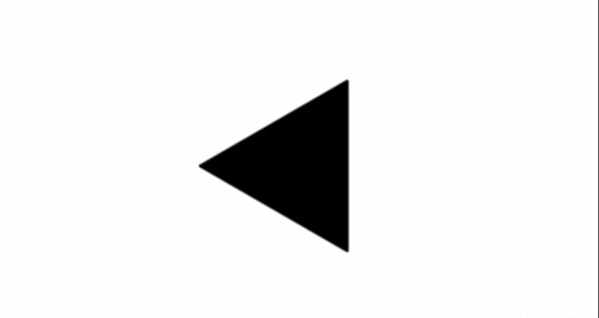
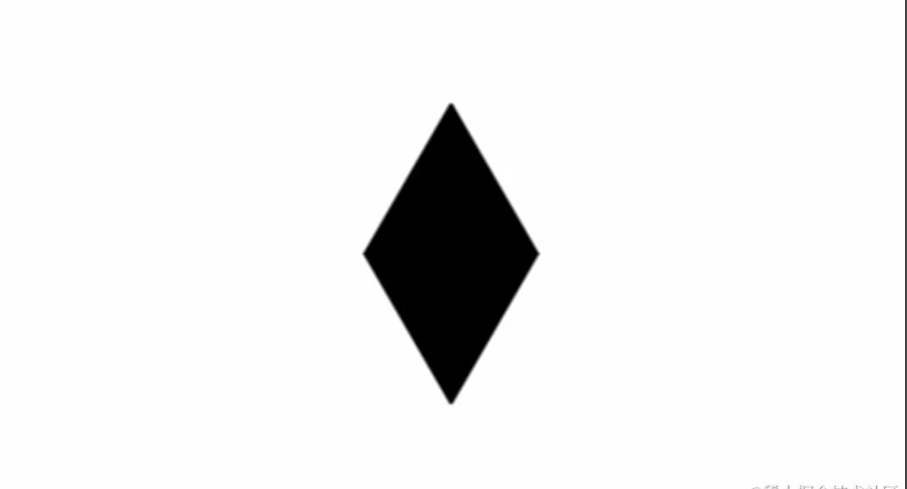
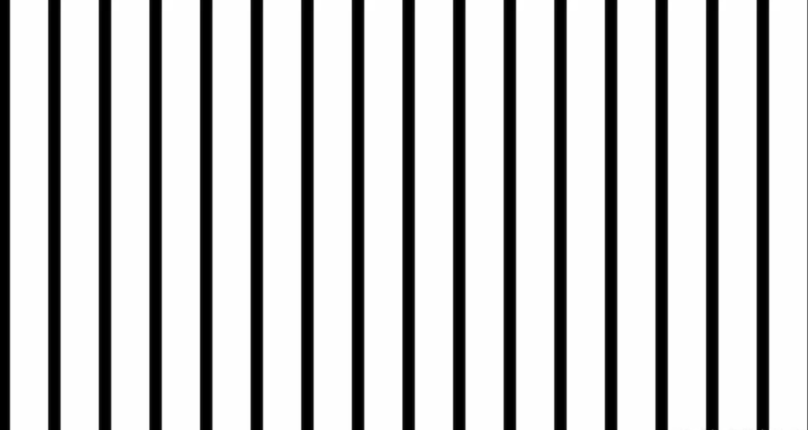

# UV 坐标

让我们从最基本的 Shader 主体开始吧：

```glsl
void mainImage(out vec4 fragColor,in vec2 fragCoord){

}
```

通过之前的学习我们知道：fragColor 代表输出颜色、fragCoord 代表输入坐标，并且我们还有一个内置的变量 iResolution 代表着画布大小。

在 Shader 中，一个变量的值基本都是分布在[0.,1.]之间的，而现在的输入坐标的值远远地超过了它，那怎么办呢？我们需要将它给“归一化”。

用输入坐标 fragCoord 除以画布大小 iResolution.xy，我们就能得到一个归一化的坐标，把它命名为 uv。

```glsl
void mainImage(out vec4 fragColor,in vec2 fragCoord){
    vec2 uv=fragCoord/iResolution.xy;
}
```

我们先看下 x 坐标的分布情况：

```glsl
void mainImage(out vec4 fragColor,in vec2 fragCoord){
    vec2 uv=fragCoord/iResolution.xy;
    fragColor=vec4(uv.x,0.,0.,1.);
}
```


现在我们默认颜色的第 3 个值是 0，只看前 2 个值。可以看到 x 坐标从左边开始是黑色，值是 (0,0)，到最右边是纯红色，值是 (1,0)，而中间则是分布在 (0,1) 之间的值。从整体上看，我们得到了一个横向的渐变图案。

同样地，我们来看下 y 坐标的分布情况：

```glsl
void mainImage(out vec4 fragColor,in vec2 fragCoord){
    vec2 uv=fragCoord/iResolution.xy;
    fragColor=vec4(0.,uv.y,0.,1.);
}
```


可以看到 y 坐标从底下开始是黑色，值是 (0,0)，到最上面是纯绿色，值是 (0,1)，而中间则是分布在 (0,1) 之间的值。从整体上看，我们得到了一个纵向的渐变图案。

接下来，我们同时输出 x 坐标和 y 坐标的分布：

```glsl
void mainImage(out vec4 fragColor,in vec2 fragCoord){
    vec2 uv=fragCoord/iResolution.xy;
    fragColor=vec4(uv,0.,1.);
}
```


左下角原点是黑色，值是 (0,0)，右下角是红色，值是 (1,0)，左上角是绿色，值是 (0,1)，右上角是黄色，值是 (1,1)，中间的所有值在 (0,0) 到 (1,1) 这 2 个区间分布。从整体上看，我们得到了一个有多种颜色的渐变图案。

这就是所谓的 UV 坐标，它代表了图像（这里指画布）上所有像素的归一化后的坐标位置，其中 U 代表水平方向，V 代表垂直方向。

## 圆形的绘制

我们第一个要画的，可以说是图形界最常见的，也是最基本的图形——圆形。

说一下总体的思路吧：先计算 UV 坐标上的点到原点的距离，然后根据这些距离的值来设定对应点的颜色。

为了计算 UV 上点到原点的距离，我们可以用 GLSL 的内置函数——length 函数来实现。

```glsl
void mainImage(out vec4 fragColor,in vec2 fragCoord){
    vec2 uv=fragCoord/iResolution.xy;
    float d=length(uv);
    fragColor=vec4(vec3(d),1.);
}
```


简单解释一下吧：左下角原点是黑色，值是 (0,0)，从原点向右上方向辐射的径向渐变，上面每个点的值代表的就是该点到原点的距离，越靠近原点距离越小，越接近黑色，反之越远离原点距离越大，越接近白色。

目前图形的位置在左下角，我们来把它挪到中间吧，将 UV 的坐标减去 0.5，再整体乘上 2。（注意这一行代码要放在 length 函数代码的上面。）

```glsl
void mainImage(out vec4 fragColor,in vec2 fragCoord){
    vec2 uv=fragCoord/iResolution.xy;
    uv=(uv-.5)*2.;
    float d=length(uv);
    fragColor=vec4(vec3(d),1.);
}
```

这一步被称为“UV 的居中处理”。你可能会有点不太理解为什么要这么做，没关系，我们先把 UV 坐标的结果直接输出到画布上。

之前的坐标系原点是第一幅图左下角的 (0,0)，我们通过整体减去 0.5，将原点变成了 (-0.5,-0.5)，也就是第二幅图左下角的那个点的位置，第一幅图的中点 (0.5,0.5) 就变成了第二幅图的中点 (0,0)，然后，我们将坐标整体乘上 2，将 0.5 变成了 1，这样归一化后能方便后续的计算。

> 注意：以后凡是有不理解的步骤，都可以像这样直接把结果输出到画布上，这是一种最简单有效的调试方式。


可以看到图形确实被挪到了中间。

然而，图形目前的形状是一个椭圆，这是为什么呢？因为 UV 坐标的值并不会自动地适应画布的比例，导致了图形被拉伸这一现象。

为了修正这一点，我们需要计算画布的比例，将画布长除以画布宽就能算出，再将 UV 的 x 坐标与比例相乘即可。（注意这一行代码要放在 length 函数代码的上面。）

```glsl
void mainImage(out vec4 fragColor,in vec2 fragCoord){
    vec2 uv=fragCoord/iResolution.xy;
    uv=(uv-.5)*2.;
    uv.x*=iResolution.x/iResolution.y;
    float d=length(uv);
    fragColor=vec4(vec3(d),1.);
}
```


到目前为止，我们得到了一个完整的圆形径向渐变，但我们要的并不是渐变，而是实实在在的圆形。

我们观察下值的分布情况吧：中点的值是 (0,0)，颜色是纯黑色，然而，从中点开始向四周辐射的那些区域，它们的值都大于 0，都不是纯黑色，而我们的目标，是要把其中的一片区域也变成纯黑色，也就是说要把分布在这片区域上面的点的值也变成 0。

这里讲一个小知识：在 Shader 中，值的显示范围只会是[0,1]之间，也就是说，小于 0 的负数实际显示的值还是 0（黑色），大于 1 的数实际显示的值还是 1（白色）。我们可以利用这一点，给距离 d 减去一个值（这里我取了 0.5），制造出一片负数的区域，而这片区域不就是我们所要的黑色吗？（注意这一行代码要写在 length 函数的下面。）

```glsl
void mainImage(out vec4 fragColor,in vec2 fragCoord){
    vec2 uv=fragCoord/iResolution.xy;
    uv=(uv-.5)*2.;
    uv.x*=iResolution.x/iResolution.y;
    float d=length(uv);
    d-=.5;
    fragColor=vec4(vec3(d),1.);
}
```


中间确实出现了纯黑色的圆形区域，然后我们只需把周围的渐变给消除，就能得到真正的圆形。

我们先定义一个中间变量 c，用 if 语句来判断距离 d 的大小，如果大于 0，代表的是除了中间纯黑区域外的渐变区域，将它们的值设为 1（白色）；反之，就代表的是中间的纯黑区域，将它们的值设为 0（黑色），最后将中间变量直接作为结果输出即可。

```glsl
void mainImage(out vec4 fragColor,in vec2 fragCoord){
  vec2 uv=fragCoord/iResolution.xy;
  uv=(uv-.5)*2.;
  uv.x*=iResolution.x/iResolution.y;
  float d=length(uv);
  d-=.5;
  float c=0.;
  if(d>0.){
    c=1.;
  }else{
    c=0.;
  }
  // fragColor=vec4(vec3(d),1.);
  fragColor=vec4(vec3(c),1.);
}
```

然而，在 Shader 的编写中，我们应当尽量避免使用 if 语句，为什么呢？因为 GPU 是并行处理结果的，而 if 语句会让处理器进行分支切换这一操作，处理多个分支会降低并行处理的性能。那么如何优化掉 if 语句呢？我们可以用 GLSL 其中的一个内置函数来代替它。

这个内置函数是 step 函数，也被称作“阶梯函数”，是因为它的图像是阶梯的形状，如下图所示：


它的代码表示形式是这样的：

```glsl
step(edge,x)
```

它接受 2 个参数：边界值 edge 和目标值 x，如果目标值 x 大于边界值 edge，则返回 1，反之返回 0。

把刚刚的 if 语句给注释掉，用 step 函数来实现同样的逻辑。

```glsl
void mainImage(out vec4 fragColor,in vec2 fragCoord){
  vec2 uv=fragCoord/iResolution.xy;
  uv=(uv-.5)*2.;
  uv.x*=iResolution.x/iResolution.y;
  float d=length(uv);
  d-=.5;
  float c=step(0.,d);
  fragColor=vec4(vec3(c),1.);
}
```

这样做不仅简化了代码，还优化了 Shader 的性能，可以说是一举两得！

我们得到了一个实体的圆形。

尽管圆形是画出来了，但仔细一看，就会发现图形的周围有锯齿，比较影响美观，要消除它们。

我们再来认识一个 GLSL 的内置函数——smoothstep 函数，它也被称作“平滑阶梯函数”，是因为它的函数图像是一个平滑过的阶梯的形状，如下图所示：


它的代码表示形式是这样的：

```glsl
smoothstep(edge1,edge2,x)
```

它的边界值比 step 函数要多一个，我们可以将它的边界值定为 edge1 和 edge2：如果目标值 x 小于边界值 edge1，则返回 0；如果目标值 x 大于边界值 edge2，则返回 1；如果目标值 x 在 2 个边界值之间，则返回从 0 到 1 平滑过渡的值。

我们把之前代码里的 step 函数的语句注释掉，改成用 smoothstep 函数来实现，再将第 2 个边界值设定为一个比 0 稍微大一点的值。这里我取了 0.02：

```glsl
void mainImage(out vec4 fragColor,in vec2 fragCoord){
  vec2 uv=fragCoord/iResolution.xy;
  uv=(uv-.5)*2.;
  uv.x*=iResolution.x/iResolution.y;
  float d=length(uv);
  d-=.5;
  float c=smoothstep(0.,.02,d);
  fragColor=vec4(vec3(c),1.);
}
```

这样，我们就得到了一个边缘是平滑的，没有锯齿的圆形。

## 图形效果

尽管 Shader 的绘图步骤确实要比传统的绘图方式要繁琐一点，但是也带来了很多意想不到的可能性，比方说，它能实现一些特殊的图形效果。

接下来，让我们从刚刚画好的那个圆形开始。

### 模糊效果

我们用到了 smoothstep 函数来绘制圆形，它的第二个参数我们用的是一个很小的值 0.02，现在，让我们尝试把这个值改大一点，比如 0.2：

```glsl
void mainImage(out vec4 fragColor,in vec2 fragCoord){
  vec2 uv=fragCoord/iResolution.xy;
  uv=(uv-.5)*2.;
  uv.x*=iResolution.x/iResolution.y;
  float d=length(uv);
  d-=.5;
  float c=smoothstep(0.,.2,d);
  fragColor=vec4(vec3(c),1.);
}
```


随着渐变区域的扩大，圆形的边缘变得模糊了起来，这是因为两个边界值的差变大了，渐变的区域也就随着变大了，这样就营造出了一种模糊的效果。

### 发光效果

这里我们不用 smoothstep 函数来绘制图形，我们取距离 d 的倒数，并且乘上一个比较小的值。

```glsl
void mainImage(out vec4 fragColor,in vec2 fragCoord){
  vec2 uv=fragCoord/iResolution.xy;
  uv=(uv-.5)*2.;
  uv.x*=iResolution.x/iResolution.y;
  float d=length(uv);
  float c=.25/d;
  fragColor=vec4(vec3(c),1.);
}
```


画面上出现了一个美丽的光球，它是怎么形成的呢？看下图：


这是个反比例函数的图像，目前我们的输入值范围是 (0.,1.)，在这段范围内，输入值位于 (0.,.25) 时，输出值都大于 1，Shader 中比 1 大的值输出的还是白色，因此我们能看到中间的白色圆形部分；输入值位于 (.25,1.) 时，输出的值开始变成了比 1 小的值，而且是逐渐变化的，因此会产生一种渐变的效果。

目前光的辐射范围太大了，要稍微缩小一些。

我们来认识一个新的内置函数——pow 函数，它用于计算数字的指数幂，比如 pow(4.,3.)，返回的值就是 4 的 3 次方——64，也就是说，pow 这个函数能让数值指数般地增长。（当然，小数也是可以的，比如 pow(4.,3.6)。）

对 c 应用 pow 函数，指数取 1.6：

```glsl
void mainImage(out vec4 fragColor,in vec2 fragCoord){
  vec2 uv=fragCoord/iResolution.xy;
  uv=(uv-.5)*2.;
  uv.x*=iResolution.x/iResolution.y;
  float d=length(uv);
  float c=.25/d;
  c=pow(c,1.6);
  fragColor=vec4(vec3(c),1.);
}
```


为了理解这一步，依旧来看图：


函数图像比之前要往下“躺”了一些，输出值总体变小了，这样光的辐射也稍微缩小了一点。

这样的发光效果换成别的绘图方式可能会很难实现吧，而 Shader 只要借助数学计算，就能轻松实现，是不是大开眼界了呢？

知道 Shader 的厉害之处后，让我们依旧回到那个最基本的圆形，开始绘制其他图形吧。

## SDF 函数

圆形是众多几何图形中的其中一种，既然我们已经通过上面的方式将它画了出来，那我们肯定也能用类似的手段来把其他图形给画出来。

回顾一下吧，绘制圆形时，我们在调用 smoothstep 函数之前做了如下的操作：

```glsl
float d=length(uv);
d-=.5;
```

其实，我们可以把这些操作抽象成一个函数，叫 sdCircle：

```glsl
float sdCircle(vec2 p,float r)
{
    return length(p)-r;
}

void mainImage(out vec4 fragColor,in vec2 fragCoord){
    vec2 uv=fragCoord/iResolution.xy;
    ...
    float d=sdCircle(uv,.5);
    ...
}
```

尽管这个函数的调用结果跟我们之前写的一模一样，但它有一个特殊的含义——它是一个 SDF 函数！

SDF 函数，中文译作“符号距离函数”，它用于描述这么一个函数：它将空间里的一个位置作为输入，并返回该位置到给定形状的距离，它的前面还有个“符号”，是因为在形状外的距离为正数（“+”号），在形状内的距离为负数（“-”号），边界处的值恰好为 0。

下图是圆形 SDF 函数的可视化图，可以更形象地理解它的意义：


> 图形学大咖 Inigo Quilez（后文简称 iq）的博客上有篇文章把常用的 2D 图形的 SDF 函数都列了出来，如果有需要可以随时查阅：https://iquilezles.org/articles/distfunctions2d/

知道 SDF 函数的概念后，绘制其他图形将会变得非常轻松，比如我想要画一个长方形，那么我只需找到长方形的 SDF 函数（sdBox），调用它获取距离，再用 step 或 smoothstep 函数勾画出图形即可。

```glsl
float sdBox(in vec2 p,in vec2 b)
{
    vec2 d=abs(p)-b;
    return length(max(d,0.))+min(max(d.x,d.y),0.);
}

void mainImage(out vec4 fragColor,in vec2 fragCoord){
    vec2 uv=fragCoord/iResolution.xy;
    uv=(uv-.5)*2.;
    uv.x*=iResolution.x/iResolution.y;

    float d=sdBox(uv,vec2(.6,.3));
    float c=smoothstep(0.,.02,d);
    fragColor=vec4(vec3(c),1.);
}
```

上面的代码画出了一个半尺寸长为 0.6、宽为 0.3（实际长为 1.2、宽为 0.6）的长方形。


## UV 变换

基于已经画好的这个长方形，我们来学习一些基本的 UV 变换操作。

> 注意：UV 变换的相关代码要写在 SDF 函数调用之前，也就是 float d=sdBox(uv,vec2(.6,.3));这行代码之前。

### 平移

先尝试给 UV 的 x 或 y 坐标加上想移动的值。

```glsl
uv.x+=.2;
uv.y+=.4;
```


有人可能会疑惑：明明是给坐标加上了值，为什么图形的坐标并未朝右上移动，而是朝相反的左下方向移动了呢？

让我们输出下目前 UV 坐标系的分布情况吧。

```glsl
fragColor=vec4(uv,0.,1.);
```


之前位于中间的原点值是 (0,0)，现在则变成了 (0.2,0.4)，那么上一个 (0,0) 哪去了呢？可以看到它移动到了当前中间点的左下方，而 SDF 函数输入的坐标值的原点值是 (0,0)，正好对应左下方的那个点，因此图形才会整体往左下方移动。

简言之：确定 SDF 图形位置的变化，要看目前 (0,0) 这个点的位置变化。

理解后，我们把输出的 UV 坐标给注释掉。

```glsl
// fragColor=vec4(uv,0.,1.);
```

如果要平移符合正方向的移动（右上方），把之前的加法操作改成与其相反的减法操作即可。

```glsl
uv.x-=.2;
uv.y-=.4;
```

当然这两行代码也可以简写成一行代码。

```glsl
uv-=vec2(.2,.4);
```


### 缩放

先尝试给 UV 的 x 或 y 坐标乘上想缩放的值。

```glsl
uv*=vec2(2.,2.);
```


果不其然，图形并非扩大，而是缩小了相应的倍数。


为什么呢？依旧来看图：之前的图形用黑色的虚线标了出来，它的左上方顶点由于乘上了 2，值就从 (0.6,0.3) 变成了 (1.2,0.6)，那么之前的顶点呢？它自然会遵循倍数的变化规律，移动到右下方，也就是那个小长方形的左上方的顶点。

同样地，如果要符合正方向的缩放（扩大），把之前的乘法操作改成与其相反的除法操作即可。

```glsl
uv/=vec2(2.,2.);
```


### 翻转

由于长方形是 xy 轴都对称的图形，我们要换一个不对称图形的 SDF 函数，这里选择了等边三角形函数 sdEquilateralTriangle。

```glsl
float sdEquilateralTriangle(in vec2 p,in float r)
{
    const float k=sqrt(3.);
    p.x=abs(p.x)-r;
    p.y=p.y+r/k;
    if(p.x+k*p.y>0.)p=vec2(p.x-k*p.y,-k*p.x-p.y)/2.;
    p.x-=clamp(p.x,-2.*r,0.);
    return-length(p)*sign(p.y);
}
```

将之前的 SDF 函数替换成新的函数。

```glsl
// float d=sdBox(uv,vec2(.6,.3));
float d=sdEquilateralTriangle(uv,.5);
```


目前的三角形沿 x 轴方向是对称的，如果想按 x 轴翻转，给 UV 的 y 坐标乘上 -1 即可。

```glsl
uv.y*=-1.;
```


这个比较符合我们的直觉，也用图来说明下吧：


之前的虚线三角形的上顶点是 (0.,0.5)，乘上 -1 后就变成了 (0.,-0.5)，也就变成了实际三角形的下顶点。

### 旋转

这个操作相对而言比之前的要复杂一些，涉及到了矩阵变换，但不用担心！因为 Github 上已经有人封装好了现成的函数库 glsl-rotate 可供我们直接使用，以下是该库中 2D 旋转相关的代码：

```glsl
mat2 rotation2d(float angle){
    float s=sin(angle);
    float c=cos(angle);

    return mat2(
        c,-s,
        s,c
    );
}

vec2 rotate(vec2 v,float angle){
    return rotation2d(angle)*v;
}
```

另外我们在进行旋转操作时经常会用到 PI 这个常量，代表 180 度。

```glsl
const float PI=3.14159265359;
```

尝试让三角形顺时针旋转个 90 度（也就是 PI 的一半）吧。

```glsl
uv=rotate(uv,PI/2.);
```



还记得之前提到过的 iTime 时间变量吗，我们可以用它来实现一个旋转的动画。

```glsl
uv=rotate(uv,iTime);
```


### 重复

我们来认识一个新的内置函数——fract，它的作用是获取一个数的小数部分。

比如 fract(114.514)，返回的值就是 0.514。

那么它有什么作用呢？先把 mainImage 函数的代码改成下面的样子吧（这里临时把居中 UV 的代码去掉了）：

```glsl
void mainImage(out vec4 fragColor,in vec2 fragCoord){
    vec2 uv=fragCoord/iResolution.xy;

    uv=fract(uv*vec2(2.,2.));

    // uv=(uv-.5)*2.;
    // uv.x*=iResolution.x/iResolution.y;

    float d=sdEquilateralTriangle(uv,.5);
    float c=smoothstep(0.,.02,d);
    fragColor=vec4(vec3(c),1.);
    fragColor=vec4(uv,0.,1.);
}
```


可以看到 UV 坐标分裂成了 4 个小的 UV 坐标。

依旧来观察值的变化：


先将坐标的值整体乘以 2，标记出了几个关键点的值，然后再应用 fract 函数取小数部分，有几个不小于 1 的关键点的值被蓝色的线划掉了，取而代之的是它的小数部分值，这样 UV 便达成了重复的效果。

让我们把 mainImage 函数的代码恢复成输出三角形吧。

```glsl
void mainImage(out vec4 fragColor,in vec2 fragCoord){
    vec2 uv=fragCoord/iResolution.xy;

    uv=fract(uv*vec2(2.,2.));

    uv=(uv-.5)*2.;
    uv.x*=iResolution.x/iResolution.y;

    float d=sdEquilateralTriangle(uv,.5);
    float c=smoothstep(0.,.02,d);
    fragColor=vec4(vec3(c),1.);
}
```


我们得到了 4 个重复的小三角。

### 镜像

我们再来认识一个函数——abs，它的作用是获取一个数的绝对值。

比如 abs(2.)，返回的值是 2.，abs(-2.)，返回的值也是 2.。

来观察它的函数图像吧：


可以看到它将原来函数 y=x 的图像的左下部分给翻转了上去，并且翻转的部分跟原来的部分关于 x 轴对称，由此可以看出 abs 这个函数具有“对称性”。

我们尝试给图形的 y 分量应用 abs 函数。

```glsl
uv.y=abs(uv.y);
```

尝试输出下 UV 坐标。

```glsl
// fragColor=vec4(vec3(c),1.);
fragColor=vec4(uv,0.,1.);
```

把它和之前的 UV 坐标比对下：


原本的 UV 坐标的左下部分值是负数，由于绝对值的作用都变成了正数，并且大小跟它关于 x 轴对称的值相同。

理解后，我们将原来的图形变回来吧。

```glsl
fragColor=vec4(vec3(c),1.);
// fragColor=vec4(uv,0.,1.);
```



可以看到图形沿着 x 轴镜像出了下面的另一部分。

## SDF 图形变换

除了 UV 以外，SDF 本身的形状也是可以改变的，这些形变函数在 iq 的博客上也有提供，直接 CV 过来吧。

```glsl
float opRound(in float d,in float r)
{
    return d-r;
}

float opOnion(in float d,in float r)
{
    return abs(d)-r;
}
```

opRound 是“圆角”操作，能让图形的角变成圆角。

```glsl
d=opRound(d,.1);
```


opOnion 是“镂空”操作，能挖空图形中间的部分。

```glsl
d=opOnion(d,.1);
```


## SDF 布尔运算

SDF 函数本身能绘制出很多形状，但数量也是有限的，比如说你想画个星形，可以用这个形状所对应的函数 sdStar 来实现，但是，如果要画一个笑脸的形状呢？你找了下现有的 [SDF 函数](https://iquilezles.org/articles/distfunctions2d/)，发现并没有笑脸的 SDF 函数。emmmm，难道 SDF 画不出笑脸吗？答案是——不存在的！SDF 几乎啥都可以画，只要把几个圆形和一条弯曲的曲线组合在一起，不就能画成笑脸了吗？那 SDF 组合的方式是什么？它就是——布尔运算。

SDF 的布尔运算主要有 3 种：并（Union）、交（Intersection）、差（Subtraction）。

这些操作的公式 iq 也在[博客文章](https://iquilezles.org/articles/distfunctions/)上列举了出来，直接 CV 过来吧~

```glsl
float opUnion(float d1,float d2)
{
    return min(d1,d2);
}

float opIntersection(float d1,float d2)
{
    return max(d1,d2);
}

float opSubtraction(float d1,float d2)
{
    return max(-d1,d2);
}
```

创建 2 个 SDF 图形（这里用的就是之前的圆形和长方形）：

```glsl
void mainImage(out vec4 fragColor,in vec2 fragCoord){
    vec2 uv=fragCoord/iResolution.xy;
    uv=(uv-.5)*2.;
    uv.x*=iResolution.x/iResolution.y;

    float d1=sdCircle(uv,.5);
    float d2=sdBox(uv,vec2(.6,.3));

    float d=d1;

    float c=smoothstep(0.,.02,d);
    fragColor=vec4(vec3(c),1.);
}
```

“并”操作：它能取 2 个图形的所有部分，对应函数是 opUnion。


“交”操作：它能取 2 个图形的相交部分，对应函数是 opIntersection。

```glsl
d=opIntersection(d1,d2);
```


“差”操作：它能取一个图形扣去另一个图形的部分，对应函数是 opSubtraction。注意这个函数的参数是讲究顺序的，是参数 2 的图形部分减去参数 1 的图形部分。

先试试长方形减去圆形：

```glsl
d=opSubtraction(d1,d2);
```


再试试圆形减去长方形：

```glsl
d=opSubtraction(d2,d1);
```


### 平滑版

此外，布尔运算还有另外一种版本：平滑版（smooth），它能够产生一种更加有机（organic）的结果，说的通俗点就是一种“黏稠”的感觉，这些运算函数在 iq 博客上也有提供，直接 CV 过来吧。

```glsl
float opSmoothUnion(float d1,float d2,float k){
    float h=clamp(.5+.5*(d2-d1)/k,0.,1.);
    return mix(d2,d1,h)-k*h*(1.-h);
}

float opSmoothSubtraction(float d1,float d2,float k){
    float h=clamp(.5-.5*(d2+d1)/k,0.,1.);
    return mix(d2,-d1,h)+k*h*(1.-h);
}

float opSmoothIntersection(float d1,float d2,float k){
    float h=clamp(.5-.5*(d2-d1)/k,0.,1.);
    return mix(d2,d1,h)+k*h*(1.-h);
}
```

比起一般的布尔运算，平滑版布尔运算还多了第三个参数——平滑度 k，能够控制平滑的程度。

我们依旧用之前的那 2 个图形进行运算，第三个参数可以随意调节来观察变化。

平滑并，对应的函数是 opSmoothUnion。

```glsl
d=opSmoothUnion(d1,d2,.1);
```


平滑交，对应的函数是 opSmoothIntersection。

```glsl
d=opSmoothIntersection(d1,d2,.1);
```


平滑差，对应的函数是 opSmoothSubtraction，和普通版函数一样也讲究顺序，是参数 2 的图形部分减去参数 1 的图形部分。

先试试长方形减去圆形：

```glsl
d=opSmoothSubtraction(d1,d2,.1);
```


再试试圆形减去长方形：

```glsl
d=opSmoothSubtraction(d2,d1,.1);
```


## mix 函数

到目前为止，我们画的图形的颜色“非黑即白”，太单调了，有没有一种方式能给图形染上别的颜色呢？

我们来认识一个新的 GLSL 内置函数——mix，也被称作混合函数。

它的实现公式是这样的：

```glsl
#define mix(x,y,t) x*(1.-t)+y*t
```

它接受 3 个参数：前 2 个参数 x 和 y 分别对应 2 个值，最后一个参数 t 代表混合程度，如果 t 为 0，则值就等于 x；如果 t 为 1，则值就等于 y，如果 t 为 0 到 1 内的值，则值就等于 x 与 y 之间逐渐变化的值。

那它主要有哪些作用呢？

### 创建渐变色

mix 是混合函数，而渐变色又是两种以上颜色混合而成的颜色，用 mix 函数来创造渐变色可以说是再合适不过了。

```glsl
void mainImage(out vec4 fragColor,in vec2 fragCoord){
    vec2 uv=fragCoord/iResolution.xy;

    vec3 col1=vec3(1.,0.,0.);
    vec3 col2=vec3(0.,1.,0.);
    vec3 col=mix(col1,col2,uv.x);
    fragColor=vec4(col,1.);
}
```

指定 2 个颜色 col1 和 col2，用 mix 函数将它们混合起来，混合程度就用 UV 坐标的 x 轴。


我们得到了一个沿着 x 轴变换的渐变色。

### 给图形染色

mix 函数可以给图形染上特定的颜色。

根据之前 SDF 函数的意义：在形状外的距离为正数（“+”号），在形状内的距离为负数（“-”号），我们可以定义 2 个颜色 colInner 和 colOuter，分别代表形状内部和外部的颜色，再用 mix 函数将它们混合起来，混合程度就用 SDF 函数经平滑后的结果。

```glsl
uv=(uv-.5)*2.;
uv.x*=iResolution.x/iResolution.y;

float d=sdBox(uv,vec2(.6,.3));
float c=smoothstep(0.,.02,d);
vec3 colInner=vec3(1.,0.,0.);
vec3 colOuter=vec3(1.);
vec3 col=mix(colInner,colOuter,c);
fragColor=vec4(col,1.);
```


我们得到了一个染上红色的长方形。

### 形状转变效果

mix 函数不仅可以混合颜色，也可以混合别的东西，比如形状，而且只要是维度相同的 2 个值都可以拿来混合。

尝试创建 2 个 SDF 图形（沿用之前的圆形和长方形），将它们的形状用 mix 函数混合起来，混合程度就用随着时间变化的 iTime 变量，外面包了 2 层函数：sin 函数负责周期性的变化，abs 函数负责确保混合程度的值是正的。

```glsl
uv=(uv-.5)*2.;
uv.x*=iResolution.x/iResolution.y;

float d1=sdCircle(uv,.5);
float d2=sdBox(uv,vec2(.6,.3));
float d=mix(d1,d2,abs(sin(iTime)));
float c=smoothstep(0.,.02,d);
fragColor=vec4(vec3(c),1.);
```


我们得到了一个在圆形和长方形之间“反复横跳”的奇特图形。

## 重复图案

之前我们绘制的大都是单个图形，在 UV 变换那部分，我们学到了用 fract 函数来实现“重复”的操作，利用这一点，我们可以创建出其他的常见重复图案。

### 条纹

先用 step 函数绘制出一根线条（简单来说就是靠右的一块颜色）：

```glsl
vec3 c=vec3(step(.5,uv.x));
fragColor=vec4(c,1.);
```


用 fract 函数来重复 UV，注意这一行要写在绘制线条之前。

```glsl
uv=fract(uv*16.);
```


### 波浪

我们把刚刚的条纹改成 y 轴方向。

```glsl
uv=fract(uv*16.);
vec3 c=vec3(step(.5,uv.y));
```

给 UV 的 y 坐标加上应用 sin 函数的 x 坐标，这行要写在重复操作的前面。

```glsl
uv.y+=sin(uv.x);
```


有一点弯曲，但并不明显，我们要调节下 sin 函数，直到感觉合适为止。

```glsl
uv.y+=sin(uv.x*6.)*.4;
```


### 网格

网格可以看作是 2 个互相垂直的条纹叠加形成的形状。

用 fract 函数来重复 UV。

```glsl
uv=fract(uv*16.);
```

绘制出沿 x 轴分布的条纹。

```glsl
vec3 c=vec3(step(.25,uv.x));
fragColor=vec4(c,1.);
```



绘制出沿 y 轴分布的条纹。

```glsl
vec3 c=vec3(step(.25,uv.y));
fragColor=vec4(c,1.);
```


用布尔运算里的“并”操作，将这 2 种图形合并。

```glsl
vec3 c=vec3(opUnion(step(.25,uv.x),step(.25,uv.y)));
fragColor=vec4(c,1.);
```


由于画布长宽并不相等，我们可以修正下比例（写在 fract 函数前）：

```glsl
uv.x*=iResolution.x/iResolution.y;
```


### 波纹

用之前学到的知识画一个圆。

```glsl
uv=(uv-.5)*2.;
uv.x*=iResolution.x/iResolution.y;
float d=sdCircle(uv,.5);
float mask=smoothstep(0.,.02,d);
vec3 c=vec3(mask);
fragColor=vec4(c,1.);
```

除了 fract 函数，sin 函数的图像也具有重复的特性。

这里我们就不用 fract 函数了，用 sin 函数来重复 SDF 距离 d，注意这一行要放在 smoothstep 函数之前。


```glsl
d=sin(d*40.);
```


## 极坐标

目前我们 Shader 的默认坐标系是笛卡尔坐标系（也就是直角坐标系），除了这种坐标系外，还有另一种坐标系，叫做极坐标系，用这种坐标系能够画出一些基于圆的图案来。


如上图所示，极坐标系的坐标由 2 个维度组成：极角φ和半径 r。

先将 UV 进行居中处理。

```glsl
uv=(uv-.5)*2.;
uv.x*=iResolution.x/iResolution.y;
```

第一个维度极角φ，用 atan 函数计算直角坐标的反正切值即可算出。

```glsl
float phi=atan(uv.y,uv.x);
```

第二个维度半径 r，用 length 函数计算直角坐标到原点的距离即可算出。

```glsl
float r=length(uv);
```

将转换后的结果赋给 uv。

```glsl
uv=vec2(phi,r);
fragColor=vec4(uv,0.,1.);
```

可以把这个转换过程封装成一个函数 cart2polar。

```glsl
vec2 cart2polar(vec2 uv){
    float phi=atan(uv.y,uv.x);
    float r=length(uv);
    return vec2(phi,r);
}

void mainImage(out vec4 fragColor,in vec2 fragCoord){
    vec2 uv=fragCoord/iResolution.xy;
    uv=(uv-.5)*2.;
    uv.x*=iResolution.x/iResolution.y;
    uv=cart2polar(uv);
    fragColor=vec4(uv,0.,1.);
}
```


用极坐标配合其他函数（如 sin 函数），我们能画出各种形状。

### 放射形

直接用 sin 函数即可。

```glsl
float c=sin(uv.x*12.);
fragColor=vec4(vec3(c),1.);
```


### 螺旋形

也是用 sin 函数，只不过参数是 2 个大小不同的 x 坐标与 y 坐标的和。

```glsl
float c=sin(uv.y*20.+uv.x);
fragColor=vec4(vec3(c),1.);
```


