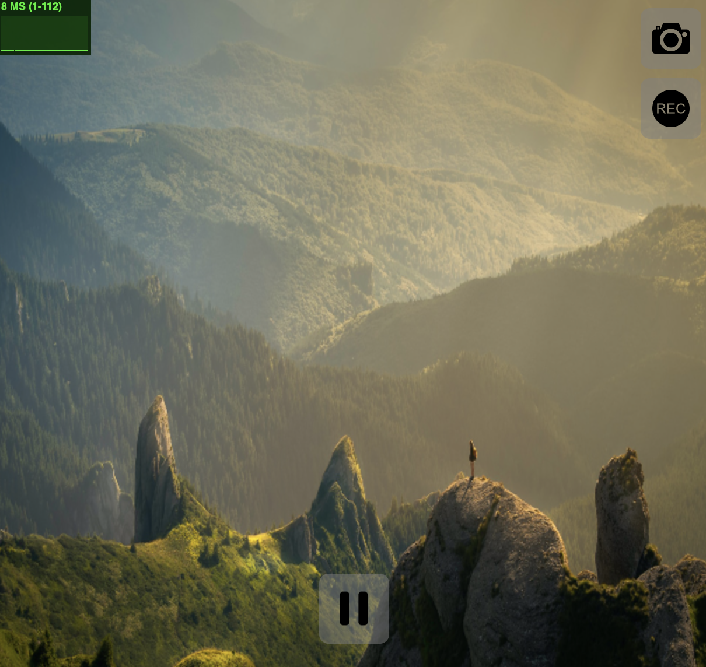
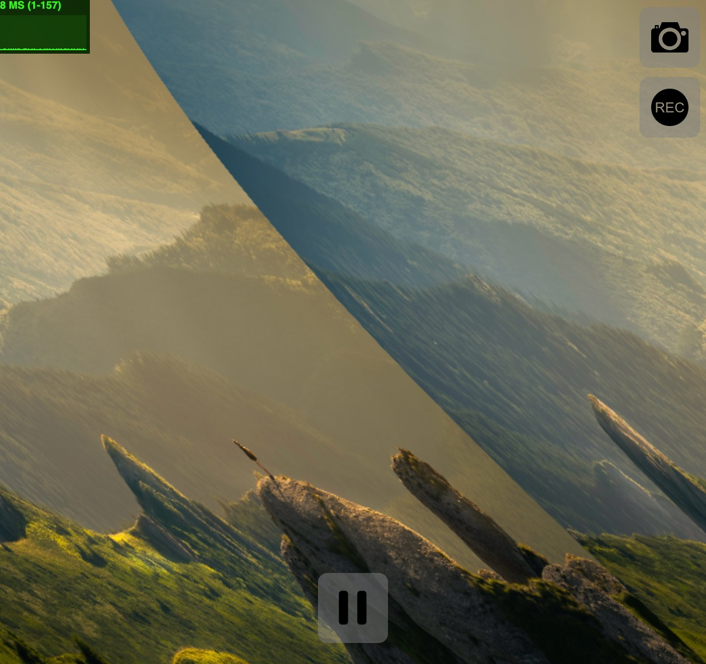
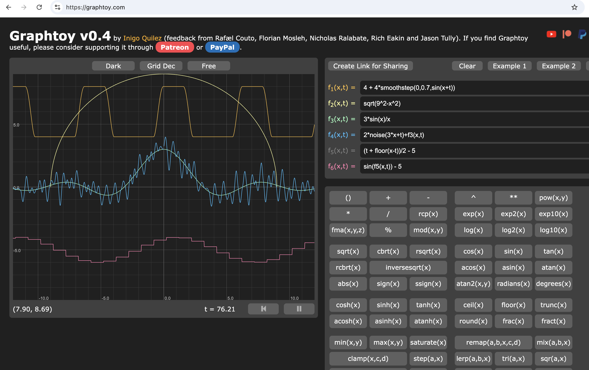
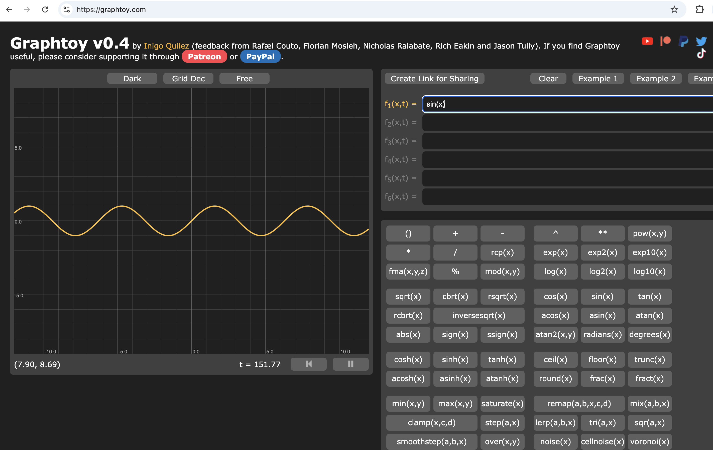
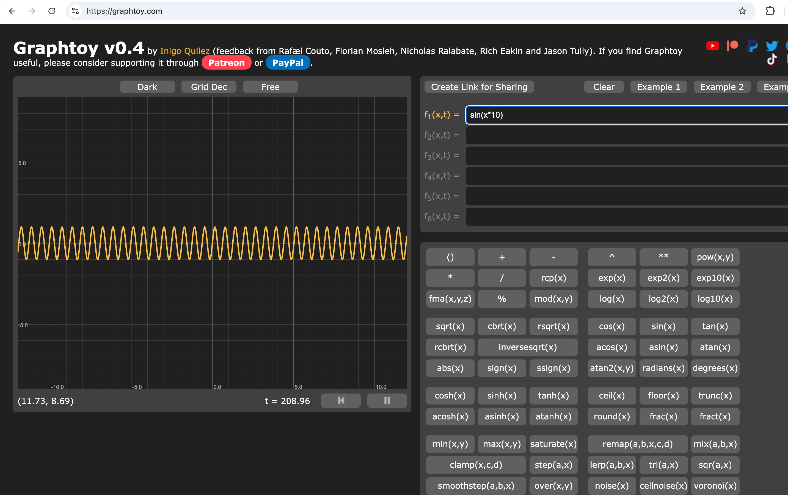
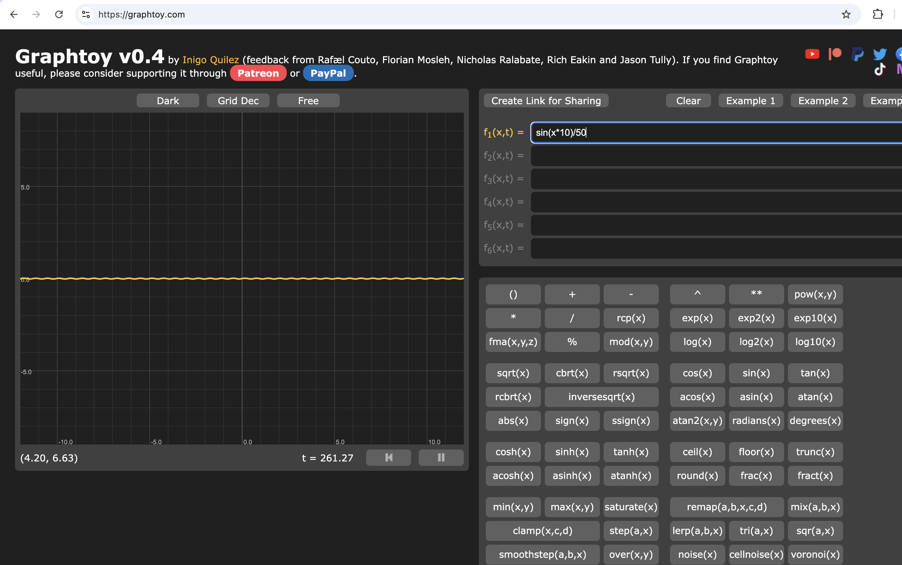
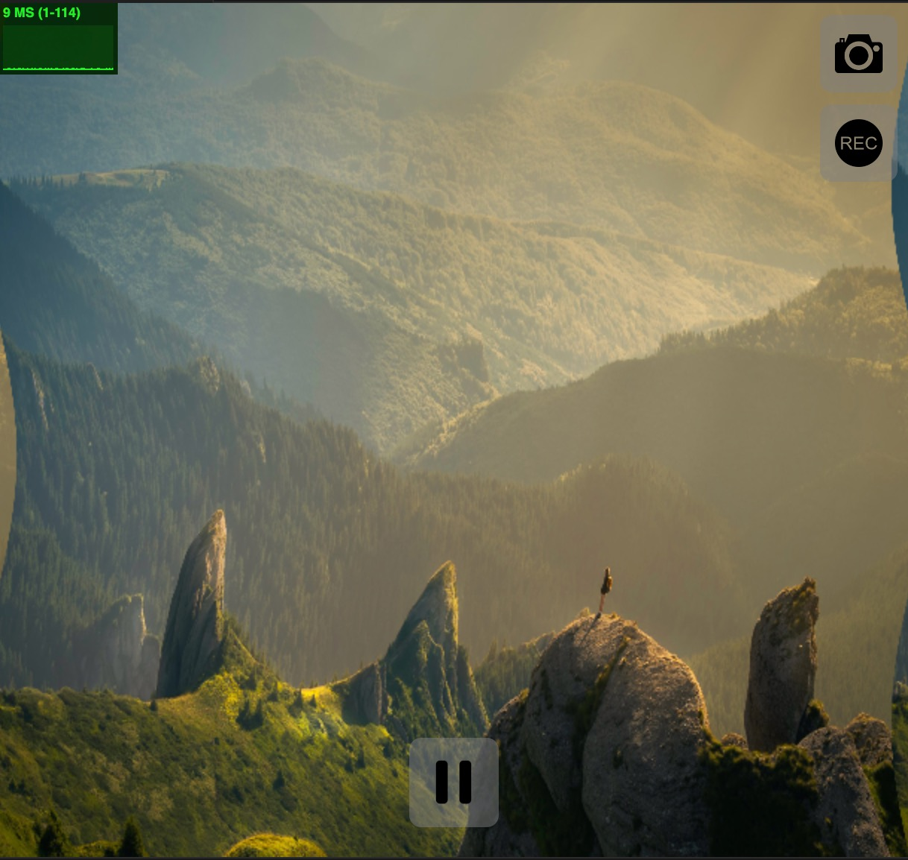
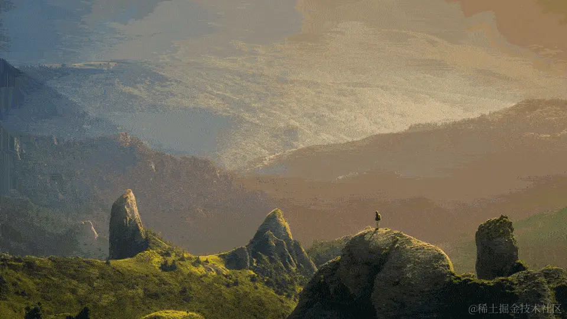
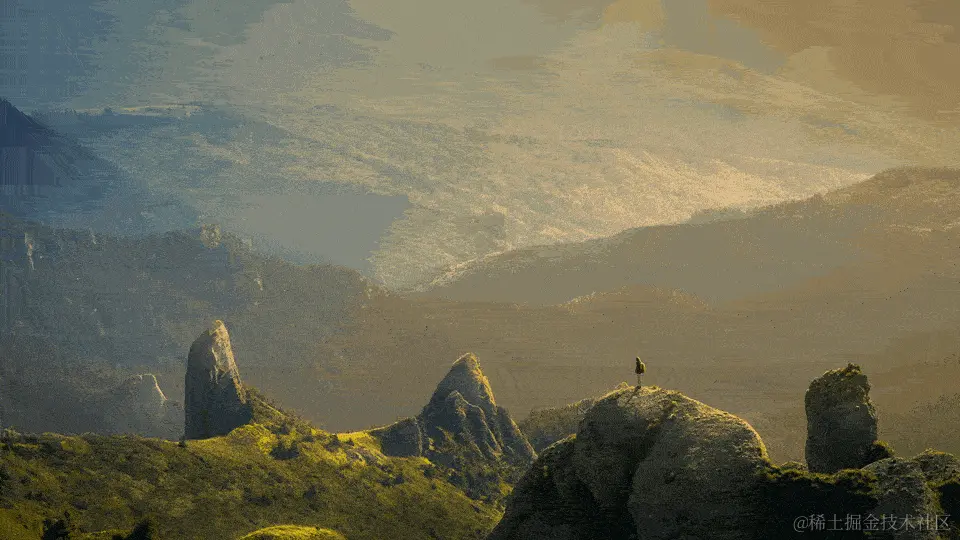
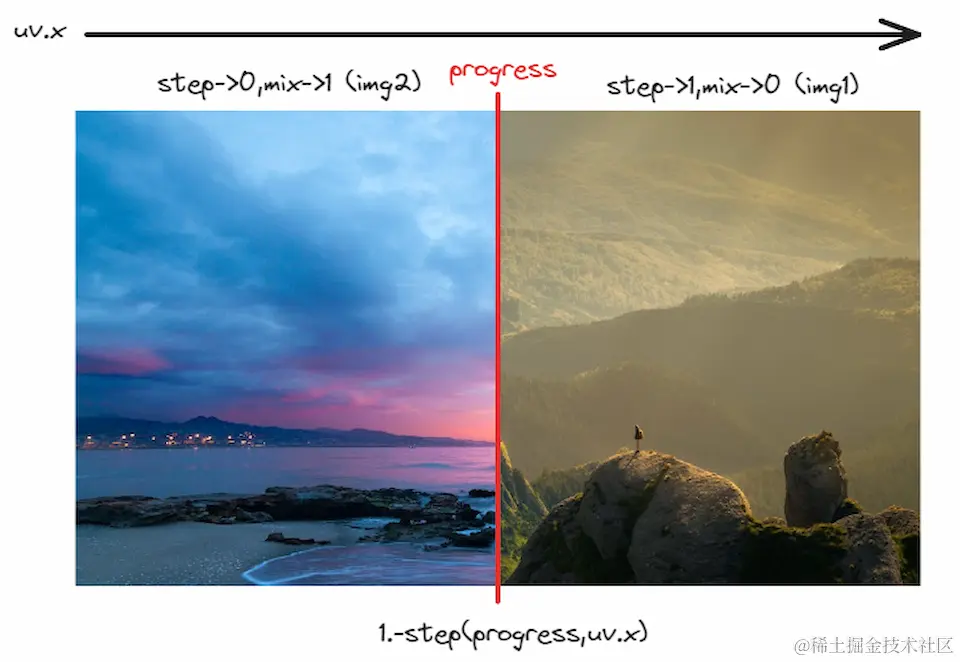

# 纹理

如果你是在 GLSL 文件内编写 Shader，并且用 vscode 插件 Shader Toy 来预览它的，那么你需要这么引入纹理：

```glsl
#iChannel0 "https://s2.loli.net/2023/09/10/QozT59R6KsYmb3q.jpg"

void mainImage(out vec4 fragColor,in vec2 fragCoord){
    vec2 uv=fragCoord/iResolution.xy;
    vec3 tex=texture(iChannel0,uv).xyz;
    fragColor=vec4(tex,1.);
}
```

## 采样

引入纹理后，为了将它显示在屏幕上，我们需要对它进行采样操作。

GLSL 内置了一个采样函数 texture，我们直接用它将纹理给采样出来。

```glsl
void mainImage(out vec4 fragColor,in vec2 fragCoord){
    vec2 uv=fragCoord/iResolution.xy;
    vec3 tex=texture(iChannel0,uv).xyz;
    fragColor=vec4(tex,1.);
}
```

采样函数 texture 接受 2 个参数：第一个是我们的纹理 iChannel0，第二个是 UV 坐标变量 uv，将采样的结果命名为 tex，并且取它的前 3 维度（我们暂不考虑纹理的透明度），最后用变量 vec4(tex,1.) 输出到屏幕上。

如果你能看到屏幕上显示的图片，那就说明你成功地采样了纹理。



将纹理搬到屏幕上后，我们就要开始对它做一些有意思的操作了~

## 扭曲

第一种操作是扭曲，通过改变纹理的 UV 坐标来扭曲整个图片的形状。

让我们来创建一个扭曲函数，就叫 distort 吧。

```glsl
vec2 distort(vec2 p){
    return p;
}

```

在主函数 mainImage 中调用它。

```glsl
void mainImage(out vec4 fragColor,in vec2 fragCoord){
    vec2 uv=fragCoord/iResolution.xy;
    uv=distort(uv);
    vec3 tex=texture(iChannel0,uv).xyz;
    fragColor=vec4(tex,1.);
}
```

图片没有任何变化，因为我们的扭曲函数仅仅是返回了原来的 UV。

给扭曲函数内的 UV 坐标（也就是变量 p）的 x 分量加上 sin 函数处理过的 y 分量。

```glsl
#iChannel0 "https://s2.loli.net/2023/09/10/QozT59R6KsYmb3q.jpg"

vec2 distort(vec2 p){
    p.x+=sin(p.y);
    return p;
}

void mainImage(out vec4 fragColor,in vec2 fragCoord){
    vec2 uv=fragCoord/iResolution.xy;
    uv=distort(uv);
    vec3 tex=texture(iChannel0,uv).xyz;
    fragColor=vec4(tex,1.);
}
```



哇哦，可以看到图片被极其夸张地扭曲成了上面的形状。扭曲程度太大了，我们需要对扭曲量进行调整。

### 调试函数

通过 [graphtoy 网站](https://graphtoy.com/) 对 Shader 的函数进行可视化的调试。

进入网站时，它默认展示了好几张函数的图像，点击右上方的 Clear 将它们清空。



在 f1(x,t) =后面的输入框中输入 sin(x)。



可以看到 sin 函数默认的变化幅度是挺大的，我们要将这种幅度缩小。

先给 x 乘上 10，相当于增加了 sin 函数的频率（frequency）。



再外面整体除以 50，相当于减小了 sin 函数的振幅（amplitude）。



把这些操作转换成 Shader 代码吧。

```glsl
#iChannel0 "https://s2.loli.net/2023/09/10/QozT59R6KsYmb3q.jpg"

vec2 distort(vec2 p){
    p.x+=sin(p.y*10.)/50.;
    return p;
}

void mainImage(out vec4 fragColor,in vec2 fragCoord){
    vec2 uv=fragCoord/iResolution.xy;
    uv=distort(uv);
    vec3 tex=texture(iChannel0,uv).xyz;
    fragColor=vec4(tex,1.);
}
```



嗯，效果看上去比之前好多了。

目前的扭曲是静态的，我们可以给 sin 函数加上 iTime 这个时间变量。

```glsl
#iChannel0 "https://s2.loli.net/2023/09/10/QozT59R6KsYmb3q.jpg"

vec2 distort(vec2 p){
    p.x+=sin(p.y*10.+iTime)/50.;
    return p;
}

void mainImage(out vec4 fragColor,in vec2 fragCoord){
    vec2 uv=fragCoord/iResolution.xy;
    uv=distort(uv);
    vec3 tex=texture(iChannel0,uv).xyz;
    fragColor=vec4(tex,1.);
}
```

图片开始有规律地扭动了起来。

## 转场

第二种操作是转场，简言之就是从一张纹理转变成另一张纹理。

这种操作需要两张图片，之前我们仅仅引入了一张图片，需要再引入一张，你可以自己找，也可以直接用这个图片链接

在 Shader 的上方加入如下的代码：

```glsl
#iChannel1 "https://s2.loli.net/2023/09/10/Jb8mIhZMBElPiuC.jpg"
```

如果你在 Shadertoy 上编写，只需点击 iChannel1 选择图片即可。

两张纹理都引入后，我们创建 2 个采样函数，用于将 2 个纹理采样出来。

```glsl
vec4 getFromColor(vec2 uv){
    return texture(iChannel0,uv);
}

vec4 getToColor(vec2 uv){
    return texture(iChannel1,uv);
}
```

然后就是我们的转场函数 transition。

```glsl
vec4 transition(vec2 uv){
    float progress=iMouse.x/iResolution.x;
    return mix(getFromColor(uv),getToColor(uv),progress);
}
```

转场函数将 2 张纹理通过 mix 函数混合了起来，并且混合程度是用户鼠标归一化后的 x 轴位置。

在主函数 mainImage 中调用转场函数。

```glsl
void mainImage(out vec4 fragColor,in vec2 fragCoord){
    vec2 uv=fragCoord/iResolution.xy;
    vec4 col=transition(uv);
    fragColor=col;
}
```



左右拖拽鼠标，就能看见最基本的转场效果——淡入淡出转场。

### 滑动转场

还记得 step 函数吗？如果用它会是什么样的效果呢？

```glsl
vec4 transition(vec2 uv){
    float progress=iMouse.x/iResolution.x;
    return mix(getFromColor(uv),getToColor(uv),1.-step(progress,uv.x));
}
```




我们得到了一个像帘子一般的左右滑动的转场效果。原理见下图：



将画布分成 2 个部分，位于鼠标左边的部分（左半部分）和位于鼠标右边的部分（右半部分），左半部分的 uv.x 是小于 progress 的，step 函数会返回 0，混合程度则返回 1，表示第二张图片；右半部分的 uv.x 是大于 progress 的，step 函数会返回 1，混合程度则返回 0，表示第一张图片。

### 遮罩转场

接下来，我们来换一种形式。在 progress 变量的下方新增一个 ratio 变量，表示画布的比例。

