# UV 坐标

让我们从最基本的 Shader 主体开始吧：

```glsl
void mainImage(out vec4 fragColor,in vec2 fragCoord){

}
```

通过之前的学习我们知道：fragColor 代表输出颜色、fragCoord 代表输入坐标，并且我们还有一个内置的变量 iResolution 代表着画布大小。

在 Shader 中，一个变量的值基本都是分布在[0.,1.]之间的，而现在的输入坐标的值远远地超过了它，那怎么办呢？我们需要将它给“归一化”。

用输入坐标 fragCoord 除以画布大小 iResolution.xy，我们就能得到一个归一化的坐标，把它命名为 uv。

```glsl
void mainImage(out vec4 fragColor,in vec2 fragCoord){
    vec2 uv=fragCoord/iResolution.xy;
}
```

我们先看下 x 坐标的分布情况：

```glsl
void mainImage(out vec4 fragColor,in vec2 fragCoord){
    vec2 uv=fragCoord/iResolution.xy;
    fragColor=vec4(uv.x,0.,0.,1.);
}
```

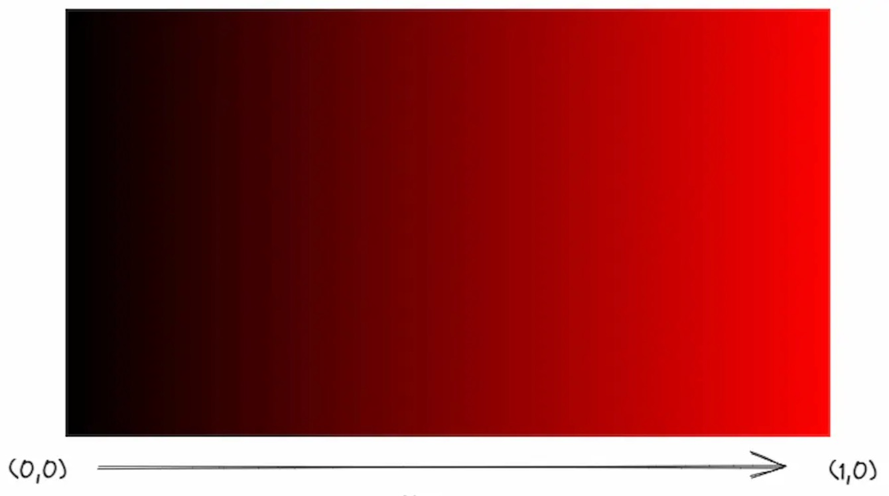

现在我们默认颜色的第 3 个值是 0，只看前 2 个值。可以看到 x 坐标从左边开始是黑色，值是 (0,0)，到最右边是纯红色，值是 (1,0)，而中间则是分布在 (0,1) 之间的值。从整体上看，我们得到了一个横向的渐变图案。

同样地，我们来看下 y 坐标的分布情况：

```glsl
void mainImage(out vec4 fragColor,in vec2 fragCoord){
    vec2 uv=fragCoord/iResolution.xy;
    fragColor=vec4(0.,uv.y,0.,1.);
}
```


可以看到 y 坐标从底下开始是黑色，值是 (0,0)，到最上面是纯绿色，值是 (0,1)，而中间则是分布在 (0,1) 之间的值。从整体上看，我们得到了一个纵向的渐变图案。

接下来，我们同时输出 x 坐标和 y 坐标的分布：

```glsl
void mainImage(out vec4 fragColor,in vec2 fragCoord){
    vec2 uv=fragCoord/iResolution.xy;
    fragColor=vec4(uv,0.,1.);
}
```

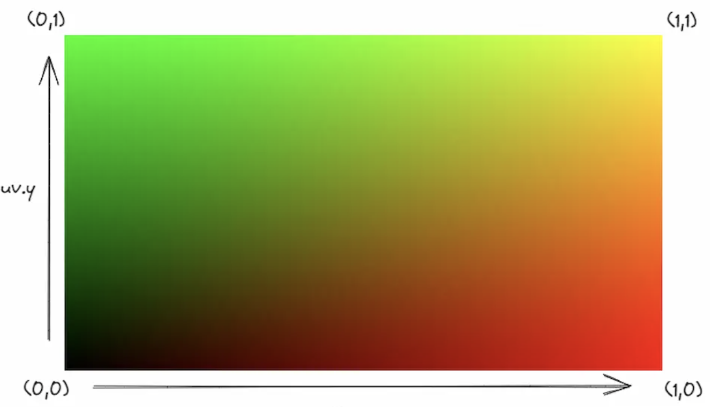

左下角原点是黑色，值是 (0,0)，右下角是红色，值是 (1,0)，左上角是绿色，值是 (0,1)，右上角是黄色，值是 (1,1)，中间的所有值在 (0,0) 到 (1,1) 这 2 个区间分布。从整体上看，我们得到了一个有多种颜色的渐变图案。

这就是所谓的 UV 坐标，它代表了图像（这里指画布）上所有像素的归一化后的坐标位置，其中 U 代表水平方向，V 代表垂直方向。

## 圆形的绘制

我们第一个要画的，可以说是图形界最常见的，也是最基本的图形——圆形。

说一下总体的思路吧：先计算 UV 坐标上的点到原点的距离，然后根据这些距离的值来设定对应点的颜色。

为了计算 UV 上点到原点的距离，我们可以用 GLSL 的内置函数——length 函数来实现。

```glsl
void mainImage(out vec4 fragColor,in vec2 fragCoord){
    vec2 uv=fragCoord/iResolution.xy;
    float d=length(uv);
    fragColor=vec4(vec3(d),1.);
}
```

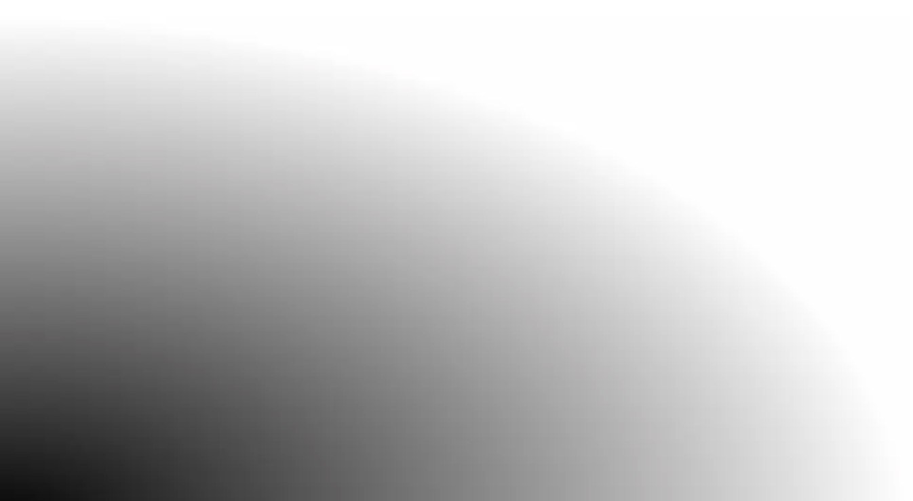

简单解释一下吧：左下角原点是黑色，值是 (0,0)，从原点向右上方向辐射的径向渐变，上面每个点的值代表的就是该点到原点的距离，越靠近原点距离越小，越接近黑色，反之越远离原点距离越大，越接近白色。

目前图形的位置在左下角，我们来把它挪到中间吧，将 UV 的坐标减去 0.5，再整体乘上 2。（注意这一行代码要放在 length 函数代码的上面。）

```glsl
void mainImage(out vec4 fragColor,in vec2 fragCoord){
    vec2 uv=fragCoord/iResolution.xy;
    uv=(uv-.5)*2.;
    float d=length(uv);
    fragColor=vec4(vec3(d),1.);
}
```

这一步被称为“UV 的居中处理”。你可能会有点不太理解为什么要这么做，没关系，我们先把 UV 坐标的结果直接输出到画布上。

之前的坐标系原点是第一幅图左下角的 (0,0)，我们通过整体减去 0.5，将原点变成了 (-0.5,-0.5)，也就是第二幅图左下角的那个点的位置，第一幅图的中点 (0.5,0.5) 就变成了第二幅图的中点 (0,0)，然后，我们将坐标整体乘上 2，将 0.5 变成了 1，这样归一化后能方便后续的计算。

> 注意：以后凡是有不理解的步骤，都可以像这样直接把结果输出到画布上，这是一种最简单有效的调试方式。

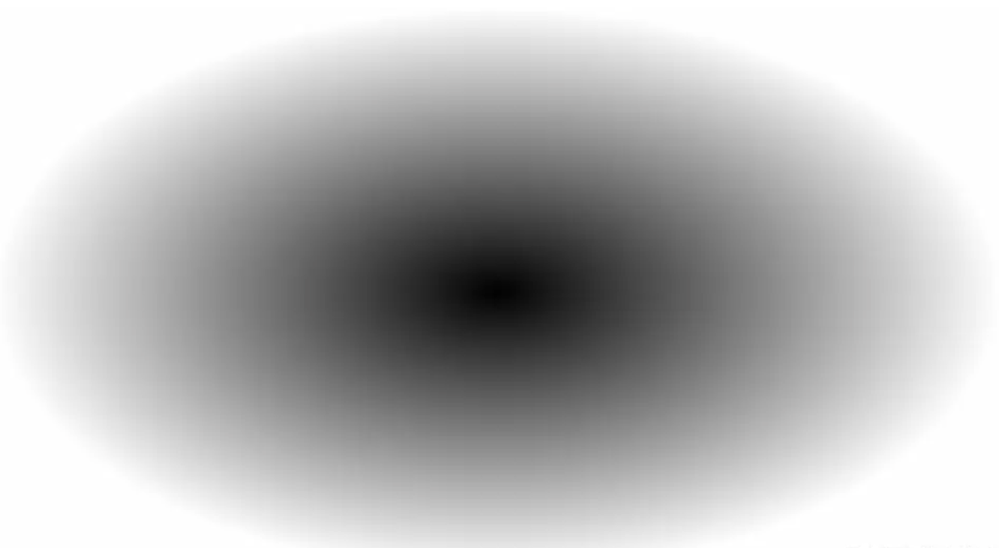

可以看到图形确实被挪到了中间。

然而，图形目前的形状是一个椭圆，这是为什么呢？因为 UV 坐标的值并不会自动地适应画布的比例，导致了图形被拉伸这一现象。

为了修正这一点，我们需要计算画布的比例，将画布长除以画布宽就能算出，再将 UV 的 x 坐标与比例相乘即可。（注意这一行代码要放在 length 函数代码的上面。）

```glsl
void mainImage(out vec4 fragColor,in vec2 fragCoord){
    vec2 uv=fragCoord/iResolution.xy;
    uv=(uv-.5)*2.;
    uv.x*=iResolution.x/iResolution.y;
    float d=length(uv);
    fragColor=vec4(vec3(d),1.);
}
```

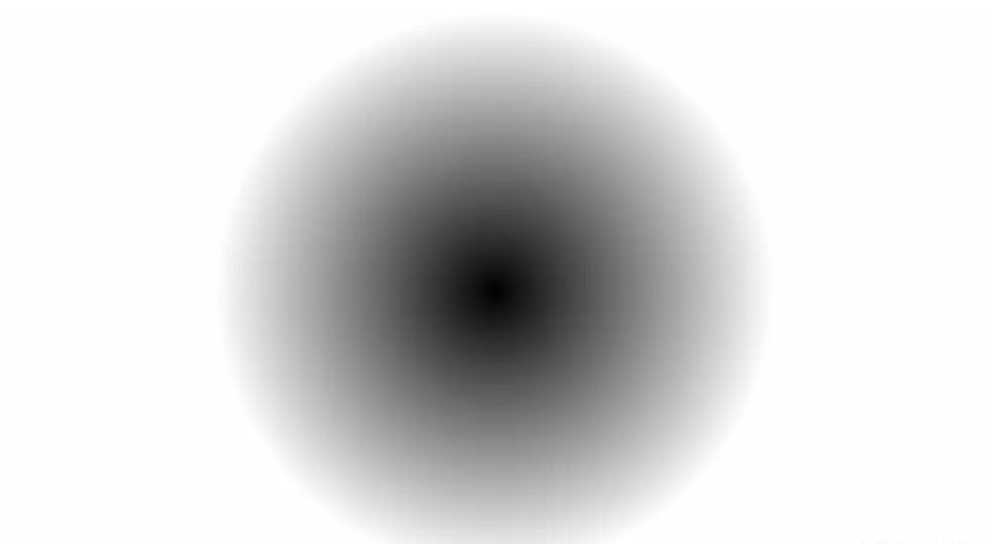

到目前为止，我们得到了一个完整的圆形径向渐变，但我们要的并不是渐变，而是实实在在的圆形。

我们观察下值的分布情况吧：中点的值是 (0,0)，颜色是纯黑色，然而，从中点开始向四周辐射的那些区域，它们的值都大于 0，都不是纯黑色，而我们的目标，是要把其中的一片区域也变成纯黑色，也就是说要把分布在这片区域上面的点的值也变成 0。

这里讲一个小知识：在 Shader 中，值的显示范围只会是[0,1]之间，也就是说，小于 0 的负数实际显示的值还是 0（黑色），大于 1 的数实际显示的值还是 1（白色）。我们可以利用这一点，给距离 d 减去一个值（这里我取了 0.5），制造出一片负数的区域，而这片区域不就是我们所要的黑色吗？（注意这一行代码要写在 length 函数的下面。）

```glsl
void mainImage(out vec4 fragColor,in vec2 fragCoord){
    vec2 uv=fragCoord/iResolution.xy;
    uv=(uv-.5)*2.;
    uv.x*=iResolution.x/iResolution.y;
    float d=length(uv);
    d-=.5;
    fragColor=vec4(vec3(d),1.);
}
```

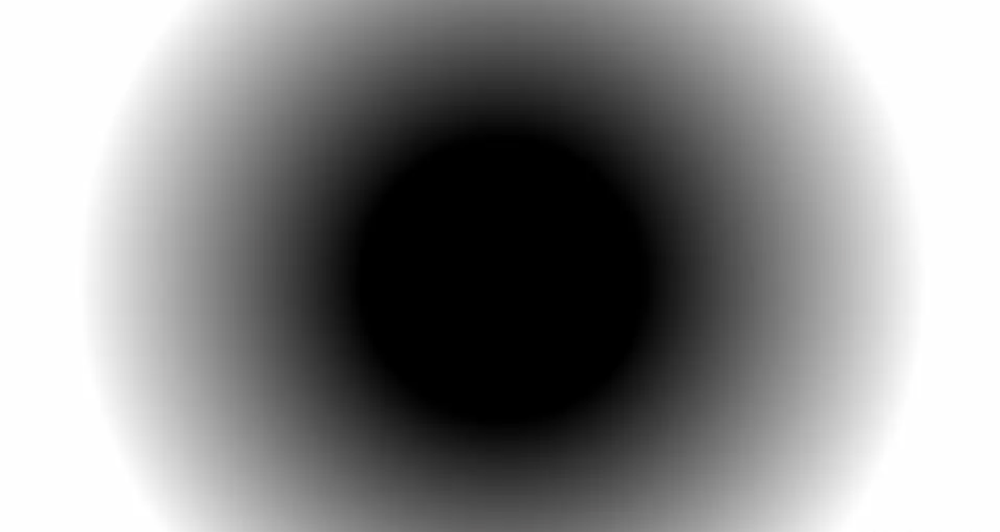

中间确实出现了纯黑色的圆形区域，然后我们只需把周围的渐变给消除，就能得到真正的圆形。

我们先定义一个中间变量 c，用 if 语句来判断距离 d 的大小，如果大于 0，代表的是除了中间纯黑区域外的渐变区域，将它们的值设为 1（白色）；反之，就代表的是中间的纯黑区域，将它们的值设为 0（黑色），最后将中间变量直接作为结果输出即可。

```glsl
void mainImage(out vec4 fragColor,in vec2 fragCoord){
  vec2 uv=fragCoord/iResolution.xy;
  uv=(uv-.5)*2.;
  uv.x*=iResolution.x/iResolution.y;
  float d=length(uv);
  d-=.5;
  float c=0.;
  if(d>0.){
    c=1.;
  }else{
    c=0.;
  }
  // fragColor=vec4(vec3(d),1.);
  fragColor=vec4(vec3(c),1.);
}
```

然而，在 Shader 的编写中，我们应当尽量避免使用 if 语句，为什么呢？因为 GPU 是并行处理结果的，而 if 语句会让处理器进行分支切换这一操作，处理多个分支会降低并行处理的性能。那么如何优化掉 if 语句呢？我们可以用 GLSL 其中的一个内置函数来代替它。

这个内置函数是 step 函数，也被称作“阶梯函数”，是因为它的图像是阶梯的形状，如下图所示：

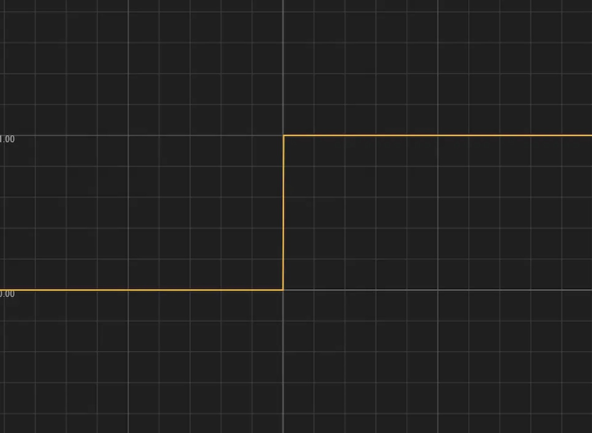

它的代码表示形式是这样的：

```glsl
step(edge,x)
```

它接受 2 个参数：边界值 edge 和目标值 x，如果目标值 x 大于边界值 edge，则返回 1，反之返回 0。

把刚刚的 if 语句给注释掉，用 step 函数来实现同样的逻辑。

```glsl
void mainImage(out vec4 fragColor,in vec2 fragCoord){
  vec2 uv=fragCoord/iResolution.xy;
  uv=(uv-.5)*2.;
  uv.x*=iResolution.x/iResolution.y;
  float d=length(uv);
  d-=.5;
  float c=step(0.,d);
  fragColor=vec4(vec3(c),1.);
}
```

这样做不仅简化了代码，还优化了 Shader 的性能，可以说是一举两得！

我们得到了一个实体的圆形。

尽管圆形是画出来了，但仔细一看，就会发现图形的周围有锯齿，比较影响美观，要消除它们。

我们再来认识一个 GLSL 的内置函数——smoothstep 函数，它也被称作“平滑阶梯函数”，是因为它的函数图像是一个平滑过的阶梯的形状，如下图所示：

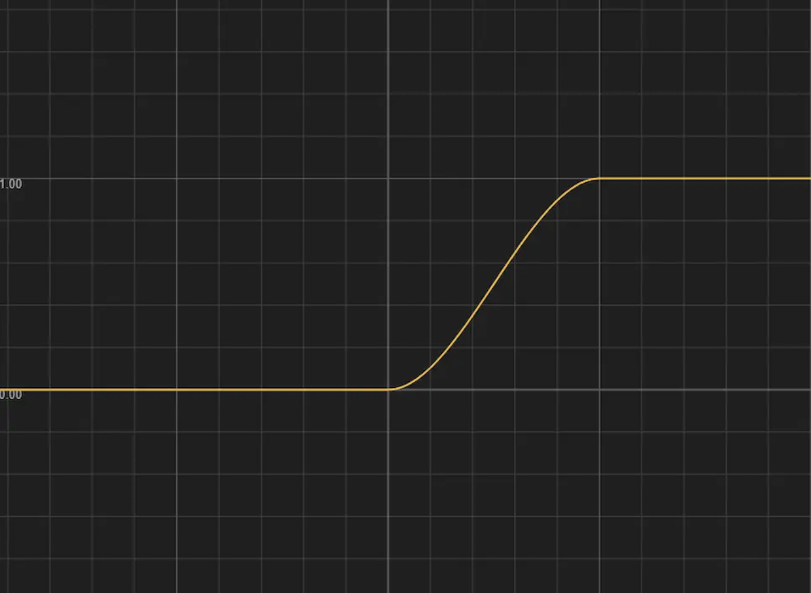

它的代码表示形式是这样的：

```glsl
smoothstep(edge1,edge2,x)
```

它的边界值比 step 函数要多一个，我们可以将它的边界值定为 edge1 和 edge2：如果目标值 x 小于边界值 edge1，则返回 0；如果目标值 x 大于边界值 edge2，则返回 1；如果目标值 x 在 2 个边界值之间，则返回从 0 到 1 平滑过渡的值。

我们把之前代码里的 step 函数的语句注释掉，改成用 smoothstep 函数来实现，再将第 2 个边界值设定为一个比 0 稍微大一点的值。这里我取了 0.02：

```glsl
void mainImage(out vec4 fragColor,in vec2 fragCoord){
  vec2 uv=fragCoord/iResolution.xy;
  uv=(uv-.5)*2.;
  uv.x*=iResolution.x/iResolution.y;
  float d=length(uv);
  d-=.5;
  float c=smoothstep(0.,.02,d);
  fragColor=vec4(vec3(c),1.);
}
```

这样，我们就得到了一个边缘是平滑的，没有锯齿的圆形。

## 图形效果

尽管 Shader 的绘图步骤确实要比传统的绘图方式要繁琐一点，但是也带来了很多意想不到的可能性，比方说，它能实现一些特殊的图形效果。

接下来，让我们从刚刚画好的那个圆形开始。

### 模糊效果

我们用到了 smoothstep 函数来绘制圆形，它的第二个参数我们用的是一个很小的值 0.02，现在，让我们尝试把这个值改大一点，比如 0.2：

```glsl
void mainImage(out vec4 fragColor,in vec2 fragCoord){
  vec2 uv=fragCoord/iResolution.xy;
  uv=(uv-.5)*2.;
  uv.x*=iResolution.x/iResolution.y;
  float d=length(uv);
  d-=.5;
  float c=smoothstep(0.,.2,d);
  fragColor=vec4(vec3(c),1.);
}
```


随着渐变区域的扩大，圆形的边缘变得模糊了起来，这是因为两个边界值的差变大了，渐变的区域也就随着变大了，这样就营造出了一种模糊的效果。

### 发光效果

这里我们不用 smoothstep 函数来绘制图形，我们取距离 d 的倒数，并且乘上一个比较小的值。

```glsl
void mainImage(out vec4 fragColor,in vec2 fragCoord){
  vec2 uv=fragCoord/iResolution.xy;
  uv=(uv-.5)*2.;
  uv.x*=iResolution.x/iResolution.y;
  float d=length(uv);
  float c=.25/d;
  fragColor=vec4(vec3(c),1.);
}
```

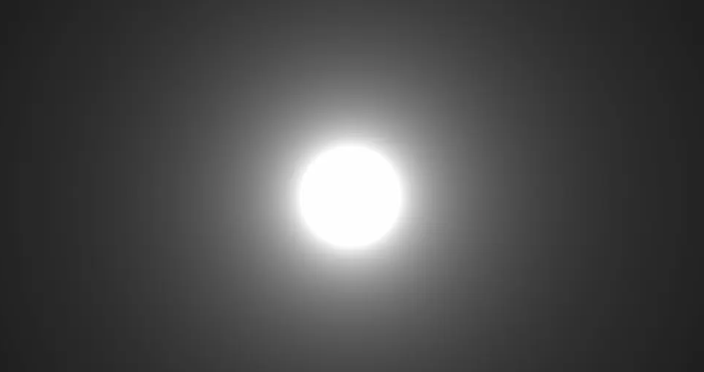

画面上出现了一个美丽的光球，它是怎么形成的呢？看下图：

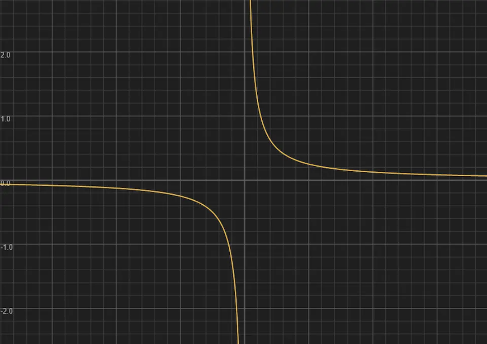

这是个反比例函数的图像，目前我们的输入值范围是 (0.,1.)，在这段范围内，输入值位于 (0.,.25) 时，输出值都大于 1，Shader 中比 1 大的值输出的还是白色，因此我们能看到中间的白色圆形部分；输入值位于 (.25,1.) 时，输出的值开始变成了比 1 小的值，而且是逐渐变化的，因此会产生一种渐变的效果。

目前光的辐射范围太大了，要稍微缩小一些。

我们来认识一个新的内置函数——pow 函数，它用于计算数字的指数幂，比如 pow(4.,3.)，返回的值就是 4 的 3 次方——64，也就是说，pow 这个函数能让数值指数般地增长。（当然，小数也是可以的，比如 pow(4.,3.6)。）

对 c 应用 pow 函数，指数取 1.6：

```glsl
void mainImage(out vec4 fragColor,in vec2 fragCoord){
  vec2 uv=fragCoord/iResolution.xy;
  uv=(uv-.5)*2.;
  uv.x*=iResolution.x/iResolution.y;
  float d=length(uv);
  float c=.25/d;
  c=pow(c,1.6);
  fragColor=vec4(vec3(c),1.);
}
```


为了理解这一步，依旧来看图：

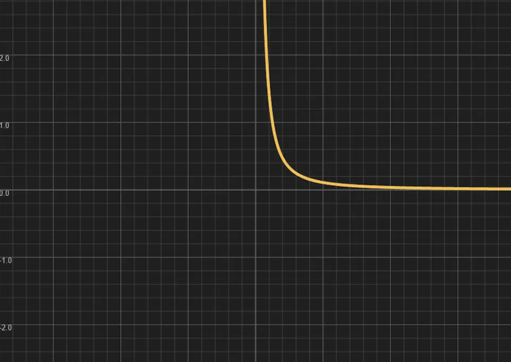

函数图像比之前要往下“躺”了一些，输出值总体变小了，这样光的辐射也稍微缩小了一点。

这样的发光效果换成别的绘图方式可能会很难实现吧，而 Shader 只要借助数学计算，就能轻松实现，是不是大开眼界了呢？

知道 Shader 的厉害之处后，让我们依旧回到那个最基本的圆形，开始绘制其他图形吧。
